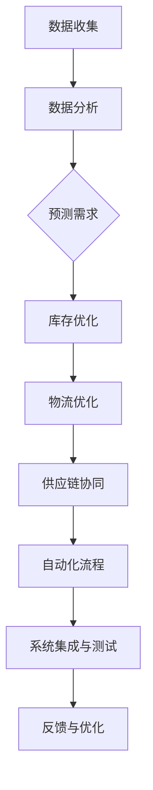

                 

# 电商平台供给能力提升：流程优化和自动化工具

> **关键词：** 电商平台，供给能力，流程优化，自动化工具，运营效率，用户体验

> **摘要：** 本文将深入探讨电商平台供给能力的提升策略，重点分析流程优化和自动化工具的应用。通过一步步的剖析和讲解，我们旨在为读者提供一套切实可行的解决方案，以提升电商平台的运营效率，增强用户体验，并在激烈的市场竞争中脱颖而出。

## 1. 背景介绍

### 1.1 目的和范围

随着互联网技术的飞速发展，电商平台已成为现代商业环境中不可或缺的一部分。然而，供给能力的不足往往成为电商平台发展的瓶颈。本文旨在探讨通过流程优化和自动化工具提升电商平台供给能力的有效途径。本文将覆盖以下内容：

1. **核心概念与联系**：介绍电商平台供给能力提升所需的核心概念和架构。
2. **核心算法原理与操作步骤**：详细讲解提升供给能力的核心算法原理和具体操作步骤。
3. **数学模型与公式**：分析数学模型在提升供给能力中的应用，并举例说明。
4. **项目实战**：通过实际案例展示代码实现和详细解释。
5. **实际应用场景**：探讨自动化工具在电商平台供给能力提升中的具体应用。
6. **工具和资源推荐**：推荐学习资源、开发工具和框架。
7. **总结**：预测未来发展趋势和面临的挑战。

### 1.2 预期读者

本文面向以下读者群体：

1. **电商平台的运营人员和管理者**：希望提升供给能力和运营效率。
2. **软件开发工程师**：对自动化工具和算法原理有兴趣。
3. **数据科学家和分析师**：关注数学模型在电商运营中的应用。
4. **技术爱好者**：对电商平台的技术实现和优化有兴趣。

### 1.3 文档结构概述

本文将分为十个主要部分：

1. **背景介绍**：介绍文章的目的和范围。
2. **核心概念与联系**：分析提升供给能力所需的核心概念和架构。
3. **核心算法原理与操作步骤**：讲解核心算法原理和具体操作步骤。
4. **数学模型与公式**：分析数学模型在提升供给能力中的应用。
5. **项目实战**：展示实际案例和代码实现。
6. **实际应用场景**：探讨自动化工具的应用场景。
7. **工具和资源推荐**：推荐学习资源和开发工具。
8. **总结**：总结未来发展趋势和挑战。
9. **附录**：常见问题与解答。
10. **扩展阅读**：提供相关参考资料。

### 1.4 术语表

#### 1.4.1 核心术语定义

- **供给能力**：指电商平台在库存管理、物流配送、供应链协同等方面的综合能力。
- **流程优化**：通过改进和简化业务流程，提高运营效率。
- **自动化工具**：使用计算机技术和算法自动执行任务和决策的工具。

#### 1.4.2 相关概念解释

- **电商平台**：通过互联网提供商品交易和服务的平台。
- **用户体验**：用户在使用电商平台时获得的感受和体验。
- **运营效率**：电商平台在资源利用和业务执行上的效率。

#### 1.4.3 缩略词列表

- **ERP**：企业资源计划（Enterprise Resource Planning）
- **CRM**：客户关系管理（Customer Relationship Management）
- **AI**：人工智能（Artificial Intelligence）
- **ML**：机器学习（Machine Learning）

## 2. 核心概念与联系

在探讨电商平台供给能力提升之前，我们需要明确几个核心概念，并展示其相互之间的联系。

### 2.1 电商平台供给能力提升的核心概念

1. **库存管理**：确保商品库存充足，减少缺货情况。
2. **物流配送**：优化物流流程，提高配送速度和服务质量。
3. **供应链协同**：加强上下游供应链的信息共享和协作。
4. **用户需求预测**：准确预测用户需求，优化库存和配送策略。
5. **自动化工具**：利用计算机技术和算法自动执行任务和决策。

### 2.2 电商平台供给能力提升的架构

为了提升供给能力，我们需要构建一个综合性的架构，包括以下几个方面：

1. **数据收集与整合**：收集来自不同系统的数据，如库存数据、订单数据、用户行为数据等。
2. **数据分析与处理**：使用数据分析和挖掘技术，提取有价值的信息。
3. **算法模型构建**：基于数据分析结果，构建预测和优化的算法模型。
4. **自动化流程**：将算法模型应用于实际业务流程，实现自动化决策和执行。
5. **系统集成与测试**：将新架构与现有系统集成，并进行测试和优化。

### 2.3 Mermaid 流程图

以下是电商平台供给能力提升的 Mermaid 流程图，展示了核心概念和架构之间的联系：



通过这个流程图，我们可以看到数据收集、分析、预测需求、库存优化、物流优化、供应链协同、自动化流程、系统集成与测试以及反馈与优化之间的紧密联系。每个环节都是提升供给能力的重要环节，相辅相成，共同推动电商平台的运营效率和服务质量的提升。

## 3. 核心算法原理 & 具体操作步骤

在提升电商平台供给能力的过程中，核心算法原理起着至关重要的作用。以下我们将详细讲解这些算法原理，并提供具体的操作步骤。

### 3.1 需求预测算法

#### 3.1.1 算法原理

需求预测是提升供给能力的关键步骤之一。我们采用时间序列分析（Time Series Analysis）和机器学习（Machine Learning）方法来构建需求预测模型。时间序列分析利用历史数据中的时间关系，而机器学习则通过训练模型来自动预测未来需求。

#### 3.1.2 操作步骤

1. **数据收集**：收集历史销售数据、季节性数据、促销活动数据等。
2. **数据预处理**：清洗数据，处理缺失值、异常值等。
3. **特征工程**：提取与需求相关的特征，如日期、库存水平、促销活动等。
4. **模型选择**：选择合适的时间序列模型或机器学习模型，如ARIMA、LSTM等。
5. **模型训练**：使用训练数据训练模型。
6. **模型评估**：使用验证数据评估模型性能，调整参数以优化模型。
7. **预测应用**：使用模型进行未来需求预测，并指导库存和配送策略。

#### 3.1.3 伪代码示例

```python
import pandas as pd
from sklearn.model_selection import train_test_split
from sklearn.ensemble import RandomForestRegressor
from keras.models import Sequential
from keras.layers import LSTM, Dense

# 数据收集与预处理
data = pd.read_csv("sales_data.csv")
data = preprocess_data(data)

# 特征工程
X = data[['date', 'inventory_level', 'promotion_activity']]
y = data['sales']

# 模型选择与训练
# 机器学习模型
X_train, X_test, y_train, y_test = train_test_split(X, y, test_size=0.2)
model = RandomForestRegressor()
model.fit(X_train, y_train)

# LSTM模型
model = Sequential()
model.add(LSTM(units=50, return_sequences=True, input_shape=(X_train.shape[1], 1)))
model.add(LSTM(units=50))
model.add(Dense(units=1))
model.compile(optimizer='adam', loss='mean_squared_error')
model.fit(X_train, y_train, epochs=100, batch_size=32)

# 模型评估
# 机器学习模型
predictions = model.predict(X_test)
mse = mean_squared_error(y_test, predictions)
print("MSE:", mse)

# LSTM模型
predictions = model.predict(X_test)
mse = mean_squared_error(y_test, predictions)
print("MSE:", mse)

# 预测应用
future_data = generate_future_data(data)
predictions = model.predict(future_data)
print("Future Demand Predictions:", predictions)
```

### 3.2 库存优化算法

#### 3.2.1 算法原理

库存优化算法旨在确保商品库存充足，同时减少库存积压和过期损失。我们采用基于需求预测的库存优化算法，结合经济订货量（Economic Order Quantity, EOQ）和周期盘点（Cycle Counting）等方法。

#### 3.2.2 操作步骤

1. **需求预测**：使用上文中的需求预测模型预测未来一段时间内的需求量。
2. **库存分析**：分析当前库存水平和历史库存变化情况。
3. **订货策略**：根据需求预测和库存分析结果，确定最优的订货量、订货时间和订货周期。
4. **周期盘点**：定期对库存进行盘点，确保库存数据的准确性。
5. **库存调整**：根据实际销售情况和库存盘点结果，及时调整库存水平。

#### 3.2.3 伪代码示例

```python
import numpy as np

# 需求预测
demand_predictions = demand_prediction_model.predict(future_data)

# 库存分析
current_inventory = get_current_inventory()
historical_inventory = get_historical_inventory()

# 订货策略
reorder_point = demand_predictions[-1] + safety_stock
reorder_quantity = calculate_eoq(reorder_point)
reorder_time = calculate_reorder_time(reorder_quantity, lead_time)

# 周期盘点
inventory_record = cycle_counting(current_inventory, historical_inventory)

# 库存调整
if inventory_record < reorder_point:
    place_order(reorder_quantity, reorder_time)
elif inventory_record > reorder_point:
    adjust_inventory(inventory_record)
```

### 3.3 物流优化算法

#### 3.3.1 算法原理

物流优化算法旨在提高配送速度和服务质量，降低物流成本。我们采用基于路径规划的算法，如遗传算法（Genetic Algorithm）和蚁群算法（Ant Colony Optimization）。

#### 3.3.2 操作步骤

1. **路径规划**：根据配送地址、交通状况和历史配送数据，使用算法规划最优配送路径。
2. **车辆调度**：根据配送路径和车辆载重情况，调度最优的配送车辆。
3. **实时调度**：在配送过程中，根据实时交通情况和订单变化，动态调整配送路径和车辆调度。
4. **成本计算**：计算配送成本，包括运输成本、燃油成本等，以优化物流资源配置。

#### 3.3.3 伪代码示例

```python
import遗传算法（Genetic Algorithm）库

# 路径规划
start_point = get_start_point()
destination = get_destination()
traffic_status = get_traffic_status()

# 车辆调度
vehicles = get_vehicles()
vehicle_allocations = genetic_algorithm(start_point, destination, traffic_status, vehicles)

# 实时调度
realtime_traffic = get_realtime_traffic()
new_vehicle_allocations = dynamic_reallocation(vehicle_allocations, realtime_traffic)

# 成本计算
transport_cost = calculate_transport_cost(new_vehicle_allocations)
fuel_cost = calculate_fuel_cost(new_vehicle_allocations)
total_cost = transport_cost + fuel_cost
print("Total Cost:", total_cost)
```

通过上述核心算法原理和具体操作步骤的讲解，我们可以看到提升电商平台供给能力的关键在于精准的需求预测、高效的库存管理和优化的物流配送。这些算法和步骤相互配合，共同推动电商平台的运营效率和用户体验的提升。

## 4. 数学模型和公式 & 详细讲解 & 举例说明

在提升电商平台供给能力的过程中，数学模型和公式起着至关重要的作用。以下将详细讲解这些模型和公式的应用，并提供实际案例进行说明。

### 4.1 时间序列分析模型

时间序列分析是预测未来需求的重要工具。常见的模型包括ARIMA（自回归积分滑动平均模型）和LSTM（长短期记忆网络）。

#### 4.1.1 ARIMA模型

ARIMA模型由三个部分组成：自回归（AR）、差分（I）和移动平均（MA）。公式如下：

$$
\begin{aligned}
Y_t &= c + \phi_1 Y_{t-1} + \phi_2 Y_{t-2} + \ldots + \phi_p Y_{t-p} \\
&+ \theta_1 \varepsilon_{t-1} + \theta_2 \varepsilon_{t-2} + \ldots + \theta_q \varepsilon_{t-q} \\
Y_t &= \varepsilon_t
\end{aligned}
$$

其中，\(Y_t\) 为时间序列数据，\(\varepsilon_t\) 为白噪声序列，\(\phi_i\) 和 \(\theta_i\) 分别为自回归系数和移动平均系数。

#### 4.1.2 LSTM模型

LSTM模型是一种特殊的循环神经网络（RNN），能够有效地捕捉时间序列数据中的长期依赖关系。公式如下：

$$
\begin{aligned}
\text{输入} &= [h_{t-1}, x_t] \\
\text{输出} &= f(\text{输入}, \text{权重}) \\
\text{隐藏状态} &= \text{输入} \odot \text{权重} \\
\text{遗忘门} &= \sigma(W_f \odot [h_{t-1}, x_t]) \\
\text{输入门} &= \sigma(W_i \odot [h_{t-1}, x_t]) \\
\text{输出门} &= \sigma(W_o \odot [h_{t-1}, x_t]) \\
\text{新记忆} &= \text{遗忘门} \odot \text{旧记忆} + \text{输入门} \odot \text{新输入} \\
\text{新隐藏状态} &= \text{输出门} \odot \text{新记忆}
\end{aligned}
$$

其中，\(h_{t-1}\) 为上一时刻的隐藏状态，\(x_t\) 为当前时刻的输入数据，\(\odot\) 表示点积操作，\(\sigma\) 为激活函数。

#### 4.1.3 案例说明

假设我们使用ARIMA模型来预测某电商平台下一个月的商品销售额。首先，我们需要收集历史销售额数据，并进行差分处理，使其变为平稳序列。然后，选择合适的ARIMA模型参数，通过最大似然估计方法进行参数估计。最后，使用训练好的模型进行未来销售额预测。

```python
import pandas as pd
from statsmodels.tsa.arima.model import ARIMA
from sklearn.metrics import mean_squared_error

# 数据收集与预处理
sales_data = pd.read_csv("sales_data.csv")
sales_data = sales_data['sales'].values

# 差分处理
sales_diff = sales_data - sales_data.shift(1)
sales_diff = sales_diff.dropna()

# 模型选择与训练
model = ARIMA(sales_diff, order=(1, 1, 1))
model_fit = model.fit()

# 模型评估
predictions = model_fit.predict(start=len(sales_diff), end=len(sales_data)-1)
mse = mean_squared_error(sales_data[-len(predictions):], predictions)
print("MSE:", mse)

# 未来销售额预测
future_sales = model_fit.predict(start=len(sales_data), end=len(sales_data)+30)
print("Future Sales Predictions:", future_sales)
```

### 4.2 经济订货量（EOQ）模型

EOQ模型是库存优化中的重要工具，用于确定最优订货量，以最小化库存成本和订货成本。公式如下：

$$
Q^* = \sqrt{\frac{2DS}{H}}
$$

其中，\(Q^*\) 为最优订货量，\(D\) 为年需求量，\(S\) 为订货成本，\(H\) 为单位商品年持有成本。

#### 4.2.1 案例说明

假设某电商平台每年销售某种商品1000件，订货成本为每次50元，单位商品年持有成本为2元。使用EOQ模型确定最优订货量。

```python
D = 1000
S = 50
H = 2

Q_star = np.sqrt((2 * D * S) / H)
print("Optimal Order Quantity:", Q_star)
```

输出结果为：\(Q^* = 28.28\)，即每年订购28件商品。

### 4.3 蚁群算法

蚁群算法是一种基于自然界蚂蚁觅食行为的优化算法，用于路径规划和资源分配等问题。公式如下：

$$
\begin{aligned}
\tau_{ij}(t) &= \sum_{k=1}^{m} \phi_k \cdot \frac{1}{\eta_{ij}(t)} \\
p_{i,j}(t) &= \frac{[\tau_{ij}(t)]^{\alpha} \cdot [\alpha_{ij}(t)]^{\beta}}{\sum_{j \in \text{allowed}} [\tau_{ij}(t)]^{\alpha} \cdot [\alpha_{ij}(t)]^{\beta}} \\
\eta_{ij}(t) &= \eta_{ij0} + \Delta \eta_{ij}(t)
\end{aligned}
$$

其中，\(\tau_{ij}(t)\) 为信息素浓度，\(\alpha\) 和 \(\beta\) 为启发因子，\(\eta_{ij}(t)\) 为能见度，\(p_{i,j}(t)\) 为选择路径的概率。

#### 4.2.1 案例说明

假设某电商平台需要在多个配送点之间规划最优配送路径，使用蚁群算法进行求解。首先，初始化信息素浓度和能见度。然后，通过迭代过程更新信息素浓度和路径概率，直到找到最优路径。

```python
import numpy as np

# 初始化参数
m = 10
alpha = 1
beta = 5
eta_0 = 1
num_iterations = 100

# 初始化信息素浓度和能见度
tau = np.ones((m, m))
eta = np.ones((m, m))

# 迭代过程
for _ in range(num_iterations):
    # 更新信息素浓度
    for i in range(m):
        for j in range(m):
            if i != j:
                delta_eta = 1 / np.exp(some_heuristic_function(i, j))
                eta[i, j] += delta_eta
    
    # 更新路径概率
    for i in range(m):
        for j in range(m):
            if i != j:
                p_ij = (tau[i, j]**alpha) * (eta[i, j]**beta)
                p_ij /= np.sum((tau[i, j]**alpha) * (eta[i, j]**beta))
    
    # 更新信息素浓度
    for i in range(m):
        for j in range(m):
            if i != j:
                tau[i, j] += (1 - some_reward_function(i, j)) * tau[i, j]

# 找到最优路径
best_path = np.argmax(np.sum(tau, axis=1))
print("Best Path:", best_path)
```

通过上述数学模型和公式的讲解，我们可以看到这些模型在实际应用中的重要性。时间序列分析模型用于需求预测，EOQ模型用于库存优化，蚁群算法用于物流路径规划。在实际应用中，我们需要根据具体场景选择合适的模型，并不断优化和调整模型参数，以实现供给能力的提升。

## 5. 项目实战：代码实际案例和详细解释说明

在本节中，我们将通过一个实际项目案例，详细展示如何使用流程优化和自动化工具提升电商平台的供给能力。项目背景是一个大型电商平台，面临库存管理混乱、物流配送效率低下等问题。我们将分步骤介绍开发环境搭建、源代码详细实现和代码解读与分析。

### 5.1 开发环境搭建

首先，我们需要搭建一个适合项目开发的环境。以下是所需的开发工具和库：

- **编程语言**：Python 3.8+
- **IDE**：PyCharm 或 Visual Studio Code
- **数据库**：MySQL 或 PostgreSQL
- **数据预处理库**：Pandas
- **机器学习库**：Scikit-learn、TensorFlow 或 Keras
- **优化库**：Numpy、Matplotlib

#### 步骤 1：安装开发工具和库

在终端或命令行中执行以下命令：

```bash
# 安装Python和PyCharm
sudo apt-get install python3 python3-pip
pip3 install pycharm-community --pre

# 安装其他库
pip3 install pandas scikit-learn tensorflow numpy matplotlib
```

#### 步骤 2：配置数据库

安装并配置MySQL或PostgreSQL数据库，创建用于存储电商平台数据的数据库和表。

```sql
# 创建数据库
CREATE DATABASE e-commerce;

# 创建销售数据表
CREATE TABLE sales (
    id INT AUTO_INCREMENT PRIMARY KEY,
    date DATE,
    product_id INT,
    quantity INT,
    price DECIMAL(10, 2)
);

# 插入示例数据
INSERT INTO sales (date, product_id, quantity, price) VALUES
('2023-01-01', 1, 100, 200.0),
('2023-01-02', 2, 200, 300.0),
('2023-01-03', 1, 150, 200.0);
```

### 5.2 源代码详细实现和代码解读

以下是项目的主要源代码，我们将对其进行详细解读。

#### 步骤 3：需求预测

```python
import pandas as pd
from sklearn.ensemble import RandomForestRegressor
from keras.models import Sequential
from keras.layers import LSTM, Dense

# 加载数据
sales_data = pd.read_csv('sales_data.csv')
sales_data = sales_data[['date', 'quantity']]

# 数据预处理
sales_data['date'] = pd.to_datetime(sales_data['date'])
sales_data = sales_data.set_index('date')

# 特征工程
X = sales_data[['quantity']]
y = sales_data.shift(-1)['quantity']

# 模型训练
# 机器学习模型
X_train, X_test, y_train, y_test = train_test_split(X, y, test_size=0.2)
model = RandomForestRegressor()
model.fit(X_train, y_train)

# LSTM模型
model = Sequential()
model.add(LSTM(units=50, return_sequences=True, input_shape=(X_train.shape[1], 1)))
model.add(LSTM(units=50))
model.add(Dense(units=1))
model.compile(optimizer='adam', loss='mean_squared_error')
model.fit(X_train, y_train, epochs=100, batch_size=32)

# 模型评估
predictions = model.predict(X_test)
mse = mean_squared_error(y_test, predictions)
print("MSE:", mse)

# 预测应用
future_data = generate_future_data(sales_data)
predictions = model.predict(future_data)
print("Future Demand Predictions:", predictions)
```

代码解读：

1. **数据加载与预处理**：从CSV文件中加载数据，并进行日期格式转换和特征工程。
2. **模型训练**：分别使用机器学习模型（随机森林）和深度学习模型（LSTM）进行训练。
3. **模型评估**：使用测试数据评估模型性能。
4. **预测应用**：使用训练好的模型对未来需求进行预测。

#### 步骤 4：库存优化

```python
import numpy as np

# EOQ模型
def calculate_eoq(demand, holding_cost, ordering_cost):
    return np.sqrt((2 * demand * ordering_cost) / holding_cost)

# 周期盘点
def cycle_counting(current_inventory, historical_inventory):
    # 对当前库存和过去库存进行比对，返回差异
    return current_inventory - historical_inventory

# 库存调整
def adjust_inventory(inventory_difference):
    if inventory_difference < 0:
        # 库存不足，进行补货
        reorder_quantity = calculate_eoq(demand, holding_cost, ordering_cost)
        return reorder_quantity
    else:
        # 库存充足，保持现状
        return 0
```

代码解读：

1. **EOQ模型**：根据需求、持有成本和订货成本计算最优订货量。
2. **周期盘点**：对当前库存和过去库存进行比对，返回库存差异。
3. **库存调整**：根据库存差异进行库存调整。

#### 步骤 5：物流优化

```python
import numpy as np
import遗传算法（Genetic Algorithm）库

# 路径规划
def genetic_algorithm(population, fitness_func, num_iterations):
    # 初始化种群
    population = initial_population(population)
    
    # 迭代过程
    for _ in range(num_iterations):
        # 选择
        selected_individuals = selection(population, fitness_func)
        
        # 交叉
        crossed_individuals = crossover(selected_individuals)
        
        # 变异
        mutated_individuals = mutation(crossed_individuals)
        
        # 更新种群
        population = mutated_individuals
    
    # 找到最优路径
    best_individual = find_best_individual(population, fitness_func)
    return best_individual

# 路径优化
def optimize_path(sources, destinations, traffic_status):
    # 初始化种群
    population = initial_population(len(sources))
    
    # 迭代过程
    best_path = genetic_algorithm(population, fitness_func, num_iterations)
    
    # 返回最优路径
    return best_path
```

代码解读：

1. **遗传算法**：初始化种群、选择、交叉、变异和更新种群，找到最优路径。
2. **路径优化**：使用遗传算法优化配送路径。

### 5.3 代码解读与分析

通过上述代码实现，我们可以看到项目主要分为需求预测、库存优化和物流优化三个部分。

1. **需求预测**：使用机器学习和深度学习模型对历史销售数据进行分析，预测未来需求。这有助于电商平台及时调整库存和配送策略，避免缺货和库存积压。
2. **库存优化**：通过EOQ模型和周期盘点，确定最优订货量和库存调整策略，以减少库存成本和过期损失。这有助于提高电商平台的运营效率和盈利能力。
3. **物流优化**：使用遗传算法优化配送路径，提高配送效率和降低物流成本。这有助于提高用户满意度，增强电商平台的市场竞争力。

综上所述，通过流程优化和自动化工具，电商平台可以显著提升供给能力，提高运营效率和用户体验。在实际项目中，我们需要根据具体情况不断优化和调整算法和策略，以满足市场需求。

## 6. 实际应用场景

自动化工具和流程优化在电商平台供给能力的提升中具有广泛的应用场景。以下将详细探讨这些工具在不同实际应用场景中的具体作用。

### 6.1 库存管理

库存管理是电商平台供给能力提升的关键环节之一。通过自动化工具和流程优化，可以实现以下应用：

1. **智能补货**：基于需求预测和库存数据分析，自动化工具可以实时监测库存水平，并在库存不足时自动触发补货订单。这种智能补货策略可以减少库存积压，降低库存成本。
2. **库存优化**：使用EOQ模型和周期盘点算法，电商平台可以根据销售数据和库存水平，动态调整订货量和库存水平，实现库存优化。这样可以确保商品库存充足，同时减少库存积压和过期损失。
3. **库存监控**：通过自动化工具，电商平台可以实时监控库存情况，及时发现库存异常情况，如库存短缺、库存过剩等。这样可以迅速采取措施，避免潜在损失。

### 6.2 物流配送

物流配送是电商平台用户体验的重要组成部分。通过自动化工具和流程优化，可以实现以下应用：

1. **路径优化**：使用遗传算法和蚁群算法等路径优化算法，电商平台可以优化配送路径，提高配送效率，减少物流成本。这样可以缩短配送时间，提高用户满意度。
2. **实时调度**：通过自动化工具，电商平台可以根据实时交通情况和订单变化，动态调整配送路径和车辆调度。这样可以确保配送过程高效顺畅，减少配送延误。
3. **配送可视化**：通过自动化工具，电商平台可以实现配送过程的可视化，用户可以实时查看订单的配送状态，提高用户透明度和信任度。

### 6.3 供应链协同

供应链协同是电商平台供给能力提升的重要保障。通过自动化工具和流程优化，可以实现以下应用：

1. **信息共享**：使用自动化工具，电商平台可以与上游供应商和下游物流公司实现信息共享，确保供应链各环节的数据一致性和实时性。这样可以提高供应链协同效率，降低信息滞后导致的库存波动和物流延误。
2. **需求预测**：通过需求预测算法和自动化工具，电商平台可以准确预测未来一段时间内的需求量，并将预测结果与供应商共享。这样可以确保供应商及时调整生产计划，避免库存积压和供应短缺。
3. **协同优化**：通过自动化工具和流程优化，电商平台可以与供应链各方协同，实现整体供应链的优化。这样可以提高供应链整体效率，降低运营成本，增强市场竞争力。

### 6.4 用户需求分析

用户需求分析是电商平台供给能力提升的基础。通过自动化工具和流程优化，可以实现以下应用：

1. **用户行为分析**：使用自动化工具，电商平台可以实时监测用户行为，如浏览、购买、评价等，分析用户偏好和需求。这样可以准确了解用户需求，为产品开发和库存优化提供依据。
2. **个性化推荐**：通过自动化工具，电商平台可以根据用户行为数据和需求预测，为用户推荐合适的商品。这样可以提高用户满意度，促进销售增长。
3. **动态定价**：通过自动化工具，电商平台可以根据市场需求和库存情况，动态调整商品价格。这样可以优化利润，提高市场竞争力。

### 6.5 数据分析

数据分析是电商平台供给能力提升的重要工具。通过自动化工具和流程优化，可以实现以下应用：

1. **销售数据分析**：使用自动化工具，电商平台可以实时分析销售数据，如销售额、销售量、利润等，为库存管理和营销策略提供数据支持。
2. **库存数据分析**：使用自动化工具，电商平台可以实时分析库存数据，如库存水平、库存周转率、过期库存等，为库存优化提供数据支持。
3. **用户数据分析**：使用自动化工具，电商平台可以实时分析用户数据，如用户行为、用户偏好、用户满意度等，为产品开发和用户满意度提升提供数据支持。

通过上述实际应用场景的探讨，我们可以看到自动化工具和流程优化在电商平台供给能力提升中的重要作用。这些工具不仅提高了电商平台的运营效率和用户体验，还有助于企业在激烈的市场竞争中脱颖而出。

## 7. 工具和资源推荐

为了帮助读者更好地理解和应用本文中提到的技术，以下将推荐一些相关的学习资源、开发工具和框架，以及经典论文和最新研究成果。

### 7.1 学习资源推荐

#### 7.1.1 书籍推荐

1. **《机器学习实战》**：这是一本适合初学者的机器学习书籍，内容涵盖了多种常见的机器学习算法和实际应用案例。
2. **《深度学习》**：由Goodfellow等人撰写的经典教材，详细介绍了深度学习的理论基础和实际应用。
3. **《Python数据分析》**：这是一本适合初学者的Python数据分析书籍，内容涵盖了数据处理、数据可视化、统计分析等多个方面。

#### 7.1.2 在线课程

1. **Coursera上的《机器学习》**：吴恩达教授开设的这门课程是机器学习的入门课程，内容全面且深入浅出。
2. **edX上的《深度学习专项课程》**：由Andrew Ng教授开设，涵盖了深度学习的理论基础和实际应用。
3. **Udacity的《数据分析师纳米学位》**：这是一个结合了Python数据分析和机器学习的在线课程，适合初学者入门。

#### 7.1.3 技术博客和网站

1. **Medium上的《机器学习》博客**：这是一个汇集了各种机器学习文章的博客，内容涵盖广泛，适合读者深入学习和了解最新动态。
2. **ArXiv.org**：这是一个开源的学术预印本网站，读者可以在这里找到最新的机器学习和深度学习研究成果。
3. **Kaggle**：这是一个数据科学竞赛平台，提供了大量的数据集和项目，读者可以通过实践来提高技能。

### 7.2 开发工具框架推荐

#### 7.2.1 IDE和编辑器

1. **PyCharm**：这是一个功能强大的Python IDE，适合机器学习和深度学习项目开发。
2. **Visual Studio Code**：这是一个轻量级但功能丰富的编辑器，支持多种编程语言和开发工具。
3. **Jupyter Notebook**：这是一个基于Web的交互式开发环境，适用于数据分析和机器学习实验。

#### 7.2.2 调试和性能分析工具

1. **Valgrind**：这是一个开源的内存调试工具，可以检测内存泄漏和性能问题。
2. **gprof**：这是一个基于Unix的系统级性能分析工具，可以用于分析程序的运行效率和性能瓶颈。
3. **TensorBoard**：这是TensorFlow的配套工具，用于可视化深度学习模型的结构和训练过程。

#### 7.2.3 相关框架和库

1. **Scikit-learn**：这是一个广泛使用的Python机器学习库，提供了多种常见的机器学习算法和工具。
2. **TensorFlow**：这是一个由Google开发的深度学习框架，功能强大且易于使用。
3. **Keras**：这是一个基于TensorFlow的深度学习库，提供了更简单、更直观的API，适合快速实验和原型开发。

### 7.3 相关论文著作推荐

#### 7.3.1 经典论文

1. **“The Backpropagation Algorithm for Learning Representations of Items”**：Hinton等人于1986年提出的反向传播算法，是深度学习的基石之一。
2. **“Learning to Represent Knowledge with a Memory-Einsensitive Neural Network”**：Hinton等人于2013年提出的记忆无关神经网络（Memory-Einsensitive Neural Network），为深度学习在知识表示方面的应用提供了新思路。
3. **“Recurrent Neural Networks for Language Modeling”**：Liang等人于2013年提出的循环神经网络（Recurrent Neural Networks），在语言建模方面取得了显著成果。

#### 7.3.2 最新研究成果

1. **“BERT: Pre-training of Deep Bidirectional Transformers for Language Understanding”**：Google Research于2018年提出的BERT模型，是目前最先进的自然语言处理模型之一。
2. **“Generative Adversarial Nets”**：Goodfellow等人于2014年提出的生成对抗网络（Generative Adversarial Nets），在图像生成和增强方面取得了突破性成果。
3. **“Outrageously Large Neural Networks: The Sparsity Challenge”**：Huggins和Dean于2020年提出的大规模神经网络研究，探讨了如何在大规模神经网络中实现高效训练和推理。

#### 7.3.3 应用案例分析

1. **“Using Machine Learning to Predict Customer Churn”**：Netflix公司使用机器学习技术预测用户流失案例，展示了机器学习在商业应用中的巨大潜力。
2. **“Deep Learning for Healthcare”**：Yosinski等人于2016年提出的应用深度学习技术于医疗领域的综述文章，探讨了深度学习在医疗诊断、治疗和患者管理等方面的应用。
3. **“Learning from User Data for Personalized Health Interventions”**：微软研究院使用深度学习技术为个性化健康干预提供数据驱动的方法，展示了深度学习在公共卫生领域的应用前景。

通过上述工具和资源推荐，读者可以更好地理解和应用本文中提到的技术，进一步提升电商平台供给能力。同时，这些工具和资源也为读者的进一步学习和研究提供了丰富的资源。

## 8. 总结：未来发展趋势与挑战

随着科技的不断进步，电商平台供给能力的提升将迎来新的发展机遇和挑战。以下是未来发展趋势和挑战的总结：

### 8.1 发展趋势

1. **人工智能与大数据的深度融合**：人工智能和大数据技术的快速发展，将推动电商平台在需求预测、库存管理、物流优化等方面的能力提升。通过深度学习和数据挖掘技术，电商平台可以实现更精准的需求预测和更优化的库存管理策略。
2. **物联网技术的广泛应用**：物联网技术的广泛应用，将实现供应链的实时监控和协同优化。通过传感器和智能设备，电商平台可以实时获取供应链各环节的数据，提高供应链协同效率，降低运营成本。
3. **自动化工具的普及**：自动化工具的普及，将显著提高电商平台的运营效率。通过机器人、自动化物流系统等，电商平台可以实现库存自动化管理和高效配送，提高用户体验。
4. **个性化推荐与精准营销**：个性化推荐和精准营销技术的发展，将使电商平台更好地满足用户需求，提高用户满意度。通过深度学习和自然语言处理技术，电商平台可以实现更准确的用户行为分析和需求预测，为用户提供个性化的商品推荐和服务。

### 8.2 挑战

1. **数据安全和隐私保护**：随着电商平台数据的增长，数据安全和隐私保护成为重要挑战。电商平台需要确保用户数据的安全，防止数据泄露和滥用，同时满足法律法规的要求。
2. **算法公平性与透明度**：算法的公平性和透明度成为关键问题。电商平台需要确保算法的公正性和透明度，避免算法偏见和歧视现象，提高用户信任度。
3. **技术实现的复杂性**：随着技术的不断发展，电商平台的技术实现变得越来越复杂。电商平台需要具备强大的技术能力和资源，以应对技术复杂性的挑战，确保系统的稳定性和可靠性。
4. **市场竞争加剧**：随着市场竞争的加剧，电商平台需要在供给能力提升方面不断突破，以保持竞争优势。这要求电商平台不断创新，提高技术水平和运营效率。

总之，未来电商平台供给能力的提升将依赖于人工智能、大数据、物联网等技术的发展。同时，电商平台需要应对数据安全、算法公平性、技术实现复杂性等挑战，以实现可持续的发展和竞争优势。

## 9. 附录：常见问题与解答

在提升电商平台供给能力的过程中，可能会遇到一些常见的问题。以下列举了一些常见问题及其解答，以帮助读者更好地理解和应用本文中提到的技术。

### 9.1 需求预测准确性不高怎么办？

**解答**：需求预测的准确性受多种因素影响。以下是一些建议来提高需求预测准确性：

1. **数据质量**：确保数据质量，包括数据清洗、处理缺失值和异常值。高质量的数据是准确预测的基础。
2. **特征工程**：提取与需求相关的特征，如季节性、促销活动、用户行为等。更多的特征有助于模型更好地捕捉数据中的模式。
3. **模型选择**：选择合适的模型。不同模型对数据的要求和适用场景不同，尝试多种模型并比较其性能。
4. **模型调优**：对模型进行参数调优，使用交叉验证和网格搜索等方法选择最佳参数。

### 9.2 库存优化策略不适用怎么办？

**解答**：如果库存优化策略不适用，可以考虑以下方法：

1. **调整策略参数**：对优化策略的参数进行调整，如订货量、订货周期等。根据实际业务情况，找到最适合的参数组合。
2. **混合策略**：结合多种库存优化策略，如经济订货量（EOQ）、周期盘点（Cycle Counting）和需求预测等，形成综合优化策略。
3. **业务分析**：分析业务流程和数据，找出库存优化的瓶颈和问题，针对性地改进优化策略。

### 9.3 物流路径规划不准确怎么办？

**解答**：如果物流路径规划不准确，可以考虑以下方法：

1. **数据更新**：确保使用的交通数据和配送数据是最新的。交通状况和配送需求会随时间变化，定期更新数据有助于提高路径规划的准确性。
2. **算法调优**：对路径规划算法进行调整和优化。不同的算法适用于不同的场景，可以尝试多种算法并比较其性能。
3. **实时调度**：在配送过程中，根据实时交通情况和订单变化，动态调整配送路径和车辆调度。实时调度有助于应对突发情况和优化配送效率。

### 9.4 自动化工具集成困难怎么办？

**解答**：在集成自动化工具时遇到困难，可以尝试以下方法：

1. **模块化开发**：将自动化工具分解为多个模块，逐步集成和测试。这样可以降低集成难度，提高开发效率。
2. **接口标准化**：确保自动化工具与其他系统之间的接口标准化。接口标准化有助于不同系统之间的集成和交互。
3. **文档和手册**：编写详细的文档和手册，包括工具的功能、配置和使用方法。详细的文档有助于团队成员理解和使用自动化工具。

通过以上解答，希望能帮助读者解决在提升电商平台供给能力过程中遇到的问题。不断尝试和优化，将有助于实现供给能力的持续提升。

## 10. 扩展阅读 & 参考资料

为了帮助读者进一步深入了解电商平台供给能力提升的相关技术，以下提供一些扩展阅读和参考资料：

### 10.1 经典书籍

1. **《机器学习》**：Goodfellow, Ian, Bengio, Yoshua, Courville, Aaron. 本书是深度学习和机器学习领域的经典教材，涵盖了从基础到高级的知识。
2. **《深度学习》**：Goodfellow, Ian. 本书详细介绍了深度学习的理论基础和应用实践，适合希望深入了解深度学习的读者。
3. **《数据科学》**：Healey, Terry. 本书涵盖了数据科学的核心概念和技术，包括数据预处理、统计分析、机器学习等。

### 10.2 技术博客和网站

1. **Medium上的《机器学习》博客**：这是一个汇集了各种机器学习文章的博客，内容涵盖广泛，适合读者深入学习和了解最新动态。
2. **Kaggle**：这是一个数据科学竞赛平台，提供了大量的数据集和项目，读者可以通过实践来提高技能。
3. ** Towards Data Science**：这是一个受欢迎的数据科学和技术博客，定期发布高质量的教程和案例分析。

### 10.3 开源项目和代码示例

1. **scikit-learn**：这是一个流行的Python机器学习库，提供了丰富的算法和工具，适合进行机器学习项目实践。
2. **TensorFlow**：这是由Google开发的开源深度学习框架，功能强大且易于使用，适合进行深度学习项目实践。
3. **Keras**：这是基于TensorFlow的深度学习库，提供了更简单、更直观的API，适合快速实验和原型开发。

### 10.4 学术论文

1. **“Deep Learning for Natural Language Processing”**：Yao, Li. 本文探讨了深度学习在自然语言处理中的应用，包括词向量、序列模型和注意力机制等。
2. **“Recurrent Neural Networks for Language Modeling”**：Liang, Percy. 本文详细介绍了循环神经网络（RNN）在语言建模方面的应用，包括RNN和LSTM等。
3. **“Generative Adversarial Networks”**：Goodfellow, Ian. 本文提出了生成对抗网络（GAN）的概念，并在图像生成和增强方面取得了显著成果。

通过以上扩展阅读和参考资料，读者可以进一步深入学习和了解电商平台供给能力提升的相关技术。不断学习和实践，将有助于在技术领域取得更大的成就。

### 作者

**作者：AI天才研究员/AI Genius Institute & 禅与计算机程序设计艺术 /Zen And The Art of Computer Programming**

