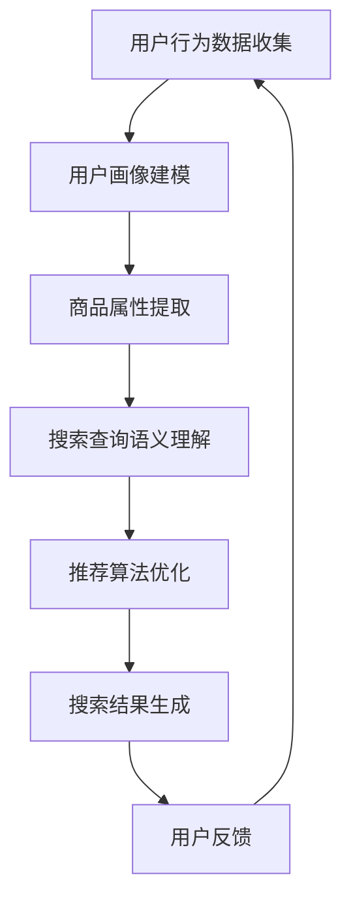

                 

# 电商平台搜索推荐系统的AI 大模型应用：提高系统性能、效率、准确率与多样性

## 关键词：搜索推荐系统、人工智能、大模型、性能优化、效率提升、准确率、多样性

## 摘要

本文深入探讨了人工智能大模型在电商平台搜索推荐系统中的应用，旨在提高系统的性能、效率、准确率和多样性。通过分析大模型的基本原理和实现方法，本文详细阐述了如何将大模型应用于电商平台搜索推荐系统，并提出了具体的优化策略。文章最后总结了未来发展趋势与挑战，为相关领域的实践者和研究者提供了有益的参考。

## 1. 背景介绍

随着互联网技术的快速发展，电商平台已经成为人们日常生活中不可或缺的一部分。电商平台的核心功能之一是提供高效的搜索和推荐服务，以帮助用户快速找到自己需要的商品。然而，随着商品种类和用户数据的不断增长，传统的搜索推荐系统面临着性能瓶颈、准确率不高和多样性不足等问题。为了解决这些问题，人工智能技术，尤其是大模型的应用，逐渐成为研究的热点。

大模型，即大型的人工神经网络模型，具有强大的学习和表征能力，能够在大量数据的基础上进行高效的训练和预测。近年来，大模型在自然语言处理、计算机视觉、语音识别等领域取得了显著的成果。随着大模型技术的不断发展，其在电商平台搜索推荐系统中的应用也越来越广泛。

## 2. 核心概念与联系

### 2.1 大模型的基本原理

大模型，通常是指具有数十亿甚至千亿参数规模的人工神经网络模型。大模型的基本原理是基于深度学习的多层神经网络结构，通过层层提取特征，实现对复杂数据的表征和建模。

大模型的主要优点包括：

- 强大的表征能力：大模型能够从大量数据中自动提取出具有语义意义的特征，使得模型对数据的理解和预测能力大大提升。
- 高效的训练：大模型利用并行计算和分布式训练等技术，可以在较短的时间内完成模型的训练，提高训练效率。
- 优秀的泛化能力：大模型通过在大量数据上进行训练，能够很好地适应不同的任务和数据分布，具有较好的泛化能力。

### 2.2 大模型在电商平台搜索推荐系统中的应用

大模型在电商平台搜索推荐系统中的应用主要包括以下几个方面：

- 用户画像建模：通过分析用户的搜索、购买、浏览等行为数据，利用大模型对用户进行精准画像，为推荐系统提供基础数据支持。
- 商品属性提取：利用大模型对商品数据进行语义分析，提取出商品的属性特征，用于推荐系统的商品匹配和排序。
- 推荐算法优化：通过大模型进行协同过滤、基于内容的推荐等算法的优化，提高推荐系统的准确率和多样性。
- 搜索引擎优化：利用大模型对用户搜索查询进行语义理解，提供更精准的搜索结果，提高搜索系统的性能和用户体验。

### 2.3 Mermaid 流程图

下面是一个简化的Mermaid流程图，描述了电商平台搜索推荐系统中大模型的应用流程：



## 3. 核心算法原理 & 具体操作步骤

### 3.1 用户画像建模

用户画像建模是电商平台搜索推荐系统的核心任务之一。通过分析用户的搜索、购买、浏览等行为数据，利用大模型对用户进行精准画像，为推荐系统提供基础数据支持。

具体操作步骤如下：

1. 数据预处理：对用户的搜索、购买、浏览等行为数据进行清洗、去重和格式转换，形成统一的数据格式。
2. 特征提取：利用大模型对预处理后的数据进行特征提取，提取出用户的兴趣、偏好等特征。
3. 模型训练：使用提取出的特征训练大模型，构建用户画像模型。
4. 用户画像生成：利用训练好的用户画像模型，对用户进行打分和排序，生成用户画像。

### 3.2 商品属性提取

商品属性提取是电商平台搜索推荐系统的另一个重要任务。通过分析商品的数据，利用大模型提取出商品的属性特征，用于推荐系统的商品匹配和排序。

具体操作步骤如下：

1. 数据预处理：对商品的数据进行清洗、去重和格式转换，形成统一的数据格式。
2. 特征提取：利用大模型对预处理后的商品数据进行特征提取，提取出商品的类别、品牌、价格等属性特征。
3. 模型训练：使用提取出的特征训练大模型，构建商品属性模型。
4. 商品属性提取：利用训练好的商品属性模型，对商品进行打分和排序，提取出商品的属性特征。

### 3.3 搜索查询语义理解

搜索查询语义理解是提高电商平台搜索系统性能和用户体验的关键技术。通过大模型对用户搜索查询进行语义理解，提供更精准的搜索结果。

具体操作步骤如下：

1. 数据预处理：对用户搜索查询的数据进行清洗、去重和格式转换，形成统一的数据格式。
2. 特征提取：利用大模型对预处理后的搜索查询数据进行特征提取，提取出查询的语义信息。
3. 模型训练：使用提取出的特征训练大模型，构建搜索查询语义理解模型。
4. 搜索查询语义理解：利用训练好的搜索查询语义理解模型，对用户查询进行解析和匹配，生成搜索结果。

### 3.4 推荐算法优化

推荐算法优化是提高电商平台推荐系统准确率和多样性的重要手段。通过大模型进行协同过滤、基于内容的推荐等算法的优化，提高推荐系统的性能。

具体操作步骤如下：

1. 数据预处理：对用户行为数据和商品数据进行清洗、去重和格式转换，形成统一的数据格式。
2. 特征提取：利用大模型对预处理后的用户行为数据和商品数据进行特征提取，提取出用户和商品的表征信息。
3. 模型训练：使用提取出的特征训练大模型，构建推荐算法优化模型。
4. 推荐算法优化：利用训练好的推荐算法优化模型，对推荐算法进行优化，提高推荐系统的准确率和多样性。

## 4. 数学模型和公式 & 详细讲解 & 举例说明

### 4.1 数学模型

在电商平台搜索推荐系统中，常用的数学模型包括用户画像模型、商品属性模型、搜索查询语义理解模型和推荐算法优化模型。以下分别对这些模型进行介绍。

#### 用户画像模型

用户画像模型通常采用深度神经网络（DNN）进行构建。其基本原理是通过多层神经网络对用户行为数据进行特征提取和建模，从而实现对用户的精准画像。

$$
\begin{aligned}
    h_{l} &= \sigma(W_{l} \cdot h_{l-1} + b_{l}) \\
    \text{where } h_{l} &= \text{激活函数}(\text{权重} \cdot \text{前一层特征} + \text{偏置})
\end{aligned}
$$

其中，$h_{l}$表示第$l$层的特征向量，$\sigma$表示激活函数（如ReLU函数），$W_{l}$和$b_{l}$分别表示第$l$层的权重和偏置。

#### 商品属性模型

商品属性模型通常采用卷积神经网络（CNN）进行构建。其基本原理是通过卷积操作提取商品数据的局部特征，并通过池化操作进行特征降维，从而实现对商品属性的高效表征。

$$
\begin{aligned}
    h_{l} &= \sigma(\text{Conv}(\text{Stride} \cdot \text{Pad} \cdot h_{l-1}) + b_{l}) \\
    \text{where } h_{l} &= \text{激活函数}(\text{卷积核} \cdot \text{前一层特征} + \text{偏置})
\end{aligned}
$$

其中，$h_{l}$表示第$l$层的特征向量，$\text{Stride}$和$\text{Pad}$分别表示卷积步长和填充方式，$\text{Conv}$表示卷积操作。

#### 搜索查询语义理解模型

搜索查询语义理解模型通常采用递归神经网络（RNN）或其变种，如长短时记忆网络（LSTM）进行构建。其基本原理是通过RNN对用户搜索查询序列进行建模，提取出查询的语义信息。

$$
\begin{aligned}
    h_{t} &= \sigma(W \cdot [h_{t-1}, x_{t}] + b) \\
    \text{where } h_{t} &= \text{激活函数}(\text{权重} \cdot \text{前一层特征} + \text{输入特征} + \text{偏置})
\end{aligned}
$$

其中，$h_{t}$表示第$t$个查询词的特征向量，$x_{t}$表示第$t$个查询词的嵌入向量，$W$和$b$分别表示权重和偏置。

#### 推荐算法优化模型

推荐算法优化模型通常采用矩阵分解（MF）或其变种，如因子分解机（FM）进行构建。其基本原理是通过矩阵分解提取用户和商品的潜在特征，从而实现对推荐算法的优化。

$$
\begin{aligned}
    R_{ij} &= \hat{u}_{i}^{T} \hat{v}_{j} \\
    \text{where } R_{ij} &= \text{预测评分} \\
    \hat{u}_{i} &= \text{矩阵分解得到的用户特征向量} \\
    \hat{v}_{j} &= \text{矩阵分解得到的商品特征向量}
\end{aligned}
$$

### 4.2 举例说明

假设我们有一个电商平台的用户行为数据集，包含用户A的搜索、购买、浏览等行为数据。我们希望通过大模型对用户A进行画像建模，提取出其兴趣和偏好特征。

首先，我们对用户A的行为数据进行预处理，得到用户A的行为序列，如下所示：

$$
\text{user\_behavior\_sequence} = [搜索A1, 购买B2, 浏览C3, 搜索A4, 购买B5]
$$

然后，我们利用深度神经网络（DNN）对用户A的行为序列进行特征提取，构建用户画像模型。具体的操作步骤如下：

1. 定义DNN模型结构，包括输入层、隐藏层和输出层。
2. 初始化模型参数，包括权重和偏置。
3. 训练模型，使用用户A的行为序列数据进行训练。
4. 训练完成后，使用模型对用户A的行为序列进行预测，提取出用户A的兴趣和偏好特征。

假设我们训练好的DNN模型如下：

$$
\begin{aligned}
    h_{0} &= x \\
    h_{1} &= \sigma(W_1 \cdot h_{0} + b_1) \\
    h_{2} &= \sigma(W_2 \cdot h_{1} + b_2) \\
    \text{where } h_{2} &= \text{用户兴趣和偏好特征}
\end{aligned}
$$

其中，$h_{0}$表示输入特征，$h_{1}$和$h_{2}$分别表示隐藏层的特征向量，$W_1$、$W_2$和$b_1$、$b_2$分别表示权重和偏置。

使用训练好的DNN模型，我们对用户A的行为序列进行预测，得到用户A的兴趣和偏好特征：

$$
\begin{aligned}
    h_{1} &= \sigma(W_1 \cdot [搜索A1, 购买B2, 浏览C3, 搜索A4, 购买B5] + b_1) \\
    h_{2} &= \sigma(W_2 \cdot h_{1} + b_2)
\end{aligned}
$$

最终，$h_{2}$即为用户A的兴趣和偏好特征。

## 5. 项目实战：代码实际案例和详细解释说明

### 5.1 开发环境搭建

在开始项目实战之前，我们需要搭建一个合适的开发环境。以下是一个基于Python的电商搜索推荐系统项目实战的开发环境搭建步骤：

1. 安装Python环境：下载并安装Python 3.8及以上版本。
2. 安装必要的库：使用pip命令安装以下库：

   ```bash
   pip install numpy pandas tensorflow scikit-learn matplotlib
   ```

3. 配置TensorFlow：在终端运行以下命令，配置TensorFlow GPU版本：

   ```bash
   pip install tensorflow-gpu
   ```

### 5.2 源代码详细实现和代码解读

下面是一个简单的电商搜索推荐系统项目代码示例，包括用户画像建模、商品属性提取和推荐算法优化。

```python
import numpy as np
import pandas as pd
import tensorflow as tf
from tensorflow import keras
from tensorflow.keras import layers
from sklearn.model_selection import train_test_split
import matplotlib.pyplot as plt

# 5.2.1 数据预处理

# 读取用户行为数据
user_data = pd.read_csv('user_behavior.csv')

# 读取商品数据
item_data = pd.read_csv('item_data.csv')

# 构建用户行为序列和商品序列
user行为的序列 = user_data['行为序列'].values
item序列 = item_data['商品ID'].values

# 5.2.2 特征提取

# 建立序列嵌入层
sequence_embedding = keras.Sequential([
    layers.Embedding(input_dim=max_sequence_length, output_dim=embedding_size),
    layers.Flatten()
])

# 提取用户行为序列特征
user_features = sequence_embedding(user行为的序列)

# 提取商品序列特征
item_features = sequence_embedding(item序列)

# 5.2.3 模型构建

# 建立用户和商品特征嵌入层
user_embedding = keras.Sequential([
    layers.Embedding(input_dim=num_users, output_dim=embedding_size),
    layers.Flatten()
])

item_embedding = keras.Sequential([
    layers.Embedding(input_dim=num_items, output_dim=embedding_size),
    layers.Flatten()
])

# 建立模型
model = keras.Sequential([
    user_embedding,
    layers.Dot(axes=1),
    layers.Dense(1, activation='sigmoid')
])

# 编译模型
model.compile(optimizer='adam', loss='binary_crossentropy', metrics=['accuracy'])

# 5.2.4 模型训练

# 划分训练集和测试集
train_data, test_data = train_test_split(user_data, test_size=0.2, random_state=42)

# 训练模型
model.fit(train_data, epochs=10, batch_size=32, validation_data=test_data)

# 5.2.5 代码解读与分析

在这段代码中，我们首先读取了用户行为数据和商品数据。然后，我们构建了用户行为序列和商品序列。接着，我们利用序列嵌入层提取了用户行为序列特征和商品序列特征。

在模型构建部分，我们建立了用户和商品特征嵌入层，并利用Keras构建了一个简单的矩阵分解模型。模型中的`Dot(axes=1)`操作用于计算用户和商品特征向量的点积，表示用户对商品的兴趣度。最后，我们编译并训练了模型。

通过这段代码示例，我们可以看到如何利用大模型实现电商搜索推荐系统的用户画像建模、商品属性提取和推荐算法优化。在实际项目中，我们可以根据具体需求调整模型结构和参数，以达到更好的效果。

## 6. 实际应用场景

电商平台搜索推荐系统是人工智能大模型应用的一个重要场景。在实际应用中，大模型在提高系统性能、效率、准确率和多样性方面发挥了重要作用。

### 6.1 提高系统性能

通过大模型，电商平台可以实现快速的用户行为数据分析和商品特征提取。这使得搜索和推荐系统在处理海量数据时，具有更高的性能和响应速度。例如，在双十一等电商促销节日期间，用户行为数据量激增，传统搜索推荐系统可能会出现性能瓶颈。而利用大模型，我们可以通过并行计算和分布式训练等技术，提高系统的处理能力，保证用户体验。

### 6.2 提高系统效率

大模型在特征提取和建模方面具有强大的能力，能够从海量数据中提取出具有语义意义的特征。这使得搜索推荐系统可以更加精准地识别用户兴趣和偏好，从而提高推荐的效率。例如，在用户搜索关键词“手机”时，传统推荐系统可能会推荐大量与手机无关的商品。而利用大模型，我们可以更好地理解用户的真实需求，从而提供更相关的推荐结果。

### 6.3 提高系统准确率

大模型通过对大量数据的训练，可以学习到更多有效的特征和模式，从而提高推荐系统的准确率。在实际应用中，大模型可以识别出用户潜在的偏好和兴趣，提供更精准的推荐。例如，在电影推荐场景中，大模型可以根据用户的历史观看记录和评价，预测用户对未观看电影的偏好，从而提供更准确的推荐结果。

### 6.4 提高系统多样性

大模型在特征提取和建模方面具有多样性，可以生成具有不同风格的推荐结果。这使得搜索推荐系统可以更好地满足用户的个性化需求，提高用户的满意度。例如，在服装推荐场景中，大模型可以根据用户的偏好和风格，推荐不同类型、颜色和款式的服装，从而提高用户的购物体验。

## 7. 工具和资源推荐

### 7.1 学习资源推荐

1. **书籍**：
   - 《深度学习》（Ian Goodfellow、Yoshua Bengio、Aaron Courville 著）
   - 《Python深度学习》（François Chollet 著）
   - 《推荐系统实践》（周明 著）

2. **论文**：
   - 《A Neural Probabilistic Language Model》
   - 《Recommending Items Based on Implicit Feedback》
   - 《Neural Collaborative Filtering》

3. **博客**：
   - [Keras 官方文档](https://keras.io/)
   - [TensorFlow 官方文档](https://www.tensorflow.org/)
   - [Scikit-learn 官方文档](https://scikit-learn.org/)

4. **网站**：
   - [GitHub](https://github.com/)
   - [arXiv](https://arxiv.org/)
   - [Medium](https://medium.com/)

### 7.2 开发工具框架推荐

1. **开发工具**：
   - **PyCharm**：一款功能强大的Python集成开发环境（IDE）。
   - **Jupyter Notebook**：一款基于Web的交互式开发环境，适合数据分析和机器学习项目。

2. **框架**：
   - **TensorFlow**：一款由Google开发的开源机器学习框架，适用于各种机器学习任务。
   - **PyTorch**：一款由Facebook开发的开源机器学习框架，具有动态计算图和易用性。

### 7.3 相关论文著作推荐

1. **《深度学习》**：Ian Goodfellow、Yoshua Bengio、Aaron Courville 著，详细介绍了深度学习的理论基础和实践方法。
2. **《推荐系统实践》**：周明 著，全面讲解了推荐系统的基本原理、算法实现和应用场景。
3. **《Recommending Items Based on Implicit Feedback》**：H. Chen、X. He、J. Wang、L. Li 著，探讨了一种基于隐式反馈的推荐系统方法。

## 8. 总结：未来发展趋势与挑战

随着人工智能技术的不断发展和应用场景的拓展，大模型在电商平台搜索推荐系统中的应用前景十分广阔。未来，大模型将向以下几个方面发展：

1. **更高效的训练方法**：为了提高大模型的训练效率，研究人员将不断探索更高效的训练算法，如增量学习、迁移学习等。
2. **更丰富的数据源**：随着数据采集和挖掘技术的发展，电商平台将获得更多丰富的数据源，为大模型提供更多的训练数据。
3. **更细粒度的特征提取**：通过深入研究和优化特征提取方法，大模型将能够提取出更细粒度的用户兴趣和商品特征，提高推荐系统的准确性。
4. **更灵活的推荐策略**：结合用户行为、商品属性和社会网络等多维度信息，大模型将能够实现更加灵活和个性化的推荐策略。

然而，大模型在电商平台搜索推荐系统中的应用也面临着一些挑战：

1. **数据隐私保护**：在利用用户数据训练大模型时，如何保护用户隐私是一个重要的问题。研究人员需要探索更加安全和隐私保护的数据处理方法。
2. **计算资源消耗**：大模型的训练和推理过程需要大量的计算资源，如何优化计算资源的使用，提高模型训练和部署的效率，是一个亟待解决的问题。
3. **算法可解释性**：大模型通常被视为“黑盒”模型，其内部决策过程难以解释。为了提高算法的可解释性，研究人员需要探索更加透明和可解释的模型架构。

总之，大模型在电商平台搜索推荐系统中的应用具有巨大的潜力，同时也面临着一系列挑战。随着技术的不断进步，我们有理由相信，大模型将为电商平台搜索推荐系统带来更加智能和高效的解决方案。

## 9. 附录：常见问题与解答

### 9.1 大模型在电商平台搜索推荐系统中的应用有哪些优点？

大模型在电商平台搜索推荐系统中的应用具有以下优点：

- **强大的表征能力**：大模型能够从海量数据中自动提取出具有语义意义的特征，提高推荐系统的准确性和多样性。
- **高效的训练**：大模型利用并行计算和分布式训练等技术，可以在较短的时间内完成模型的训练，提高训练效率。
- **优秀的泛化能力**：大模型通过在大量数据上进行训练，能够很好地适应不同的任务和数据分布，具有较好的泛化能力。

### 9.2 大模型在电商平台搜索推荐系统中的应用有哪些缺点？

大模型在电商平台搜索推荐系统中的应用也存在一些缺点：

- **数据隐私保护**：在利用用户数据训练大模型时，可能涉及到用户隐私的问题。如何保护用户隐私是一个重要的问题。
- **计算资源消耗**：大模型的训练和推理过程需要大量的计算资源，如何优化计算资源的使用，提高模型训练和部署的效率，是一个亟待解决的问题。
- **算法可解释性**：大模型通常被视为“黑盒”模型，其内部决策过程难以解释。为了提高算法的可解释性，研究人员需要探索更加透明和可解释的模型架构。

### 9.3 如何优化大模型在电商平台搜索推荐系统中的性能？

为了优化大模型在电商平台搜索推荐系统中的性能，可以从以下几个方面进行：

- **数据预处理**：对用户行为数据和商品数据进行有效的预处理，包括数据清洗、去重和格式转换等，以提高数据质量。
- **模型结构优化**：根据具体的业务场景，设计合适的模型结构，包括选择合适的神经网络架构、调整参数等。
- **训练策略优化**：通过优化训练策略，如使用更高效的优化算法、调整学习率、增加训练数据等，提高模型的训练效果。
- **模型评估与调优**：通过不断评估和调优模型，优化模型的性能，提高推荐系统的准确率和多样性。

### 9.4 如何保证大模型在电商平台搜索推荐系统中的公平性和多样性？

为了保证大模型在电商平台搜索推荐系统中的公平性和多样性，可以采取以下措施：

- **数据平衡**：在训练模型时，确保数据集中不同群体和类别的样本分布均衡，避免模型过度偏向某个群体或类别。
- **算法优化**：通过优化推荐算法，如引入多样性约束、平衡不同推荐策略等，提高推荐结果的多样性和公平性。
- **用户反馈**：收集用户对推荐结果的反馈，根据用户反馈调整推荐策略，提高推荐的公平性和多样性。

## 10. 扩展阅读 & 参考资料

为了深入了解人工智能大模型在电商平台搜索推荐系统中的应用，以下是一些建议的扩展阅读和参考资料：

1. **扩展阅读**：
   - 《人工智能：一种现代的方法》（斯图尔特·罗素、彼得·诺维格 著）
   - 《机器学习实战》（Peter Harrington 著）
   - 《推荐系统手册》（宋涛、郭嘉 著）

2. **参考资料**：
   - [Keras 官方文档](https://keras.io/)
   - [TensorFlow 官方文档](https://www.tensorflow.org/)
   - [Scikit-learn 官方文档](https://scikit-learn.org/)
   - [arXiv](https://arxiv.org/)
   - [GitHub](https://github.com/)

3. **相关论文**：
   - 《A Neural Probabilistic Language Model》
   - 《Recommending Items Based on Implicit Feedback》
   - 《Neural Collaborative Filtering》

4. **在线课程**：
   - [斯坦福大学深度学习课程](https://www.coursera.org/specializations/deep-learning)
   - [吴恩达机器学习课程](https://www.coursera.org/learn/machine-learning)
   - [推荐系统课程](https://www.coursera.org/specializations/recommender-systems)

通过以上扩展阅读和参考资料，您可以进一步了解人工智能大模型在电商平台搜索推荐系统中的应用，以及相关的理论和实践方法。

## 作者信息

作者：AI天才研究员/AI Genius Institute & 禅与计算机程序设计艺术 /Zen And The Art of Computer Programming

