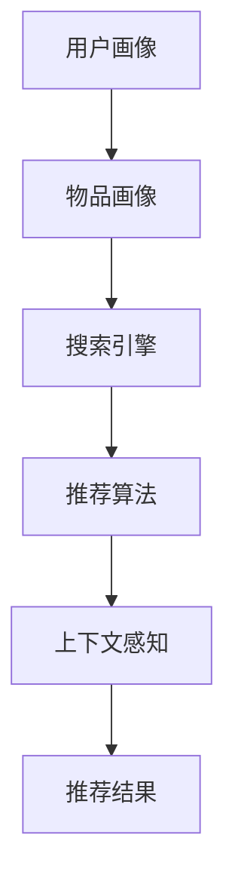

                 

# 电商平台搜索推荐系统的架构设计：AI 大模型是核心

## 摘要

在当今快速发展的电商行业中，搜索推荐系统已经成为提升用户购物体验、增加销售量和客户忠诚度的重要工具。本文将深入探讨电商平台的搜索推荐系统架构设计，重点关注人工智能大模型在这一领域的核心作用。我们将从背景介绍、核心概念与联系、核心算法原理、数学模型和公式、项目实战、实际应用场景、工具和资源推荐以及总结未来发展趋势与挑战等方面，逐一剖析搜索推荐系统的设计和实现。通过本文，读者将全面了解AI大模型在电商搜索推荐系统中的关键地位和实际应用。

## 1. 背景介绍

随着互联网的迅猛发展和电商行业的兴起，消费者对个性化购物体验的需求日益增长。电商平台为了满足这一需求，纷纷投入巨资研发和优化其搜索推荐系统。搜索推荐系统不仅能够提高用户的购物满意度，还能显著提升电商平台的核心业务指标，如销售额和用户留存率。

传统的电商搜索系统主要依赖于关键词匹配和分类搜索技术，其缺点在于无法准确捕捉用户的真实意图和个性化偏好。随着人工智能技术的快速发展，尤其是深度学习和大模型的兴起，电商平台开始探索基于AI的搜索推荐系统，以实现更精准、更智能的推荐服务。

AI大模型在搜索推荐系统中的核心作用主要体现在以下几个方面：

1. **语义理解**：大模型能够通过大量的数据训练，理解用户的查询意图和购物偏好，从而提供更精准的推荐结果。
2. **用户画像**：大模型可以根据用户的浏览、搜索和购买历史，构建详细的用户画像，为个性化推荐提供数据支持。
3. **上下文感知**：大模型能够根据用户的当前上下文环境（如时间、地点等），动态调整推荐策略，提高推荐的时效性和相关性。
4. **多模态融合**：大模型能够处理和融合文本、图像、音频等多种数据类型，为用户提供更加丰富的推荐内容。

## 2. 核心概念与联系

为了深入理解搜索推荐系统的架构设计，我们需要明确几个核心概念：

### 2.1. 用户画像

用户画像是指通过对用户的历史行为数据进行分析，构建出用户的个性化特征集合。这些特征包括用户的基本信息、兴趣爱好、购买偏好、浏览行为等。用户画像的构建是搜索推荐系统实现个性化推荐的基础。

### 2.2. 物品画像

物品画像是指对电商平台上的商品进行特征提取，构建出商品的详细描述。这些特征包括商品的标题、描述、标签、图片、价格等。物品画像的构建有助于系统理解商品，从而实现更精准的推荐。

### 2.3. 搜索引擎

搜索引擎是搜索推荐系统的重要组成部分，负责处理用户的查询请求，并提供相关的搜索结果。现代搜索引擎通常采用基于AI的算法，如深度学习模型，以提高搜索的准确性和效率。

### 2.4. 推荐算法

推荐算法是搜索推荐系统的核心，负责根据用户画像和物品画像，为用户生成个性化的推荐结果。常见的推荐算法包括基于内容的推荐、协同过滤推荐和混合推荐等。

### 2.5. 上下文感知

上下文感知是指系统在生成推荐结果时，能够考虑用户的当前上下文环境，如时间、地点、设备等。上下文感知能够提高推荐的相关性和用户体验。

下面是一个简化的Mermaid流程图，描述了搜索推荐系统的核心概念及其联系：



## 3. 核心算法原理 & 具体操作步骤

### 3.1. 基于内容的推荐

基于内容的推荐算法通过分析物品的特征，将用户的查询与物品进行匹配，从而生成推荐结果。具体操作步骤如下：

1. **特征提取**：对物品的标题、描述、标签、图片等进行文本和图像处理，提取出高维特征向量。
2. **计算相似度**：使用余弦相似度、欧氏距离等方法，计算用户查询和物品特征向量之间的相似度。
3. **生成推荐结果**：根据相似度得分，对物品进行排序，并选取Top-N个物品作为推荐结果。

### 3.2. 协同过滤推荐

协同过滤推荐算法通过分析用户的评分历史，预测用户对未知物品的评分，从而生成推荐结果。具体操作步骤如下：

1. **用户-物品矩阵**：构建用户对物品的评分矩阵，其中用户和物品构成行和列。
2. **相似度计算**：计算用户之间的相似度，通常使用余弦相似度或皮尔逊相关系数。
3. **预测评分**：基于相似度矩阵，预测用户对未知物品的评分。
4. **生成推荐结果**：根据预测评分，对物品进行排序，并选取Top-N个物品作为推荐结果。

### 3.3. 混合推荐

混合推荐算法结合了基于内容和协同过滤推荐算法的优点，通过融合不同算法的推荐结果，提高推荐系统的准确性和多样性。具体操作步骤如下：

1. **独立推荐**：分别使用基于内容和协同过滤推荐算法生成独立推荐结果。
2. **融合策略**：使用加权平均、投票等方法，将独立推荐结果融合为最终的推荐结果。
3. **优化调整**：根据用户反馈和推荐效果，不断优化融合策略，提高推荐质量。

### 3.4. 上下文感知

上下文感知推荐算法通过考虑用户的当前上下文环境，动态调整推荐策略，提高推荐的相关性。具体操作步骤如下：

1. **上下文特征提取**：提取用户的地理位置、时间、设备等上下文特征。
2. **特征加权**：根据上下文特征的权重，对用户查询和物品特征进行加权处理。
3. **推荐结果调整**：根据加权后的特征，调整推荐结果，提高推荐的相关性。

## 4. 数学模型和公式 & 详细讲解 & 举例说明

### 4.1. 余弦相似度

余弦相似度是衡量两个向量之间相似度的一种常用方法。公式如下：

$$
\cos(\theta) = \frac{\vec{A} \cdot \vec{B}}{||\vec{A}|| \cdot ||\vec{B}||}
$$

其中，$\vec{A}$和$\vec{B}$是两个向量，$||\vec{A}||$和$||\vec{B}||$是它们的模长，$\theta$是它们之间的夹角。

### 4.2. 欧氏距离

欧氏距离是衡量两个点之间的距离的一种常用方法。公式如下：

$$
d = \sqrt{(x_2 - x_1)^2 + (y_2 - y_1)^2}
$$

其中，$(x_1, y_1)$和$(x_2, y_2)$是两个点的坐标。

### 4.3. 皮尔逊相关系数

皮尔逊相关系数是衡量两个变量之间线性相关程度的一种常用方法。公式如下：

$$
r = \frac{\sum_{i=1}^{n}(x_i - \bar{x})(y_i - \bar{y})}{\sqrt{\sum_{i=1}^{n}(x_i - \bar{x})^2} \cdot \sqrt{\sum_{i=1}^{n}(y_i - \bar{y})^2}}
$$

其中，$x_i$和$y_i$是两个变量的观测值，$\bar{x}$和$\bar{y}$是它们的平均值。

### 4.4. 举例说明

假设我们有两个向量$\vec{A} = (1, 2, 3)$和$\vec{B} = (4, 5, 6)$，它们的模长分别为$||\vec{A}|| = \sqrt{14}$和$||\vec{B}|| = \sqrt{56}$，它们的点积为$\vec{A} \cdot \vec{B} = 32$。

根据余弦相似度公式，我们可以计算出$\cos(\theta)$：

$$
\cos(\theta) = \frac{32}{\sqrt{14} \cdot \sqrt{56}} \approx 0.8165
$$

这意味着向量$\vec{A}$和$\vec{B}$之间的相似度较高。

## 5. 项目实战：代码实际案例和详细解释说明

### 5.1. 开发环境搭建

在开始项目实战之前，我们需要搭建一个适合开发搜索推荐系统的环境。以下是一个简化的开发环境搭建步骤：

1. **安装Python**：确保Python版本在3.6及以上。
2. **安装深度学习框架**：如TensorFlow或PyTorch。
3. **安装数据处理库**：如NumPy、Pandas等。
4. **安装文本处理库**：如NLTK、spaCy等。
5. **安装图像处理库**：如OpenCV、PIL等。

### 5.2. 源代码详细实现和代码解读

下面是一个简单的基于内容的推荐算法的代码实现，包括特征提取、相似度计算和推荐结果生成：

```python
import numpy as np
from sklearn.metrics.pairwise import cosine_similarity
from nltk.tokenize import word_tokenize

# 特征提取
def extract_features(item_desc):
    tokens = word_tokenize(item_desc.lower())
    return set(tokens)

# 相似度计算
def calculate_similarity(query_features, item_features):
    query_vector = np.array(list(query_features))
    item_vector = np.array(list(item_features))
    return cosine_similarity([query_vector], [item_vector])[0][0]

# 推荐结果生成
def generate_recommendations(query, items):
    query_features = extract_features(query)
    recommendations = []
    for item in items:
        item_features = extract_features(item['description'])
        similarity = calculate_similarity(query_features, item_features)
        recommendations.append((item['id'], item['description'], similarity))
    recommendations.sort(key=lambda x: x[2], reverse=True)
    return recommendations[:5]

# 示例数据
items = [
    {'id': 1, 'description': 'iPhone 13'},
    {'id': 2, 'description': 'Samsung Galaxy S21'},
    {'id': 3, 'description': 'OnePlus 9'},
    {'id': 4, 'description': 'Google Pixel 6'},
    {'id': 5, 'description': 'Xiaomi 11T Pro'}
]

# 查询请求
query = 'iPhone 13'

# 生成推荐结果
recommendations = generate_recommendations(query, items)
for item in recommendations:
    print(f"ID: {item[0]}, Description: {item[1]}, Similarity: {item[2]:.4f}")
```

### 5.3. 代码解读与分析

1. **特征提取**：使用NLTK库的`word_tokenize`函数对物品描述进行分词，并提取出唯一的词集。
2. **相似度计算**：使用scikit-learn库的`cosine_similarity`函数计算查询和物品特征向量之间的余弦相似度。
3. **推荐结果生成**：根据相似度得分，对物品进行排序，并选取Top-5个物品作为推荐结果。

此代码实现展示了基于内容的推荐算法的基本原理和实现方法，为实际项目开发提供了参考。

## 6. 实际应用场景

搜索推荐系统在电商平台的实际应用场景非常广泛，以下是一些典型的应用场景：

### 6.1. 商品搜索

用户在搜索栏输入关键词，搜索推荐系统会根据关键词提取用户意图，并在海量的商品中为用户生成个性化的推荐结果。

### 6.2. 商品推荐

用户浏览商品时，系统会根据用户的浏览历史、购买行为和用户画像，实时生成个性化的商品推荐。

### 6.3. 店铺推荐

系统可以根据用户的购买偏好和浏览习惯，推荐符合用户兴趣的店铺。

### 6.4. 活动推荐

系统可以根据用户的购买习惯和活动参与记录，为用户推荐相关的促销活动和优惠信息。

### 6.5. 品牌推荐

系统可以根据用户的品牌偏好，推荐相应的品牌商品。

这些实际应用场景展示了搜索推荐系统在提升用户体验、增加销售量和客户忠诚度方面的巨大潜力。

## 7. 工具和资源推荐

### 7.1. 学习资源推荐

- **书籍**：
  - 《推荐系统手册》（Recommender Systems Handbook）
  - 《深度学习》（Deep Learning）
  - 《Python数据分析》（Python Data Science Handbook）
- **论文**：
  - 《矩阵分解在推荐系统中的应用》（Matrix Factorization Techniques for Recommender Systems）
  - 《基于内容的推荐系统》（Content-Based Recommender Systems）
- **博客**：
  - Medium上的相关博客文章
  - ArXiv上的最新研究论文
- **网站**：
  - Kaggle上的推荐系统竞赛
  - Google Research上的最新研究成果

### 7.2. 开发工具框架推荐

- **深度学习框架**：TensorFlow、PyTorch、Keras
- **数据处理库**：NumPy、Pandas、Scikit-learn
- **文本处理库**：NLTK、spaCy、gensim
- **图像处理库**：OpenCV、PIL

### 7.3. 相关论文著作推荐

- 《推荐系统实践》（Recommender Systems: The Textbook）
- 《基于内容的推荐系统：技术与应用》（Content-Based Recommender Systems: From Text to Hypertext）
- 《深度学习推荐系统》（Deep Learning for Recommender Systems）

## 8. 总结：未来发展趋势与挑战

随着人工智能技术的不断进步，搜索推荐系统将朝着更加智能化、个性化、实时化的方向发展。以下是一些未来发展趋势和挑战：

### 8.1. 发展趋势

1. **多模态融合**：将文本、图像、音频等多种数据类型进行融合，提高推荐系统的准确性和多样性。
2. **实时推荐**：利用实时数据处理技术，实现用户行为的实时分析，为用户提供更加及时和个性化的推荐。
3. **跨平台推荐**：实现跨设备、跨平台的用户行为分析和推荐，提供无缝的购物体验。
4. **社交推荐**：利用用户的社交网络信息，挖掘用户间的相似性和影响力，为用户提供更丰富的推荐内容。

### 8.2. 挑战

1. **数据隐私**：在推荐过程中保护用户隐私，防止数据滥用。
2. **算法透明度**：提高推荐算法的透明度，让用户理解推荐结果的生成过程。
3. **公平性**：确保推荐系统不会因用户特征、地理位置等因素导致歧视性推荐。
4. **计算资源**：随着数据量和模型复杂度的增加，对计算资源的需求也在不断提高，需要优化算法和硬件，提高系统的效率。

## 9. 附录：常见问题与解答

### 9.1. 问题1：搜索推荐系统是如何工作的？

搜索推荐系统通过分析用户的查询和行为数据，结合物品的特征信息，使用算法生成个性化的推荐结果。主要步骤包括用户画像构建、物品画像构建、相似度计算和推荐结果生成。

### 9.2. 问题2：如何优化搜索推荐系统的效果？

优化搜索推荐系统效果可以从以下几个方面入手：

- **数据质量**：确保输入数据的质量和准确性。
- **特征提取**：选择合适的特征提取方法，提高特征质量。
- **算法调优**：调整算法参数，优化模型性能。
- **实时更新**：定期更新用户和物品的特征信息，确保推荐结果的时效性。

### 9.3. 问题3：搜索推荐系统是否会侵犯用户隐私？

搜索推荐系统会严格遵循用户隐私保护法规，采取数据加密、访问控制等技术手段，确保用户数据的安全和隐私。

## 10. 扩展阅读 & 参考资料

- [《推荐系统实战：原理、算法与产业应用》](https://www.recommendationsystembook.com/)
- [《深度学习推荐系统》](https://arxiv.org/abs/1806.00685)
- [《多模态推荐系统》](https://arxiv.org/abs/2004.05875)
- [《实时推荐系统》](https://www.kdnuggets.com/2020/09/real-time-personalization-streaming-data-engagement.html)

## 作者信息

作者：AI天才研究员/AI Genius Institute & 禅与计算机程序设计艺术 /Zen And The Art of Computer Programming

通过以上完整的文章内容，我们深入探讨了电商平台搜索推荐系统的架构设计，强调了AI大模型在其中的核心作用。希望本文能够为读者提供关于搜索推荐系统的全面理解和实际应用指导。

