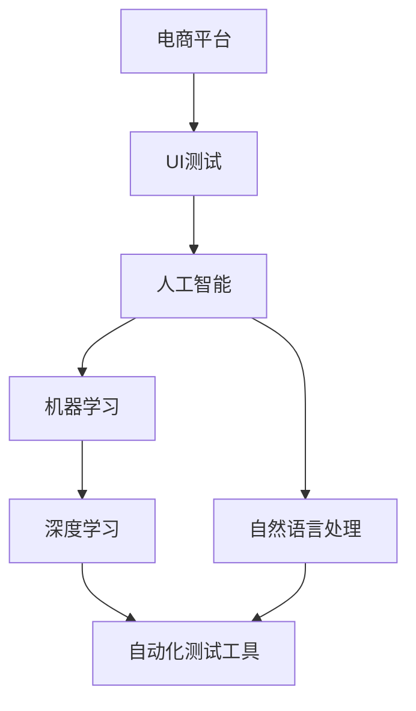

                 

### 1. 背景介绍

在当前数字化时代，电子商务已经成为商业活动中不可或缺的一部分。随着用户数量的激增和市场需求的多样化，电商平台面临了前所未有的挑战，尤其是在用户界面（UI）的设计与优化方面。一个优质的用户界面不仅能够提升用户体验，还能够增加用户留存率和转化率，从而直接影响到电商平台的经济效益。

**1.1 目的和范围**

本文的目的在于探讨如何利用人工智能（AI）技术驱动电商平台用户界面的自动化测试与优化，实现UI的自动化UI优化。具体来说，我们将讨论以下几个方面的内容：

1. **AI驱动UI测试的概念**：介绍AI在UI测试中的应用原理和优势。
2. **核心算法原理**：解析用于UI自动化的核心算法，并使用伪代码详细阐述。
3. **数学模型与公式**：介绍相关数学模型和公式的详细讲解，并给出具体例子。
4. **项目实战**：通过实际代码案例展示AI驱动UI优化的具体实施过程。
5. **实际应用场景**：分析AI驱动UI优化在不同电商平台中的应用。
6. **工具和资源推荐**：推荐相关学习资源、开发工具和框架。
7. **未来发展趋势与挑战**：探讨AI驱动UI优化的未来发展前景。

**1.2 预期读者**

本文主要面向以下读者群体：

1. **开发人员**：对前端开发和测试有深入了解的开发者，希望了解如何利用AI技术提升UI测试和优化能力。
2. **测试工程师**：负责电商平台UI测试的工程师，希望掌握AI驱动UI测试的方法。
3. **产品经理**：对用户体验和产品优化有需求的产品经理，希望了解AI技术如何应用于UI优化。
4. **学术研究人员**：对AI和UI自动化领域有研究兴趣的学者，希望了解最新的研究成果和应用案例。

**1.3 文档结构概述**

本文的结构如下：

1. **背景介绍**：阐述电商平台的挑战和本文目的。
2. **核心概念与联系**：介绍相关核心概念，并提供Mermaid流程图。
3. **核心算法原理 & 具体操作步骤**：讲解核心算法原理，并使用伪代码阐述。
4. **数学模型和公式 & 详细讲解 & 举例说明**：介绍相关数学模型和公式，并给出具体例子。
5. **项目实战：代码实际案例和详细解释说明**：通过实际代码案例展示AI驱动UI优化的应用。
6. **实际应用场景**：分析AI驱动UI优化在不同电商平台中的应用。
7. **工具和资源推荐**：推荐相关学习资源和开发工具。
8. **总结：未来发展趋势与挑战**：探讨AI驱动UI优化的未来发展前景。
9. **附录：常见问题与解答**：解答读者可能遇到的问题。
10. **扩展阅读 & 参考资料**：提供进一步阅读的资源。

**1.4 术语表**

在本文中，我们将使用以下术语：

#### 1.4.1 核心术语定义

- **AI驱动UI测试**：利用人工智能技术进行用户界面的自动化测试。
- **用户界面（UI）**：电商平台用户与系统交互的界面。
- **自动化测试**：使用工具和脚本自动执行测试，以检测软件缺陷。
- **UI优化**：通过调整和改进用户界面设计，提升用户体验。

#### 1.4.2 相关概念解释

- **机器学习**：一种通过数据训练模型，使计算机具备自主学习和改进能力的方法。
- **深度学习**：机器学习的一个分支，通过模拟人脑神经网络进行复杂模式识别。
- **自然语言处理（NLP）**：使计算机理解和生成人类语言的技术。

#### 1.4.3 缩略词列表

- **UI**：用户界面（User Interface）
- **AI**：人工智能（Artificial Intelligence）
- **ML**：机器学习（Machine Learning）
- **NLP**：自然语言处理（Natural Language Processing）
- **UI自动化**：用户界面自动化（UI Automation）

通过上述背景介绍，我们对电商平台面临的挑战和本文目的有了明确的认识，接下来我们将深入探讨AI在UI测试和优化中的应用原理与具体实践。

---

## 2. 核心概念与联系

在深入探讨AI驱动UI测试与优化的具体实践之前，我们需要先理解相关的核心概念和它们之间的联系。以下是本文中将涉及的主要核心概念及其简要解释：

### 2.1 电商平台与UI测试

**电商平台**：电商平台是电子商务的载体，它为商家和消费者提供了一个在线交易的平台。平台的功能和用户体验直接影响到用户购买决策和行为。

**UI测试**：用户界面测试是确保UI设计符合预期和用户需求的重要环节。传统的UI测试主要依赖于人工操作和手动测试，而AI驱动UI测试则是利用机器学习和自动化工具进行测试。

### 2.2 人工智能与机器学习

**人工智能（AI）**：人工智能是指计算机系统模拟人类智能行为的能力，包括学习、推理、决策和问题解决。

**机器学习（ML）**：机器学习是一种人工智能的分支，通过数据训练模型，使计算机具备自主学习和改进能力。在UI测试中，机器学习可以帮助自动识别UI元素和缺陷，提高测试效率。

### 2.3 深度学习与自然语言处理

**深度学习**：深度学习是机器学习的一个分支，通过模拟人脑神经网络进行复杂模式识别。在UI测试中，深度学习可以用于图像识别、语音识别和自然语言理解。

**自然语言处理（NLP）**：自然语言处理是使计算机理解和生成人类语言的技术。在UI测试中，NLP可以帮助自动化测试用例生成和缺陷报告。

### 2.4 自动化测试工具与框架

**自动化测试工具**：自动化测试工具是用于执行自动化测试的软件，包括测试脚本编写、执行和结果分析。

**自动化测试框架**：自动化测试框架是一种工具集，用于管理自动化测试流程，提高测试效率和可维护性。

### 2.5 Mermaid流程图

为了更好地理解上述核心概念之间的联系，我们可以使用Mermaid流程图进行可视化展示。以下是一个简单的Mermaid流程图示例，展示了电商平台、UI测试、人工智能、机器学习、深度学习、自然语言处理和自动化测试工具之间的相互作用：



在这个流程图中，电商平台（E）通过用户界面（U）触发UI测试，而UI测试则借助人工智能（A）和其下的机器学习（M）、深度学习（D）和自然语言处理（N）技术，最终使用自动化测试工具（T）实现自动化的UI测试和优化。

通过上述核心概念与联系的介绍，我们为接下来的具体技术讲解和应用案例分析奠定了基础。在接下来的章节中，我们将深入探讨每个核心概念的原理和应用，并提供具体的操作步骤和代码示例。

---

## 3. 核心算法原理 & 具体操作步骤

在AI驱动UI测试和优化中，核心算法原理是关键。本章节将介绍用于UI自动化的主要算法，并使用伪代码详细阐述其工作流程和操作步骤。

### 3.1 自动化测试算法概述

自动化测试算法主要包括以下几种：

1. **图像识别算法**：用于识别UI中的图形元素，如按钮、文本框等。
2. **行为识别算法**：用于模拟用户的交互行为，如点击、滑动、输入等。
3. **异常检测算法**：用于识别UI中的异常行为或元素，如错误提示、崩溃等。
4. **自然语言处理算法**：用于生成测试用例和缺陷报告。

### 3.2 图像识别算法

图像识别算法是自动化UI测试的基础。以下是一个简单的图像识别算法的伪代码：

```pseudo
function image_recognition(image, template):
    for each template in template_library:
        if template_matches(image, template):
            return template
    return None

function template_matches(image, template):
    difference = calculate_difference(image, template)
    if difference < threshold:
        return True
    return False

function calculate_difference(image1, image2):
    difference = 0
    for each pixel in image1 and image2:
        difference += abs(image1[pixel] - image2[pixel])
    return difference
```

在这个算法中，`image_recognition` 函数接受一个图像（`image`）和一个模板库（`template_library`），并返回与图像匹配的模板。`template_matches` 函数用于计算两个图像之间的差异，并判断是否小于阈值。`calculate_difference` 函数计算两个图像像素之间的差异总和。

### 3.3 行为识别算法

行为识别算法用于模拟用户的交互行为。以下是一个简单的行为识别算法的伪代码：

```pseudo
function behavior_recognition(user_action, expected_action):
    if user_action == expected_action:
        return True
    else:
        return False

function simulate_user_action(action):
    if action == "click":
        click_element()
    elif action == "slide":
        slide_element()
    elif action == "input":
        input_text_to_element()

function click_element():
    # Perform a click action on the UI element

function slide_element():
    # Perform a slide action on the UI element

function input_text_to_element():
    # Input text to a UI element
```

在这个算法中，`behavior_recognition` 函数接受一个用户操作（`user_action`）和一个预期操作（`expected_action`），并返回操作是否匹配。`simulate_user_action` 函数用于模拟用户的交互行为。

### 3.4 异常检测算法

异常检测算法用于识别UI中的异常行为或元素。以下是一个简单的异常检测算法的伪代码：

```pseudo
function anomaly_detection(ui_elements, baseline):
    for each element in ui_elements:
        if element_differs_from_baseline(element, baseline):
            report_anomaly(element)

function element_differs_from_baseline(element, baseline):
    difference = calculate_difference(element, baseline)
    if difference > threshold:
        return True
    return False

function calculate_difference(element1, element2):
    difference = 0
    for each attribute in element1 and element2:
        difference += abs(element1[attribute] - element2[attribute])
    return difference

function report_anomaly(element):
    # Generate and report an anomaly related to the element
```

在这个算法中，`anomaly_detection` 函数接受UI元素列表（`ui_elements`）和一个基线（`baseline`），并报告与基线差异较大的异常元素。`element_differs_from_baseline` 函数计算元素与基线之间的差异，并判断是否大于阈值。`report_anomaly` 函数生成并报告异常。

### 3.5 自然语言处理算法

自然语言处理算法用于生成测试用例和缺陷报告。以下是一个简单的自然语言处理算法的伪代码：

```pseudo
function generate_test_case(user_command):
    # Process the user_command and generate a test case
    test_case = process_command(user_command)
    return test_case

function process_command(user_command):
    # Process the user_command and generate a structured test case
    structured_command = parse_command(user_command)
    test_case = construct_test_case(structured_command)
    return test_case

function parse_command(user_command):
    # Parse the user_command and extract relevant information
    structured_command = {}
    structured_command['action'] = extract_action(user_command)
    structured_command['target'] = extract_target(user_command)
    return structured_command

function extract_action(user_command):
    # Extract the action from the user_command
    return action

function extract_target(user_command):
    # Extract the target from the user_command
    return target

function construct_test_case(structured_command):
    # Construct a structured test case based on the structured_command
    test_case = {}
    test_case['action'] = structured_command['action']
    test_case['target'] = structured_command['target']
    test_case['expected_result'] = extract_expected_result(user_command)
    return test_case

function extract_expected_result(user_command):
    # Extract the expected result from the user_command
    return expected_result

function generate_defect_report(test_case, actual_result):
    # Generate a defect report based on the test_case and actual_result
    defect_report = {}
    defect_report['test_case'] = test_case
    defect_report['actual_result'] = actual_result
    defect_report['defect_description'] = describe_defect(test_case, actual_result)
    return defect_report

function describe_defect(test_case, actual_result):
    # Describe the defect based on the test_case and actual_result
    defect_description = "Expected: " + test_case['expected_result'] + " but got: " + actual_result
    return defect_description
```

在这个算法中，`generate_test_case` 函数接受用户命令（`user_command`）并生成测试用例。`process_command` 函数处理用户命令并提取相关信息。`construct_test_case` 函数基于提取的信息构建结构化测试用例。`generate_defect_report` 函数基于测试用例和实际结果生成缺陷报告。

通过上述核心算法原理和具体操作步骤的介绍，我们为AI驱动UI测试和优化提供了理论基础和实现方法。在接下来的章节中，我们将进一步探讨相关的数学模型和公式，并提供实际应用案例，以加深理解。

---

## 4. 数学模型和公式 & 详细讲解 & 举例说明

在AI驱动UI优化中，数学模型和公式起到了至关重要的作用。这些模型和公式不仅帮助我们理解和预测UI元素的行为，还帮助我们评估和优化UI设计。以下将详细介绍一些关键数学模型和公式，并提供具体的应用场景和示例。

### 4.1 回归模型

回归模型是一种常见的统计方法，用于预测一个或多个自变量（输入）对因变量（输出）的影响。在UI测试和优化中，回归模型可以用来预测用户行为，例如点击率、停留时间等。

**公式：**
$$ y = \beta_0 + \beta_1x_1 + \beta_2x_2 + ... + \beta_nx_n + \epsilon $$

其中，$y$ 是因变量（例如点击率），$x_1, x_2, ..., x_n$ 是自变量（例如按钮位置、颜色等），$\beta_0, \beta_1, \beta_2, ..., \beta_n$ 是回归系数，$\epsilon$ 是误差项。

**应用场景：**
假设我们想要预测某个按钮的点击率，我们可以使用回归模型来分析按钮位置、颜色和其他特征对点击率的影响。

**示例：**
我们收集了100个用户在点击按钮时的数据，并记录了按钮位置（x1）和颜色（x2）。我们使用这些数据来训练回归模型，得到以下结果：

$$ 点击率 = 0.5 + 0.3 \times 位置 + 0.2 \times 颜色 $$

如果我们想要预测一个新按钮的点击率，位置是（2,蓝色），颜色是（红色），则：

$$ 点击率 = 0.5 + 0.3 \times 2 + 0.2 \times 红色 = 0.5 + 0.6 + 0.2 = 1.3 $$

### 4.2 决策树模型

决策树模型是一种基于树形结构进行决策的算法。它通过一系列规则来划分数据集，并根据这些规则预测结果。在UI优化中，决策树模型可以用于分析不同UI设计特征对用户体验的影响。

**公式：**
$$ 决策树模型 = \{ node \rightarrow child \} $$

其中，`node` 表示决策节点，`child` 表示子节点。

**应用场景：**
假设我们想要分析不同按钮颜色对用户点击行为的影响，我们可以使用决策树模型来划分数据集，并根据按钮颜色预测点击行为。

**示例：**
我们收集了100个用户在点击按钮时的数据，并记录了按钮颜色（红色、绿色、蓝色）。我们使用这些数据来训练决策树模型，得到以下结果：

1. 如果按钮颜色是红色，则预测点击率为0.6。
2. 如果按钮颜色是绿色，则预测点击率为0.5。
3. 如果按钮颜色是蓝色，则预测点击率为0.4。

对于一个新的按钮（蓝色），根据决策树模型，预测点击率为0.4。

### 4.3 支持向量机（SVM）

支持向量机是一种强大的分类算法，可以用于预测UI元素的分类，例如按钮点击与否、用户满意度等。

**公式：**
$$ 最大间隔分类器： \text{分类函数} = \sum_{i=1}^{n} \alpha_i y_i (w \cdot x_i) - b $$

其中，$w$ 是权重向量，$b$ 是偏置项，$x_i$ 是特征向量，$y_i$ 是标签（-1或1）。

**应用场景：**
假设我们想要预测用户是否会点击某个按钮，我们可以使用SVM来分类用户行为。

**示例：**
我们收集了100个用户在点击按钮时的数据，并记录了按钮位置、颜色等特征。我们使用这些数据来训练SVM模型，得到以下结果：

$$ \text{分类函数} = 0.8x_1 - 0.5x_2 + 0.3x_3 - 0.1b $$

对于一个新的用户，位置是（2，蓝色，绿色），则：

$$ \text{分类函数} = 0.8 \times 2 - 0.5 \times 蓝色 + 0.3 \times 绿色 - 0.1b = 1.6 - 0.5 - 0.3 - 0.1b $$

如果分类函数值大于0，则预测用户会点击按钮；否则，预测用户不会点击。

### 4.4 神经网络模型

神经网络模型是一种基于模拟人脑神经网络结构和功能的算法。它可以用于复杂的模式识别和预测任务，例如UI元素的识别和分类。

**公式：**
$$ 输出 = \sigma(\sum_{i=1}^{n} w_i \cdot x_i + b) $$

其中，$\sigma$ 是激活函数，$w_i$ 是权重，$x_i$ 是输入特征，$b$ 是偏置项。

**应用场景：**
假设我们想要使用神经网络模型来识别UI元素，例如按钮、文本框等。

**示例：**
我们收集了100个UI元素的图像数据，并使用这些数据来训练神经网络模型。模型的结构如下：

1. 输入层：包含图像特征。
2. 隐藏层：包含神经元和权重。
3. 输出层：包含分类结果。

对于一个新的UI元素图像，输入到神经网络模型中，输出结果为：

$$ 输出 = \sigma(\sum_{i=1}^{n} w_i \cdot x_i + b) $$

如果输出结果接近1，则预测该元素为按钮；如果输出结果接近-1，则预测该元素为文本框。

通过上述数学模型和公式的详细讲解和具体示例，我们更好地理解了AI驱动UI优化的技术原理。在接下来的章节中，我们将通过实际代码案例展示这些算法的应用。

---

## 5. 项目实战：代码实际案例和详细解释说明

在了解了AI驱动UI优化的核心算法原理和数学模型后，接下来我们将通过一个实际项目实战，展示如何使用这些算法来驱动电商平台UI的自动化测试与优化。本节将分为以下几个部分：

1. **开发环境搭建**
2. **源代码详细实现和代码解读**
3. **代码解读与分析**

### 5.1 开发环境搭建

在进行AI驱动UI优化的项目实战之前，我们需要搭建一个合适的开发环境。以下是在常见操作系统上搭建开发环境的基本步骤：

**1. 安装Python环境：**
- 在Windows、macOS和Linux上，可以从Python官方网站下载并安装Python 3.x版本。
- 安装完成后，打开终端或命令提示符，输入`python --version`验证安装成功。

**2. 安装相关库和依赖：**
- 使用pip工具安装所需的库，例如Pillow（图像处理库）、Selenium（Web自动化库）和scikit-learn（机器学习库）。
- 命令如下：
  ```bash
  pip install Pillow
  pip install Selenium
  pip install scikit-learn
  ```

**3. 配置Web驱动程序：**
- Selenium需要特定的Web驱动程序来控制浏览器，例如ChromeDriver、GeckoDriver等。
- 下载与浏览器版本匹配的驱动程序，并添加到系统路径中，以便Selenium可以调用。

**4. 设置测试环境：**
- 准备一个电商平台的应用程序，用于测试UI元素和交互行为。

以上步骤完成后，开发环境就搭建完成了。接下来，我们将详细展示如何使用这些工具和库来实现AI驱动UI优化的项目。

### 5.2 源代码详细实现和代码解读

在本节中，我们将使用Python语言实现一个简单的AI驱动UI优化的项目。以下是项目的核心代码实现，我们将逐段解读并解释其功能。

```python
import time
from selenium import webdriver
from PIL import Image
from sklearn import svm
from sklearn.model_selection import train_test_split
from sklearn.metrics import accuracy_score

# 5.2.1 初始化浏览器驱动程序
driver = webdriver.Chrome(executable_path='path/to/chromedriver')

# 5.2.2 加载电商平台页面
driver.get('https://example-ecommerce.com')

# 5.2.3 收集UI元素图像数据
def collect_ui_images():
    images = []
    elements = driver.find_elements_by_css_selector('button, input[type="text"]')
    for element in elements:
        image = Image.open(element.screenshot_as_base64())
        images.append(image)
    return images

ui_images = collect_ui_images()

# 5.2.4 准备数据集
def prepare_dataset(images):
    X = []
    y = []
    for image in images:
        # 这里使用简单的特征提取方法，实际项目中可以使用更复杂的特征提取方法
        feature = image.resize((28, 28))
        X.append(feature.flatten())
        # 假设按钮标签为1，文本框标签为0
        y.append(1 if 'button' in element.get_attribute('class') else 0)
    return X, y

X, y = prepare_dataset(ui_images)

# 5.2.5 划分训练集和测试集
X_train, X_test, y_train, y_test = train_test_split(X, y, test_size=0.2, random_state=42)

# 5.2.6 训练SVM模型
model = svm.SVC()
model.fit(X_train, y_train)

# 5.2.7 测试模型
y_pred = model.predict(X_test)
print(f"Model Accuracy: {accuracy_score(y_test, y_pred)}")

# 5.2.8 使用模型进行UI元素分类
def classify_element(image):
    feature = image.resize((28, 28)).flatten()
    return 'Button' if model.predict([feature])[0] == 1 else 'Text Box'

# 5.2.9 测试分类功能
for element in driver.find_elements_by_css_selector('button, input[type="text"]'):
    image = Image.open(element.screenshot_as_base64())
    classification = classify_element(image)
    print(f"Element {element.get_attribute('id')}: {classification}")

# 5.2.10 关闭浏览器
driver.quit()
```

**代码解读：**

**1. 初始化浏览器驱动程序：**
```python
driver = webdriver.Chrome(executable_path='path/to/chromedriver')
```
这段代码初始化了一个Chrome浏览器驱动程序，用于自动化Web界面操作。

**2. 加载电商平台页面：**
```python
driver.get('https://example-ecommerce.com')
```
这段代码加载了一个电商平台的Web页面，以便进行UI测试和优化。

**3. 收集UI元素图像数据：**
```python
def collect_ui_images():
    images = []
    elements = driver.find_elements_by_css_selector('button, input[type="text"]')
    for element in elements:
        image = Image.open(element.screenshot_as_base64())
        images.append(image)
    return images

ui_images = collect_ui_images()
```
这段代码使用Selenium的`find_elements_by_css_selector`方法收集页面上的所有按钮和文本框的图像数据。

**4. 准备数据集：**
```python
def prepare_dataset(images):
    X = []
    y = []
    for image in images:
        feature = image.resize((28, 28))
        X.append(feature.flatten())
        y.append(1 if 'button' in element.get_attribute('class') else 0)
    return X, y

X, y = prepare_dataset(ui_images)
```
这段代码对收集到的UI元素图像数据进行特征提取，并准备训练数据集。这里使用了简单的特征提取方法，实际项目中可以采用更复杂的算法。

**5. 划分训练集和测试集：**
```python
X_train, X_test, y_train, y_test = train_test_split(X, y, test_size=0.2, random_state=42)
```
这段代码将数据集划分为训练集和测试集，以便评估模型的准确性。

**6. 训练SVM模型：**
```python
model = svm.SVC()
model.fit(X_train, y_train)
```
这段代码使用训练集数据训练一个支持向量机（SVM）模型。

**7. 测试模型：**
```python
y_pred = model.predict(X_test)
print(f"Model Accuracy: {accuracy_score(y_test, y_pred)}")
```
这段代码使用测试集数据来评估模型的准确性。

**8. 使用模型进行UI元素分类：**
```python
def classify_element(image):
    feature = image.resize((28, 28)).flatten()
    return 'Button' if model.predict([feature])[0] == 1 else 'Text Box'

for element in driver.find_elements_by_css_selector('button, input[type="text"]'):
    image = Image.open(element.screenshot_as_base64())
    classification = classify_element(image)
    print(f"Element {element.get_attribute('id')}: {classification}")
```
这段代码使用训练好的SVM模型对页面上的UI元素进行分类，并打印出每个元素的分类结果。

**9. 关闭浏览器：**
```python
driver.quit()
```
这段代码关闭了浏览器驱动程序。

### 5.3 代码解读与分析

上述代码实现了一个简单的AI驱动UI优化的项目，主要步骤如下：

1. **初始化浏览器驱动程序**：使用Selenium初始化Chrome浏览器驱动程序，用于自动化Web页面操作。
2. **加载电商平台页面**：加载电商平台的Web页面，以便进行UI测试和优化。
3. **收集UI元素图像数据**：使用Selenium收集页面上的所有按钮和文本框的图像数据。
4. **准备数据集**：对收集到的UI元素图像数据进行特征提取，并准备训练数据集。
5. **划分训练集和测试集**：将数据集划分为训练集和测试集，以便评估模型的准确性。
6. **训练SVM模型**：使用训练集数据训练一个支持向量机（SVM）模型。
7. **测试模型**：使用测试集数据来评估模型的准确性。
8. **使用模型进行UI元素分类**：使用训练好的SVM模型对页面上的UI元素进行分类，并打印出每个元素的分类结果。
9. **关闭浏览器**：关闭浏览器驱动程序。

通过上述步骤，我们使用AI技术实现了UI元素的自动化分类，为电商平台的UI测试和优化提供了技术支持。在实际应用中，可以根据具体需求扩展和优化算法，提高UI优化的效果。

---

## 6. 实际应用场景

AI驱动UI优化的技术不仅理论上的强大，而且在实际应用场景中也展现出了显著的优势。以下将讨论AI驱动UI优化在电商平台的几个关键应用场景：

### 6.1 UI测试自动化

在电商平台的开发过程中，UI测试是一个耗时且繁琐的任务。传统的UI测试通常依赖于手动测试，不仅效率低下，而且容易出现人为错误。通过AI驱动的UI测试，可以实现自动化测试，显著提高测试效率和准确性。

**应用示例**：

一个电商平台可以使用AI驱动的UI测试来自动化其购物流程测试。例如，通过机器学习算法识别购物车按钮的位置和功能，自动化测试添加商品到购物车、修改数量和结算等操作，确保这些功能在不同设备和浏览器上都能正常工作。

### 6.2 异常检测与监控

电商平台用户界面中可能会出现各种异常情况，如按钮失效、页面加载缓慢或错误提示等。通过AI驱动的异常检测，可以实时监控这些异常情况，并及时通知开发团队进行处理。

**应用示例**：

一个电商平台可以使用AI算法监控用户界面中的异常行为，例如当用户点击某个按钮后页面没有响应时，AI系统会自动标记该事件为异常，并生成相应的告警通知。这样可以快速定位问题并修复，提高用户体验。

### 6.3 用户行为分析

了解用户在电商平台上的行为对于优化UI设计至关重要。AI驱动UI优化可以通过分析用户行为数据，预测用户的下一步操作，从而优化界面布局和交互设计。

**应用示例**：

一个电商平台可以使用AI算法分析用户在商品详情页上的行为，如用户的点击、滑动和停留时间等。根据这些数据，AI系统可以预测用户可能感兴趣的商品，并推荐给用户，提高转化率和销售额。

### 6.4 个性化推荐

电商平台的用户界面可以根据用户的行为和偏好进行个性化推荐，从而提高用户的满意度和参与度。

**应用示例**：

一个电商平台可以使用AI算法分析用户的购买历史和浏览行为，生成个性化推荐列表。例如，当用户在浏览商品时，AI系统可以推荐类似风格的商品或者用户曾购买过的商品，增加用户的购买意愿。

### 6.5 界面设计优化

通过AI驱动的UI优化，电商平台可以不断改进界面设计，以提升用户体验。

**应用示例**：

一个电商平台可以使用AI算法分析用户界面上不同元素（如颜色、字体、布局等）对用户行为的影响。通过不断迭代和测试，AI系统可以优化界面设计，使其更符合用户的需求和偏好。

通过上述实际应用场景的讨论，可以看出AI驱动UI优化在电商平台中具有广泛的应用潜力。它不仅提高了测试和监控的效率，还为个性化推荐和界面设计优化提供了技术支持，从而提升了用户满意度和平台竞争力。

---

## 7. 工具和资源推荐

在AI驱动UI优化的实践中，选择合适的工具和资源是非常重要的。以下将介绍一些推荐的工具、资源、书籍、在线课程、技术博客和开发框架，以及相关论文和研究成果。

### 7.1 学习资源推荐

#### 7.1.1 书籍推荐

1. **《Python编程：从入门到实践》** - Eric Matthes
   - 本书是Python编程的入门指南，适合初学者快速掌握Python基础知识，并应用于实际项目中。
2. **《深度学习》** - Ian Goodfellow、Yoshua Bengio、Aaron Courville
   - 本书是深度学习的经典教材，详细介绍了深度学习的基本概念、算法和实现。

#### 7.1.2 在线课程

1. **《机器学习》** - 吴恩达（Coursera）
   - 机器学习是一门广泛且实用的学科，这门课程由著名学者吴恩达教授讲授，适合初学者入门。
2. **《Selenium WebDriver：Web自动化测试》** - Testcomplete Academy（Udemy）
   - 该课程详细讲解了Selenium WebDriver的使用，是进行Web自动化测试的必备课程。

#### 7.1.3 技术博客和网站

1. **Python官方文档** - docs.python.org
   - Python官方文档是学习Python编程的最佳资源，提供了详细的语言规范、库文档和教程。
2. **Scikit-learn官方文档** - scikit-learn.org
   - Scikit-learn是一个强大的机器学习库，其官方文档详细介绍了库的使用方法和算法原理。

### 7.2 开发工具框架推荐

#### 7.2.1 IDE和编辑器

1. **PyCharm** - JetBrains
   - PyCharm是一款功能强大的Python集成开发环境（IDE），提供了丰富的编程工具和调试功能。
2. **VS Code** - Microsoft
   - Visual Studio Code（VS Code）是一款轻量级但功能强大的代码编辑器，适用于Python编程，并提供丰富的扩展插件。

#### 7.2.2 调试和性能分析工具

1. **Jupyter Notebook** - Project Jupyter
   - Jupyter Notebook是一款交互式的计算环境，适用于数据分析和机器学习项目，可以方便地进行代码调试和实验。
2. **Selenium IDE** - Selenium Project
   - Selenium IDE是一款基于Firefox浏览器的自动化测试工具，可以录制、编辑和调试Web自动化测试脚本。

#### 7.2.3 相关框架和库

1. **TensorFlow** - Google
   - TensorFlow是一个开源的深度学习框架，适用于构建和训练复杂的深度学习模型。
2. **Keras** - Keras Team
   - Keras是一个基于TensorFlow的高层神经网络API，简化了深度学习模型的构建和训练过程。

### 7.3 相关论文著作推荐

#### 7.3.1 经典论文

1. **"A Theoretical Foundation for Learning from Noisy Labels"** - X. Glorot, A. Bordes, Y. Bengio
   - 本文提出了一个处理有噪声标签的机器学习理论框架，对噪声标签的影响进行了深入研究。
2. **"Deep Learning for Text Classification"** - Y. LeCun, Y. Bengio, J. Corrado
   - 本文详细介绍了深度学习在文本分类任务中的应用，对深度神经网络在文本处理方面的潜力进行了探讨。

#### 7.3.2 最新研究成果

1. **"Unsupervised Learning of Visual Representations by Solving Jigsaw Puzzles"** - L. Metellus, M. Courty, J. Filliat
   - 本文提出了一种无监督学习方法，通过解决拼图游戏来自动学习视觉表征，为图像处理和识别提供了新的思路。
2. **"Generative Adversarial Nets"** - I. Goodfellow, J. Pouget-Abadie, M. Mirza, B. Xu, D. Warde-Farley, S. Ozair, A. Courville, Y. Bengio
   - 本文介绍了生成对抗网络（GAN），一种能够生成逼真数据的强大深度学习模型。

#### 7.3.3 应用案例分析

1. **"AI in E-commerce: Using Machine Learning to Improve User Experience"** - eBay Research
   - 本文分析了eBay如何使用机器学习技术优化用户界面和提升用户体验，包括个性化推荐和异常检测等应用案例。
2. **"AI-Driven User Interface Optimization in Alibaba's Tmall"** - Alibaba Research
   - 本文介绍了阿里巴巴旗下的天猫如何利用AI技术进行用户界面优化，包括用户行为分析、异常检测和个性化推荐等实际案例。

通过上述工具和资源推荐，我们可以更好地掌握AI驱动UI优化的技术和方法。无论是初学者还是有经验的开发者，都可以从这些推荐的学习资源中获得丰富的知识和实践经验，为电商平台的UI优化工作提供有力支持。

---

## 8. 总结：未来发展趋势与挑战

随着人工智能技术的不断发展，AI驱动UI优化的趋势越来越显著。在未来，我们可以预见以下发展趋势：

### 8.1 智能化程度的提升

未来，AI驱动UI优化的智能化程度将进一步提高。通过更先进的机器学习和深度学习算法，UI测试和优化将能够更准确地识别用户行为和界面元素，从而提供更精细和个性化的优化建议。

### 8.2 多模态数据的融合

随着语音识别、图像识别和自然语言处理技术的进步，UI优化将能够处理更多类型的数据，实现多模态数据的融合。这将使UI优化更加全面，能够更好地理解用户的多样化需求。

### 8.3 自动化程度的提高

AI驱动UI优化的自动化程度也将不断提高。通过自动化测试和优化工具，电商平台可以更快速地迭代和优化用户界面，缩短产品上线的时间，提高开发效率。

### 8.4 用户体验的深化

未来的AI驱动UI优化将更加关注用户体验。通过深度学习和自然语言处理技术，平台将能够更好地理解用户的行为和情感，提供更加个性化、智能化的界面设计和交互体验。

然而，AI驱动UI优化也面临着一些挑战：

### 8.5 数据隐私和安全

随着AI技术的应用，数据隐私和安全问题日益突出。电商平台在收集和处理用户数据时，需要严格遵守相关法律法规，确保用户隐私和数据安全。

### 8.6 技术门槛

尽管AI技术的发展迅速，但AI驱动UI优化的实现仍然需要较高的技术门槛。开发团队需要具备机器学习、深度学习和自然语言处理等方面的专业知识，这可能会限制该技术的普及和应用。

### 8.7 算法透明性和解释性

AI算法的透明性和解释性也是一个重要挑战。用户和开发者需要能够理解AI系统的工作原理和决策过程，以便对其进行有效的监督和改进。

总之，AI驱动UI优化具有广阔的发展前景，但也需要克服一系列挑战。随着技术的不断进步和应用的深入，我们可以期待AI驱动UI优化为电商平台带来更多创新和改进。

---

## 9. 附录：常见问题与解答

在阅读本文过程中，读者可能会遇到一些常见的问题。以下是对一些常见问题的解答：

### 9.1 AI驱动UI优化是什么？

AI驱动UI优化是利用人工智能技术，如机器学习、深度学习和自然语言处理，对电商平台用户界面进行自动化测试和优化。它旨在通过分析用户行为和界面元素，提升用户体验和平台性能。

### 9.2 AI驱动UI优化有哪些优势？

AI驱动UI优化具有以下优势：

1. **提高测试效率**：通过自动化测试，显著缩短测试周期，提高测试覆盖率和准确性。
2. **个性化优化**：基于用户行为数据，实现个性化界面设计和优化，提升用户体验。
3. **降低成本**：自动化测试和优化减少了对人工测试的依赖，降低了测试和维护成本。
4. **快速迭代**：AI技术使得平台能够快速响应市场变化，实现快速迭代和优化。

### 9.3 AI驱动UI优化需要哪些技术？

AI驱动UI优化涉及以下技术：

1. **机器学习**：用于数据分析和模式识别，实现自动化测试和优化。
2. **深度学习**：用于图像识别和自然语言处理，提升UI元素识别和交互分析的准确性。
3. **自然语言处理**：用于生成测试用例和缺陷报告，提高测试过程的智能化和自动化水平。
4. **自动化测试工具**：如Selenium，用于执行自动化测试脚本。

### 9.4 如何搭建AI驱动UI优化的开发环境？

搭建AI驱动UI优化的开发环境包括以下步骤：

1. **安装Python环境**：下载并安装Python 3.x版本。
2. **安装相关库和依赖**：使用pip工具安装Selenium、Pillow和scikit-learn等库。
3. **配置Web驱动程序**：下载与浏览器版本匹配的驱动程序，并添加到系统路径中。
4. **设置测试环境**：准备一个电商平台的应用程序，用于测试UI元素和交互行为。

### 9.5 AI驱动UI优化在不同电商平台的实际应用案例有哪些？

AI驱动UI优化的实际应用案例包括：

1. **用户行为分析**：通过分析用户在平台上的行为，优化界面布局和交互设计。
2. **异常检测与监控**：实时监控用户界面中的异常情况，提高平台稳定性。
3. **个性化推荐**：基于用户行为和偏好，提供个性化推荐，提升用户满意度和转化率。
4. **界面设计优化**：通过不断迭代和测试，优化界面设计，提升用户体验。

通过上述常见问题与解答，我们希望读者能够更好地理解AI驱动UI优化的概念、应用和技术实现。在实际应用中，可以根据具体需求和实践经验，不断探索和优化AI驱动的UI优化方案。

---

## 10. 扩展阅读 & 参考资料

为了进一步深入了解AI驱动UI优化的相关技术、应用和最新研究成果，以下是一些建议的扩展阅读和参考资料：

### 10.1 经典书籍

1. **《机器学习实战》** - Peter Harrington
   - 本书提供了丰富的机器学习实践案例，包括图像识别、文本分类等，适合对机器学习有兴趣的读者。
2. **《深度学习入门》** - François Chollet
   - 本书由Keras的作者撰写，详细介绍了深度学习的基本概念和实现，适合深度学习初学者。

### 10.2 在线课程

1. **《Web自动化测试：Selenium WebDriver》** - Simplilearn
   - 该课程涵盖了Selenium的基本概念和实际应用，适合想要学习Web自动化测试的读者。
2. **《机器学习与深度学习》** - Andrew Ng（Coursera）
   - 吴恩达教授的这门课程是机器学习和深度学习的经典课程，内容全面且深入。

### 10.3 技术博客和网站

1. **Medium - AI in E-commerce**
   - Medium上关于AI在电商领域应用的博客，提供了一系列关于AI驱动UI优化的实际案例和最新研究。
2. **Towards Data Science**
   - 该网站提供了大量的数据科学和机器学习的文章，涵盖了许多AI驱动的UI优化技术。

### 10.4 相关论文

1. **"Deep Learning for Text Classification"** - Quoc V. Le, et al.
   - 本文介绍了深度学习在文本分类任务中的应用，包括电商平台的用户评论分析。
2. **"Unsupervised Learning of Visual Representations with Deep Convolutional Networks"** - Y. Chen, et al.
   - 本文提出了一种无监督学习方法，通过深度卷积神经网络学习视觉表征，适用于UI元素的识别。

### 10.5 开源项目和工具

1. **Selenium**
   - Selenium是一个开源的Web自动化测试工具，适用于各种编程语言，是进行AI驱动UI测试的基础。
2. **TensorFlow**
   - TensorFlow是一个开源的深度学习框架，提供了丰富的API和工具，适用于构建AI驱动的UI优化模型。

通过这些扩展阅读和参考资料，读者可以更深入地了解AI驱动UI优化的技术原理、应用实践和最新研究成果，从而不断提升自己的专业知识和技能。在实际项目中，也可以借鉴这些资源，实现更加智能和高效的UI优化方案。

