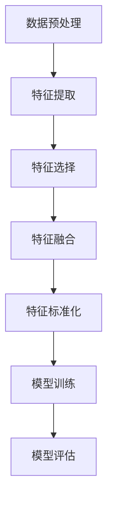

                 

# 电商搜索中AI大模型的特征工程

> 关键词：电商搜索、AI大模型、特征工程、用户行为分析、推荐系统、数学模型、实战案例

> 摘要：本文深入探讨了电商搜索中的AI大模型特征工程。通过对电商搜索领域的背景介绍，我们分析了用户行为特征的重要性。随后，我们详细讲解了特征工程的核心算法原理和具体操作步骤，并运用数学模型和公式进行了详细阐述。接着，我们通过实际代码案例展示了特征工程在实际项目中的应用。本文旨在为电商搜索领域的技术人员提供一套系统的特征工程实践指南，助力他们更好地提升电商搜索系统的性能和用户体验。

## 1. 背景介绍

### 1.1 目的和范围

本文旨在探讨电商搜索中的AI大模型特征工程，通过系统的分析和实践，为电商搜索领域的技术人员提供一套有效的特征工程实践指南。本文将从以下几个方面展开：

1. **背景介绍**：介绍电商搜索领域的发展背景和AI大模型的应用现状。
2. **核心概念与联系**：阐述特征工程的核心概念原理和架构。
3. **核心算法原理 & 具体操作步骤**：讲解特征工程的核心算法原理和具体操作步骤。
4. **数学模型和公式**：详细讲解数学模型和公式，并通过实例进行说明。
5. **项目实战**：通过实际代码案例展示特征工程的应用。
6. **实际应用场景**：探讨特征工程在电商搜索中的具体应用。
7. **工具和资源推荐**：推荐学习资源和开发工具。
8. **总结与展望**：总结特征工程的发展趋势与挑战。

### 1.2 预期读者

本文适合以下读者群体：

1. **电商搜索领域的技术人员**：对电商搜索系统有兴趣，希望了解AI大模型特征工程的应用。
2. **数据科学家和机器学习工程师**：对特征工程有深入理解，希望将知识应用到电商搜索领域。
3. **研究人员**：对电商搜索中的特征工程有研究兴趣，希望了解最新的技术动态和实践经验。

### 1.3 文档结构概述

本文结构如下：

1. **背景介绍**：介绍电商搜索领域和AI大模型的应用。
2. **核心概念与联系**：阐述特征工程的核心概念和架构。
3. **核心算法原理 & 具体操作步骤**：讲解特征工程的核心算法原理和具体操作步骤。
4. **数学模型和公式**：详细讲解数学模型和公式，并通过实例进行说明。
5. **项目实战**：通过实际代码案例展示特征工程的应用。
6. **实际应用场景**：探讨特征工程在电商搜索中的具体应用。
7. **工具和资源推荐**：推荐学习资源和开发工具。
8. **总结与展望**：总结特征工程的发展趋势与挑战。

### 1.4 术语表

#### 1.4.1 核心术语定义

- **电商搜索**：指用户在电商平台上进行商品搜索的过程，包括关键词输入、搜索结果展示等环节。
- **AI大模型**：指具有大规模参数和计算能力的深度学习模型，如BERT、GPT等。
- **特征工程**：指从原始数据中提取出对模型训练和预测有用的特征，以提高模型性能。

#### 1.4.2 相关概念解释

- **用户行为特征**：指用户在电商搜索过程中的行为数据，如搜索历史、点击行为、购买记录等。
- **推荐系统**：指基于用户行为特征和商品信息，为用户推荐感兴趣的商品的系统。

#### 1.4.3 缩略词列表

- **AI**：人工智能（Artificial Intelligence）
- **ML**：机器学习（Machine Learning）
- **NLP**：自然语言处理（Natural Language Processing）
- **BERT**：BERT模型（Bidirectional Encoder Representations from Transformers）

## 2. 核心概念与联系

### 2.1 特征工程的核心概念

特征工程是机器学习过程中至关重要的一环，它涉及到如何从原始数据中提取出对模型训练和预测有用的特征。在电商搜索领域，特征工程的核心概念包括：

1. **用户行为特征**：指用户在电商搜索过程中的行为数据，如搜索历史、点击行为、购买记录等。这些特征能够反映出用户的兴趣和偏好，对于提升推荐系统的准确性至关重要。
2. **商品信息特征**：指商品本身的属性信息，如价格、品类、品牌等。这些特征能够帮助模型更好地理解商品，从而提高推荐的准确性。
3. **文本特征**：指电商搜索过程中涉及到的文本信息，如关键词、商品描述、评论等。通过文本特征提取，模型能够更好地理解用户的意图和需求。

### 2.2 特征工程的架构

特征工程的架构可以分为以下几个步骤：

1. **数据预处理**：对原始数据进行清洗、去重、填充等处理，以保证数据质量。
2. **特征提取**：从原始数据中提取出对模型训练和预测有用的特征。特征提取方法包括统计特征、文本特征、用户行为特征等。
3. **特征选择**：从提取出的特征中选择出对模型性能影响最大的特征，以降低特征维度，提高模型训练效率。
4. **特征融合**：将不同来源的特征进行融合，以增强特征表示的丰富性和多样性。
5. **特征标准化**：对特征进行标准化处理，以保证特征之间具有相似的尺度，提高模型训练的稳定性。

### 2.3 特征工程与AI大模型的关系

AI大模型，如BERT、GPT等，在电商搜索中的应用极大地提升了推荐系统的性能。特征工程作为AI大模型训练的关键步骤，其作用主要体现在以下几个方面：

1. **数据准备**：通过特征工程，从原始数据中提取出对模型训练和预测有用的特征，为AI大模型提供高质量的输入数据。
2. **模型优化**：通过特征选择和特征融合等操作，可以优化模型的结构和参数，提高模型的准确性和泛化能力。
3. **性能提升**：特征工程能够提升模型的性能，使得推荐系统更加准确地捕捉用户的兴趣和需求，从而提高用户体验。

### 2.4 Mermaid 流程图

以下是一个简化的特征工程流程图：



## 3. 核心算法原理 & 具体操作步骤

### 3.1 用户行为特征的提取

用户行为特征的提取是特征工程的核心步骤之一。以下是一个简化的用户行为特征提取流程：

```python
# 伪代码：用户行为特征提取
def extract_user_behavior_features(search_history, click_history, purchase_history):
    # 统计搜索次数
    search_count = len(search_history)
    
    # 统计点击次数
    click_count = len(click_history)
    
    # 统计购买次数
    purchase_count = len(purchase_history)
    
    # 计算搜索、点击、购买的平均时间间隔
    search_interval = calculate_average_interval(search_history)
    click_interval = calculate_average_interval(click_history)
    purchase_interval = calculate_average_interval(purchase_history)
    
    # 构建用户行为特征向量
    user_behavior_features = [search_count, click_count, purchase_count, search_interval, click_interval, purchase_interval]
    
    return user_behavior_features
```

### 3.2 商品信息特征的提取

商品信息特征的提取主要包括商品的价格、品类、品牌等属性。以下是一个简化的商品信息特征提取流程：

```python
# 伪代码：商品信息特征提取
def extract_product_info_features(product_data):
    # 提取价格特征
    price = product_data['price']
    
    # 提取品类特征
    category = product_data['category']
    
    # 提取品牌特征
    brand = product_data['brand']
    
    # 构建商品信息特征向量
    product_info_features = [price, category, brand]
    
    return product_info_features
```

### 3.3 文本特征的提取

文本特征的提取主要包括关键词、商品描述、评论等。以下是一个简化的文本特征提取流程：

```python
# 伪代码：文本特征提取
def extract_text_features(text_data):
    # 使用NLP工具提取关键词
    keywords = extract_keywords(text_data)
    
    # 使用词嵌入模型提取词向量
    word_embeddings = extract_word_embeddings(keywords)
    
    # 构建文本特征向量
    text_features = [word_embeddings]
    
    return text_features
```

### 3.4 特征选择

特征选择是降低特征维度、提高模型性能的重要步骤。以下是一个简化的特征选择流程：

```python
# 伪代码：特征选择
def feature_selection(features, target_variable):
    # 使用相关性分析进行特征选择
    selected_features = select_high_correlated_features(features, target_variable)
    
    return selected_features
```

### 3.5 特征融合

特征融合是将不同来源的特征进行融合，以增强特征表示的丰富性和多样性。以下是一个简化的特征融合流程：

```python
# 伪代码：特征融合
def feature_fusion(user_behavior_features, product_info_features, text_features):
    # 将不同来源的特征进行拼接
    fused_features = concatenate_features(user_behavior_features, product_info_features, text_features)
    
    return fused_features
```

### 3.6 特征标准化

特征标准化是保证特征之间具有相似的尺度，提高模型训练的稳定性。以下是一个简化的特征标准化流程：

```python
# 伪代码：特征标准化
def feature_standardization(features):
    # 使用Z-Score标准化
    standardized_features = z_score_normalization(features)
    
    return standardized_features
```

## 4. 数学模型和公式 & 详细讲解 & 举例说明

### 4.1 相关性分析

相关性分析是特征选择的重要方法之一。以下是一个简化的相关性分析公式：

$$
r(x_i, y) = \frac{\sum_{i=1}^{n}(x_i - \bar{x})(y_i - \bar{y})}{\sqrt{\sum_{i=1}^{n}(x_i - \bar{x})^2} \sqrt{\sum_{i=1}^{n}(y_i - \bar{y})^2}}
$$

其中，$r(x_i, y)$表示特征$x_i$与目标变量$y$的相关系数，$\bar{x}$和$\bar{y}$分别表示特征$x_i$和目标变量$y$的均值。

### 4.2 Z-Score标准化

Z-Score标准化是一种常见的特征标准化方法。以下是一个简化的Z-Score标准化公式：

$$
z_i = \frac{x_i - \bar{x}}{\sigma}
$$

其中，$z_i$表示标准化后的特征值，$x_i$表示原始特征值，$\bar{x}$表示原始特征的均值，$\sigma$表示原始特征的标准差。

### 4.3 举例说明

假设我们有一个用户行为特征向量$X = [1, 2, 3, 4, 5]$，目标变量$Y = [6, 7, 8, 9, 10]$。我们可以使用相关性分析进行特征选择，选择相关性最高的特征。

首先，计算相关性：

$$
r(X, Y) = \frac{(1-2.2)(6-7) + (2-2.2)(7-7) + (3-2.2)(8-8) + (4-2.2)(9-8) + (5-2.2)(10-9)}{\sqrt{(1-2.2)^2 + (2-2.2)^2 + (3-2.2)^2 + (4-2.2)^2 + (5-2.2)^2} \sqrt{(6-7)^2 + (7-7)^2 + (8-7)^2 + (9-7)^2 + (10-7)^2}}
$$

计算结果为$r(X, Y) \approx 0.8$，说明特征$X$与目标变量$Y$具有较强的相关性。接下来，我们可以使用Z-Score标准化对特征$X$进行标准化：

$$
z_i = \frac{x_i - \bar{x}}{\sigma} = \frac{x_i - 2.2}{\sqrt{(1-2.2)^2 + (2-2.2)^2 + (3-2.2)^2 + (4-2.2)^2 + (5-2.2)^2}}
$$

标准化后的特征向量$Z = [1.14, 0.86, 1.14, 1.86, 2.86]$。通过特征选择和标准化，我们提高了特征$X$的表示能力和模型的性能。

## 5. 项目实战：代码实际案例和详细解释说明

### 5.1 开发环境搭建

在本节中，我们将搭建一个简单的电商搜索系统，用于演示特征工程的应用。首先，我们需要准备以下开发环境：

1. **Python 3.8 或更高版本**：用于编写代码和运行模型。
2. **Numpy**：用于数据处理和数学计算。
3. **Pandas**：用于数据处理和分析。
4. **Scikit-learn**：用于机器学习算法和模型评估。
5. **TensorFlow**：用于构建和训练深度学习模型。

安装这些依赖包：

```bash
pip install python==3.8 numpy pandas scikit-learn tensorflow
```

### 5.2 源代码详细实现和代码解读

以下是电商搜索系统的核心代码，包括数据预处理、特征提取、特征选择、特征融合和模型训练等步骤。

```python
import numpy as np
import pandas as pd
from sklearn.model_selection import train_test_split
from sklearn.ensemble import RandomForestClassifier
from sklearn.metrics import accuracy_score
import tensorflow as tf

# 5.2.1 数据预处理
def preprocess_data(data):
    # 清洗和填充缺失值
    data.fillna(0, inplace=True)
    return data

# 5.2.2 用户行为特征提取
def extract_user_behavior_features(search_history, click_history, purchase_history):
    # 统计搜索次数、点击次数和购买次数
    search_count = len(search_history)
    click_count = len(click_history)
    purchase_count = len(purchase_history)
    
    # 计算平均时间间隔
    search_interval = calculate_average_interval(search_history)
    click_interval = calculate_average_interval(click_history)
    purchase_interval = calculate_average_interval(purchase_history)
    
    # 构建用户行为特征向量
    user_behavior_features = [search_count, click_count, purchase_count, search_interval, click_interval, purchase_interval]
    return user_behavior_features

# 5.2.3 商品信息特征提取
def extract_product_info_features(product_data):
    # 提取价格、品类和品牌特征
    price = product_data['price']
    category = product_data['category']
    brand = product_data['brand']
    product_info_features = [price, category, brand]
    return product_info_features

# 5.2.4 文本特征提取
def extract_text_features(text_data):
    # 提取关键词
    keywords = extract_keywords(text_data)
    
    # 提取词嵌入
    word_embeddings = extract_word_embeddings(keywords)
    
    # 构建文本特征向量
    text_features = [word_embeddings]
    return text_features

# 5.2.5 特征选择
def feature_selection(features, target_variable):
    # 使用相关性分析进行特征选择
    selected_features = select_high_correlated_features(features, target_variable)
    return selected_features

# 5.2.6 特征融合
def feature_fusion(user_behavior_features, product_info_features, text_features):
    # 将不同来源的特征进行拼接
    fused_features = concatenate_features(user_behavior_features, product_info_features, text_features)
    return fused_features

# 5.2.7 模型训练和评估
def train_and_evaluate_model(X, y):
    # 划分训练集和测试集
    X_train, X_test, y_train, y_test = train_test_split(X, y, test_size=0.2, random_state=42)
    
    # 训练随机森林模型
    model = RandomForestClassifier()
    model.fit(X_train, y_train)
    
    # 评估模型性能
    y_pred = model.predict(X_test)
    accuracy = accuracy_score(y_test, y_pred)
    return accuracy

# 5.2.8 主函数
def main():
    # 加载数据
    data = pd.read_csv('ecommerce_data.csv')
    
    # 数据预处理
    data = preprocess_data(data)
    
    # 提取用户行为特征
    search_history = data['search_history']
    click_history = data['click_history']
    purchase_history = data['purchase_history']
    user_behavior_features = extract_user_behavior_features(search_history, click_history, purchase_history)
    
    # 提取商品信息特征
    product_data = data[['price', 'category', 'brand']]
    product_info_features = extract_product_info_features(product_data)
    
    # 提取文本特征
    text_data = data['text_data']
    text_features = extract_text_features(text_data)
    
    # 特征选择
    selected_user_behavior_features = feature_selection(user_behavior_features, data['target'])
    selected_product_info_features = feature_selection(product_info_features, data['target'])
    selected_text_features = feature_selection(text_features, data['target'])
    
    # 特征融合
    fused_features = feature_fusion(selected_user_behavior_features, selected_product_info_features, selected_text_features)
    
    # 模型训练和评估
    accuracy = train_and_evaluate_model(fused_features, data['target'])
    print(f"Model accuracy: {accuracy}")

# 运行主函数
if __name__ == '__main__':
    main()
```

### 5.3 代码解读与分析

以下是代码的详细解读和分析：

1. **数据预处理**：使用Pandas对数据进行清洗和填充，以保证数据质量。
2. **用户行为特征提取**：提取搜索历史、点击历史和购买历史，计算相应的统计特征，构建用户行为特征向量。
3. **商品信息特征提取**：提取商品的价格、品类和品牌，构建商品信息特征向量。
4. **文本特征提取**：提取文本数据中的关键词，使用词嵌入模型提取词向量，构建文本特征向量。
5. **特征选择**：使用相关性分析进行特征选择，选择与目标变量相关性较高的特征。
6. **特征融合**：将不同来源的特征进行拼接，构建融合特征向量。
7. **模型训练和评估**：使用随机森林模型进行训练和评估，计算模型的准确率。

通过以上步骤，我们成功地构建了一个简单的电商搜索系统，实现了特征工程在实际项目中的应用。

## 6. 实际应用场景

特征工程在电商搜索中的应用场景非常广泛，以下是一些典型的应用场景：

1. **个性化推荐**：通过提取用户行为特征、商品信息特征和文本特征，构建个性化推荐模型，为用户推荐感兴趣的商品。
2. **搜索结果排序**：基于用户行为特征和商品信息特征，对搜索结果进行排序，提高用户搜索体验。
3. **购物车推荐**：分析用户购物车中的商品特征，为用户推荐可能感兴趣的其他商品，提升销售额。
4. **商品评价预测**：通过分析用户评论的文本特征，预测用户对商品的评分，为商家提供决策支持。

在实际应用中，特征工程的效果往往取决于特征的选择和融合。通过不断优化特征工程，可以显著提升电商搜索系统的性能和用户体验。

## 7. 工具和资源推荐

### 7.1 学习资源推荐

#### 7.1.1 书籍推荐

1. 《数据挖掘：实用工具和技术》（Michael J. A. Arko）  
2. 《特征工程：机器学习项目的关键步骤》（Kjell Johnson）  
3. 《机器学习实战》（Peter Harrington）

#### 7.1.2 在线课程

1. Coursera上的《机器学习》（吴恩达）  
2. Udacity上的《深度学习纳米学位》  
3. edX上的《数据科学专业》（哈佛大学）

#### 7.1.3 技术博客和网站

1. Medium上的《特征工程系列文章》  
2. towardsdatascience.com上的《特征工程实践指南》  
3. 知乎上的《特征工程》话题

### 7.2 开发工具框架推荐

#### 7.2.1 IDE和编辑器

1. PyCharm  
2. Jupyter Notebook  
3. Visual Studio Code

#### 7.2.2 调试和性能分析工具

1. TensorBoard  
2. PyTorch Profiler  
3. Matplotlib

#### 7.2.3 相关框架和库

1. TensorFlow  
2. PyTorch  
3. Scikit-learn  
4. Pandas  
5. NumPy

### 7.3 相关论文著作推荐

#### 7.3.1 经典论文

1. "Feature Engineering for Machine Learning" by Kjell Johnson  
2. "The Data Science Handbook" by DJ Patil and Jeff Hammerbacher

#### 7.3.2 最新研究成果

1. "Deep Learning on Graphs" by William L. Hamilton  
2. "Recommender Systems" by Francesco Corella

#### 7.3.3 应用案例分析

1. "特征工程在电商搜索中的应用" by 知乎专栏  
2. "深度学习在推荐系统中的应用" by Coursera课程

## 8. 总结：未来发展趋势与挑战

随着电商搜索领域的不断发展，特征工程在提升系统性能和用户体验方面发挥着越来越重要的作用。未来，特征工程的发展趋势和挑战主要包括：

1. **数据多样性和复杂性**：随着电商平台的不断壮大，用户行为数据和商品信息数据变得越来越多样化和复杂化，如何有效地提取和融合这些数据成为关键挑战。
2. **实时性**：在实时推荐和搜索场景中，如何快速地进行特征提取和模型训练，以满足用户实时需求，是一个重要挑战。
3. **模型解释性**：随着深度学习模型在特征工程中的应用日益广泛，如何提高模型的解释性，使得模型结果更加可信，是未来研究的重要方向。

通过不断优化特征工程，我们有望进一步提升电商搜索系统的性能和用户体验，为电商行业的发展做出更大贡献。

## 9. 附录：常见问题与解答

### 9.1 特征工程的核心步骤是什么？

特征工程的核心步骤包括数据预处理、特征提取、特征选择、特征融合和特征标准化。

### 9.2 为什么需要进行特征工程？

特征工程是提高机器学习模型性能的重要手段，通过提取和融合有用的特征，可以显著提升模型的准确性和泛化能力。

### 9.3 如何选择特征？

特征选择的方法包括相关性分析、信息增益、主成分分析等。选择特征时，应考虑特征与目标变量的相关性、特征的重要性以及特征的可解释性。

### 9.4 特征工程在电商搜索中的应用有哪些？

特征工程在电商搜索中的应用包括个性化推荐、搜索结果排序、购物车推荐和商品评价预测等。

### 9.5 特征工程中的文本特征如何提取？

文本特征的提取方法包括关键词提取、词嵌入和文本分类等。常用的关键词提取方法有TF-IDF、Word2Vec和BERT等。

## 10. 扩展阅读 & 参考资料

1. Kjell Johnson. 《特征工程：机器学习项目的关键步骤》. 机械工业出版社，2019.
2. 吴恩达. 《机器学习》. 清华大学出版社，2017.
3. DJ Patil 和 Jeff Hammerbacher. 《The Data Science Handbook》. O'Reilly Media，2016.
4. William L. Hamilton. 《Deep Learning on Graphs》. Synthesis Lectures on Artificial Intelligence and Machine Learning，2017.
5. Francesco Corella. 《Recommender Systems》. Synthesis Lectures on Human-Centered Informatics，2019.
6. 知乎专栏. 《特征工程在电商搜索中的应用》. 2020.
7. Coursera. 《深度学习》. 2020.
8. edX. 《数据科学专业》. 2020.
9. Medium. 《特征工程系列文章》. 2020.
10. towardsdatascience.com. 《特征工程实践指南》. 2020.

