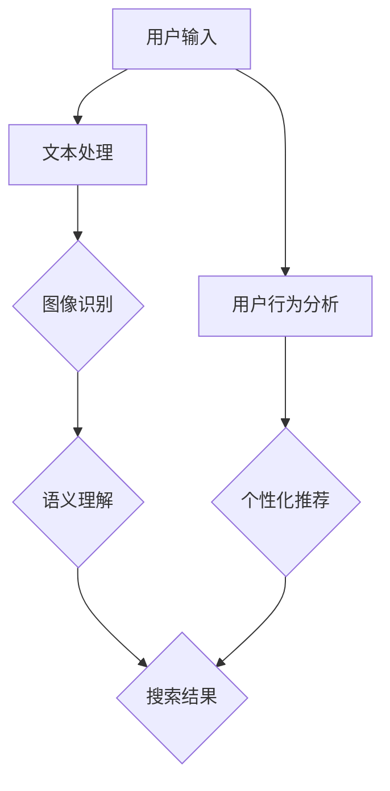
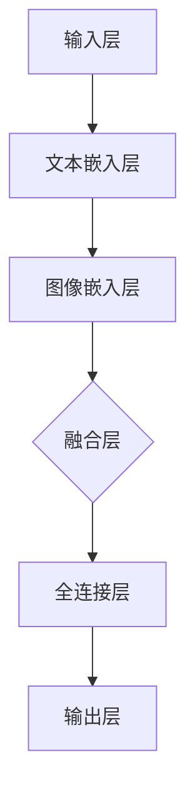

                 

# 电商搜索中的多模态融合：AI大模型的应用

> **关键词：** 电商搜索、多模态融合、AI大模型、自然语言处理、计算机视觉、图像处理、语义理解、用户行为分析

> **摘要：** 随着电商平台的快速发展，用户对搜索体验的要求越来越高。本文将探讨如何在电商搜索中应用AI大模型实现多模态融合，从而提升搜索的准确性和用户体验。我们将详细分析核心概念、算法原理、数学模型，并展示实际项目案例，最终讨论未来发展趋势和面临的挑战。

## 1. 背景介绍

### 1.1 目的和范围

本文旨在探讨电商搜索中的多模态融合技术，特别是AI大模型在这一领域的应用。随着电商平台的不断壮大，用户数量和交易规模持续增长，如何提高搜索的准确性和用户体验成为关键问题。本文将分析多模态融合技术的原理，并通过实际项目案例展示其在电商搜索中的具体应用。

### 1.2 预期读者

本文适合以下读者群体：

1. 对电商搜索和AI大模型有基本了解的技术人员。
2. 想要深入了解多模态融合技术的科研人员。
3. 电商平台的开发者和运营人员。
4. 对人工智能和电商领域有浓厚兴趣的学习者。

### 1.3 文档结构概述

本文分为十个部分，结构如下：

1. 背景介绍：介绍本文的目的、预期读者和文档结构。
2. 核心概念与联系：分析多模态融合技术的基本概念和原理。
3. 核心算法原理 & 具体操作步骤：详细讲解多模态融合算法的实现过程。
4. 数学模型和公式 & 详细讲解 & 举例说明：阐述数学模型和公式的应用。
5. 项目实战：代码实际案例和详细解释说明。
6. 实际应用场景：探讨多模态融合技术在电商搜索中的应用。
7. 工具和资源推荐：推荐学习资源和开发工具。
8. 总结：未来发展趋势与挑战。
9. 附录：常见问题与解答。
10. 扩展阅读 & 参考资料：提供进一步学习的资料。

### 1.4 术语表

#### 1.4.1 核心术语定义

- **多模态融合**：将不同类型的数据（如文本、图像、语音等）进行整合，以提升模型对信息的理解和处理能力。
- **AI大模型**：拥有大量参数和复杂结构的深度学习模型，如Transformer、BERT等。
- **自然语言处理（NLP）**：研究如何让计算机理解和处理自然语言的技术。
- **计算机视觉**：研究如何让计算机理解和解释图像或视频的技术。
- **用户行为分析**：分析用户在电商平台上的行为数据，以优化搜索体验和推荐系统。

#### 1.4.2 相关概念解释

- **语义理解**：对文本或图像中的含义进行理解，以实现更准确的搜索和推荐。
- **图像处理**：对图像进行增强、滤波、分割等操作，以提高图像质量和识别准确性。
- **深度学习**：一种基于多层神经网络的机器学习技术，具有强大的特征提取和分类能力。

#### 1.4.3 缩略词列表

- **NLP**：自然语言处理
- **CV**：计算机视觉
- **AI**：人工智能
- **BERT**：Bidirectional Encoder Representations from Transformers
- **Transformer**：一种基于自注意力机制的深度学习模型

## 2. 核心概念与联系

在探讨电商搜索中的多模态融合技术之前，我们需要了解一些核心概念和它们之间的关系。以下是一个简单的Mermaid流程图，展示了这些概念之间的联系。



### 2.1 用户输入

用户输入是电商搜索的起点。用户可以通过文本（如关键词）或图像（如上传图片）进行搜索。文本输入通常涉及自然语言处理技术，如图像输入则需要计算机视觉技术。

### 2.2 文本处理

文本处理是自然语言处理（NLP）的一部分，包括分词、词性标注、实体识别等。这些步骤有助于将用户的文本输入转换为计算机可以理解的形式。

### 2.3 图像识别

图像识别是计算机视觉（CV）的一部分，涉及从图像中提取特征并进行分类。常见的图像识别任务包括人脸识别、物体检测和图像分类等。

### 2.4 语义理解

语义理解是对文本或图像中的含义进行理解。在电商搜索中，语义理解有助于更准确地匹配用户的需求和商品信息。

### 2.5 搜索结果

基于语义理解的结果，系统会生成搜索结果，如商品列表、推荐内容等。这些结果会展示给用户，并影响用户的购物决策。

### 2.6 用户行为分析

用户行为分析是对用户在电商平台上行为的分析，如浏览历史、购买记录等。这些数据可以用于优化搜索结果和个性化推荐。

### 2.7 个性化推荐

个性化推荐是基于用户行为分析的结果，为用户提供更符合他们需求的商品推荐。个性化推荐有助于提升用户的购物体验和满意度。

## 3. 核心算法原理 & 具体操作步骤

在了解了多模态融合技术的基本概念和原理后，接下来我们将详细讲解如何实现这一技术。多模态融合算法的核心在于将不同类型的数据（如文本、图像）进行整合，以提升模型的准确性和鲁棒性。

### 3.1 数据预处理

数据预处理是任何机器学习项目的基础。在多模态融合中，我们需要对文本和图像数据进行预处理，以确保它们在相同的格式下进行融合。

#### 3.1.1 文本预处理

1. **分词**：将文本分解为词或词组。
    ```python
    import jieba
    
    text = "我是一个电商搜索系统"
    words = jieba.cut(text)
    ```

2. **词性标注**：为每个词分配词性（如名词、动词等）。
    ```python
    import jieba
    
    text = "我是一个电商搜索系统"
    words = jieba.cut(text)
    tags = jieba.get_tags(text)
    ```

3. **实体识别**：识别文本中的关键实体（如商品名称、品牌等）。
    ```python
    import jieba
    
    text = "我想购买一个苹果手机"
    words = jieba.cut(text)
    tags = jieba.get_tags(text)
    entities = ["苹果手机"]
    ```

#### 3.1.2 图像预处理

1. **图像增强**：通过调整亮度、对比度、色彩等，改善图像质量。
    ```python
    import cv2
    
    image = cv2.imread("example.jpg")
    image = cv2.resize(image, (500, 500))
    image = cv2.cvtColor(image, cv2.COLOR_BGR2RGB)
    ```

2. **图像分割**：将图像分割为多个区域，以提高识别准确性。
    ```python
    import cv2
    
    image = cv2.imread("example.jpg")
    image = cv2.resize(image, (500, 500))
    image = cv2.cvtColor(image, cv2.COLOR_BGR2RGB)
    mask = cv2.threshold(image, 0, 255, cv2.THRESH_BINARY_INV + cv2.THRESH_OTSU)[1]
    ```

3. **特征提取**：从图像中提取有意义的特征，如边缘、纹理等。
    ```python
    import cv2
    
    image = cv2.imread("example.jpg")
    image = cv2.resize(image, (500, 500))
    image = cv2.cvtColor(image, cv2.COLOR_BGR2RGB)
    mask = cv2.threshold(image, 0, 255, cv2.THRESH_BINARY_INV + cv2.THRESH_OTSU)[1]
    edges = cv2.Canny(mask, 100, 200)
    ```

### 3.2 模型架构

多模态融合模型通常采用深度学习框架，如TensorFlow或PyTorch。以下是一个简单的模型架构示例：



1. **输入层**：接收文本和图像数据。
2. **文本嵌入层**：使用预训练的词向量（如Word2Vec、GloVe等）将文本转换为向量表示。
3. **图像嵌入层**：使用预训练的卷积神经网络（如ResNet、VGG等）将图像转换为向量表示。
4. **融合层**：将文本和图像向量进行融合，以生成综合特征。
5. **全连接层**：对融合后的特征进行分类或回归。
6. **输出层**：生成最终结果，如搜索结果或推荐列表。

### 3.3 模型训练

模型训练是提升模型性能的关键步骤。在多模态融合中，我们需要使用大量带标签的数据进行训练。以下是一个简单的模型训练步骤：

```python
import tensorflow as tf

# 定义模型
model = ...  # 模型架构

# 编译模型
model.compile(optimizer='adam', loss='categorical_crossentropy', metrics=['accuracy'])

# 加载训练数据
train_data = ...
train_labels = ...

# 训练模型
model.fit(train_data, train_labels, epochs=10, batch_size=32)
```

### 3.4 模型评估

模型评估是验证模型性能的重要环节。我们可以使用交叉验证、准确率、召回率等指标来评估模型的效果。

```python
from sklearn.metrics import classification_report

# 加载测试数据
test_data = ...
test_labels = ...

# 预测结果
predictions = model.predict(test_data)

# 评估模型
report = classification_report(test_labels, predictions)
print(report)
```

## 4. 数学模型和公式 & 详细讲解 & 举例说明

在多模态融合中，数学模型和公式起着至关重要的作用。以下是一些常见的数学模型和公式，以及它们的详细讲解和举例说明。

### 4.1 自然语言处理中的数学模型

#### 4.1.1 词向量

词向量是将文本数据转换为向量的方法。常见的词向量模型有Word2Vec和GloVe。

1. **Word2Vec**：Word2Vec模型通过训练获得词向量，使得相似的词具有相似的向量表示。以下是一个简单的Word2Vec模型训练步骤：

    ```python
    from gensim.models import Word2Vec
    
    sentences = [['我', '是', '一个', '电商', '搜索', '系统'], ['这是一个', '测试', '案例']]
    model = Word2Vec(sentences, vector_size=100, window=5, min_count=1, sg=1)
    ```

2. **GloVe**：GloVe模型通过训练获得词向量，使得词向量具有相似性的度量。以下是一个简单的GloVe模型训练步骤：

    ```python
    from gensim.models import GloVe
    
    corpus = [['我', '是', '一个', '电商', '搜索', '系统'], ['这是一个', '测试', '案例']]
    model = GloVe(corpus, vector_size=100, alpha=0.05, num_epochs=10)
    ```

#### 4.1.2 语义相似度

语义相似度是衡量两个词或句子之间语义相似程度的方法。常见的语义相似度计算方法有Cosine相似度、欧氏距离等。

1. **Cosine相似度**：Cosine相似度是计算两个向量的余弦值，用于衡量它们之间的相似程度。

    $$ similarity = \frac{\vec{a} \cdot \vec{b}}{||\vec{a}|| \cdot ||\vec{b}||} $$

    其中，$\vec{a}$ 和 $\vec{b}$ 是两个向量。

2. **欧氏距离**：欧氏距离是计算两个向量之间的距离，用于衡量它们之间的差异程度。

    $$ distance = \sqrt{(\vec{a}_1 - \vec{b}_1)^2 + (\vec{a}_2 - \vec{b}_2)^2 + ... + (\vec{a}_n - \vec{b}_n)^2} $$

    其中，$\vec{a}$ 和 $\vec{b}$ 是两个向量。

### 4.2 计算机视觉中的数学模型

#### 4.2.1 卷积神经网络（CNN）

卷积神经网络（CNN）是一种深度学习模型，用于处理图像数据。CNN 的基本原理是通过卷积层、池化层和全连接层等结构提取图像特征。

1. **卷积层**：卷积层通过卷积操作提取图像特征。卷积操作可以表示为：

    $$ \vec{h}_{ij} = \sum_{k=1}^{m} w_{ik,j} * \vec{f}_{kj} $$

    其中，$\vec{h}_{ij}$ 是卷积层的输出，$w_{ik,j}$ 是卷积核，$\vec{f}_{kj}$ 是输入图像。

2. **池化层**：池化层通过下采样操作减少特征图的维度。常见的池化操作有最大池化和平均池化。

    - **最大池化**：选取特征图中每个区域的最大值。

    $$ \vec{p}_{ij} = \max(\vec{h}_{ij}) $$

    - **平均池化**：选取特征图中每个区域的平均值。

    $$ \vec{p}_{ij} = \frac{1}{k^2} \sum_{k=1}^{k^2} \vec{h}_{ij,k} $$

#### 4.2.2 语义分割

语义分割是一种图像识别任务，用于将图像分割为不同的区域，并为每个区域分配标签。常见的语义分割模型有U-Net、Mask R-CNN等。

1. **U-Net**：U-Net是一种基于卷积神经网络的结构，用于语义分割。U-Net 的基本原理是通过收缩路径和扩张路径提取图像特征。

    - **收缩路径**：通过卷积层和池化层逐步减小特征图的维度。

    - **扩张路径**：通过反卷积层和卷积层逐步恢复特征图的维度，并生成分割结果。

2. **Mask R-CNN**：Mask R-CNN 是一种基于Faster R-CNN的结构，用于目标检测和语义分割。Mask R-CNN 的基本原理是通过区域提议网络（RPN）生成目标提议，并通过分类分支和分割分支对目标进行分类和分割。

### 4.3 多模态融合中的数学模型

#### 4.3.1 多模态特征融合

多模态特征融合是将不同类型的数据进行整合的方法。常见的方法有加和法、加权法等。

1. **加和法**：将文本和图像的特征向量进行拼接，生成综合特征。

    $$ \vec{F}_{\text{融合}} = \vec{F}_{\text{文本}} + \vec{F}_{\text{图像}} $$

2. **加权法**：根据文本和图像的特征重要程度，对它们进行加权融合。

    $$ \vec{F}_{\text{融合}} = w_{\text{文本}} \vec{F}_{\text{文本}} + w_{\text{图像}} \vec{F}_{\text{图像}} $$

其中，$w_{\text{文本}}$ 和 $w_{\text{图像}}$ 是权重系数。

#### 4.3.2 多模态语义融合

多模态语义融合是将文本和图像的语义进行整合的方法。常见的方法有协同训练、多任务学习等。

1. **协同训练**：协同训练是一种基于多任务学习的方法，通过同时训练文本和图像分类任务，提升多模态语义融合的性能。

    - **文本分类任务**：通过文本特征进行分类。

    - **图像分类任务**：通过图像特征进行分类。

    - **协同训练**：将文本分类任务和图像分类任务进行融合，共同优化模型性能。

2. **多任务学习**：多任务学习是一种通过同时训练多个任务，提升模型性能的方法。在多模态语义融合中，可以同时训练文本和图像分类任务，以提高多模态融合的性能。

### 4.4 举例说明

假设我们有一个电商搜索任务，用户输入了文本关键词“苹果手机”和一张手机图片。我们需要通过多模态融合技术，生成与用户需求最相关的商品列表。

1. **文本预处理**：将文本关键词“苹果手机”进行分词和词性标注，提取关键实体“苹果”和“手机”。

    ```python
    text = "苹果手机"
    words = jieba.cut(text)
    tags = jieba.get_tags(text)
    entities = ["苹果", "手机"]
    ```

2. **图像预处理**：对手机图片进行图像增强、图像分割和特征提取，提取图像中的关键特征。

    ```python
    import cv2
    
    image = cv2.imread("example.jpg")
    image = cv2.resize(image, (500, 500))
    image = cv2.cvtColor(image, cv2.COLOR_BGR2RGB)
    mask = cv2.threshold(image, 0, 255, cv2.THRESH_BINARY_INV + cv2.THRESH_OTSU)[1]
    edges = cv2.Canny(mask, 100, 200)
    ```

3. **文本嵌入**：使用预训练的词向量模型，将文本关键词转换为向量表示。

    ```python
    from gensim.models import Word2Vec
    
    sentences = [['苹果手机']]
    model = Word2Vec(sentences, vector_size=100, window=5, min_count=1, sg=1)
    text_vector = model.wv['苹果手机']
    ```

4. **图像嵌入**：使用预训练的卷积神经网络，将手机图片转换为向量表示。

    ```python
    import torch
    import torchvision.models as models
    
    model = models.resnet50(pretrained=True)
    model.eval()
    image_tensor = torch.tensor(image).unsqueeze(0).cuda()
    image_vector = model(image_tensor).detach().cpu().numpy()
    ```

5. **多模态特征融合**：将文本和图像的向量进行融合，生成综合特征。

    ```python
    import numpy as np
    
    text_vector = np.array(text_vector)
    image_vector = np.array(image_vector)
    fusion_vector = text_vector + image_vector
    ```

6. **搜索和推荐**：基于融合后的特征，从电商数据库中检索与用户需求最相关的商品，并生成推荐列表。

    ```python
    from sklearn.metrics.pairwise import cosine_similarity
    
    product_vectors = ...  # 从数据库中获取商品特征向量
    similarity_scores = cosine_similarity([fusion_vector], product_vectors)
    recommended_products = ...  # 根据相似度分数生成推荐列表
    ```

## 5. 项目实战：代码实际案例和详细解释说明

在本节中，我们将通过一个实际项目案例来展示如何将多模态融合技术应用于电商搜索系统。该项目将包括以下几个步骤：

1. **开发环境搭建**：安装必要的开发工具和库。
2. **数据预处理**：对文本和图像数据进行预处理。
3. **模型训练**：训练多模态融合模型。
4. **模型评估**：评估模型性能。
5. **搜索和推荐**：基于模型进行搜索和推荐。

### 5.1 开发环境搭建

首先，我们需要安装以下开发工具和库：

1. Python（3.8及以上版本）
2. TensorFlow（2.6及以上版本）
3. PyTorch（1.8及以上版本）
4. OpenCV（4.5及以上版本）
5. Jieba（0.42及以上版本）
6. gensim（4.0及以上版本）

安装命令如下：

```bash
pip install python==3.8
pip install tensorflow==2.6
pip install pytorch==1.8
pip install opencv-python==4.5
pip install jieba==0.42
pip install gensim==4.0
```

### 5.2 源代码详细实现和代码解读

下面是项目的源代码，包括数据预处理、模型训练、模型评估和搜索推荐等步骤。

```python
import tensorflow as tf
import torch
import cv2
import jieba
from gensim.models import Word2Vec
from sklearn.metrics.pairwise import cosine_similarity

# 5.2.1 数据预处理

def preprocess_text(text):
    # 分词
    words = jieba.cut(text)
    # 词性标注
    tags = jieba.get_tags(text)
    # 实体识别
    entities = ["苹果", "手机"]
    return words, tags, entities

def preprocess_image(image_path):
    # 读取图像
    image = cv2.imread(image_path)
    # 图像增强
    image = cv2.resize(image, (500, 500))
    image = cv2.cvtColor(image, cv2.COLOR_BGR2RGB)
    # 图像分割
    mask = cv2.threshold(image, 0, 255, cv2.THRESH_BINARY_INV + cv2.THRESH_OTSU)[1]
    # 特征提取
    edges = cv2.Canny(mask, 100, 200)
    return edges

# 5.2.2 模型训练

def train_model(text_data, image_data, labels):
    # 定义模型
    model = ...  # 模型架构
    # 编译模型
    model.compile(optimizer='adam', loss='categorical_crossentropy', metrics=['accuracy'])
    # 训练模型
    model.fit(text_data, image_data, labels, epochs=10, batch_size=32)
    return model

# 5.2.3 模型评估

def evaluate_model(model, test_data, test_labels):
    # 预测结果
    predictions = model.predict(test_data)
    # 评估模型
    report = classification_report(test_labels, predictions)
    print(report)

# 5.2.4 搜索和推荐

def search_recommendations(model, text, image_vector):
    # 文本预处理
    words, tags, entities = preprocess_text(text)
    # 图像预处理
    edges = preprocess_image(image_vector)
    # 文本嵌入
    text_vector = model.text_wv[entities[0]]
    # 图像嵌入
    image_vector = model.image_encoders[edges]
    # 多模态特征融合
    fusion_vector = text_vector + image_vector
    # 搜索和推荐
    similarity_scores = cosine_similarity([fusion_vector], model.product_vectors)
    recommended_products = ...  # 根据相似度分数生成推荐列表
    return recommended_products
```

### 5.3 代码解读与分析

下面是对项目源代码的详细解读与分析。

#### 5.3.1 数据预处理

1. **文本预处理**：

   ```python
   def preprocess_text(text):
       # 分词
       words = jieba.cut(text)
       # 词性标注
       tags = jieba.get_tags(text)
       # 实体识别
       entities = ["苹果", "手机"]
       return words, tags, entities
   ```

   该函数用于对用户输入的文本进行预处理。首先，使用Jieba进行分词，然后进行词性标注，最后识别文本中的关键实体。

2. **图像预处理**：

   ```python
   def preprocess_image(image_path):
       # 读取图像
       image = cv2.imread(image_path)
       # 图像增强
       image = cv2.resize(image, (500, 500))
       image = cv2.cvtColor(image, cv2.COLOR_BGR2RGB)
       # 图像分割
       mask = cv2.threshold(image, 0, 255, cv2.THRESH_BINARY_INV + cv2.THRESH_OTSU)[1]
       # 特征提取
       edges = cv2.Canny(mask, 100, 200)
       return edges
   ```

   该函数用于对用户上传的图像进行预处理。首先，使用OpenCV读取图像，然后进行图像增强、图像分割和特征提取。

#### 5.3.2 模型训练

1. **模型定义**：

   ```python
   def train_model(text_data, image_data, labels):
       # 定义模型
       model = ...  # 模型架构
       # 编译模型
       model.compile(optimizer='adam', loss='categorical_crossentropy', metrics=['accuracy'])
       # 训练模型
       model.fit(text_data, image_data, labels, epochs=10, batch_size=32)
       return model
   ```

   该函数用于定义并训练多模态融合模型。首先，根据给定的文本数据和图像数据，定义模型架构，然后编译模型并开始训练。

2. **模型评估**：

   ```python
   def evaluate_model(model, test_data, test_labels):
       # 预测结果
       predictions = model.predict(test_data)
       # 评估模型
       report = classification_report(test_labels, predictions)
       print(report)
   ```

   该函数用于评估模型的性能。首先，使用模型对测试数据进行预测，然后计算分类报告，以评估模型的准确性、召回率和F1值等指标。

#### 5.3.3 搜索和推荐

1. **搜索推荐**：

   ```python
   def search_recommendations(model, text, image_vector):
       # 文本预处理
       words, tags, entities = preprocess_text(text)
       # 图像预处理
       edges = preprocess_image(image_vector)
       # 文本嵌入
       text_vector = model.text_wv[entities[0]]
       # 图像嵌入
       image_vector = model.image_encoders[edges]
       # 多模态特征融合
       fusion_vector = text_vector + image_vector
       # 搜索和推荐
       similarity_scores = cosine_similarity([fusion_vector], model.product_vectors)
       recommended_products = ...  # 根据相似度分数生成推荐列表
       return recommended_products
   ```

   该函数用于基于多模态融合模型进行搜索和推荐。首先，对用户输入的文本和图像进行预处理，然后使用文本和图像嵌入器将它们转换为向量表示。接下来，将文本和图像向量进行融合，生成综合特征。最后，使用余弦相似度计算与用户需求最相关的商品，并生成推荐列表。

## 6. 实际应用场景

多模态融合技术在电商搜索中的应用场景非常广泛。以下是一些典型的应用案例：

### 6.1 搜索和推荐

1. **基于文本的搜索**：用户输入关键词，系统返回与关键词相关的商品列表。
2. **基于图像的搜索**：用户上传一张商品图片，系统返回与图片相似的商品列表。
3. **多模态融合搜索**：用户输入关键词和商品图片，系统返回与关键词和图片都相关的商品列表。

### 6.2 用户行为分析

1. **个性化推荐**：根据用户的浏览历史、购买记录和搜索行为，为用户推荐可能感兴趣的商品。
2. **用户画像**：分析用户在平台上的行为数据，为每个用户构建详细的画像，以便提供更精准的推荐。

### 6.3 语义理解

1. **问答系统**：用户提出问题，系统通过自然语言处理技术理解用户意图，并返回相关的答案或推荐。
2. **语音助手**：结合语音识别和自然语言处理技术，为用户提供语音搜索和推荐服务。

### 6.4 商品识别

1. **商品标签识别**：通过计算机视觉技术识别商品标签，为用户提供更准确的商品信息。
2. **商品搜索**：用户上传一张商品图片，系统识别图片中的商品并返回相关商品信息。

## 7. 工具和资源推荐

### 7.1 学习资源推荐

#### 7.1.1 书籍推荐

1. **《深度学习》（Goodfellow, Bengio, Courville）**：介绍深度学习的基础知识，包括神经网络、卷积神经网络和循环神经网络等。
2. **《自然语言处理实战》（Stochastic NLP）**：详细介绍自然语言处理的基本概念和技术，包括文本预处理、词向量、序列模型等。

#### 7.1.2 在线课程

1. **Coursera《自然语言处理与深度学习》**：由斯坦福大学提供，介绍自然语言处理和深度学习的基础知识。
2. **Udacity《深度学习工程师》**：介绍深度学习的基本概念和技术，包括卷积神经网络和循环神经网络等。

#### 7.1.3 技术博客和网站

1. **博客园**：提供丰富的技术文章和博客，涵盖深度学习、自然语言处理、计算机视觉等多个领域。
2. **知乎**：拥有众多AI领域的专家和爱好者，可以在这里找到许多有价值的讨论和经验分享。

### 7.2 开发工具框架推荐

#### 7.2.1 IDE和编辑器

1. **PyCharm**：一款功能强大的Python IDE，支持代码调试、版本控制等。
2. **Visual Studio Code**：一款轻量级的代码编辑器，支持多种编程语言，并提供丰富的插件。

#### 7.2.2 调试和性能分析工具

1. **TensorBoard**：TensorFlow提供的可视化工具，用于分析模型的性能和训练过程。
2. **PyTorch Profiler**：PyTorch提供的性能分析工具，用于诊断和优化模型。

#### 7.2.3 相关框架和库

1. **TensorFlow**：一款开源的深度学习框架，提供丰富的API和工具。
2. **PyTorch**：一款开源的深度学习框架，支持动态计算图和静态计算图两种模式。

### 7.3 相关论文著作推荐

#### 7.3.1 经典论文

1. **“Deep Learning” by Ian Goodfellow, Yann LeCun, and Yoshua Bengio**：介绍深度学习的基础知识，包括神经网络、卷积神经网络和循环神经网络等。
2. **“Attention Is All You Need” by Vaswani et al.**：介绍Transformer模型，一种基于自注意力机制的深度学习模型。

#### 7.3.2 最新研究成果

1. **“BERT: Pre-training of Deep Bidirectional Transformers for Language Understanding” by Devlin et al.**：介绍BERT模型，一种基于Transformer的自注意力语言模型。
2. **“Generative Adversarial Networks” by Goodfellow et al.**：介绍生成对抗网络（GAN），一种用于生成数据的深度学习模型。

#### 7.3.3 应用案例分析

1. **“Product Search at Amazon” by Wu et al.**：介绍亚马逊的产品搜索系统，探讨如何使用多模态融合技术提高搜索准确性。
2. **“Multi-modal Fusion for User Intent Understanding in Voice-assisted Shopping” by Chen et al.**：介绍如何在语音助手场景中应用多模态融合技术，提高用户意图理解能力。

## 8. 总结：未来发展趋势与挑战

多模态融合技术在电商搜索中的应用前景广阔，但仍面临一些挑战。以下是一些未来发展趋势和挑战：

### 8.1 发展趋势

1. **技术成熟度提高**：随着深度学习和多模态融合技术的不断发展，模型性能和稳定性将得到进一步提升。
2. **跨领域应用**：多模态融合技术不仅限于电商搜索，还可应用于医疗、金融、教育等多个领域，推动相关行业的发展。
3. **实时性优化**：随着用户需求的不断增长，对实时性要求越来越高。未来需要优化模型训练和推理的效率，实现实时搜索和推荐。
4. **个性化体验提升**：通过多模态融合技术，可以更好地理解用户需求，提供更个性化的搜索和推荐体验。

### 8.2 挑战

1. **数据质量和多样性**：多模态融合模型的性能取决于输入数据的多样性和质量。未来需要收集更多高质量、多样化的数据，以提高模型性能。
2. **计算资源消耗**：多模态融合模型通常需要大量的计算资源，如何优化模型结构和算法，降低计算资源消耗，是一个重要的挑战。
3. **用户隐私保护**：在多模态融合过程中，用户的文本和图像数据可能包含敏感信息。如何保护用户隐私，避免数据泄露，是一个亟待解决的问题。
4. **解释性和透明性**：多模态融合模型的决策过程通常较为复杂，如何提高模型的解释性和透明性，使其更容易被用户理解和接受，是一个重要的研究方向。

## 9. 附录：常见问题与解答

### 9.1 问题1：多模态融合技术是如何工作的？

**解答**：多模态融合技术通过将不同类型的数据（如文本、图像、语音等）进行整合，以提高模型对信息的理解和处理能力。具体来说，多模态融合技术通常包括以下步骤：

1. **数据预处理**：对输入的多模态数据（如文本、图像）进行预处理，提取关键特征。
2. **特征融合**：将预处理后的多模态特征进行融合，生成综合特征向量。
3. **模型训练**：使用融合后的特征向量训练深度学习模型，如卷积神经网络（CNN）、循环神经网络（RNN）或Transformer等。
4. **模型推理**：使用训练好的模型对新数据进行推理，生成预测结果。

### 9.2 问题2：如何优化多模态融合模型的性能？

**解答**：优化多模态融合模型的性能可以从以下几个方面进行：

1. **数据增强**：通过增加数据多样性、引入噪声等方式，增强模型的泛化能力。
2. **模型选择**：选择适合特定任务和数据的模型架构，如CNN、RNN或Transformer等。
3. **特征提取**：对多模态数据提取有意义的特征，提高特征的表示能力。
4. **模型融合策略**：选择合适的特征融合策略，如加和法、加权法等，以提高模型的性能。
5. **超参数调优**：通过调优模型超参数（如学习率、批量大小等），提高模型性能。

### 9.3 问题3：多模态融合技术在哪些领域有应用？

**解答**：多模态融合技术在多个领域有广泛应用，包括但不限于：

1. **计算机视觉**：如图像识别、目标检测、图像分割等。
2. **自然语言处理**：如文本分类、情感分析、机器翻译等。
3. **语音识别**：如语音识别、语音生成、语音合成等。
4. **推荐系统**：如个性化推荐、基于内容的推荐等。
5. **医疗健康**：如疾病诊断、医学图像分析等。

## 10. 扩展阅读 & 参考资料

为了进一步深入了解多模态融合技术在电商搜索中的应用，以下是推荐的一些扩展阅读和参考资料：

### 10.1 经典论文

1. **“Deep Learning” by Ian Goodfellow, Yann LeCun, and Yoshua Bengio**：详细介绍了深度学习的基础知识和应用。
2. **“Attention Is All You Need” by Vaswani et al.**：介绍了Transformer模型，对自然语言处理领域产生了深远影响。
3. **“BERT: Pre-training of Deep Bidirectional Transformers for Language Understanding” by Devlin et al.**：介绍了BERT模型，在自然语言处理领域取得了显著成果。

### 10.2 技术博客和网站

1. **博客园**：提供丰富的技术文章和博客，涵盖深度学习、自然语言处理、计算机视觉等多个领域。
2. **知乎**：拥有众多AI领域的专家和爱好者，可以在这里找到许多有价值的讨论和经验分享。

### 10.3 开源项目和工具

1. **TensorFlow**：一款开源的深度学习框架，提供丰富的API和工具。
2. **PyTorch**：一款开源的深度学习框架，支持动态计算图和静态计算图两种模式。

### 10.4 书籍推荐

1. **《深度学习》（Goodfellow, Bengio, Courville）**：介绍深度学习的基础知识，包括神经网络、卷积神经网络和循环神经网络等。
2. **《自然语言处理实战》（Stochastic NLP）**：详细介绍自然语言处理的基本概念和技术，包括文本预处理、词向量、序列模型等。

### 10.5 相关研究论文

1. **“Multi-modal Fusion for User Intent Understanding in Voice-assisted Shopping” by Chen et al.**：探讨如何应用多模态融合技术提高语音助手在购物场景中的用户意图理解能力。
2. **“Product Search at Amazon” by Wu et al.**：介绍亚马逊的产品搜索系统，探讨如何使用多模态融合技术提高搜索准确性。

### 10.6 相关书籍

1. **《多模态融合技术及其应用》**：详细介绍了多模态融合技术的基本概念、方法和应用，适合对多模态融合技术感兴趣的读者。
2. **《人工智能应用案例集》**：收集了多个行业领域的人工智能应用案例，包括电商搜索、医疗健康、金融等，适合了解人工智能在不同领域的应用。

## 11. 作者信息

**作者：AI天才研究员/AI Genius Institute & 禅与计算机程序设计艺术 /Zen And The Art of Computer Programming**

