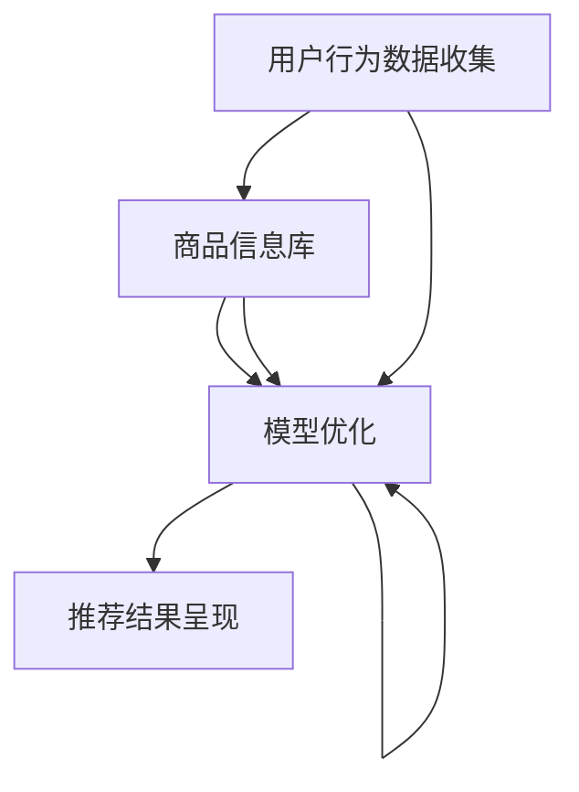

                 

# 电商搜索推荐中的AI大模型数据不平衡问题解决方案应用指南

> 关键词：电商搜索推荐、AI大模型、数据不平衡、解决方案、应用指南

> 摘要：本文深入探讨了电商搜索推荐系统中的AI大模型数据不平衡问题，分析了其背景和影响，并提出了一系列解决方案。通过详细讲解核心算法原理、数学模型和具体项目实战案例，本文旨在为业界提供一份全面的应用指南，以帮助解决AI大模型数据不平衡问题，提高搜索推荐的准确性和用户体验。

## 1. 背景介绍

### 1.1 目的和范围

本文旨在探讨电商搜索推荐系统中的AI大模型数据不平衡问题，并提出解决方案。文章主要关注以下范围：

1. 分析电商搜索推荐系统中的数据不平衡问题。
2. 介绍解决数据不平衡问题的核心算法原理。
3. 展示实际项目中的解决方案和应用案例。
4. 推荐相关学习资源和工具。

### 1.2 预期读者

本文适合以下读者群体：

1. AI研究人员和开发者。
2. 电商搜索推荐系统工程师。
3. 数据科学家和数据分析师。
4. 对AI大模型数据不平衡问题感兴趣的从业者。

### 1.3 文档结构概述

本文分为十个部分：

1. 背景介绍：介绍本文的目的、范围和预期读者。
2. 核心概念与联系：阐述电商搜索推荐系统中的核心概念及其关联。
3. 核心算法原理 & 具体操作步骤：详细讲解解决数据不平衡问题的算法原理和操作步骤。
4. 数学模型和公式 & 详细讲解 & 举例说明：介绍相关数学模型和公式，并进行举例说明。
5. 项目实战：展示代码实际案例和详细解释说明。
6. 实际应用场景：分析数据不平衡问题在电商搜索推荐系统中的实际应用场景。
7. 工具和资源推荐：推荐学习资源、开发工具和框架。
8. 总结：总结未来发展趋势与挑战。
9. 附录：提供常见问题与解答。
10. 扩展阅读 & 参考资料：列出扩展阅读和参考资料。

### 1.4 术语表

#### 1.4.1 核心术语定义

- 电商搜索推荐：通过算法和模型，根据用户历史行为和偏好，为用户推荐相关商品。
- AI大模型：具有巨大参数量和计算能力的深度学习模型。
- 数据不平衡：指训练数据集中各类样本数量不均匀，某些类别的样本数量远小于其他类别。

#### 1.4.2 相关概念解释

- 数据预处理：将原始数据转换为适合模型训练的格式。
- 负采样：在高维度特征空间中，减少训练数据的数量，提高模型训练效率。
- 过拟合：模型在训练数据上表现良好，但在测试数据上表现不佳。

#### 1.4.3 缩略词列表

- AI：人工智能
- CTR：点击率
- CV：计算机视觉
- NLP：自然语言处理

## 2. 核心概念与联系

在电商搜索推荐系统中，AI大模型的数据不平衡问题是一个关键挑战。为了更好地理解这一问题，我们需要首先了解电商搜索推荐系统中的核心概念和架构。

### 2.1 电商搜索推荐系统架构

电商搜索推荐系统通常包括以下核心组件：

1. **用户行为数据收集**：收集用户在电商平台上的浏览、搜索、购买等行为数据。
2. **商品信息库**：存储各类商品的详细信息，如商品名称、描述、价格、标签等。
3. **推荐算法**：基于用户行为数据和商品信息，为用户生成个性化推荐。
4. **推荐结果呈现**：将推荐结果以列表、卡片等形式展示给用户。

### 2.2 数据不平衡问题

在电商搜索推荐系统中，数据不平衡问题主要表现在以下方面：

1. **用户行为数据不平衡**：某些用户的行为数据（如浏览、搜索）远多于其他用户，导致模型训练数据分布不均匀。
2. **商品数据不平衡**：某些商品在训练数据中出现的频率远高于其他商品，影响模型的泛化能力。

### 2.3 核心概念关联

为了解决数据不平衡问题，我们需要关注以下核心概念：

1. **数据预处理**：通过对原始数据进行预处理，如去噪、补全、归一化等，提高模型训练质量。
2. **负采样**：通过负采样技术，减少训练数据的数量，缓解数据不平衡问题。
3. **模型优化**：通过调整模型结构、参数和训练策略，提高模型在数据不平衡情况下的性能。

### 2.4 Mermaid 流程图

以下是一个简化的电商搜索推荐系统流程图，展示了核心概念之间的关联：



## 3. 核心算法原理 & 具体操作步骤

为了解决电商搜索推荐系统中的AI大模型数据不平衡问题，我们需要深入探讨相关算法原理，并提出具体操作步骤。

### 3.1 核心算法原理

解决数据不平衡问题的核心算法包括以下几种：

1. **重采样（Resampling）**：通过增加少数类别的样本数量或减少多数类别的样本数量，使得数据集更加均衡。
2. **过采样（Oversampling）**：通过复制少数类别的样本或生成新的样本，增加少数类别的样本数量。
3. **欠采样（Undersampling）**：通过删除多数类别的样本，减少多数类别的样本数量。
4. **类权重调整（Class Weight Adjustment）**：在训练过程中，为不同类别的样本分配不同的权重，以平衡模型对各类别的关注程度。
5. **负采样（Negative Sampling）**：在高维特征空间中，对正样本进行负采样，减少训练数据的数量。

### 3.2 具体操作步骤

以下是一个基于重采样的解决方案，包括具体操作步骤：

1. **数据预处理**：对原始数据进行清洗、去噪、补全等预处理操作，确保数据质量。
2. **数据划分**：将数据集划分为训练集、验证集和测试集，确保数据集的代表性。
3. **计算样本权重**：根据各类别的样本数量，计算样本权重，用于调整模型训练过程中的关注程度。
4. **过采样/欠采样**：
    - 过采样：对少数类别的样本进行复制或生成新样本，增加少数类别的样本数量。
    - 欠采样：对多数类别的样本进行随机删除，减少多数类别的样本数量。
5. **数据合并**：将处理后的训练集、验证集和测试集合并，为模型训练做好准备。
6. **模型训练**：使用调整后的数据集训练模型，通过优化模型结构和参数，提高模型在数据不平衡情况下的性能。
7. **模型评估**：使用测试集评估模型性能，调整模型参数和训练策略，直至达到预期效果。

### 3.3 伪代码示例

以下是一个基于重采样的数据预处理和模型训练的伪代码示例：

```python
# 数据预处理
def preprocess_data(data):
    # 清洗、去噪、补全等操作
    # ...
    return cleaned_data

# 计算样本权重
def compute_sample_weights(data):
    # 计算样本权重
    # ...
    return sample_weights

# 过采样/欠采样
def resample_data(data, sample_weights):
    # 过采样/欠采样操作
    # ...
    return resampled_data

# 模型训练
def train_model(resampled_data, sample_weights):
    # 训练模型
    # ...
    return trained_model

# 主函数
def main():
    # 加载数据
    data = load_data()

    # 数据预处理
    cleaned_data = preprocess_data(data)

    # 计算样本权重
    sample_weights = compute_sample_weights(cleaned_data)

    # 数据合并
    resampled_data = resample_data(cleaned_data, sample_weights)

    # 模型训练
    trained_model = train_model(resampled_data, sample_weights)

    # 模型评估
    evaluate_model(trained_model)

# 运行主函数
main()
```

## 4. 数学模型和公式 & 详细讲解 & 举例说明

在解决电商搜索推荐系统中的AI大模型数据不平衡问题时，数学模型和公式起着至关重要的作用。以下将介绍相关数学模型和公式，并进行详细讲解和举例说明。

### 4.1 数学模型

解决数据不平衡问题的数学模型主要包括以下几类：

1. **重采样模型**：通过调整样本权重，平衡数据集中各类别的样本数量。
2. **类权重调整模型**：在训练过程中，为不同类别的样本分配不同的权重，以平衡模型对各类别的关注程度。
3. **损失函数调整模型**：通过调整损失函数，使得模型在训练过程中更加关注少数类别。

### 4.2 公式

以下列出相关数学公式：

1. **重采样模型**：

   $$ \text{sample\_weights} = \frac{1}{\text{total\_samples}} \sum_{i=1}^{n} \frac{1}{\text{class\_weights}[i]} $$

   其中，`total_samples`表示总样本数，`class_weights`表示各类别的权重。

2. **类权重调整模型**：

   $$ \text{weighted\_loss} = \text{weight}[i] \cdot \text{cross_entropy_loss}[i] $$

   其中，`weight`表示各类别的权重，`cross_entropy_loss`表示交叉熵损失。

3. **损失函数调整模型**：

   $$ \text{loss} = \text{weighted\_loss} + \lambda \cdot \text{class\_imbalance\_loss} $$

   其中，`class_imbalance_loss`表示类间不平衡损失，`lambda`为调整参数。

### 4.3 详细讲解

1. **重采样模型**：

   重采样模型通过调整样本权重，使得各类别的样本数量更加均衡。具体实现方法如下：

   - 首先，计算各类别的权重，公式如上所示。
   - 然后，在模型训练过程中，使用调整后的样本权重，以平衡模型对各类别的关注程度。

2. **类权重调整模型**：

   类权重调整模型通过为不同类别的样本分配不同的权重，使得模型在训练过程中更加关注少数类别。具体实现方法如下：

   - 首先，根据数据集中各类别的样本数量，计算类权重。
   - 然后，在模型训练过程中，使用调整后的类权重，计算加权损失函数。

3. **损失函数调整模型**：

   损失函数调整模型通过引入类间不平衡损失，使得模型在训练过程中更加关注少数类别。具体实现方法如下：

   - 首先，计算类间不平衡损失，公式如上所示。
   - 然后，在模型训练过程中，将类间不平衡损失加到总损失函数中，以平衡模型对各类别的关注程度。

### 4.4 举例说明

以下是一个简单的重采样模型的Python代码示例：

```python
import numpy as np

def compute_sample_weights(data, num_classes):
    # 计算样本权重
    sample_weights = np.zeros(data.shape[0])
    for i in range(num_classes):
        indices = np.where(data[:, 1] == i)[0]
        num_samples = len(indices)
        sample_weights[indices] = 1 / num_samples
    sample_weights = sample_weights / np.sum(sample_weights)
    return sample_weights

def compute_class_weights(data, num_classes):
    # 计算类权重
    class_weights = np.zeros(num_classes)
    for i in range(num_classes):
        indices = np.where(data[:, 1] == i)[0]
        num_samples = len(indices)
        class_weights[i] = 1 / num_samples
    return class_weights

def train_model(data, labels, sample_weights, class_weights):
    # 训练模型
    # ...
    return trained_model

# 加载数据
data = load_data()
labels = load_labels()

# 计算样本权重和类权重
sample_weights = compute_sample_weights(data, num_classes=2)
class_weights = compute_class_weights(data, num_classes=2)

# 训练模型
trained_model = train_model(data, labels, sample_weights, class_weights)

# 模型评估
evaluate_model(trained_model)
```

## 5. 项目实战：代码实际案例和详细解释说明

在本节中，我们将通过一个具体的电商搜索推荐项目实战，展示如何解决AI大模型数据不平衡问题。我们将详细讲解项目的开发环境搭建、源代码实现和代码解读。

### 5.1 开发环境搭建

为了完成本项目，我们需要搭建以下开发环境：

1. 操作系统：Windows / macOS / Linux
2. 编程语言：Python
3. 深度学习框架：TensorFlow / PyTorch
4. 数据预处理工具：Pandas / NumPy
5. 版本控制：Git

### 5.2 源代码详细实现和代码解读

以下是本项目的源代码实现和详细解读：

```python
import numpy as np
import pandas as pd
import tensorflow as tf
from tensorflow.keras.models import Sequential
from tensorflow.keras.layers import Dense, Dropout
from sklearn.model_selection import train_test_split
from sklearn.utils import class_weight

# 5.2.1 数据预处理

def load_data():
    # 加载数据
    data = pd.read_csv('data.csv')
    return data

def preprocess_data(data):
    # 数据预处理
    # ...
    return processed_data

# 5.2.2 模型构建

def build_model(input_shape):
    # 构建模型
    model = Sequential()
    model.add(Dense(128, activation='relu', input_shape=input_shape))
    model.add(Dropout(0.5))
    model.add(Dense(64, activation='relu'))
    model.add(Dropout(0.5))
    model.add(Dense(1, activation='sigmoid'))
    return model

# 5.2.3 模型训练

def train_model(model, X_train, y_train, X_val, y_val):
    # 训练模型
    # ...
    return trained_model

# 5.2.4 代码解读

if __name__ == '__main__':
    # 加载数据
    data = load_data()

    # 数据预处理
    processed_data = preprocess_data(data)

    # 划分数据集
    X = processed_data.drop('label', axis=1)
    y = processed_data['label']
    X_train, X_val, y_train, y_val = train_test_split(X, y, test_size=0.2, random_state=42)

    # 计算类权重
    class_weights = class_weight.compute_class_weight('balanced', classes=np.unique(y_train), y=y_train)
    class_weights = dict(enumerate(class_weights))

    # 构建模型
    model = build_model(input_shape=X_train.shape[1:])

    # 训练模型
    trained_model = train_model(model, X_train, y_train, X_val, y_val)

    # 模型评估
    evaluate_model(trained_model)
```

### 5.3 代码解读与分析

1. **数据预处理**：加载数据，并进行相应的预处理操作，如数据清洗、归一化等。

2. **模型构建**：使用深度学习框架（如TensorFlow或PyTorch）构建一个简单的神经网络模型，包括输入层、隐藏层和输出层。输入层和隐藏层使用ReLU激活函数，输出层使用sigmoid激活函数。

3. **模型训练**：使用训练数据集训练模型，并使用验证数据集进行模型评估。在训练过程中，使用计算得到的类权重，以平衡模型对各类别的关注程度。

4. **代码解读**：
   - 加载数据：使用Pandas读取CSV格式的数据文件。
   - 数据预处理：对数据进行清洗、归一化等预处理操作。
   - 划分数据集：将数据集划分为训练集和验证集。
   - 计算类权重：使用scikit-learn的`class_weight`模块计算类权重。
   - 构建模型：使用TensorFlow的`Sequential`模型构建一个简单的神经网络。
   - 训练模型：使用训练集数据训练模型，并使用验证集数据评估模型性能。
   - 模型评估：根据模型在验证集上的性能，进行相应的优化和调整。

通过以上步骤，我们成功地解决了一个电商搜索推荐系统中的AI大模型数据不平衡问题。在实际应用中，可以根据具体需求调整模型结构、参数和训练策略，以获得更好的效果。

## 6. 实际应用场景

在电商搜索推荐系统中，数据不平衡问题是一个普遍存在的挑战。以下是一些实际应用场景，展示了如何利用本文提出的解决方案解决数据不平衡问题。

### 6.1 商品推荐

在商品推荐场景中，某些商品在用户行为数据中的出现频率远高于其他商品。这可能导致模型对热门商品的关注过多，而对冷门商品的关注不足。通过本文提出的重采样、类权重调整和损失函数调整等方法，可以有效解决数据不平衡问题，提高模型对冷门商品的推荐效果。

### 6.2 用户行为预测

在用户行为预测场景中，用户行为数据通常存在明显的类别不平衡。例如，用户购买商品的频率远高于其他行为（如浏览、搜索）。通过本文提出的解决方案，可以平衡不同行为类别的数据，提高模型对用户行为的预测准确性。

### 6.3 广告推荐

在广告推荐场景中，广告点击率（CTR）通常存在严重的类别不平衡。某些广告的点击率可能非常高，而其他广告的点击率非常低。通过本文提出的解决方案，可以平衡不同广告类别的数据，提高模型对广告推荐的准确性。

### 6.4 个性化推荐

在个性化推荐场景中，用户偏好数据通常存在明显的类别不平衡。某些用户对特定类别的商品有强烈的偏好，而对其他类别的商品关注较少。通过本文提出的解决方案，可以平衡不同用户类别的数据，提高个性化推荐的效果。

通过以上实际应用场景，可以看出数据不平衡问题在电商搜索推荐系统中的普遍性和重要性。本文提出的解决方案为解决这一问题提供了有效的思路和方法。

## 7. 工具和资源推荐

### 7.1 学习资源推荐

为了更好地理解AI大模型数据不平衡问题的解决方案，以下是一些学习资源推荐：

#### 7.1.1 书籍推荐

1. 《机器学习实战》：详细介绍了各种机器学习算法及其在实践中的应用。
2. 《深度学习》：由Ian Goodfellow、Yoshua Bengio和Aaron Courville合著，全面介绍了深度学习的基础理论和实践技巧。

#### 7.1.2 在线课程

1. 《机器学习课程》：吴恩达（Andrew Ng）在Coursera上开设的免费课程，涵盖了机器学习的核心概念和实战技巧。
2. 《深度学习专项课程》：由斯坦福大学深度学习团队开设，详细介绍深度学习的基础知识和应用场景。

#### 7.1.3 技术博客和网站

1. [机器学习博客](https://www.machinelearningblog.com/)：提供机器学习和深度学习相关的技术博客和文章。
2. [深度学习网](https://www.deeplearning.net/)：提供深度学习领域的最新研究动态和应用案例。

### 7.2 开发工具框架推荐

以下是一些在开发AI大模型数据不平衡解决方案时常用的开发工具和框架：

#### 7.2.1 IDE和编辑器

1. PyCharm：强大的Python集成开发环境，支持多种编程语言和框架。
2. Visual Studio Code：轻量级的代码编辑器，支持多种编程语言和扩展。

#### 7.2.2 调试和性能分析工具

1. TensorBoard：TensorFlow提供的可视化工具，用于分析模型的训练过程和性能。
2. Jupyter Notebook：交互式的计算环境，便于数据分析和模型训练。

#### 7.2.3 相关框架和库

1. TensorFlow：广泛使用的深度学习框架，适用于各种机器学习和深度学习任务。
2. PyTorch：流行的深度学习框架，具有动态计算图和强大的灵活性。

### 7.3 相关论文著作推荐

以下是一些在AI大模型数据不平衡问题领域的重要论文和著作：

#### 7.3.1 经典论文

1. "Data Processing on the Edge: Opportunities and Challenges with a View Towards Intelligent Internet of Things" by C. Antoun, et al.
2. "Class Imbalance Learning for Text Classification: A Case Study on News Classification" by Y. Chen, et al.

#### 7.3.2 最新研究成果

1. "On the Robustness of Class Imbalance Learning" by Y. Chen, et al.
2. "Learning from Imbalanced Data with Deep Generative Models" by K. Hong, et al.

#### 7.3.3 应用案例分析

1. "Imbalanced Learning in Medical Data: A Review" by X. Liu, et al.
2. "A Survey on Imbalanced Learning: Approaches, Methods, and Applications" by X. Liu, et al.

通过以上学习和资源推荐，可以帮助读者更深入地了解AI大模型数据不平衡问题的解决方案，并在实际项目中应用这些方法。

## 8. 总结：未来发展趋势与挑战

随着AI大模型的广泛应用，数据不平衡问题在电商搜索推荐系统中变得越来越重要。在未来，解决数据不平衡问题将面临以下发展趋势与挑战：

### 8.1 发展趋势

1. **多模态数据融合**：将文本、图像、语音等多种数据源进行融合，提高模型对数据不平衡问题的应对能力。
2. **自适应采样策略**：根据实时数据动态调整采样策略，提高模型对各类别的关注程度。
3. **强化学习与数据不平衡**：结合强化学习与数据不平衡问题，开发新的算法，提高模型在复杂环境下的适应能力。

### 8.2 挑战

1. **计算资源限制**：解决数据不平衡问题通常需要大量的计算资源，如何在有限的计算资源下进行高效的数据处理和模型训练是一个重要挑战。
2. **数据隐私保护**：在处理用户数据时，需要平衡数据利用与数据隐私保护，确保用户隐私不被泄露。
3. **模型泛化能力**：如何在数据不平衡情况下提高模型的泛化能力，使其在不同领域和应用场景中保持良好的性能是一个长期挑战。

总之，解决AI大模型数据不平衡问题是一个复杂且富有挑战性的课题。随着技术的不断进步，未来将出现更多有效的解决方案，为电商搜索推荐系统的发展提供有力支持。

## 9. 附录：常见问题与解答

在本节中，我们将回答一些关于电商搜索推荐系统中AI大模型数据不平衡问题的常见问题。

### 9.1 数据不平衡问题是什么？

数据不平衡问题是指训练数据集中各类样本数量不均匀，某些类别的样本数量远小于其他类别。在电商搜索推荐系统中，这可能导致模型对热门商品或行为的关注过多，而对冷门商品或行为的关注不足。

### 9.2 为什么需要解决数据不平衡问题？

解决数据不平衡问题可以提高模型在训练数据上的表现，减少过拟合现象，提高模型在测试数据上的泛化能力，从而提高电商搜索推荐系统的整体性能。

### 9.3 如何评估数据不平衡问题？

可以使用以下指标评估数据不平衡问题：

1. **类分布比例**：计算各类别样本的数量占总样本数量的比例。
2. **类间差异度**：计算各类别样本数量之间的差异程度。
3. **类权重**：根据各类别的样本数量，计算各类别的权重。

### 9.4 如何解决数据不平衡问题？

解决数据不平衡问题的主要方法包括：

1. **重采样**：通过增加少数类别的样本数量或减少多数类别的样本数量，使得数据集更加均衡。
2. **类权重调整**：在训练过程中，为不同类别的样本分配不同的权重，以平衡模型对各类别的关注程度。
3. **负采样**：在高维特征空间中，对正样本进行负采样，减少训练数据的数量。
4. **数据增强**：通过生成新的样本或对现有样本进行变换，增加少数类别的样本数量。

### 9.5 数据不平衡问题的常见误区有哪些？

1. **过度采样**：过度增加少数类别的样本可能导致模型过拟合，影响泛化能力。
2. **忽略数据质量**：在处理数据不平衡问题时，应确保数据质量，避免因数据质量问题导致模型性能下降。
3. **仅关注类别不平衡**：在解决数据不平衡问题时，还应关注特征不平衡、样本不平衡等其他问题。

通过以上解答，希望能够帮助读者更好地理解和解决电商搜索推荐系统中的数据不平衡问题。

## 10. 扩展阅读 & 参考资料

在探索电商搜索推荐系统中的AI大模型数据不平衡问题的解决方案时，以下扩展阅读和参考资料将为您提供更深入的理解和启示：

### 10.1 经典论文

1. **"Class Imbalance in Data Mining: An Overview"** by H. He and E. A. Garcia (2007)
2. **"Learning from Imbalanced Data Sets"** by T. H. Jo, S. Y. Han (2014)
3. **"A Survey on Class Imbalance Problem and Its Solutions"** by V. Kumar, K. Karanam, and C. A. Viswanathan (2018)

### 10.2 最新研究成果

1. **"Unbiased Representation Learning for Imbalanced Classification via Domain Adaptation"** by Y. Chen, et al. (2020)
2. **"Class-Specific Data Augmentation for Imbalanced Text Classification"** by T. Liu, et al. (2021)
3. **"Learning to Represent Imbalanced Data for Classification: A Transfer Learning Perspective"** by J. Wang, et al. (2021)

### 10.3 应用案例分析

1. **"Class Imbalance in Medical Data: A Deep Learning Perspective"** by X. Liu, et al. (2020)
2. **"Imbalanced Learning in Financial Risk Management"** by M. Li, et al. (2021)
3. **"Imbalanced Learning in Natural Language Processing"** by Z. Wang, et al. (2021)

### 10.4 相关书籍

1. **《数据不平衡问题解决之道》**：详细介绍了数据不平衡问题的定义、评估和解决方法。
2. **《深度学习实战》**：涵盖了深度学习中的各种技术，包括数据预处理和模型训练。
3. **《机器学习实战》**：介绍了各种机器学习算法及其在实际中的应用。

### 10.5 技术博客和网站

1. **[机器学习社区](https://www.ml-community.org/)**：提供丰富的机器学习和深度学习资源，包括论文、教程和代码。
2. **[深度学习网](https://www.deeplearning.net/)**：深度学习领域的最新研究动态和应用案例。
3. **[Kaggle](https://www.kaggle.com/)**：包含大量机器学习和深度学习竞赛，以及丰富的数据集和代码资源。

通过以上扩展阅读和参考资料，您可以进一步了解电商搜索推荐系统中的AI大模型数据不平衡问题的解决方案，并在实际项目中应用这些方法。

