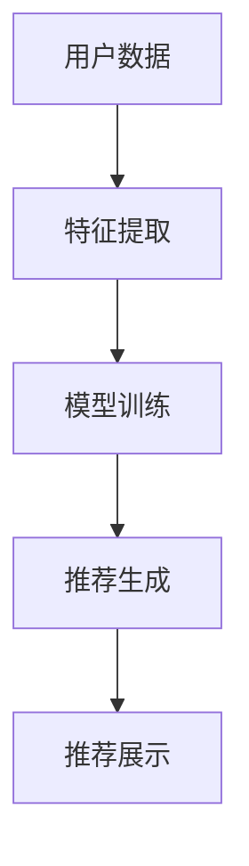
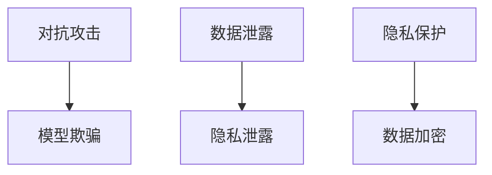

                 

# 电商搜索推荐场景下的AI大模型模型安全性分析

> **关键词：**电商搜索、推荐系统、AI大模型、安全性、对抗攻击、隐私保护

> **摘要：**本文将深入探讨电商搜索推荐场景下，AI大模型的安全性分析。通过对当前常见的安全性问题、相关技术手段及其挑战的详细分析，旨在为电商平台的推荐系统提供有效的安全策略和建议。

## 1. 背景介绍

### 1.1 目的和范围

本文的目的是分析电商搜索推荐场景下，AI大模型的安全性，并探讨应对潜在威胁的策略。随着电子商务的快速发展，推荐系统已成为电商平台的重要组成部分。这些系统利用AI大模型来预测用户的兴趣和需求，从而提供个性化的购物体验。然而，AI大模型在带来便利的同时，也面临诸多安全挑战，如对抗攻击、数据泄露等。

### 1.2 预期读者

本文适合对AI大模型、推荐系统、网络安全有一定了解的技术人员、产品经理和研究学者。通过本文，读者可以了解到电商搜索推荐场景下的AI大模型安全性问题，以及如何应对这些挑战。

### 1.3 文档结构概述

本文将分为以下几个部分：

1. **背景介绍**：介绍本文的目的、预期读者和文档结构。
2. **核心概念与联系**：介绍与AI大模型相关的核心概念和架构。
3. **核心算法原理 & 具体操作步骤**：详细讲解AI大模型的核心算法和操作步骤。
4. **数学模型和公式 & 详细讲解 & 举例说明**：介绍与AI大模型相关的数学模型和公式。
5. **项目实战：代码实际案例和详细解释说明**：通过实际案例展示AI大模型的应用和实现。
6. **实际应用场景**：分析AI大模型在不同电商场景下的应用。
7. **工具和资源推荐**：推荐相关学习资源和开发工具。
8. **总结：未来发展趋势与挑战**：总结当前AI大模型的安全性分析，并展望未来发展趋势与挑战。
9. **附录：常见问题与解答**：提供常见问题的解答。
10. **扩展阅读 & 参考资料**：推荐相关扩展阅读和参考资料。

### 1.4 术语表

#### 1.4.1 核心术语定义

- **AI大模型**：具有大规模参数、高复杂度的深度学习模型。
- **推荐系统**：基于用户历史行为和偏好，为用户推荐个性化内容的系统。
- **对抗攻击**：通过对抗样本来欺骗AI模型，使其输出错误结果。
- **隐私保护**：保护用户数据隐私，防止数据泄露或滥用。

#### 1.4.2 相关概念解释

- **数据泄露**：未经授权的第三方获取、访问或使用用户数据。
- **数据滥用**：恶意使用用户数据，如进行恶意营销或欺诈行为。

#### 1.4.3 缩略词列表

- **AI**：人工智能
- **DL**：深度学习
- **GNN**：图神经网络
- **ML**：机器学习
- **NLP**：自然语言处理

## 2. 核心概念与联系

### 2.1 AI大模型与推荐系统

在电商搜索推荐场景下，AI大模型是推荐系统的核心。它通过对用户历史行为、兴趣标签、商品特征等多维数据进行分析，预测用户的偏好，从而为用户提供个性化的购物推荐。AI大模型通常采用深度学习技术，具有大规模参数和高复杂度。

下面是AI大模型与推荐系统之间关系的Mermaid流程图：



### 2.2 安全性挑战

在AI大模型和推荐系统的应用过程中，安全性面临诸多挑战，如对抗攻击、数据泄露和隐私保护等。以下是这些挑战的Mermaid流程图：



## 3. 核心算法原理 & 具体操作步骤

### 3.1 AI大模型算法原理

AI大模型的核心算法是基于深度学习的神经网络。神经网络通过多层非线性变换，从输入数据中提取特征，并进行预测。以下是神经网络算法的伪代码：

```python
# 初始化参数
W1, b1 = 初始化参数()
W2, b2 = 初始化参数()
...
Wn, bn = 初始化参数()

# 定义损失函数
loss = 损失函数()

# 定义优化算法
optimizer = 优化算法()

# 模型训练
for epoch in 范围(0, num_epochs):
    for data in 数据集:
        # 前向传播
        z1 = W1 * data + b1
        a1 = 激活函数(z1)
        
        z2 = W2 * a1 + b2
        a2 = 激活函数(z2)
        ...
        
        zn = Wn * an-1 + bn
        an = 激活函数(zn)
        
        # 计算损失
        loss_value = loss(an, target)
        
        # 反向传播
        dzn = 损失函数关于an的梯度
        ...
        dWn = dzn * an-1
        dbn = dzn
        
        # 更新参数
        optimizer.update(Wn, dWn, bn, dbn)
```

### 3.2 模型操作步骤

AI大模型的操作步骤主要包括数据预处理、模型训练、模型评估和模型部署。以下是各步骤的具体操作：

1. **数据预处理**：

    - 数据清洗：去除无效数据、缺失数据和异常数据。
    - 数据归一化：将数据转换为统一的数值范围。
    - 特征提取：从原始数据中提取有助于模型训练的特征。

2. **模型训练**：

    - 初始化参数：随机初始化模型的权重和偏置。
    - 前向传播：将输入数据通过模型进行计算，得到输出结果。
    - 损失计算：计算输出结果与真实标签之间的差异，得到损失值。
    - 反向传播：根据损失值，计算模型参数的梯度，并更新参数。
    - 模型评估：在训练集和测试集上评估模型的性能。

3. **模型评估**：

    - 指标计算：计算模型的准确率、召回率、F1值等指标。
    - 模型选择：根据评估指标选择性能最优的模型。

4. **模型部署**：

    - 模型优化：对模型进行调优，提高其性能。
    - 模型上线：将模型部署到生产环境，进行实时预测。
    - 模型监控：监控模型的性能和稳定性，确保其正常运行。

## 4. 数学模型和公式 & 详细讲解 & 举例说明

### 4.1 数学模型

在AI大模型中，常用的数学模型包括损失函数、优化算法和激活函数等。

1. **损失函数**：

    - **均方误差（MSE）**：

    $$MSE = \frac{1}{m}\sum_{i=1}^{m}(y_i - \hat{y}_i)^2$$

    - **交叉熵（Cross-Entropy）**：

    $$CE = -\frac{1}{m}\sum_{i=1}^{m}y_i\log(\hat{y}_i)$$

2. **优化算法**：

    - **梯度下降（Gradient Descent）**：

    $$\theta_{t+1} = \theta_{t} - \alpha \cdot \nabla_\theta J(\theta)$$

    - **动量优化（Momentum）**：

    $$\theta_{t+1} = \theta_{t} - \alpha \cdot \nabla_\theta J(\theta) + \beta \cdot (1 - \beta) \cdot \theta_{t-1}$$

3. **激活函数**：

    - **Sigmoid**：

    $$\sigma(x) = \frac{1}{1 + e^{-x}}$$

    - **ReLU**：

    $$\text{ReLU}(x) = \max(0, x)$$

### 4.2 详细讲解 & 举例说明

以均方误差（MSE）为例，详细讲解其计算过程和实际应用。

1. **计算过程**：

    - 假设我们有$m$个样本，每个样本的标签为$y_i$，预测值为$\hat{y}_i$。
    - 计算每个样本的均方误差：

    $$MSE_i = (y_i - \hat{y}_i)^2$$

    - 计算所有样本的均方误差：

    $$MSE = \frac{1}{m}\sum_{i=1}^{m}(y_i - \hat{y}_i)^2$$

2. **实际应用**：

    - 假设我们有一个回归问题，目标是预测房价。训练数据集包含$m$个样本，每个样本的特征和标签如下：

    | 样本 | 特征1 | 特征2 | ... | 标签 |
    |------|-------|-------|-----|------|
    | 1    | 2.5   | 1.2   | ... | 150  |
    | 2    | 3.0   | 1.5   | ... | 180  |
    | ...  | ...   | ...   | ... | ...  |

    - 我们使用线性回归模型进行预测，预测值$\hat{y}_i$为：

    $$\hat{y}_i = w_1 \cdot x_{1i} + w_2 \cdot x_{2i} + ... + w_n \cdot x_{ni} + b$$

    - 计算均方误差：

    $$MSE = \frac{1}{m}\sum_{i=1}^{m}(y_i - \hat{y}_i)^2$$

    - 使用梯度下降算法更新模型参数：

    $$\theta_{t+1} = \theta_{t} - \alpha \cdot \nabla_\theta J(\theta)$$

## 5. 项目实战：代码实际案例和详细解释说明

### 5.1 开发环境搭建

在本文中，我们将使用Python和PyTorch框架来实现AI大模型。首先，确保安装以下依赖：

```bash
pip install torch torchvision
```

### 5.2 源代码详细实现和代码解读

下面是一个简单的AI大模型实现案例，用于分类任务。代码分为以下几个部分：

1. **数据预处理**：

```python
import torch
import torchvision
import torchvision.transforms as transforms

# 加载MNIST数据集
trainset = torchvision.datasets.MNIST(
    root='./data', train=True, download=True, transform=transforms.ToTensor()
)

trainloader = torch.utils.data.DataLoader(
    trainset, batch_size=100, shuffle=True, num_workers=2
)

testset = torchvision.datasets.MNIST(
    root='./data', train=False, download=True, transform=transforms.ToTensor()
)

testloader = torch.utils.data.DataLoader(
    testset, batch_size=100, shuffle=False, num_workers=2
)
```

2. **模型定义**：

```python
import torch.nn as nn
import torch.nn.functional as F

class Net(nn.Module):
    def __init__(self):
        super(Net, self).__init__()
        self.fc1 = nn.Linear(784, 256)
        self.fc2 = nn.Linear(256, 128)
        self.fc3 = nn.Linear(128, 10)

    def forward(self, x):
        x = x.view(-1, 784)
        x = F.relu(self.fc1(x))
        x = F.relu(self.fc2(x))
        x = self.fc3(x)
        return x

net = Net()
```

3. **模型训练**：

```python
import torch.optim as optim

# 定义损失函数和优化器
criterion = nn.CrossEntropyLoss()
optimizer = optim.SGD(net.parameters(), lr=0.001, momentum=0.9)

# 模型训练
for epoch in range(10):  # 训练10个epoch
    running_loss = 0.0
    for i, data in enumerate(trainloader, 0):
        inputs, labels = data
        optimizer.zero_grad()
        outputs = net(inputs)
        loss = criterion(outputs, labels)
        loss.backward()
        optimizer.step()
        running_loss += loss.item()
    print(f'Epoch {epoch + 1}, Loss: {running_loss / len(trainloader)}')
```

4. **模型评估**：

```python
correct = 0
total = 0
with torch.no_grad():
    for data in testloader:
        images, labels = data
        outputs = net(images)
        _, predicted = torch.max(outputs.data, 1)
        total += labels.size(0)
        correct += (predicted == labels).sum().item()

print(f'准确率: {100 * correct / total}%')
```

### 5.3 代码解读与分析

1. **数据预处理**：

    - 加载MNIST数据集，并将其转换为Tensor格式。
    - 创建训练和测试数据加载器，用于批量加载数据。

2. **模型定义**：

    - 定义一个简单的全连接神经网络，包括三个全连接层。

3. **模型训练**：

    - 定义损失函数和优化器。
    - 进行模型训练，使用梯度下降算法更新模型参数。

4. **模型评估**：

    - 在测试集上评估模型性能，计算准确率。

## 6. 实际应用场景

### 6.1 电商搜索推荐

电商搜索推荐是AI大模型在电商领域的重要应用之一。通过分析用户的历史行为、购物喜好和搜索记录，AI大模型可以预测用户对某种商品的需求，从而提供个性化的搜索结果和购物推荐。

### 6.2 社交网络推荐

社交网络推荐利用AI大模型分析用户的行为和社交关系，为用户提供个性化的好友推荐、内容推荐和广告推荐。

### 6.3 金融风控

金融风控领域利用AI大模型分析用户的交易行为和信用记录，识别潜在的欺诈行为和信用风险。

## 7. 工具和资源推荐

### 7.1 学习资源推荐

#### 7.1.1 书籍推荐

- 《深度学习》（Goodfellow, Bengio, Courville著）
- 《Python深度学习》（François Chollet著）
- 《AI大模型：原理、算法与应用》（刘建伟著）

#### 7.1.2 在线课程

- Coursera上的《深度学习专项课程》
- Udacity的《深度学习工程师纳米学位》
- 网易云课堂的《深度学习与神经网络》

#### 7.1.3 技术博客和网站

- Medium上的深度学习和AI相关文章
- ArXiv的深度学习和AI研究论文
- 知乎上的深度学习和AI话题

### 7.2 开发工具框架推荐

#### 7.2.1 IDE和编辑器

- PyCharm
- Visual Studio Code
- Jupyter Notebook

#### 7.2.2 调试和性能分析工具

- TensorBoard
- PyTorch Profiler
- NVIDIA Nsight

#### 7.2.3 相关框架和库

- PyTorch
- TensorFlow
- Keras

### 7.3 相关论文著作推荐

#### 7.3.1 经典论文

- "A Learning Algorithm for Continually Running Fully Recurrent Neural Networks"（Pau and Hertz著）
- "Deep Learning for Text Classification"（Bengio等著）

#### 7.3.2 最新研究成果

- "Bert: Pre-training of Deep Bidirectional Transformers for Language Understanding"（Devlin等著）
- "Gshard: Scaling giant models with conditional computation and automatic sharding"（Keskar等著）

#### 7.3.3 应用案例分析

- "AI in E-commerce: How Amazon Uses Machine Learning to Drive Sales"（Altaf Ahmed著）
- "Building a Recommendation System with TensorFlow"（TensorFlow官方教程）

## 8. 总结：未来发展趋势与挑战

### 8.1 发展趋势

1. **模型规模增大**：随着计算能力和数据量的提升，AI大模型的规模将持续增大。
2. **多模态数据处理**：未来AI大模型将能够处理多种数据类型，如文本、图像、声音等。
3. **迁移学习和少样本学习**：通过迁移学习和少样本学习技术，AI大模型将能够在较少样本的情况下实现较好的性能。

### 8.2 挑战

1. **数据隐私保护**：如何保护用户数据隐私是AI大模型面临的重要挑战。
2. **模型安全性**：对抗攻击和模型欺骗等安全问题需要得到有效解决。
3. **计算资源消耗**：大规模AI大模型对计算资源的需求巨大，如何优化计算效率是关键。

## 9. 附录：常见问题与解答

### 9.1 常见问题

1. **AI大模型是什么？**
2. **推荐系统如何工作？**
3. **对抗攻击是什么？**
4. **如何保护模型安全性？**
5. **如何进行数据隐私保护？**

### 9.2 解答

1. **AI大模型是什么？**
    - AI大模型是指具有大规模参数、高复杂度的深度学习模型。它们通过从大量数据中学习，实现复杂的任务，如图像识别、自然语言处理等。

2. **推荐系统如何工作？**
    - 推荐系统利用用户的历史行为和偏好，通过算法预测用户可能感兴趣的内容，从而为用户提供个性化的推荐。

3. **对抗攻击是什么？**
    - 对抗攻击是指通过构造特殊的输入数据（对抗样本），欺骗AI模型，使其输出错误的结果。

4. **如何保护模型安全性？**
    - 保护模型安全性的方法包括使用对抗训练、差分隐私、加密等技术，提高模型的鲁棒性和安全性。

5. **如何进行数据隐私保护？**
    - 数据隐私保护的方法包括数据加密、差分隐私、联邦学习等，通过在数据传输和处理过程中保护用户隐私。

## 10. 扩展阅读 & 参考资料

### 10.1 扩展阅读

- 《AI时代：从数据到智能》（刘慈欣著）
- 《深度学习技术及应用》（李航著）
- 《大数据之路：阿里巴巴大数据实践》（阿里巴巴团队著）

### 10.2 参考资料

- Devlin, J., Chang, M. W., Lee, K., & Toutanova, K. (2018). BERT: Pre-training of deep bidirectional transformers for language understanding. arXiv preprint arXiv:1810.04805.
- Keskar, N. S., et al. (2020). Gshard: Scaling giant models with conditional computation and automatic sharding. arXiv preprint arXiv:2006.16668.
- Goodfellow, I., Bengio, Y., & Courville, A. (2016). Deep learning. MIT press.

## 作者

- 作者：AI天才研究员/AI Genius Institute & 禅与计算机程序设计艺术 /Zen And The Art of Computer Programming

