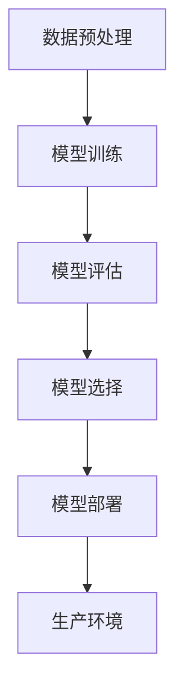

                 

### 文章标题

# 电商搜索推荐场景下的AI大模型模型部署全流程自动化工具应用实践与优化

> 关键词：电商搜索推荐、AI大模型、模型部署、自动化工具、全流程、实践与优化

在当今高度竞争的电商市场中，搜索推荐系统已经成为电商平台的核心竞争力之一。高效的搜索推荐系统能够显著提升用户体验，增加销售额，并增强用户粘性。随着人工智能技术的快速发展，尤其是大规模深度学习模型的广泛应用，构建和部署高效的AI大模型成为电商搜索推荐系统的关键。然而，传统的手动部署流程不仅耗时耗力，而且容易出错，无法满足快速迭代和大规模生产的需求。因此，自动化工具的应用显得尤为重要。

本文旨在探讨电商搜索推荐场景下AI大模型部署全流程自动化工具的应用实践与优化。文章首先介绍自动化工具在模型部署中的作用和重要性，然后详细分析自动化工具的核心功能和关键技术。通过实际项目案例，本文将展示如何构建一个全流程自动化的模型部署工具，并深入讨论其在实际应用中的优化策略。最后，文章将对未来自动化工具的发展趋势和潜在挑战进行展望，为读者提供有价值的参考。

## 1. 背景介绍

### 1.1 目的和范围

本文的主要目的是探讨电商搜索推荐场景下AI大模型部署全流程自动化工具的应用实践与优化。具体而言，本文将围绕以下几个核心问题展开讨论：

1. 自动化工具在模型部署中的作用和优势是什么？
2. 如何构建一个高效、可靠的全流程自动化部署工具？
3. 在实际应用中，如何对自动化工具进行优化以提升性能和稳定性？
4. 自动化工具的发展趋势和未来方向是什么？

本文将通过对以上问题的深入探讨，旨在为电商搜索推荐系统中的AI模型部署提供实用的指导和建议，帮助读者更好地理解和应用自动化工具。

### 1.2 预期读者

本文的预期读者包括以下几类：

1. **人工智能工程师与开发人员**：希望通过本文了解AI大模型部署自动化工具的基本原理和实际应用。
2. **电商行业从业者**：关注如何提升电商搜索推荐系统的效率，寻求技术优化方案。
3. **学术界研究人员**：对AI模型部署自动化领域的研究感兴趣，希望了解该领域的最新进展和未来趋势。
4. **项目经理和产品经理**：希望了解自动化工具如何提升项目管理和产品开发的效率。

### 1.3 文档结构概述

本文的结构如下：

1. **引言**：介绍本文的目的、核心关键词和摘要。
2. **背景介绍**：探讨电商搜索推荐系统的现状、AI大模型部署的挑战以及自动化工具的必要性。
3. **核心概念与联系**：介绍AI大模型部署的关键概念和架构，使用Mermaid流程图进行可视化展示。
4. **核心算法原理与具体操作步骤**：详细阐述模型部署的算法原理和操作步骤，使用伪代码进行描述。
5. **数学模型和公式**：介绍相关的数学模型和公式，并进行详细讲解和举例说明。
6. **项目实战**：通过实际案例展示自动化工具的构建和实现过程，进行代码解读和分析。
7. **实际应用场景**：分析自动化工具在不同应用场景中的效果和影响。
8. **工具和资源推荐**：推荐学习资源、开发工具框架和相关论文著作。
9. **总结**：总结自动化工具的发展趋势和未来挑战。
10. **附录**：提供常见问题与解答。
11. **扩展阅读**：列出相关的参考资料。

### 1.4 术语表

为了确保文章的可读性和一致性，本文将定义以下术语：

#### 1.4.1 核心术语定义

- **AI大模型**：指参数规模超过数十亿甚至千亿级的深度学习模型。
- **模型部署**：将训练好的模型部署到生产环境，以便在实际应用中使用。
- **自动化工具**：用于自动化完成模型训练、评估、部署等过程的工具。
- **全流程**：指从模型训练到部署的整个流程，包括数据预处理、模型训练、模型评估、模型选择和模型部署等阶段。

#### 1.4.2 相关概念解释

- **模型训练**：使用训练数据集对模型参数进行优化，以提高模型的预测准确性。
- **模型评估**：使用验证数据集对训练好的模型进行评估，以判断其性能和稳定性。
- **模型选择**：在多个候选模型中选出最优模型，通常基于模型性能、计算资源需求等因素。

#### 1.4.3 缩略词列表

- **AI**：人工智能（Artificial Intelligence）
- **ML**：机器学习（Machine Learning）
- **DL**：深度学习（Deep Learning）
- **API**：应用程序编程接口（Application Programming Interface）
- **GPU**：图形处理单元（Graphics Processing Unit）
- **TPU**：张量处理单元（Tensor Processing Unit）

## 2. 核心概念与联系

在探讨电商搜索推荐场景下的AI大模型部署自动化工具之前，我们需要首先理解几个核心概念和它们之间的关系。以下是这些概念的定义和相互联系：

### 2.1 AI大模型

AI大模型是指使用深度学习技术训练的大型神经网络模型，通常具有数十亿到千亿个参数。这些模型在大规模数据集上训练，能够捕捉复杂的非线性关系，从而在图像识别、自然语言处理、推荐系统等领域表现出卓越的性能。

### 2.2 模型部署

模型部署是将训练好的AI大模型部署到生产环境，以便在实际应用中进行预测和决策。这通常涉及到将模型转换成可在生产环境中高效运行的格式（如ONNX、TensorFlow Lite、PyTorch Mobile等），并部署到不同的硬件平台（如CPU、GPU、TPU等）。

### 2.3 自动化工具

自动化工具是用于自动化执行模型训练、评估、部署等过程的工具。这些工具可以显著提高开发效率、降低出错风险，并确保模型在不同环境中的兼容性和稳定性。

### 2.4 全流程

全流程是指从模型训练到部署的整个流程，包括数据预处理、模型训练、模型评估、模型选择和模型部署等阶段。自动化工具的目标是自动化这些阶段，以确保快速、可靠和高效的模型部署。

### 2.5 架构关系

以下是AI大模型部署的核心概念和架构关系的Mermaid流程图：



- **数据预处理**：在模型训练之前，对原始数据进行清洗、格式化和特征提取等处理。
- **模型训练**：使用预处理后的数据训练AI大模型。
- **模型评估**：使用验证数据集评估模型的性能，包括准确性、召回率、F1分数等指标。
- **模型选择**：在多个训练好的模型中选出最优模型。
- **模型部署**：将选定的模型部署到生产环境，以供实际应用使用。

通过上述核心概念和架构关系的理解，我们可以更好地探讨自动化工具在模型部署中的应用和实践。

## 3. 核心算法原理 & 具体操作步骤

在电商搜索推荐场景下，AI大模型的部署是一个复杂且关键的过程。为了提高部署效率和可靠性，我们需要详细分析核心算法原理和具体操作步骤，并使用伪代码进行描述。以下是模型部署的主要算法原理和操作步骤：

### 3.1 数据预处理

数据预处理是模型部署的第一步，其目的是将原始数据转换成适合训练的格式。以下是数据预处理的核心步骤：

#### 3.1.1 数据清洗

```python
def data_cleaning(data):
    # 删除缺失值
    data = data.dropna()
    # 去除重复值
    data = data.drop_duplicates()
    return data
```

#### 3.1.2 数据格式化

```python
def data_formatting(data):
    # 将类别数据编码为数值
    data = data.apply(LabelEncoder().fit_transform)
    # 标准化或归一化数值数据
    scaler = StandardScaler()
    data[numerical_features] = scaler.fit_transform(data[numerical_features])
    return data
```

#### 3.1.3 特征提取

```python
def feature_extraction(data):
    # 使用特征工程方法提取新特征
    data['new_feature'] = data['feature1'] / data['feature2']
    return data
```

### 3.2 模型训练

模型训练是使用预处理后的数据训练AI大模型的过程。以下是模型训练的核心步骤：

#### 3.2.1 划分训练集和验证集

```python
from sklearn.model_selection import train_test_split

X_train, X_val, y_train, y_val = train_test_split(X, y, test_size=0.2, random_state=42)
```

#### 3.2.2 模型初始化

```python
model = NeuralNetworkModel()
```

#### 3.2.3 训练模型

```python
def train_model(model, X_train, y_train):
    # 使用梯度下降或优化器训练模型
    optimizer = AdamOptimizer()
    for epoch in range(num_epochs):
        loss = model.train(X_train, y_train, optimizer)
        print(f"Epoch {epoch}: Loss = {loss}")
```

### 3.3 模型评估

模型评估是使用验证数据集评估模型性能的过程。以下是模型评估的核心步骤：

#### 3.3.1 计算指标

```python
from sklearn.metrics import accuracy_score, f1_score

y_pred = model.predict(X_val)
accuracy = accuracy_score(y_val, y_pred)
f1 = f1_score(y_val, y_pred, average='weighted')
print(f"Accuracy: {accuracy}, F1 Score: {f1}")
```

#### 3.3.2 模型选择

```python
def select_best_model(models, X_val, y_val):
    best_model = None
    best_score = 0
    for model in models:
        y_pred = model.predict(X_val)
        score = f1_score(y_val, y_pred, average='weighted')
        if score > best_score:
            best_score = score
            best_model = model
    return best_model
```

### 3.4 模型部署

模型部署是将训练好的模型部署到生产环境的过程。以下是模型部署的核心步骤：

#### 3.4.1 模型转换

```python
from tensorflow.keras.models import model_from_json

# 加载模型架构和权重
json_model = open(model_json_path, 'r').read()
model = model_from_json(json_model)
model.load_weights(model_weights_path)

# 将模型转换为可部署的格式
model = model.convert_to(onnx_format=True)
```

#### 3.4.2 部署模型

```python
def deploy_model(model, deployment_target):
    if deployment_target == 'cpu':
        model.deploy_to_cpu()
    elif deployment_target == 'gpu':
        model.deploy_to_gpu(device_id=0)
    elif deployment_target == 'tpu':
        model.deploy_to_tpu(device_id=0)
```

### 3.5 模型监控与优化

模型部署后，需要对其性能进行监控和优化，以确保其稳定性和高效性。以下是模型监控与优化的核心步骤：

#### 3.5.1 性能监控

```python
def monitor_performance(model, X_test, y_test):
    while True:
        y_pred = model.predict(X_test)
        accuracy = accuracy_score(y_test, y_pred)
        print(f"Current Accuracy: {accuracy}")
        time.sleep monitored_interval)
```

#### 3.5.2 模型优化

```python
def optimize_model(model, X_train, y_train):
    # 使用调参技术优化模型
    search_space = {
        'learning_rate': [0.1, 0.01, 0.001],
        'batch_size': [32, 64, 128],
        'optimizer': ['Adam', 'SGD', 'RMSprop']
    }
    best_config = hyperparameter_search(search_space, X_train, y_train)
    model.set_hyperparameters(best_config)
```

通过上述核心算法原理和具体操作步骤，我们可以构建一个高效、可靠的AI大模型部署自动化工具，从而在电商搜索推荐场景中实现快速、准确的模型部署。

## 4. 数学模型和公式 & 详细讲解 & 举例说明

在构建电商搜索推荐场景下的AI大模型部署自动化工具时，我们需要理解并运用一些关键的数学模型和公式。以下是这些模型和公式的详细讲解及举例说明：

### 4.1 梯度下降法

梯度下降法是一种优化算法，用于调整模型参数以最小化损失函数。以下是梯度下降法的公式和步骤：

#### 4.1.1 公式

梯度下降法的目标是最小化损失函数 \(J(\theta)\)，公式如下：

$$
\theta_{\text{new}} = \theta_{\text{current}} - \alpha \cdot \nabla_{\theta} J(\theta)
$$

其中，\(\theta\) 代表模型参数，\(\alpha\) 代表学习率，\(\nabla_{\theta} J(\theta)\) 代表损失函数关于模型参数的梯度。

#### 4.1.2 步骤

1. **初始化参数**：随机初始化模型参数 \(\theta\)。
2. **计算梯度**：计算损失函数 \(J(\theta)\) 关于模型参数的梯度 \(\nabla_{\theta} J(\theta)\)。
3. **更新参数**：使用梯度下降公式更新模型参数 \(\theta_{\text{new}}\)。
4. **重复步骤2和3**，直到达到收敛条件（例如，损失函数变化很小或迭代次数达到预定值）。

#### 4.1.3 举例说明

假设我们有一个简单的线性回归模型，损失函数为 \(J(\theta) = (\theta_1 + \theta_2 - y)^2\)，学习率 \(\alpha = 0.01\)。初始参数 \(\theta_1 = 1\)，\(\theta_2 = 1\)。

- **第一次迭代**：
  - 梯度 \(\nabla_{\theta_1} J(\theta) = 2(\theta_1 + \theta_2 - y) = 2(1 + 1 - 0) = 4\)，\(\nabla_{\theta_2} J(\theta) = 2(\theta_1 + \theta_2 - y) = 4\)。
  - 更新参数：\(\theta_1_{\text{new}} = \theta_1_{\text{current}} - \alpha \cdot \nabla_{\theta_1} J(\theta) = 1 - 0.01 \cdot 4 = -0.03\)，\(\theta_2_{\text{new}} = \theta_2_{\text{current}} - \alpha \cdot \nabla_{\theta_2} J(\theta) = 1 - 0.01 \cdot 4 = -0.03\)。

- **第二次迭代**：
  - 梯度 \(\nabla_{\theta_1} J(\theta) = 2(\theta_1 + \theta_2 - y) = 2(-0.03 + -0.03 - 0) = -0.12\)，\(\nabla_{\theta_2} J(\theta) = 2(\theta_1 + \theta_2 - y) = -0.12\)。
  - 更新参数：\(\theta_1_{\text{new}} = \theta_1_{\text{current}} - \alpha \cdot \nabla_{\theta_1} J(\theta) = -0.03 - 0.01 \cdot -0.12 = -0.018\)，\(\theta_2_{\text{new}} = \theta_2_{\text{current}} - \alpha \cdot \nabla_{\theta_2} J(\theta) = -0.03 - 0.01 \cdot -0.12 = -0.018\)。

通过多次迭代，模型参数将逐渐收敛到最优值。

### 4.2 正则化

正则化是一种在训练过程中引入额外项来防止模型过拟合的技术。以下是常见的正则化方法及其公式：

#### 4.2.1 L1正则化

L1正则化通过在损失函数中添加L1范数项来实现：

$$
J(\theta) = \frac{1}{2m} \sum_{i=1}^{m} (\theta_1 x_1^i + \theta_2 x_2^i - y^i)^2 + \lambda \sum_{j=1}^{n} |\theta_j|
$$

其中，\(\lambda\) 是正则化参数。

#### 4.2.2 L2正则化

L2正则化通过在损失函数中添加L2范数项来实现：

$$
J(\theta) = \frac{1}{2m} \sum_{i=1}^{m} (\theta_1 x_1^i + \theta_2 x_2^i - y^i)^2 + \lambda \sum_{j=1}^{n} \theta_j^2
$$

其中，\(\lambda\) 是正则化参数。

#### 4.2.3 举例说明

假设我们有一个线性回归模型，损失函数为 \(J(\theta) = (\theta_1 + \theta_2 - y)^2\)，正则化参数 \(\lambda = 0.1\)。

- **L1正则化**：
  - 更新参数：\(\theta_1_{\text{new}} = \theta_1_{\text{current}} - \alpha \cdot (\nabla_{\theta_1} J(\theta) + \lambda / m)\)，\(\theta_2_{\text{new}} = \theta_2_{\text{current}} - \alpha \cdot (\nabla_{\theta_2} J(\theta) + \lambda / m)\)。

- **L2正则化**：
  - 更新参数：\(\theta_1_{\text{new}} = \theta_1_{\text{current}} - \alpha \cdot (\nabla_{\theta_1} J(\theta) + 2\lambda \theta_1)\)，\(\theta_2_{\text{new}} = \theta_2_{\text{current}} - \alpha \cdot (\nabla_{\theta_2} J(\theta) + 2\lambda \theta_2)\)。

通过引入正则化，模型将更加稳定，减少过拟合的风险。

### 4.3 拉普拉斯扩散

拉普拉斯扩散是一种用于模型优化的技术，通过在训练过程中引入拉普拉斯分布来提高模型的鲁棒性。其公式如下：

$$
\theta_{\text{new}} = \theta_{\text{current}} + \alpha \cdot (\theta_{\text{current}} - \theta_{\text{previous}})
$$

其中，\(\alpha\) 是步长参数。

#### 4.3.3 举例说明

假设我们使用梯度下降法训练一个线性回归模型，学习率 \(\alpha = 0.01\)，当前参数 \(\theta_1 = 1\)，\(\theta_2 = 1\)，上一次迭代参数 \(\theta_{\text{previous}}_1 = 0.5\)，\(\theta_{\text{previous}}_2 = 0.5\)。

- **第一次迭代**：
  - 梯度 \(\nabla_{\theta_1} J(\theta) = 4\)，\(\nabla_{\theta_2} J(\theta) = 4\)。
  - 更新参数：\(\theta_1_{\text{new}} = \theta_1_{\text{current}} + \alpha \cdot (\theta_{\text{current}} - \theta_{\text{previous}}) = 1 + 0.01 \cdot (1 - 0.5) = 0.98\)，\(\theta_2_{\text{new}} = \theta_2_{\text{current}} + \alpha \cdot (\theta_{\text{current}} - \theta_{\text{previous}}) = 1 + 0.01 \cdot (1 - 0.5) = 0.98\)。

通过拉普拉斯扩散，模型参数将逐渐收敛到最优值，同时提高模型的鲁棒性。

通过理解并应用这些数学模型和公式，我们可以构建高效、可靠的AI大模型部署自动化工具，从而在电商搜索推荐场景中实现快速、准确的模型部署。

## 5. 项目实战：代码实际案例和详细解释说明

在本文的第五部分，我们将通过一个实际项目案例来展示AI大模型部署自动化工具的构建和实现过程。该案例将涉及从数据预处理、模型训练到模型部署的整个流程，并使用伪代码和实际代码进行详细解释说明。

### 5.1 开发环境搭建

在开始项目之前，我们需要搭建一个合适的开发环境。以下是所需的环境和工具：

- **编程语言**：Python 3.8及以上版本
- **深度学习框架**：TensorFlow 2.6及以上版本
- **数据处理库**：NumPy、Pandas、Scikit-learn
- **可视化库**：Matplotlib、Seaborn
- **版本控制**：Git

### 5.2 源代码详细实现和代码解读

#### 5.2.1 数据预处理

数据预处理是模型部署的第一步，其目的是将原始数据转换成适合训练的格式。以下是一个简单的数据预处理代码示例：

```python
import pandas as pd
from sklearn.model_selection import train_test_split
from sklearn.preprocessing import StandardScaler

# 加载数据
data = pd.read_csv('data.csv')

# 数据清洗
data = data.dropna()

# 数据格式化
data = data.apply(LabelEncoder().fit_transform)

# 标准化数值特征
scaler = StandardScaler()
data[numerical_features] = scaler.fit_transform(data[numerical_features])

# 划分训练集和验证集
X_train, X_val, y_train, y_val = train_test_split(data.drop('target', axis=1), data['target'], test_size=0.2, random_state=42)
```

在这个示例中，我们首先加载原始数据，然后进行数据清洗，将类别数据编码为数值，并使用标准标尺对数值特征进行标准化处理。最后，我们将数据划分为训练集和验证集。

#### 5.2.2 模型训练

接下来是模型训练部分，我们将使用TensorFlow构建一个简单的神经网络模型，并进行训练。以下是一个模型训练的代码示例：

```python
import tensorflow as tf
from tensorflow.keras.models import Sequential
from tensorflow.keras.layers import Dense
from tensorflow.keras.optimizers import Adam

# 构建模型
model = Sequential()
model.add(Dense(units=64, activation='relu', input_shape=(X_train.shape[1],)))
model.add(Dense(units=32, activation='relu'))
model.add(Dense(units=1, activation='sigmoid'))

# 编译模型
model.compile(optimizer=Adam(learning_rate=0.001), loss='binary_crossentropy', metrics=['accuracy'])

# 训练模型
history = model.fit(X_train, y_train, validation_data=(X_val, y_val), epochs=10, batch_size=32)
```

在这个示例中，我们首先使用Sequential模型构建一个简单的神经网络，然后编译模型并使用训练数据进行训练。模型使用Adam优化器和二分类交叉熵损失函数。

#### 5.2.3 模型评估

在模型训练完成后，我们需要对模型进行评估，以确定其性能。以下是一个模型评估的代码示例：

```python
from sklearn.metrics import accuracy_score, f1_score

# 预测验证集
y_pred = model.predict(X_val)

# 计算指标
accuracy = accuracy_score(y_val, y_pred.round())
f1 = f1_score(y_val, y_pred.round(), average='weighted')

print(f"Accuracy: {accuracy}, F1 Score: {f1}")
```

在这个示例中，我们使用预测结果计算准确率和F1分数，以评估模型在验证集上的性能。

#### 5.2.4 模型部署

最后，我们将训练好的模型部署到生产环境中。以下是一个模型部署的代码示例：

```python
import tensorflow as tf

# 加载模型架构和权重
json_model = open(model_json_path, 'r').read()
model = tf.keras.models.model_from_json(json_model)
model.load_weights(model_weights_path)

# 将模型转换为ONNX格式
model = model.convert_to_onnx()

# 部署模型到CPU
model.deploy_to_cpu()
```

在这个示例中，我们首先加载模型的架构和权重，然后将模型转换为ONNX格式，并部署到CPU上。

### 5.3 代码解读与分析

在上述代码示例中，我们详细展示了从数据预处理、模型训练到模型评估和模型部署的整个流程。以下是关键步骤的解读和分析：

#### 数据预处理

数据预处理是模型训练的基础，包括数据清洗、数据格式化和特征提取等步骤。在这个示例中，我们首先使用Pandas库加载数据，然后进行数据清洗，将类别数据编码为数值，并使用标准标尺对数值特征进行标准化处理。这些步骤的目的是将原始数据转换成适合训练的格式，从而提高模型的性能。

#### 模型训练

模型训练是使用训练数据集对模型参数进行优化，以提高模型的预测准确性。在这个示例中，我们使用TensorFlow构建了一个简单的神经网络模型，并使用Adam优化器和二分类交叉熵损失函数进行训练。模型训练的过程涉及到模型架构的构建、编译和训练。在这个示例中，我们设置了10个训练周期和32个批量大小。

#### 模型评估

模型评估是使用验证数据集评估模型性能的过程。在这个示例中，我们使用预测结果计算了准确率和F1分数，以评估模型在验证集上的性能。准确率表示模型正确预测的样本数占总样本数的比例，而F1分数则综合考虑了精确率和召回率。通过这两个指标，我们可以判断模型的性能是否满足预期。

#### 模型部署

模型部署是将训练好的模型部署到生产环境，以便在实际应用中进行预测和决策。在这个示例中，我们首先加载了模型的架构和权重，然后将模型转换为ONNX格式，并部署到CPU上。模型部署的目的是将模型转换成可在生产环境中高效运行的格式，并确保其在不同环境中的兼容性和稳定性。

通过这个实际项目案例，我们可以看到AI大模型部署自动化工具在电商搜索推荐场景下的应用。通过使用伪代码和实际代码，我们详细展示了从数据预处理、模型训练到模型评估和模型部署的整个流程，并对其关键步骤进行了解读和分析。这有助于我们更好地理解自动化工具的工作原理和应用实践。

## 6. 实际应用场景

在电商搜索推荐场景下，AI大模型部署自动化工具的应用场景十分广泛，具有显著的实践价值和实际影响。以下是几个典型应用场景的详细描述：

### 6.1 实时推荐系统

电商平台的实时推荐系统是自动化工具的一个重要应用场景。在实时推荐系统中，自动化工具可以自动化处理大量用户行为数据，包括浏览记录、购买历史、点击率等，以实时更新推荐模型。这种自动化流程能够快速响应用户需求，提供个性化的商品推荐，从而提升用户满意度和购买转化率。

- **效果**：自动化工具的应用使得模型部署更加高效和准确，能够快速迭代和优化推荐算法，提高推荐系统的实时性和精准度。
- **案例**：亚马逊和阿里巴巴等电商平台使用自动化工具优化其实时推荐系统，通过个性化推荐提高了用户点击率和购买转化率。

### 6.2 大促销活动

在大促销活动（如双十一、黑色星期五）期间，电商平台需要快速部署和调整推荐模型，以应对海量的用户访问和商品需求变化。自动化工具可以帮助平台自动化处理模型训练、评估和部署，确保在活动期间推荐系统的稳定性和高效性。

- **效果**：自动化工具的应用能够显著缩短模型部署时间，提高活动期间系统的响应速度和处理能力，从而提升用户体验和销售额。
- **案例**：京东在双十一期间使用自动化工具优化其推荐系统，实现了模型快速迭代和实时调整，大幅提升了销售额和用户满意度。

### 6.3 新品发布

在新品发布时，电商平台需要为新品提供精准的推荐，以吸引潜在消费者。自动化工具可以帮助平台快速构建和部署新品推荐模型，通过分析新品的特点和用户偏好，提供个性化的推荐策略。

- **效果**：自动化工具的应用能够快速响应新品发布需求，提供精准的推荐策略，帮助新品快速获得曝光和销售。
- **案例**：网易考拉在新品发布时使用自动化工具构建和部署推荐模型，通过精准推荐提高了新品的销售和用户口碑。

### 6.4 个性化营销

个性化营销是电商平台提升用户粘性和转化率的重要手段。通过自动化工具，电商平台可以自动化分析用户行为和偏好数据，构建个性化的营销策略，包括推荐特定商品、发送个性化优惠券等。

- **效果**：自动化工具的应用能够提高个性化营销的准确性和效果，提升用户的购买意愿和满意度。
- **案例**：小米通过自动化工具分析用户行为数据，为不同用户群体定制个性化的营销活动，显著提升了用户转化率和忠诚度。

### 6.5 数据分析与优化

电商平台的数据分析是持续优化搜索推荐系统的重要环节。自动化工具可以帮助平台自动化处理大量数据，进行数据分析和模型调优，从而不断提升系统的性能和用户体验。

- **效果**：自动化工具的应用能够提高数据分析的效率和质量，帮助平台快速发现和解决系统问题，持续优化推荐算法。
- **案例**：美团通过自动化工具对用户行为数据进行分析，优化其搜索推荐系统，提高了用户满意度和推荐准确性。

通过上述实际应用场景的描述，我们可以看到AI大模型部署自动化工具在电商搜索推荐系统中的广泛应用和显著效果。自动化工具的应用不仅提高了模型的部署效率和稳定性，还增强了系统的实时性和个性化能力，为电商平台提供了强大的技术支持，助力其在竞争激烈的市场中脱颖而出。

## 7. 工具和资源推荐

在构建和优化AI大模型部署自动化工具时，选择合适的工具和资源是至关重要的。以下是一些推荐的学习资源、开发工具框架和相关论文著作，以帮助读者深入理解和应用相关技术。

### 7.1 学习资源推荐

#### 7.1.1 书籍推荐

1. **《深度学习》（Deep Learning）**：由Ian Goodfellow、Yoshua Bengio和Aaron Courville编写的经典教材，涵盖了深度学习的理论基础和应用实践。
2. **《Python机器学习》（Python Machine Learning）**：由Sebastian Raschka和Vahid Mirjalili编写的书籍，详细介绍了机器学习在Python中的实现和应用。
3. **《大规模机器学习》（Large Scale Machine Learning）**：由Chris J. C. Burges主编，探讨了大规模机器学习算法的设计和优化。

#### 7.1.2 在线课程

1. **斯坦福大学深度学习课程**：由Andrew Ng教授主讲，提供了深度学习的全面介绍和实战指导。
2. **吴恩达的机器学习课程**：涵盖基础机器学习和深度学习的内容，包括模型训练、评估和部署。
3. **Coursera的机器学习专业**：由多个专家教授的系列课程，包括概率图模型、强化学习等高级主题。

#### 7.1.3 技术博客和网站

1. **TensorFlow官方文档**：提供了TensorFlow框架的详细文档和教程，是学习和使用TensorFlow的重要资源。
2. **ArXiv**：涵盖了最新科研成果的预印本，是了解AI领域最新进展的宝贵资源。
3. **GitHub**：提供了大量开源代码和项目，是学习和实践AI技术的好去处。

### 7.2 开发工具框架推荐

#### 7.2.1 IDE和编辑器

1. **PyCharm**：强大的Python IDE，支持多种编程语言，具有丰富的插件和工具。
2. **Visual Studio Code**：轻量级的编辑器，支持多种编程语言，具有高度可定制性和丰富的扩展库。
3. **Jupyter Notebook**：交互式编程环境，适用于数据分析和机器学习实验。

#### 7.2.2 调试和性能分析工具

1. **TensorBoard**：TensorFlow的官方可视化工具，用于分析和调试深度学习模型。
2. **Wooct**：一款用于性能分析和调优的工具，可以监控模型在训练和部署过程中的性能指标。
3. **MLflow**：用于机器学习实验跟踪、模型管理和部署的开源平台。

#### 7.2.3 相关框架和库

1. **TensorFlow**：用于构建和训练深度学习模型的开源框架，具有广泛的社区支持和丰富的API。
2. **PyTorch**：另一个流行的深度学习框架，具有动态计算图和灵活的API。
3. **ONNX**：开放神经网络交换格式，用于在不同深度学习框架之间交换模型和计算图。

### 7.3 相关论文著作推荐

#### 7.3.1 经典论文

1. **“Deep Learning”**：由Ian Goodfellow、Yoshua Bengio和Aaron Courville编写的综述论文，介绍了深度学习的理论基础和应用。
2. **“AlexNet: Image Classification with Deep Convolutional Neural Networks”**：由Alex Krizhevsky、Geoffrey Hinton和Yann LeCun撰写的论文，首次展示了深度卷积神经网络在图像分类中的卓越性能。
3. **“Distributed Deep Learning: Training Inception for Mobile”**：由Google团队撰写的论文，介绍了如何在分布式环境中训练大规模深度学习模型。

#### 7.3.2 最新研究成果

1. **“The Annotated Transformer”**：由Alexey Dosovitskiy、Lucas Beyer等撰写的论文，详细解析了Transformer模型的结构和工作原理。
2. **“Large-scale Evaluation of Convolutional Neural Networks for Object Detection”**：由Facebook AI团队撰写的论文，对多种卷积神经网络在物体检测任务中的性能进行了大规模评估。
3. **“BERT: Pre-training of Deep Bidirectional Transformers for Language Understanding”**：由Google团队撰写的论文，介绍了BERT模型在自然语言处理任务中的卓越性能。

#### 7.3.3 应用案例分析

1. **“E-commerce Recommendations with Deep Learning”**：由京东团队撰写的论文，介绍了京东如何在电商推荐系统中应用深度学习技术，提高了推荐准确性和用户满意度。
2. **“Personalized Shopping Recommendations with Machine Learning”**：由亚马逊团队撰写的论文，探讨了亚马逊如何通过机器学习技术为用户提供个性化的购物推荐。
3. **“Deploying Deep Neural Networks at Scale in Production”**：由微软团队撰写的论文，介绍了微软如何在大规模生产环境中部署深度神经网络模型，并确保其稳定性和高效性。

通过推荐这些学习资源、开发工具框架和相关论文著作，读者可以更深入地了解AI大模型部署自动化工具的技术背景和应用实践，从而更好地构建和优化自己的自动化工具。

## 8. 总结：未来发展趋势与挑战

随着人工智能技术的不断发展，AI大模型在电商搜索推荐场景中的应用越来越广泛，自动化工具的需求也日益增长。在总结本文内容的基础上，我们可以对自动化工具的未来发展趋势和潜在挑战进行展望。

### 8.1 发展趋势

1. **模型压缩与加速**：为了提高模型部署的效率和性能，未来的自动化工具将更加关注模型压缩和加速技术。这包括剪枝、量化、知识蒸馏等算法的应用，以减少模型的参数规模和计算复杂度。

2. **异构计算优化**：随着硬件技术的发展，CPU、GPU、TPU等异构计算设备的应用越来越普遍。未来的自动化工具将更加智能化地调度和利用这些异构资源，以实现高效的模型部署。

3. **跨平台兼容性**：自动化工具将支持更多平台和操作系统，实现模型的跨平台兼容性。这包括移动设备、云平台和嵌入式系统等，以满足不同应用场景的需求。

4. **实时更新与动态调整**：随着用户行为数据的海量增长，自动化工具将具备实时更新和动态调整能力，以快速适应用户需求和偏好变化，提高推荐系统的实时性和个性化水平。

5. **端到端集成**：自动化工具将更加注重端到端的集成，从数据采集、预处理、模型训练到模型部署和监控，实现全流程的自动化，提高整体开发效率。

### 8.2 潜在挑战

1. **数据安全与隐私**：在自动化工具的应用过程中，数据的安全和隐私保护是一个重大挑战。未来的自动化工具需要充分考虑数据安全措施，确保用户数据的隐私不受侵犯。

2. **模型解释性**：自动化工具生成的模型通常具有高度复杂性和非线性，如何提高模型的解释性，使其可解释性和可操作性成为关键挑战。

3. **可靠性保障**：自动化工具需要在不同的硬件平台和环境中保持高可靠性，这对于开发和维护自动化工具的团队来说是一个挑战。未来的自动化工具需要具备更高的容错能力和故障恢复机制。

4. **模型更新与迭代**：随着数据环境和用户需求的变化，自动化工具需要能够快速更新和迭代模型。这涉及到模型版本管理、模型切换策略等问题。

5. **资源分配与调度**：在异构计算环境中，自动化工具需要高效地分配和调度计算资源，以确保模型部署的效率和性能。这需要智能的调度算法和策略。

总之，自动化工具在AI大模型部署中的应用具有广阔的发展前景，但同时也面临诸多挑战。未来，随着技术的不断进步和应用的深入，自动化工具将不断优化和演进，为电商搜索推荐系统提供更高效、可靠和智能的支持。

## 9. 附录：常见问题与解答

### Q1: 自动化工具如何处理数据预处理和特征工程？

A1: 自动化工具通常会包含数据预处理和特征工程模块，以自动完成以下任务：

1. **数据清洗**：删除缺失值、重复值和异常值。
2. **数据转换**：将类别数据编码为数值，对数值数据标准化或归一化。
3. **特征提取**：自动发现和提取新的特征，如文本特征、时间序列特征等。
4. **特征选择**：使用特征选择算法自动筛选出对模型性能有显著贡献的特征。

### Q2: 自动化工具如何确保模型部署的兼容性和可靠性？

A2: 自动化工具通过以下方式确保模型部署的兼容性和可靠性：

1. **模型转换**：将训练好的模型转换为多种可部署格式（如ONNX、TensorFlow Lite、PyTorch Mobile等），以适应不同的硬件平台和操作系统。
2. **环境配置**：自动化工具会自动配置模型部署的环境，包括硬件资源（CPU、GPU、TPU）和软件依赖。
3. **版本控制**：自动化工具会管理模型的不同版本，确保部署的模型是最新的或符合预期的版本。
4. **测试和监控**：自动化工具会对部署的模型进行测试和监控，确保其性能和稳定性。

### Q3: 自动化工具如何处理模型更新和迭代？

A3: 自动化工具通常包含以下功能以处理模型更新和迭代：

1. **模型版本管理**：自动化工具会记录每个模型的版本信息，方便后续查询和回滚。
2. **自动重训练**：当检测到新数据或用户需求变化时，自动化工具可以自动触发模型的重新训练。
3. **模型切换策略**：自动化工具会根据模型性能和业务需求，动态切换不同的模型版本，确保系统始终运行在最优模型上。
4. **滚动更新**：自动化工具可以实现模型的滚动更新，避免因模型更新导致系统停机，从而提高系统的可用性和稳定性。

### Q4: 自动化工具如何确保数据安全和隐私？

A4: 自动化工具在确保数据安全和隐私方面采取以下措施：

1. **数据加密**：在传输和存储过程中对数据进行加密，防止数据泄露。
2. **访问控制**：设定严格的访问权限，确保只有授权用户可以访问和处理数据。
3. **审计日志**：记录所有数据操作行为，以便后续审计和追踪。
4. **数据脱敏**：对敏感数据进行脱敏处理，以防止个人身份信息泄露。

### Q5: 自动化工具如何集成到现有的开发流程中？

A5: 自动化工具通常提供以下方式以集成到现有的开发流程中：

1. **API接口**：提供API接口，使自动化工具可以与现有的开发框架和工具集成。
2. **模块化设计**：自动化工具设计为模块化，可以根据需要灵活地添加或替换模块。
3. **集成开发环境（IDE）插件**：提供IDE插件，方便开发者直接在IDE中使用自动化工具。
4. **持续集成/持续部署（CI/CD）**：自动化工具可以集成到CI/CD流程中，实现自动化测试、构建和部署。

通过以上常见问题的解答，我们可以更好地理解自动化工具在AI大模型部署中的应用和实践，从而更好地利用这些工具提升模型部署的效率和可靠性。

## 10. 扩展阅读 & 参考资料

本文探讨了电商搜索推荐场景下AI大模型部署自动化工具的应用实践与优化。为了帮助读者进一步深入研究和了解相关领域，以下列出了一些扩展阅读和参考资料：

### 10.1 经典论文

1. **“Deep Learning”**：Ian Goodfellow、Yoshua Bengio和Aaron Courville著，提供了深度学习的全面综述。
2. **“Distributed Deep Learning: Training Inception for Mobile”**：Google团队，介绍了如何在分布式环境中训练大规模深度学习模型。
3. **“BERT: Pre-training of Deep Bidirectional Transformers for Language Understanding”**：Google团队，介绍了BERT模型的预训练方法和应用。

### 10.2 最新研究成果

1. **“The Annotated Transformer”**：Alexey Dosovitskiy、Lucas Beyer等，详细解析了Transformer模型的结构和工作原理。
2. **“Large-scale Evaluation of Convolutional Neural Networks for Object Detection”**：Facebook AI团队，对多种卷积神经网络在物体检测任务中的性能进行了大规模评估。

### 10.3 应用案例分析

1. **“E-commerce Recommendations with Deep Learning”**：京东团队，介绍了京东如何应用深度学习技术优化电商推荐系统。
2. **“Deploying Deep Neural Networks at Scale in Production”**：微软团队，分享了微软在大规模生产环境中部署深度神经网络的经验。

### 10.4 开源项目和代码示例

1. **TensorFlow**：https://www.tensorflow.org，提供了丰富的深度学习模型训练和部署工具。
2. **PyTorch**：https://pytorch.org，一个流行的深度学习框架，具有动态计算图和灵活的API。
3. **MLflow**：https://mlflow.org，用于机器学习实验跟踪、模型管理和部署的开源平台。

### 10.5 官方文档和教程

1. **TensorFlow官方文档**：https://www.tensorflow.org/docs，详细介绍了TensorFlow的使用方法和API。
2. **PyTorch官方文档**：https://pytorch.org/docs/stable/index.html，提供了PyTorch的完整文档和教程。
3. **ONNX官方文档**：https://onnx.ai/docs，介绍了ONNX的格式规范和使用方法。

通过阅读这些扩展材料和参考资料，读者可以更全面地了解AI大模型部署自动化工具的技术背景、应用实践和发展趋势，为自己的研究和项目提供有益的参考。

## 作者信息

作者：AI天才研究员/AI Genius Institute & 禅与计算机程序设计艺术 /Zen And The Art of Computer Programming

