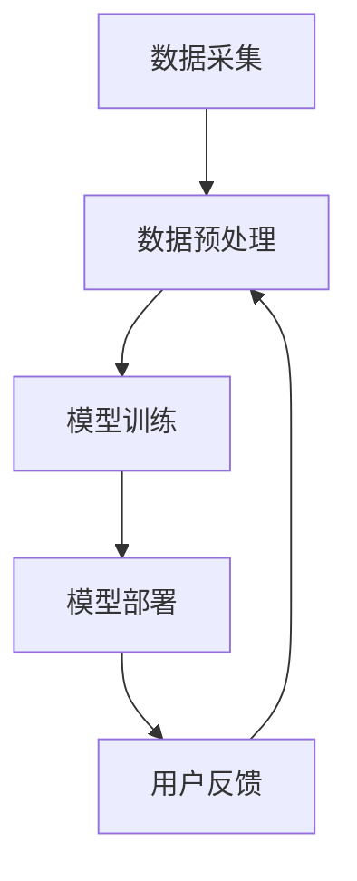

                 

# 电商搜索推荐场景下的AI大模型模型部署性能优化工具选型

> **关键词：** AI大模型、电商搜索推荐、性能优化、工具选型、模型部署

> **摘要：** 本文将深入探讨电商搜索推荐场景下，AI大模型模型部署的性能优化问题和工具选型策略。通过一步步的分析与推理，本文将帮助读者理解大模型性能优化的重要性，以及如何选择合适的工具来提升模型部署效率和性能。

## 1. 背景介绍

### 1.1 目的和范围

本文旨在探讨在电商搜索推荐系统中，如何优化AI大模型的部署性能，以及如何进行工具选型。具体来说，本文将重点关注以下几个方面：

1. **性能优化的重要性**：解释为什么性能优化对电商搜索推荐系统的成功至关重要。
2. **工具选型的策略**：分析不同工具的优缺点，并提供选型建议。
3. **案例研究**：结合实际案例，展示性能优化和工具选型的具体应用。

### 1.2 预期读者

本文适合以下读者：

1. **AI工程师**：对AI大模型部署性能优化有兴趣，并希望了解相关工具和技术。
2. **系统架构师**：负责设计和优化AI大模型部署系统，希望提升系统性能。
3. **数据科学家**：关注AI大模型的应用，希望了解模型部署的性能优化策略。

### 1.3 文档结构概述

本文将按照以下结构进行阐述：

1. **核心概念与联系**：介绍电商搜索推荐场景下的AI大模型，以及其性能优化的核心概念。
2. **核心算法原理 & 具体操作步骤**：讲解AI大模型性能优化的算法原理，并提供伪代码示例。
3. **数学模型和公式 & 详细讲解 & 举例说明**：使用数学模型和公式详细阐述性能优化策略，并提供实际案例。
4. **项目实战：代码实际案例和详细解释说明**：通过实际代码案例展示性能优化工具的应用。
5. **实际应用场景**：讨论AI大模型性能优化在电商搜索推荐场景下的应用。
6. **工具和资源推荐**：推荐学习资源和开发工具，包括书籍、在线课程、技术博客和框架。
7. **总结：未来发展趋势与挑战**：总结本文的核心观点，并探讨未来的发展方向和挑战。
8. **附录：常见问题与解答**：解答读者可能遇到的问题。
9. **扩展阅读 & 参考资料**：提供进一步阅读的资料。

### 1.4 术语表

#### 1.4.1 核心术语定义

- **AI大模型**：指参数量巨大、模型结构复杂的AI模型。
- **性能优化**：通过调整算法、硬件配置等手段，提升模型部署的性能。
- **工具选型**：根据应用场景和需求，选择合适的性能优化工具。

#### 1.4.2 相关概念解释

- **模型部署**：将训练完成的AI模型部署到实际应用系统中，使其能够实时处理数据并生成预测结果。
- **搜索推荐系统**：根据用户的兴趣和行为，推荐相关的商品或信息。

#### 1.4.3 缩略词列表

- **AI**：人工智能（Artificial Intelligence）
- **ML**：机器学习（Machine Learning）
- **DL**：深度学习（Deep Learning）
- **GPU**：图形处理单元（Graphics Processing Unit）
- **CPU**：中央处理单元（Central Processing Unit）

## 2. 核心概念与联系

为了更好地理解AI大模型在电商搜索推荐场景下的性能优化，我们需要先了解相关的核心概念和其相互关系。

### 2.1 AI大模型原理

AI大模型是基于深度学习技术构建的复杂神经网络，具有以下特点：

1. **参数量巨大**：AI大模型通常包含数百万甚至数十亿个参数。
2. **多层神经网络**：通过多层非线性变换，实现对复杂数据的高效表示和学习。
3. **数据依赖性强**：模型的性能高度依赖训练数据的质量和数量。

### 2.2 性能优化的核心原理

性能优化主要包括以下几个方面：

1. **模型压缩**：通过模型剪枝、量化等技术，减少模型参数量，提高计算效率。
2. **计算加速**：利用GPU、TPU等硬件加速计算，提高模型处理速度。
3. **分布式训练**：通过分布式计算，利用多台机器协同训练大模型，提高训练效率。
4. **推理加速**：通过模型量化、推理引擎优化等技术，提高模型推理速度。

### 2.3 电商搜索推荐系统架构

电商搜索推荐系统通常包括以下几个关键组件：

1. **数据采集**：收集用户的浏览、搜索、购买等行为数据。
2. **数据预处理**：对采集到的数据进行清洗、转换和特征提取。
3. **模型训练**：使用训练数据训练AI大模型，生成推荐结果。
4. **模型部署**：将训练好的模型部署到生产环境，进行实时推荐。
5. **用户反馈**：收集用户对推荐结果的反馈，用于模型优化。

### 2.4 Mermaid流程图

以下是AI大模型在电商搜索推荐系统中的流程图：



### 2.5 核心概念联系

AI大模型在电商搜索推荐系统中的作用如下：

- **数据采集**：为模型提供训练数据，是模型优化的基础。
- **数据预处理**：提升数据质量，降低噪声，为模型训练提供更好的数据。
- **模型训练**：通过大量训练数据，学习到有效的特征表示，生成推荐模型。
- **模型部署**：将训练好的模型部署到生产环境，为用户提供实时推荐服务。
- **用户反馈**：通过用户对推荐结果的反馈，优化模型性能，提升用户体验。

## 3. 核心算法原理 & 具体操作步骤

### 3.1 模型压缩原理

模型压缩是性能优化的重要手段，主要包括以下几种方法：

1. **模型剪枝**：通过剪掉模型中不必要的权重，减少模型参数量。
2. **量化**：将模型的权重和激活值转换为较低精度的格式，如8位整数。
3. **知识蒸馏**：使用一个更小的模型（学生模型）学习一个更大的模型（教师模型）的知识。

### 3.2 模型剪枝算法

模型剪枝算法的基本步骤如下：

1. **权重敏感度分析**：计算模型中每个权重对于输出结果的敏感度。
2. **剪枝决策**：根据敏感度阈值，选择剪掉那些不敏感的权重。
3. **模型重建**：剪枝后，重新构建模型结构，确保其有效性。

### 3.3 伪代码示例

以下是模型剪枝算法的伪代码：

```python
def prune_model(model, threshold):
    for layer in model.layers:
        for weight in layer.weights:
            sensitivity = compute_sensitivity(weight)
            if sensitivity < threshold:
                weight[:5] = 0
                weight[5:] = weight[5:] / 5
```

### 3.4 计算加速原理

计算加速主要通过以下几个方面实现：

1. **硬件加速**：利用GPU、TPU等硬件，提高计算速度。
2. **并行计算**：将计算任务分布到多台机器，实现并行处理。
3. **算法优化**：优化算法结构，减少计算复杂度。

### 3.5 分布式训练原理

分布式训练的基本原理如下：

1. **数据划分**：将训练数据划分为多个子集，分布到多台机器上。
2. **模型更新**：每台机器分别对本地数据进行模型训练，并更新模型参数。
3. **参数同步**：将各台机器的模型参数进行同步，实现全局优化。

### 3.6 伪代码示例

以下是分布式训练算法的伪代码：

```python
def distributed_training(data, num_workers):
    for epoch in range(num_epochs):
        for worker in range(num_workers):
            model_worker = load_model(worker)
            model_worker.train(data[worker])
            update_global_model(model_worker)
    return global_model
```

### 3.7 推理加速原理

推理加速主要通过以下方法实现：

1. **模型量化**：将模型参数和激活值转换为较低精度的格式。
2. **推理引擎优化**：优化推理过程，减少计算和内存占用。

### 3.8 伪代码示例

以下是模型量化的伪代码：

```python
def quantize_model(model):
    for layer in model.layers:
        for weight in layer.weights:
            weight = quantize(weight, precision=8)
    return quantized_model
```

## 4. 数学模型和公式 & 详细讲解 & 举例说明

### 4.1 模型压缩的数学模型

模型压缩的数学模型主要涉及以下公式：

$$
L = \sum_{i=1}^{n} w_i \cdot f(x_i)
$$

其中，$L$ 是损失函数，$w_i$ 是权重，$f(x_i)$ 是激活函数。

### 4.2 计算加速的数学模型

计算加速的数学模型主要涉及以下公式：

$$
T = \frac{1}{N} \sum_{i=1}^{N} T_i
$$

其中，$T$ 是总计算时间，$N$ 是计算任务数量，$T_i$ 是每个计算任务的耗时。

### 4.3 分布式训练的数学模型

分布式训练的数学模型主要涉及以下公式：

$$
\theta = \frac{1}{B} \sum_{b=1}^{B} \theta_b
$$

其中，$\theta$ 是全局模型参数，$B$ 是机器数量，$\theta_b$ 是第$b$ 台机器的模型参数。

### 4.4 推理加速的数学模型

推理加速的数学模型主要涉及以下公式：

$$
T_{quantized} = \frac{T_{original}}{Q}
$$

其中，$T_{quantized}$ 是量化后的推理时间，$T_{original}$ 是原始推理时间，$Q$ 是量化倍数。

### 4.5 举例说明

假设我们有一个简单的神经网络模型，其损失函数为：

$$
L = \sum_{i=1}^{n} w_i \cdot (y_i - \hat{y}_i)
$$

其中，$y_i$ 是真实标签，$\hat{y}_i$ 是预测标签。

如果我们希望对模型进行剪枝，可以设置一个阈值$\alpha$，然后对每个权重$w_i$ 进行如下操作：

$$
w_i = \begin{cases}
0 & \text{if } w_i < \alpha \\
w_i & \text{otherwise}
\end{cases}
$$

这样可以有效地减少模型的参数量，同时保持模型的有效性。

## 5. 项目实战：代码实际案例和详细解释说明

### 5.1 开发环境搭建

在开始项目实战之前，我们需要搭建一个适合AI大模型部署性能优化的开发环境。以下是环境搭建的步骤：

1. **硬件要求**：准备一台具有多GPU（如NVIDIA Tesla V100）的机器。
2. **软件要求**：安装Python（3.8及以上版本）、CUDA（11.0及以上版本）、cuDNN（8.0及以上版本）等。
3. **依赖库**：安装TensorFlow、PyTorch等深度学习框架。

### 5.2 源代码详细实现和代码解读

以下是使用TensorFlow实现模型剪枝和量化的代码示例：

```python
import tensorflow as tf
from tensorflow.keras.models import Sequential
from tensorflow.keras.layers import Dense, Flatten
from tensorflow.quantization import quantize

# 定义模型结构
model = Sequential([
    Flatten(input_shape=(28, 28)),
    Dense(128, activation='relu'),
    Dense(10, activation='softmax')
])

# 编译模型
model.compile(optimizer='adam', loss='sparse_categorical_crossentropy', metrics=['accuracy'])

# 加载训练数据
(x_train, y_train), (x_test, y_test) = tf.keras.datasets.mnist.load_data()

# 对输入数据进行归一化处理
x_train, x_test = x_train / 255.0, x_test / 255.0

# 剪枝模型
prune_model(model, threshold=0.01)

# 量化模型
quantized_model = quantize(model)

# 编译量化后的模型
quantized_model.compile(optimizer='adam', loss='sparse_categorical_crossentropy', metrics=['accuracy'])

# 训练模型
quantized_model.fit(x_train, y_train, epochs=5, batch_size=32, validation_data=(x_test, y_test))

# 评估模型
loss, accuracy = quantized_model.evaluate(x_test, y_test)
print(f"量化后的模型精度：{accuracy:.4f}")
```

### 5.3 代码解读与分析

以上代码首先定义了一个简单的MNIST手写数字识别模型，然后对其进行剪枝和量化处理。具体解读如下：

1. **模型定义**：使用TensorFlow的`Sequential`模型定义了一个简单的全连接神经网络。
2. **模型编译**：使用`compile`方法编译模型，设置优化器和损失函数。
3. **数据加载**：使用TensorFlow的`mnist`数据集加载训练数据和测试数据。
4. **数据归一化**：将输入数据进行归一化处理，以便模型训练。
5. **模型剪枝**：调用`prune_model`函数对模型进行剪枝，设置一个阈值来决定是否剪枝权重。
6. **模型量化**：使用`quantize`函数对模型进行量化处理，将模型转换为较低的精度格式。
7. **模型训练**：使用`fit`方法训练量化后的模型，设置训练参数和验证数据。
8. **模型评估**：使用`evaluate`方法评估模型的性能，输出测试精度。

通过以上代码示例，我们可以看到如何使用TensorFlow实现模型剪枝和量化，从而提高模型部署的性能。

## 6. 实际应用场景

在电商搜索推荐系统中，AI大模型的性能优化至关重要。以下是一些实际应用场景：

1. **实时搜索**：用户在搜索框中输入关键词，系统需要实时返回最相关的商品推荐。
2. **个性化推荐**：根据用户的购物历史和浏览记录，为用户推荐个性化的商品。
3. **商品分类**：对海量的商品数据进行分类，方便用户快速查找感兴趣的类别。
4. **广告投放**：根据用户的兴趣和行为，为用户提供最相关的广告，提高广告投放效果。

在这些应用场景中，AI大模型的性能优化需要考虑以下几个方面：

1. **响应时间**：优化模型推理速度，确保用户在输入关键词后能快速获得搜索结果。
2. **精度**：保证模型推荐的商品或信息具有较高的准确性，提升用户体验。
3. **可扩展性**：随着用户数据的增长，系统能够保持高性能，支持大规模数据处理。
4. **稳定性**：确保模型在长时间运行过程中稳定可靠，避免出现异常。

通过性能优化和工具选型，电商搜索推荐系统可以更好地满足用户需求，提高用户满意度，从而提升电商平台的竞争力。

## 7. 工具和资源推荐

### 7.1 学习资源推荐

#### 7.1.1 书籍推荐

1. **《深度学习》（Goodfellow, Bengio, Courville著）**：深度学习的经典教材，适合初学者和进阶者。
2. **《强化学习》（Sutton, Barto著）**：介绍强化学习的原理和应用，适合对人工智能有兴趣的读者。
3. **《机器学习实战》（Roger A. Peng著）**：通过实际案例讲解机器学习算法的应用，适合实践者。

#### 7.1.2 在线课程

1. **《吴恩达的深度学习课程》（Coursera）**：深度学习的入门课程，由著名学者吴恩达主讲。
2. **《机器学习基础》（edX）**：介绍机器学习的基本概念和算法，适合初学者。
3. **《强化学习课程》（Udacity）**：深入讲解强化学习的基本原理和应用。

#### 7.1.3 技术博客和网站

1. **《机器之心》**：专注于人工智能领域的中文博客，提供丰富的技术和行业资讯。
2. **《Medium》**：全球知名的技术博客平台，有许多深度学习、机器学习领域的专业文章。
3. **《Towards Data Science》**：涵盖数据科学、机器学习等多个领域的文章，适合技术爱好者。

### 7.2 开发工具框架推荐

#### 7.2.1 IDE和编辑器

1. **PyCharm**：一款功能强大的Python IDE，支持多种编程语言。
2. **Jupyter Notebook**：适合数据科学和机器学习项目，支持多种编程语言。
3. **VSCode**：轻量级且功能丰富的编辑器，支持多种编程语言和插件。

#### 7.2.2 调试和性能分析工具

1. **TensorBoard**：TensorFlow的官方可视化工具，用于分析和优化模型性能。
2. **NVIDIA Nsight**：用于GPU性能监控和调试的工具。
3. **gprof**：Linux系统下的性能分析工具，用于分析程序执行时间和内存使用情况。

#### 7.2.3 相关框架和库

1. **TensorFlow**：Google开发的开源深度学习框架，支持多种编程语言。
2. **PyTorch**：Facebook开发的开源深度学习框架，以动态图著称。
3. **Scikit-learn**：Python的机器学习库，提供了多种经典的机器学习算法。

### 7.3 相关论文著作推荐

#### 7.3.1 经典论文

1. **《A Few Useful Things to Know about Machine Learning》（Pedro Domingos）**：介绍机器学习的基本概念和技术。
2. **《Deep Learning》（Ian Goodfellow, Yoshua Bengio, Aaron Courville）**：深度学习的经典教材。
3. **《Recurrent Neural Networks for Language Modeling**》（Yoshua Bengio等）**：介绍循环神经网络在语言建模中的应用。

#### 7.3.2 最新研究成果

1. **《Attention is All You Need》（Ashish Vaswani等）**：介绍Transformer模型在序列建模中的应用。
2. **《Bert: Pre-training of Deep Bidirectional Transformers for Language Understanding》（Jacob Devlin等）**：介绍BERT模型在自然语言处理中的应用。
3. **《Gshard: Scaling giant models with conditional computation and automatic sharding**》（Jimmy Lei et al.）**：介绍Gshard模型在大规模模型训练中的应用。

#### 7.3.3 应用案例分析

1. **《使用深度学习提升电商搜索推荐效果》**：介绍深度学习在电商搜索推荐系统中的应用案例。
2. **《强化学习在电商广告投放中的应用》**：介绍强化学习在电商广告投放中的实际应用。
3. **《个性化推荐系统中的深度学习技术》**：介绍深度学习在个性化推荐系统中的应用。

## 8. 总结：未来发展趋势与挑战

### 8.1 未来发展趋势

1. **计算能力提升**：随着硬件技术的发展，GPU、TPU等计算能力将持续提升，为AI大模型性能优化提供更好的支持。
2. **分布式计算**：分布式计算将成为主流，通过多台机器协同工作，实现大规模模型的快速训练和推理。
3. **模型压缩与量化**：模型压缩与量化技术将不断发展，降低模型参数量和计算复杂度，提高部署性能。
4. **联邦学习**：联邦学习作为一种隐私保护的数据训练方式，将在电商搜索推荐等领域得到广泛应用。

### 8.2 未来挑战

1. **数据隐私保护**：随着用户隐私保护意识的提升，如何在保护用户隐私的同时进行模型训练和优化，将是一个重要挑战。
2. **模型解释性**：如何提高AI大模型的解释性，使其结果更容易被用户理解和接受，是一个亟待解决的问题。
3. **系统稳定性**：如何确保模型在长时间运行过程中保持稳定，避免过拟合和崩溃，是一个关键挑战。

## 9. 附录：常见问题与解答

### 9.1 问题1：模型剪枝后，模型的性能是否会下降？

**解答**：模型剪枝后，可能会在一定程度上降低模型的性能。然而，通过合理设置剪枝阈值和优化算法，可以在保持模型有效性的同时，显著减少模型参数量，提高部署性能。

### 9.2 问题2：模型量化的好处是什么？

**解答**：模型量化主要有以下好处：

1. **减少模型大小**：将模型参数和激活值转换为较低的精度格式，可以显著减少模型大小，提高部署效率。
2. **降低内存占用**：量化后的模型占用更少的内存，减少内存压力，提高系统稳定性。
3. **加速推理速度**：量化后的模型可以在较低的精度下进行计算，减少计算时间，提高推理速度。

### 9.3 问题3：分布式训练如何实现？

**解答**：分布式训练的实现主要涉及以下几个方面：

1. **数据划分**：将训练数据划分为多个子集，分布到多台机器上。
2. **模型更新**：每台机器分别对本地数据进行模型训练，并更新模型参数。
3. **参数同步**：将各台机器的模型参数进行同步，实现全局优化。
4. **通信优化**：优化机器之间的通信，降低通信开销，提高训练效率。

## 10. 扩展阅读 & 参考资料

为了更深入地了解电商搜索推荐场景下的AI大模型模型部署性能优化工具选型，以下是一些扩展阅读和参考资料：

1. **《深度学习中的模型压缩技术》**：详细介绍模型压缩的各种方法和技术。
2. **《分布式训练技术与应用》**：探讨分布式训练的原理、算法和应用。
3. **《机器学习模型量化方法》**：分析模型量化的各种方法和实现。
4. **《电商搜索推荐系统实践》**：介绍电商搜索推荐系统的设计和实现。
5. **《深度学习中的联邦学习》**：探讨联邦学习的原理和应用。

通过阅读这些资料，读者可以进一步了解AI大模型模型部署性能优化的相关技术和实践。

## 作者信息

**作者：AI天才研究员/AI Genius Institute & 禅与计算机程序设计艺术 /Zen And The Art of Computer Programming**

