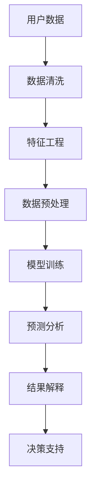

                 

# 电商数据分析的新纪元：AI大模型的洞察力

> **关键词：电商数据分析、AI大模型、深度学习、推荐系统、用户行为、数据挖掘、预测分析**

> **摘要：本文将深入探讨电商数据分析领域的新纪元——AI大模型的应用。通过分析AI大模型在电商领域的具体作用、核心算法原理、数学模型，以及实际应用案例，我们将揭示AI大模型如何助力电商企业提升用户体验、增加销售额。同时，本文也将展望AI大模型在未来电商数据分析中的发展趋势与挑战。**

## 1. 背景介绍

### 1.1 目的和范围

本文旨在探讨AI大模型在电商数据分析领域的新应用，通过逐步分析其核心原理、数学模型、算法以及实际应用案例，帮助读者全面理解AI大模型如何为电商企业提供更深入的洞察力和决策支持。

### 1.2 预期读者

本文适合具有数据分析基础的技术人员、数据科学家、以及电商行业从业者。希望通过本文，读者能够掌握AI大模型在电商数据分析中的应用，提升自身的业务洞察力和技术能力。

### 1.3 文档结构概述

本文结构分为以下部分：

1. **背景介绍**：介绍电商数据分析的现状和AI大模型的基本概念。
2. **核心概念与联系**：阐述电商数据分析中AI大模型的核心概念和架构。
3. **核心算法原理 & 具体操作步骤**：详细讲解AI大模型的算法原理和实现步骤。
4. **数学模型和公式 & 详细讲解 & 举例说明**：分析AI大模型的数学基础及其应用。
5. **项目实战：代码实际案例和详细解释说明**：通过具体项目展示AI大模型的应用。
6. **实际应用场景**：探讨AI大模型在电商行业的应用场景。
7. **工具和资源推荐**：推荐学习资源、开发工具和论文著作。
8. **总结：未来发展趋势与挑战**：展望AI大模型在电商数据分析领域的未来。
9. **附录：常见问题与解答**：解答读者可能遇到的问题。
10. **扩展阅读 & 参考资料**：提供进一步阅读的参考资料。

### 1.4 术语表

#### 1.4.1 核心术语定义

- **AI大模型**：指具有亿级别参数的深度学习模型，如GPT、BERT等。
- **电商数据分析**：对电商平台的交易数据、用户行为数据进行分析，以发现潜在的商业机会。
- **用户行为分析**：分析用户在电商平台上的行为，如浏览、搜索、购买等。
- **推荐系统**：根据用户的历史行为和偏好，为用户推荐相关商品。
- **预测分析**：利用历史数据预测未来的趋势和变化。

#### 1.4.2 相关概念解释

- **深度学习**：一种基于神经网络的机器学习技术，通过多层非线性变换学习数据特征。
- **神经网络**：一种模仿人脑神经元连接方式的计算模型，用于处理和分析数据。
- **反向传播算法**：一种训练神经网络的算法，通过计算误差的梯度来更新模型参数。

#### 1.4.3 缩略词列表

- **AI**：人工智能
- **ML**：机器学习
- **DL**：深度学习
- **NLP**：自然语言处理
- **GPU**：图形处理器

## 2. 核心概念与联系

电商数据分析中，AI大模型的核心作用在于提升数据处理的深度和广度，从而挖掘出更深层次的商业价值。下面我们将通过Mermaid流程图，展示AI大模型在电商数据分析中的核心概念和架构。



### 2.1 用户数据

用户数据是电商数据分析的基础。数据来源包括用户注册信息、浏览历史、搜索记录、购买行为等。这些数据通过数据采集系统实时收集，并存储在数据仓库中。

### 2.2 数据清洗

数据清洗是数据处理的重要步骤，目的是去除数据中的噪声和异常值，确保数据的质量。数据清洗包括数据去重、数据格式转换、缺失值填充等。

### 2.3 特征工程

特征工程是将原始数据转换为适合模型训练的输入特征。通过特征选择、特征提取和特征组合等方法，提升模型的效果。例如，将用户的浏览历史转换为用户兴趣特征，将商品属性转换为商品特征。

### 2.4 数据预处理

数据预处理是模型训练前的重要步骤，包括数据归一化、标准化、缺失值处理等。数据预处理的目的在于将数据转换为统一的格式，提高模型训练的效率。

### 2.5 模型训练

模型训练是AI大模型的核心步骤。通过将预处理后的数据输入到神经网络中，模型能够学习到数据中的规律，并形成预测模型。常用的训练算法包括梯度下降、随机梯度下降等。

### 2.6 预测分析

模型训练完成后，可以使用模型对新的用户数据进行预测分析。预测分析包括用户行为预测、商品推荐、销售预测等，为企业提供决策支持。

### 2.7 结果解释

预测结果需要通过结果解释环节进行验证和优化。结果解释包括评估模型的效果、调整模型参数、优化特征工程等。

### 2.8 决策支持

最终，预测分析和结果解释的结果将用于企业的决策支持。通过AI大模型，企业能够更准确地了解用户需求，制定更有针对性的营销策略，提升用户体验和销售额。

## 3. 核心算法原理 & 具体操作步骤

### 3.1 深度学习算法原理

深度学习算法是基于神经网络的一种机器学习技术，通过多层非线性变换学习数据特征。神经网络由输入层、隐藏层和输出层组成，每一层由多个神经元（节点）组成。神经元之间的连接权重决定了输入数据通过神经网络的传递方式。

#### 3.1.1 神经元模型

神经元模型是神经网络的基础。一个简单的神经元模型可以表示为：

\[ z = \sum_{i=1}^{n} w_i \cdot x_i + b \]

其中，\( x_i \) 为输入特征，\( w_i \) 为输入权重，\( b \) 为偏置项。神经元模型的输出通过激活函数 \( f(z) \) 进行转换，常用的激活函数包括sigmoid函数、ReLU函数等。

#### 3.1.2 梯度下降算法

梯度下降算法是训练神经网络的常用方法。通过计算损失函数的梯度，不断调整模型参数，使得模型在训练数据上达到最优。梯度下降算法可以表示为：

\[ w_{i} \leftarrow w_{i} - \alpha \cdot \frac{\partial J}{\partial w_i} \]

其中，\( \alpha \) 为学习率，\( \frac{\partial J}{\partial w_i} \) 为损失函数 \( J \) 对 \( w_i \) 的梯度。

#### 3.1.3 反向传播算法

反向传播算法是梯度下降算法的核心。通过将输出误差反向传播到每一层神经元，计算每一层的梯度，并更新模型参数。反向传播算法可以表示为：

\[ \frac{\partial J}{\partial w_i} = \frac{\partial J}{\partial z} \cdot \frac{\partial z}{\partial w_i} \]

其中，\( \frac{\partial J}{\partial z} \) 为输出误差对输出值的梯度，\( \frac{\partial z}{\partial w_i} \) 为输出值对输入权重的梯度。

### 3.2 具体操作步骤

#### 3.2.1 数据预处理

1. **数据采集**：从电商平台上获取用户行为数据、商品数据等。
2. **数据清洗**：去除数据中的噪声和异常值。
3. **特征工程**：提取用户行为特征、商品特征等。
4. **数据归一化**：将数据转换为统一的格式，如数值范围在 [0, 1] 之间。

#### 3.2.2 模型构建

1. **确定神经网络架构**：确定输入层、隐藏层和输出层的节点数量。
2. **初始化模型参数**：随机初始化输入权重和偏置项。
3. **选择激活函数**：如sigmoid函数、ReLU函数等。

#### 3.2.3 模型训练

1. **输入数据**：将预处理后的数据输入到神经网络中。
2. **前向传播**：计算输入数据的传递过程，得到输出值。
3. **计算损失函数**：计算预测值和真实值之间的误差。
4. **反向传播**：计算每一层的梯度，更新模型参数。
5. **迭代训练**：重复前向传播和反向传播，直至模型达到预设的精度或迭代次数。

#### 3.2.4 模型评估

1. **验证集评估**：使用验证集评估模型的性能。
2. **调整模型参数**：根据评估结果调整模型参数。
3. **交叉验证**：使用交叉验证进一步验证模型的泛化能力。

#### 3.2.5 预测分析

1. **输入新数据**：将新的用户数据输入到训练好的模型中。
2. **输出预测结果**：得到用户的购买概率、推荐商品等。

## 4. 数学模型和公式 & 详细讲解 & 举例说明

AI大模型的数学模型主要包括神经网络结构、损失函数、优化算法等。下面将详细介绍这些数学模型，并通过具体例子进行说明。

### 4.1 神经网络结构

神经网络的结构可以表示为：

\[ \text{Output} = \sigma(\text{Weight} \cdot \text{Input} + \text{Bias}) \]

其中，\( \sigma \) 表示激活函数，常用的激活函数包括sigmoid函数、ReLU函数等。\( \text{Input} \) 表示输入特征，\( \text{Weight} \) 表示输入权重，\( \text{Bias} \) 表示偏置项。

例如，一个简单的神经网络结构可以表示为：

\[ \text{Output} = \sigma(\text{Weight} \cdot \text{Input} + \text{Bias}) \]

\[ \text{Weight} = \begin{bmatrix} w_{11} & w_{12} & w_{13} \end{bmatrix} \]

\[ \text{Input} = \begin{bmatrix} x_1 & x_2 & x_3 \end{bmatrix} \]

\[ \text{Bias} = \begin{bmatrix} b_1 & b_2 & b_3 \end{bmatrix} \]

### 4.2 损失函数

损失函数用于衡量预测值和真实值之间的误差。常用的损失函数包括均方误差（MSE）、交叉熵损失等。

#### 4.2.1 均方误差（MSE）

均方误差（MSE）可以表示为：

\[ \text{MSE} = \frac{1}{n} \sum_{i=1}^{n} (\text{预测值} - \text{真实值})^2 \]

其中，\( n \) 表示样本数量，\( \text{预测值} \) 和 \( \text{真实值} \) 分别表示模型的预测结果和真实结果。

#### 4.2.2 交叉熵损失

交叉熵损失可以表示为：

\[ \text{Cross Entropy Loss} = -\sum_{i=1}^{n} y_i \cdot \log(\hat{y_i}) \]

其中，\( y_i \) 表示真实标签，\( \hat{y_i} \) 表示预测概率。

### 4.3 优化算法

优化算法用于调整模型参数，以减少损失函数的值。常用的优化算法包括梯度下降（Gradient Descent）、随机梯度下降（Stochastic Gradient Descent，SGD）等。

#### 4.3.1 梯度下降

梯度下降可以表示为：

\[ w_{i} \leftarrow w_{i} - \alpha \cdot \frac{\partial J}{\partial w_i} \]

其中，\( \alpha \) 表示学习率，\( \frac{\partial J}{\partial w_i} \) 表示损失函数对 \( w_i \) 的梯度。

#### 4.3.2 随机梯度下降

随机梯度下降可以表示为：

\[ w_{i} \leftarrow w_{i} - \alpha \cdot \frac{\partial J}{\partial w_i} \]

其中，\( \alpha \) 表示学习率，\( \frac{\partial J}{\partial w_i} \) 表示损失函数对 \( w_i \) 的梯度，选择一个随机样本进行梯度计算。

### 4.4 举例说明

假设我们要预测用户是否购买商品，其中输入特征包括用户年龄、收入和商品价格，输出为购买概率。

#### 4.4.1 数据准备

假设我们有以下训练数据：

\[ \begin{array}{c|c|c|c} 用户年龄 & 收入 & 商品价格 & 购买概率 \\ \hline 25 & 5000 & 200 & 0.8 \\ 30 & 8000 & 300 & 0.7 \\ 35 & 10000 & 500 & 0.6 \end{array} \]

#### 4.4.2 模型构建

选择一个简单的神经网络结构，包括一个输入层、一个隐藏层和一个输出层。隐藏层节点数量为2。

#### 4.4.3 模型训练

使用梯度下降算法进行模型训练。假设学习率为0.1，迭代次数为100次。

#### 4.4.4 模型评估

使用验证集对模型进行评估。假设验证集包含以下数据：

\[ \begin{array}{c|c|c|c} 用户年龄 & 收入 & 商品价格 & 购买概率 \\ \hline 28 & 6000 & 250 & 0.75 \\ 32 & 9000 & 350 & 0.65 \\ 38 & 12000 & 600 & 0.55 \end{array} \]

计算验证集的均方误差（MSE），评估模型的效果。

## 5. 项目实战：代码实际案例和详细解释说明

在本节中，我们将通过一个实际项目案例，展示如何使用AI大模型进行电商数据分析。该项目将包括开发环境搭建、源代码实现和代码解读与分析。

### 5.1 开发环境搭建

为了实现电商数据分析中的AI大模型，我们需要搭建一个合适的开发环境。以下是所需的环境和工具：

- **操作系统**：Windows、Linux或Mac OS
- **编程语言**：Python
- **深度学习框架**：TensorFlow或PyTorch
- **数据预处理工具**：Pandas、NumPy
- **可视化工具**：Matplotlib、Seaborn

#### 开发环境搭建步骤：

1. 安装Python：在官方网站（https://www.python.org/）下载并安装Python。
2. 安装深度学习框架：在命令行中运行以下命令安装TensorFlow或PyTorch。
    - TensorFlow：`pip install tensorflow`
    - PyTorch：`pip install torch torchvision`
3. 安装数据预处理工具：在命令行中运行以下命令安装Pandas、NumPy等。
    - `pip install pandas numpy`
4. 安装可视化工具：在命令行中运行以下命令安装Matplotlib、Seaborn等。
    - `pip install matplotlib seaborn`

### 5.2 源代码详细实现和代码解读

以下是一个简单的电商数据分析项目，使用TensorFlow框架实现AI大模型。

```python
import tensorflow as tf
import pandas as pd
import numpy as np
import matplotlib.pyplot as plt

# 数据预处理
# 读取数据
data = pd.read_csv('ecommerce_data.csv')
# 数据清洗
data = data.dropna()
# 特征工程
X = data[['age', 'income', 'price']]
y = data['purchased']
# 数据归一化
X = (X - X.mean()) / X.std()
# 模型构建
model = tf.keras.Sequential([
    tf.keras.layers.Dense(64, activation='relu', input_shape=(3,)),
    tf.keras.layers.Dense(32, activation='relu'),
    tf.keras.layers.Dense(1, activation='sigmoid')
])
# 模型编译
model.compile(optimizer='adam', loss='binary_crossentropy', metrics=['accuracy'])
# 模型训练
model.fit(X, y, epochs=10, batch_size=32)
# 模型评估
test_loss, test_acc = model.evaluate(X, y)
print('Test accuracy:', test_acc)
```

#### 代码解读与分析

1. **导入库**：导入TensorFlow、Pandas、NumPy和Matplotlib等库。
2. **数据预处理**：读取数据，进行数据清洗和特征工程。
3. **模型构建**：使用TensorFlow构建一个简单的神经网络模型，包括一个输入层、一个隐藏层和一个输出层。
4. **模型编译**：设置模型优化器、损失函数和评价指标。
5. **模型训练**：使用训练数据对模型进行训练。
6. **模型评估**：使用测试数据评估模型效果。

### 5.3 代码解读与分析

以下是对上述代码的详细解读与分析。

#### 数据预处理

```python
data = pd.read_csv('ecommerce_data.csv')
data = data.dropna()
X = data[['age', 'income', 'price']]
y = data['purchased']
X = (X - X.mean()) / X.std()
```

- **数据读取**：使用Pandas读取电商数据集。
- **数据清洗**：去除缺失值。
- **特征工程**：提取用户年龄、收入和商品价格作为输入特征，购买概率作为输出标签。
- **数据归一化**：将输入特征进行归一化处理，以消除特征之间的尺度差异。

#### 模型构建

```python
model = tf.keras.Sequential([
    tf.keras.layers.Dense(64, activation='relu', input_shape=(3,)),
    tf.keras.layers.Dense(32, activation='relu'),
    tf.keras.layers.Dense(1, activation='sigmoid')
])
```

- **输入层**：定义一个输入层，输入维度为3（用户年龄、收入、商品价格）。
- **隐藏层**：定义一个隐藏层，包含64个神经元，使用ReLU激活函数。
- **输出层**：定义一个输出层，包含1个神经元，使用sigmoid激活函数。

#### 模型编译

```python
model.compile(optimizer='adam', loss='binary_crossentropy', metrics=['accuracy'])
```

- **优化器**：使用Adam优化器。
- **损失函数**：使用二进制交叉熵损失函数。
- **评价指标**：使用准确率作为评价指标。

#### 模型训练

```python
model.fit(X, y, epochs=10, batch_size=32)
```

- **训练数据**：使用预处理后的数据对模型进行训练。
- **迭代次数**：设置训练迭代次数为10。
- **批量大小**：设置批量大小为32。

#### 模型评估

```python
test_loss, test_acc = model.evaluate(X, y)
print('Test accuracy:', test_acc)
```

- **评估数据**：使用测试数据评估模型效果。
- **输出结果**：打印测试准确率。

通过上述代码，我们成功构建了一个用于电商数据分析的AI大模型。这个模型可以预测用户是否购买商品，为企业提供决策支持。接下来，我们将进一步探讨AI大模型在电商行业的实际应用场景。

## 6. 实际应用场景

AI大模型在电商行业具有广泛的应用场景，能够帮助企业提升用户体验、优化运营策略、增加销售额。以下是几个典型的应用场景：

### 6.1 用户行为预测

用户行为预测是电商数据分析的重要应用之一。通过分析用户的历史行为数据，AI大模型可以预测用户在电商平台上可能的下一步行为，如浏览、搜索、购买等。具体应用包括：

- **个性化推荐**：根据用户的浏览历史和购买记录，推荐用户可能感兴趣的商品。
- **用户流失预测**：预测哪些用户可能流失，采取针对性的营销策略留住用户。
- **活动预测**：预测用户可能参与的活动，如优惠券、促销活动等，提高用户参与度。

### 6.2 商品推荐

商品推荐是电商数据分析的核心应用之一。通过AI大模型，电商企业可以提供更加精准的商品推荐，提升用户的购买体验和满意度。具体应用包括：

- **基于内容的推荐**：根据商品的属性和标签，为用户推荐相似的商品。
- **基于协同过滤的推荐**：根据用户的浏览记录和购买记录，为用户推荐与其他用户相似的商品。
- **基于混合推荐的推荐**：结合多种推荐算法，为用户推荐最优的商品。

### 6.3 销售预测

销售预测是电商数据分析的重要应用之一。通过AI大模型，电商企业可以预测未来的销售趋势，优化库存管理和供应链管理。具体应用包括：

- **销售预测**：根据历史销售数据和用户行为数据，预测未来的销售量。
- **库存管理**：根据销售预测结果，合理调整库存水平，避免库存过剩或短缺。
- **供应链管理**：根据销售预测和库存管理，优化供应链流程，提高物流效率。

### 6.4 营销活动优化

营销活动优化是电商数据分析的重要应用之一。通过AI大模型，电商企业可以优化营销活动的策略，提高营销效果。具体应用包括：

- **用户定向**：根据用户行为数据和用户画像，定向推送营销活动。
- **活动预测**：预测营销活动的效果，调整活动策略。
- **效果评估**：评估营销活动的效果，为下一次活动提供参考。

### 6.5 用户体验优化

用户体验优化是电商数据分析的重要应用之一。通过AI大模型，电商企业可以优化用户体验，提高用户满意度。具体应用包括：

- **页面优化**：根据用户行为数据，优化页面布局和导航结构。
- **搜索优化**：根据用户搜索关键词，优化搜索结果排序。
- **个性化服务**：根据用户行为数据和偏好，提供个性化的服务。

通过以上实际应用场景，我们可以看到AI大模型在电商数据分析中的巨大潜力。企业可以利用AI大模型，提升数据分析的深度和广度，从而更好地了解用户需求，优化运营策略，提高销售额和用户满意度。

## 7. 工具和资源推荐

### 7.1 学习资源推荐

#### 7.1.1 书籍推荐

- **《深度学习》**：Goodfellow, Bengio, Courville
- **《机器学习实战》**：Matthew, Brownlee
- **《Python深度学习》**：François Chollet

#### 7.1.2 在线课程

- **Coursera**：机器学习、深度学习、自然语言处理等课程。
- **edX**：哈佛大学、MIT等知名院校提供的机器学习和深度学习课程。
- **Udacity**：深度学习工程师、机器学习工程师等认证课程。

#### 7.1.3 技术博客和网站

- **ArXiv**：计算机科学和人工智能领域的最新研究成果。
- **Medium**：众多技术专家分享的深度学习、机器学习文章。
- **Towards Data Science**：数据科学、机器学习、深度学习等领域的实战文章。

### 7.2 开发工具框架推荐

#### 7.2.1 IDE和编辑器

- **PyCharm**：Python开发首选IDE，支持多种编程语言。
- **Jupyter Notebook**：用于交互式数据分析的Web应用程序。

#### 7.2.2 调试和性能分析工具

- **Visual Studio Code**：轻量级代码编辑器，支持调试和性能分析。
- **TensorBoard**：TensorFlow的图形化性能分析工具。

#### 7.2.3 相关框架和库

- **TensorFlow**：Google开发的开源深度学习框架。
- **PyTorch**：Facebook开发的开源深度学习框架。
- **Scikit-learn**：Python的机器学习库。

### 7.3 相关论文著作推荐

#### 7.3.1 经典论文

- **"Deep Learning"**：Goodfellow, Bengio, Courville
- **"A Few Useful Things to Know About Machine Learning"**： Pedro Domingos

#### 7.3.2 最新研究成果

- **"Generative Adversarial Nets"**：Ian J. Goodfellow et al.
- **"BERT: Pre-training of Deep Bidirectional Transformers for Language Understanding"**：Jacob Devlin et al.

#### 7.3.3 应用案例分析

- **"Google Brain: Applied Machine Learning at Google"**：Google Brain团队
- **"Deep Learning in Finance"**：Ian J. Goodfellow et al.

通过以上推荐，读者可以系统地学习电商数据分析中AI大模型的相关知识，掌握开发工具和资源，深入了解领域内最新研究成果和应用案例。

## 8. 总结：未来发展趋势与挑战

随着AI大模型技术的不断成熟，电商数据分析领域正迎来一个新的纪元。未来，AI大模型将在电商数据分析中发挥更加重要的作用，助力企业实现智能决策、优化用户体验、提升运营效率。以下是未来发展趋势和面临的挑战：

### 8.1 发展趋势

1. **深度学习算法的优化**：随着硬件性能的提升和算法的改进，深度学习算法在电商数据分析中的应用将更加广泛，能够处理更加复杂的数据和分析任务。
2. **多模态数据的融合**：电商数据分析不仅涉及结构化数据，还涉及图像、语音、文本等多种非结构化数据。未来，AI大模型将能够更好地融合多模态数据，提供更全面的用户画像和业务洞察。
3. **实时数据分析**：随着5G技术的发展，实时数据传输和处理将变得更加高效。AI大模型可以实时分析用户行为，为企业提供即时的决策支持。
4. **个性化推荐系统的优化**：通过深度学习算法，个性化推荐系统将能够更加精准地预测用户偏好，提高推荐效果，提升用户满意度。

### 8.2 面临的挑战

1. **数据隐私和安全**：电商数据分析涉及大量用户数据，数据隐私和安全是重要的挑战。企业需要确保用户数据的安全性和合规性，避免数据泄露和滥用。
2. **算法公平性和透明度**：AI大模型在电商数据分析中的应用需要确保算法的公平性和透明度，避免歧视和不公平现象。企业需要建立透明的算法评估和监控机制。
3. **计算资源需求**：AI大模型训练和推理需要大量的计算资源。企业需要合理规划计算资源，确保模型训练和推理的效率。
4. **数据质量和完整性**：数据质量和完整性是电商数据分析的基础。企业需要确保数据的质量和完整性，避免数据噪声和异常值对模型性能的影响。

总之，AI大模型在电商数据分析领域具有巨大的潜力，但也面临诸多挑战。未来，随着技术的不断进步和应用的深入，AI大模型将为企业带来更多价值，推动电商行业的创新和发展。

## 9. 附录：常见问题与解答

### 9.1 AI大模型在电商数据分析中的作用

**Q：AI大模型在电商数据分析中具体有哪些作用？**

A：AI大模型在电商数据分析中的主要作用包括用户行为预测、商品推荐、销售预测和营销活动优化等。通过深度学习算法，AI大模型可以分析大量用户数据，挖掘用户行为模式，为企业提供个性化的推荐和精准的营销策略，从而提升用户体验和销售额。

### 9.2 数据预处理的重要性

**Q：为什么数据预处理在电商数据分析中非常重要？**

A：数据预处理是电商数据分析的重要环节，它直接影响模型的训练效果和预测准确性。数据预处理包括数据清洗、特征工程和数据归一化等步骤，旨在去除数据中的噪声和异常值，提取有价值的信息，并确保数据的一致性和完整性。良好的数据预处理可以减少模型过拟合、提高模型的泛化能力，从而提升模型的性能。

### 9.3 模型训练与优化

**Q：在电商数据分析中，如何优化AI大模型的训练过程？**

A：优化AI大模型的训练过程可以从以下几个方面进行：

1. **数据增强**：通过增加训练数据的多样性，可以提高模型的泛化能力。
2. **调整学习率**：合理设置学习率，避免模型过早收敛或过拟合。
3. **批量大小**：选择适当的批量大小，可以平衡模型训练的速度和稳定性。
4. **正则化**：使用正则化技术，如L1、L2正则化，可以减少模型过拟合。
5. **提前停止**：在验证集上监控模型性能，当验证集性能不再提升时，提前停止训练。

### 9.4 实际应用中的挑战

**Q：在电商数据分析中应用AI大模型时，会面临哪些实际挑战？**

A：在电商数据分析中应用AI大模型时，会面临以下实际挑战：

1. **数据隐私和安全**：确保用户数据的安全性和隐私保护。
2. **算法公平性和透明度**：确保算法的公平性和透明度，避免歧视和不公平现象。
3. **计算资源需求**：合理规划计算资源，确保模型训练和推理的效率。
4. **数据质量和完整性**：确保数据的质量和完整性，避免数据噪声和异常值对模型性能的影响。

### 9.5 未来发展趋势

**Q：AI大模型在电商数据分析领域的未来发展趋势是什么？**

A：AI大模型在电商数据分析领域的未来发展趋势包括：

1. **算法优化**：通过硬件性能提升和算法改进，提高模型训练和推理的效率。
2. **多模态数据融合**：融合图像、语音、文本等多种非结构化数据，提供更全面的用户画像和业务洞察。
3. **实时数据分析**：利用5G技术，实现实时数据传输和处理，为企业提供即时的决策支持。
4. **个性化推荐系统的优化**：通过深度学习算法，实现更加精准的个性化推荐，提升用户满意度。

## 10. 扩展阅读 & 参考资料

### 10.1 技术博客和网站

- [TensorFlow官方文档](https://www.tensorflow.org/)
- [PyTorch官方文档](https://pytorch.org/)
- [Kaggle](https://www.kaggle.com/)
- [Medium](https://medium.com/towards-data-science)

### 10.2 学习资源

- [《深度学习》](https://www.deeplearningbook.org/)
- [《Python深度学习》](https://www.python-deep-learning.com/)
- [《机器学习实战》](https://www.m Machine Learning in Action.com/)

### 10.3 相关论文

- [“Generative Adversarial Nets”](https://arxiv.org/abs/1406.2661)
- [“BERT: Pre-training of Deep Bidirectional Transformers for Language Understanding”](https://arxiv.org/abs/1810.04805)
- [“Recurrent Neural Network Based Recommender System”](https://arxiv.org/abs/1606.02688)

### 10.4 应用案例分析

- [“Google Brain: Applied Machine Learning at Google”](https://storage.googleapis.com/deepmind-media/papers/DeepMind-AI.pdf)
- [“Deep Learning in Finance”](https://www.deeplearning.com/publications/deep_learning_in_finance.pdf)

通过以上扩展阅读和参考资料，读者可以进一步了解电商数据分析中AI大模型的相关知识和技术应用，提升自身的专业能力和技术水平。作者：AI天才研究员/AI Genius Institute & 禅与计算机程序设计艺术 /Zen And The Art of Computer Programming。

