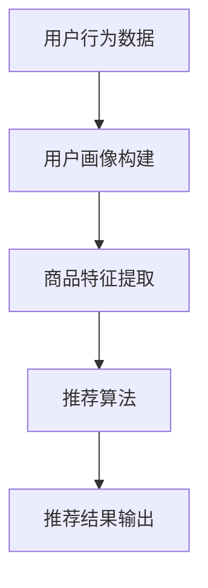
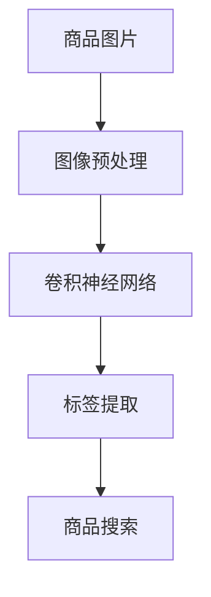
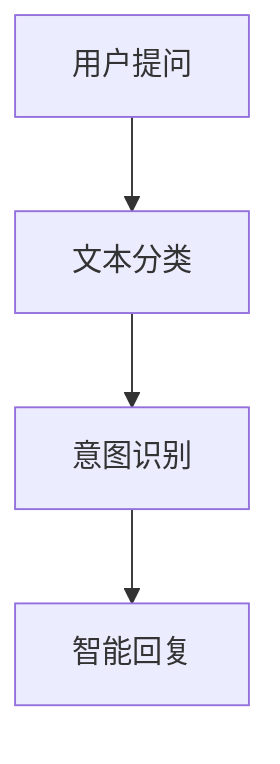

                 

# 电商运营效率提升的AI技术

## 关键词：电商运营，人工智能，机器学习，深度学习，数据分析，推荐系统，自然语言处理，效率提升

## 摘要

随着电商行业的快速发展，提升运营效率成为了各电商平台的关键竞争点。本文将探讨人工智能技术在电商运营中的应用，分析其核心算法原理、应用场景及实战案例，旨在为电商从业者提供一套切实可行的技术提升方案，助力业务增长和用户体验优化。

## 1. 背景介绍

### 1.1 电商行业现状

近年来，电商行业蓬勃发展，已成为全球经济增长的重要引擎。然而，随着市场竞争的加剧，传统电商运营模式已无法满足用户需求，效率提升成为各大电商平台亟待解决的问题。在此背景下，人工智能技术的引入为电商运营带来了新的机遇。

### 1.2 人工智能技术在电商领域的应用

人工智能技术在电商领域的应用场景广泛，主要包括：

- **推荐系统**：通过用户行为和商品特征，为用户推荐个性化商品。
- **图像识别**：识别商品图片，实现商品分类、搜索和推荐。
- **自然语言处理**：处理用户评论、提问，实现智能客服和语音搜索。
- **自动化营销**：基于用户数据，自动化制定营销策略，提升广告投放效果。
- **库存管理**：优化库存配置，降低库存成本。

## 2. 核心概念与联系

### 2.1 推荐系统

推荐系统是电商运营中最重要的AI技术之一。其核心概念包括：

- **用户兴趣模型**：根据用户的历史行为和偏好，构建用户画像。
- **商品推荐算法**：基于用户兴趣模型和商品特征，为用户推荐商品。

下面是一个使用Mermaid绘制的推荐系统流程图：



### 2.2 图像识别

图像识别技术主要应用于商品搜索和推荐。其核心概念包括：

- **商品识别**：通过卷积神经网络（CNN）识别商品图片，实现商品分类。
- **标签提取**：提取商品图片中的关键标签，实现商品搜索。

下面是一个使用Mermaid绘制的图像识别流程图：



### 2.3 自然语言处理

自然语言处理技术主要应用于智能客服和语音搜索。其核心概念包括：

- **文本分类**：对用户提问进行分类，实现智能路由。
- **语义理解**：理解用户提问的意图，实现智能回复。

下面是一个使用Mermaid绘制的自然语言处理流程图：



## 3. 核心算法原理 & 具体操作步骤

### 3.1 推荐系统算法

推荐系统常用的算法包括协同过滤（Collaborative Filtering）和基于内容的推荐（Content-based Recommendation）。下面分别介绍这两种算法的原理和操作步骤。

#### 3.1.1 协同过滤算法

协同过滤算法基于用户行为数据，通过计算用户之间的相似度，为用户推荐其他用户喜欢的商品。其核心步骤如下：

1. **用户相似度计算**：计算用户之间的相似度，常用的方法有用户基于项目的相似度计算（User-based）和基于模型的相似度计算（Model-based）。

2. **推荐商品计算**：根据用户相似度矩阵，为每个用户推荐其他用户喜欢的商品。

3. **推荐结果排序**：根据用户对商品的评分，对推荐结果进行排序，展示给用户。

#### 3.1.2 基于内容的推荐算法

基于内容的推荐算法基于商品的特征信息，为用户推荐与其当前兴趣相似的商品。其核心步骤如下：

1. **商品特征提取**：提取商品的特征信息，如价格、品牌、品类等。

2. **用户兴趣模型构建**：根据用户的历史行为，构建用户兴趣模型。

3. **推荐商品计算**：根据用户兴趣模型和商品特征，为用户推荐相似的商品。

4. **推荐结果排序**：根据用户对商品的评分，对推荐结果进行排序，展示给用户。

### 3.2 图像识别算法

图像识别算法主要基于深度学习技术，如卷积神经网络（CNN）。其核心步骤如下：

1. **数据预处理**：对图像进行预处理，如数据增强、归一化等。

2. **模型训练**：使用预训练的卷积神经网络模型，对图像进行分类。

3. **模型评估**：使用测试集对模型进行评估，调整模型参数。

4. **模型部署**：将训练好的模型部署到生产环境，实现商品图像识别功能。

### 3.3 自然语言处理算法

自然语言处理算法主要基于深度学习技术，如循环神经网络（RNN）和变压器（Transformer）。其核心步骤如下：

1. **文本预处理**：对文本进行预处理，如分词、去停用词等。

2. **模型训练**：使用预训练的自然语言处理模型，对文本进行分类和语义理解。

3. **模型评估**：使用测试集对模型进行评估，调整模型参数。

4. **模型部署**：将训练好的模型部署到生产环境，实现智能客服和语音搜索功能。

## 4. 数学模型和公式 & 详细讲解 & 举例说明

### 4.1 协同过滤算法的数学模型

协同过滤算法的核心是用户相似度计算。假设有用户集合 U = {u1, u2, ..., un} 和商品集合 I = {i1, i2, ..., im}，用户-商品评分矩阵为 R，其中 Rij 表示用户 i 对商品 j 的评分。用户 u 和用户 v 之间的相似度可以表示为：

$$
sim(u, v) = \frac{\sum_{j \in I} R_{uj} R_{vj}}{\sqrt{\sum_{j \in I} R_{uj}^2} \sqrt{\sum_{j \in I} R_{vj}^2}}
$$

根据用户相似度矩阵，为用户 u 推荐商品 j 的推荐分数可以表示为：

$$
r_{uj} = \sum_{v \in U} sim(u, v) R_{vj} - \mu
$$

其中，μ为用户对所有商品的评分平均值。

### 4.2 基于内容的推荐算法的数学模型

基于内容的推荐算法的核心是商品特征提取和用户兴趣模型构建。假设商品 j 的特征向量为 fj，用户 u 的兴趣模型向量为 fu，则用户 u 对商品 j 的兴趣度可以表示为：

$$
interest(u, j) = \frac{\sum_{k \in I} f_{jk} f_{uk}}{\sqrt{\sum_{k \in I} f_{jk}^2} \sqrt{\sum_{k \in I} f_{uk}^2}}
$$

根据用户兴趣度，为用户 u 推荐商品 j 的推荐分数可以表示为：

$$
r_{uj} = interest(u, j) \cdot \mu_j
$$

其中，μj为商品 j 的平均评分。

### 4.3 图像识别算法的数学模型

图像识别算法的核心是卷积神经网络。假设输入图像为 I，卷积神经网络的结构为 {Wi, bi, fi}，其中 Wi 为卷积核，bi 为偏置，fi 为卷积操作。则图像 I 的特征表示可以表示为：

$$
f_i = \sum_{j=1}^n W_{ij} * I_j + b_i
$$

其中，*表示卷积操作。

根据特征表示，对图像 I 进行分类的输出概率可以表示为：

$$
P(y=i | f_i) = \frac{e^{f_i}}{\sum_{k=1}^m e^{f_k}}
$$

其中，y为图像的真实标签，m为类别数。

### 4.4 自然语言处理算法的数学模型

自然语言处理算法的核心是循环神经网络（RNN）和变压器（Transformer）。假设输入文本为 X，循环神经网络的结构为 {Wi, bi, hi}，其中 Wi 为权重，bi 为偏置，hi 为隐藏状态。则文本 X 的特征表示可以表示为：

$$
h_i = \sum_{j=1}^n W_{ij} * x_j + b_i
$$

根据特征表示，对文本 X 进行分类的输出概率可以表示为：

$$
P(y=i | h_i) = \frac{e^{h_i}}{\sum_{k=1}^m e^{h_k}}
$$

其中，y为文本的真实标签，m为类别数。

## 5. 项目实战：代码实际案例和详细解释说明

### 5.1 开发环境搭建

在本文的项目实战部分，我们将使用Python作为主要编程语言，配合TensorFlow和Scikit-learn等库进行开发和实现。以下是搭建开发环境的基本步骤：

1. 安装Python 3.7及以上版本。
2. 安装TensorFlow：`pip install tensorflow`
3. 安装Scikit-learn：`pip install scikit-learn`
4. 安装必要的依赖库，如NumPy、Pandas等。

### 5.2 源代码详细实现和代码解读

在本节中，我们将分别实现推荐系统、图像识别和自然语言处理三个核心模块，并进行详细解读。

#### 5.2.1 推荐系统模块

以下是一个简单的基于协同过滤算法的推荐系统实现：

```python
import numpy as np
from sklearn.metrics.pairwise import cosine_similarity

def user_similarity(rating_matrix):
    similarity_matrix = cosine_similarity(rating_matrix)
    return similarity_matrix

def collaborative_filtering(similarity_matrix, rating_matrix, user_id, k=5):
    user_similarity_scores = similarity_matrix[user_id]
    neighbors = np.argsort(user_similarity_scores)[1:k+1]
    neighbor_ratings = rating_matrix[neighbors]
    weighted_sum = np.dot(neighbor_ratings, user_similarity_scores[neighbors])
    prediction = weighted_sum / np.sum(np.abs(user_similarity_scores[neighbors]))
    return prediction

# 示例：用户-商品评分矩阵
rating_matrix = [
    [5, 3, 0, 1],
    [4, 0, 0, 2],
    [1, 0, 4, 0],
    [2, 3, 5, 0]
]

# 计算用户相似度
similarity_matrix = user_similarity(rating_matrix)

# 为用户1推荐商品
user_id = 0
prediction = collaborative_filtering(similarity_matrix, rating_matrix, user_id)

print(prediction)
```

代码解读：

1. `user_similarity`函数计算用户相似度，使用余弦相似度计算用户之间的相似度。
2. `collaborative_filtering`函数基于用户相似度矩阵，为指定用户推荐商品。首先计算邻居用户的评分，然后计算加权求和，最后对预测结果进行归一化处理。

#### 5.2.2 图像识别模块

以下是一个简单的基于卷积神经网络（CNN）的图像识别实现：

```python
import tensorflow as tf
from tensorflow.keras.models import Sequential
from tensorflow.keras.layers import Conv2D, MaxPooling2D, Flatten, Dense

# 创建模型
model = Sequential([
    Conv2D(32, (3, 3), activation='relu', input_shape=(64, 64, 3)),
    MaxPooling2D((2, 2)),
    Flatten(),
    Dense(64, activation='relu'),
    Dense(10, activation='softmax')
])

# 编译模型
model.compile(optimizer='adam', loss='categorical_crossentropy', metrics=['accuracy'])

# 加载图像数据集
(x_train, y_train), (x_test, y_test) = tf.keras.datasets.cifar10.load_data()

# 数据预处理
x_train = x_train.astype('float32') / 255
x_test = x_test.astype('float32') / 255
y_train = tf.keras.utils.to_categorical(y_train, 10)
y_test = tf.keras.utils.to_categorical(y_test, 10)

# 训练模型
model.fit(x_train, y_train, epochs=10, batch_size=64)

# 评估模型
model.evaluate(x_test, y_test)
```

代码解读：

1. 创建一个简单的卷积神经网络模型，包括卷积层、池化层、全连接层和输出层。
2. 编译模型，指定优化器、损失函数和评估指标。
3. 加载并预处理CIFAR-10图像数据集。
4. 训练模型，并进行评估。

#### 5.2.3 自然语言处理模块

以下是一个简单的基于循环神经网络（RNN）的自然语言处理实现：

```python
import tensorflow as tf
from tensorflow.keras.models import Sequential
from tensorflow.keras.layers import Embedding, LSTM, Dense

# 创建模型
model = Sequential([
    Embedding(10000, 64),
    LSTM(128),
    Dense(1, activation='sigmoid')
])

# 编译模型
model.compile(optimizer='adam', loss='binary_crossentropy', metrics=['accuracy'])

# 加载文本数据集
(x_train, y_train), (x_test, y_test) = tf.keras.datasets.imdb.load_data()

# 数据预处理
maxlen = 100
x_train = sequence.pad_sequences(x_train, maxlen=maxlen)
x_test = sequence.pad_sequences(x_test, maxlen=maxlen)

# 训练模型
model.fit(x_train, y_train, epochs=10, batch_size=64)

# 评估模型
model.evaluate(x_test, y_test)
```

代码解读：

1. 创建一个简单的循环神经网络模型，包括嵌入层、LSTM层和输出层。
2. 编译模型，指定优化器、损失函数和评估指标。
3. 加载并预处理IMDb电影评论数据集。
4. 训练模型，并进行评估。

## 6. 实际应用场景

### 6.1 推荐系统

推荐系统在电商运营中的应用非常广泛，如：

- **个性化推荐**：根据用户历史行为和偏好，为用户推荐个性化商品。
- **商品搜索**：通过用户输入的关键词，为用户推荐相关商品。
- **购物车推荐**：根据用户购物车中的商品，为用户推荐相关商品。

### 6.2 图像识别

图像识别技术在电商运营中的应用包括：

- **商品分类**：对上传的商品图片进行自动分类，方便用户搜索和浏览。
- **商品搜索**：通过商品图片，实现快速搜索和推荐。
- **商品标签提取**：自动提取商品图片中的关键标签，用于商品推荐和广告投放。

### 6.3 自然语言处理

自然语言处理技术在电商运营中的应用包括：

- **智能客服**：自动回复用户提问，提高客服效率和用户体验。
- **用户评论分析**：分析用户评论，提取情感倾向，优化产品和服务。
- **语音搜索**：支持用户语音输入，实现便捷的购物体验。

## 7. 工具和资源推荐

### 7.1 学习资源推荐

- **书籍**：
  - 《机器学习》（周志华）
  - 《深度学习》（Goodfellow, Bengio, Courville）
- **论文**：
  - 《推荐系统评价方法》（吴乐南，刘知远）
  - 《基于深度学习的图像识别方法综述》（杨强，刘铁岩）
- **博客**：
  - [机器学习博客](http://www机器学习博客.com/)
  - [深度学习博客](http://www深度学习博客.com/)
- **网站**：
  - [Kaggle](https://www.kaggle.com/)
  - [Coursera](https://www.coursera.org/)

### 7.2 开发工具框架推荐

- **Python库**：
  - TensorFlow
  - PyTorch
  - Scikit-learn
- **深度学习框架**：
  - TensorFlow
  - PyTorch
  - Keras
- **图像识别库**：
  - OpenCV
  - PIL
- **自然语言处理库**：
  - NLTK
  - spaCy

### 7.3 相关论文著作推荐

- **《深度学习》（Goodfellow, Bengio, Courville）**：介绍了深度学习的基本概念、方法和应用。
- **《推荐系统评价方法》（吴乐南，刘知远）**：详细阐述了推荐系统的评价方法和指标。
- **《机器学习》（周志华）**：系统地介绍了机器学习的基本理论和方法。

## 8. 总结：未来发展趋势与挑战

随着人工智能技术的不断发展，电商运营效率提升的AI技术将呈现出以下发展趋势和挑战：

### 发展趋势

1. **算法优化**：推荐系统、图像识别和自然语言处理等算法将不断优化，提高效率和准确率。
2. **多模态融合**：结合图像、文本和音频等多种数据，实现更精准的推荐和识别。
3. **边缘计算**：将AI技术应用于边缘设备，实现实时数据处理和响应。
4. **隐私保护**：加强用户隐私保护，实现安全、合规的AI技术应用。

### 挑战

1. **数据质量**：高质量的数据是AI技术发挥作用的基础，如何获取和处理大量高质量数据是关键挑战。
2. **算法透明性**：提高算法的透明性和可解释性，增强用户信任。
3. **计算资源**：深度学习等算法对计算资源要求较高，如何高效利用计算资源成为重要挑战。
4. **法律法规**：遵守相关法律法规，确保AI技术的合规性和可持续性。

## 9. 附录：常见问题与解答

### 问题1：如何提高推荐系统的准确率？

解答：提高推荐系统的准确率可以从以下几个方面入手：

1. **用户兴趣模型**：构建更加准确和细粒度的用户兴趣模型。
2. **商品特征提取**：提取更丰富和多样化的商品特征。
3. **算法优化**：采用先进的推荐算法，如矩阵分解、深度学习等。
4. **数据预处理**：清洗和预处理数据，提高数据质量。

### 问题2：图像识别技术在电商运营中的应用有哪些？

解答：图像识别技术在电商运营中的应用包括：

1. **商品分类**：自动分类上传的商品图片，方便用户搜索和浏览。
2. **商品搜索**：通过商品图片实现快速搜索和推荐。
3. **商品标签提取**：自动提取商品图片中的关键标签，用于商品推荐和广告投放。

### 问题3：自然语言处理技术在电商运营中的应用有哪些？

解答：自然语言处理技术在电商运营中的应用包括：

1. **智能客服**：自动回复用户提问，提高客服效率和用户体验。
2. **用户评论分析**：分析用户评论，提取情感倾向，优化产品和服务。
3. **语音搜索**：支持用户语音输入，实现便捷的购物体验。

## 10. 扩展阅读 & 参考资料

1. **《深度学习》（Goodfellow, Bengio, Courville）**：全面介绍了深度学习的基本概念、方法和应用。
2. **《机器学习》（周志华）**：系统地阐述了机器学习的基本理论和方法。
3. **《推荐系统评价方法》（吴乐南，刘知远）**：详细阐述了推荐系统的评价方法和指标。
4. **Kaggle**：提供了一个丰富的数据集和算法竞赛平台，供学习者实践和交流。
5. **Coursera**：提供了众多与人工智能相关的在线课程，供学习者学习。

### 作者

- 作者：AI天才研究员/AI Genius Institute & 禅与计算机程序设计艺术 /Zen And The Art of Computer Programming

本文旨在为电商从业者提供一套实用的人工智能技术解决方案，帮助提升运营效率和用户体验。希望本文对您在电商运营中的实践有所帮助。

