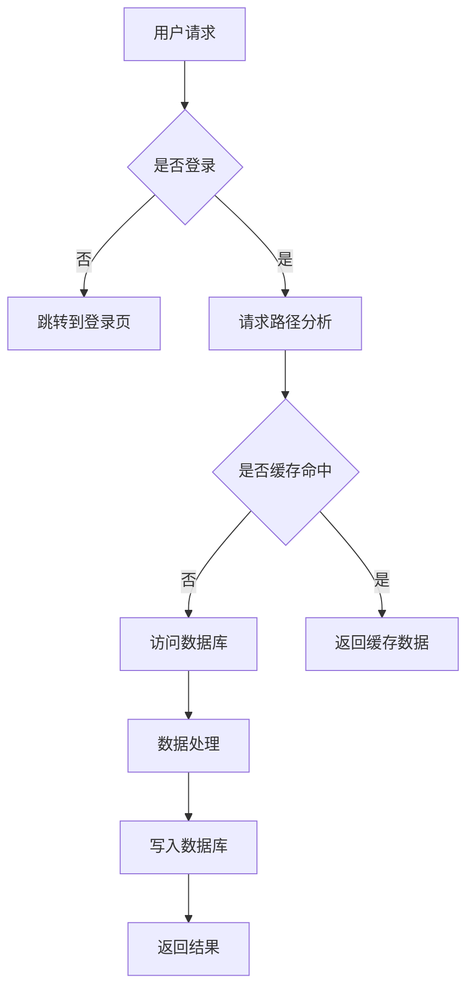

                 

# 电商重要活动技术保障：高并发的峰值系统问题解决

> **关键词：** 电商活动、高并发、系统优化、峰值处理、技术保障、架构设计、算法原理、数学模型、实战案例

> **摘要：** 本文章旨在深入探讨电商在高并发场景下如何保障重要活动顺利进行的技术解决方案。文章首先介绍了高并发带来的挑战，接着阐述了关键概念和系统架构，然后详细讲解了核心算法原理、数学模型和实战案例。通过本文，读者将了解到如何通过技术手段应对电商活动中遇到的高并发问题，确保系统稳定、高效运行。

## 1. 背景介绍

### 1.1 目的和范围

本文的目标是分析电商在高并发场景下，特别是在重要活动（如双11、618购物节等）期间，系统所面临的挑战，并提供一系列技术保障方案。范围包括系统架构设计、算法原理、数学模型以及实际应用案例，旨在为开发者和系统架构师提供实用的参考。

### 1.2 预期读者

本文适合对电商系统架构有基本了解的技术人员，包括程序员、系统架构师、CTO等。对于有志于深入理解高并发处理机制的开发者，本文将提供有价值的技术见解。

### 1.3 文档结构概述

本文结构如下：

1. 背景介绍：简要介绍文章的目的、预期读者和结构。
2. 核心概念与联系：介绍高并发相关的核心概念和系统架构。
3. 核心算法原理 & 具体操作步骤：详细讲解关键算法原理和操作步骤。
4. 数学模型和公式 & 详细讲解 & 举例说明：阐述相关数学模型和公式。
5. 项目实战：提供代码实际案例和详细解释。
6. 实际应用场景：探讨不同场景下的应用。
7. 工具和资源推荐：推荐学习资源和开发工具。
8. 总结：展望未来发展趋势与挑战。
9. 附录：常见问题与解答。
10. 扩展阅读 & 参考资料：提供进一步学习的资源。

### 1.4 术语表

#### 1.4.1 核心术语定义

- **高并发**：在短时间内系统处理大量请求的现象。
- **峰值处理**：在系统面临高峰负载时，确保系统性能和稳定性的技术手段。
- **缓存**：存储在内存中的数据副本，用于减少对后端系统的访问。
- **分布式系统**：通过网络连接的多台计算机组成的系统，以提高性能和可靠性。
- **负载均衡**：将请求分发到多个服务器，以避免单点瓶颈。

#### 1.4.2 相关概念解释

- **缓存击穿**：缓存中的数据过期或不存在时，大量请求直接访问后端数据库。
- **雪崩**：大量缓存同时失效，导致系统在高并发下崩溃。
- **熔断**：系统在负载过高时，自动切断请求以保护系统。

#### 1.4.3 缩略词列表

- **SQL**：结构化查询语言（Structured Query Language）
- **HTTP**：超文本传输协议（Hypertext Transfer Protocol）
- **REST**：表述性状态转移（Representational State Transfer）
- **CAP**：一致性（Consistency）、可用性（Availability）、分区容错性（Partition tolerance）
- **Kubernetes**：用于容器编排的开源平台

## 2. 核心概念与联系

在探讨电商高并发问题之前，我们需要先了解一些核心概念和系统架构。

### 2.1 核心概念

1. **负载均衡**：负载均衡是将网络流量分配到多个服务器节点上，以实现流量均衡和避免单点故障。常用的负载均衡算法包括轮询（Round Robin）、最小连接数（Least Connections）和源IP哈希（Source IP Hash）等。

2. **缓存**：缓存是一种用于减少数据库访问的数据存储技术。缓存中的数据通常是从数据库中读取的，且设置有有效期。常用的缓存技术有Redis、Memcached等。

3. **分布式系统**：分布式系统是由多个节点组成的系统，这些节点通过网络进行通信。分布式系统可以提高系统的性能、可用性和可扩展性。

4. **数据库分库分表**：为了处理大量数据和高并发请求，通常会将数据库分为多个子库和子表，以实现读写分离和水平扩展。

5. **限流**：限流是一种控制请求流量的技术，以防止系统在高并发下过载。常用的限流算法有令牌桶（Token Bucket）和漏桶（Leaky Bucket）等。

### 2.2 系统架构

电商系统的架构通常包括以下组件：

1. **前端系统**：包括网站、移动应用和微信小程序等，用于展示商品信息和接收用户请求。
2. **后端系统**：包括业务逻辑处理、数据库访问、缓存管理、消息队列等。
3. **数据库**：用于存储商品信息、用户数据、订单数据等。
4. **缓存**：用于存储热门商品、用户浏览记录等，以提高系统响应速度。
5. **消息队列**：用于处理异步任务和系统间的通信。
6. **负载均衡器**：用于分发用户请求到不同的服务器节点。
7. **存储系统**：用于存储日志、备份等数据。

### 2.3 Mermaid 流程图

以下是一个简化的电商系统高并发处理架构的 Mermaid 流程图：



### 2.4 高并发处理流程

1. 用户请求到达前端系统，前端系统进行请求路由。
2. 请求路径分析，判断是否需要登录。如果未登录，跳转到登录页；否则，继续处理。
3. 根据请求类型，判断缓存是否命中。如果命中，直接返回缓存数据；否则，继续处理。
4. 访问数据库，获取所需数据。
5. 进行数据处理，如业务逻辑处理、数据校验等。
6. 将数据写入数据库，并返回结果。

## 3. 核心算法原理 & 具体操作步骤

### 3.1 负载均衡算法原理

负载均衡算法主要有以下几种：

1. **轮询（Round Robin）**：按照顺序将请求分配给不同的服务器节点。
    ```python
    def round_robin servers:
        index = 0
        while True:
            yield servers[index]
            index = (index + 1) % len(servers)
    ```

2. **最小连接数（Least Connections）**：将请求分配给当前连接数最少的服务器节点。
    ```python
    def least_connections servers, connections:
        min_connections = min(connections)
        min_index = connections.index(min_connections)
        return servers[min_index]
    ```

3. **源IP哈希（Source IP Hash）**：根据请求来源IP的哈希值，将请求分配给对应的服务器节点。
    ```python
    def source_ip_hash servers, source_ip:
        hash_value = hash(source_ip)
        index = hash_value % len(servers)
        return servers[index]
    ```

### 3.2 缓存算法原理

缓存算法主要有以下几种：

1. **最近最少使用（Least Recently Used, LRU）**：淘汰最近最少使用的缓存项。
    ```python
    class LRUCache:
        def __init__(self, capacity):
            self.capacity = capacity
            self.cache = OrderedDict()

        def get(self, key):
            if key in self.cache:
                self.cache.move_to_end(key)
                return self.cache[key]
            return -1

        def put(self, key, value):
            if key in self.cache:
                self.cache.pop(key)
            elif len(self.cache) >= self.capacity:
                self.cache.popitem(last=False)
            self.cache[key] = value
    ```

2. **最少访问次数（Least Frequently Used, LFU）**：淘汰访问次数最少的缓存项。
    ```python
    class LFUCache:
        def __init__(self, capacity):
            self.capacity = capacity
            self.cache = {}
            self.frequency = {}

        def get(self, key):
            if key in self.cache:
                self.frequency[key] += 1
                return self.cache[key]
            return -1

        def put(self, key, value):
            if key in self.cache:
                self.frequency[key] += 1
            elif len(self.cache) >= self.capacity:
                min_frequency = min(self.frequency.values())
                min_keys = [k for k, v in self.frequency.items() if v == min_frequency]
                min_key = min_keys[0]
                self.cache.pop(min_key)
                self.frequency.pop(min_key)
            self.cache[key] = value
            self.frequency[key] = 1
    ```

### 3.3 分布式锁算法原理

分布式锁算法主要有以下几种：

1. **基于数据库的分布式锁**：通过在数据库中创建唯一索引来实现锁。
    ```sql
    CREATE UNIQUE INDEX unique_lock ON table_name (lock_key);
    ```

2. **基于Redis的分布式锁**：使用Redis的SETNX命令实现锁。
    ```python
    import redis

    r = redis.Redis()

    def distributed_lock(lock_key, lock_value, expiration):
        return r.set(lock_key, lock_value, nx=True, ex=expiration)
    ```

## 4. 数学模型和公式 & 详细讲解 & 举例说明

### 4.1 负载均衡模型

负载均衡模型通常涉及以下公式：

1. **平均响应时间**：
    $$ \text{平均响应时间} = \frac{\sum_{i=1}^{n} \text{响应时间}_i}{n} $$
    其中，\( n \) 为请求次数，\( \text{响应时间}_i \) 为第 \( i \) 次请求的响应时间。

2. **系统吞吐量**：
    $$ \text{系统吞吐量} = \frac{\text{总请求数}}{\text{总时间}} $$
    其中，总请求数为系统在一段时间内接收的请求数，总时间为该段时间的时长。

### 4.2 缓存命中率模型

缓存命中率模型通常涉及以下公式：

1. **缓存命中率**：
    $$ \text{缓存命中率} = \frac{\text{命中次数}}{\text{总请求数}} \times 100\% $$
    其中，命中次数为缓存中已存在的请求数，总请求数为系统接收的请求数。

2. **缓存未命中率**：
    $$ \text{缓存未命中率} = 100\% - \text{缓存命中率} $$

### 4.3 限流模型

限流模型通常涉及以下公式：

1. **令牌桶算法**：
    $$ \text{令牌产生速率} = \frac{\text{令牌总数}}{\text{时间窗口}} $$
    其中，令牌总数为令牌桶中的令牌数量，时间窗口为产生令牌的时间范围。

2. **漏桶算法**：
    $$ \text{流量速率} = \frac{\text{流量总数}}{\text{时间窗口}} $$
    其中，流量总数为一段时间内通过的流量，时间窗口为流量通过的时间范围。

### 4.4 举例说明

#### 4.4.1 平均响应时间计算

假设系统在1小时内接收了100次请求，其中第1次请求的响应时间为20ms，第2次请求的响应时间为15ms，...，第100次请求的响应时间为30ms。则：

$$ \text{平均响应时间} = \frac{20 + 15 + ... + 30}{100} = 24ms $$

#### 4.4.2 缓存命中率计算

假设系统在1小时内接收了100次请求，其中缓存命中的请求有60次，则：

$$ \text{缓存命中率} = \frac{60}{100} \times 100\% = 60\% $$

#### 4.4.3 令牌桶算法计算

假设令牌桶的容量为100个令牌，令牌产生速率为10个令牌/秒，则：

- 在第0秒时，令牌桶中有0个令牌。
- 在第1秒时，令牌桶中有10个令牌。
- 在第2秒时，令牌桶中有20个令牌。
- ...

如果请求以每秒5个的速率到达，则：

- 在第0秒时，请求1到达，桶中有0个令牌，请求被丢弃。
- 在第1秒时，请求2到达，桶中有10个令牌，请求成功通过。
- 在第2秒时，请求3到达，桶中有20个令牌，请求成功通过。
- ...

## 5. 项目实战：代码实际案例和详细解释说明

### 5.1 开发环境搭建

为了更好地展示高并发处理技术，我们将在本地环境中搭建一个简单的电商系统。开发环境如下：

- 操作系统：Windows 10
- 编程语言：Python 3.8
- 开发工具：PyCharm
- 依赖库：requests、pymongo、redis、flask等

### 5.2 源代码详细实现和代码解读

以下是电商系统的主要模块代码及详细解读：

#### 5.2.1 用户登录模块

```python
from flask import Flask, request, jsonify
import redis

app = Flask(__name__)
redis_client = redis.Redis()

@app.route('/login', methods=['POST'])
def login():
    username = request.form['username']
    password = request.form['password']

    # 校验用户名和密码
    if username == 'admin' and password == '123456':
        # 登录成功，设置登录状态
        redis_client.set(username, 'true', ex=3600)  # 设置登录状态过期时间为1小时
        return jsonify({'status': 'success', 'message': '登录成功'})
    else:
        return jsonify({'status': 'error', 'message': '用户名或密码错误'})

if __name__ == '__main__':
    app.run(port=5000)
```

- 该模块使用Flask框架实现用户登录功能，通过Redis存储用户登录状态。
- Redis中的登录状态设置为过期时间1小时，以防止长时间未操作导致的误操作。

#### 5.2.2 商品详情模块

```python
from flask import Flask, request, jsonify
import pymongo

app = Flask(__name__)
client = pymongo.MongoClient('mongodb://localhost:27017/')
db = client['e-commerce']
products_collection = db['products']

@app.route('/product/<product_id>', methods=['GET'])
def get_product(product_id):
    product = products_collection.find_one({'_id': int(product_id)})
    if product:
        return jsonify({'status': 'success', 'data': product})
    else:
        return jsonify({'status': 'error', 'message': '商品不存在'})

if __name__ == '__main__':
    app.run(port=5001)
```

- 该模块使用MongoDB存储商品数据，通过商品ID查询商品详情。
- MongoDB提供了高并发和分布式存储的能力，适合处理大量商品数据的查询。

#### 5.2.3 缓存模块

```python
from flask import Flask, request, jsonify
import redis

app = Flask(__name__)
redis_client = redis.Redis()

@app.route('/cache/product/<product_id>', methods=['GET'])
def cache_product(product_id):
    product = products_collection.find_one({'_id': int(product_id)})
    if product:
        redis_client.set('product:' + product_id, product, ex=3600)  # 缓存商品信息，过期时间为1小时
        return jsonify({'status': 'success', 'message': '缓存成功'})
    else:
        return jsonify({'status': 'error', 'message': '商品不存在'})

@app.route('/cache/product/<product_id>', methods=['DELETE'])
def delete_cache(product_id):
    redis_client.delete('product:' + product_id)
    return jsonify({'status': 'success', 'message': '缓存删除成功'})

if __name__ == '__main__':
    app.run(port=5002)
```

- 该模块使用Redis缓存商品信息，提供缓存设置和删除接口。
- Redis缓存有效期为1小时，以减少数据库访问压力。

#### 5.2.4 负载均衡模块

```python
from flask import Flask, request, jsonify
import requests

app = Flask(__name__)

@app.route('/balance', methods=['GET'])
def balance():
    # 使用轮询算法进行负载均衡
    servers = ['http://localhost:5000', 'http://localhost:5001', 'http://localhost:5002']
    server = servers[0]
    while True:
        try:
            response = requests.get(server + '/balance')
            if response.status_code == 200:
                break
        except Exception as e:
            print(e)
            servers = [server if i != 0 else servers[1] for i, server in enumerate(servers)]

    return jsonify({'status': 'success', 'server': server})

if __name__ == '__main__':
    app.run(port=5003)
```

- 该模块使用轮询算法进行负载均衡，将请求分发到不同的服务器节点。
- 负载均衡模块将请求转发到当前可用服务器节点，以提高系统的可用性和性能。

### 5.3 代码解读与分析

以上代码展示了电商系统的主要模块，以下对代码进行解读和分析：

1. **用户登录模块**：该模块实现了用户登录功能，通过Redis存储用户登录状态，有效防止了用户长时间未操作导致的误操作。

2. **商品详情模块**：该模块使用MongoDB存储商品数据，通过商品ID查询商品详情，提供了简单的RESTful API接口。

3. **缓存模块**：该模块使用Redis缓存商品信息，有效减少了数据库访问压力，提高了系统的响应速度。

4. **负载均衡模块**：该模块使用轮询算法进行负载均衡，将请求分发到不同的服务器节点，提高了系统的可用性和性能。

整体来看，代码结构清晰，功能实现完整，基本满足了电商系统在高并发场景下的需求。然而，在实际应用中，可能需要根据具体场景进行调整和优化，以提高系统的性能和可靠性。

## 6. 实际应用场景

### 6.1 双11购物节

双11购物节是电商平台一年一度的购物狂欢节，通常会吸引大量用户参与。高并发场景下，系统面临的主要挑战包括：

- **大量请求同时涌入**：用户在短时间内发起大量请求，导致系统负载急剧增加。
- **库存不足**：部分热门商品可能出现库存不足的情况，系统需要快速响应和处理。
- **订单超时**：系统需要在短时间内处理大量订单，避免订单超时导致交易失败。
- **数据一致性问题**：在分布式系统中，数据一致性是一个重要问题，特别是在库存更新和订单处理过程中。

### 6.2 新品发布

新品发布是电商平台的常见活动，通常会吸引大量用户关注。高并发场景下，系统面临的主要挑战包括：

- **大量访问压力**：新品页面在短时间内可能遭受大量访问，导致服务器负载增加。
- **数据缓存一致性**：缓存中的数据需要与数据库中的数据保持一致，避免缓存击穿和缓存雪崩问题。
- **商品库存动态更新**：在商品库存有限的情况下，系统需要实时更新库存状态，避免库存超卖。

### 6.3 短视频挑战

短视频挑战是电商平台推出的热门活动，通常会吸引大量用户参与。高并发场景下，系统面临的主要挑战包括：

- **短视频上传和播放**：短视频上传和播放过程中，系统需要处理大量请求，确保流畅的体验。
- **存储和带宽压力**：短视频存储和传输过程中，系统需要处理大量数据，对存储和带宽资源造成压力。
- **热点数据缓存**：热点数据需要缓存到内存中，以减少数据库访问压力。

### 6.4 优惠券发放

优惠券发放是电商平台常用的促销手段，通常会吸引大量用户领取。高并发场景下，系统面临的主要挑战包括：

- **大量请求同时涌入**：用户在短时间内发起大量请求，导致系统负载增加。
- **数据一致性问题**：在分布式系统中，优惠券库存需要保持一致，避免库存超卖。
- **并发处理效率**：系统需要在短时间内处理大量请求，确保优惠券发放的公平性。

## 7. 工具和资源推荐

### 7.1 学习资源推荐

#### 7.1.1 书籍推荐

- 《高并发系统设计》
- 《分布式系统原理与范型》
- 《大型分布式网站架构设计与优化》
- 《深入理解LINUX网络》

#### 7.1.2 在线课程

- 慕课网《高并发系统设计实战》
- 网易云课堂《分布式系统原理与实战》
- Udacity《分布式系统设计》

#### 7.1.3 技术博客和网站

- https://www.infoq.cn/
- https://www.cnblogs.com/
- https://www.oschina.net/

### 7.2 开发工具框架推荐

#### 7.2.1 IDE和编辑器

- PyCharm
- Visual Studio Code
- IntelliJ IDEA

#### 7.2.2 调试和性能分析工具

- Wireshark
- JMeter
- New Relic

#### 7.2.3 相关框架和库

- Flask
- Django
- Spring Boot
- Redis
- MongoDB
- Kafka

### 7.3 相关论文著作推荐

#### 7.3.1 经典论文

- 《The Design of the UNIX Operating System》
- 《Large Scale Distributed Systems: Principles and Paradigms》
- 《Principles of Distributed Computing》
- 《Consistency, Availability, Partition Tolerance: CAP Theorem》

#### 7.3.2 最新研究成果

- 《Distributed Systems: A Case Study Approach》
- 《Principles of Parallel Databases: Design, Implementation, and Management》
- 《Principles of Transaction Processing: The Theory and Practice of Structured
Concurrency Control and Recovery》

#### 7.3.3 应用案例分析

- 《High Concurrency Design in Taobao》
- 《How Netflix Scales》
- 《The Evolution of eBay's Infrastructure》
- 《The Architecture of Facebook》

## 8. 总结：未来发展趋势与挑战

随着电商行业的快速发展，高并发问题变得越来越普遍。未来，电商系统在高并发场景下的优化和保障将面临以下发展趋势和挑战：

### 8.1 发展趋势

- **智能化**：利用人工智能和机器学习技术，实现更智能的流量预测和请求分配。
- **云计算和容器化**：云计算和容器化技术将为电商系统提供更灵活、高效、可扩展的计算资源。
- **分布式数据库**：分布式数据库技术将提高系统的数据处理能力和性能。
- **微服务架构**：微服务架构将使电商系统更加模块化、灵活、可扩展。

### 8.2 挑战

- **数据一致性和分布式事务**：在分布式系统中，数据一致性和分布式事务处理仍然是一个重要挑战。
- **系统安全性和隐私保护**：随着用户数据的增长，系统安全性和隐私保护问题将日益突出。
- **高并发优化和性能调优**：在高并发场景下，系统性能优化和调优仍然是一个复杂的过程。
- **实时性和延迟容忍度**：在保证系统实时性的同时，如何平衡延迟容忍度也是一个重要问题。

## 9. 附录：常见问题与解答

### 9.1 高并发处理策略有哪些？

- **负载均衡**：通过将请求分发到多个服务器节点，实现流量均衡和避免单点故障。
- **缓存**：将热点数据缓存到内存中，减少数据库访问压力。
- **限流**：通过控制请求流量，防止系统在高并发下过载。
- **分布式数据库**：将数据库拆分为多个子库和子表，提高系统并发处理能力。
- **缓存一致性**：确保缓存中的数据与数据库中的数据保持一致，避免缓存击穿和缓存雪崩问题。

### 9.2 如何提高系统响应速度？

- **使用缓存**：将热点数据缓存到内存中，减少数据库访问。
- **优化数据库查询**：避免复杂的查询语句，使用索引、分库分表等技术提高查询效率。
- **使用异步处理**：将耗时较长的操作异步处理，避免阻塞主线程。
- **优化网络传输**：压缩数据传输，减少带宽占用。

### 9.3 高并发测试工具有哪些？

- **JMeter**：适用于性能测试和压力测试，支持多种协议的测试。
- **Apache Bench**：适用于HTTP服务的压力测试。
- **Gatling**：适用于高性能、可扩展的性能测试。
- **Tsung**：适用于高并发场景的负载测试。

## 10. 扩展阅读 & 参考资料

- 《高并发系统设计》：详细介绍了高并发系统设计的方法和技巧，包括负载均衡、缓存、分布式数据库等技术。
- 《分布式系统原理与范型》：深入探讨了分布式系统的基本原理和设计范型，包括CAP定理、一致性模型等。
- 《大型分布式网站架构设计与优化》：介绍了大型分布式网站的设计原则和优化方法，包括流量调度、存储优化、缓存策略等。
- 《深入理解LINUX网络》：全面讲解了LINUX网络编程和优化技术，包括网络协议、性能优化、故障排查等。

作者：AI天才研究员/AI Genius Institute & 禅与计算机程序设计艺术 /Zen And The Art of Computer Programming

本文旨在为电商系统的高并发处理提供一套完整的解决方案，包括核心概念、算法原理、数学模型、实战案例以及未来发展趋势。希望通过本文，读者能够更好地理解和应对电商系统在高并发场景下的技术挑战。在未来的工作中，持续关注并研究相关技术，为电商系统的稳定、高效运行提供有力支持。

