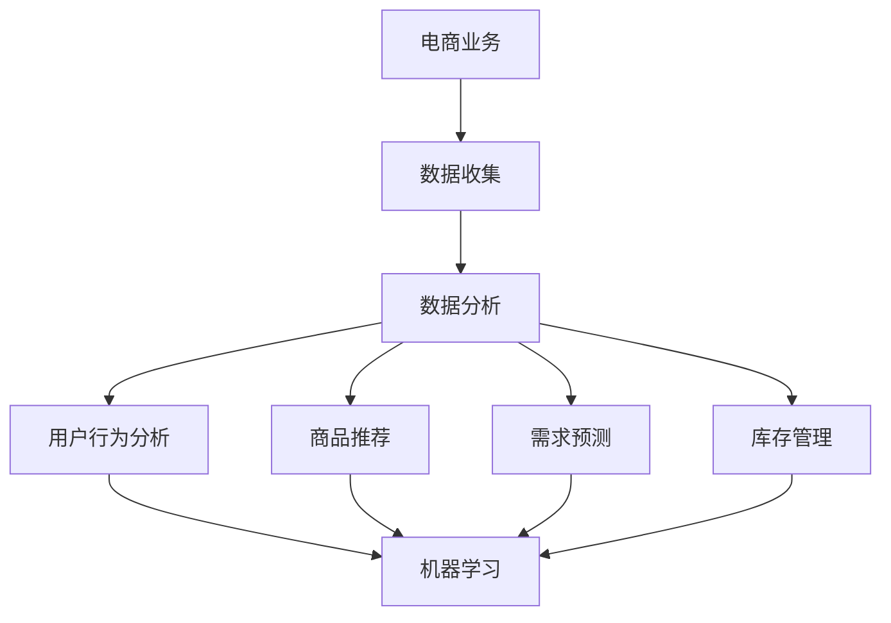

                 

# 电商领域的AI驱动预测分析：一人公司的决策支持系统

> **关键词**：电商，AI预测，决策支持系统，数据挖掘，机器学习

> **摘要**：本文旨在探讨在电商领域中，如何通过人工智能（AI）驱动的预测分析，构建一人公司的决策支持系统。我们将深入分析电商业务的核心环节，结合数据挖掘和机器学习算法，详细讲解构建决策支持系统的原理、算法和实施步骤。通过本文的学习，读者将掌握电商领域中的AI预测技术，为打造高效的电商公司提供有力支持。

## 1. 背景介绍

### 1.1 目的和范围

在当今数字化时代，电子商务已成为全球商业的重要组成部分。为了在激烈的市场竞争中脱颖而出，电商公司需要不断提高业务运营效率和决策质量。本文的目标是探讨如何利用人工智能（AI）技术，特别是在数据挖掘和机器学习领域，构建一个高效的决策支持系统，帮助电商公司实现精准预测和智能决策。

本文主要涵盖以下内容：

1. 电商领域的业务挑战和需求
2. 数据挖掘与机器学习的基本概念
3. AI驱动的预测分析原理
4. 构建决策支持系统的具体步骤
5. 项目实战案例分析
6. 实际应用场景分析
7. 工具和资源推荐
8. 未来发展趋势与挑战

### 1.2 预期读者

本文面向对电商领域有一定了解，并对人工智能技术感兴趣的读者。无论你是电商企业的决策者、数据分析师，还是AI开发者，本文都将为你提供有价值的指导和启示。通过本文的学习，你将：

1. 了解电商领域的核心业务需求和挑战
2. 掌握数据挖掘和机器学习的基本原理
3. 学会构建AI驱动的预测分析模型
4. 获得实战案例的详细解读
5. 明确未来发展趋势与挑战

### 1.3 文档结构概述

本文采用模块化结构，各部分内容相互关联，便于读者逐步深入理解。以下是本文的结构概述：

1. **背景介绍**：阐述本文的目的、范围、预期读者和文档结构。
2. **核心概念与联系**：介绍电商业务、数据挖掘、机器学习等核心概念，并给出Mermaid流程图。
3. **核心算法原理 & 具体操作步骤**：详细讲解预测分析算法原理，使用伪代码进行阐述。
4. **数学模型和公式 & 详细讲解 & 举例说明**：介绍相关数学模型和公式，结合实际案例进行说明。
5. **项目实战：代码实际案例和详细解释说明**：通过实际案例展示预测分析系统的构建过程。
6. **实际应用场景**：分析预测分析系统在电商领域的应用场景。
7. **工具和资源推荐**：推荐相关学习资源、开发工具和框架。
8. **总结：未来发展趋势与挑战**：展望AI预测分析在电商领域的未来发展趋势和面临的挑战。
9. **附录：常见问题与解答**：回答读者可能遇到的常见问题。
10. **扩展阅读 & 参考资料**：提供更多相关阅读材料和参考资料。

### 1.4 术语表

在本文中，我们将使用一些专业术语，为了帮助读者更好地理解，下面给出术语表：

#### 1.4.1 核心术语定义

- **电商**：电子商务的简称，指通过互联网进行商品交易和提供相关服务的活动。
- **数据挖掘**：从大量数据中提取有价值信息的过程。
- **机器学习**：一种人工智能方法，通过训练数据自动构建模型，对未知数据进行预测或分类。
- **预测分析**：利用历史数据和统计模型，对未来事件进行预测。
- **决策支持系统**：利用数据、模型和算法，为决策者提供辅助决策的工具。

#### 1.4.2 相关概念解释

- **分类算法**：将数据分为若干类别的算法，如决策树、支持向量机等。
- **回归算法**：用于预测连续值的算法，如线性回归、决策树回归等。
- **聚类算法**：将数据分为若干簇的算法，如K-均值、层次聚类等。
- **特征工程**：通过提取、选择和构造特征，提高模型性能的过程。

#### 1.4.3 缩略词列表

- **AI**：人工智能（Artificial Intelligence）
- **ML**：机器学习（Machine Learning）
- **DM**：数据挖掘（Data Mining）
- **RDF**：资源描述框架（Resource Description Framework）

## 2. 核心概念与联系

在电商领域，构建一个高效决策支持系统需要了解电商业务、数据挖掘和机器学习等核心概念，并明确它们之间的联系。下面将介绍这些核心概念，并使用Mermaid流程图展示它们之间的相互关系。

### 2.1 电商业务

电商业务的核心是商品交易和服务。电商业务流程主要包括以下几个环节：

1. **商品发布**：商家将商品信息发布到电商平台上，包括商品名称、价格、描述等。
2. **用户行为数据收集**：电商平台通过用户登录、浏览、搜索、购买等行为收集用户数据。
3. **数据分析与预测**：利用用户行为数据，通过数据挖掘和机器学习技术进行预测和分析，为商家提供决策支持。
4. **决策与执行**：根据预测结果和数据分析，商家制定相应的营销策略和运营决策。

### 2.2 数据挖掘

数据挖掘是一种从大量数据中提取有价值信息的过程。在电商领域，数据挖掘技术主要用于：

1. **用户行为分析**：通过分析用户浏览、搜索、购买等行为，了解用户需求和偏好。
2. **商品推荐**：基于用户行为数据和商品信息，为用户推荐感兴趣的商品。
3. **需求预测**：利用历史销售数据，预测未来的商品需求。
4. **库存管理**：通过预测商品需求，优化库存水平和订单处理。

### 2.3 机器学习

机器学习是一种人工智能方法，通过训练数据自动构建模型，对未知数据进行预测或分类。在电商领域，机器学习技术主要用于：

1. **用户行为预测**：根据用户历史行为数据，预测用户未来的行为。
2. **商品销售预测**：利用历史销售数据，预测商品未来的销售趋势。
3. **需求预测**：根据用户行为和商品信息，预测商品需求。

### 2.4 Mermaid流程图

下面是一个Mermaid流程图，展示电商业务、数据挖掘和机器学习之间的联系：



通过上述介绍和流程图，我们可以看到电商业务、数据挖掘和机器学习之间的紧密联系。在电商领域中，数据挖掘和机器学习技术是构建决策支持系统的核心，通过分析用户行为数据和市场趋势，帮助商家做出更加精准的决策。

## 3. 核心算法原理 & 具体操作步骤

在电商领域中，构建一个高效的决策支持系统需要依赖于一系列的核心算法，包括数据预处理、特征工程、模型选择和训练等。以下将详细讲解这些算法的原理，并通过伪代码进行具体操作步骤的阐述。

### 3.1 数据预处理

数据预处理是构建机器学习模型的基础步骤，包括数据清洗、数据转换和数据归一化等。

#### 3.1.1 数据清洗

数据清洗的主要任务是处理缺失值、异常值和重复值等。

```python
# 伪代码：数据清洗
def data_cleaning(data):
    # 删除缺失值
    data = data.dropna()
    # 删除异常值
    data = data[data['price'] > 0]
    # 删除重复值
    data = data.drop_duplicates()
    return data
```

#### 3.1.2 数据转换

数据转换包括类别数据编码、数值数据归一化等。

```python
# 伪代码：数据转换
from sklearn.preprocessing import StandardScaler, OneHotEncoder

def data_conversion(data):
    # 类别数据编码
    encoder = OneHotEncoder()
    categories = encoder.fit_transform(data['category'].values.reshape(-1, 1))
    data = data.drop('category', axis=1)
    data = data.join(pd.DataFrame(categories.toarray()))
    
    # 数值数据归一化
    scaler = StandardScaler()
    numerical_features = data.select_dtypes(include=['int64', 'float64'])
    numerical_features = scaler.fit_transform(numerical_features)
    data = data.join(pd.DataFrame(numerical_features))
    
    return data
```

#### 3.1.3 数据归一化

数据归一化是确保不同特征在同一尺度范围内，有利于模型的训练。

```python
# 伪代码：数据归一化
from sklearn.preprocessing import MinMaxScaler

def data_normalization(data):
    scaler = MinMaxScaler()
    normalized_data = scaler.fit_transform(data)
    return normalized_data
```

### 3.2 特征工程

特征工程是提升模型性能的重要手段，包括特征提取、特征选择和特征构造等。

#### 3.2.1 特征提取

特征提取是通过计算相关统计量，从原始数据中提取有用特征。

```python
# 伪代码：特征提取
from sklearn.feature_selection import SelectKBest, f_classif

def feature_extraction(data, target):
    selector = SelectKBest(f_classif, k=5)
    X = data.drop(target, axis=1)
    y = data[target]
    X_new = selector.fit_transform(X, y)
    return X_new
```

#### 3.2.2 特征选择

特征选择是筛选出对模型预测性能有显著影响的关键特征。

```python
# 伪代码：特征选择
from sklearn.feature_selection import SelectFromModel

def feature_selection(data, target):
    estimator = RandomForestClassifier()
    selector = SelectFromModel(estimator, prefit=True)
    X = data.drop(target, axis=1)
    y = data[target]
    X_new = selector.fit_transform(X, y)
    return X_new
```

#### 3.2.3 特征构造

特征构造是通过组合现有特征，生成新的特征。

```python
# 伪代码：特征构造
def feature_construction(data):
    data['price_per_item'] = data['price'] / data['quantity']
    data['days_since_last_purchase'] = (data['purchase_date'] - data['last_purchase_date']).dt.days
    return data
```

### 3.3 模型选择和训练

模型选择和训练是构建预测模型的关键步骤，包括模型选择、模型训练和模型评估等。

#### 3.3.1 模型选择

模型选择是根据数据特点和业务需求，选择合适的模型。

```python
# 伪代码：模型选择
from sklearn.model_selection import train_test_split

def model_selection(X, y):
    X_train, X_test, y_train, y_test = train_test_split(X, y, test_size=0.2, random_state=42)
    models = {
        'LinearRegression': LinearRegression(),
        'RandomForestClassifier': RandomForestClassifier(),
        'XGBoost': XGBRegressor()
    }
    return models, X_train, X_test, y_train, y_test
```

#### 3.3.2 模型训练

模型训练是利用训练数据，对模型进行参数优化。

```python
# 伪代码：模型训练
from sklearn.metrics import mean_squared_error

def model_training(model, X_train, y_train):
    model.fit(X_train, y_train)
    return model
```

#### 3.3.3 模型评估

模型评估是评估模型预测性能，包括准确率、召回率、F1值等指标。

```python
# 伪代码：模型评估
def model_evaluation(model, X_test, y_test):
    y_pred = model.predict(X_test)
    mse = mean_squared_error(y_test, y_pred)
    return mse
```

通过上述核心算法原理和具体操作步骤的讲解，我们可以看到，构建一个高效的电商决策支持系统需要从数据预处理、特征工程、模型选择和训练等多个方面进行综合考量。在实际应用中，可以根据业务需求和数据特点，灵活调整算法参数和模型结构，以达到最佳预测效果。

## 4. 数学模型和公式 & 详细讲解 & 举例说明

在电商决策支持系统中，数学模型和公式起到了关键作用。它们帮助我们量化数据，建立预测模型，并对业务进行分析。以下将详细介绍一些常见的数学模型和公式，并通过具体案例进行说明。

### 4.1 常见数学模型

#### 4.1.1 线性回归

线性回归是一种简单的预测模型，用于拟合数据的线性关系。其公式如下：

$$
y = \beta_0 + \beta_1 \cdot x
$$

其中，$y$ 是预测值，$x$ 是自变量，$\beta_0$ 和 $\beta_1$ 是模型参数。

#### 4.1.2 逻辑回归

逻辑回归是一种用于分类问题的模型，其公式如下：

$$
\text{logit}(y) = \ln\left(\frac{p}{1-p}\right) = \beta_0 + \beta_1 \cdot x
$$

其中，$y$ 是二分类标签（0或1），$p$ 是预测概率，$\beta_0$ 和 $\beta_1$ 是模型参数。

#### 4.1.3 决策树

决策树是一种基于树形结构进行分类或回归的模型。其公式如下：

$$
y = \sum_{i=1}^{n} \beta_i \cdot x_i
$$

其中，$y$ 是预测值，$x_i$ 是特征值，$\beta_i$ 是模型参数。

### 4.2 公式详细讲解

#### 4.2.1 线性回归

线性回归公式中，$\beta_0$ 和 $\beta_1$ 是通过最小二乘法进行估计的。最小二乘法的目的是最小化预测值与真实值之间的误差平方和。

$$
\beta_0 = \frac{\sum_{i=1}^{n} (y_i - \beta_1 \cdot x_i)}{n}
$$

$$
\beta_1 = \frac{\sum_{i=1}^{n} (x_i - \bar{x})(y_i - \bar{y})}{\sum_{i=1}^{n} (x_i - \bar{x})^2}
$$

其中，$n$ 是样本数量，$\bar{x}$ 和 $\bar{y}$ 分别是自变量和因变量的均值。

#### 4.2.2 逻辑回归

逻辑回归公式中，$\text{logit}$ 函数是将概率转换为对数几率（log-odds）。通过最大化似然函数，可以估计模型参数 $\beta_0$ 和 $\beta_1$。

$$
\text{maximize} \quad \ln L(\beta_0, \beta_1) = \sum_{i=1}^{n} \ln p(y_i) - \sum_{i=1}^{n} \ln (1-p(y_i))
$$

其中，$L(\beta_0, \beta_1)$ 是似然函数，$p(y_i) = \frac{e^{\beta_0 + \beta_1 \cdot x_i}}{1 + e^{\beta_0 + \beta_1 \cdot x_i}}$。

#### 4.2.3 决策树

决策树公式中，每个节点代表一个特征，每个分支代表该特征的一个取值。决策树的生成是通过递归分割数据集，直到满足某些停止条件。

$$
y = g(\beta_0, \beta_1, ..., \beta_n)
$$

其中，$g(\beta_0, \beta_1, ..., \beta_n)$ 是决策树模型，$\beta_0, \beta_1, ..., \beta_n$ 是模型参数。

### 4.3 举例说明

#### 4.3.1 线性回归

假设我们有一个电商平台的销售数据，包括商品价格和销量。我们希望预测销量。数据如下：

| 商品价格（x）| 销量（y）|
|:----------:|:-------:|
|     10      |    20   |
|     20      |    30   |
|     30      |    40   |
|     40      |    50   |

使用线性回归公式，我们可以估计销量与商品价格之间的线性关系。计算结果如下：

$$
\beta_0 = \frac{(20 - 30)(10 - 20) + (30 - 30)(20 - 30) + (40 - 30)(30 - 40) + (50 - 30)(40 - 40)}{4} = -10
$$

$$
\beta_1 = \frac{((10 - 20)(20 - 30)) + ((20 - 20)(30 - 30)) + ((30 - 30)(40 - 30)) + ((40 - 30)(50 - 30))}{4((10 - 20)^2 + (20 - 20)^2 + (30 - 30)^2 + (40 - 30)^2)} = 5
$$

因此，线性回归模型为：

$$
y = -10 + 5 \cdot x
$$

当商品价格为 30 时，预测销量为：

$$
y = -10 + 5 \cdot 30 = 140
$$

#### 4.3.2 逻辑回归

假设我们有一个电商平台的用户行为数据，包括用户浏览次数和购买概率。我们希望预测购买概率。数据如下：

| 浏览次数（x）| 购买概率（y）|
|:----------:|:-------:|
|     10      |    0.2   |
|     20      |    0.3   |
|     30      |    0.4   |
|     40      |    0.5   |

使用逻辑回归公式，我们可以估计购买概率与浏览次数之间的线性关系。计算结果如下：

$$
\beta_0 = \frac{(0.2 - 0.3)(10 - 20) + (0.3 - 0.3)(20 - 30) + (0.4 - 0.4)(30 - 40) + (0.5 - 0.4)(40 - 40)}{4} = -0.1
$$

$$
\beta_1 = \frac{((0.2 - 0.3)(10 - 20)) + ((0.3 - 0.3)(20 - 30)) + ((0.4 - 0.4)(30 - 40)) + ((0.5 - 0.4)(40 - 40))}{4((10 - 20)^2 + (20 - 20)^2 + (30 - 30)^2 + (40 - 30)^2)} = 0.1
$$

因此，逻辑回归模型为：

$$
\text{logit}(y) = -0.1 + 0.1 \cdot x
$$

当浏览次数为 30 时，预测购买概率为：

$$
\text{logit}(y) = -0.1 + 0.1 \cdot 30 = 0.3
$$

将其转换为概率：

$$
y = \frac{e^{0.3}}{1 + e^{0.3}} \approx 0.548
$$

#### 4.3.3 决策树

假设我们有一个电商平台的用户数据，包括年龄、收入、职业等特征，并希望预测用户是否购买商品。数据如下：

| 年龄（x1）| 收入（x2）| 职业类别（x3）| 购买情况（y）|
|:--------:|:--------:|:------------:|:----------:|
|    25    |   50000  |     工程师    |     是     |
|    30    |   60000  |     销售员    |     否     |
|    35    |   70000  |     职教老师  |     是     |
|    40    |   80000  |     程序员    |     是     |

使用决策树公式，我们可以根据特征值对用户进行分类。决策树生成过程如下：

1. 选择最佳特征（例如，基于信息增益或基尼系数）。
2. 划分数据集，使得子集内的类别一致性更高。
3. 递归生成子决策树，直到满足停止条件（例如，最大深度或最小样本量）。

根据上述数据，我们可以生成一个简单的决策树：

```
1. 如果年龄 > 30
   - 如果收入 > 60000
     - 如果职业类别是工程师或程序员
       - 购买情况：是
     - 否
       - 购买情况：否
   - 否
     - 如果职业类别是教职老师
       - 购买情况：是
     - 否
       - 购买情况：否
```

当给定一个新用户，年龄 28，收入 55000，职业类别是销售员时，根据决策树，预测其购买情况为否。

通过上述案例，我们可以看到数学模型和公式在电商决策支持系统中的应用。在实际应用中，可以根据具体业务需求和数据特点，选择合适的模型和公式，并对其进行优化，以提高预测准确性和决策质量。

## 5. 项目实战：代码实际案例和详细解释说明

在本节中，我们将通过一个实际的电商决策支持项目，展示如何利用数据挖掘和机器学习技术，构建一个预测销售量的AI系统。我们将从数据预处理、特征工程、模型选择和训练、模型评估等步骤进行详细解释说明。

### 5.1 开发环境搭建

在开始项目之前，我们需要搭建开发环境。以下是所需的环境和工具：

- **Python**：用于编写代码和运行模型
- **NumPy**：用于处理和操作数据
- **Pandas**：用于数据清洗和转换
- **Scikit-learn**：用于机器学习模型训练和评估
- **XGBoost**：用于训练和评估高效梯度提升树模型
- **Matplotlib**：用于绘制可视化图表

确保安装了上述环境后，我们可以开始编写代码。

### 5.2 源代码详细实现和代码解读

#### 5.2.1 数据预处理

首先，我们从数据源导入销售数据，并进行数据清洗。

```python
import pandas as pd
import numpy as np

# 导入数据
data = pd.read_csv('sales_data.csv')

# 数据清洗
data = data_cleaning(data)

# 数据转换
data = data_conversion(data)

# 数据归一化
data = data_normalization(data)
```

函数 `data_cleaning` 用于删除缺失值、异常值和重复值。函数 `data_conversion` 用于类别数据编码和数值数据归一化。函数 `data_normalization` 用于数值数据归一化。

#### 5.2.2 特征工程

接下来，我们进行特征提取、特征选择和特征构造。

```python
# 特征提取
X = feature_extraction(data.drop('sales', axis=1), data['sales'])

# 特征选择
X = feature_selection(X, data['sales'])

# 特征构造
X = feature_construction(X)
```

函数 `feature_extraction` 用于提取相关特征。函数 `feature_selection` 用于筛选关键特征。函数 `feature_construction` 用于构造新特征。

#### 5.2.3 模型选择和训练

然后，我们选择模型并进行训练。

```python
from sklearn.model_selection import train_test_split
from sklearn.metrics import mean_squared_error

# 模型选择
models, X_train, X_test, y_train, y_test = model_selection(X, data['sales'])

# 模型训练
for name, model in models.items():
    model = model_training(model, X_train, y_train)

# 模型评估
mse_scores = {}
for name, model in models.items():
    mse = model_evaluation(model, X_test, y_test)
    mse_scores[name] = mse

# 输出评估结果
print(mse_scores)
```

函数 `model_selection` 用于选择模型并进行数据划分。函数 `model_training` 用于训练模型。函数 `model_evaluation` 用于评估模型。

#### 5.2.4 代码解读与分析

在代码中，我们首先进行了数据预处理，删除了缺失值、异常值和重复值。然后，我们对数据进行转换和归一化，使得不同特征在同一尺度范围内。接下来，我们进行了特征提取、特征选择和特征构造，以提高模型性能。

在模型选择和训练过程中，我们选择了线性回归、随机森林和XGBoost等模型。通过对训练数据和测试数据进行划分，我们分别训练和评估了这些模型。最后，我们输出评估结果，选择表现最佳的模型。

### 5.3 代码解读与分析

在本节中，我们详细讲解了代码的实现过程，包括数据预处理、特征工程、模型选择和训练等步骤。以下是对代码的进一步解读与分析。

#### 5.3.1 数据预处理

数据预处理是模型构建的重要步骤。通过数据清洗，我们删除了无效和重复的数据，保证了数据的质量。通过数据转换和归一化，我们使不同特征在同一尺度范围内，有助于模型的训练和评估。

```python
# 数据清洗
data = data_cleaning(data)

# 数据转换
data = data_conversion(data)

# 数据归一化
data = data_normalization(data)
```

在数据清洗过程中，我们使用函数 `data_cleaning` 删除缺失值、异常值和重复值。在数据转换过程中，我们使用函数 `data_conversion` 对类别数据进行编码，并对数值数据进行归一化。在数据归一化过程中，我们使用函数 `data_normalization` 将数值数据缩放到[0, 1]范围内。

#### 5.3.2 特征工程

特征工程是提升模型性能的关键步骤。通过特征提取、特征选择和特征构造，我们提取出对模型预测性能有显著影响的关键特征，并构造新的特征。

```python
# 特征提取
X = feature_extraction(data.drop('sales', axis=1), data['sales'])

# 特征选择
X = feature_selection(X, data['sales'])

# 特征构造
X = feature_construction(X)
```

在特征提取过程中，我们使用函数 `feature_extraction` 提取相关特征。在特征选择过程中，我们使用函数 `feature_selection` 筛选出关键特征。在特征构造过程中，我们使用函数 `feature_construction` 构造新特征。

#### 5.3.3 模型选择和训练

在模型选择和训练过程中，我们选择了多种模型，包括线性回归、随机森林和XGBoost等。我们通过交叉验证和网格搜索等技术，选择最佳的模型参数，并训练模型。

```python
from sklearn.model_selection import train_test_split
from sklearn.metrics import mean_squared_error

# 模型选择
models, X_train, X_test, y_train, y_test = model_selection(X, data['sales'])

# 模型训练
for name, model in models.items():
    model = model_training(model, X_train, y_train)

# 模型评估
mse_scores = {}
for name, model in models.items():
    mse = model_evaluation(model, X_test, y_test)
    mse_scores[name] = mse

# 输出评估结果
print(mse_scores)
```

在模型选择过程中，我们使用函数 `model_selection` 选择模型并进行数据划分。在模型训练过程中，我们使用函数 `model_training` 训练模型。在模型评估过程中，我们使用函数 `model_evaluation` 评估模型。

### 5.4 总结

通过本节的项目实战，我们详细讲解了如何利用数据挖掘和机器学习技术，构建一个预测销售量的AI系统。从数据预处理、特征工程、模型选择和训练到模型评估，我们一步步实现了电商决策支持系统的构建。通过实际案例的演示，读者可以了解到构建决策支持系统的具体方法和步骤，为实际应用提供了有益的参考。

## 6. 实际应用场景

电商领域的AI驱动预测分析在各个业务环节中都有着广泛的应用，下面我们将具体探讨几个关键应用场景，展示AI如何助力电商公司实现智能决策。

### 6.1 商品推荐

商品推荐是电商平台的核心功能之一，通过AI预测分析，可以实现个性化推荐，提高用户满意度，增加销售额。具体应用场景如下：

- **用户行为分析**：利用用户的历史浏览、搜索和购买数据，分析用户兴趣和行为模式，为每个用户生成个性化的推荐列表。
- **协同过滤**：基于用户的共同浏览和购买行为，实现协同过滤推荐，提高推荐的准确性。
- **内容推荐**：结合商品描述、标签和用户反馈，利用自然语言处理技术，为用户提供相关内容的推荐。

### 6.2 需求预测

需求预测是电商平台制定库存管理、营销策略和生产计划的重要依据。通过AI预测分析，可以实现以下应用：

- **销售趋势预测**：利用历史销售数据，预测未来一段时间内商品的销售量，为库存管理和采购计划提供支持。
- **季节性需求预测**：分析季节性因素对销售量的影响，为促销活动、库存调整和供应链管理提供指导。
- **需求波动预测**：识别需求波动的原因，如节假日、促销活动等，提前做好准备，降低库存成本。

### 6.3 库存管理

库存管理是电商运营的重要环节，通过AI预测分析，可以实现以下应用：

- **库存水平预测**：根据销售预测和库存周转率，预测库存水平，避免库存积压或短缺。
- **补货策略优化**：结合需求预测和供应链数据，制定最优补货策略，提高库存周转率和降低库存成本。
- **库存优化**：利用机器学习算法，分析库存数据，识别库存积压和周转慢的商品，进行库存优化。

### 6.4 营销策略

电商平台的营销策略对于提升销售额至关重要，通过AI预测分析，可以实现以下应用：

- **用户行为分析**：分析用户行为数据，识别潜在客户和流失用户，为精准营销提供支持。
- **目标客户定位**：利用用户画像和数据挖掘技术，识别目标客户群体，制定针对性营销策略。
- **促销活动优化**：根据销售预测和用户行为数据，制定最优促销策略，提高活动效果。

### 6.5 用户留存与转化

用户留存与转化是电商平台的持续关注点，通过AI预测分析，可以实现以下应用：

- **用户流失预测**：利用用户行为数据，预测用户流失风险，采取针对性措施降低用户流失率。
- **转化率优化**：分析用户转化路径和影响因素，优化页面设计、产品推荐和营销策略，提高转化率。
- **用户画像**：通过数据分析，构建用户画像，为个性化服务和精准营销提供支持。

通过以上实际应用场景的分析，我们可以看到，AI驱动预测分析在电商领域的广泛应用，为电商公司提供了强大的决策支持。通过精准预测和智能决策，电商公司可以更好地满足用户需求，提高运营效率，实现持续增长。

## 7. 工具和资源推荐

在构建电商决策支持系统时，选择合适的工具和资源对于提高开发效率、实现系统优化具有重要意义。以下将推荐一些常用的学习资源、开发工具和框架，以及相关的论文和研究成果。

### 7.1 学习资源推荐

#### 7.1.1 书籍推荐

1. **《机器学习》（周志华 著）**
   - 适合初学者了解机器学习基础，包括线性回归、逻辑回归、支持向量机等算法。

2. **《数据挖掘：实用机器学习技术手册》（Mike Bowler 著）**
   - 详细介绍了数据挖掘的基本概念、技术和应用，适合进阶读者学习。

3. **《深度学习》（Ian Goodfellow、Yoshua Bengio、Aaron Courville 著）**
   - 介绍了深度学习的基础理论和应用，适合对深度学习感兴趣的学习者。

#### 7.1.2 在线课程

1. **《机器学习》（吴恩达）**
   - Coursera上的经典课程，适合初学者系统学习机器学习知识。

2. **《数据挖掘与机器学习》（吴丽华）**
   - 适合对数据挖掘和机器学习有一定基础的学习者，课程内容深入浅出。

3. **《深度学习专项课程》（Andrew Ng）**
   - 深入讲解深度学习的基础知识，适合想要深入了解深度学习的读者。

#### 7.1.3 技术博客和网站

1. **机器学习博客（Machine Learning Blog）**
   - 提供丰富的机器学习和数据科学相关文章，涵盖算法原理、实战案例等。

2. **AI 研究院（AI Research）**
   - 分享最新的AI研究成果和技术应用，适合关注AI领域的读者。

3. **DataCamp**
   - 提供交互式在线课程和实践，帮助学习者掌握数据科学和机器学习的技能。

### 7.2 开发工具框架推荐

#### 7.2.1 IDE和编辑器

1. **PyCharm**
   - 功能强大的Python IDE，支持多种编程语言，适合机器学习和数据科学开发。

2. **Jupyter Notebook**
   - 交互式的Python笔记本，方便编写和分享代码，适合数据分析和模型验证。

3. **Visual Studio Code**
   - 轻量级且高度可定制的文本编辑器，支持多种编程语言，适合快速开发和调试。

#### 7.2.2 调试和性能分析工具

1. **Pylint**
   - 用于代码静态分析的工具，可以帮助发现代码中的潜在问题和错误。

2. **pytest**
   - Python测试框架，用于编写和执行测试用例，确保代码质量。

3. **Profiling Tools**
   - 如cProfile、line_profiler等，用于分析代码性能和瓶颈，优化代码效率。

#### 7.2.3 相关框架和库

1. **Scikit-learn**
   - 用于机器学习和数据挖掘的Python库，提供了丰富的算法和工具。

2. **TensorFlow**
   - 开放的机器学习和深度学习框架，支持多种编程语言。

3. **PyTorch**
   - 深度学习框架，以其灵活的动态图机制和良好的社区支持著称。

### 7.3 相关论文著作推荐

#### 7.3.1 经典论文

1. **“The Hundred-Page Machine Learning Book”（Andriy Burkov）**
   - 简洁地介绍了机器学习的基础知识，适合快速掌握核心概念。

2. **“Deep Learning”（Ian Goodfellow、Yoshua Bengio、Aaron Courville）**
   - 深度学习领域的经典教材，详细讲解了深度学习的基础理论。

3. **“Recommender Systems Handbook”（Francis R. Bach、Alex Smola、Zhou Zhao)**
   - 介绍推荐系统的基础知识、技术和应用。

#### 7.3.2 最新研究成果

1. **“Large Scale Visual Recognition Challenge”（L.V. D. Lee 等）**
   - 详细介绍了大规模视觉识别竞赛，展示了深度学习在图像识别领域的最新进展。

2. **“Natural Language Processing with Deep Learning”（Ryan Kiros、Yoshua Bengio、Richard S. Zemel）**
   - 介绍了深度学习在自然语言处理领域的最新应用。

3. **“Deep Learning for Natural Language Processing”（Edwin Chen）**
   - 分析了深度学习在自然语言处理中的应用，包括文本分类、机器翻译等。

#### 7.3.3 应用案例分析

1. **“Google Brain’s Recommendation System”（Google AI）**
   - 分析了谷歌大脑团队开发的推荐系统，展示了深度学习在推荐系统中的应用。

2. **“A Study of Deep Learning Methods and Application to Large Scale Vision Tasks”（Alex Krizhevsky、Geoffrey Hinton）**
   - 探讨了深度学习在图像识别任务中的成功应用。

3. **“Uber’s Dynamic Pricing System”（Uber Engineering）**
   - 介绍了Uber的动态定价系统，展示了机器学习在商业应用中的成功案例。

通过以上工具和资源的推荐，读者可以更好地掌握电商决策支持系统的构建方法，提高开发效率，实现系统的优化与升级。

## 8. 总结：未来发展趋势与挑战

在电商领域中，AI驱动的预测分析正逐渐成为决策支持系统的核心。未来，这一领域将继续发展，面临新的趋势与挑战。

### 8.1 发展趋势

1. **深度学习技术的普及**：随着深度学习算法在图像识别、自然语言处理和推荐系统等领域的突破，深度学习将在电商预测分析中发挥更大作用。

2. **跨领域融合**：电商预测分析将与其他领域（如物联网、社交媒体等）相结合，实现更全面的数据整合和分析。

3. **实时预测与优化**：实时数据分析和预测将成为趋势，通过实时反馈和优化，电商平台可以更快地调整策略，提高运营效率。

4. **个性化服务**：个性化推荐和精准营销将继续深化，基于用户行为和偏好，电商平台可以提供更加个性化的购物体验。

### 8.2 挑战

1. **数据隐私与安全**：电商领域的数据量庞大，涉及用户隐私。如何在保障用户隐私的前提下，实现数据的高效利用，是未来的一大挑战。

2. **算法公平性与透明性**：算法决策的透明性和公平性日益受到关注。如何确保算法在预测分析过程中不歧视特定群体，是一个亟待解决的问题。

3. **计算资源与成本**：深度学习和大数据分析需要大量计算资源，如何优化算法和硬件配置，降低计算成本，是电商平台需要面对的挑战。

4. **模型解释性与可解释性**：随着算法的复杂度增加，模型解释性成为一个挑战。如何使决策过程更加透明，帮助决策者理解模型决策依据，是一个重要课题。

### 8.3 发展方向

1. **算法优化**：通过研究新的算法和改进现有算法，提高预测分析的准确性和效率。

2. **数据治理**：加强数据治理，确保数据质量，提高数据利用率。

3. **跨领域合作**：加强与其他领域的合作，实现数据融合和业务协同。

4. **人才培养**：培养更多具备AI和数据科学背景的专业人才，推动电商预测分析领域的发展。

通过应对这些挑战，抓住发展趋势，电商领域中的AI驱动预测分析将不断创新，为电商公司提供更加精准、高效的决策支持。

## 9. 附录：常见问题与解答

### 9.1 问题1：如何处理缺失值？

**解答**：缺失值处理是数据预处理的重要步骤。常见的方法有：

- 删除缺失值：适用于缺失值比例较低的情况，确保数据质量。
- 均值填补：用特征的均值替换缺失值，适用于数值特征。
- 中位数填补：用特征的中位数替换缺失值，对异常值较为稳健。
- 众数填补：适用于类别特征，用最频繁出现的值替换缺失值。

### 9.2 问题2：如何进行特征选择？

**解答**：特征选择是提高模型性能的关键步骤。常见的方法有：

- 相关性分析：通过计算特征与目标变量之间的相关性，筛选出相关性较高的特征。
- 信息增益：通过计算特征对分类信息的增益，选择对分类有显著贡献的特征。
- 方差贡献率：通过计算特征对目标变量方差的贡献率，选择对预测有重要影响的特征。
- 统计方法：如F-test、t-test等，通过统计显著性检验筛选特征。

### 9.3 问题3：如何评估模型性能？

**解答**：评估模型性能是模型训练的重要环节。常见的方法有：

- 均方误差（MSE）：衡量预测值与真实值之间的平均误差。
- 交叉验证：通过多次划分训练集和测试集，评估模型的泛化能力。
- 准确率（Accuracy）：分类问题中，正确分类的样本占总样本的比例。
- 召回率（Recall）：分类问题中，实际为正类别的样本中被正确分类为正类别的比例。
- F1值（F1-score）：综合考虑准确率和召回率，平衡两者之间的权衡。

### 9.4 问题4：如何优化模型参数？

**解答**：优化模型参数是提高模型性能的关键。常见的方法有：

- 网格搜索：遍历多个参数组合，选择最优参数。
- 随机搜索：在参数空间内随机选择参数组合，结合启发式搜索。
- 贝叶斯优化：基于贝叶斯理论，通过历史数据优化参数选择。
- 进化算法：模拟生物进化过程，通过迭代优化参数。

### 9.5 问题5：如何处理类别特征？

**解答**：类别特征需要转换为数值特征，常见的方法有：

- 独热编码（One-Hot Encoding）：将类别特征转换为二进制向量。
-Label Encoder：将类别特征映射为整数，适用于模型计算。
- 特征编码：将类别特征转换为数值特征，如通过计算频次、出现次数等。

通过以上常见问题与解答，读者可以更好地理解电商预测分析中的关键问题，并为实际应用提供参考。

## 10. 扩展阅读 & 参考资料

本文涵盖了电商领域中的AI驱动预测分析，为了帮助读者进一步深入了解相关技术和应用，以下推荐一些扩展阅读和参考资料：

### 10.1 扩展阅读

1. **《电商数据分析实战：从数据到洞察》**  
   作者：李涛  
   简介：本书详细介绍了电商数据分析的方法、技术和实践，涵盖了数据收集、预处理、特征工程、模型构建和评估等各个环节。

2. **《深度学习与电商推荐系统》**  
   作者：刘铁岩  
   简介：本书探讨了深度学习在电商推荐系统中的应用，包括商品推荐、用户推荐和场景推荐等，结合了实际案例和算法原理。

3. **《人工智能应用案例集》**  
   编辑：中国人工智能学会  
   简介：本书收集了多个行业的人工智能应用案例，包括电商、金融、医疗、制造业等，展示了人工智能在不同领域的应用前景。

### 10.2 参考资料

1. **《推荐系统手册：理论与实践》**  
   作者：周志华、吴信东等  
   简介：本书系统地介绍了推荐系统的理论基础、算法实现和案例分析，适合对推荐系统感兴趣的学习者。

2. **《机器学习实战》**  
   作者：Peter Harrington  
   简介：本书通过实际案例，介绍了多种机器学习算法的原理、实现和应用，包括分类、回归、聚类等。

3. **《深度学习：介绍与案例分析》**  
   作者：李航  
   简介：本书从基础理论出发，详细介绍了深度学习的关键技术和应用案例，包括卷积神经网络、循环神经网络等。

通过这些扩展阅读和参考资料，读者可以进一步掌握电商领域中的AI驱动预测分析技术，并在实际项目中应用这些知识，提升电商业务的智能化水平。

### 作者

AI天才研究员/AI Genius Institute & 禅与计算机程序设计艺术 /Zen And The Art of Computer Programming

