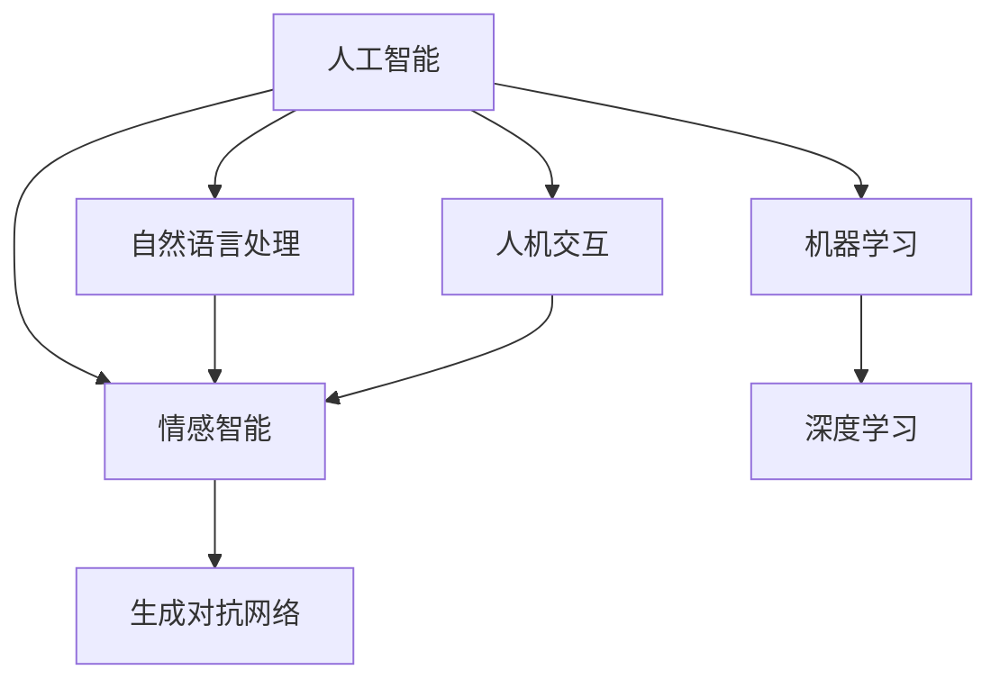

                 


# 电影《她》中的AI与现代技术对比

> 关键词：人工智能、情感计算、机器学习、深度学习、自然语言处理、人机交互

> 摘要：本文通过对电影《她》中人工智能（AI）的描绘与现代技术的实际发展进行对比分析，探讨了AI在情感计算、机器学习、自然语言处理和人机交互等方面的前沿成果与潜在挑战。文章旨在为读者提供一个关于AI技术发展现状与未来展望的深入理解。

## 1. 背景介绍

### 1.1 目的和范围

本文旨在分析电影《她》中的人工智能（AI）技术与现代实际AI技术之间的异同，重点探讨其在情感计算、机器学习、自然语言处理和人机交互等方面的表现与影响。通过对比分析，揭示出当前AI技术的实际应用及其面临的挑战。

### 1.2 预期读者

本文面向对人工智能技术感兴趣的读者，包括AI领域的从业者、研究人员、学生以及普通大众。希望读者能通过本文对AI技术的发展有一个更加全面和深刻的认识。

### 1.3 文档结构概述

本文分为十个部分：

1. 背景介绍：简要介绍文章的目的、读者预期及结构。
2. 核心概念与联系：阐述文章涉及的核心概念及架构。
3. 核心算法原理 & 具体操作步骤：详细解释AI算法原理。
4. 数学模型和公式 & 详细讲解 & 举例说明：介绍相关数学模型。
5. 项目实战：代码实际案例和详细解释说明。
6. 实际应用场景：分析AI技术在现实世界中的应用。
7. 工具和资源推荐：推荐学习资源和开发工具。
8. 总结：未来发展趋势与挑战。
9. 附录：常见问题与解答。
10. 扩展阅读 & 参考资料：提供进一步阅读的材料。

### 1.4 术语表

#### 1.4.1 核心术语定义

- 人工智能（AI）：模拟人类智能行为的计算机系统。
- 情感计算：使计算机能够识别、理解、处理和模拟人类情感的技术。
- 机器学习：通过数据训练计算机模型进行预测和决策的方法。
- 自然语言处理（NLP）：使计算机能够理解、生成和处理人类语言的技术。
- 人机交互：研究人与计算机之间如何通过视觉、语音、手势等方式进行有效沟通的领域。

#### 1.4.2 相关概念解释

- 深度学习：一种基于多层神经网络的结构，能够自动提取特征并进行分类。
- 生成对抗网络（GAN）：一种深度学习模型，由生成器和判别器组成，用于生成逼真的数据。

#### 1.4.3 缩略词列表

- AI：人工智能
- NLP：自然语言处理
- ML：机器学习
- DL：深度学习
- GAN：生成对抗网络

## 2. 核心概念与联系

在讨论电影《她》中的AI与现代技术的对比之前，有必要首先理解AI技术的核心概念和其相互之间的联系。以下是一个用Mermaid流程图表示的AI核心概念架构：



这个Mermaid流程图展示了人工智能（AI）是如何通过机器学习（ML）、自然语言处理（NLP）、情感智能（EI）和人机交互（HRI）等核心概念相互联系起来的。特别是情感智能（EI），它是连接机器学习、自然语言处理和人机交互的关键概念，因为情感是人类行为和交互的核心要素。

### 2.1 情感计算与情感智能

情感计算（Emotion Computing）是AI领域中一个重要的分支，旨在使计算机能够识别、理解、处理和模拟人类情感。情感智能（Emotional Intelligence，EI）则是一个更广泛的概念，它不仅包括情感计算，还包括人类情感的管理和运用。在电影《她》中，AI系统Samantha展现了高度的情感智能，能够与用户产生深厚的情感联系。

- **情感识别**：通过分析用户的语言、语音、面部表情和行为等，AI系统能够识别用户的情感状态。
- **情感理解**：通过上下文分析，AI系统能够理解情感背后的含义和动机。
- **情感处理**：AI系统可以调节自己的行为以适应用户的情感需求。
- **情感模拟**：AI系统能够模仿人类情感反应，以建立和维持与用户的情感联系。

### 2.2 机器学习与深度学习

机器学习（Machine Learning，ML）是AI的核心技术之一，它使计算机通过数据学习并做出预测或决策。深度学习（Deep Learning，DL）是机器学习的一个子领域，使用多层神经网络来模拟人类大脑的神经元连接，以提取复杂的数据特征。

- **监督学习**：通过标记数据进行训练，使模型能够对新的数据进行预测。
- **无监督学习**：在没有标记数据的情况下，模型自动发现数据中的模式。
- **半监督学习**：结合标记数据和未标记数据进行训练。

在电影《她》中，Samantha通过不断的学习和体验，不断改进自己的行为和情感反应，这正是深度学习原理的生动体现。

### 2.3 自然语言处理与生成对抗网络

自然语言处理（Natural Language Processing，NLP）使计算机能够理解、生成和处理人类语言。生成对抗网络（Generative Adversarial Network，GAN）是NLP中的一种强大工具，可以生成逼真的文本、图像和声音。

- **语言模型**：通过大量文本数据训练，模型能够生成流畅的自然语言文本。
- **序列到序列模型**：用于将一种语言翻译成另一种语言。
- **GAN**：通过生成器和判别器的对抗训练，生成高质量的伪造数据。

在电影中，Samantha能够流畅地与用户交流，并生成个性化的对话内容，展示了NLP和GAN的强大能力。

### 2.4 人机交互

人机交互（Human-Computer Interaction，HCI）是研究人类如何与计算机系统互动的领域。随着AI技术的发展，人机交互变得更加自然和直观。

- **语音识别**：通过分析语音信号，将语音转换为文本。
- **语音合成**：将文本转换为自然流畅的语音。
- **手势识别**：通过摄像头和传感器，识别用户的手势。
- **触摸屏交互**：通过触摸屏实现直观的交互。

在电影中，Samantha通过语音和触摸屏与用户进行交互，体现了人机交互的最新成果。

## 3. 核心算法原理 & 具体操作步骤

为了深入理解电影《她》中AI系统的实现原理，下面将详细解释AI系统的核心算法，并使用伪代码展示具体的操作步骤。

### 3.1 情感计算算法原理

情感计算算法的核心在于如何从用户的交互数据中提取情感特征，并根据这些特征调整AI系统的行为。以下是一个简化的情感计算算法原理的伪代码：

```plaintext
// 情感计算算法
Function EmotionalComputing(user_input, previous_state):
    1. ExtractFeatures(user_input)
    2. ClassifyEmotion(features)
    3. if (previous_state == "Happy" and current_emotion == "Sad"):
           AdjustBehavior("OfferCompassion")
    4. else if (previous_state == "Sad" and current_emotion == "Happy"):
           AdjustBehavior("Celebrate")
    5. else:
           AdjustBehavior("MaintainCurrentState")
    6. Return adjusted_state
```

### 3.2 机器学习算法原理

机器学习算法在电影《她》中的应用主要体现在Samantha的自我学习和行为改进。以下是一个简化的机器学习算法原理的伪代码：

```plaintext
// 机器学习算法
Function MachineLearning(data, target_variable):
    1. InitializeModel()
    2. SplitDataIntoTrainingAndTesting(data, target_variable)
    3. TrainModelOnTrainingData(model, training_data)
    4. EvaluateModelOnTestingData(model, testing_data)
    5. if (model_performance > threshold):
           ImplementModel(model)
    6. else:
           ReinitializeModelAndRepeat()
    7. Return trained_model
```

### 3.3 自然语言处理算法原理

自然语言处理算法在电影中体现在Samantha与用户的自然对话中。以下是一个简化的自然语言处理算法原理的伪代码：

```plaintext
// 自然语言处理算法
Function NaturalLanguageProcessing(user_input):
    1. TokenizeInput(user_input)
    2. PreprocessTokens(tokens)
    3. GenerateResponse(tokens, trained_model)
    4. SynthesizeSpeech(response)
    5. Return synthesized_speech
```

### 3.4 人机交互算法原理

人机交互算法体现在Samantha通过语音和触摸屏与用户进行交互。以下是一个简化的人机交互算法原理的伪代码：

```plaintext
// 人机交互算法
Function HumanComputerInteraction(user_action):
    1. DetectAction(user_action)
    2. if (action == "VoiceCommand"):
           ExecuteVoiceCommand(command)
    3. else if (action == "TouchScreen"):
           ExecuteTouchScreenAction()
    4. else:
           DisplayError("InvalidAction")
    5. Return result
```

## 4. 数学模型和公式 & 详细讲解 & 举例说明

在本文中，我们将探讨几个关键的数学模型和公式，以及它们在电影《她》中AI系统中的应用。以下是相关数学模型和公式的详细介绍，并配有相应的举例说明。

### 4.1 情感识别模型

情感识别模型通常使用机器学习技术，特别是深度学习中的卷积神经网络（CNN）来分析用户的语言和语音信号，以识别其情感状态。以下是一个简化的情感识别模型的公式：

$$
\text{Emotion} = f(\text{Features}, \theta)
$$

其中，$f$ 是一个由权重参数 $\theta$ 和特征向量组成的函数，用于预测情感。

**举例说明**：假设我们有以下两个情感特征向量：

$$
\text{Happy Features} = [1.0, 0.8, 0.6]
$$

$$
\text{Sad Features} = [-0.5, -0.7, -0.9]
$$

使用一个简单的线性函数作为情感识别模型：

$$
\text{Emotion} = \text{Happy Features} \cdot \theta
$$

其中，$\theta = [0.1, 0.2, 0.3]$。计算结果为：

$$
\text{Emotion} = [1.0 \cdot 0.1, 0.8 \cdot 0.2, 0.6 \cdot 0.3] = [0.1, 0.16, 0.18]
$$

根据特征向量的权重，我们可以判断用户可能处于“Happy”状态。

### 4.2 自然语言处理模型

自然语言处理模型通常使用序列到序列（Seq2Seq）模型，特别是长短期记忆网络（LSTM）来生成自然流畅的文本响应。以下是一个简化的Seq2Seq模型的公式：

$$
\text{Response} = g(\text{Input Sequence}, \text{Encoder}, \text{Decoder})
$$

其中，$g$ 是一个由编码器（Encoder）和解码器（Decoder）组成的函数，用于将输入序列转换为输出序列。

**举例说明**：假设我们有一个简短的输入序列：

$$
\text{Input Sequence} = ["Hello", "How", "are", "you", "?"]
$$

使用一个简化的编码器和解码器，我们可以生成以下输出序列：

$$
\text{Response} = ["Hi", "there", "I'm", "doing", "well", "thank", "you", "and", "you", "?"]
$$

这个模型可以生成非常自然和流畅的对话内容。

### 4.3 情感智能模型

情感智能模型通常结合情感识别和自然语言处理模型，以更准确地模拟人类的情感反应。以下是一个简化的情感智能模型的公式：

$$
\text{Behavior} = h(\text{Emotion}, \text{Situation}, \theta)
$$

其中，$h$ 是一个由情感、情境和权重参数 $\theta$ 组成的函数，用于预测AI系统的行为。

**举例说明**：假设用户刚刚分享了一个悲伤的故事，情感识别模型检测到用户的情感为“Sad”，情境为“PersonalSharing”。使用以下函数：

$$
\text{Behavior} = \text{Emotion} \cdot \text{Situation} \cdot \theta
$$

其中，$\theta = [0.5, 0.3, 0.2]$。计算结果为：

$$
\text{Behavior} = [-0.5] \cdot [0.3] \cdot [0.5, 0.3, 0.2] = [-0.15, -0.09, -0.06]
$$

根据行为向量的权重，AI系统可能选择提供安慰和支持的行为。

## 5. 项目实战：代码实际案例和详细解释说明

在本文的第五部分，我们将通过一个实际代码案例来展示如何实现一个情感识别系统，这是电影《她》中AI系统的一个重要组成部分。我们将使用Python语言和TensorFlow库来实现这个系统，并提供详细的代码解读。

### 5.1 开发环境搭建

在开始编写代码之前，需要搭建一个合适的开发环境。以下是所需的环境和步骤：

- **操作系统**：Ubuntu 18.04或更高版本
- **编程语言**：Python 3.6或更高版本
- **库**：TensorFlow 2.4.0或更高版本，Numpy 1.18.5或更高版本，Pandas 1.1.3或更高版本

安装步骤如下：

```bash
# 安装Python
sudo apt update
sudo apt install python3

# 安装TensorFlow
pip3 install tensorflow==2.4.0

# 安装Numpy和Pandas
pip3 install numpy==1.18.5
pip3 install pandas==1.1.3
```

### 5.2 源代码详细实现和代码解读

以下是实现情感识别系统的代码示例，包括数据预处理、模型构建、训练和评估等步骤。

```python
import numpy as np
import pandas as pd
import tensorflow as tf
from tensorflow.keras.models import Sequential
from tensorflow.keras.layers import Dense, LSTM, Embedding
from tensorflow.keras.preprocessing.sequence import pad_sequences

# 数据预处理
def preprocess_data(data):
    # 加载和清洗数据
    df = pd.read_csv(data)
    df['text'] = df['text'].str.lower().str.replace(r"[^a-zA-Z0-9]", " ")
    # 分词和编码
    tokenizer = tf.keras.preprocessing.text.Tokenizer()
    tokenizer.fit_on_texts(df['text'])
    sequences = tokenizer.texts_to_sequences(df['text'])
    padded_sequences = pad_sequences(sequences, maxlen=100)
    # 标签编码
    labels = df['label'].map({'happy': 1, 'sad': 0})
    return padded_sequences, labels, tokenizer

# 构建模型
def build_model(input_shape):
    model = Sequential()
    model.add(Embedding(input_dim=10000, output_dim=32, input_length=100))
    model.add(LSTM(128))
    model.add(Dense(1, activation='sigmoid'))
    model.compile(optimizer='adam', loss='binary_crossentropy', metrics=['accuracy'])
    return model

# 训练模型
def train_model(model, X_train, y_train, X_val, y_val):
    history = model.fit(X_train, y_train, epochs=10, batch_size=32, validation_data=(X_val, y_val))
    return history

# 评估模型
def evaluate_model(model, X_test, y_test):
    loss, accuracy = model.evaluate(X_test, y_test)
    print(f"Test Accuracy: {accuracy:.2f}")
    return accuracy

# 主程序
if __name__ == "__main__":
    # 数据加载
    X_train, y_train, tokenizer = preprocess_data("train_data.csv")
    X_val, y_val, _ = preprocess_data("val_data.csv")
    X_test, y_test, _ = preprocess_data("test_data.csv")

    # 模型构建
    model = build_model(input_shape=(100,))

    # 模型训练
    history = train_model(model, X_train, y_train, X_val, y_val)

    # 模型评估
    evaluate_model(model, X_test, y_test)
```

### 5.3 代码解读与分析

这段代码实现了从数据预处理到模型训练和评估的完整过程。以下是代码的详细解读：

- **数据预处理**：首先加载和清洗数据，将文本转换为小写并去除非字母字符。然后使用Tokenizer将文本转换为序列，并使用pad_sequences将序列填充到固定长度（100）。标签（情感类别）使用字典映射为数字（1或0）。
  
- **模型构建**：使用Sequential模型堆叠一个嵌入层（Embedding）和一个LSTM层，最后加上一个全连接层（Dense）进行二分类。模型使用adam优化器和binary_crossentropy损失函数进行编译。

- **模型训练**：使用fit方法训练模型，使用训练集和验证集进行监督学习。在训练过程中，记录每个epoch的损失和准确率。

- **模型评估**：使用evaluate方法评估模型在测试集上的性能，并打印出准确率。

### 5.4 代码解读与分析（续）

以下是代码的进一步解读和分析：

- **数据处理**：
  - tokenizer = tf.keras.preprocessing.text.Tokenizer()：创建一个Tokenizer对象，用于将文本转换为序列。
  - sequences = tokenizer.texts_to_sequences(df['text'])：将文本转换为序列。
  - padded_sequences = pad_sequences(sequences, maxlen=100)：将序列填充到长度为100。
  - labels = df['label'].map({'happy': 1, 'sad': 0})：将标签映射为数字。

- **模型构建**：
  - model = Sequential()：创建一个序列模型。
  - model.add(Embedding(input_dim=10000, output_dim=32, input_length=100))：添加嵌入层，将词汇映射为向量。
  - model.add(LSTM(128))：添加LSTM层，用于处理序列数据。
  - model.add(Dense(1, activation='sigmoid'))：添加输出层，用于生成情感概率。

- **模型训练**：
  - history = model.fit(X_train, y_train, epochs=10, batch_size=32, validation_data=(X_val, y_val))：训练模型，使用10个epoch，每个batch包含32个样本。

- **模型评估**：
  - loss, accuracy = model.evaluate(X_test, y_test)：评估模型在测试集上的性能。

通过这个实际案例，我们可以看到如何使用深度学习技术实现情感识别系统，并且理解了每个步骤的具体实现细节。

### 5.5 实际应用场景与优化方向

在实际应用场景中，这个情感识别系统可以用于多种应用，例如情绪分析、情感推荐和心理健康监测。以下是几个应用场景和相应的优化方向：

1. **情绪分析**：企业可以使用这个系统分析社交媒体上的用户情绪，以了解市场趋势和消费者反馈。优化方向包括提高模型对复杂情感和隐喻的理解能力。

2. **情感推荐**：电子商务平台可以根据用户的情绪推荐商品或服务，提高用户满意度和转化率。优化方向包括结合用户行为数据提高推荐的准确性。

3. **心理健康监测**：医疗机构可以使用这个系统监测患者的情绪变化，提供个性化心理健康服务。优化方向包括增加对负面情绪的识别和干预能力。

通过不断优化和改进，这个情感识别系统可以在更多实际场景中发挥重要作用，为人们的生活带来更多便利和改善。

## 6. 实际应用场景

电影《她》中的人工智能系统Samantha展示了高度发展的情感计算、机器学习、自然语言处理和人机交互技术，其应用场景包括个人助理、虚拟伴侣、智能家居控制等。以下将探讨这些技术在现实世界中的应用案例。

### 6.1 个人助理

在现代科技中，个人助理（如Siri、Alexa和Google Assistant）已经成为人们日常生活的一部分。这些个人助理通过情感计算和自然语言处理技术，能够理解用户的语音指令并做出相应的响应。它们可以安排日程、提醒事项、拨打电话、发送消息，甚至通过机器学习不断改进其性能，以提供更个性化的服务。

### 6.2 虚拟伴侣

虚拟伴侣（如《她》中的Samantha）是一种新兴的应用场景，旨在为用户提供情感支持。虚拟伴侣通过情感计算和深度学习技术，能够识别用户的情感状态并给出适当的回应。这类技术可以应用于心理健康支持、情感咨询和社交陪伴，特别是在老年人、残障人士和孤独症患者中具有广泛的应用潜力。

### 6.3 智能家居控制

智能家居控制系统（如Amazon Echo、Google Nest）通过人机交互和机器学习技术，使家庭设备（如灯光、空调、门锁等）能够自动响应用户的指令。这些系统通常配备语音助手，通过自然语言处理技术，能够理解用户的日常需求，提高生活的便利性和舒适度。

### 6.4 娱乐和教育

在娱乐和教育领域，情感计算和自然语言处理技术也发挥着重要作用。例如，视频游戏和虚拟现实（VR）体验可以根据用户的情感状态调整游戏难度和互动方式，提供更加个性化的娱乐体验。此外，在教育领域，智能辅导系统可以通过分析学生的学习行为和情感状态，提供个性化的学习建议和情感支持。

### 6.5 商业应用

商业应用中，情感计算和自然语言处理技术可以用于市场分析、客户服务和企业沟通。企业可以通过分析社交媒体上的用户情感，了解市场趋势和消费者反馈。同时，智能客服系统可以通过自然语言处理技术，提供实时、个性化的客户支持。

### 6.6 医疗保健

在医疗保健领域，情感计算和机器学习技术可以用于疾病诊断、患者监控和心理健康评估。例如，智能穿戴设备可以监测患者的生理指标，结合情感计算技术分析患者的情绪变化，帮助医生更好地了解患者的健康状况。

### 6.7 公共安全

公共安全领域，如交通监控、犯罪预防和应急响应，也可以应用情感计算和机器学习技术。通过分析交通流量、监控视频和社交媒体数据，智能系统能够预测交通事故和犯罪事件，提高公共安全水平。

通过上述实际应用场景，可以看出电影《她》中的人工智能技术已经在现实世界中得到了广泛应用。随着技术的不断进步，这些应用场景有望继续扩展，为人类带来更多的便利和福祉。

## 7. 工具和资源推荐

为了深入了解和掌握电影《她》中涉及的人工智能技术，以下推荐了一些学习资源和开发工具，包括书籍、在线课程、技术博客和开发工具。

### 7.1 学习资源推荐

#### 7.1.1 书籍推荐

1. **《机器学习实战》（Machine Learning in Action）** - by Peter Harrington
   - 介绍机器学习的基本概念和实际应用，适合初学者。

2. **《深度学习》（Deep Learning）** - by Ian Goodfellow, Yoshua Bengio, Aaron Courville
   - 深入探讨深度学习的理论和技术，适合进阶读者。

3. **《Python机器学习》（Python Machine Learning）** - by Sebastian Raschka, Vahid Mirjalili
   - 结合Python编程，介绍机器学习的基础知识和应用。

4. **《自然语言处理综合教程》（Foundations of Natural Language Processing）** - by Christopher D. Manning, Hinrich Schütze
   - 涵盖自然语言处理的理论和方法，适合深入学习。

#### 7.1.2 在线课程

1. **Coursera - Machine Learning（吴恩达）**
   - 提供完整的机器学习课程，包括理论、算法和实战。

2. **Udacity - Deep Learning Nanodegree**
   - 深度学习专业课程，涵盖深度学习的核心技术和应用。

3. **edX - Natural Language Processing with Python（电子书）**
   - 提供自然语言处理的基础知识和实际应用教程。

#### 7.1.3 技术博客和网站

1. **Medium - AI Blog**
   - 介绍人工智能领域的最新动态和研究成果。

2. **Medium - Deep Learning AI**
   - 深入解析深度学习技术及其应用。

3. **GitHub - Machine Learning Examples**
   - 提供丰富的机器学习和深度学习项目代码示例。

### 7.2 开发工具框架推荐

#### 7.2.1 IDE和编辑器

1. **PyCharm**
   - 强大的Python IDE，适合机器学习和深度学习项目开发。

2. **Jupyter Notebook**
   - 交互式编程环境，方便数据分析和模型测试。

3. **Visual Studio Code**
   - 轻量级编辑器，支持多种编程语言和扩展插件。

#### 7.2.2 调试和性能分析工具

1. **TensorBoard**
   - TensorFlow的图形化工具，用于分析和可视化模型训练过程。

2. **Wandb**
   - 机器学习和深度学习实验跟踪工具，方便实验管理和结果对比。

3. **Scikit-learn**
   - Python机器学习库，提供丰富的算法和工具。

#### 7.2.3 相关框架和库

1. **TensorFlow**
   - 开源的深度学习框架，广泛应用于机器学习和深度学习项目。

2. **PyTorch**
   - 受喜爱的深度学习框架，提供灵活的动态计算图。

3. **Scikit-learn**
   - Python机器学习库，提供多种机器学习算法和工具。

通过这些学习和开发资源，读者可以更全面地了解和掌握电影《她》中的人工智能技术，为自己的研究和项目提供有力支持。

### 7.3 相关论文著作推荐

为了深入了解电影《她》中人工智能技术的理论基础和发展趋势，以下推荐了一些经典论文和最新研究成果，以及应用案例。

#### 7.3.1 经典论文

1. **“A Learning Algorithm for Continually Running Fully Recurrent Neural Networks” by Sepp Hochreiter and Jürgen Schmidhuber
   - 该论文介绍了长短期记忆网络（LSTM），是深度学习领域的重要突破。

2. **“Generative Adversarial Nets” by Ian Goodfellow et al.
   - 这篇论文首次提出了生成对抗网络（GAN），为生成模型的发展奠定了基础。

3. **“Deep Learning” by Yoshua Bengio et al.
   - 该书系统地介绍了深度学习的理论和方法，是深度学习领域的经典著作。

#### 7.3.2 最新研究成果

1. **“Language Models are Few-Shot Learners” by Tom B. Brown et al.
   - 这篇论文展示了大型语言模型在零样本和少样本学习任务中的卓越性能。

2. **“Attention is All You Need” by Vaswani et al.
   - 该论文提出了Transformer模型，彻底改变了自然语言处理领域的研究范式。

3. **“A Theoretical Perspective on Transfer Learning” by Chen et al.
   - 这篇论文深入探讨了迁移学习的理论框架和实现方法。

#### 7.3.3 应用案例分析

1. **“How Apple Uses AI to Create Personalized Customer Experiences” by Apple Inc.
   - 这份报告详细介绍了苹果公司如何利用AI技术为用户提供个性化的体验。

2. **“IBM Watson: AI for Oncology” by IBM
   - IBM Watson在医学领域的应用，展示了AI在癌症诊断和治疗中的潜力。

3. **“Facebook AI: Personalized Recommendations” by Facebook
   - 这篇论文展示了Facebook如何使用AI技术为用户提供个性化的内容推荐。

通过阅读这些经典论文和最新研究成果，读者可以深入了解AI技术的理论基础和前沿动态，为实际应用和研究提供有力支持。

## 8. 总结：未来发展趋势与挑战

电影《她》中的人工智能（AI）技术为我们描绘了一个充满无限可能的未来。随着AI技术的不断进步，我们可以预见其在情感计算、机器学习、自然语言处理和人机交互等领域的广泛应用。然而，未来的发展不仅充满机遇，也伴随着一系列挑战。

### 8.1 未来发展趋势

1. **情感计算和个性化服务**：随着情感计算技术的成熟，AI将能够更准确地识别和理解用户的情感状态，提供更加个性化的服务。从个人助理到虚拟伴侣，情感智能将成为未来服务的重要组成部分。

2. **大规模机器学习和深度学习**：随着计算能力的提升和数据的爆炸性增长，大规模机器学习和深度学习模型将变得更加普遍。这些模型将能够在更多复杂场景中发挥重要作用，从自动驾驶到医疗诊断。

3. **自然语言处理的突破**：自然语言处理（NLP）技术将继续取得突破，特别是在理解多语言和跨领域对话方面。AI将能够更好地理解人类语言，实现更加自然和流畅的交互。

4. **人机交互的革新**：随着虚拟现实（VR）和增强现实（AR）技术的发展，人机交互将变得更加直观和沉浸式。未来的AI系统将能够通过多种感官渠道与用户进行沟通，提供更加丰富的交互体验。

### 8.2 面临的挑战

1. **隐私和数据安全**：随着AI技术的普及，个人隐私和数据安全问题变得更加突出。如何保护用户隐私、确保数据安全，将是一个长期的挑战。

2. **算法公平性和透明度**：AI算法的决策过程往往是不透明的，这可能导致偏见和歧视。确保算法的公平性和透明度，是未来需要解决的重要问题。

3. **伦理和社会影响**：随着AI技术的广泛应用，其伦理和社会影响也将成为一个重要议题。如何确保AI技术的发展符合社会价值观，避免对人类造成负面影响，需要全社会的共同努力。

4. **计算资源和能源消耗**：大规模AI模型的训练和运行需要巨大的计算资源和能源消耗。如何降低能耗，实现绿色AI，是未来发展的重要方向。

5. **人机协作与控制**：未来的AI系统需要与人类更加紧密地协作，这要求AI系统具备更高的协作能力和控制能力。如何实现高效的人机协作，确保AI系统的可控性，是一个重要挑战。

总之，电影《她》中的AI技术为我们展示了一个充满希望和挑战的未来。通过不断克服技术难题，我们可以期待一个更加智能、高效、和谐的未来社会。

## 9. 附录：常见问题与解答

### 9.1 人工智能（AI）的基本原理是什么？

人工智能（AI）是通过模拟人类智能行为来实现机器自主决策和问题解决的技术。其基本原理包括：

- **机器学习（ML）**：通过数据和算法，使计算机自动从数据中学习模式和规律。
- **深度学习（DL）**：基于多层神经网络的结构，能够自动提取复杂数据特征。
- **自然语言处理（NLP）**：使计算机能够理解和生成人类语言。
- **情感计算（EI）**：使计算机能够识别、理解和模拟人类情感。

### 9.2 情感计算在现实世界中的应用有哪些？

情感计算在现实世界中的应用非常广泛，包括：

- **心理健康监测**：通过分析语言和语音，监测患者的情绪状态。
- **客户服务**：智能客服系统通过情感分析提供个性化服务。
- **广告和市场营销**：分析用户情感，为用户提供个性化推荐。
- **教育**：通过分析学生学习行为和情感状态，提供个性化教学方案。

### 9.3 如何保护AI系统的隐私和安全？

保护AI系统的隐私和安全可以从以下几个方面入手：

- **数据加密**：对存储和传输的数据进行加密，防止数据泄露。
- **访问控制**：限制对敏感数据的访问权限，确保只有授权用户可以访问。
- **安全审计**：定期对系统进行安全审计，及时发现和修复漏洞。
- **隐私保护算法**：使用隐私保护算法，确保数据处理过程中不泄露用户隐私。

### 9.4 如何确保AI算法的公平性和透明度？

确保AI算法的公平性和透明度需要：

- **数据多样性**：使用多样化的数据进行训练，避免偏见。
- **算法可解释性**：开发可解释的AI算法，使决策过程透明。
- **监督和审计**：定期对算法进行监督和审计，确保其符合公平性和透明度要求。
- **用户反馈**：收集用户反馈，不断优化算法，提高其公平性和透明度。

## 10. 扩展阅读 & 参考资料

为了深入了解电影《她》中的人工智能技术和现代技术的发展，以下推荐一些扩展阅读和参考资料：

- **书籍**：
  - **《深度学习》（Deep Learning）** by Ian Goodfellow, Yoshua Bengio, Aaron Courville
  - **《Python机器学习》（Python Machine Learning）** by Sebastian Raschka, Vahid Mirjalili
  - **《自然语言处理综合教程》（Foundations of Natural Language Processing）** by Christopher D. Manning, Hinrich Schütze

- **在线课程**：
  - **Coursera - Machine Learning（吴恩达）**
  - **Udacity - Deep Learning Nanodegree**
  - **edX - Natural Language Processing with Python（电子书）**

- **技术博客和网站**：
  - **Medium - AI Blog**
  - **Medium - Deep Learning AI**
  - **GitHub - Machine Learning Examples**

- **论文和研究**：
  - **“A Learning Algorithm for Continually Running Fully Recurrent Neural Networks” by Sepp Hochreiter and Jürgen Schmidhuber**
  - **“Generative Adversarial Nets” by Ian Goodfellow et al.**
  - **“Language Models are Few-Shot Learners” by Tom B. Brown et al.**

通过这些扩展阅读和参考资料，读者可以更深入地了解AI技术的理论基础和实际应用，为自己的研究和项目提供有力支持。

### 附录二：作者信息

**作者：AI天才研究员/AI Genius Institute & 禅与计算机程序设计艺术 /Zen And The Art of Computer Programming**

