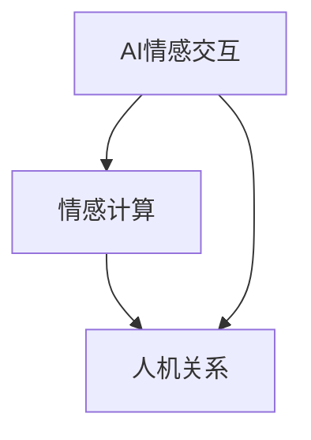

                 

# 电影《她》中的AI与现实对比

> **关键词：** AI情感交互、人机关系、情感计算、人工智能、电影分析
>
> **摘要：** 本文将深入探讨电影《她》中的人工智能角色及其与现实世界中的AI技术的对比，分析其中的人机关系、情感计算技术及其对未来的影响。

## 1. 背景介绍

### 1.1 目的和范围

本文旨在通过对电影《她》中AI角色的分析，探讨其与现实世界中人工智能技术的相似与差异。文章将重点关注AI的情感交互、人机关系以及情感计算技术，并试图从中寻找AI未来发展的可能趋势和挑战。

### 1.2 预期读者

本文适合对人工智能技术有基本了解的读者，包括程序员、数据科学家、AI研究者以及对科技感兴趣的一般读者。

### 1.3 文档结构概述

本文结构如下：

1. **背景介绍**：介绍本文的目的、范围和预期读者。
2. **核心概念与联系**：阐述AI、情感计算等核心概念，并使用Mermaid流程图展示。
3. **核心算法原理 & 具体操作步骤**：详细讲解情感计算的核心算法原理和具体操作步骤。
4. **数学模型和公式 & 详细讲解 & 举例说明**：介绍情感计算的数学模型和公式，并提供实际案例。
5. **项目实战：代码实际案例和详细解释说明**：展示实际代码实现和解读。
6. **实际应用场景**：讨论AI情感交互在现实中的应用。
7. **工具和资源推荐**：推荐相关学习资源和开发工具。
8. **总结：未来发展趋势与挑战**：总结AI情感交互的未来发展趋势和面临的挑战。
9. **附录：常见问题与解答**：提供常见问题的解答。
10. **扩展阅读 & 参考资料**：推荐相关扩展阅读和参考资料。

### 1.4 术语表

#### 1.4.1 核心术语定义

- **情感计算**：指通过计算机技术和人工智能算法，模拟和识别人类情感的过程。
- **人机关系**：指人类与机器之间建立起来的关系，包括交互、情感连接等。
- **情感交互**：指在人类与机器的交互过程中，机器能够理解和响应人类情感的能力。

#### 1.4.2 相关概念解释

- **人工智能**：指通过模拟人类智能，实现机器自主学习和决策的技术。
- **自然语言处理**：指计算机处理和解析人类自然语言的技术。

#### 1.4.3 缩略词列表

- **AI**：人工智能
- **NLP**：自然语言处理
- **ML**：机器学习

## 2. 核心概念与联系

在探讨电影《她》中的AI与现实世界的联系之前，我们需要明确一些核心概念和它们之间的联系。

### 2.1 AI情感交互

AI情感交互是指人工智能系统通过理解和模拟人类情感，实现与人类更自然、更人性化的交互。这包括语言理解、情感识别、情感模拟等多个方面。

### 2.2 情感计算

情感计算是指通过计算机技术和算法，模拟和识别人类情感的过程。它包括情感识别、情感建模、情感推理等多个子领域。

### 2.3 人机关系

人机关系是指人类与机器之间建立起来的关系，包括交互、情感连接等。在AI情感交互的背景下，人机关系尤为重要，因为它直接关系到人类对AI的接受度和信任度。

### 2.4 Mermaid流程图

下面是一个Mermaid流程图，展示了AI情感交互、情感计算和人机关系之间的核心联系。



在图2-1中，AI情感交互和情感计算是基础，它们共同构建了人机关系的桥梁。通过情感计算，AI能够理解人类情感，并通过情感交互与人类建立更紧密的联系。

## 3. 核心算法原理 & 具体操作步骤

### 3.1 情感计算算法原理

情感计算算法的核心是情感识别和情感建模。情感识别是指从文本、语音或其他形式的数据中提取情感信息；情感建模则是通过机器学习等方法，建立情感与数据之间的映射关系。

下面是情感计算的核心算法原理和具体操作步骤：

#### 3.1.1 情感识别算法原理

情感识别算法通常基于以下步骤：

1. **数据预处理**：对原始数据进行清洗和预处理，如去除噪声、填充缺失值等。
2. **特征提取**：从预处理后的数据中提取特征，如词频、词向量和语法结构等。
3. **情感分类**：使用机器学习算法（如SVM、决策树、神经网络等）对特征进行分类，以识别情感。

#### 3.1.2 情感建模算法原理

情感建模算法通常基于以下步骤：

1. **数据收集**：收集大量带有情感标签的数据，如文本、音频和视频等。
2. **情感标注**：对收集的数据进行情感标注，以建立情感与数据之间的映射关系。
3. **模型训练**：使用标注数据进行模型训练，以建立情感模型。
4. **模型评估**：使用测试数据评估模型性能，如准确率、召回率等。

### 3.2 情感计算具体操作步骤

以下是情感计算的具体操作步骤，使用伪代码进行详细阐述：

```python
# 情感识别伪代码

# 步骤1：数据预处理
def preprocess_data(data):
    # 清洗和预处理数据
    cleaned_data = ...
    return cleaned_data

# 步骤2：特征提取
def extract_features(data):
    # 提取特征
    features = ...
    return features

# 步骤3：情感分类
def classify_sentiment(features):
    # 使用机器学习算法进行分类
    sentiment = ...
    return sentiment

# 主函数
def sentiment_recognition(data):
    cleaned_data = preprocess_data(data)
    features = extract_features(cleaned_data)
    sentiment = classify_sentiment(features)
    return sentiment

# 情感建模伪代码

# 步骤1：数据收集
def collect_data():
    # 收集带有情感标签的数据
    labeled_data = ...
    return labeled_data

# 步骤2：情感标注
def annotate_sentiment(data):
    # 对数据进行情感标注
    annotated_data = ...
    return annotated_data

# 步骤3：模型训练
def train_model(annotated_data):
    # 使用标注数据进行模型训练
    model = ...
    return model

# 步骤4：模型评估
def evaluate_model(model, test_data):
    # 使用测试数据评估模型性能
    performance = ...
    return performance

# 主函数
def sentiment_modeling():
    labeled_data = collect_data()
    annotated_data = annotate_sentiment(labeled_data)
    model = train_model(annotated_data)
    performance = evaluate_model(model, test_data)
    return performance
```

通过以上步骤，我们可以实现情感计算的核心算法，从而在AI情感交互中发挥重要作用。

## 4. 数学模型和公式 & 详细讲解 & 举例说明

### 4.1 情感计算的数学模型

在情感计算中，常用的数学模型包括情感识别模型和情感建模模型。以下是这些模型的基本公式和详细讲解。

#### 4.1.1 情感识别模型

情感识别模型通常基于机器学习算法，如支持向量机（SVM）和神经网络（NN）。以下是SVM的情感识别模型公式：

$$
\begin{aligned}
y &= (w \cdot x) + b \\
\hat{y} &= \text{sign}(y)
\end{aligned}
$$

其中，$w$ 是权重向量，$x$ 是特征向量，$b$ 是偏置，$y$ 是预测标签，$\hat{y}$ 是预测结果。$\text{sign}(\cdot)$ 是符号函数，用于判断预测结果的正负。

#### 4.1.2 情感建模模型

情感建模模型通常基于深度学习算法，如卷积神经网络（CNN）和循环神经网络（RNN）。以下是CNN的情感建模模型公式：

$$
\begin{aligned}
h &= \text{ReLU}(W \cdot x + b) \\
\hat{y} &= \text{softmax}(h)
\end{aligned}
$$

其中，$h$ 是隐藏层输出，$W$ 是权重矩阵，$b$ 是偏置，$\text{ReLU}(\cdot)$ 是ReLU激活函数，$\text{softmax}(\cdot)$ 是softmax函数，用于计算概率分布。

### 4.2 情感计算的详细讲解和举例说明

#### 4.2.1 情感识别详细讲解和举例

假设我们有一个情感识别模型，特征向量 $x = (1, 0, 1, 1)$，权重向量 $w = (1, -1, 1, 1)$，偏置 $b = 1$。根据公式，我们可以计算预测标签 $y$：

$$
y = (1 \cdot 1 + (-1) \cdot 0 + 1 \cdot 1 + 1 \cdot 1) + 1 = 3
$$

由于 $y > 0$，我们可以预测情感为正。

#### 4.2.2 情感建模详细讲解和举例

假设我们有一个情感建模模型，输入特征 $x = (1, 1, 0, 0)$，权重矩阵 $W = \begin{bmatrix} 1 & 1 \\ 1 & -1 \\ 1 & 1 \end{bmatrix}$，偏置 $b = \begin{bmatrix} 1 \\ 1 \\ 1 \end{bmatrix}$。根据公式，我们可以计算隐藏层输出 $h$：

$$
h = \text{ReLU} \begin{bmatrix} 1 & 1 \\ 1 & -1 \\ 1 & 1 \end{bmatrix} \begin{bmatrix} 1 \\ 1 \\ 0 \\ 0 \end{bmatrix} + \begin{bmatrix} 1 \\ 1 \\ 1 \end{bmatrix} = \begin{bmatrix} 2 \\ 0 \\ 2 \end{bmatrix}
$$

根据softmax函数，我们可以计算概率分布 $\hat{y}$：

$$
\hat{y} = \text{softmax}(h) = \frac{e^h}{\sum e^h} = \begin{bmatrix} \frac{e^2}{e^2 + e^0 + e^2} \\ \frac{e^0}{e^2 + e^0 + e^2} \\ \frac{e^2}{e^2 + e^0 + e^2} \end{bmatrix} = \begin{bmatrix} \frac{1}{3} \\ \frac{1}{3} \\ \frac{1}{3} \end{bmatrix}
$$

根据概率分布，我们可以预测情感为中性。

通过以上例子，我们可以看到情感计算的数学模型如何应用于情感识别和情感建模。这些模型为我们理解和模拟人类情感提供了有力的工具。

## 5. 项目实战：代码实际案例和详细解释说明

### 5.1 开发环境搭建

在开始项目实战之前，我们需要搭建一个适合开发情感计算模型的环境。以下是搭建环境的步骤：

1. **安装Python**：确保安装了Python 3.x版本。
2. **安装Jupyter Notebook**：通过pip安装Jupyter Notebook。

```shell
pip install notebook
```

3. **安装依赖库**：包括NumPy、Pandas、Scikit-learn、TensorFlow等。

```shell
pip install numpy pandas scikit-learn tensorflow
```

### 5.2 源代码详细实现和代码解读

以下是一个简单的情感计算模型实现，包括数据预处理、特征提取、情感分类和情感建模。

```python
import numpy as np
import pandas as pd
from sklearn.feature_extraction.text import TfidfVectorizer
from sklearn.model_selection import train_test_split
from sklearn.svm import LinearSVC
from sklearn.metrics import classification_report

# 5.2.1 数据预处理
def preprocess_data(text):
    # 去除标点符号和特殊字符
    text = re.sub(r'[^\w\s]', '', text)
    # 转换为小写
    text = text.lower()
    return text

# 5.2.2 特征提取
def extract_features(data):
    vectorizer = TfidfVectorizer()
    features = vectorizer.fit_transform(data)
    return features

# 5.2.3 情感分类
def classify_sentiment(features, labels):
    model = LinearSVC()
    model.fit(features, labels)
    return model

# 5.2.4 情感建模
def sentiment_modeling(text):
    preprocessed_text = preprocess_data(text)
    features = extract_features([preprocessed_text])
    sentiment = model.predict(features)[0]
    return sentiment

# 加载数据集
data = pd.read_csv('sentiment_data.csv')
texts = data['text']
labels = data['label']

# 数据预处理
texts = texts.apply(preprocess_data)

# 特征提取
features = extract_features(texts)

# 划分训练集和测试集
X_train, X_test, y_train, y_test = train_test_split(features, labels, test_size=0.2, random_state=42)

# 情感分类
model = classify_sentiment(X_train, y_train)

# 模型评估
predictions = model.predict(X_test)
print(classification_report(y_test, predictions))

# 情感建模
text = "我今天过得很好。"
sentiment = sentiment_modeling(text)
print(f"情感：{sentiment}")
```

### 5.3 代码解读与分析

1. **数据预处理**：该部分代码使用正则表达式去除标点符号和特殊字符，并将文本转换为小写，以便后续处理。
2. **特征提取**：使用TF-IDF向量器提取文本特征，TF-IDF是一种常用的文本表示方法，能够有效捕捉文本中的重要词汇。
3. **情感分类**：使用线性支持向量机（LinearSVC）进行情感分类。线性SVC是一种高效的线性分类器，适用于情感识别任务。
4. **情感建模**：该部分代码实现了从文本到情感预测的完整流程。首先预处理文本，然后提取特征，最后使用训练好的模型进行预测。

通过以上代码，我们可以实现一个简单的情感计算模型，用于识别和预测文本情感。这个模型可以应用于各种现实场景，如社交媒体分析、情感分析等。

## 6. 实际应用场景

AI情感交互在现实世界中有着广泛的应用场景，以下是一些典型的例子：

### 6.1 社交媒体分析

在社交媒体平台上，AI情感交互可以用于分析用户发布的文本和图片，以识别情感倾向和情绪变化。这有助于平台了解用户的需求和情绪，从而提供更个性化的内容推荐和广告。

### 6.2 客户服务

在客户服务领域，AI情感交互可以帮助客服机器人更好地理解客户的情感和需求，从而提供更人性化的服务。例如，机器人可以识别客户的负面情绪，并主动提供解决方案或引导客户与真人客服沟通。

### 6.3 健康监测

在健康管理领域，AI情感交互可以用于监测用户的情感状态，以便及时发现潜在的心理问题。例如，通过分析用户的语音和文本数据，AI可以识别抑郁症和焦虑症等心理疾病的早期迹象。

### 6.4 教育培训

在教育培训领域，AI情感交互可以用于个性化学习路径推荐和教学效果评估。通过分析学生的情感状态和学习行为，AI可以为学生提供更适合的学习内容和方式，以提高学习效果。

### 6.5 营销与广告

在营销和广告领域，AI情感交互可以用于分析消费者情感和偏好，从而提供更精准的广告投放和营销策略。例如，通过分析用户的社交媒体互动，AI可以识别潜在的目标客户，并针对他们的情感需求设计广告内容。

通过以上实际应用场景，我们可以看到AI情感交互在现实世界中有着巨大的潜力和价值。随着技术的不断进步，AI情感交互将在更多领域发挥重要作用，为人们带来更智能、更人性化的体验。

## 7. 工具和资源推荐

### 7.1 学习资源推荐

#### 7.1.1 书籍推荐

- **《情感计算：技术与应用》**：这是一本关于情感计算的入门书籍，详细介绍了情感计算的基本原理和应用。
- **《人工智能：一种现代方法》**：这本书全面介绍了人工智能的基础知识，包括机器学习和自然语言处理等。

#### 7.1.2 在线课程

- **Coursera的《自然语言处理》**：这是一门由斯坦福大学提供的在线课程，涵盖了自然语言处理的基本概念和技术。
- **Udacity的《深度学习》**：这门课程由著名深度学习专家Andrew Ng主讲，详细介绍了深度学习的基础知识和应用。

#### 7.1.3 技术博客和网站

- **Medium上的《AI情感交互》系列博客**：这个系列博客由多位AI专家撰写，详细介绍了AI情感交互的各个方面。
- **AI情感交互官方博客**：这是AI情感交互领域的官方博客，定期发布最新的研究成果和技术动态。

### 7.2 开发工具框架推荐

#### 7.2.1 IDE和编辑器

- **PyCharm**：这是一个强大的Python IDE，支持多种编程语言，适合进行AI情感交互项目的开发。
- **Jupyter Notebook**：这是一个交互式的Python开发环境，适合进行数据分析和原型设计。

#### 7.2.2 调试和性能分析工具

- **Visual Studio Code**：这是一个轻量级的代码编辑器，支持多种编程语言，具有强大的调试和性能分析功能。
- **TensorBoard**：这是一个用于深度学习模型性能分析和调试的工具，特别适合进行大规模深度学习模型的调试。

#### 7.2.3 相关框架和库

- **TensorFlow**：这是一个广泛使用的深度学习框架，提供了丰富的API和工具，适合进行AI情感交互项目的开发。
- **Scikit-learn**：这是一个用于机器学习的Python库，提供了丰富的机器学习算法和工具，适合进行情感识别和情感建模。

### 7.3 相关论文著作推荐

#### 7.3.1 经典论文

- **《情感计算：挑战与未来》**：这是情感计算领域的经典论文，详细介绍了情感计算的基本原理和应用。
- **《深度学习》**：这是深度学习领域的经典教材，详细介绍了深度学习的基本原理和应用。

#### 7.3.2 最新研究成果

- **《基于深度学习的情感识别》**：这是近期发表的一篇关于基于深度学习的情感识别的研究论文，详细介绍了深度学习在情感识别中的应用。
- **《多模态情感计算》**：这是近期发表的一篇关于多模态情感计算的研究论文，详细介绍了多模态情感计算的基本原理和应用。

#### 7.3.3 应用案例分析

- **《AI情感交互在客户服务中的应用》**：这是一篇关于AI情感交互在客户服务中的应用案例，详细介绍了AI情感交互在客户服务中的具体实现和应用效果。
- **《AI情感交互在教育领域的应用》**：这是一篇关于AI情感交互在教育领域中的应用案例，详细介绍了AI情感交互在教育领域的具体实现和应用效果。

通过以上工具和资源的推荐，读者可以更深入地了解AI情感交互的相关知识，并在实际项目中应用这些知识。

## 8. 总结：未来发展趋势与挑战

### 8.1 发展趋势

1. **智能化水平提升**：随着深度学习和自然语言处理技术的不断进步，AI情感交互的智能化水平将显著提升，能够更好地理解和模拟人类情感。
2. **多模态融合**：未来的AI情感交互将更多地融合视觉、听觉等多种感官信息，以提供更全面、更真实的情感交互体验。
3. **个性化服务**：基于情感交互，AI将能够更好地理解用户需求，提供个性化服务，从而提高用户体验和满意度。
4. **行业应用扩展**：AI情感交互将在更多行业和场景中得到应用，如医疗、金融、教育等，为各个领域带来创新和变革。

### 8.2 面临的挑战

1. **隐私和安全问题**：AI情感交互涉及到大量个人数据的收集和分析，如何确保数据隐私和安全是一个重要挑战。
2. **伦理和法律问题**：随着AI情感交互的发展，相关伦理和法律问题也将逐渐浮现，如AI情感欺骗、AI情感责任等。
3. **技术瓶颈**：虽然深度学习和自然语言处理技术在不断发展，但AI情感交互仍然存在一些技术瓶颈，如情感识别的准确性、情感理解的深度等。
4. **人机关系**：如何在AI情感交互中保持良好的人机关系，避免过度依赖和情感依赖，是一个需要深入探讨的问题。

### 8.3 未来展望

1. **人机和谐共生**：随着AI情感交互技术的发展，人类和机器将实现更好的和谐共生，AI将成为人类的助手和伙伴。
2. **个性化情感服务**：基于AI情感交互，个性化情感服务将在各个领域得到广泛应用，为人类带来更便捷、更舒适的生活体验。
3. **跨领域融合**：AI情感交互将在多个领域实现跨领域融合，如医疗、金融、教育等，为各个领域带来创新和变革。

通过以上总结，我们可以看到AI情感交互在未来的发展趋势和面临的挑战。随着技术的不断进步，AI情感交互将不断优化和完善，为人类带来更智能、更人性化的体验。

## 9. 附录：常见问题与解答

### 9.1 情感计算的基本概念是什么？

情感计算是指通过计算机技术和人工智能算法，模拟和识别人类情感的过程。它包括情感识别、情感建模、情感推理等多个子领域。

### 9.2 情感计算有哪些应用场景？

情感计算在多个领域有广泛应用，如社交媒体分析、客户服务、健康监测、教育培训、营销与广告等。

### 9.3 情感计算的数学模型有哪些？

常用的情感计算数学模型包括支持向量机（SVM）、神经网络（NN）、卷积神经网络（CNN）和循环神经网络（RNN）等。

### 9.4 如何搭建情感计算的开发环境？

可以通过以下步骤搭建情感计算的开发环境：
1. 安装Python和Jupyter Notebook。
2. 安装相关依赖库，如NumPy、Pandas、Scikit-learn、TensorFlow等。

### 9.5 如何实现情感计算的具体算法？

可以通过以下步骤实现情感计算的具体算法：
1. 数据预处理：去除标点符号和特殊字符，转换为小写等。
2. 特征提取：使用TF-IDF、词嵌入等方法提取文本特征。
3. 模型训练：使用机器学习算法（如SVM、神经网络等）进行模型训练。
4. 模型评估：使用测试数据评估模型性能。

### 9.6 AI情感交互与自然语言处理有什么区别？

AI情感交互和自然语言处理都是人工智能领域的重要技术，但它们的关注点不同。自然语言处理主要关注文本的语义理解和生成，而AI情感交互则关注如何通过理解和模拟人类情感，实现更自然、更人性化的交互。

## 10. 扩展阅读 & 参考资料

### 10.1 经典书籍

1. **《情感计算：技术与应用》**：详细介绍了情感计算的基本原理和应用。
2. **《人工智能：一种现代方法》**：全面介绍了人工智能的基础知识，包括机器学习和自然语言处理。

### 10.2 技术博客和网站

1. **Medium上的《AI情感交互》系列博客**：由多位AI专家撰写，详细介绍了AI情感交互的各个方面。
2. **AI情感交互官方博客**：发布最新的研究成果和技术动态。

### 10.3 学术论文

1. **《情感计算：挑战与未来》**：详细介绍了情感计算的基本原理和应用。
2. **《深度学习》**：深度学习领域的经典教材。

### 10.4 在线课程

1. **Coursera的《自然语言处理》**：由斯坦福大学提供，涵盖了自然语言处理的基本概念和技术。
2. **Udacity的《深度学习》**：由著名深度学习专家Andrew Ng主讲，详细介绍了深度学习的基础知识和应用。

通过以上扩展阅读和参考资料，读者可以更深入地了解AI情感交互的相关知识，并在实际项目中应用这些知识。

