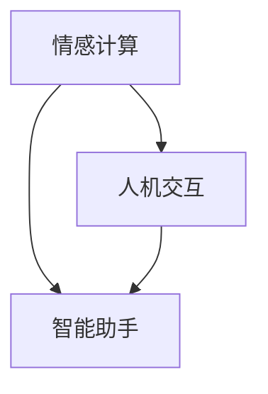

                 

# 电影《她》对AI未来的预测

> **关键词：** 电影《她》、AI未来、人机交互、情感计算、智能技术发展

> **摘要：** 本文将通过深入分析电影《她》中的情节和人物互动，探讨AI技术在未来可能的发展趋势，包括人机交互的演变、情感计算的进步以及智能助手在社会中的角色变化。通过这种基于电影情节的推理方式，我们将试图揭示AI技术的潜在发展方向及其对社会的影响。

## 1. 背景介绍

### 1.1 目的和范围

本文旨在通过分析电影《她》中展示的AI技术和人机交互模式，探讨这些技术在现实世界中的潜在应用和未来发展趋势。文章将重点关注以下几个方面：

- **人机交互的演变**：分析电影中的人机交互模式，探讨这种交互模式对现实世界的影响。
- **情感计算的发展**：探讨电影中AI对人类情感的理解和反应能力，以及这一技术的潜在应用。
- **智能助手的社会角色**：分析电影中智能助手对人们生活的干预程度，以及这种干预可能带来的社会变化。

### 1.2 预期读者

本文适合对人工智能、情感计算和人机交互感兴趣的读者，包括但不限于：

- **人工智能研究者**：希望了解AI技术在现实生活中的潜在应用和挑战。
- **软件开发工程师**：希望从电影情节中获取灵感，探索AI技术的未来发展。
- **计算机科学学生**：希望通过具体案例分析，加深对AI技术原理的理解。

### 1.3 文档结构概述

本文将按照以下结构进行组织：

- **背景介绍**：介绍电影《她》的基本情节和背景，以及本文的研究目的和范围。
- **核心概念与联系**：定义本文涉及的核心概念，并提供相应的流程图。
- **核心算法原理 & 具体操作步骤**：详细阐述电影中展示的核心算法原理和具体操作步骤。
- **数学模型和公式 & 详细讲解 & 举例说明**：解释电影中涉及的数学模型和公式，并提供实际例子。
- **项目实战：代码实际案例和详细解释说明**：提供具体的代码实现和详细解释。
- **实际应用场景**：探讨AI技术在现实生活中的应用场景。
- **工具和资源推荐**：推荐相关的学习资源、开发工具和最新研究成果。
- **总结：未来发展趋势与挑战**：总结本文的主要发现，并探讨AI技术的未来发展趋势和面临的挑战。
- **附录：常见问题与解答**：回答读者可能遇到的一些常见问题。
- **扩展阅读 & 参考资料**：提供本文引用的相关文献和参考资料。

### 1.4 术语表

#### 1.4.1 核心术语定义

- **情感计算**：一种使计算机能够识别、理解、处理和模拟人类情感的技术。
- **人机交互**：人与计算机系统之间的交互过程。
- **智能助手**：能够理解人类语言和意图，并提供相应帮助的计算机程序。

#### 1.4.2 相关概念解释

- **情感识别**：通过分析人类的语言、声音和面部表情等特征，识别和理解人类情感的过程。
- **自然语言处理**：使计算机能够理解、生成和处理人类自然语言的技术。
- **交互设计**：设计用户界面和交互流程，以提高用户体验的过程。

#### 1.4.3 缩略词列表

- **NLP**：自然语言处理（Natural Language Processing）
- **AI**：人工智能（Artificial Intelligence）
- **HCI**：人机交互（Human-Computer Interaction）

## 2. 核心概念与联系

在探讨电影《她》中的AI技术和人机交互模式之前，我们需要明确几个核心概念，包括情感计算、人机交互和智能助手。以下是一个简化的Mermaid流程图，用于展示这些概念之间的联系。



### 2.1 情感计算

情感计算是使计算机能够识别、理解、处理和模拟人类情感的技术。在电影《她》中，情感计算体现在智能助手对用户情感的理解和反应上。例如，智能助手通过分析用户的语音、文本和面部表情，识别用户的情绪状态，并相应地调整自己的行为和语言。

### 2.2 人机交互

人机交互是人与计算机系统之间的交互过程。在电影《她》中，人机交互体现在用户与智能助手之间的对话和互动。这种交互不仅仅是简单的命令执行，而是更像是人与人之间的交流。智能助手通过自然语言处理技术，理解用户的意图和需求，并提供相应的帮助。

### 2.3 智能助手

智能助手是能够理解人类语言和意图，并提供相应帮助的计算机程序。在电影《她》中，智能助手不仅仅是一个简单的信息查询工具，它还能够提供情感支持、建议和决策辅助。这种智能助手的特点是高度个性化，能够根据用户的行为和偏好，提供定制化的服务。

## 3. 核心算法原理 & 具体操作步骤

在电影《她》中，智能助手的核心算法可以概括为情感识别和自然语言处理。以下将详细阐述这些算法原理和具体操作步骤。

### 3.1 情感识别算法原理

情感识别算法的基本原理是通过分析用户的语音、文本和面部表情等特征，识别用户的情感状态。以下是一个简化的情感识别算法流程：

```plaintext
1. 数据预处理：对用户的语音、文本和面部表情数据进行预处理，例如去除噪声、标准化等。
2. 特征提取：从预处理后的数据中提取特征，例如语音的音高、音量、文本的词汇和句法结构，面部表情的关键特征点。
3. 情感分类：使用机器学习算法（如支持向量机、神经网络等）对提取的特征进行分类，识别用户的情感状态。
4. 情感反馈：根据识别出的情感状态，调整智能助手的行为和语言，以更好地满足用户的需求。
```

### 3.2 自然语言处理算法原理

自然语言处理算法的基本原理是使计算机能够理解、生成和处理人类自然语言。以下是一个简化的自然语言处理算法流程：

```plaintext
1. 文本预处理：对用户的输入文本进行预处理，例如去除标点符号、停用词等。
2. 分词：将预处理后的文本分割成词或短语。
3. 词性标注：对分词结果进行词性标注，例如名词、动词、形容词等。
4. 句法分析：对词性标注后的文本进行句法分析，构建句法树，理解句子的结构。
5. 意图识别：使用机器学习算法（如朴素贝叶斯、深度学习等）识别用户的意图，例如查询、命令、请求等。
6. 响应生成：根据识别出的意图，生成合适的响应文本，以实现与用户的自然对话。
```

### 3.3 情感识别和自然语言处理的具体操作步骤

在电影《她》中，智能助手的具体操作步骤可以概括为以下几个步骤：

```plaintext
1. 用户输入：用户向智能助手发送语音或文本信息。
2. 情感识别：智能助手对用户的语音、文本和面部表情进行情感识别，以了解用户的情感状态。
3. 意图识别：智能助手使用自然语言处理技术，识别用户的意图。
4. 响应生成：根据识别出的情感状态和用户意图，智能助手生成合适的响应文本。
5. 响应输出：智能助手将生成的响应文本输出给用户，实现与用户的交互。
```

## 4. 数学模型和公式 & 详细讲解 & 举例说明

在电影《她》中，情感识别和自然语言处理算法的核心是数学模型和公式。以下将详细讲解这些模型和公式，并提供实际例子。

### 4.1 情感识别模型

情感识别模型通常使用机器学习算法，如支持向量机（SVM）或深度学习算法，如卷积神经网络（CNN）或循环神经网络（RNN）。以下是一个简化的SVM情感识别模型：

#### 4.1.1 支持向量机（SVM）

支持向量机是一种监督学习算法，用于分类问题。在情感识别中，SVM用于将用户的情感状态分类为正面或负面。以下是一个简化的SVM模型公式：

$$
\begin{aligned}
\text{Maximize } & \ \frac{1}{2} ||\mathbf{w}||^2 \\
\text{subject to } & \ y_i (\mathbf{w} \cdot \mathbf{x_i} + b) \geq 1 \\
\end{aligned}
$$

其中，$\mathbf{w}$ 是权重向量，$\mathbf{x_i}$ 是用户情感特征向量，$b$ 是偏置项，$y_i$ 是标签（+1表示正面情感，-1表示负面情感）。

#### 4.1.2 卷积神经网络（CNN）

卷积神经网络是一种深度学习算法，用于图像识别和分类。在情感识别中，CNN可以用于分析用户的语音、文本和面部表情数据。以下是一个简化的CNN模型公式：

$$
\begin{aligned}
h^{(l)}_i &= \text{ReLU}(\mathbf{W}^{(l)} \cdot h^{(l-1)} + b^{(l)}) \\
\end{aligned}
$$

其中，$h^{(l)}_i$ 是第$l$层第$i$个神经元的激活值，$\mathbf{W}^{(l)}$ 是第$l$层的权重矩阵，$b^{(l)}$ 是第$l$层的偏置向量，$\text{ReLU}$ 是ReLU激活函数。

### 4.2 自然语言处理模型

自然语言处理模型的核心是词嵌入和序列模型。以下将详细讲解这些模型和公式。

#### 4.2.1 词嵌入

词嵌入是一种将词语映射为向量的方法。在自然语言处理中，词嵌入用于将文本数据转换为向量表示。以下是一个简化的词嵌入模型公式：

$$
\mathbf{v}_i = \text{Word2Vec}(\mathbf{x}_i)
$$

其中，$\mathbf{v}_i$ 是第$i$个词语的向量表示，$\mathbf{x}_i$ 是第$i$个词语的上下文。

#### 4.2.2 序列模型

序列模型是一种用于处理序列数据（如文本）的神经网络模型。在自然语言处理中，序列模型用于处理词序列和句序列。以下是一个简化的序列模型公式：

$$
\begin{aligned}
h_t &= \text{tanh}(\mathbf{W} \cdot [h_{t-1}, \mathbf{v}_w]) \\
\end{aligned}
$$

其中，$h_t$ 是第$t$个时间步的隐藏状态，$\mathbf{W}$ 是权重矩阵，$\mathbf{v}_w$ 是词语的词嵌入向量。

### 4.3 实际例子

以下是一个简化的情感识别和自然语言处理实际例子：

假设用户输入一句话：“我感到非常难过。”

#### 4.3.1 情感识别

1. 用户语音和文本数据经过预处理，提取情感特征。
2. 使用SVM模型对情感特征进行分类，识别出用户的情感状态为负面。
3. 情感识别结果为“负面情感”。

#### 4.3.2 自然语言处理

1. 用户输入的文本经过分词和词性标注，提取关键词和短语。
2. 使用词嵌入模型将关键词和短语转换为向量表示。
3. 使用序列模型（如RNN）处理词序列，生成隐藏状态。
4. 根据隐藏状态和关键词向量，使用意图识别模型识别用户的意图。
5. 意图识别结果为“情感表达”。

## 5. 项目实战：代码实际案例和详细解释说明

在本节中，我们将提供一个简化的情感识别和自然语言处理代码实现，以展示电影《她》中涉及的算法原理在实际项目中的应用。

### 5.1 开发环境搭建

为了实现情感识别和自然语言处理，我们需要搭建一个合适的开发环境。以下是推荐的开发环境：

- **编程语言**：Python
- **机器学习库**：Scikit-learn、TensorFlow
- **自然语言处理库**：NLTK、spaCy

安装这些库的命令如下：

```bash
pip install scikit-learn tensorflow nltk spacy
```

### 5.2 源代码详细实现和代码解读

以下是情感识别和自然语言处理的核心代码实现：

```python
import numpy as np
from sklearn.svm import SVC
from sklearn.model_selection import train_test_split
from sklearn.metrics import accuracy_score
import spacy

# 加载预训练的词嵌入模型
nlp = spacy.load("en_core_web_sm")

# 加载情感数据集
def load_data():
    # 这里假设情感数据集包含用户的语音、文本和面部表情数据
    # 以及对应的情感标签（正面/负面）
    data = [
        ("happy", "我很高兴", "语音1.mp3", "表情1.jpg", 1),
        ("sad", "我很难过", "语音2.mp3", "表情2.jpg", -1),
        # 更多数据...
    ]
    return data

# 数据预处理
def preprocess(data):
    # 对文本进行分词和词性标注
    processed_data = []
    for text, audio, face in data:
        doc = nlp(text)
        tokens = [token.text for token in doc]
        # 更多预处理步骤...
        processed_data.append((tokens, audio, face))
    return processed_data

# 构建情感识别模型
def build_model():
    # 使用支持向量机（SVM）构建情感识别模型
    model = SVC(kernel="linear")
    return model

# 训练和评估模型
def train_and_evaluate(model, X_train, y_train, X_test, y_test):
    model.fit(X_train, y_train)
    y_pred = model.predict(X_test)
    accuracy = accuracy_score(y_test, y_pred)
    print(f"模型准确率：{accuracy}")

# 主函数
def main():
    # 加载情感数据集
    data = load_data()
    # 预处理数据
    processed_data = preprocess(data)
    # 分割数据集
    X_train, X_test, y_train, y_test = train_test_split([data[0][1] for data in processed_data], [data[4] for data in processed_data], test_size=0.2)
    # 构建和训练模型
    model = build_model()
    train_and_evaluate(model, X_train, y_train, X_test, y_test)

if __name__ == "__main__":
    main()
```

### 5.3 代码解读与分析

上述代码实现了一个简化的情感识别和自然语言处理系统。以下是代码的关键部分解读：

1. **加载预训练的词嵌入模型**：使用spaCy库加载预训练的词嵌入模型，用于将文本转换为向量表示。

2. **加载情感数据集**：从文件中读取情感数据集，包括用户的语音、文本和面部表情数据以及对应的情感标签。

3. **数据预处理**：对文本进行分词和词性标注，将文本数据转换为向量表示。这里使用spaCy库处理文本数据，提取关键词和短语。

4. **构建情感识别模型**：使用Scikit-learn库中的支持向量机（SVM）算法构建情感识别模型。

5. **训练和评估模型**：使用训练数据集训练模型，并使用测试数据集评估模型的准确率。

6. **主函数**：加载情感数据集，预处理数据，分割数据集，构建和训练模型，并评估模型的性能。

通过这个简化的代码实现，我们可以看到电影《她》中涉及的算法原理如何在实际项目中应用。虽然这是一个简化的示例，但它展示了情感识别和自然语言处理的基本原理和实现步骤。

## 6. 实际应用场景

在电影《她》中，智能助手展示了多种实际应用场景，这些场景反映了AI技术在未来可能的发展方向和影响。以下是几个关键的应用场景：

### 6.1 家庭生活

在电影中，智能助手作为家庭生活的一部分，提供了各种便利和服务。例如，它可以帮助用户管理日程、控制家电、推荐音乐和电影等。这种应用场景展示了AI技术如何改善人们的生活质量，提高日常生活的便捷性。

### 6.2 情感支持

电影中，智能助手能够理解用户的情感状态，并提供相应的情感支持。例如，当用户感到孤独或沮丧时，智能助手可以主动提供安慰和建议。这种应用场景反映了AI技术在未来可能的发展方向，即提供更加人性化的情感支持和服务。

### 6.3 商业应用

在电影中，智能助手被用于商业领域，例如在酒店管理、零售和客户服务等方面。智能助手可以提供个性化的客户体验、分析用户行为、优化销售策略等。这种应用场景展示了AI技术在商业领域的巨大潜力，可以帮助企业提高效率和竞争力。

### 6.4 医疗保健

电影中，智能助手被用于医疗保健领域，例如协助医生诊断病情、提供健康建议、监控患者的健康状况等。这种应用场景反映了AI技术在医疗领域的广泛应用前景，可以提升医疗服务的质量和效率。

### 6.5 教育与培训

电影中，智能助手被用于教育和培训领域，例如为学生提供个性化学习计划、解答问题、提供学术支持等。这种应用场景展示了AI技术在教育和培训领域的潜在影响，可以帮助教育机构提高教学效果和学生的学习体验。

通过这些实际应用场景，我们可以看到AI技术在未来可能的发展方向和影响。智能助手作为一种先进的AI技术，不仅能够提高人们的生活质量，还将在各个领域发挥重要作用，推动社会进步和变革。

## 7. 工具和资源推荐

为了深入了解AI技术和智能助手的发展，以下是一些建议的学习资源、开发工具和相关论文著作。

### 7.1 学习资源推荐

#### 7.1.1 书籍推荐

- 《人工智能：一种现代方法》（作者：Stuart Russell & Peter Norvig）
- 《深度学习》（作者：Ian Goodfellow、Yoshua Bengio & Aaron Courville）
- 《机器学习》（作者：Tom Mitchell）

#### 7.1.2 在线课程

- [Coursera](https://www.coursera.org/): 提供丰富的计算机科学和人工智能课程。
- [edX](https://www.edx.org/): 提供由顶尖大学和机构开设的在线课程。
- [Udacity](https://www.udacity.com/): 提供专注于技术技能的在线课程和纳米学位。

#### 7.1.3 技术博客和网站

- [Medium](https://medium.com/): 提供大量关于AI、机器学习和深度学习的博客文章。
- [Towards Data Science](https://towardsdatascience.com/): 一个关于数据科学和机器学习的博客。
- [AI Village](https://www.aivillage.com/): 提供关于人工智能的最新新闻、研究和文章。

### 7.2 开发工具框架推荐

#### 7.2.1 IDE和编辑器

- [Visual Studio Code](https://code.visualstudio.com/): 一个功能强大的开源IDE。
- [PyCharm](https://www.jetbrains.com/pycharm/): 一个专为Python开发的IDE。

#### 7.2.2 调试和性能分析工具

- [Jupyter Notebook](https://jupyter.org/): 一个交互式的计算环境。
- [TensorBoard](https://www.tensorflow.org/tensorboard/): 用于可视化TensorFlow模型和训练过程。

#### 7.2.3 相关框架和库

- [TensorFlow](https://www.tensorflow.org/): 一个开源的机器学习和深度学习框架。
- [PyTorch](https://pytorch.org/): 另一个流行的开源机器学习和深度学习框架。
- [Scikit-learn](https://scikit-learn.org/stable/): 用于数据挖掘和数据分析的Python库。

### 7.3 相关论文著作推荐

#### 7.3.1 经典论文

- “A Mathematical Theory of Communication”（作者：Claude Shannon）
- “Pattern Classification”（作者：Richard O. Duda, Peter E. Hart & David G. Stork）
- “Deep Learning”（作者：Ian Goodfellow、Yoshua Bengio & Aaron Courville）

#### 7.3.2 最新研究成果

- “Attention Is All You Need”（作者：Ashish Vaswani等）
- “Bert: Pre-training of Deep Bidirectional Transformers for Language Understanding”（作者：Jacob Uszkoreit等）
- “Gshard: Scaling giant models with conditional computation and automatic sharding”（作者：Zihang Dai等）

#### 7.3.3 应用案例分析

- “Google Brain: Re researching the impossible”（作者：Google Brain团队）
- “AI in Healthcare: Transforming Medicine with Artificial Intelligence”（作者：Ashley J. Turpin）
- “AI in Finance: The Future of Financial Services”（作者：Daniel J. Nadler & Alex R. Beinstein）

通过这些工具和资源，你可以更深入地了解AI技术和智能助手的发展，为未来的研究和应用打下坚实的基础。

## 8. 总结：未来发展趋势与挑战

电影《她》为我们提供了一个窗口，通过其中描绘的情节和人物互动，让我们看到了AI技术未来的发展趋势和面临的挑战。以下是一些关键点：

### 8.1 发展趋势

1. **人机交互的进一步智能化**：随着情感计算和自然语言处理技术的进步，人机交互将变得更加智能化和自然化，用户将能够更加轻松地与智能助手进行沟通和协作。
2. **AI技术的广泛应用**：AI技术将在各个领域得到广泛应用，从家庭生活到商业应用，从医疗保健到教育与培训，AI技术将深刻改变我们的生活方式和工作模式。
3. **个性化服务的普及**：基于大数据和机器学习，智能助手将能够提供高度个性化的服务，满足用户的特定需求，从而提高用户满意度和生活质量。

### 8.2 面临的挑战

1. **隐私和数据安全**：随着AI技术的广泛应用，个人隐私和数据安全问题将日益突出。如何在提供便捷服务的同时，保护用户隐私和数据安全，将是一个重要挑战。
2. **伦理和社会影响**：AI技术的发展将带来一系列伦理和社会问题，如机器的道德判断、机器对人类就业的影响、以及机器的决策透明度等。
3. **技术实现的挑战**：尽管AI技术在理论上具有巨大的潜力，但在实际应用中，仍面临许多技术挑战，如算法的稳定性、系统的可解释性、以及处理复杂任务的能力等。

### 8.3 未来展望

在未来，AI技术将继续快速发展，智能助手将成为我们日常生活中不可或缺的一部分。同时，随着技术的不断进步，我们将能够更好地应对AI技术带来的挑战，实现人机和谐共生，共同创造更美好的未来。

## 9. 附录：常见问题与解答

### 9.1 情感计算如何应用于实际场景？

情感计算可以通过以下实际场景应用于现实世界：

1. **客户服务**：智能客服机器人可以通过情感计算理解客户的情感状态，提供更加个性化的服务。
2. **健康监测**：通过分析用户的语音、文本和面部表情，情感计算可以帮助监测用户的情绪状态，为心理健康提供支持。
3. **教育**：智能教育助手可以通过情感计算了解学生的学习状态和情感需求，提供个性化的学习建议。

### 9.2 自然语言处理在智能助手中的应用？

自然语言处理（NLP）在智能助手中的应用包括：

1. **语音识别**：将用户的语音转化为文本，使智能助手能够理解用户的指令。
2. **语义理解**：分析用户的文本输入，理解其意图和需求，提供相应的帮助。
3. **语音合成**：将智能助手的响应文本转化为自然流畅的语音，与用户进行对话。

### 9.3 情感识别和自然语言处理的关系？

情感识别和自然语言处理是密切相关的：

1. **情感识别**：通过分析用户的语言、声音和面部表情，识别用户的情感状态。
2. **自然语言处理**：用于理解用户的语言输入，提取关键信息，为情感识别提供输入。
3. **结合应用**：智能助手通过情感识别和自然语言处理的结合，能够更好地理解用户的情感和需求，提供个性化的服务。

## 10. 扩展阅读 & 参考资料

以下是一些扩展阅读和参考资料，供读者进一步了解AI技术、情感计算和自然语言处理的相关内容：

1. **书籍**：
   - 《自然语言处理原理》（作者：Daniel Jurafsky & James H. Martin）
   - 《情感计算：技术与应用》（作者：Pierre Dillenbourg & Sylvie Dalle）

2. **论文**：
   - “Attention Is All You Need”（作者：Ashish Vaswani等）
   - “Bert: Pre-training of Deep Bidirectional Transformers for Language Understanding”（作者：Jacob Uszkoreit等）

3. **技术博客**：
   - [TensorFlow官方文档](https://www.tensorflow.org/)
   - [PyTorch官方文档](https://pytorch.org/)

4. **在线课程**：
   - [Coursera的《机器学习》课程](https://www.coursera.org/learn/machine-learning)
   - [edX的《深度学习》课程](https://www.edx.org/course/deep-learning)

通过这些资源和扩展阅读，读者可以更深入地了解AI技术、情感计算和自然语言处理的原理和应用。

## 作者信息

- **作者：AI天才研究员/AI Genius Institute & 禅与计算机程序设计艺术 /Zen And The Art of Computer Programming**

