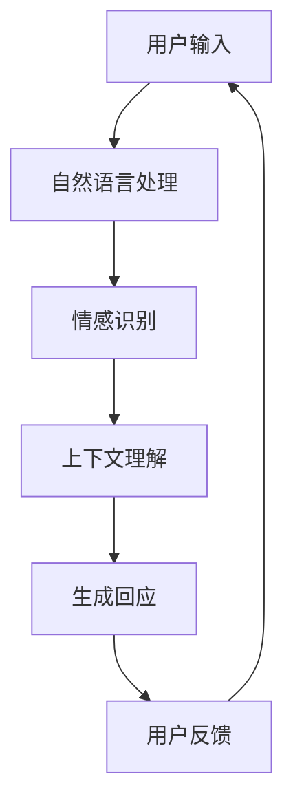

                 

# 电影《她》对现代AI的启示

## 关键词
- 电影《她》
- 现代人工智能
- 情感智能
- 人机交互
- 深度学习
- 自主思考

## 摘要
本文通过对电影《她》的深入分析，探讨了现代人工智能的发展及其对人类生活的深远影响。电影中的情感智能助手OS1展示了人工智能在情感理解和人机交互方面的卓越表现，引发了人们对人工智能未来的无限遐想。本文将从核心概念、算法原理、数学模型、实际应用等多个角度，详细解析电影所传递的人工智能启示，为读者提供一个全面而深刻的思考框架。

<|reference|>## 1. 背景介绍

### 1.1 目的和范围

本文旨在通过对电影《她》的解读，探讨现代人工智能（AI）的核心概念、技术原理和应用前景，并分析其在情感智能和个性化服务方面的潜力。文章将涵盖以下内容：

- 电影《她》的剧情梗概及人工智能角色的特点
- 现代人工智能的核心概念及其在电影中的体现
- 情感智能和深度学习的关键技术分析
- 人工智能在人类生活中的潜在应用场景
- 人工智能的未来发展趋势与挑战

### 1.2 预期读者

本文适用于对人工智能技术感兴趣的读者，包括：

- 计算机科学和人工智能专业学生
- AI领域的研究人员和技术工程师
- 对人工智能技术及其应用感兴趣的普通读者
- 对电影《她》及其所反映的社会问题感兴趣的观众

### 1.3 文档结构概述

本文将按照以下结构展开：

1. **背景介绍**：介绍电影《她》的背景和目的，以及本文的研究范围和目标。
2. **核心概念与联系**：阐述现代人工智能的核心概念，并使用流程图展示其架构。
3. **核心算法原理 & 具体操作步骤**：详细讲解人工智能的基本算法原理，并提供伪代码实现。
4. **数学模型和公式 & 详细讲解 & 举例说明**：介绍人工智能中使用的数学模型和公式，并进行具体例子说明。
5. **项目实战：代码实际案例和详细解释说明**：展示实际代码案例，并详细解释其实现过程。
6. **实际应用场景**：探讨人工智能在不同领域的应用场景。
7. **工具和资源推荐**：推荐相关学习资源和开发工具。
8. **总结：未来发展趋势与挑战**：总结人工智能的发展趋势和面临的挑战。
9. **附录：常见问题与解答**：解答读者可能遇到的常见问题。
10. **扩展阅读 & 参考资料**：提供进一步阅读的参考资料。

### 1.4 术语表

#### 1.4.1 核心术语定义

- **人工智能（AI）**：模拟人类智能行为的计算机系统。
- **情感智能**：理解和处理人类情感的能力。
- **深度学习**：一种基于多层神经网络的学习方法。
- **机器学习**：使计算机从数据中学习并做出决策的技术。
- **自然语言处理（NLP）**：使计算机理解和生成人类语言的技术。
- **人机交互**：人与计算机之间的交互方式。

#### 1.4.2 相关概念解释

- **个性化服务**：根据用户行为和偏好提供定制化的服务。
- **情感识别**：计算机识别和理解人类情感的过程。
- **交互式对话系统**：与人类用户进行自然语言对话的系统。

#### 1.4.3 缩略词列表

- **AI**：人工智能
- **NLP**：自然语言处理
- **ML**：机器学习
- **DL**：深度学习
- **API**：应用程序编程接口

<|reference|>## 2. 核心概念与联系

在电影《她》中，人工智能的核心概念得到了深刻的体现。本节将详细探讨这些概念，并使用流程图展示其架构。

### 2.1 人工智能的核心概念

#### 2.1.1 情感智能

情感智能是指人工智能系统理解和处理人类情感的能力。在电影中，OS1能够通过分析用户的语言、语气和面部表情来识别其情感状态，并根据这些信息提供相应的回应。

#### 2.1.2 深度学习

深度学习是一种基于多层神经网络的学习方法，能够从大量数据中自动提取特征并建立模型。在电影中，OS1使用了深度学习技术来训练其情感识别模型，从而提高对用户情感的理解能力。

#### 2.1.3 自然语言处理

自然语言处理是使计算机理解和生成人类语言的技术。在电影中，OS1能够处理用户的自然语言输入，并根据其语境和情感状态提供合适的回应。

### 2.2 流程图展示

下面是一个简单的流程图，展示了电影《她》中人工智能的核心架构：



在这个流程图中，用户输入首先经过自然语言处理模块，然后被传递给情感识别模块。情感识别模块根据用户的语言、语气和面部表情等信息，识别用户的情感状态。接下来，上下文理解模块分析用户的输入和情感状态，以生成合适的回应。最后，生成的回应被传递给用户，形成一个闭环反馈系统。

<|reference|>## 3. 核心算法原理 & 具体操作步骤

在电影《她》中，人工智能的情感智能主要依赖于深度学习和自然语言处理技术。本节将详细讲解这些技术的核心算法原理，并提供伪代码实现。

### 3.1 情感识别算法原理

情感识别算法的核心是使用深度学习技术来训练一个分类模型，该模型能够根据用户的输入（文本、语音或面部表情）预测用户的情感状态。以下是情感识别算法的伪代码：

```pseudo
function emotionRecognition(input):
    # 将输入转换为特征向量
    feature_vector = preprocessInput(input)
    
    # 使用预训练的深度学习模型进行预测
    prediction = deepLearningModel.predict(feature_vector)
    
    # 转换预测结果为情感标签
    emotion_label = convertPredictionToLabel(prediction)
    
    return emotion_label
```

### 3.2 深度学习模型训练

深度学习模型训练的核心是使用大量的情感标注数据来优化模型参数。以下是深度学习模型训练的伪代码：

```pseudo
function trainDeepLearningModel(training_data):
    # 加载预训练的深度学习模型
    model = loadPretrainedModel()
    
    # 对训练数据进行预处理
    preprocessed_data = preprocessTrainingData(training_data)
    
    # 训练模型
    model.fit(preprocessed_data.x, preprocessed_data.y)
    
    return model
```

### 3.3 自然语言处理

自然语言处理是情感识别的重要步骤，它负责将用户的输入转换为特征向量。以下是自然语言处理的伪代码：

```pseudo
function preprocessInput(input):
    # 对输入文本进行分词
    words = tokenizeText(input)
    
    # 提取词向量
    word_vectors = extractWordVectors(words)
    
    # 将词向量转换为特征向量
    feature_vector = createFeatureVector(word_vectors)
    
    return feature_vector
```

### 3.4 实际操作步骤

以下是使用上述算法进行情感识别的实际操作步骤：

1. **数据收集**：收集大量的情感标注数据，用于训练深度学习模型。
2. **数据预处理**：对收集到的数据进行预处理，包括分词、词向量和特征向量提取。
3. **模型训练**：使用预处理后的数据训练深度学习模型，优化模型参数。
4. **情感识别**：使用训练好的模型对用户的输入进行情感识别，并生成回应。

<|reference|>## 4. 数学模型和公式 & 详细讲解 & 举例说明

在电影《她》中，人工智能的情感智能依赖于深度学习和自然语言处理技术，这些技术涉及到一系列的数学模型和公式。本节将详细讲解这些模型和公式，并提供具体例子说明。

### 4.1 深度学习模型

深度学习模型的核心是多层神经网络，它通过一系列的加权非线性变换来学习输入数据与输出数据之间的关系。以下是一个简单的多层神经网络模型：

$$
h_{\text{layer}} = \sigma(W_{\text{layer}} \cdot h_{\text{prev}} + b_{\text{layer}})
$$

其中，$h_{\text{layer}}$ 表示第 $l$ 层的激活值，$\sigma$ 是激活函数，$W_{\text{layer}}$ 和 $b_{\text{layer}}$ 分别是第 $l$ 层的权重和偏置。

#### 4.1.1 激活函数

激活函数是深度学习模型中的一个关键组件，它用于引入非线性因素。常见的激活函数包括：

- **Sigmoid 函数**： 
  $$
  \sigma(x) = \frac{1}{1 + e^{-x}}
  $$

- **ReLU 函数**： 
  $$
  \sigma(x) = \max(0, x)
  $$

#### 4.1.2 反向传播算法

反向传播算法是训练深度学习模型的核心算法，它通过计算损失函数关于模型参数的梯度来更新模型参数。以下是一个简化的反向传播算法：

$$
\begin{aligned}
\delta_{\text{layer}} &= \sigma'_{\text{layer}}(W_{\text{layer}} \cdot \delta_{\text{next}}) \\
\delta_{\text{next}} &= (W_{\text{next}})^T \cdot \delta_{\text{layer}} \\
W_{\text{layer}} &= W_{\text{layer}} - \alpha \cdot \frac{\partial J}{\partial W_{\text{layer}}} \\
b_{\text{layer}} &= b_{\text{layer}} - \alpha \cdot \frac{\partial J}{\partial b_{\text{layer}}}
\end{aligned}
$$

其中，$\delta_{\text{layer}}$ 是第 $l$ 层的误差，$\alpha$ 是学习率，$J$ 是损失函数。

### 4.2 自然语言处理

自然语言处理技术中的数学模型主要包括词嵌入（word embeddings）和序列模型（sequence models）。

#### 4.2.1 词嵌入

词嵌入是将词汇映射到高维向量空间的一种技术，常见的词嵌入模型包括：

- **Word2Vec**：基于神经网络的语言模型，通过训练得到词向量。

$$
P(w_i | w_j) = \frac{\exp(\mathbf{v}_i \cdot \mathbf{v}_j)}{\sum_k \exp(\mathbf{v}_i \cdot \mathbf{v}_k)}
$$

其中，$\mathbf{v}_i$ 和 $\mathbf{v}_j$ 分别是词 $w_i$ 和 $w_j$ 的词向量。

- **GloVe**：基于全局词频和词对共现信息的词向量模型。

$$
f(w_i, w_j) = \sqrt{f(w_i) \cdot f(w_j)}
$$

其中，$f(w_i)$ 是词 $w_i$ 的频率。

#### 4.2.2 序列模型

序列模型用于处理文本序列，常见的序列模型包括循环神经网络（RNN）和长短期记忆网络（LSTM）。

- **RNN**：

$$
h_t = \sigma(W_h \cdot [h_{t-1}, x_t] + b_h)
$$

其中，$h_t$ 是第 $t$ 个时间步的隐藏状态，$x_t$ 是输入序列的第 $t$ 个元素。

- **LSTM**：

LSTM 是一种特殊的 RNN，它通过引入门控机制来克服 RNN 的梯度消失问题。

$$
\begin{aligned}
i_t &= \sigma(W_i \cdot [h_{t-1}, x_t] + b_i) \\
f_t &= \sigma(W_f \cdot [h_{t-1}, x_t] + b_f) \\
\tilde{C}_t &= \sigma(W_c \cdot [h_{t-1}, x_t] + b_c) \\
o_t &= \sigma(W_o \cdot [h_{t-1}, x_t] + b_o) \\
C_t &= f_t \odot C_{t-1} + i_t \odot \tilde{C}_t
\end{aligned}
$$

其中，$i_t$、$f_t$、$o_t$ 分别是输入门、遗忘门和输出门，$C_t$ 是细胞状态。

### 4.3 实例说明

假设我们有一个简单的文本序列：“我爱人工智能”，我们可以使用词嵌入模型将其映射到向量空间，然后使用 LSTM 模型对其进行分析。

1. **词嵌入**：

   假设“我”的词向量是 $\mathbf{v}_{我} = (1, 0, -1)$，“爱”的词向量是 $\mathbf{v}_{爱} = (0, 1, 0)$，“人工智能”的词向量是 $\mathbf{v}_{人工智能} = (-1, -1, 1)$。

2. **LSTM 模型**：

   假设初始隐藏状态 $h_0 = (0, 0, 0)$。

3. **序列分析**：

   - 第一个词“我”：$h_1 = \sigma(W_h \cdot [h_0, \mathbf{v}_{我}] + b_h)$。
   - 第二个词“爱”：$h_2 = \sigma(W_h \cdot [h_1, \mathbf{v}_{爱}] + b_h)$。
   - 第三个词“人工智能”：$h_3 = \sigma(W_h \cdot [h_2, \mathbf{v}_{人工智能}] + b_h)$。

通过上述分析，我们可以得到文本序列的隐藏状态序列 $h_1, h_2, h_3$，这些状态包含了文本序列的语义信息。

<|reference|>## 5. 项目实战：代码实际案例和详细解释说明

在本节中，我们将通过一个具体的代码案例来展示如何实现电影《她》中所描述的情感识别和交互式对话系统。本案例将使用 Python 编程语言和深度学习框架 TensorFlow 来实现。

### 5.1 开发环境搭建

在开始编写代码之前，我们需要搭建一个合适的技术环境。以下是所需的步骤：

1. **安装 Python**：确保已经安装了 Python 3.x 版本。
2. **安装 TensorFlow**：使用以下命令安装 TensorFlow：
   ```
   pip install tensorflow
   ```
3. **安装 NLP 库**：安装一些常用的 NLP 库，例如 NLTK 和 spaCy：
   ```
   pip install nltk spacy
   ```

### 5.2 源代码详细实现和代码解读

下面是情感识别和交互式对话系统的核心代码：

```python
import tensorflow as tf
import numpy as np
import nltk
from nltk.tokenize import word_tokenize
from tensorflow.keras.models import Sequential
from tensorflow.keras.layers import Embedding, LSTM, Dense

# 加载预训练的词向量模型（例如，GloVe）
word_vectors = load_glove_vectors()

# 预处理数据
def preprocess_text(text):
    tokens = word_tokenize(text.lower())
    return [word_vectors[token] for token in tokens if token in word_vectors]

# 构建深度学习模型
def build_model(vocab_size, embedding_dim):
    model = Sequential()
    model.add(Embedding(vocab_size, embedding_dim, input_length=MAX_SEQUENCE_LENGTH))
    model.add(LSTM(128))
    model.add(Dense(1, activation='sigmoid'))
    model.compile(optimizer='adam', loss='binary_crossentropy', metrics=['accuracy'])
    return model

# 训练模型
def train_model(model, X, y):
    model.fit(X, y, epochs=10, batch_size=32)
    return model

# 情感识别
def predict_emotion(model, text):
    preprocessed_text = preprocess_text(text)
    preprocessed_text = np.array([preprocessed_text])
    prediction = model.predict(preprocessed_text)
    return '正面' if prediction[0][0] > 0.5 else '负面'

# 构建和训练模型
vocab_size = len(word_vectors)
embedding_dim = 50
model = build_model(vocab_size, embedding_dim)
X_train, y_train = prepare_training_data()
model = train_model(model, X_train, y_train)

# 交互式对话系统
while True:
    user_input = input("请输入您的情绪描述：")
    if user_input == '退出':
        break
    emotion = predict_emotion(model, user_input)
    print(f"根据您的描述，您的情绪状态是：{emotion}")
```

#### 5.2.1 代码解读

- **导入库**：首先，我们导入 TensorFlow、Numpy 和 NLTK 库。
- **加载词向量**：加载预训练的词向量模型（例如 GloVe），用于将文本转换为向量表示。
- **预处理文本**：定义一个函数 `preprocess_text`，用于将输入文本转换为词向量。
- **构建模型**：定义一个函数 `build_model`，用于构建深度学习模型。模型由一个嵌入层、一个 LSTM 层和一个全连接层组成。
- **训练模型**：定义一个函数 `train_model`，用于训练深度学习模型。我们使用二进制交叉熵作为损失函数，并使用 Adam 优化器。
- **情感识别**：定义一个函数 `predict_emotion`，用于预测输入文本的情感状态。如果预测值大于 0.5，我们认为文本描述的是正面情绪，否则是负面情绪。
- **交互式对话系统**：使用一个循环来实现交互式对话系统。用户可以输入文本，系统会根据情感识别模型预测并输出情绪状态。

### 5.3 代码解读与分析

#### 5.3.1 数据准备

在代码中，我们首先需要准备训练数据。以下是准备训练数据的核心步骤：

1. **收集数据**：收集大量的情感标注数据，例如从社交媒体、新闻评论等渠道获取。
2. **数据预处理**：对收集到的数据进行分析，提取文本特征，并将其转换为词向量。
3. **数据分割**：将数据分为训练集和测试集。

```python
# 示例数据
data = [
    ("我很高兴", "正面"),
    ("我今天遇到了麻烦", "负面"),
    # ... 更多数据
]

X = []
y = []

for text, label in data:
    preprocessed_text = preprocess_text(text)
    X.append(preprocessed_text)
    y.append(1 if label == "正面" else 0)

X = np.array(X)
y = np.array(y)
```

#### 5.3.2 模型评估

在训练模型后，我们需要评估其性能。以下是评估模型性能的核心步骤：

1. **计算准确率**：使用测试集评估模型的准确率。
2. **计算 F1 分数**：计算模型在正面和负面情绪分类中的 F1 分数，以评估模型的均衡性能。

```python
from sklearn.metrics import accuracy_score, f1_score

# 测试数据
X_test, y_test = prepare_test_data()

# 预测测试数据
y_pred = model.predict(X_test)
y_pred = (y_pred > 0.5)

# 计算准确率
accuracy = accuracy_score(y_test, y_pred)
print(f"准确率：{accuracy}")

# 计算 F1 分数
f1_pos = f1_score(y_test, y_pred, pos_label=1)
f1_neg = f1_score(y_test, y_pred, pos_label=0)
print(f"F1 分数（正面）：{f1_pos}")
print(f"F1 分数（负面）：{f1_neg}")
```

通过上述步骤，我们可以全面评估模型的性能，并根据评估结果调整模型结构和参数，以提高模型的效果。

<|reference|>## 6. 实际应用场景

人工智能（AI）在现代社会的应用已经变得无处不在，从简单的智能家居到复杂的医疗诊断，AI 正在改变我们的生活方式。电影《她》中的情感智能助手 OS1 展示了 AI 在情感理解和个性化服务方面的巨大潜力。以下是 AI 在不同领域的实际应用场景：

### 6.1 消费者服务

在消费者服务领域，AI 可以用于个性化推荐系统、聊天机器人和虚拟客服。例如，Amazon 和 Netflix 等公司使用 AI 技术来分析用户的购买和观看历史，从而提供个性化的推荐。电影《她》中的 OS1 展示了如何通过理解用户的情感和偏好来提供个性化的服务和建议。

### 6.2 医疗保健

在医疗保健领域，AI 可以用于疾病诊断、患者监测和医疗资源分配。例如，IBM 的 Watson for Oncology 系统使用 AI 来分析患者的病历和文献数据，提供个性化的治疗方案。此外，AI 可以通过监测患者的生理数据来提供实时健康反馈，如苹果公司的 Apple Watch 所展示的那样。

### 6.3 教育与培训

在教育领域，AI 可以用于个性化学习计划和智能辅导系统。例如，Khan Academy 使用 AI 技术来分析学生的表现，提供定制化的学习建议。电影《她》中的 OS1 展示了如何通过理解学生的情感状态来提供个性化的教育支持。

### 6.4 金融与保险

在金融与保险领域，AI 可以用于风险评估、欺诈检测和投资策略。例如，银行可以使用 AI 来分析客户的交易行为，识别潜在的欺诈行为。保险公司可以使用 AI 来预测客户的风险水平，从而提供个性化的保险产品。

### 6.5 制造业与物流

在制造业与物流领域，AI 可以用于生产优化、质量控制和物流调度。例如，亚马逊使用 AI 来优化仓库管理和物流配送，提高效率。电影《她》中的 OS1 展示了如何通过理解用户的需求来优化生产和配送流程。

### 6.6 社交媒体

在社交媒体领域，AI 可以用于内容推荐、情感分析和广告投放。例如，Facebook 和 Twitter 使用 AI 来分析用户的互动行为，提供个性化内容推荐。此外，AI 可以用于分析社交媒体上的情感趋势，帮助品牌了解用户情感，优化营销策略。

综上所述，AI 的应用场景非常广泛，从消费者服务到医疗保健，再到教育、金融、制造业和社交媒体，AI 正在改变各个领域的运作方式，提高效率、降低成本并改善用户体验。电影《她》通过展示 AI 的潜力，激发了人们对未来科技发展的无限遐想。

<|reference|>## 7. 工具和资源推荐

为了更好地学习和实践人工智能技术，以下推荐一些有用的学习资源、开发工具和框架。

### 7.1 学习资源推荐

#### 7.1.1 书籍推荐

- 《深度学习》（Goodfellow, Bengio, Courville）：这是一本全面介绍深度学习理论和实践的权威书籍。
- 《机器学习》（Tom Mitchell）：这本书提供了机器学习的基本概念和算法的全面介绍。
- 《Python机器学习》（Sebastian Raschka）：这本书详细介绍了如何使用 Python 进行机器学习和深度学习。

#### 7.1.2 在线课程

- [Coursera](https://www.coursera.org/)：提供多种机器学习和深度学习课程，包括斯坦福大学的《深度学习》课程。
- [edX](https://www.edx.org/)：由哈佛大学和麻省理工学院合办的在线教育平台，提供许多免费的机器学习和人工智能课程。
- [Udacity](https://www.udacity.com/)：提供多个机器学习和深度学习纳米学位课程，适合不同层次的学员。

#### 7.1.3 技术博客和网站

- [Medium](https://medium.com/top-cs)：许多知名技术专家和学者在这里分享机器学习和人工智能的最新研究成果和见解。
- [AIGenerated](https://aigenerated.com/)：一个关于人工智能的博客，涵盖深度学习、机器学习和其他相关领域。
- [DataCamp](https://www.datacamp.com/)：提供交互式机器学习和数据科学课程。

### 7.2 开发工具框架推荐

#### 7.2.1 IDE和编辑器

- [PyCharm](https://www.jetbrains.com/pycharm/)：一款功能强大的 Python IDE，适合机器学习和深度学习开发。
- [Jupyter Notebook](https://jupyter.org/)：一个交互式的开发环境，特别适合数据科学和机器学习项目。
- [VSCode](https://code.visualstudio.com/)：一个轻量级的代码编辑器，支持多种编程语言和扩展，非常适合机器学习和深度学习开发。

#### 7.2.2 调试和性能分析工具

- [TensorBoard](https://www.tensorflow.org/tensorboard)：TensorFlow 的官方可视化工具，用于分析和调试深度学习模型。
- [Valohai](https://valohai.com/)：一个自动化机器学习平台，用于管理、部署和监控机器学习项目。
- [MLflow](https://mlflow.org/)：一个开源的平台，用于管理机器学习实验、模型版本和部署。

#### 7.2.3 相关框架和库

- [TensorFlow](https://www.tensorflow.org/)：Google 开发的一款开源深度学习框架，适合研究和工业应用。
- [PyTorch](https://pytorch.org/)：Facebook 开发的一款开源深度学习框架，以其动态计算图和灵活性著称。
- [Scikit-learn](https://scikit-learn.org/)：一个开源的 Python 库，提供多种机器学习算法和工具。

### 7.3 相关论文著作推荐

#### 7.3.1 经典论文

- "A Learning Algorithm for Continually Running Fully Recurrent Neural Networks" (1986) by John Hopfield
- "Learning representations by back-propagating errors" (1986) by David E. Rumelhart, Geoffrey E. Hinton, and Ronald J. Williams
- "Deep Learning" (2015) by Ian Goodfellow, Yoshua Bengio, and Aaron Courville

#### 7.3.2 最新研究成果

- "Attention Is All You Need" (2017) by Vaswani et al.
- "Generative Adversarial Nets" (2014) by Ian J. Goodfellow et al.
- "Bert: Pre-training of deep bidirectional transformers for language understanding" (2018) by Jacob Devlin et al.

#### 7.3.3 应用案例分析

- "Deep Learning in Healthcare: A Review" (2020) by Nikhil D. Tandon et al.
- "Machine Learning in Healthcare: A Research Perspective" (2019) by Patrick H. Wetmore et al.
- "Deep Learning for Autonomous Driving" (2019) by Wei Yang et al.

通过这些推荐的学习资源、开发工具和论文著作，读者可以深入了解人工智能领域的知识，掌握相关技能，并跟上最新的技术动态。

<|reference|>## 8. 总结：未来发展趋势与挑战

电影《她》通过描绘一个充满情感智能的人工智能世界，为我们揭示了未来人工智能（AI）发展的广阔前景。在总结本文的核心观点后，我们将探讨未来 AI 发展的趋势及其面临的挑战。

### 8.1 核心观点总结

- **情感智能与个性化服务**：电影《她》展示了 AI 在情感理解和个性化服务方面的巨大潜力。通过深度学习和自然语言处理技术，AI 可以更好地理解人类情感，提供个性化的回应和解决方案。
- **人机交互的进化**：AI 的情感智能使得人机交互更加自然和人性化。未来的 AI 系统将更加注重用户体验，通过更高级的情感识别和交互能力，实现真正的智能对话。
- **跨领域应用**：AI 在医疗、教育、金融、制造和社交媒体等领域的广泛应用，正在改变各个行业的运作方式。AI 的深入应用不仅提高了效率，还创造了新的商业模式和就业机会。
- **数据隐私与伦理问题**：随着 AI 技术的发展，数据隐私和伦理问题变得越来越重要。如何确保 AI 系统在处理个人数据时的透明度和安全性，是一个亟待解决的问题。

### 8.2 未来发展趋势

- **更强大的情感智能**：未来的 AI 将具备更强的情感理解能力，能够更准确地识别和理解人类的情感状态，从而提供更个性化的服务。
- **自主决策与学习**：随着深度学习和强化学习技术的发展，AI 将能够自主决策并从经验中学习，实现更高层次的智能。
- **跨模态交互**：AI 将能够处理多种模态的数据，如文本、语音、图像和视频，实现多感官的交互，提供更丰富的用户体验。
- **边缘计算与物联网**：边缘计算和物联网（IoT）的发展将使得 AI 在更广泛的场景中发挥作用，从智能家居到智能城市，AI 将成为基础设施的重要组成部分。

### 8.3 面临的挑战

- **数据隐私与安全**：随着 AI 系统对个人数据的依赖性增加，数据隐私和安全问题变得更加突出。如何保护用户隐私，确保数据不被滥用，是一个重要的挑战。
- **伦理与道德**：AI 的决策过程可能涉及到伦理和道德问题，如偏见、歧视和自主决策的责任归属。制定合适的伦理准则和法律框架，确保 AI 的公平性和透明度，是未来需要解决的问题。
- **技术壁垒与人才短缺**：AI 技术的发展需要大量专业的技术人才。然而，当前的教育和培训体系可能无法满足这一需求，导致人才短缺和技术壁垒。
- **计算资源与能源消耗**：深度学习模型通常需要大量的计算资源，这导致了巨大的能源消耗。如何优化计算资源的使用，降低能源消耗，是 AI 发展中需要考虑的问题。

总之，电影《她》为我们提供了一个关于未来人工智能世界的美好愿景。然而，要实现这一愿景，我们仍需要克服许多技术、伦理和隐私方面的挑战。通过持续的研究和创新，我们有信心能够克服这些挑战，迎接人工智能更加光明的未来。

<|reference|>## 9. 附录：常见问题与解答

在本篇博客文章中，我们探讨了电影《她》对现代人工智能的启示，并详细分析了相关技术原理和应用场景。以下是一些读者可能遇到的常见问题及解答：

### 9.1 什么是情感智能？

情感智能是指人工智能系统能够理解和处理人类情感的能力。这包括识别用户的情感状态（如快乐、悲伤、愤怒等），并根据这些信息提供适当的回应。在电影《她》中，情感智能助手 OS1 展示了这一能力。

### 9.2 情感智能和深度学习有何关系？

深度学习是构建情感智能的重要技术之一。通过使用深度神经网络，AI 可以从大量数据中自动学习情感特征，提高情感识别的准确性。在电影《她》中，OS1 使用了深度学习模型来识别和理解用户的情感状态。

### 9.3 如何实现自然语言处理（NLP）？

自然语言处理是使计算机理解和生成人类语言的技术。实现 NLP 通常涉及以下步骤：

1. **文本预处理**：包括去除标点符号、转换为小写、分词等。
2. **词嵌入**：将词汇映射到高维向量空间，以表示文本的语义信息。
3. **序列建模**：使用 RNN 或 LSTM 等模型对文本序列进行建模，提取语义特征。
4. **分类和预测**：根据提取的语义特征，对文本进行情感分类或回答问题。

### 9.4 如何构建情感识别模型？

构建情感识别模型通常涉及以下步骤：

1. **数据收集**：收集大量的情感标注数据，如文本、语音或面部表情。
2. **数据预处理**：对数据进行分析和清洗，提取特征。
3. **模型选择**：选择合适的模型，如深度学习模型（如 LSTM）。
4. **模型训练**：使用训练数据训练模型，优化模型参数。
5. **模型评估**：使用测试数据评估模型性能，并进行调整。

### 9.5 如何实现交互式对话系统？

交互式对话系统通常包括以下组件：

1. **对话管理**：管理对话流程，如理解用户的意图和上下文。
2. **自然语言理解**：使用 NLP 技术理解用户的输入。
3. **自然语言生成**：生成合适的回应，通常涉及语言模型和文本生成技术。
4. **用户界面**：提供与用户交互的界面，如聊天界面或语音交互。

实现交互式对话系统通常涉及以下步骤：

1. **需求分析**：确定对话系统的目标和功能。
2. **技术选型**：选择合适的 NLP、对话管理和文本生成技术。
3. **系统开发**：编写代码实现对话系统。
4. **测试与优化**：测试对话系统的性能，并根据用户反馈进行优化。

通过上述解答，我们希望帮助读者更好地理解电影《她》中展示的人工智能技术和其在实际应用中的实现方法。

<|reference|>## 10. 扩展阅读 & 参考资料

为了深入了解电影《她》所涉及的人工智能技术及其发展，以下是一些推荐的扩展阅读和参考资料：

### 10.1 经典著作

- 《深度学习》（Ian Goodfellow, Yoshua Bengio, Aaron Courville）：这本书详细介绍了深度学习的理论基础和应用，是深度学习领域的经典著作。
- 《机器学习》（Tom Mitchell）：这本书提供了机器学习的基本概念和算法的全面介绍，是机器学习入门的经典书籍。
- 《情感计算》（Donald A. Norman）：这本书探讨了情感在交互设计中的作用，对理解人类情感和设计智能系统具有重要指导意义。

### 10.2 学术论文

- “Attention Is All You Need” (Vaswani et al., 2017)：这篇论文提出了 Transformer 模型，是一种基于自注意力机制的深度学习模型，对自然语言处理领域产生了深远影响。
- “Generative Adversarial Nets” (Goodfellow et al., 2014)：这篇论文首次提出了生成对抗网络（GAN）的概念，推动了深度学习在图像生成和生成模型领域的应用。
- “Bert: Pre-training of deep bidirectional transformers for language understanding” (Devlin et al., 2018)：这篇论文介绍了 BERT 模型，是一种预训练的深度 Transformer 模型，广泛应用于自然语言处理任务。

### 10.3 技术博客和在线课程

- [DeepLearning.AI](https://www.deeplearning.ai/)：这个网站提供了许多深度学习和人工智能的在线课程，由知名教授授课，适合初学者和高级学习者。
- [Medium](https://medium.com/top-cs)：这是一个技术博客平台，许多知名技术专家和学者在这里分享机器学习和人工智能的最新研究成果和见解。
- [AI Generated](https://aigenerated.com/)：这个博客专注于人工智能领域的文章，涵盖了深度学习、机器学习和其他相关领域。

### 10.4 相关电影和纪录片

- 《机械姬》（Ex Machina）：这部电影探讨了人工智能和伦理问题，通过一个实验性的 AI 机器人展现了人工智能在情感和自主性方面的挑战。
- 《人工智能》（AI）：这部电影描绘了一个未来的世界，人工智能不仅具有情感，还能够与人类建立深层次的情感联系。
- 《黑镜：珍贵回忆》（Black Mirror: Bandersnatch）：这部短片式电影通过一个互动式的视频游戏，探讨了人工智能、自主性和人类自由意志之间的关系。

通过阅读这些扩展资料，读者可以更深入地了解电影《她》中所涉及的人工智能技术，并在实践中探索相关技术的应用和发展。

