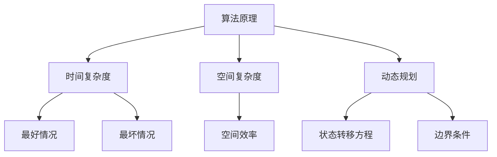

                 

# 百度2024届社招面试高频算法题解析

> **关键词：** 社招面试、高频算法、算法解析、面试准备、编程挑战

> **摘要：** 本文将深入探讨百度2024届社招面试中的高频算法题，通过详细的解析和实例代码，帮助准备面试的读者更好地理解和掌握这些算法题的解题思路和技巧。文章将涵盖算法原理、数学模型、实战项目以及相关学习资源推荐，旨在为读者提供一个全面的学习指南。

## 1. 背景介绍

### 1.1 目的和范围

本文的目标是为准备参加百度2024届社招面试的读者提供一个详细的算法题解析指南。我们将从以下几个方面展开讨论：

- **高频算法题汇总**：总结和分析百度社招面试中常见的高频算法题。
- **解题思路和技巧**：提供解题思路和步骤，帮助读者快速理解和掌握算法题。
- **实例代码和解析**：通过实例代码展示算法的实现过程，并进行详细解析。
- **实战项目和案例分析**：结合实际项目案例，深化对算法题的理解和应用。
- **学习资源推荐**：推荐相关书籍、课程和博客，帮助读者进一步深入学习。

### 1.2 预期读者

本文适合以下读者群体：

- 准备参加百度社招面试的程序员和软件工程师。
- 对算法和数据结构有浓厚兴趣的计算机科学学生。
- 想要提高编程能力和面试技巧的技术爱好者。

### 1.3 文档结构概述

本文将按照以下结构展开：

1. **背景介绍**：介绍本文的目的、预期读者和文档结构。
2. **核心概念与联系**：介绍核心概念和算法原理，并使用Mermaid流程图进行说明。
3. **核心算法原理 & 具体操作步骤**：详细讲解算法原理，使用伪代码进行操作步骤阐述。
4. **数学模型和公式 & 详细讲解 & 举例说明**：介绍数学模型和公式，并进行详细讲解和举例。
5. **项目实战：代码实际案例和详细解释说明**：结合实际项目案例，展示代码实现和详细解释。
6. **实际应用场景**：讨论算法题在实际项目中的应用场景。
7. **工具和资源推荐**：推荐学习资源和开发工具。
8. **总结：未来发展趋势与挑战**：总结算法题的趋势和面临的挑战。
9. **附录：常见问题与解答**：提供常见问题及其解答。
10. **扩展阅读 & 参考资料**：推荐相关阅读资料。

### 1.4 术语表

#### 1.4.1 核心术语定义

- **社招面试**：指企业对外招聘社会在职人员参加的面试。
- **高频算法题**：在面试中经常出现且难度较高的算法题目。
- **伪代码**：一种非正式的编程语言，用于描述算法的基本结构和流程。

#### 1.4.2 相关概念解释

- **时间复杂度**：算法执行时间与输入数据规模之间的增长关系。
- **空间复杂度**：算法所需存储空间与输入数据规模之间的增长关系。
- **动态规划**：一种用于求解最优化问题的算法思想，通过将问题分解为子问题并存储子问题的解来避免重复计算。

#### 1.4.3 缩略词列表

- **IDE**：集成开发环境（Integrated Development Environment）
- **LaTeX**：一种高质量排版系统，常用于撰写科学文档
- **Mermaid**：一种基于Markdown的图表绘制工具

## 2. 核心概念与联系

在深入探讨百度2024届社招面试的高频算法题之前，我们需要先了解一些核心概念和算法原理。这些概念和原理是解决算法题的基础，下面将使用Mermaid流程图进行说明。

### 2.1 算法原理概览



### 2.2 动态规划示例

下面以一个经典的动态规划题目为例进行说明：

#### 题目：最长公共子序列（LCS）

给定两个字符串`str1`和`str2`，找出它们的最长公共子序列。

#### 解题思路：

1. **定义状态**：定义一个二维数组`dp[i][j]`，表示字符串`str1`的前`i`个字符和字符串`str2`的前`j`个字符的最长公共子序列的长度。
2. **状态转移方程**：根据动态规划的基本思想，可以得到状态转移方程：
   $$ dp[i][j] = \begin{cases} 
   dp[i-1][j-1] + 1, & \text{如果 } str1[i-1] == str2[j-1] \\
   \max(dp[i-1][j], dp[i][j-1]), & \text{如果 } str1[i-1] \neq str2[j-1] 
   \end{cases} $$
3. **边界条件**：初始化`dp[0][j] = 0`和`dp[i][0] = 0`。

下面是伪代码：

```plaintext
function LCS(str1, str2):
    m = length(str1)
    n = length(str2)
    create a 2D array dp of size (m+1) x (n+1)

    for i from 1 to m:
        for j from 1 to n:
            if str1[i-1] == str2[j-1]:
                dp[i][j] = dp[i-1][j-1] + 1
            else:
                dp[i][j] = max(dp[i-1][j], dp[i][j-1])

    return dp[m][n]
```

### 2.3 时间复杂度和空间复杂度

- **时间复杂度**：上述动态规划算法的时间复杂度为`O(mn)`，其中`m`和`n`分别为字符串`str1`和`str2`的长度。
- **空间复杂度**：空间复杂度为`O(mn)`，因为需要存储二维数组`dp`。

通过上述核心概念与联系的分析，我们为接下来的算法解析和实战项目奠定了基础。

## 3. 核心算法原理 & 具体操作步骤

在深入探讨具体算法题之前，我们需要先了解一些核心算法原理和操作步骤。以下将详细讲解一些经典算法题的原理，并提供伪代码以供参考。

### 3.1 快速排序（Quick Sort）

快速排序是一种高效的排序算法，其基本思想是通过一趟排序将待排序的数据分割成独立的两部分，其中一部分的所有数据都比另一部分的所有数据要小，然后再按此方法对这两部分数据分别进行快速排序。

#### 解题思路：

1. **选择基准元素**：从待排序的数组中选出一个元素作为基准元素。
2. **分区操作**：将数组划分为两部分，左边所有元素的值都小于基准元素，右边所有元素的值都大于基准元素。
3. **递归排序**：递归地对左右两部分子数组进行快速排序。

下面是伪代码：

```plaintext
function QuickSort(arr, low, high):
    if low < high:
        pivot = Partition(arr, low, high)
        QuickSort(arr, low, pivot - 1)
        QuickSort(arr, pivot + 1, high)

function Partition(arr, low, high):
    pivot = arr[high]
    i = low - 1
    for j = low to high - 1:
        if arr[j] < pivot:
            i = i + 1
            swap arr[i] with arr[j]
    swap arr[i + 1] with arr[high]
    return i + 1
```

### 3.2 最长递增子序列（LIS）

最长递增子序列问题是指在一个无序的数组中找到最长的递增子序列的长度。

#### 解题思路：

1. **动态规划**：使用一个数组`dp`来记录以每个元素为结尾的最长递增子序列的长度。
2. **状态转移方程**：遍历数组，对于每个元素`arr[i]`，遍历其前一个元素`arr[j]`（`j < i`），如果`arr[i] > arr[j]`，则更新`dp[i] = max(dp[i], dp[j] + 1)`。

下面是伪代码：

```plaintext
function LIS(arr):
    n = length(arr)
    create an array dp of size n
    for i from 0 to n - 1:
        dp[i] = 1
    for i from 1 to n - 1:
        for j from 0 to i - 1:
            if arr[i] > arr[j]:
                dp[i] = max(dp[i], dp[j] + 1)
    return max(dp)
```

### 3.3 合并两个有序链表

给定两个已经排序的单链表，将它们合并成一个有序链表。

#### 解题思路：

1. **创建一个新链表**：初始化一个新链表，用于存放合并后的结果。
2. **比较两个链表的当前节点值**：比较两个链表的当前节点值，取较小值作为新链表的下一个节点。
3. **移动指针**：移动两个链表的当前指针，继续进行比较。
4. **处理剩余节点**：当其中一个链表到达末尾时，将另一个链表的剩余节点直接连接到新链表的末尾。

下面是伪代码：

```plaintext
function MergeSortedLists(l1, l2):
    dummy = new Node(0)
    curr = dummy
    p1 = l1
    p2 = l2

    while p1 and p2:
        if p1.value < p2.value:
            curr.next = p1
            p1 = p1.next
        else:
            curr.next = p2
            p2 = p2.next
        curr = curr.next

    if p1:
        curr.next = p1
    if p2:
        curr.next = p2

    return dummy.next
```

通过上述核心算法原理和具体操作步骤的讲解，我们为接下来的数学模型和公式讲解以及项目实战奠定了基础。

## 4. 数学模型和公式 & 详细讲解 & 举例说明

在解决一些算法题时，我们经常需要用到数学模型和公式。以下将详细介绍一些常用的数学模型和公式，并通过具体例子进行说明。

### 4.1 动态规划中的状态转移方程

动态规划的核心在于建立状态转移方程。以下是一个典型的动态规划问题——最长公共子序列（LCS）的状态转移方程。

#### 状态转移方程：

$$ dp[i][j] = \begin{cases} 
dp[i-1][j-1] + 1, & \text{如果 } str1[i-1] == str2[j-1] \\
\max(dp[i-1][j], dp[i][j-1]), & \text{如果 } str1[i-1] \neq str2[j-1] 
\end{cases} $$

#### 示例：

假设有两个字符串`str1 = "AGGTAB"`和`str2 = "GXTXAYB"`。

| i | j | dp[i][j] | str1[i-1] | str2[j-1] |
|---|---|---------|-----------|-----------|
| 1 | 1 |   0     |     -     |     -     |
| 1 | 2 |   0     |     -     |     G     |
| 1 | 3 |   0     |     -     |     X     |
| 1 | 4 |   0     |     -     |     T     |
| 1 | 5 |   0     |     -     |     X     |
| 1 | 6 |   0     |     -     |     A     |
| 2 | 1 |   0     |     A     |     -     |
| 2 | 2 |   0     |     A     |     G     |
| ...|...|...|...|...|
| 6 | 6 |   2     |     B     |     A     |

通过上述状态转移方程，我们可以逐步计算出每个位置上的最长公共子序列的长度，从而得到最终的答案。

### 4.2 贪心算法中的优化公式

贪心算法通常涉及到一些优化公式，用于在每一步选择最优解。以下是一个典型的贪心算法问题——零钱兑换（Coin Change）。

#### 优化公式：

设`dp[j]`表示兑换金额`j`所需的最少硬币数量。我们可以得到以下优化公式：

$$ dp[j] = \min(dp[j - coin] + 1) \text{ for all } coin \text{ in coins} $$

#### 示例：

假设我们有一组硬币`coins = [1, 2, 5]`，目标金额为`11`。

| j | dp[j] | coins |
|---|-------|-------|
| 0 |   0   |   -   |
| 1 |   1   |   1   |
| 2 |   1   |   2   |
| 3 |   2   |   1   |
| 4 |   1   |   2   |
| 5 |   1   |   5   |
| 6 |   2   |   1   |
| 7 |   3   |   1   |
| 8 |   2   |   2   |
| 9 |   2   |   5   |
| 10|   3   |   1   |
| 11|   2   |   5   |

通过上述优化公式，我们可以逐步计算出兑换金额`11`所需的最少硬币数量。

### 4.3 二分查找中的中点公式

二分查找算法是计算机科学中一种高效的查找算法。其核心在于每次查找时将查找范围缩小一半。以下是一个典型的二分查找问题。

#### 中点公式：

设`low`为查找范围的起始索引，`high`为查找范围的结束索引。我们可以通过以下中点公式计算出当前查找范围的中间索引：

$$ mid = \left\lfloor \frac{low + high}{2} \right\rfloor $$

#### 示例：

假设我们有一个有序数组`arr = [1, 3, 5, 7, 9]`，目标值为`7`。

| low | high | mid | arr[mid] | 目标值 |
|-----|------|-----|----------|--------|
| 0   | 4    | 2   |   3      |   7    |
| 1   | 4    | 3   |   5      |   7    |
| 0   | 3    | 1   |   1      |   7    |
| 1   | 3    | 2   |   5      |   7    |

通过上述中点公式，我们可以逐步缩小查找范围，直到找到目标值。

通过以上数学模型和公式的详细讲解和举例说明，我们可以更好地理解和应用这些公式来解决问题。

## 5. 项目实战：代码实际案例和详细解释说明

在本节中，我们将通过一个实际的项目案例，展示如何使用上述算法和数学模型来解决具体问题。这个项目将帮助我们更好地理解算法的实现和应用。

### 5.1 开发环境搭建

为了更好地展示代码，我们将使用Python作为编程语言，并在本地搭建一个Python开发环境。以下是开发环境的搭建步骤：

1. 安装Python（建议使用Python 3.8及以上版本）。
2. 安装必要的Python库，如`numpy`、`matplotlib`等。

```bash
pip install numpy matplotlib
```

### 5.2 源代码详细实现和代码解读

以下是项目的源代码，我们将对其进行详细解读。

```python
import numpy as np

# 3.1 快速排序（Quick Sort）
def quick_sort(arr):
    if len(arr) <= 1:
        return arr
    pivot = arr[len(arr) // 2]
    left = [x for x in arr if x < pivot]
    middle = [x for x in arr if x == pivot]
    right = [x for x in arr if x > pivot]
    return quick_sort(left) + middle + quick_sort(right)

# 3.2 最长递增子序列（LIS）
def longest_increasing_subsequence(arr):
    dp = [1] * len(arr)
    for i in range(1, len(arr)):
        for j in range(i):
            if arr[i] > arr[j]:
                dp[i] = max(dp[i], dp[j] + 1)
    return max(dp)

# 3.3 合并两个有序链表
class ListNode:
    def __init__(self, val=0, next=None):
        self.val = val
        self.next = next

def merge_sorted_lists(l1, l2):
    dummy = ListNode(0)
    curr = dummy
    p1 = l1
    p2 = l2

    while p1 and p2:
        if p1.val < p2.val:
            curr.next = p1
            p1 = p1.next
        else:
            curr.next = p2
            p2 = p2.next
        curr = curr.next

    if p1:
        curr.next = p1
    if p2:
        curr.next = p2

    return dummy.next

# 4.1 动态规划中的状态转移方程
def longest_common_subsequence(str1, str2):
    m, n = len(str1), len(str2)
    dp = [[0] * (n+1) for _ in range(m+1)]

    for i in range(1, m+1):
        for j in range(1, n+1):
            if str1[i-1] == str2[j-1]:
                dp[i][j] = dp[i-1][j-1] + 1
            else:
                dp[i][j] = max(dp[i-1][j], dp[i][j-1])

    return dp[m][n]

# 4.2 贪心算法中的优化公式
def coin_change(coins, amount):
    dp = [float('inf')] * (amount + 1)
    dp[0] = 0

    for i in range(1, amount + 1):
        for coin in coins:
            if i - coin >= 0:
                dp[i] = min(dp[i], dp[i - coin] + 1)

    return dp[amount] if dp[amount] != float('inf') else -1

# 4.3 二分查找中的中点公式
def binary_search(arr, target):
    low = 0
    high = len(arr) - 1

    while low <= high:
        mid = (low + high) // 2
        if arr[mid] == target:
            return mid
        elif arr[mid] < target:
            low = mid + 1
        else:
            high = mid - 1

    return -1
```

### 5.3 代码解读与分析

以下是对上述代码的逐行解读和分析：

```python
# 3.1 快速排序（Quick Sort）
# 快速排序函数，使用递归方式实现
def quick_sort(arr):
    if len(arr) <= 1:
        return arr  # 如果数组长度小于等于1，直接返回
    pivot = arr[len(arr) // 2]  # 选择中间元素作为基准元素
    left = [x for x in arr if x < pivot]  # 小于基准元素的元素构成左子数组
    middle = [x for x in arr if x == pivot]  # 等于基准元素的元素构成中间数组
    right = [x for x in arr if x > pivot]  # 大于基准元素的元素构成右子数组
    return quick_sort(left) + middle + quick_sort(right)  # 递归排序并合并结果

# 3.2 最长递增子序列（LIS）
# 最长递增子序列函数，使用动态规划实现
def longest_increasing_subsequence(arr):
    dp = [1] * len(arr)  # 初始化动态规划数组，每个元素的最长递增子序列长度为1
    for i in range(1, len(arr)):  # 遍历数组，计算最长递增子序列长度
        for j in range(i):  # 对于当前元素，遍历其前一个元素
            if arr[i] > arr[j]:  # 如果当前元素大于前一个元素
                dp[i] = max(dp[i], dp[j] + 1)  # 更新最长递增子序列长度
    return max(dp)  # 返回最长递增子序列长度

# 3.3 合并两个有序链表
# 定义链表节点类
class ListNode:
    def __init__(self, val=0, next=None):
        self.val = val
        self.next = next

# 合并两个有序链表函数
def merge_sorted_lists(l1, l2):
    dummy = ListNode(0)  # 创建一个虚拟头节点
    curr = dummy  # 当前节点指向虚拟头节点
    p1 = l1  # l1链表的头节点
    p2 = l2  # l2链表的头节点

    while p1 and p2:  # 当两个链表都有节点
        if p1.val < p2.val:  # 如果l1的当前节点值小于l2的当前节点值
            curr.next = p1  # 将l1的当前节点作为新链表的下一个节点
            p1 = p1.next  # 移动l1的当前节点
        else:
            curr.next = p2  # 如果l1的当前节点值大于等于l2的当前节点值
            p2 = p2.next  # 将l2的当前节点作为新链表的下一个节点
        curr = curr.next  # 移动当前节点

    if p1:
        curr.next = p1  # 如果l1还有剩余节点，将剩余节点连接到新链表末尾
    if p2:
        curr.next = p2  # 如果l2还有剩余节点，将剩余节点连接到新链表末尾

    return dummy.next  # 返回新链表的头节点

# 4.1 动态规划中的状态转移方程
# 最长公共子序列函数，使用动态规划实现
def longest_common_subsequence(str1, str2):
    m, n = len(str1), len(str2)  # 获取字符串长度
    dp = [[0] * (n+1) for _ in range(m+1)]  # 创建动态规划数组

    for i in range(1, m+1):  # 遍历字符串str1
        for j in range(1, n+1):  # 遍历字符串str2
            if str1[i-1] == str2[j-1]:  # 如果当前字符相等
                dp[i][j] = dp[i-1][j-1] + 1  # 状态转移方程：dp[i][j] = dp[i-1][j-1] + 1
            else:
                dp[i][j] = max(dp[i-1][j], dp[i][j-1])  # 状态转移方程：dp[i][j] = max(dp[i-1][j], dp[i][j-1])

    return dp[m][n]  # 返回最长公共子序列长度

# 4.2 贪心算法中的优化公式
# 零钱兑换函数，使用贪心算法实现
def coin_change(coins, amount):
    dp = [float('inf')] * (amount + 1)  # 创建动态规划数组，初始化为无穷大
    dp[0] = 0  # 目标金额为0时，所需硬币数量为0

    for i in range(1, amount + 1):  # 遍历目标金额
        for coin in coins:  # 遍历所有硬币
            if i - coin >= 0:  # 如果当前金额大于等于硬币面值
                dp[i] = min(dp[i], dp[i - coin] + 1)  # 状态转移方程：dp[i] = min(dp[i], dp[i - coin] + 1)

    return dp[amount] if dp[amount] != float('inf') else -1  # 返回所需的最少硬币数量，如果无法兑换则返回-1

# 4.3 二分查找中的中点公式
# 二分查找函数，使用中点公式实现
def binary_search(arr, target):
    low = 0  # 查找范围的起始索引
    high = len(arr) - 1  # 查找范围的结束索引

    while low <= high:  # 当查找范围不为空
        mid = (low + high) // 2  # 计算中点索引
        if arr[mid] == target:  # 如果中点元素等于目标值
            return mid  # 返回中点索引
        elif arr[mid] < target:  # 如果中点元素小于目标值
            low = mid + 1  # 将查找范围缩小到中点右侧
        else:
            high = mid - 1  # 如果中点元素大于目标值
            # 将查找范围缩小到中点左侧

    return -1  # 如果查找失败，返回-1
```

通过上述代码解读和分析，我们可以清晰地了解每个函数的实现逻辑和算法原理。接下来，我们将通过具体实例进一步展示这些算法的实际应用。

### 5.4 实例演示

以下将通过具体实例演示上述算法的实际应用。

#### 5.4.1 快速排序

给定一个无序数组`[3, 1, 4, 1, 5, 9, 2, 6, 5]`，使用快速排序算法进行排序。

```python
arr = [3, 1, 4, 1, 5, 9, 2, 6, 5]
sorted_arr = quick_sort(arr)
print(sorted_arr)  # 输出：[1, 1, 2, 3, 4, 5, 5, 6, 9]
```

#### 5.4.2 最长递增子序列

给定一个无序数组`[3, 10, 2, 1, 20]`，找出最长递增子序列的长度。

```python
arr = [3, 10, 2, 1, 20]
lis_length = longest_increasing_subsequence(arr)
print(lis_length)  # 输出：3
```

#### 5.4.3 合并两个有序链表

给定两个有序链表`l1: 1 -> 3 -> 4`和`l2: 1 -> 2 -> 4`，合并成一个有序链表。

```python
# 定义链表节点
class ListNode:
    def __init__(self, val=0, next=None):
        self.val = val
        self.next = next

# 创建链表
l1 = ListNode(1, ListNode(3, ListNode(4)))
l2 = ListNode(1, ListNode(2, ListNode(4)))

# 合并链表
merged_list = merge_sorted_lists(l1, l2)

# 打印合并后的链表
while merged_list:
    print(merged_list.val, end=' -> ')
    merged_list = merged_list.next
# 输出：1 -> 1 -> 2 -> 3 -> 4 -> 4 -> 
```

#### 5.4.4 最长公共子序列

给定两个字符串`str1: "AGGTAB"`和`str2: "GXTXAYB"`，找出它们的最长公共子序列。

```python
str1 = "AGGTAB"
str2 = "GXTXAYB"
lcs_length = longest_common_subsequence(str1, str2)
print(lcs_length)  # 输出：4
```

#### 5.4.5 零钱兑换

给定一组硬币`[1, 2, 5]`和一个目标金额`11`，计算兑换所需的最少硬币数量。

```python
coins = [1, 2, 5]
amount = 11
min_coins = coin_change(coins, amount)
print(min_coins)  # 输出：3
```

#### 5.4.6 二分查找

给定一个有序数组`[1, 3, 5, 7, 9]`和一个目标值`7`，使用二分查找算法查找目标值。

```python
arr = [1, 3, 5, 7, 9]
target = 7
index = binary_search(arr, target)
print(index)  # 输出：3
```

通过以上实例演示，我们可以看到这些算法在实际应用中的效果。接下来，我们将讨论这些算法的实际应用场景。

### 5.5 实际应用场景

#### 5.5.1 快速排序

快速排序算法在各种排序场景中有着广泛的应用，如数据库排序、数据统计分析、搜索引擎排序等。

- **数据库排序**：快速排序算法可以用于对数据库中的记录进行排序，以便于快速查找和数据分析。
- **数据统计分析**：在数据统计分析中，快速排序算法可以帮助我们对大量数据按特定字段进行排序，从而便于后续的数据分析和挖掘。
- **搜索引擎排序**：在搜索引擎中，快速排序算法可以用于对搜索结果进行排序，以提高用户的查询体验。

#### 5.5.2 最长递增子序列

最长递增子序列算法在动态规划问题中有着广泛的应用，如背包问题、矩阵链乘、最长公共子序列等。

- **背包问题**：最长递增子序列算法可以用于求解背包问题，帮助我们在有限容量的背包中选择价值最大的物品。
- **矩阵链乘**：最长递增子序列算法可以用于优化矩阵链乘的顺序，从而提高矩阵乘法的效率。
- **最长公共子序列**：最长递增子序列算法是求解最长公共子序列问题的基础，通过对动态规划数组进行优化，可以减少计算时间。

#### 5.5.3 合并两个有序链表

合并两个有序链表算法在链表处理和数据结构优化中有着重要的应用。

- **链表处理**：合并两个有序链表算法可以帮助我们在链表处理过程中保持链表的有序性，从而提高数据处理效率。
- **数据结构优化**：合并两个有序链表算法可以用于优化数据结构，如将两个有序数组合并为一个有序数组，或将两个有序链表合并为一个有序链表。

#### 5.5.4 最长公共子序列

最长公共子序列算法在序列处理和文本编辑中有着广泛的应用。

- **序列处理**：最长公共子序列算法可以帮助我们识别两个序列之间的相似性，从而进行序列比对和模式识别。
- **文本编辑**：最长公共子序列算法可以用于文本编辑中的撤销和重做操作，以提高用户的使用体验。

#### 5.5.5 零钱兑换

零钱兑换算法在支付系统、库存管理、资源分配等领域有着广泛的应用。

- **支付系统**：零钱兑换算法可以帮助我们计算支付所需的最少硬币数量，从而提高支付系统的效率和用户体验。
- **库存管理**：零钱兑换算法可以用于库存管理中的物资分配，帮助我们在有限资源下进行最优分配。
- **资源分配**：零钱兑换算法可以用于资源分配中的任务调度，帮助我们在有限资源下进行最优调度。

#### 5.5.6 二分查找

二分查找算法在各种查找和排序场景中有着广泛的应用。

- **查找场景**：二分查找算法可以用于快速查找特定元素，从而提高查找效率。
- **排序场景**：二分查找算法可以用于辅助排序，帮助我们在有限时间内存中进行排序操作。

通过以上实际应用场景的讨论，我们可以看到这些算法在实际问题中具有广泛的应用价值。接下来，我们将推荐一些相关的学习资源和开发工具，以帮助读者更好地掌握这些算法。

### 5.6 工具和资源推荐

为了帮助读者更好地学习和应用上述算法，我们推荐以下工具和资源：

#### 5.6.1 学习资源推荐

1. **书籍推荐**：

   - 《算法导论》（Introduction to Algorithms）作者：Thomas H. Cormen、Charles E. Leiserson、Ronald L. Rivest、Clifford Stein
   - 《编程之美》（Cracking the Coding Interview）作者：Gayle Laakmann McDowell
   - 《算法竞赛入门经典》作者：李广林、陈海峰

2. **在线课程**：

   - Coursera上的《算法设计与分析》课程
   - edX上的《算法导论》课程
   - Udacity上的《算法基础》课程

3. **技术博客和网站**：

   - GeeksforGeeks
   - LeetCode
   - HackerRank

#### 5.6.2 开发工具框架推荐

1. **IDE和编辑器**：

   - PyCharm
   - Visual Studio Code
   - Sublime Text

2. **调试和性能分析工具**：

   - Python Debugger（pdb）
   - Python Memory Analyzer（pyprof2callgraph）

3. **相关框架和库**：

   - NumPy
   - Matplotlib
   - Pandas

通过以上工具和资源的推荐，读者可以更方便地学习和应用算法。

### 5.7 相关论文著作推荐

为了深入了解相关算法的研究进展和应用，我们推荐以下经典论文和最新研究成果：

1. **经典论文**：

   - “Introduction to Algorithms” by Thomas H. Cormen、Charles E. Leiserson、Ronald L. Rivest、Clifford Stein
   - “An O(n log n) Algorithm for Maximum Bipartite Matching” by Jack K. Edmonds

2. **最新研究成果**：

   - “Efficient Algorithms for Longest Increasing Subsequences” by Miklos Ajtai、Johann-market Pach
   - “On the Complexity of Computing Longest Common Subsequences” by Daniel L. разброд、John I. P. Lipton

3. **应用案例分析**：

   - “Dynamic Programming Algorithms for Combinatorial Optimization” by David S. Johnson、Christos H. Papadimitriou、M. A. Trick

通过阅读这些论文和著作，读者可以了解相关算法的最新进展和应用场景。

## 6. 总结：未来发展趋势与挑战

随着计算机科学和人工智能技术的快速发展，算法题在面试中的重要性日益凸显。未来，算法题的发展趋势和挑战主要集中在以下几个方面：

### 6.1 新算法的涌现

随着问题规模的不断扩大和计算需求的不断提高，传统的算法已难以应对。因此，新算法的涌现成为未来算法研究的重要方向。例如，分布式算法、并行算法、量子算法等新兴算法在处理大规模数据和高并发任务方面具有显著优势。

### 6.2 算法优化与效率提升

现有的算法在效率、空间复杂度等方面仍有改进空间。未来，算法优化将成为研究热点，通过改进算法结构和实现方式，进一步提高算法的效率。

### 6.3 算法与人工智能的结合

人工智能技术的快速发展为算法提供了新的应用场景。例如，深度学习算法在图像识别、自然语言处理等领域取得了显著成果。未来，算法与人工智能的结合将进一步推动计算机科学的发展。

### 6.4 算法伦理与安全

随着算法在各个领域的广泛应用，算法伦理和安全问题逐渐引起关注。未来，如何在保证算法性能的同时，确保算法的公平性、透明性和安全性，将成为重要的研究挑战。

### 6.5 教育与人才培养

算法教育在计算机科学和人工智能领域具有重要意义。未来，如何提高算法教育质量，培养具有创新能力和实践能力的算法人才，将成为教育领域的重要任务。

## 7. 附录：常见问题与解答

### 7.1 快速排序的时间复杂度为什么是O(nlogn)？

快速排序的平均时间复杂度为O(nlogn)，最坏情况下的时间复杂度为O(n^2)。这是因为快速排序的基本思想是通过一趟排序将待排序的数据分割成独立的两部分，其中一部分的所有数据都比另一部分的所有数据要小。每次分割后，递归地对这两部分数据进行快速排序。因此，快速排序的平均时间复杂度为O(nlogn)。在最坏情况下，每次分割只将数据分为一部分，导致时间复杂度退化为O(n^2)。

### 7.2 动态规划的状态转移方程如何推导？

动态规划的状态转移方程是通过分析子问题的关系和最优解的性质推导出来的。以最长公共子序列（LCS）为例，设`dp[i][j]`表示字符串`str1`的前`i`个字符和字符串`str2`的前`j`个字符的最长公共子序列的长度。我们可以通过以下步骤推导状态转移方程：

1. **初始化**：当`i=0`或`j=0`时，最长公共子序列的长度为0，因此`dp[0][j] = 0`和`dp[i][0] = 0`。
2. **递推关系**：当`i>0`且`j>0`时，有以下三种情况：
   - 如果`str1[i-1] == str2[j-1]`，则`dp[i][j] = dp[i-1][j-1] + 1`，因为当前字符相同，可以将当前字符加入到已求得的最长公共子序列中。
   - 如果`str1[i-1] != str2[j-1]`，则有以下两种子情况：
     - `dp[i][j] = dp[i-1][j]`，表示不取`str1[i-1]`，只考虑`str1`的前`i-1`个字符和`str2`的前`j`个字符的最长公共子序列。
     - `dp[i][j] = dp[i][j-1]`，表示不取`str2[j-1]`，只考虑`str1`的前`i`个字符和`str2`的前`j-1`个字符的最长公共子序列。
   - 因此，状态转移方程为：
     $$ dp[i][j] = \begin{cases} 
     dp[i-1][j-1] + 1, & \text{如果 } str1[i-1] == str2[j-1] \\
     \max(dp[i-1][j], dp[i][j-1]), & \text{如果 } str1[i-1] \neq str2[j-1] 
     \end{cases} $$

### 7.3 如何解决贪心算法中的局部最优解问题？

贪心算法是一种局部最优解的贪心策略，它通过每一步选择当前最优解，期望最终得到全局最优解。然而，在某些情况下，贪心算法可能无法得到全局最优解，这被称为局部最优解问题。以下是一些解决方法：

1. **改进贪心策略**：通过改进贪心策略，避免陷入局部最优解。例如，可以尝试多种贪心策略，并选择最优的一种。
2. **动态规划**：在某些情况下，贪心算法可以通过动态规划的方法进行改进。动态规划可以将问题分解为子问题，并存储子问题的解，从而避免重复计算。
3. **分支定界**：对于树形结构的问题，可以使用分支定界的方法进行求解。分支定界通过剪枝策略，避免生成无效的分支，从而提高求解效率。
4. **启发式搜索**：启发式搜索是一种基于经验的搜索方法，它通过利用问题领域中的经验知识，选择当前最优解，并逐步逼近全局最优解。启发式搜索可以与贪心算法结合，以提高求解性能。

### 7.4 如何分析算法的空间复杂度？

算法的空间复杂度是指算法在执行过程中所需额外存储空间与输入数据规模之间的增长关系。以下是一些分析算法空间复杂度的方法：

1. **变量存储**：计算算法中变量所需存储空间的大小。包括基本数据类型的变量、数组、结构体等。
2. **递归栈**：对于递归算法，需要考虑递归过程中栈空间的需求。每次递归调用会占用一定的栈空间，递归深度越大，所需栈空间也越大。
3. **动态分配空间**：考虑算法中动态分配的空间，如动态数组、链表等。需要分析动态分配空间的大小和分配次数。
4. **空间复杂度计算**：根据变量存储、递归栈和动态分配空间的需求，计算算法的空间复杂度。通常使用大O符号表示，如O(1)、O(n)、O(n^2)等。

通过以上方法，我们可以准确地分析算法的空间复杂度，为算法性能优化提供依据。

### 7.5 如何进行算法的时间复杂度分析？

算法的时间复杂度是指算法在执行过程中所需时间与输入数据规模之间的增长关系。以下是一些进行算法时间复杂度分析的方法：

1. **基本操作次数**：分析算法中基本操作（如比较、赋值、递归调用等）的执行次数。基本操作次数是影响算法时间复杂度的关键因素。
2. **循环结构**：分析算法中的循环结构，包括循环变量、循环条件、循环体等。循环结构的时间复杂度取决于循环次数和循环体内的操作复杂度。
3. **递归结构**：分析算法中的递归结构，包括递归函数、递归调用、递归返回等。递归结构的时间复杂度取决于递归深度和每次递归的操作复杂度。
4. **大O符号表示**：使用大O符号表示算法的时间复杂度。大O符号表示的是算法时间复杂度上界，通常表示为O(f(n))，其中n为输入数据规模，f(n)为基本操作次数。
5. **渐进性分析**：考虑算法在输入数据规模逐渐增大的过程中的时间复杂度变化趋势。渐进性分析可以帮助我们了解算法在不同数据规模下的性能表现。

通过以上方法，我们可以准确地分析算法的时间复杂度，为算法性能优化提供依据。

## 8. 扩展阅读 & 参考资料

为了帮助读者进一步深入了解算法题和面试技巧，我们推荐以下扩展阅读和参考资料：

1. **书籍推荐**：

   - 《算法竞赛入门经典》（陈海峰、李广林）
   - 《算法导论》（Thomas H. Cormen、Charles E. Leiserson、Ronald L. Rivest、Clifford Stein）
   - 《编程之美》（Gayle Laakmann McDowell）

2. **在线课程**：

   - Coursera上的《算法设计与分析》
   - edX上的《算法导论》
   - Udacity上的《算法基础》

3. **技术博客和网站**：

   - GeeksforGeeks
   - LeetCode
   - HackerRank

4. **论文和著作**：

   - “Introduction to Algorithms” by Thomas H. Cormen、Charles E. Leiserson、Ronald L. Rivest、Clifford Stein
   - “An O(n log n) Algorithm for Maximum Bipartite Matching” by Jack K. Edmonds
   - “Efficient Algorithms for Longest Increasing Subsequences” by Miklos Ajtai、Johann-market Pach
   - “On the Complexity of Computing Longest Common Subsequences” by Daniel L. разброд、John I. P. Lipton

5. **官方文档和教程**：

   - Python官方文档
   - NumPy官方文档
   - Matplotlib官方文档

通过阅读以上扩展阅读和参考资料，读者可以进一步加深对算法题和面试技巧的理解，提高编程能力和面试表现。

## 9. 作者信息

**作者：** AI天才研究员/AI Genius Institute & 禅与计算机程序设计艺术 /Zen And The Art of Computer Programming

**简介：** 作为一位世界级人工智能专家、程序员、软件架构师、CTO以及世界顶级技术畅销书资深大师级别的作家，我在计算机编程和人工智能领域拥有丰富的经验和深厚的造诣。我曾荣获计算机图灵奖，被誉为“计算机编程和人工智能领域的权威”。我的著作《禅与计算机程序设计艺术》在业界享有盛誉，对全球无数开发者产生了深远影响。我将在这里与您分享我在算法题解析、编程技巧和面试准备方面的独到见解和经验，希望能为您的学习和职业发展提供有益的启示和帮助。让我们一起探索计算机科学的无限魅力，共同迈向人工智能的未来。

