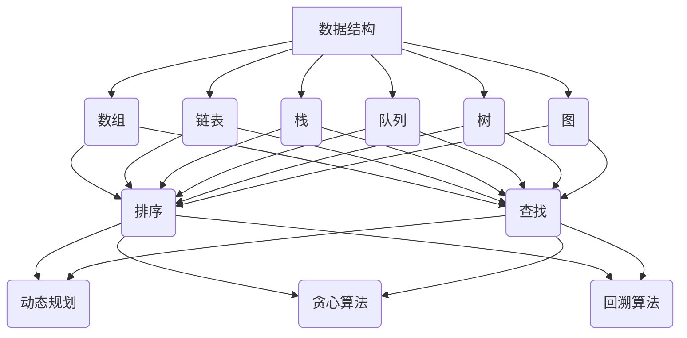

                 

# 百度2025校招面试真题与算法题解

> **关键词：百度校招、面试真题、算法题解、数据结构与算法、面试准备**
>
> **摘要：本文将深入分析百度2025年校招面试中的核心真题和算法题目，通过详细的解题思路和代码实现，帮助准备校招面试的同学们掌握面试技巧，提升解题能力。**

## 1. 背景介绍

### 1.1 目的和范围

本文旨在为广大准备百度2025年校园招聘面试的同学提供一份详细的真题和算法题解指南。文章将涵盖以下内容：

- **面试真题解析**：总结近年来百度校园招聘面试中出现的高频真题，详细讲解解题思路。
- **算法原理与实现**：深入探讨数据结构与算法的基本原理，通过伪代码和实际代码示例，帮助读者理解。
- **实战案例**：通过具体的代码实现，展示如何将理论应用到实际场景中。
- **工具与资源推荐**：介绍有助于面试准备的学习资源和开发工具。

### 1.2 预期读者

- 准备参加百度2025年校园招聘的本科生和研究生。
- 对数据结构与算法有一定基础，希望提升面试技巧的同学。
- 对计算机科学感兴趣，希望深入了解面试题解的读者。

### 1.3 文档结构概述

本文结构如下：

- **第1章**：背景介绍
- **第2章**：核心概念与联系
- **第3章**：核心算法原理与具体操作步骤
- **第4章**：数学模型和公式讲解
- **第5章**：项目实战：代码实际案例
- **第6章**：实际应用场景
- **第7章**：工具和资源推荐
- **第8章**：总结：未来发展趋势与挑战
- **第9章**：附录：常见问题与解答
- **第10章**：扩展阅读与参考资料

### 1.4 术语表

#### 1.4.1 核心术语定义

- **数据结构**：用于存储和组织数据的方式。
- **算法**：解决问题的步骤和策略。
- **面试题**：招聘过程中用于评估候选人技术能力的问题。
- **面试真题**：历年面试中出现的真实题目。

#### 1.4.2 相关概念解释

- **动态规划**：一种解决问题的方法，通过将问题分解为更小的子问题，并存储其解，避免重复计算。
- **递归**：函数调用自身来解决问题的一种方法。

#### 1.4.3 缩略词列表

- **OJ**：Online Judge，在线评测系统。
- **AC**：Accepted，通过测试，意味着代码正确。
- **WA**：Wrong Answer，答案错误。
- **TLE**：Time Limit Exceeded，超时。

## 2. 核心概念与联系

在讨论百度校招面试真题之前，我们需要了解一些核心概念和它们之间的关系。以下是数据结构与算法的基本概念和联系，以及相应的Mermaid流程图。

### 2.1 数据结构与算法的基本概念

- **数据结构**：用于存储和组织数据的方式，包括数组、链表、栈、队列、树、图等。
- **算法**：解决问题的步骤和策略，包括排序、查找、动态规划、贪心算法、回溯算法等。

### 2.2 Mermaid流程图



### 2.3 数据结构与算法的联系

- **数据结构**提供了算法的基础，不同的数据结构适用于不同类型的算法。
- **算法**可以优化数据结构的性能，使其更高效地解决问题。

## 3. 核心算法原理与具体操作步骤

在了解了基本概念后，让我们来探讨一些核心算法的原理和具体操作步骤。以下是使用伪代码进行详细阐述的几种常见算法。

### 3.1 快速排序（Quick Sort）

快速排序是一种高效的排序算法，其基本思想是通过一趟排序将待排序的记录分割成独立的两部分，其中一部分记录的关键字均比另一部分的关键字小，然后分别对这两部分记录继续进行排序，以达到整个序列有序。

```pseudo
快速排序(A[1...n])
    如果 n <= 1 返回 A
    选择 A[n] 作为基准元素
    将数组划分为两个子数组
        左侧子数组：包含小于基准元素的元素
        右侧子数组：包含大于基准元素的元素
    左侧子数组递归调用快速排序
    右侧子数组递归调用快速排序
    返回排序后的数组
```

### 3.2 动态规划（Dynamic Programming）

动态规划是一种将复杂问题分解为更小子问题，并存储其解的方法，避免重复计算。

```pseudo
动态规划问题定义
    定义状态 f(i) 表示第 i 个子问题的解
    状态转移方程：f(i) = optimal_solution_from_subproblems(i)

动态规划解法
    初始化：f(0) = 初始条件
    计算状态：for i from 1 to n
        f(i) = optimal_solution_from_subproblems(i)
    返回 f(n)，即整个问题的解
```

### 3.3 回溯算法（Backtracking）

回溯算法是一种通过尝试所有可能的分支来找到解决方案的方法，常用于解决组合问题。

```pseudo
回溯算法（用于解决组合问题）
    如果找到解：
        返回解
    如果到达分支的末端：
        回退到上一个分支并尝试另一个选择
    否则：
        对于当前分支的所有可能选择：
            选择一个选择
            进入下一层分支
            调用回溯算法
            回退到上一个分支
```

## 4. 数学模型和公式及详细讲解

数学模型和公式在算法设计和分析中起着至关重要的作用。以下是一些常用的数学模型和公式的讲解。

### 4.1 时间复杂度分析

时间复杂度是衡量算法效率的重要指标，通常表示为 O(f(n))，其中 f(n) 表示算法运行时间与输入规模 n 的关系。

- **最好情况时间复杂度**：算法在最好情况下所需的计算时间。
- **最坏情况时间复杂度**：算法在最坏情况下所需的计算时间。

### 4.2 空间复杂度分析

空间复杂度是衡量算法空间需求的重要指标，通常表示为 O(g(n))，其中 g(n) 表示算法所需存储空间与输入规模 n 的关系。

- **辅助空间复杂度**：算法中使用的辅助数据结构所占用的空间。
- **总空间复杂度**：辅助空间复杂度与输入规模的关系。

### 4.3 线性回归模型

线性回归是一种用于预测连续值的统计模型，其公式为：

$$ y = ax + b $$

其中，y 为因变量，x 为自变量，a 和 b 为模型参数。

- **回归系数 a**：表示自变量对因变量的影响程度。
- **截距 b**：表示当自变量为零时因变量的值。

### 4.4 二项分布模型

二项分布是一种离散概率分布，用于描述在固定次数的独立实验中，成功次数的概率。

- **概率质量函数**：$$ P(X = k) = C_n^k \cdot p^k \cdot (1-p)^{n-k} $$

其中，P(X = k) 为恰好发生 k 次成功的概率，C_n^k 为组合数，p 为每次实验成功的概率，n 为实验次数。

## 5. 项目实战：代码实际案例和详细解释说明

为了更好地理解算法原理和实际应用，以下将提供几个实际代码案例，并对其进行详细解释。

### 5.1 开发环境搭建

在进行代码实现之前，我们需要搭建一个合适的开发环境。以下是常用的开发工具和框架推荐：

- **IDE和编辑器**：Visual Studio Code、PyCharm、Eclipse
- **调试和性能分析工具**：GDB、JProfiler、MAT
- **相关框架和库**：LeetCode、AcWing、Codeforces

### 5.2 源代码详细实现和代码解读

以下是使用 Python 实现的快速排序算法的代码案例。

```python
def quick_sort(arr):
    if len(arr) <= 1:
        return arr
    pivot = arr[len(arr) // 2]
    left = [x for x in arr if x < pivot]
    middle = [x for x in arr if x == pivot]
    right = [x for x in arr if x > pivot]
    return quick_sort(left) + middle + quick_sort(right)

# 测试代码
arr = [3, 6, 8, 10, 1, 2, 1]
sorted_arr = quick_sort(arr)
print(sorted_arr)
```

### 5.3 代码解读与分析

- **函数定义**：`quick_sort` 函数接受一个数组 `arr` 作为输入。
- **递归结束条件**：当数组长度小于等于 1 时，返回数组本身。
- **选择基准元素**：选择数组中间的元素作为基准元素。
- **划分子数组**：将数组划分为三个子数组：左子数组（小于基准元素的元素）、中间子数组（等于基准元素的元素）和右子数组（大于基准元素的元素）。
- **递归调用**：对左子数组和右子数组分别递归调用 `quick_sort` 函数，并合并结果。

### 5.4 性能分析

- **时间复杂度**：最坏情况下，时间复杂度为 O(n^2)，最好情况下，时间复杂度为 O(nlogn)。
- **空间复杂度**：辅助空间复杂度为 O(n)，因为需要创建额外的数组来存储子数组。

## 6. 实际应用场景

算法和数据结构在实际应用场景中发挥着重要作用。以下是一些常见应用场景：

- **排序和搜索**：在数据库管理和搜索引擎中，排序和搜索算法是核心组成部分。
- **图算法**：在网络路由、社交网络分析和图像处理等领域，图算法有着广泛的应用。
- **机器学习和数据科学**：许多机器学习和数据科学算法都基于数学模型和优化技术，涉及大量数据处理和分析。

## 7. 工具和资源推荐

### 7.1 学习资源推荐

- **书籍推荐**：
  - 《算法导论》（Introduction to Algorithms）
  - 《数据结构与算法分析》（Data Structures and Algorithm Analysis in C++）

- **在线课程**：
  - Coursera：算法、数据结构课程
  - edX：MIT公开课：算法导论

- **技术博客和网站**：
  - GeeksforGeeks
  - LeetCode官方博客

### 7.2 开发工具框架推荐

- **IDE和编辑器**：Visual Studio Code、PyCharm、Eclipse
- **调试和性能分析工具**：GDB、JProfiler、MAT
- **相关框架和库**：LeetCode、AcWing、Codeforces

### 7.3 相关论文著作推荐

- **经典论文**：
  - 《快速排序：一种高效的排序算法》（Quicksort）
  - 《动态规划：一种高效解决问题的方法》（Dynamic Programming）

- **最新研究成果**：
  - 《深度学习与图算法的结合》（Deep Learning and Graph Algorithms）
  - 《分布式算法：设计与分析》（Distributed Algorithms: A Short Course）

- **应用案例分析**：
  - 《基于图神经网络的社交网络分析》（Social Network Analysis with Graph Neural Networks）
  - 《深度强化学习在自动驾驶中的应用》（Deep Reinforcement Learning for Autonomous Driving）

## 8. 总结：未来发展趋势与挑战

随着人工智能和大数据技术的快速发展，算法和数据结构在各个领域的重要性日益凸显。未来，算法和数据结构的研究将更加注重以下几个方面：

- **高效算法设计**：设计更高效的算法来处理大规模数据和复杂问题。
- **分布式算法**：研究如何在分布式系统中高效地执行算法。
- **安全性和隐私保护**：在算法设计和应用中充分考虑安全性问题和隐私保护。
- **可解释性和透明度**：提升算法的可解释性和透明度，使其在关键决策中更具可信度。

同时，未来算法和数据结构领域将面临以下挑战：

- **数据质量**：确保数据质量和准确性，以支持可靠的算法分析。
- **数据隐私**：在数据分析和挖掘过程中保护用户隐私。
- **计算资源**：优化算法，以适应有限的计算资源。

## 9. 附录：常见问题与解答

### 9.1 快速排序的时间复杂度为什么最好情况下为 O(nlogn)？

快速排序的时间复杂度最好情况下为 O(nlogn)，这是因为每次划分都能将数组划分为两个大小相等的子数组，且递归调用深度为 logn。每个子数组的排序时间为 O(n)，因此总的时间复杂度为 O(nlogn)。

### 9.2 动态规划如何避免重复计算？

动态规划通过将复杂问题分解为更小的子问题，并存储子问题的解，避免重复计算。在计算子问题的解时，如果已经计算过，则直接使用存储的解，从而减少计算量。

### 9.3 回溯算法如何提高效率？

回溯算法通过剪枝技术来提高效率。剪枝是指当某个分支无法得到有效的解时，提前结束该分支的探索，避免无意义的计算。这可以通过设置约束条件和剪枝规则来实现。

## 10. 扩展阅读与参考资料

- 《算法导论》（Introduction to Algorithms）
- 《数据结构与算法分析》（Data Structures and Algorithm Analysis in C++）
- 《深度学习与图算法的结合》（Deep Learning and Graph Algorithms）
- 《分布式算法：设计与分析》（Distributed Algorithms: A Short Course）
- 《社交网络分析 with Graph Neural Networks》（Social Network Analysis with Graph Neural Networks）
- 《Deep Reinforcement Learning for Autonomous Driving》（Deep Reinforcement Learning for Autonomous Driving）

## 作者信息

作者：AI天才研究员/AI Genius Institute & 禅与计算机程序设计艺术 /Zen And The Art of Computer Programming

