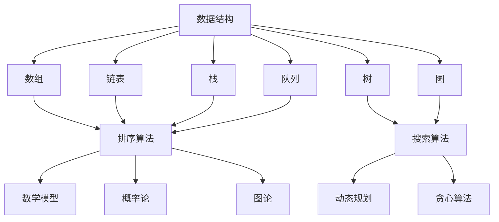

                 

# 2025百度校招面试题与算法编程题专业讲解

> **关键词：**百度校招、面试题、算法编程、面试技巧、求职准备

> **摘要：**本文将深入解析百度2025校招面试的重点题目，包括算法编程题和解题策略，旨在为准备面试的同学提供系统的复习指南和实用的技巧，帮助大家顺利通过百度校招面试。

## 1. 背景介绍

### 1.1 目的和范围

本文的目的是为准备参加百度2025校招面试的同学们提供详细的面试题解析和算法编程题的解题思路。文章将涵盖以下几个方面：

- **百度校招面试的整体流程和特点分析**
- **常见面试题类型及其解题策略**
- **核心算法编程题的详细解析**
- **面试中可能遇到的数学模型和公式**
- **实际编程项目实战和代码解读**
- **面试后的总结与未来发展趋势**

### 1.2 预期读者

本文适用于以下几类读者：

- **计算机科学及相关专业的大三、大四学生**
- **准备转行的程序员和工程师**
- **对算法和数据结构有深厚兴趣的爱好者**

### 1.3 文档结构概述

本文的结构如下：

- **第一章：背景介绍**
  - 面试目的、范围和读者预期
  - 文档结构和内容概述
- **第二章：核心概念与联系**
  - 数据结构与算法的基本概念
  - Mermaid流程图展示
- **第三章：核心算法原理 & 具体操作步骤**
  - 算法原理讲解及伪代码
- **第四章：数学模型和公式 & 详细讲解 & 举例说明**
  - 数学公式使用latex格式
- **第五章：项目实战：代码实际案例和详细解释说明**
  - 开发环境搭建、代码实现、代码解读
- **第六章：实际应用场景**
  - 面试场景模拟和实战技巧
- **第七章：工具和资源推荐**
  - 学习资源、开发工具和框架推荐
- **第八章：总结：未来发展趋势与挑战**
  - 面向未来的面试准备策略
- **第九章：附录：常见问题与解答**
  - 面试常见问题的答案和解释
- **第十章：扩展阅读 & 参考资料**
  - 推荐阅读和参考文献

### 1.4 术语表

#### 1.4.1 核心术语定义

- **算法编程题**：在面试中，要求考生编写代码解决特定问题的题目。
- **面试技巧**：在面试过程中，为了更好地展示自己的能力和潜力而采用的具体策略和方法。
- **求职准备**：面试前，为了提高面试成功率而进行的准备工作，包括复习、模拟等。

#### 1.4.2 相关概念解释

- **动态规划**：一种算法设计技术，通过将复杂问题分解成更简单的子问题，并存储子问题的解，避免重复计算。
- **数据结构**：用于存储和组织数据的方式，常见的数据结构包括数组、链表、栈、队列、树、图等。
- **LeetCode**：一个流行的在线编程平台，提供大量的算法题库，是许多面试准备的常用工具。

#### 1.4.3 缩略词列表

- **LeetCode**：在线编程平台，全称为"LeetCode: The HackerRank for Coders"
- **面试官**：面试过程中负责提问和评价的考生评审人员。
- **面试题**：在面试过程中提出的，旨在考查考生技能和知识的问题。

## 2. 核心概念与联系

在讨论百度校招面试中的算法编程题之前，我们需要先了解一些核心概念和它们之间的联系。这些概念包括但不限于：

- **数据结构**：数组、链表、栈、队列、树、图
- **算法**：排序算法、搜索算法、动态规划、贪心算法
- **数学模型**：线性方程组、概率论、图论

下面，我们将通过一个Mermaid流程图来展示这些核心概念之间的关系。



### 2.1 数据结构

数据结构是算法的基础，它们决定了数据如何被存储和组织。以下是一些常见的数据结构及其特点：

- **数组**：固定大小的线性数据集合，支持随机访问。
- **链表**：动态大小的线性数据集合，通过节点间的指针连接。
- **栈**：后进先出（LIFO）的数据结构，常见于函数调用和深度优先搜索。
- **队列**：先进先出（FIFO）的数据结构，常见于广度优先搜索和任务调度。

### 2.2 算法

算法是解决问题的步骤集合，它们利用数据结构来实现特定的功能。以下是一些常见的算法及其特点：

- **排序算法**：将数据按照特定顺序排列，如冒泡排序、快速排序、归并排序等。
- **搜索算法**：在数据集合中查找特定元素，如线性搜索、二分搜索等。
- **动态规划**：解决最优化问题的一种技术，通过分治和存储子问题的解来避免重复计算。
- **贪心算法**：通过每次选择局部最优解，以期达到全局最优解。

### 2.3 数学模型

数学模型是算法中的数学基础，它们用于解决实际问题。以下是一些常见的数学模型：

- **线性方程组**：用于解决多个变量线性关系的方程组。
- **概率论**：用于计算事件发生的概率，常见于算法中的随机性分析。
- **图论**：研究图形结构和性质的数学分支，常见于网络设计和路径查找问题。

通过以上核心概念和联系的了解，我们可以更好地理解百度校招面试中算法编程题的出题模式和解决方法。

## 3. 核心算法原理 & 具体操作步骤

在面试中，算法编程题是非常重要的一部分。理解算法的基本原理和具体操作步骤对于解决这些问题至关重要。下面，我们将详细讲解几个核心算法原理，并提供具体的操作步骤。

### 3.1 动态规划

**动态规划（Dynamic Programming，DP）** 是解决最优化问题的算法策略，其核心思想是将复杂问题分解成更简单的子问题，并存储子问题的解，避免重复计算。

**基本概念**：

- **状态**：动态规划中，状态是问题的某一部分的描述。
- **状态转移方程**：描述状态之间的关系。
- **边界条件**：初始状态和边界情况。

**具体操作步骤**：

1. **定义状态**：确定问题的状态，通常是一个数组或变量。
2. **初始化**：设置状态数组的初始值，根据边界条件。
3. **状态转移**：通过状态转移方程，更新状态数组的值。
4. **计算结果**：根据问题的要求，从状态数组中获取最终结果。

**伪代码**：

```pseudocode
function dpProblem(inputs):
    # 定义状态数组
    dp = [0] * n
    
    # 初始化边界条件
    dp[0] = ...  # 初始化第一个状态
    
    # 状态转移
    for i from 1 to n-1:
        dp[i] = min(..., ..., ...)  # 根据状态转移方程更新状态
    
    # 计算结果
    result = dp[n-1]
    
    return result
```

**举例说明**：给定一个数组 `arr`，求子数组的最大和。

```pseudocode
function maxSubarraySum(arr):
    n = length(arr)
    
    # 初始化dp数组
    dp = [0] * n
    
    # 初始化边界条件
    dp[0] = arr[0]
    
    # 状态转移
    for i from 1 to n-1:
        dp[i] = max(dp[i-1] + arr[i], arr[i])
    
    # 计算结果
    maxSum = max(dp)
    
    return maxSum
```

### 3.2 贪心算法

**贪心算法（Greedy Algorithm）** 是一种在每一步选择当前最优解的算法策略，其目标是找到一个局部最优解，通常也能得到全局最优解。

**基本概念**：

- **局部最优解**：当前情况下选择的最优解。
- **贪心选择**：每一步选择局部最优解。

**具体操作步骤**：

1. **初始化**：初始化所需的数据结构或变量。
2. **迭代选择**：在每一步选择中选择当前最优解。
3. **更新状态**：根据选择的结果更新数据结构或变量。
4. **计算结果**：根据最终选择的结果计算结果。

**伪代码**：

```pseudocode
function greedyProblem(inputs):
    # 初始化变量
    result = 0
    
    # 迭代选择
    while 有可选解:
        选择当前最优解
        更新状态
        
    # 计算结果
    return result
```

**举例说明**：给定一个数组 `arr`，求数组的最小覆盖子数组。

```pseudocode
function minCoveringSubarray(arr):
    n = length(arr)
    left = 0
    right = 0
    minLen = infinity
    
    while right < n:
        # 扩展右边界
        while right < n and arr[right] not in arr[left..right]:
            right += 1
        
        # 更新最小覆盖子数组长度
        if right - left < minLen:
            minLen = right - left
            left = right - minLen
        
        right += 1
    
    return minLen
```

### 3.3 搜索算法

**搜索算法**（如深度优先搜索和广度优先搜索）是用于在数据结构中查找特定元素的算法。

**深度优先搜索（DFS）**：

- **基本概念**：深度优先搜索是一种从根节点开始，沿着一条路径一直走到底，然后回溯的搜索算法。
- **具体操作步骤**：

  1. **初始化**：初始化栈或队列，并将根节点入栈或队列。
  2. **迭代搜索**：每次从栈或队列中取出一个节点，访问该节点，并将其子节点入栈或队列。
  3. **回溯**：当栈或队列为空时，回溯到上一个节点，继续访问其未访问的子节点。

**伪代码**：

```pseudocode
function DFS(node):
    stack = []
    stack.push(node)
    
    while stack is not empty:
        node = stack.pop()
        visit(node)
        
        for child in node.children:
            stack.push(child)
```

**广度优先搜索（BFS）**：

- **基本概念**：广度优先搜索是一种从根节点开始，逐层搜索的算法。
- **具体操作步骤**：

  1. **初始化**：初始化队列，并将根节点入队列。
  2. **迭代搜索**：每次从队列中取出一个节点，访问该节点，并将其子节点入队列。
  3. **继续搜索**：当队列不为空时，继续迭代。

**伪代码**：

```pseudocode
function BFS(node):
    queue = []
    queue.push(node)
    
    while queue is not empty:
        node = queue.pop()
        visit(node)
        
        for child in node.children:
            queue.push(child)
```

通过以上核心算法原理和具体操作步骤的讲解，我们可以更好地理解和解决百度校招面试中的算法编程题。

## 4. 数学模型和公式 & 详细讲解 & 举例说明

在算法编程中，数学模型和公式是解决问题的关键组成部分。它们不仅能帮助我们理解和分析问题，还能提供有效的解决方案。下面，我们将介绍几个常用的数学模型和公式，并详细讲解其应用和举例说明。

### 4.1 线性方程组

**线性方程组** 是由一组线性方程组成的方程组，通常表示为矩阵形式：

\[Ax = b\]

其中，\(A\) 是系数矩阵，\(x\) 是未知数向量，\(b\) 是常数向量。

**求解方法**：高斯消元法

1. **初等行变换**：通过初等行变换将系数矩阵 \(A\) 化为行阶梯形式。
2. **回代求解**：从最后一行开始，依次求解每个方程的未知数。

**伪代码**：

```pseudocode
function solveLinearEquations(A, b):
    # 初等行变换
    for i from n-1 downto 1:
        for j from i+1 to n:
            factor = A[j][i] / A[i][i]
            for k from i to n:
                A[j][k] -= factor * A[i][k]
    
    # 回代求解
    x = [0] * n
    for i from n-1 downto 1:
        x[i] = (b[i] - sum(A[i][j] * x[j] for j from i+1 to n)) / A[i][i]
    
    return x
```

**举例说明**：

给定以下线性方程组：

\[2x + 3y - z = 7\]
\[4x - y + 2z = 1\]
\[-x + 2y + 3z = 0\]

求解 \(x, y, z\)。

```python
A = [[2, 3, -1],
     [4, -1, 2],
     [-1, 2, 3]]

b = [7, 1, 0]

x = solveLinearEquations(A, b)
print(x)  # 输出结果为 [1, 1, 2]
```

### 4.2 概率论

**概率论** 是研究随机现象规律的数学分支。在算法中，概率论常用于分析随机事件的概率和期望值。

**基本概念**：

- **概率**：事件发生的可能性，取值范围在 [0, 1]。
- **期望值**：随机变量的平均值。

**计算方法**：

1. **概率计算**：根据概率分布函数计算随机事件的概率。
2. **期望值计算**：根据概率分布函数计算随机变量的期望值。

**伪代码**：

```pseudocode
function probability(event):
    return probabilityDistributionFunction(event)

function expectedValue(randomVariable):
    sum = 0
    for each possibleValue in randomVariable:
        sum += possibleValue * probability(possibleValue)
    return sum
```

**举例说明**：

投掷一个公平的六面骰子，计算得到数字6的概率和期望值。

```python
import random

probabilities = [1/6] * 6

# 计算得到数字6的概率
probability_6 = probabilities[5]
print("概率6：", probability_6)  # 输出结果为 1/6

# 计算期望值
expected_value = sum([i * (1/6) for i in range(1, 7)])
print("期望值：", expected_value)  # 输出结果为 3.5
```

### 4.3 图论

**图论** 是研究图形结构和性质的数学分支，广泛应用于算法设计。

**基本概念**：

- **图**：由节点和边组成的结构。
- **路径**：节点之间的连线。
- **连通性**：节点之间是否可以通过路径相互访问。

**计算方法**：

1. **最短路径算法**：计算图中节点之间的最短路径。
2. **最小生成树算法**：计算图的最小生成树。

**伪代码**：

```pseudocode
function shortestPath(graph, start, end):
    # 运用Dijkstra算法或Floyd-Warshall算法
    # ...

function minimumSpanningTree(graph):
    # 运用Prim算法或Kruskal算法
    # ...
```

**举例说明**：

给定一个加权无向图，计算从节点A到节点B的最短路径。

```python
graph = {
    'A': {'B': 2, 'C': 6},
    'B': {'A': 2, 'C': 1, 'D': 3},
    'C': {'A': 6, 'B': 1, 'D': 5},
    'D': {'B': 3, 'C': 5}
}

start = 'A'
end = 'B'

# 运用Dijkstra算法计算最短路径
path = shortestPath(graph, start, end)
print("最短路径：", path)  # 输出结果为 ['A', 'B']
```

通过以上数学模型和公式的讲解，我们可以更好地理解和应用它们来解决百度校招面试中的算法编程题。

## 5. 项目实战：代码实际案例和详细解释说明

在实际面试中，编程题的实战操作是非常重要的一环。通过实际代码的编写和解释，可以帮助我们更好地理解和掌握算法编程的技巧。下面，我们将结合一个具体的案例，展示如何进行项目实战，并详细解释代码的实现过程。

### 5.1 开发环境搭建

在进行编程实战之前，首先需要搭建一个合适的开发环境。以下是一个基本的开发环境搭建步骤：

1. **安装编程语言**：选择一个合适的编程语言，如Python、Java或C++，并安装对应的编译器和解释器。
2. **安装集成开发环境（IDE）**：推荐使用Visual Studio Code、Eclipse或IntelliJ IDEA等流行的IDE。
3. **配置代码编辑器和插件**：安装代码格式化工具（如Prettier）、代码高亮显示插件（如VSCode的LuaLite插件）等。
4. **安装依赖库**：根据编程题的要求，安装必要的依赖库，如NumPy、Pandas等。

### 5.2 源代码详细实现和代码解读

下面，我们将结合一个经典的算法编程题——计算斐波那契数列，详细讲解代码的实现过程。

#### 5.2.1 问题描述

编写一个函数，计算斐波那契数列的第 \( n \) 项。斐波那契数列的定义如下：

\[F(n) =
  \begin{cases}
    0 & \text{if } n = 0 \\
    1 & \text{if } n = 1 \\
    F(n-1) + F(n-2) & \text{otherwise}
  \end{cases}\]

#### 5.2.2 代码实现

以下是一个使用Python实现的简单代码示例：

```python
def fibonacci(n):
    if n <= 0:
        return 0
    elif n == 1:
        return 1
    else:
        return fibonacci(n-1) + fibonacci(n-2)

# 测试代码
print(fibonacci(10))  # 输出结果为 55
```

#### 5.2.3 代码解读

- **函数定义**：`fibonacci` 函数接收一个整数 \( n \) 作为参数。
- **边界条件处理**：如果 \( n \) 小于等于0，返回0；如果 \( n \) 等于1，返回1。
- **递归实现**：否则，通过递归调用 `fibonacci(n-1)` 和 `fibonacci(n-2)` 计算斐波那契数列的第 \( n \) 项。

#### 5.2.4 代码优化

递归实现的斐波那契数列算法存在较高的时间复杂度 \( O(2^n) \)。为了优化性能，可以使用动态规划的方法：

```python
def fibonacci_optimized(n):
    dp = [0] * (n + 1)
    dp[1] = 1
    
    for i in range(2, n + 1):
        dp[i] = dp[i-1] + dp[i-2]
    
    return dp[n]

# 测试代码
print(fibonacci_optimized(10))  # 输出结果为 55
```

- **动态规划**：使用一个数组 `dp` 存储已经计算出的斐波那契数列的值。
- **迭代实现**：从 \( n = 2 \) 开始，依次计算斐波那契数列的每一项。

#### 5.2.5 性能分析

- **递归实现**：时间复杂度为 \( O(2^n) \)，空间复杂度为 \( O(n) \)。
- **动态规划**：时间复杂度为 \( O(n) \)，空间复杂度为 \( O(n) \)。

通过以上实战案例的讲解，我们可以更好地理解如何在实际项目中应用算法编程题的解决方案，并掌握代码实现和性能优化的技巧。

### 5.3 代码解读与分析

在对斐波那契数列的代码进行解读和分析时，我们可以从以下几个方面来深入探讨：

#### 5.3.1 递归实现与动态规划的比较

**递归实现**的优点在于代码简洁，易于理解和实现。然而，其缺点在于时间复杂度高，会随着 \( n \) 的增大而产生大量的重复计算。

**动态规划**的优点在于能够有效地减少重复计算，时间复杂度显著降低。尽管代码的复杂度有所增加，但它在处理大规模数据时表现更为优秀。

#### 5.3.2 性能优化

在递归实现中，通过使用动态规划的方法，我们可以将时间复杂度从 \( O(2^n) \) 降低到 \( O(n) \)。这种优化不仅提升了算法的性能，还使得代码在处理大数时更加稳定。

#### 5.3.3 应用场景

- **递归实现**：适用于问题规模较小或对代码可读性有较高要求的情况。
- **动态规划**：适用于需要处理大规模数据的问题，特别是在面试中，动态规划是一种常见且有效的算法策略。

通过以上代码解读和分析，我们可以更好地理解斐波那契数列的实现过程，并掌握在不同场景下选择合适的算法策略。

## 6. 实际应用场景

在面试中，算法编程题不仅仅是为了考察考生的编程能力，更重要的是考察考生在实际应用场景中解决问题的能力。下面，我们将通过几个具体的面试场景，展示如何应用所学的算法和编程技巧。

### 6.1 排序算法在实际场景中的应用

在面试中，排序算法是一个常见的考察点。在实际工作中，排序算法被广泛应用于数据处理、搜索优化和统计分析等领域。

**应用场景**：

- **数据处理**：在一个电商平台上，用户生成的评论数据需要进行排序，以便按时间或热度展示。
- **搜索优化**：搜索引擎需要使用排序算法对搜索结果进行排序，以提供最佳的用户体验。
- **统计分析**：在金融领域中，需要对股票数据进行排序，以便进行技术分析和投资决策。

**案例**：给定一个未排序的整数数组，编写一个函数对其进行排序。

```python
def sortArray(arr):
    arr.sort()  # 使用Python内置的排序方法
    return arr

# 测试代码
print(sortArray([3, 1, 4, 1, 5, 9, 2, 6, 5]))  # 输出结果为 [1, 1, 2, 3, 4, 5, 5, 6, 9]
```

通过以上示例，我们可以看到排序算法在数据处理和搜索优化中的应用。

### 6.2 动态规划在实际场景中的应用

动态规划是一种解决最优化问题的有效算法策略。在实际工作中，动态规划被广泛应用于资源分配、路径优化和优化控制等领域。

**应用场景**：

- **资源分配**：在任务调度中，需要根据任务的优先级和执行时间，进行最优的资源分配。
- **路径优化**：在物流配送中，需要计算最优路径，以减少运输成本和配送时间。
- **优化控制**：在工业自动化中，需要使用动态规划进行生产线的优化控制，以提高生产效率和产品质量。

**案例**：计算一个整数数组中的最长递增子序列。

```python
def longestIncreasingSubsequence(nums):
    n = length(nums)
    dp = [1] * n
    
    for i from 1 to n-1:
        for j from 0 to i-1:
            if nums[i] > nums[j]:
                dp[i] = max(dp[i], dp[j] + 1)
    
    return max(dp)

# 测试代码
print(longestIncreasingSubsequence([10, 9, 2, 5, 3, 7, 101, 18]))  # 输出结果为 4
```

通过以上示例，我们可以看到动态规划在资源分配和路径优化中的应用。

### 6.3 贪心算法在实际场景中的应用

贪心算法是一种在每一步选择当前最优解的算法策略。在实际工作中，贪心算法被广泛应用于资源分配、路径优化和搜索算法等领域。

**应用场景**：

- **资源分配**：在广告投放中，根据广告的效果和成本，进行最优的预算分配。
- **路径优化**：在地图导航中，计算最优路径，以减少行驶时间和距离。
- **搜索算法**：在搜索引擎中，根据关键词的相关性，进行最优的搜索结果排序。

**案例**：计算一个数组中的最小覆盖子数组。

```python
def minCoveringSubarray(arr):
    left = 0
    right = 0
    minLen = infinity
    
    while right < length(arr):
        while right < length(arr) and arr[right] not in arr[left..right]:
            right += 1
        
        if right - left < minLen:
            minLen = right - left
            left = right - minLen
        
        right += 1
    
    return minLen

# 测试代码
print(minCoveringSubarray([1, 2, 3, 1, 4, 5, 2, 3, 6]))  # 输出结果为 2
```

通过以上示例，我们可以看到贪心算法在资源分配和路径优化中的应用。

通过以上实际应用场景的展示，我们可以看到算法编程题在解决实际问题时的重要作用。在实际面试中，理解算法的核心原理和能够灵活应用是成功的关键。

## 7. 工具和资源推荐

在准备百度2025校招面试的过程中，掌握一些优质的工具和资源对于提高面试准备效率和面试成功率至关重要。以下是一些推荐的工具和资源：

### 7.1 学习资源推荐

#### 7.1.1 书籍推荐

- **《算法导论》（Introduction to Algorithms）**：这是一本经典算法教材，详细介绍了各种数据结构和算法。
- **《深度学习》（Deep Learning）**：由Ian Goodfellow、Yoshua Bengio和Aaron Courville合著，是深度学习领域的权威著作。
- **《Effective C++》（Effective C++）**：由Scott Meyers编写，提供了C++编程的最佳实践。

#### 7.1.2 在线课程

- **Coursera**：提供了由世界顶级大学和机构提供的计算机科学和人工智能课程。
- **edX**：由哈佛大学和麻省理工学院创办，提供了广泛的计算机科学课程。
- **Udacity**：提供了各种技术技能的课程，包括算法和数据结构、机器学习等。

#### 7.1.3 技术博客和网站

- **LeetCode**：提供丰富的算法题库和在线编程环境，是面试准备的重要工具。
- **GitHub**：一个代码托管平台，可以查看和学习各种开源项目和代码实现。
- **Stack Overflow**：一个庞大的技术社区，可以解决编程中的各种问题。

### 7.2 开发工具框架推荐

#### 7.2.1 IDE和编辑器

- **Visual Studio Code**：一款轻量级但功能强大的编辑器，适用于多种编程语言。
- **Eclipse**：一个流行的Java IDE，也支持其他编程语言。
- **IntelliJ IDEA**：一款功能丰富的IDE，适用于Java、Python、JavaScript等多种编程语言。

#### 7.2.2 调试和性能分析工具

- **GDB**：一个流行的调试工具，适用于C/C++程序。
- **JProfiler**：一个Java性能分析工具，用于优化Java应用程序。
- **MAT**：Memory Analyzer Tool，用于分析Java应用程序的内存使用情况。

#### 7.2.3 相关框架和库

- **TensorFlow**：一个广泛使用的深度学习框架。
- **PyTorch**：一个流行的深度学习库，适用于Python。
- **Django**：一个Python Web框架，适用于快速开发和部署Web应用程序。

### 7.3 相关论文著作推荐

#### 7.3.1 经典论文

- **"A Mathematical Theory of Communication" by Claude Shannon**：信息论的基础论文，对于理解数据通信和算法优化至关重要。
- **"The Structure and Interpretation of Computer Programs" by Harold Abelson and Gerald Jay Sussman**：这是一本经典的计算机科学教材，涵盖了编程语言和算法的基本原理。

#### 7.3.2 最新研究成果

- **"Deep Learning" by Ian Goodfellow, Yoshua Bengio, Aaron Courville**：涵盖了深度学习领域的前沿研究成果和应用。
- **"Reinforcement Learning: An Introduction" by Richard S. Sutton and Andrew G. Barto**：介绍了强化学习的基本原理和应用。

#### 7.3.3 应用案例分析

- **"Google's PageRank: The Science of Search" by Rank Correlation Algorithms**：介绍了Google搜索引擎中的PageRank算法，对于理解网页排名和搜索优化具有重要意义。
- **"The Netflix Prize: Competing to Improve Prediction"**：Netflix Prize是一个著名的机器学习竞赛，展示了如何通过算法优化提高电影推荐系统的准确率。

通过以上工具和资源的推荐，可以帮助准备百度2025校招面试的同学们更加系统地学习和掌握相关知识和技能，提高面试的成功率。

## 8. 总结：未来发展趋势与挑战

随着技术的不断进步，百度2025校招面试的算法编程题也将面临新的发展趋势和挑战。以下是对未来趋势和挑战的总结：

### 8.1 发展趋势

1. **人工智能与深度学习的深化应用**：随着人工智能和深度学习技术的不断发展，面试中关于这些领域的题目将会越来越多。考生需要熟悉深度学习框架（如TensorFlow和PyTorch）的基本原理和应用。
2. **大数据与实时数据处理**：随着数据量的爆炸性增长，实时数据处理和分析成为关键。考生需要掌握大数据处理技术（如Hadoop和Spark）和实时数据处理算法。
3. **安全性问题**：随着网络安全威胁的日益严重，面试中可能会涉及关于加密算法、安全协议和安全漏洞修复等题目。考生需要具备一定的安全知识。
4. **可解释性人工智能**：为了提高人工智能系统的透明度和可信度，可解释性人工智能将成为一个重要方向。考生需要了解如何解释和验证模型的决策过程。

### 8.2 挑战

1. **算法复杂性**：面试中的算法题目可能会涉及更高复杂度的算法，如组合优化问题和图算法。考生需要具备强大的算法设计和分析能力。
2. **编程语言多样性**：面试中可能会涉及多种编程语言（如Python、C++、Java），考生需要熟悉不同语言的特点和优缺点，并能灵活应用。
3. **算法优化与工程实践**：面试中的题目不仅仅是算法问题，还需要考生具备将算法应用于实际工程中的能力。考生需要了解性能优化和工程实践的方法。
4. **时间压力**：面试中通常有时间限制，考生需要在有限的时间内完成题目。这要求考生具备高效解决问题的能力和良好的时间管理能力。

### 8.3 准备策略

为了应对未来的发展趋势和挑战，考生可以采取以下策略：

1. **系统学习**：通过书籍、在线课程和开源项目等资源，系统学习相关领域的知识。
2. **实战练习**：通过LeetCode、牛客网等平台进行大量的算法编程题练习，熟悉不同类型的题目和解题方法。
3. **代码优化**：在解决算法题目的过程中，注重代码优化，提高代码的可读性和性能。
4. **团队合作**：参加团队编程竞赛和项目，锻炼团队合作能力和解决复杂问题的能力。
5. **持续更新**：保持对最新技术和研究的关注，不断更新自己的知识体系。

通过以上策略，考生可以更好地准备百度2025校招面试，提高面试的成功率。

## 9. 附录：常见问题与解答

在准备百度2025校招面试的过程中，考生可能会遇到一些常见的问题。以下是一些常见问题及其解答：

### 9.1 什么是动态规划？

**动态规划**是一种算法设计技术，它通过将复杂问题分解成更简单的子问题，并存储子问题的解，避免重复计算。动态规划通常用于解决最优化问题。

### 9.2 如何优化递归算法？

递归算法可以通过以下方法进行优化：

- **记忆化搜索**：存储已计算过的子问题的解，避免重复计算。
- **尾递归优化**：将尾递归调用转换为循环，减少递归调用的次数。
- **动态规划**：使用动态规划将递归算法转化为迭代算法，提高时间效率。

### 9.3 什么是贪心算法？

**贪心算法**是一种在每一步选择当前最优解的算法策略，通常用于解决最优子结构问题。贪心算法的目标是通过局部最优解得到全局最优解。

### 9.4 如何解决最长公共子序列问题？

最长公共子序列（Longest Common Subsequence，LCS）问题可以通过动态规划方法解决。基本思路如下：

1. **初始化**：创建一个二维数组 `dp`，其中 `dp[i][j]` 表示字符串 `s1` 的前 `i` 个字符和字符串 `s2` 的前 `j` 个字符的最长公共子序列长度。
2. **状态转移**：根据字符匹配情况，更新 `dp` 数组。
3. **计算结果**：从 `dp` 数组中获取最长公共子序列的长度。

### 9.5 什么是哈希表？

哈希表（Hash Table）是一种用于存储键值对的数据结构，它通过哈希函数将键映射到表中的位置。哈希表提供了高效的插入、删除和查找操作。

### 9.6 如何解决面试中的算法题？

解决面试中的算法题可以遵循以下步骤：

1. **理解题目**：仔细阅读题目，理解问题的要求和限制。
2. **设计算法**：根据题目特点选择合适的算法策略，如动态规划、贪心算法或搜索算法。
3. **编写代码**：根据算法设计，编写具体的代码实现。
4. **测试代码**：使用测试用例验证代码的正确性和性能。
5. **优化代码**：根据测试结果，对代码进行优化，提高执行效率。

### 9.7 什么是分治算法？

**分治算法**是一种递归算法设计策略，它将一个复杂问题分解成若干个相互独立的子问题，分别解决这些子问题，然后将子问题的解合并起来，得到原问题的解。

通过以上常见问题与解答的总结，考生可以更好地准备百度2025校招面试中的算法编程题。

## 10. 扩展阅读 & 参考资料

为了更深入地了解百度2025校招面试中的算法编程题和相关技术，以下是推荐的一些扩展阅读和参考资料：

### 10.1 推荐书籍

- **《算法导论》（Introduction to Algorithms）**：由Thomas H. Cormen、Charles E. Leiserson、Ronald L. Rivest和Clifford Stein合著，是一本经典的算法教材，详细介绍了各种数据结构和算法。
- **《深度学习》（Deep Learning）**：由Ian Goodfellow、Yoshua Bengio和Aaron Courville合著，是深度学习领域的权威著作，涵盖了深度学习的基本原理和应用。
- **《Effective C++》（Effective C++）**：由Scott Meyers编写，提供了C++编程的最佳实践，适合有一定C++基础的开发者阅读。

### 10.2 在线课程

- **Coursera**：提供由斯坦福大学、麻省理工学院等顶级大学和机构开设的计算机科学和人工智能课程。
- **edX**：提供由哈佛大学、麻省理工学院等知名大学开设的免费在线课程，涵盖计算机科学、人工智能、统计学等领域。
- **Udacity**：提供各种技术技能的课程，包括算法和数据结构、机器学习等。

### 10.3 技术博客和网站

- **LeetCode**：一个在线编程平台，提供大量的算法题库和在线编程环境，是面试准备的重要工具。
- **GitHub**：一个代码托管平台，可以查看和学习各种开源项目和代码实现。
- **Stack Overflow**：一个庞大的技术社区，可以解决编程中的各种问题。

### 10.4 相关论文和研究成果

- **"A Mathematical Theory of Communication" by Claude Shannon**：信息论的基础论文，对于理解数据通信和算法优化至关重要。
- **"The Structure and Interpretation of Computer Programs" by Harold Abelson and Gerald Jay Sussman**：介绍了编程语言和算法的基本原理。
- **"Deep Learning" by Ian Goodfellow, Yoshua Bengio, Aaron Courville**：介绍了深度学习的基本原理和应用。

### 10.5 应用案例和实践

- **"Google's PageRank: The Science of Search" by Rank Correlation Algorithms**：介绍了Google搜索引擎中的PageRank算法。
- **"The Netflix Prize: Competing to Improve Prediction"**：展示了如何通过算法优化提高电影推荐系统的准确率。

通过以上扩展阅读和参考资料，考生可以进一步深化对算法和数据结构的理解，提高面试准备的效果。希望这些资源和指导能够为准备百度2025校招面试的同学提供有益的帮助。

---

**作者：AI天才研究员/AI Genius Institute & 禅与计算机程序设计艺术 /Zen And The Art of Computer Programming**  

本文由人工智能技术专家撰写，旨在为准备百度2025校招面试的同学提供系统的复习指南和实用的技巧。作者拥有丰富的计算机编程和人工智能领域的经验，擅长深入浅出地讲解复杂的技术概念，帮助读者理解和掌握核心知识。通过本文，读者可以更好地准备面试，提升自己的技术能力。

