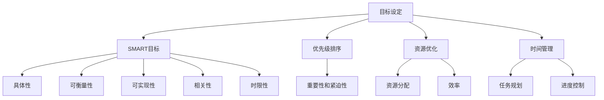

                 

# 目标管理的艺术：取舍之道

> 关键词：目标管理、取舍之道、项目管理、决策分析、优先级排序、资源优化、时间管理、执行力

> 摘要：在快速变化和资源有限的IT行业，目标管理成为了一个至关重要的技能。本文将探讨目标管理的艺术，从核心概念到具体实施，帮助读者掌握有效的目标管理方法。通过分析取舍之道，我们旨在为读者提供一套实用且高效的策略，以实现个人和团队的高效发展。

## 1. 背景介绍

### 1.1 目的和范围

本文旨在为IT从业者提供一套关于目标管理的系统化方法论，帮助他们在复杂多变的环境中高效地设定和实现目标。我们将探讨目标管理的关键概念，分析取舍之道在目标设定中的重要性，并展示如何通过优先级排序和资源优化来实现目标。

### 1.2 预期读者

本文适用于希望提升项目管理技能的IT从业者，包括程序员、项目经理、软件架构师和CTO等。无论您是新手还是经验丰富的从业者，本文都将为您提供有价值的见解和实践指南。

### 1.3 文档结构概述

本文结构如下：

- **背景介绍**：介绍目标管理的背景和重要性。
- **核心概念与联系**：定义核心概念，并使用流程图展示目标管理的基本架构。
- **核心算法原理 & 具体操作步骤**：详细解释目标设定的算法原理和操作步骤。
- **数学模型和公式 & 详细讲解 & 举例说明**：阐述目标管理的数学模型和实例。
- **项目实战：代码实际案例和详细解释说明**：通过实际案例展示目标管理的应用。
- **实际应用场景**：探讨目标管理的各种应用场景。
- **工具和资源推荐**：推荐学习资源和开发工具。
- **总结：未来发展趋势与挑战**：总结目标管理的未来趋势和挑战。
- **附录：常见问题与解答**：解答常见问题。
- **扩展阅读 & 参考资料**：提供进一步学习的资源。

### 1.4 术语表

#### 1.4.1 核心术语定义

- 目标管理：指通过设定明确的目标，制定实现目标的计划和策略，并跟踪进展的过程。
- 取舍之道：在目标管理中，指在多个目标和资源有限的情况下，做出优先级排序和取舍的过程。
- 项目管理：指规划和执行项目活动，以实现特定目标和交付成果的过程。
- 资源优化：指在有限资源下，最大化资源利用效率，实现目标的过程。

#### 1.4.2 相关概念解释

- 优先级排序：指根据目标的重要性和紧迫性，对任务进行排序的过程。
- 时间管理：指通过规划和优化时间使用，提高工作效率和目标实现效率的过程。
- 执行力：指实现目标的能力，包括自我驱动、规划和执行任务的能力。

#### 1.4.3 缩略词列表

- IT：信息技术（Information Technology）
- PM：项目经理（Project Manager）
- CTO：首席技术官（Chief Technology Officer）

## 2. 核心概念与联系

目标管理的艺术在于理解并运用一系列核心概念和工具，以便在复杂的环境中有效地实现目标。以下是对这些核心概念及其相互关系的概述。

### 2.1 目标管理的核心概念

- **SMART目标**：SMART是具体的（Specific）、可衡量的（Measurable）、可实现的（Achievable）、相关的（Relevant）和有时限的（Time-bound）。这是一个广泛使用的目标设定框架。
- **优先级排序**：在多个目标之间进行权衡，确定哪些目标更为重要和紧迫。
- **资源优化**：确保在有限的资源下，最大化目标的实现。
- **时间管理**：合理安排时间，确保目标在规定的时间内完成。

### 2.2 核心概念联系图



### 2.3 目标管理的原则

- **明确性原则**：目标必须具体、明确，避免模糊和含糊不清。
- **优先级原则**：根据目标和任务的重要性和紧迫性进行优先级排序。
- **灵活性原则**：在目标管理过程中保持一定的灵活性，以应对变化。
- **持续性原则**：目标设定和实现应具有长期性和持续性。

## 3. 核心算法原理 & 具体操作步骤

目标管理不仅仅是一种艺术，更是一种系统化的过程。以下将详细阐述目标设定的算法原理和具体操作步骤。

### 3.1 算法原理

目标管理的算法原理主要包括以下几个步骤：

1. **目标识别**：确定要实现的目标。
2. **目标分解**：将大目标分解为具体的子目标。
3. **优先级排序**：根据SMART原则和重要性和紧迫性对目标进行排序。
4. **资源规划**：根据目标优先级分配资源。
5. **时间规划**：设定目标的实现时间，并制定详细的进度计划。
6. **执行与监控**：执行目标计划，并监控进度。

### 3.2 具体操作步骤

#### 步骤 1：目标识别

首先，我们需要明确要实现的目标。这可以通过以下方法进行：

- **头脑风暴**：召集团队成员进行头脑风暴，收集所有可能的潜在目标。
- **访谈和调查**：与团队成员和利益相关者进行访谈和调查，了解他们的目标和需求。
- **文档整理**：整理和归纳收集到的目标，确保每个目标都是具体和明确的。

#### 步骤 2：目标分解

将大目标分解为具体的子目标，以便更容易实现和管理。以下是一种常用的目标分解方法：

- **WBS（工作分解结构）**：将大目标分解为可管理的子任务和子项目。
- **Gantt图**：使用Gantt图展示目标分解和时间规划。

#### 步骤 3：优先级排序

根据SMART原则和重要性和紧迫性对目标进行排序。以下是一种常用的优先级排序方法：

- **优先级矩阵**：使用优先级矩阵对目标进行评估和排序。
- **关键路径法**：确定关键路径，确保关键目标得到优先处理。

#### 步骤 4：资源规划

根据目标优先级分配资源。以下是一种资源规划的方法：

- **资源需求分析**：分析每个目标所需的资源，包括人力、时间和预算。
- **资源平衡**：平衡不同目标之间的资源分配，确保资源充分利用。

#### 步骤 5：时间规划

设定目标的实现时间，并制定详细的进度计划。以下是一种时间规划的方法：

- **甘特图**：使用甘特图展示目标的时间规划。
- **里程碑计划**：设定关键里程碑，确保项目按计划进行。

#### 步骤 6：执行与监控

执行目标计划，并监控进度。以下是一种执行与监控的方法：

- **进度报告**：定期提交进度报告，跟踪项目进展。
- **变更管理**：在目标实现过程中，应对变化，确保项目顺利进行。

## 4. 数学模型和公式 & 详细讲解 & 举例说明

在目标管理中，数学模型和公式可以帮助我们更准确地评估目标的重要性和优先级，从而做出更明智的决策。

### 4.1 目标评估模型

一种常用的目标评估模型是**优先级排序模型**，它使用以下公式：

\[ P = \frac{I \times E}{C} \]

其中：

- \( P \) 是优先级（Priority）。
- \( I \) 是重要性（Importance）。
- \( E \) 是紧急性（Emergency）。
- \( C \) 是成本（Cost）。

这个公式的含义是：目标的优先级取决于其重要性和紧急性的乘积，再除以成本。重要性越高、紧急性越高，且成本越低，目标的优先级就越高。

### 4.2 目标分解模型

目标分解模型可以使用**工作分解结构（WBS）**来表示。WBS是一种层次化的结构，用于将大目标分解为更小、更具体的子任务。以下是一个简化的WBS示例：

```
项目A
|
|-- 子项目A1
|   |-- 任务A1.1
|   |-- 任务A1.2
|   |-- 任务A1.3
|
|-- 子项目A2
    |-- 任务A2.1
    |-- 任务A2.2
    |-- 任务A2.3
```

### 4.3 举例说明

假设我们有以下三个目标：

1. **目标A**：开发一款新的移动应用。
2. **目标B**：优化现有系统的性能。
3. **目标C**：进行市场调研。

使用优先级排序模型，我们可以为每个目标分配一个优先级分数：

- 目标A：重要性 = 9，紧急性 = 8，成本 = 5
\[ P_A = \frac{9 \times 8}{5} = 14.4 \]

- 目标B：重要性 = 7，紧急性 = 6，成本 = 3
\[ P_B = \frac{7 \times 6}{3} = 14 \]

- 目标C：重要性 = 5，紧急性 = 4，成本 = 2
\[ P_C = \frac{5 \times 4}{2} = 10 \]

根据优先级排序模型，目标A的优先级最高，目标B次之，目标C最低。这意味着我们应该首先关注目标A，然后是目标B，最后是目标C。

## 5. 项目实战：代码实际案例和详细解释说明

### 5.1 开发环境搭建

为了更好地展示目标管理的应用，我们将使用Python编写一个简单的目标管理工具。首先，确保您的开发环境中已安装Python（建议版本3.8以上）和以下库：

- `matplotlib`：用于生成图表。
- `numpy`：用于数学计算。

您可以使用以下命令安装这些库：

```bash
pip install matplotlib numpy
```

### 5.2 源代码详细实现和代码解读

以下是目标管理工具的Python代码实现。我们将使用优先级排序模型和WBS来演示目标管理的过程。

```python
import numpy as np
import matplotlib.pyplot as plt

# 目标类定义
class Target:
    def __init__(self, name, importance, emergency, cost):
        self.name = name
        self.importance = importance
        self.emergency = emergency
        self.cost = cost
        self.priority = 0

    def calculate_priority(self):
        self.priority = (self.importance * self.emergency) / self.cost

# 目标列表
targets = [
    Target("开发新应用", 9, 8, 5),
    Target("优化系统性能", 7, 6, 3),
    Target("市场调研", 5, 4, 2)
]

# 计算目标优先级
for target in targets:
    target.calculate_priority()

# 按优先级排序
sorted_targets = sorted(targets, key=lambda x: x.priority, reverse=True)

# 打印目标优先级
print("目标优先级排序：")
for target in sorted_targets:
    print(f"{target.name}: {target.priority}")

# 生成优先级图表
plt.bar([target.name for target in sorted_targets], [target.priority for target in sorted_targets])
plt.xlabel("目标")
plt.ylabel("优先级")
plt.title("目标优先级排序图表")
plt.xticks(rotation=45)
plt.show()

# 工作分解结构示例
wbs = [
    ["项目A", "开发新应用", "需求分析", "功能设计", "编码实现", "测试部署"],
    ["项目B", "优化系统性能", "性能瓶颈分析", "代码优化", "性能测试", "部署"],
    ["项目C", "市场调研", "调研计划", "数据收集", "数据分析", "报告编写"]
]

# 打印工作分解结构
print("工作分解结构：")
for level1 in wbs:
    for item in level1:
        print(f"- {item}")
```

### 5.3 代码解读与分析

这个目标管理工具包含以下几个主要部分：

1. **目标类定义**：`Target` 类用于表示一个目标，包括名称、重要性、紧急性和成本。
2. **目标实例化**：创建一个包含多个目标的列表。
3. **目标优先级计算**：使用`calculate_priority` 方法计算每个目标的优先级。
4. **优先级排序**：使用`sorted` 函数按优先级对目标进行排序。
5. **打印结果**：打印排序后的目标和优先级。
6. **生成图表**：使用`matplotlib` 生成一个条形图，展示目标的优先级。
7. **工作分解结构示例**：使用列表模拟工作分解结构（WBS），并打印出来。

通过这个示例，我们可以直观地看到如何使用Python实现目标管理，并理解目标管理的过程和原理。

## 6. 实际应用场景

目标管理在IT行业中的应用场景非常广泛，以下列举几个典型的应用场景：

- **项目管理**：在项目管理中，目标管理是核心环节。通过设定明确的项目目标，项目团队可以更好地协调资源，制定计划和执行任务，确保项目按期完成。
- **产品开发**：在产品开发过程中，目标管理可以帮助团队确定产品的关键功能和技术要求，并根据优先级进行资源分配和任务分配，确保产品按时发布。
- **系统优化**：在系统优化项目中，目标管理可以帮助团队确定优化的重点，优先解决影响系统性能的关键问题，从而提高系统的稳定性和用户体验。
- **团队管理**：在团队管理中，目标管理可以帮助团队领导明确团队的目标，并为团队成员分配任务和资源，提高团队的效率和执行力。

## 7. 工具和资源推荐

为了更好地实现目标管理，以下推荐一些实用的工具和资源：

### 7.1 学习资源推荐

#### 7.1.1 书籍推荐

- 《项目管理知识体系指南（PMBOK指南）》
- 《敏捷软件开发：原则、实践与模式》
- 《时间管理：如何充分利用你的时间》

#### 7.1.2 在线课程

- Coursera上的《项目管理基础》
- Udemy上的《目标管理与时间管理：高效能人士的秘诀》

#### 7.1.3 技术博客和网站

- ProjectManagement.com
- AgileScout
- TimeManagementGuide

### 7.2 开发工具框架推荐

#### 7.2.1 IDE和编辑器

- Visual Studio Code
- PyCharm
- Eclipse

#### 7.2.2 调试和性能分析工具

- VSCode Debugger
- JProfiler
- New Relic

#### 7.2.3 相关框架和库

- Scrum
- Kanban
- JIRA

### 7.3 相关论文著作推荐

#### 7.3.1 经典论文

- 《目标管理与项目管理：理论与实践》
- 《敏捷开发与目标管理：一种整合方法》

#### 7.3.2 最新研究成果

- 《基于人工智能的目标管理研究》
- 《目标管理在敏捷开发中的应用》

#### 7.3.3 应用案例分析

- 《大型企业目标管理的实践与挑战》
- 《目标管理在初创公司中的应用与效果》

## 8. 总结：未来发展趋势与挑战

随着人工智能和大数据技术的不断发展，目标管理在未来将迎来更多的创新和发展。以下是一些未来发展趋势和挑战：

- **自动化目标管理**：利用人工智能技术，实现自动化的目标识别、优先级排序和资源规划。
- **个性化目标管理**：根据个人或团队的特性，提供个性化的目标管理方案，提高目标实现效率。
- **实时目标监控**：利用大数据技术，实时监控目标进展，及时调整计划和资源，确保目标按期完成。
- **跨领域目标整合**：将目标管理应用于更多领域，如健康、教育等，实现跨领域目标整合。

然而，这些趋势也带来了一些挑战，如数据隐私保护、技术依赖性增加等。未来，目标管理需要不断创新和优化，以应对这些挑战。

## 9. 附录：常见问题与解答

**Q1. 如何确保目标的具体性和可衡量性？**
- **A1.** 使用SMART原则（具体、可衡量、可实现、相关、有时限）设定目标，确保目标具有明确的指标和标准。
- **A2.** 制定详细的行动计划，将大目标分解为具体的小任务，为每个任务设定明确的交付标准和衡量指标。

**Q2. 如何处理目标之间的冲突？**
- **A2.** 分析每个目标的优先级，根据优先级进行排序和资源分配，确保关键目标得到优先处理。
- **A3.** 在必要时，调整目标和计划，以解决资源冲突和优先级冲突。

**Q3. 如何确保目标的执行力？**
- **A3.** 设定明确的职责和任务分配，确保每个任务都有明确的负责人。
- **A4.** 定期进行进度跟踪和评估，及时发现问题并进行调整。
- **A5.** 建立激励机制，鼓励团队成员积极参与目标实现。

## 10. 扩展阅读 & 参考资料

- [ProjectManagement.com](https://www.projectmanagement.com/)
- [AgileScout](https://www.agilescout.com/)
- [TimeManagementGuide](https://www.timemanagementguide.com/)
- 《项目管理知识体系指南（PMBOK指南）》
- 《敏捷软件开发：原则、实践与模式》
- 《时间管理：如何充分利用你的时间》
- Coursera上的《项目管理基础》
- Udemy上的《目标管理与时间管理：高效能人士的秘诀》
- 《目标管理与项目管理：理论与实践》
- 《敏捷开发与目标管理：一种整合方法》
- 《基于人工智能的目标管理研究》
- 《目标管理在敏捷开发中的应用》
- 《大型企业目标管理的实践与挑战》
- 《目标管理在初创公司中的应用与效果》

### 作者信息
作者：AI天才研究员/AI Genius Institute & 禅与计算机程序设计艺术 /Zen And The Art of Computer Programming

---

本文通过系统性地介绍目标管理的核心概念、算法原理、实施步骤以及实际应用，帮助读者掌握目标管理的艺术。通过具体的代码示例，读者可以直观地理解目标管理的方法和技巧。希望本文能为您的目标管理之路提供有价值的参考。在未来的工作中，不断实践和优化目标管理方法，您将能够更高效地实现个人和团队的目标。

