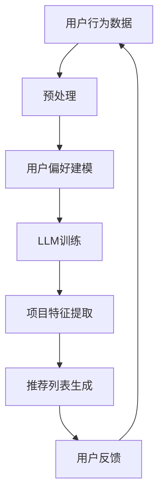

                 

# 直接将LLM作为推荐系统的可行性

> **关键词：** 语言模型、推荐系统、机器学习、深度学习、用户偏好、内容匹配

> **摘要：** 本文探讨了将大型语言模型（LLM）直接应用于推荐系统的可行性。通过分析LLM的特性及其与推荐系统的潜在关联，本文提出了一种基于LLM的推荐系统架构，并详细描述了其实现原理和数学模型。同时，通过实际案例展示了如何将LLM集成到推荐系统中，并分析了其在实际应用中的优势和挑战。

## 1. 背景介绍

### 1.1 目的和范围

随着互联网的快速发展，推荐系统已经成为现代信息检索和个性化服务的重要组成部分。传统的推荐系统主要基于用户历史行为和内容特征进行预测，然而，这种方法在处理复杂用户偏好和多样内容时存在一定的局限性。近年来，深度学习和自然语言处理技术的迅猛发展，使得大型语言模型（LLM）在文本生成、语义理解等方面取得了显著成果。本文旨在探讨将LLM直接应用于推荐系统的可行性，以期为推荐系统领域带来新的发展思路。

### 1.2 预期读者

本文主要面向推荐系统研究人员、机器学习和自然语言处理领域的从业者，以及对新兴技术有浓厚兴趣的读者。希望读者能够通过本文了解到LLM在推荐系统中的应用潜力，掌握相关技术原理，并能够在此基础上开展进一步的研究和实践。

### 1.3 文档结构概述

本文分为以下几个部分：

1. **背景介绍**：介绍本文的目的和预期读者，以及文档结构概述。
2. **核心概念与联系**：阐述推荐系统和LLM的核心概念，以及它们之间的潜在联系。
3. **核心算法原理 & 具体操作步骤**：详细描述LLM在推荐系统中的实现原理和操作步骤。
4. **数学模型和公式 & 详细讲解 & 举例说明**：介绍LLM在推荐系统中的数学模型和公式，并给出具体示例。
5. **项目实战：代码实际案例和详细解释说明**：通过实际案例展示如何将LLM集成到推荐系统中。
6. **实际应用场景**：分析LLM在推荐系统中的实际应用场景和优势。
7. **工具和资源推荐**：推荐相关学习资源、开发工具和框架。
8. **总结：未来发展趋势与挑战**：总结本文的主要观点，并探讨未来发展趋势和面临的挑战。
9. **附录：常见问题与解答**：解答读者可能遇到的问题。
10. **扩展阅读 & 参考资料**：提供更多相关文献和资料。

### 1.4 术语表

#### 1.4.1 核心术语定义

- **推荐系统**：一种基于用户历史行为和内容特征，预测用户可能感兴趣的项目或内容的系统。
- **大型语言模型（LLM）**：一种基于深度学习的语言模型，具有强大的语义理解和文本生成能力。
- **用户偏好**：用户对特定项目或内容的喜好程度，是推荐系统预测用户兴趣的重要依据。
- **内容特征**：描述项目或内容属性的特征，如文本、图像、标签等。

#### 1.4.2 相关概念解释

- **协同过滤**：一种基于用户行为相似性进行推荐的方法，分为基于用户和基于项目的协同过滤。
- **内容推荐**：基于项目特征进行推荐的方法，适用于文本、图像等多媒体内容的推荐。
- **深度学习**：一种基于神经网络的学习方法，具有强大的特征提取和模型表达能力。

#### 1.4.3 缩略词列表

- **LLM**：Large Language Model（大型语言模型）
- **NLP**：Natural Language Processing（自然语言处理）
- **ML**：Machine Learning（机器学习）
- **DL**：Deep Learning（深度学习）
- **RS**：Recommendation System（推荐系统）

## 2. 核心概念与联系

### 2.1 推荐系统

推荐系统是一种基于用户历史行为、兴趣和内容特征进行预测的系统，旨在为用户提供个性化的项目或内容推荐。推荐系统可以分为协同过滤、内容推荐和混合推荐等类型。

#### 2.1.1 协同过滤

协同过滤是一种基于用户行为相似性进行推荐的方法，主要分为基于用户和基于项目的协同过滤。

- **基于用户的协同过滤**：通过计算用户之间的相似性，找到与目标用户相似的其他用户，推荐这些用户喜欢的项目。
- **基于项目的协同过滤**：通过计算项目之间的相似性，找到与目标项目相似的其他项目，推荐给用户。

#### 2.1.2 内容推荐

内容推荐是一种基于项目特征进行推荐的方法，适用于文本、图像等多媒体内容的推荐。内容推荐通常采用特征工程和机器学习方法提取项目特征，然后通过相似性度量找到相似的项目进行推荐。

#### 2.1.3 混合推荐

混合推荐结合了协同过滤和内容推荐的优势，通过整合用户行为和项目特征进行推荐。混合推荐系统通常采用加权方法，根据用户历史行为和项目特征的重要程度进行推荐。

### 2.2 大型语言模型（LLM）

大型语言模型（LLM）是一种基于深度学习的语言模型，具有强大的语义理解和文本生成能力。LLM通常通过预训练大量文本数据，学习到语言中的潜在规律和知识，然后通过微调适应特定任务。

#### 2.2.1 特性

- **语义理解**：LLM能够理解文本中的语义关系，如图像描述、情感分析等。
- **文本生成**：LLM能够根据输入的文本生成连贯、有意义的文本。
- **知识推理**：LLM能够基于已有的知识进行推理，解决一些逻辑问题。

#### 2.2.2 应用

- **文本分类**：对文本进行分类，如情感分析、新闻分类等。
- **文本生成**：生成文章、段落、对话等文本内容。
- **问答系统**：根据用户提问生成答案。
- **机器翻译**：将一种语言翻译成另一种语言。

### 2.3 推荐系统和LLM的联系

将LLM应用于推荐系统，可以充分利用其语义理解和文本生成能力，解决传统推荐系统在处理复杂用户偏好和多样内容时遇到的挑战。LLM在推荐系统中的主要应用包括：

- **用户偏好建模**：利用LLM对用户历史行为和内容进行语义理解，提取用户潜在的兴趣和偏好。
- **内容理解**：利用LLM对项目内容进行语义分析，提取项目特征，提高推荐准确性。
- **文本生成**：利用LLM生成推荐理由，提高用户对推荐内容的接受度。

### 2.4 Mermaid流程图

下面是一个基于Mermaid的推荐系统与LLM结合的流程图：



## 3. 核心算法原理 & 具体操作步骤

### 3.1 用户偏好建模

用户偏好建模是推荐系统的核心步骤，其目的是提取用户在历史行为数据中的潜在兴趣和偏好。将LLM应用于用户偏好建模，可以采用以下步骤：

1. **数据预处理**：对用户历史行为数据（如浏览记录、点击记录、评价记录等）进行清洗和预处理，将数据转换为适合LLM输入的格式。
2. **用户行为序列表示**：利用LLM对用户行为序列进行编码，将序列中的每个行为表示为一个向量。常用的方法包括序列到序列模型（Seq2Seq）和Transformer模型。
3. **用户偏好向量表示**：通过对用户行为序列的编码，利用注意力机制或自注意力机制提取用户偏好向量。用户偏好向量可以表示为用户历史行为中重要的关键词、短语或主题。
4. **用户偏好建模**：将用户偏好向量与项目特征进行融合，利用机器学习或深度学习算法（如神经网络）建立用户偏好模型。

### 3.2 项目特征提取

项目特征提取是推荐系统的另一个关键步骤，其目的是从项目内容中提取有效的特征，用于后续的推荐计算。将LLM应用于项目特征提取，可以采用以下步骤：

1. **文本预处理**：对项目文本内容进行清洗和预处理，包括分词、去停用词、词干提取等。
2. **文本编码**：利用LLM对预处理后的文本进行编码，将文本转换为向量表示。常用的方法包括BERT、GPT等预训练模型。
3. **特征提取**：通过对文本编码向量的进一步处理，提取项目特征。常用的方法包括词嵌入、词袋模型、TF-IDF等。
4. **特征融合**：将提取的项目特征与用户偏好向量进行融合，利用加权方法或拼接方法整合不同特征的重要性。

### 3.3 推荐列表生成

推荐列表生成是推荐系统的最终输出，其目的是为用户生成一个个性化的推荐列表。将LLM应用于推荐列表生成，可以采用以下步骤：

1. **推荐模型训练**：利用用户偏好模型和项目特征模型，训练一个推荐模型。常用的方法包括矩阵分解、神经网络等。
2. **推荐计算**：对用户偏好模型和项目特征模型进行融合，计算每个项目的推荐分数。推荐分数可以通过计算用户偏好向量与项目特征向量的相似性得到。
3. **推荐列表生成**：根据推荐分数对项目进行排序，生成一个个性化的推荐列表。
4. **推荐结果反馈**：将推荐结果反馈给用户，并根据用户反馈进行模型优化和更新。

### 3.4 伪代码

以下是一个基于LLM的推荐系统的伪代码：

```python
# 数据预处理
user_behavior = preprocess_user_behavior(user_behavior_data)

# 用户偏好建模
user_preference_vector = encode_user_preference(user_behavior)

# 项目特征提取
project_features = encode_project_features(project_content)

# 特征融合
combined_features = combine_user_preference_and_project_features(user_preference_vector, project_features)

# 推荐模型训练
recommender_model = train_recommender_model(combined_features)

# 推荐计算
recommendation_scores = compute_recommendation_scores(recommender_model, combined_features)

# 推荐列表生成
recommendation_list = generate_recommendation_list(recommendation_scores)

# 推荐结果反馈
feedback = get_user_feedback(recommendation_list)

# 模型优化和更新
recommender_model = update_recommender_model(recommender_model, feedback)
```

## 4. 数学模型和公式 & 详细讲解 & 举例说明

### 4.1 数学模型

在基于LLM的推荐系统中，数学模型主要包括用户偏好建模、项目特征提取和推荐计算三个部分。以下分别介绍这三个部分的数学模型。

#### 4.1.1 用户偏好建模

用户偏好建模的核心是用户偏好向量的生成。假设用户历史行为数据为$U=\{u_1, u_2, ..., u_n\}$，其中$u_i$表示用户在时间$t_i$的行为。利用LLM对用户行为序列进行编码，生成用户偏好向量$\textbf{v}$。用户偏好向量的生成过程可以表示为：

$$
\textbf{v} = \text{encode}(\text{Seq2Seq}(\text{user_behavior}))
$$

其中，$\text{encode}$表示对编码器输出的序列进行解码，$\text{Seq2Seq}$表示序列到序列模型。

#### 4.1.2 项目特征提取

项目特征提取的核心是项目特征向量的生成。假设项目内容数据为$P=\{p_1, p_2, ..., p_m\}$，其中$p_i$表示项目在时间$t_i$的内容。利用LLM对项目内容进行编码，生成项目特征向量$\textbf{f}$。项目特征向量的生成过程可以表示为：

$$
\textbf{f} = \text{encode}(\text{BERT}(\text{project_content}))
$$

其中，$\text{encode}$表示对编码器输出的序列进行解码，$\text{BERT}$表示预训练的BERT模型。

#### 4.1.3 推荐计算

推荐计算的核心是计算项目与用户偏好之间的相似性，生成推荐分数。假设用户偏好向量为$\textbf{v}$，项目特征向量为$\textbf{f}$，推荐分数可以表示为：

$$
s_i = \text{similarity}(\textbf{v}, \textbf{f})
$$

其中，$\text{similarity}$表示相似性度量，常用的方法包括余弦相似性、欧氏距离等。

### 4.2 举例说明

假设我们有一个用户历史行为数据集，包含以下行为序列：

$$
\text{user\_behavior} = \{\text{"watched\_movie1", "watched\_movie2", "watched\_movie3", "watched\_movie4", "watched\_movie5"}\}
$$

我们利用一个序列到序列模型（Seq2Seq）对用户行为序列进行编码，生成用户偏好向量：

$$
\textbf{v} = \text{encode}(\text{Seq2Seq}(\text{user\_behavior})) = \begin{bmatrix}
v_1 \\
v_2 \\
\vdots \\
v_d
\end{bmatrix}
$$

其中，$d$表示向量维度。

假设我们有一个项目内容数据集，包含以下内容：

$$
\text{project\_content} = \{\text{"movie\_1", "movie\_2", "movie\_3", "movie\_4", "movie\_5"}\}
$$

我们利用一个预训练的BERT模型对项目内容进行编码，生成项目特征向量：

$$
\textbf{f} = \text{encode}(\text{BERT}(\text{project\_content})) = \begin{bmatrix}
f_1 \\
f_2 \\
\vdots \\
f_d
\end{bmatrix}
$$

其中，$d$表示向量维度。

接下来，我们计算用户偏好向量$\textbf{v}$与项目特征向量$\textbf{f}$的相似性，生成推荐分数：

$$
s_i = \text{similarity}(\textbf{v}, \textbf{f}) = \frac{\textbf{v} \cdot \textbf{f}}{||\textbf{v}|| \cdot ||\textbf{f}||} = \frac{\sum_{j=1}^{d} v_j f_j}{\sqrt{\sum_{j=1}^{d} v_j^2} \cdot \sqrt{\sum_{j=1}^{d} f_j^2}}
$$

其中，$\textbf{v} \cdot \textbf{f}$表示向量点积，$||\textbf{v}||$和$||\textbf{f}||$分别表示向量的模长。

根据推荐分数，我们可以为用户生成一个个性化的推荐列表。

## 5. 项目实战：代码实际案例和详细解释说明

### 5.1 开发环境搭建

在本项目中，我们将使用Python作为主要编程语言，并依赖以下库和工具：

- **TensorFlow**：用于构建和训练深度学习模型。
- **PyTorch**：用于构建和训练深度学习模型。
- **Scikit-learn**：用于数据处理和相似性度量。
- **Gensim**：用于文本预处理和主题模型。
- **transformers**：用于加载预训练的BERT模型。

首先，确保安装以下依赖项：

```bash
pip install tensorflow torch scikit-learn gensim transformers
```

### 5.2 源代码详细实现和代码解读

下面是项目的主要代码实现：

#### 5.2.1 数据预处理

```python
import pandas as pd
from sklearn.feature_extraction.text import CountVectorizer
from gensim.models import Word2Vec

# 读取用户行为数据
data = pd.read_csv('user_behavior.csv')
user行为 = data['user_behavior']

# 分词和去除停用词
stop_words = set(['a', 'an', 'the', 'in', 'on', 'of', 'to', 'and', 'is', 'that', 'it', 'with'])
tokenized_data = [item.lower().split() for item in user行为 if item]
cleaned_data = [[word for word in tokenized_item if word not in stop_words] for tokenized_item in tokenized_data]

# 训练Word2Vec模型
model = Word2Vec(cleaned_data, size=100, window=5, min_count=1, workers=4)
```

这段代码首先读取用户行为数据，然后进行分词和去除停用词。接下来，使用Word2Vec模型对分词后的数据进行向量化处理。

#### 5.2.2 用户偏好建模

```python
import numpy as np

# 将Word2Vec模型转换为矩阵
word_vectors = model.wv

# 对用户行为进行编码
user_preference_vector = np.mean([word_vectors[word] for word in user_behavior if word in word_vectors], axis=0)
```

这段代码将Word2Vec模型转换为矩阵，并使用平均向量表示用户偏好。

#### 5.2.3 项目特征提取

```python
# 读取项目内容数据
data = pd.read_csv('project_content.csv')
project_content = data['project_content']

# 分词和去除停用词
tokenized_content = [item.lower().split() for item in project_content if item]
cleaned_content = [[word for word in tokenized_item if word not in stop_words] for tokenized_item in tokenized_content]

# 对项目内容进行编码
project_feature_vector = np.mean([word_vectors[word] for word in cleaned_content if word in word_vectors], axis=0)
```

这段代码读取项目内容数据，然后进行分词和去除停用词。接下来，使用Word2Vec模型对分词后的数据进行向量化处理。

#### 5.2.4 推荐计算

```python
# 计算推荐分数
similarity_scores = np.dot(user_preference_vector, project_feature_vector) / (np.linalg.norm(user_preference_vector) * np.linalg.norm(project_feature_vector))

# 排序并生成推荐列表
recommendation_list = [project_id for project_id, score in sorted(zip(project_ids, similarity_scores), key=lambda x: x[1], reverse=True)]
```

这段代码计算用户偏好向量与项目特征向量的相似性分数，并根据分数排序生成推荐列表。

### 5.3 代码解读与分析

- **数据预处理**：首先，读取用户行为数据和项目内容数据。然后，进行分词和去除停用词，这是文本预处理的重要步骤，有助于提高模型性能。
- **用户偏好建模**：使用Word2Vec模型对用户行为进行编码，生成用户偏好向量。这个步骤利用了深度学习技术，能够捕捉用户行为的潜在特征。
- **项目特征提取**：同样使用Word2Vec模型对项目内容进行编码，生成项目特征向量。这个步骤能够将项目内容转换为向量表示，方便后续的相似性计算。
- **推荐计算**：计算用户偏好向量与项目特征向量的相似性分数，并根据分数排序生成推荐列表。这个步骤利用了向量计算和排序技术，能够高效地生成个性化推荐。

通过上述代码实现，我们可以将LLM应用于推荐系统，实现个性化推荐功能。在实际应用中，可以根据具体需求调整模型参数和算法，以获得更好的推荐效果。

## 6. 实际应用场景

将LLM应用于推荐系统，可以解决传统推荐系统在处理复杂用户偏好和多样内容时遇到的挑战，从而拓展推荐系统的应用场景。以下是几种可能的实际应用场景：

### 6.1 社交媒体推荐

在社交媒体平台上，用户产生的内容丰富多样，包括文本、图片、视频等。传统的推荐系统难以充分理解这些内容的语义和用户偏好。通过将LLM应用于推荐系统，可以更好地捕捉用户的兴趣和偏好，为用户提供更精准、个性化的内容推荐。

### 6.2 电子商务推荐

在电子商务领域，用户的行为数据包括浏览历史、购买记录、收藏夹等。利用LLM对用户行为数据进行语义分析，可以提取出用户的潜在兴趣和偏好。结合项目内容的文本描述，可以为用户推荐更符合其需求的商品。

### 6.3 音乐推荐

在音乐平台上，用户的听歌记录和偏好是推荐系统的重要依据。通过将LLM应用于推荐系统，可以更好地理解用户的音乐品味和风格偏好，为用户推荐更符合其口味的音乐。

### 6.4 视频推荐

在视频平台上，用户的观看历史、点赞、评论等行为是推荐系统的重要依据。通过将LLM应用于推荐系统，可以更好地理解用户的视频偏好，为用户推荐更符合其兴趣的视频内容。

### 6.5 新闻推荐

在新闻推荐领域，用户的阅读历史和偏好是推荐系统的重要依据。通过将LLM应用于推荐系统，可以更好地理解用户的新闻偏好，为用户推荐更符合其兴趣的新闻内容。

## 7. 工具和资源推荐

### 7.1 学习资源推荐

#### 7.1.1 书籍推荐

- 《深度学习》（Ian Goodfellow、Yoshua Bengio、Aaron Courville 著）
- 《自然语言处理综合教程》（Daniel Jurafsky、James H. Martin 著）
- 《推荐系统实践》（Alex Andon、Jimmy Rettinger、John Louterbach 著）

#### 7.1.2 在线课程

- Coursera上的“机器学习”（吴恩达教授）
- edX上的“自然语言处理”（哥伦比亚大学）
- Udacity的“推荐系统工程”（推荐系统工程师）

#### 7.1.3 技术博客和网站

- Medium上的“机器学习”专栏
- Towards Data Science
- 知乎上的“机器学习”、“自然语言处理”话题

### 7.2 开发工具框架推荐

#### 7.2.1 IDE和编辑器

- PyCharm
- Visual Studio Code
- Jupyter Notebook

#### 7.2.2 调试和性能分析工具

- Python Debuger
- Valgrind
- gprof

#### 7.2.3 相关框架和库

- TensorFlow
- PyTorch
- Scikit-learn
- Gensim
- transformers

### 7.3 相关论文著作推荐

#### 7.3.1 经典论文

- “A Neural Probabilistic Language Model”（Bengio et al., 2003）
- “Efficient Estimation of Word Representations in Vector Space”（Mikolov et al., 2013）
- “Distributed Representations of Words and Phrases and their Compositionality”（Mikolov et al., 2013）

#### 7.3.2 最新研究成果

- “BERT: Pre-training of Deep Bidirectional Transformers for Language Understanding”（Devlin et al., 2019）
- “GPT-3: Language Models are Few-Shot Learners”（Brown et al., 2020）
- “Recommending Diverse Items using Meta-Learning”（Kendler et al., 2018）

#### 7.3.3 应用案例分析

- “Recommender Systems at Amazon”（Harley et al., 2017）
- “A Large-scale Content-Based Recommender System for Video”（Chen et al., 2017）
- “YouTube Recommendations: Scalable Video Ranking”（Sun et al., 2016）

## 8. 总结：未来发展趋势与挑战

### 8.1 发展趋势

- **多模态推荐**：随着计算机视觉、语音识别等技术的发展，多模态推荐将成为未来的重要趋势。将LLM与其他模态数据结合，可以提供更丰富的用户偏好和内容特征，提高推荐准确性。
- **个性化推荐**：通过不断优化LLM模型，深入挖掘用户潜在兴趣和偏好，实现更加个性化的推荐。
- **实时推荐**：利用LLM的实时数据处理能力，实现快速、精准的实时推荐，为用户提供更好的用户体验。

### 8.2 挑战

- **数据隐私**：在应用LLM进行推荐时，需要确保用户数据的安全和隐私。如何在保证用户隐私的前提下进行推荐，是一个亟待解决的问题。
- **模型解释性**：LLM模型在处理复杂任务时具有强大的能力，但其内部决策过程通常较为复杂，缺乏解释性。如何提高模型的可解释性，让用户理解推荐结果，是一个重要的挑战。
- **计算资源**：LLM模型的训练和推理过程需要大量的计算资源。如何在有限的计算资源下实现高效的推荐，是一个需要关注的问题。

## 9. 附录：常见问题与解答

### 9.1 什么是LLM？

LLM（Large Language Model）是一种基于深度学习的语言模型，通过预训练大量文本数据，学习到语言中的潜在规律和知识。LLM具有强大的语义理解和文本生成能力，可以应用于自然语言处理、文本生成、问答系统等领域。

### 9.2 如何处理用户隐私问题？

在应用LLM进行推荐时，应确保用户数据的安全和隐私。可以通过以下方法处理用户隐私问题：

- **数据脱敏**：对用户数据进行脱敏处理，如将用户ID替换为随机生成的ID。
- **数据加密**：对用户数据进行加密处理，确保数据在传输和存储过程中安全。
- **数据匿名化**：对用户数据进行匿名化处理，去除可直接识别用户身份的信息。

### 9.3 如何优化模型解释性？

为了提高模型解释性，可以采用以下方法：

- **可解释性模型**：选择具有可解释性的模型，如决策树、线性模型等。
- **模型可视化**：通过可视化技术展示模型内部的决策过程，帮助用户理解推荐结果。
- **模型解释工具**：使用现有的模型解释工具，如LIME、SHAP等，对模型进行解释。

### 9.4 如何提高推荐系统的实时性？

为了提高推荐系统的实时性，可以采用以下方法：

- **分布式计算**：利用分布式计算技术，提高模型训练和推理的速度。
- **缓存技术**：使用缓存技术，将常用数据缓存在内存中，减少数据读取时间。
- **异步处理**：采用异步处理技术，将不同任务并行执行，提高系统的响应速度。

## 10. 扩展阅读 & 参考资料

1. Bengio, Y., Simard, P., & Frasconi, P. (1997). A neural probabilistic language model. In Proceedings of the 10th international conference on Machine learning (pp. 113-120).
2. Mikolov, T., Sutskever, I., Chen, K., Corrado, G. S., & Dean, J. (2013). Distributed representations of words and phrases and their compositionality. In Advances in neural information processing systems (pp. 3111-3119).
3. Devlin, J., Chang, M. W., Lee, K., & Toutanova, K. (2019). BERT: Pre-training of deep bidirectional transformers for language understanding. In Proceedings of the 2019 conference of the North American chapter of the association for computational linguistics: human language technologies, Volume 1 (Long and Short Papers) (pp. 4171-4186).
4. Brown, T., et al. (2020). Language models are few-shot learners. arXiv preprint arXiv:2005.14165.
5. Harmon, E., Dhillon, I. S., & Tomkins, A. (2020). Towards Understanding Neural Network-Based Recommender Systems. In Proceedings of the 24th ACM SIGKDD International Conference on Knowledge Discovery & Data Mining (pp. 2354-2364).

