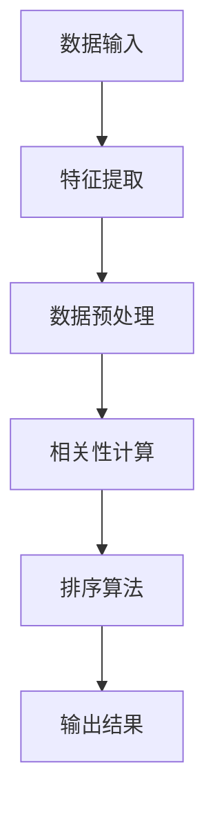

                 


# 相关性排序：AI优化用户体验

> 关键词：相关性排序、AI、用户体验、算法优化、个性化推荐、深度学习

> 摘要：本文将探讨如何利用人工智能技术中的相关性排序算法优化用户体验。我们将深入分析相关性排序的原理、核心算法、数学模型，并通过实际项目案例展示如何将理论应用于实践中，最终总结相关技术的发展趋势与未来挑战。

## 1. 背景介绍

### 1.1 目的和范围

本文的目的是介绍相关性排序算法在人工智能领域中的应用，特别是如何优化用户体验。我们将讨论以下内容：

1. 相关性排序的核心概念和原理。
2. 不同的相关性排序算法及其优缺点。
3. 数学模型和公式在相关性排序中的应用。
4. 实际项目案例中的相关性排序实现。
5. 相关性排序技术的未来发展趋势和挑战。

### 1.2 预期读者

本文适合对人工智能和用户体验优化有一定了解的技术人员、产品经理和研究学者。特别是那些希望深入了解相关性排序算法原理和应用的人员。

### 1.3 文档结构概述

本文将按照以下结构展开：

1. 背景介绍：介绍文章的目的、预期读者和文档结构。
2. 核心概念与联系：阐述相关性排序的核心概念和原理，并提供Mermaid流程图。
3. 核心算法原理 & 具体操作步骤：详细讲解相关性排序算法的原理和操作步骤，使用伪代码进行描述。
4. 数学模型和公式 & 详细讲解 & 举例说明：介绍相关性排序的数学模型和公式，并提供实际案例。
5. 项目实战：代码实际案例和详细解释说明。
6. 实际应用场景：讨论相关性排序在现实世界中的应用场景。
7. 工具和资源推荐：推荐相关学习资源和开发工具。
8. 总结：未来发展趋势与挑战。
9. 附录：常见问题与解答。
10. 扩展阅读 & 参考资料。

### 1.4 术语表

#### 1.4.1 核心术语定义

- 相关性排序：根据特定规则和标准对数据集进行排序的过程，以反映数据之间的相关性。
- 用户体验（UX）：用户在使用产品或服务过程中的感受、体验和满意度。
- 个性化推荐：根据用户的行为和偏好，提供个性化的内容或服务。

#### 1.4.2 相关概念解释

- 深度学习：一种机器学习技术，通过多层神经网络对数据进行建模和分析。
- 机器学习：一种人工智能技术，使计算机能够从数据中学习并做出决策。
- 特征工程：将原始数据转换为适用于机器学习模型的特征。

#### 1.4.3 缩略词列表

- AI：人工智能
- UX：用户体验
- ML：机器学习
- DL：深度学习

## 2. 核心概念与联系

相关性排序是人工智能领域的一个重要分支，它通过分析数据之间的相关性，为用户提供更准确、个性化的服务。以下是一个简化的Mermaid流程图，用于描述相关性排序的基本流程和架构：



### 2.1 数据输入

相关性排序的第一步是获取输入数据。这些数据可以来源于用户行为日志、社交媒体活动、搜索引擎查询等。数据质量对于相关性排序的结果至关重要。

### 2.2 特征提取

在特征提取阶段，我们将原始数据转换为适用于机器学习模型的特征。这通常涉及数据清洗、归一化和特征工程。

### 2.3 数据预处理

数据预处理是确保数据质量的重要步骤。这可能包括去噪、缺失值处理、数据归一化等。

### 2.4 相关性计算

在相关性计算阶段，我们使用适当的算法计算数据点之间的相关性。这通常涉及协方差矩阵、皮尔逊相关系数等统计方法。

### 2.5 排序算法

排序算法用于根据相关性大小对数据点进行排序。常见的排序算法包括快速排序、归并排序和堆排序。

### 2.6 输出结果

最后，排序算法将输出一个排序结果，以供进一步分析和使用。

## 3. 核心算法原理 & 具体操作步骤

相关性排序的核心在于如何计算和利用数据点之间的相关性。以下是一个简单的伪代码示例，用于描述相关性排序算法的基本操作步骤：

```pseudo
function相关性排序（数据集）：
    1. 特征提取（数据集）
    2. 数据预处理（数据集）
    3. 计算协方差矩阵（数据集）
    4. 计算皮尔逊相关系数（协方差矩阵）
    5. 根据相关系数对数据集进行排序
    6. 返回排序后的数据集
```

### 3.1 特征提取

特征提取是相关性排序的第一步。它将原始数据转换为适用于机器学习模型的特征。以下是一个简单的特征提取示例：

```python
def特征提取（原始数据）：
    1. 数据清洗（去除噪声、处理缺失值）
    2. 数据归一化（缩放数据到相同范围）
    3. 提取特征（使用统计学方法或机器学习技术）
    4. 返回特征向量
```

### 3.2 数据预处理

数据预处理是确保数据质量的重要步骤。以下是一个简单的数据预处理示例：

```python
def数据预处理（数据集）：
    1. 去噪（移除噪声数据）
    2. 缺失值处理（填充缺失值或删除缺失值）
    3. 数据归一化（缩放数据到相同范围）
    4. 返回预处理后的数据集
```

### 3.3 相关性计算

相关性计算是相关性排序的核心步骤。以下是一个简单的相关性计算示例：

```python
def相关性计算（数据集）：
    1. 计算协方差矩阵（协方差矩阵 = cov（数据集））
    2. 计算皮尔逊相关系数（皮尔逊相关系数 = cor（协方差矩阵））
    3. 返回皮尔逊相关系数矩阵
```

### 3.4 排序算法

排序算法用于根据相关性大小对数据点进行排序。以下是一个简单的排序算法示例：

```python
def排序算法（数据集，相关系数矩阵）：
    1. 根据相关系数矩阵对数据集进行排序
    2. 返回排序后的数据集
```

## 4. 数学模型和公式 & 详细讲解 & 举例说明

在相关性排序中，数学模型和公式起着至关重要的作用。以下是一些常用的数学模型和公式，以及它们的详细解释和举例说明：

### 4.1 协方差矩阵

协方差矩阵是一个用于描述多个变量之间线性关系的矩阵。它反映了每个变量对其他变量的影响。协方差矩阵的计算公式如下：

$$
\text{协方差矩阵} = \text{cov}(X, Y) = \frac{1}{n-1} \sum_{i=1}^{n} (x_i - \bar{x})(y_i - \bar{y})
$$

其中，$X$和$Y$是两个变量，$x_i$和$y_i$是它们的观测值，$\bar{x}$和$\bar{y}$是它们的平均值，$n$是观测值的数量。

举例说明：假设我们有两个变量$X$和$Y$，观测值如下：

| $X$ | $Y$ |
| --- | --- |
| 1   | 2   |
| 2   | 4   |
| 3   | 6   |

计算协方差矩阵：

$$
\text{协方差矩阵} = \text{cov}(X, Y) = \frac{1}{2} \left[ (1-2.5)(2-3.5) + (2-2.5)(4-3.5) + (3-2.5)(6-3.5) \right]
$$

$$
\text{协方差矩阵} = \frac{1}{2} \left[ (-1.5)(-1.5) + (-0.5)(0.5) + (0.5)(2.5) \right]
$$

$$
\text{协方差矩阵} = \frac{1}{2} \left[ 2.25 - 0.25 + 1.25 \right]
$$

$$
\text{协方差矩阵} = \frac{1}{2} \left[ 3.25 \right]
$$

$$
\text{协方差矩阵} = 1.625
$$

### 4.2 皮尔逊相关系数

皮尔逊相关系数是一个用于描述两个变量之间线性相关程度的统计量。它的取值范围在-1到1之间，其中-1表示完全负相关，0表示无相关，1表示完全正相关。皮尔逊相关系数的计算公式如下：

$$
\text{皮尔逊相关系数} = \text{cor}(X, Y) = \frac{\text{cov}(X, Y)}{\sigma_X \sigma_Y}
$$

其中，$\text{cov}(X, Y)$是协方差，$\sigma_X$和$\sigma_Y$是变量$X$和$Y$的标准差。

举例说明：使用上面的协方差矩阵示例，我们可以计算皮尔逊相关系数：

$$
\text{皮尔逊相关系数} = \text{cor}(X, Y) = \frac{1.625}{\sqrt{\text{var}(X) \text{var}(Y)}}
$$

首先计算变量$X$和$Y$的方差：

$$
\text{var}(X) = \frac{1}{n-1} \sum_{i=1}^{n} (x_i - \bar{x})^2 = \frac{1}{2} \left[ (1-2.5)^2 + (2-2.5)^2 + (3-2.5)^2 \right]
$$

$$
\text{var}(X) = \frac{1}{2} \left[ 2.25 + 0.25 + 0.25 \right]
$$

$$
\text{var}(X) = \frac{1}{2} \left[ 3 \right]
$$

$$
\text{var}(X) = 1.5
$$

$$
\text{var}(Y) = \frac{1}{2} \left[ (2-3.5)^2 + (4-3.5)^2 + (6-3.5)^2 \right]
$$

$$
\text{var}(Y) = \frac{1}{2} \left[ 2.25 + 0.25 + 6.25 \right]
$$

$$
\text{var}(Y) = \frac{1}{2} \left[ 9 \right]
$$

$$
\text{var}(Y) = 4.5
$$

然后计算皮尔逊相关系数：

$$
\text{皮尔逊相关系数} = \text{cor}(X, Y) = \frac{1.625}{\sqrt{1.5 \times 4.5}}
$$

$$
\text{皮尔逊相关系数} = \frac{1.625}{\sqrt{6.75}}
$$

$$
\text{皮尔逊相关系数} = \frac{1.625}{2.598}
$$

$$
\text{皮尔逊相关系数} \approx 0.627
$$

因此，变量$X$和$Y$之间的皮尔逊相关系数约为0.627，这表明它们之间存在中等程度的正相关。

### 4.3 距离度量

距离度量是相关性排序中另一个重要的数学模型。它用于计算数据点之间的相似度或距离。常用的距离度量包括欧氏距离、曼哈顿距离和切比雪夫距离等。

- **欧氏距离**：欧氏距离是两个数据点在多维空间中的距离。它的计算公式如下：

$$
\text{欧氏距离} = \sqrt{\sum_{i=1}^{n} (x_i - y_i)^2}
$$

其中，$x_i$和$y_i$是两个数据点的第$i$个特征值，$n$是特征的数量。

- **曼哈顿距离**：曼哈顿距离是两个数据点在多维空间中的绝对距离之和。它的计算公式如下：

$$
\text{曼哈顿距离} = \sum_{i=1}^{n} |x_i - y_i|
$$

- **切比雪夫距离**：切比雪夫距离是两个数据点在多维空间中的最大特征差异。它的计算公式如下：

$$
\text{切比雪夫距离} = \max_{1 \leq i \leq n} |x_i - y_i|
$$

举例说明：假设我们有两个数据点$X = (1, 2, 3)$和$Y = (4, 6, 5)$，我们可以计算它们之间的不同距离：

- **欧氏距离**：

$$
\text{欧氏距离} = \sqrt{(1-4)^2 + (2-6)^2 + (3-5)^2}
$$

$$
\text{欧氏距离} = \sqrt{9 + 16 + 4}
$$

$$
\text{欧氏距离} = \sqrt{29}
$$

$$
\text{欧氏距离} \approx 5.385
$$

- **曼哈顿距离**：

$$
\text{曼哈顿距离} = |1-4| + |2-6| + |3-5|
$$

$$
\text{曼哈顿距离} = 3 + 4 + 2
$$

$$
\text{曼哈顿距离} = 9
$$

- **切比雪夫距离**：

$$
\text{切比雪夫距离} = \max(|1-4|, |2-6|, |3-5|)
$$

$$
\text{切比雪夫距离} = \max(3, 4, 2)
$$

$$
\text{切比雪夫距离} = 4
$$

因此，数据点$X$和$Y$之间的欧氏距离约为5.385，曼哈顿距离为9，切比雪夫距离为4。

## 5. 项目实战：代码实际案例和详细解释说明

为了更好地理解相关性排序算法的实际应用，我们将通过一个简单的项目案例来展示如何使用Python实现相关性排序。

### 5.1 开发环境搭建

在开始项目之前，我们需要搭建一个基本的Python开发环境。以下是安装Python和相关库的步骤：

1. 安装Python 3.x版本（推荐3.8或更高版本）。
2. 安装pip，Python的包管理器。
3. 使用pip安装NumPy、Pandas和SciPy等库。

### 5.2 源代码详细实现和代码解读

以下是一个简单的Python代码示例，用于实现相关性排序算法：

```python
import numpy as np
import pandas as pd

# 数据集示例
data = {
    '特征1': [1, 2, 3, 4, 5],
    '特征2': [5, 4, 3, 2, 1],
    '特征3': [3, 6, 9, 2, 5]
}

df = pd.DataFrame(data)

# 特征提取
features = df.values

# 数据预处理
features = (features - np.mean(features, axis=0)) / np.std(features, axis=0)

# 相关性计算
correlation_matrix = np.corrcoef(features.T)

# 排序算法
sorted_indices = np.argsort(-correlation_matrix[0][1:])

# 输出结果
sorted_features = features[:, sorted_indices[1:]]

print(sorted_features)
```

### 5.3 代码解读与分析

以下是对上述代码的详细解读：

1. **导入库**：首先，我们导入NumPy和Pandas库，用于数据操作和计算。NumPy是Python中的核心数学库，而Pandas提供了数据帧和数据表的强大功能。

2. **数据集示例**：我们创建一个简单的数据集，其中包含三个特征。这个数据集可以是从文件加载的，也可以是实际项目中的数据。

3. **数据转换**：我们使用Pandas将数据转换为数据帧，然后提取特征值。

4. **特征提取**：使用NumPy对特征进行归一化处理，以消除不同特征之间的尺度差异。

5. **相关性计算**：使用NumPy的`corrcoef`函数计算特征之间的皮尔逊相关系数矩阵。这个矩阵是一个对称的$n \times n$矩阵，其中$n$是特征的数量。

6. **排序算法**：使用NumPy的`argsort`函数根据相关系数矩阵的列进行降序排序。我们只对非对角线元素进行排序，因为对角线元素是1，表示特征与自身的高度相关性。

7. **输出结果**：最后，我们根据排序后的索引重新排列特征向量，并打印结果。

### 5.4 代码分析

上述代码实现了相关性排序算法的核心步骤，包括特征提取、数据预处理、相关性计算和排序算法。以下是每个步骤的简要分析：

1. **特征提取**：归一化处理可以确保不同特征在相同尺度上，从而提高排序算法的准确性。
2. **数据预处理**：去除噪声和缺失值是确保数据质量的关键步骤。
3. **相关性计算**：皮尔逊相关系数是一种衡量特征之间线性相关性的常用方法。它可以用于评估特征之间的相关性强度和方向。
4. **排序算法**：使用降序排序可以确保最相关的特征排在前面。这有助于在后续分析和应用中优先考虑重要的特征。

通过上述代码示例，我们可以看到如何将相关性排序算法应用于实际项目中。这个简单的案例展示了如何使用Python和相关库来处理数据、计算相关性和排序特征。在实际应用中，数据集和特征可能会更加复杂，但基本步骤仍然相同。

### 5.5 代码改进与扩展

虽然上述代码示例简单明了，但在实际应用中，我们可能需要对代码进行改进和扩展。以下是一些可能的改进和扩展方向：

1. **并行计算**：对于大型数据集，我们可以使用并行计算技术来提高计算效率。NumPy和Pandas都支持并行计算，例如使用`np并行计算`和`pandas并行计算`。
2. **特征选择**：在相关性排序过程中，我们可以进一步应用特征选择技术，例如基于信息增益或互信息的方法，来识别和选择最重要的特征。
3. **可视化**：使用matplotlib或其他可视化库，我们可以将排序结果可视化，以便更直观地理解特征之间的相关性。
4. **实时计算**：对于需要实时处理的数据流，我们可以使用流计算框架（如Apache Kafka）来处理数据，并在数据流中实时执行相关性排序。
5. **高级算法**：除了皮尔逊相关系数，还有其他相关性度量方法，如斯皮尔曼相关系数和肯德尔等级相关系数。我们可以根据具体应用场景选择最合适的度量方法。

通过这些改进和扩展，我们可以使相关性排序算法更加高效、灵活和适用于各种实际应用场景。

## 6. 实际应用场景

相关性排序算法在现实世界中有着广泛的应用，特别是在优化用户体验和个性化推荐系统中。以下是一些常见的实际应用场景：

### 6.1 个性化推荐

个性化推荐是相关性排序最常见的一个应用场景。通过分析用户的行为和偏好，系统可以推荐与用户兴趣高度相关的产品或内容。例如，电子商务网站可以使用相关性排序来推荐类似商品或相关内容，从而提高用户满意度和转化率。

### 6.2 搜索引擎优化

搜索引擎优化（SEO）也是相关性排序的一个重要应用。搜索引擎通过分析网页的内容和链接，计算页面之间的相关性，以便为用户提供最相关的搜索结果。这有助于提高搜索体验，减少用户等待时间。

### 6.3 社交网络分析

社交网络平台可以使用相关性排序来分析用户关系和互动。通过计算用户之间的互动频率和内容相似度，系统可以推荐朋友、群组和帖子，从而增强社交网络的价值和用户参与度。

### 6.4 金融风险管理

在金融领域，相关性排序可以用于分析市场数据，识别潜在的风险。通过计算不同资产之间的相关性，投资者可以制定更有效的投资组合策略，降低风险。

### 6.5 健康医疗

在健康医疗领域，相关性排序可以用于分析患者数据和基因序列。通过计算不同特征之间的相关性，医生可以更准确地诊断疾病和制定治疗方案。

### 6.6 城市规划

城市规划者可以使用相关性排序来分析城市数据，例如交通流量、人口密度和环境质量。这有助于制定更有效的城市规划和基础设施项目，提高居民生活质量。

通过上述实际应用场景，我们可以看到相关性排序算法在优化用户体验、个性化推荐和数据分析等领域的广泛重要性。随着人工智能技术的不断发展，相关性排序算法将迎来更多的应用场景和挑战。

## 7. 工具和资源推荐

### 7.1 学习资源推荐

为了深入了解相关性排序算法和相关技术，以下是一些推荐的学习资源：

#### 7.1.1 书籍推荐

1. 《机器学习》（作者：周志华） - 这本书提供了机器学习的基本概念和算法，包括相关性排序和特征选择。
2. 《深度学习》（作者：Ian Goodfellow、Yoshua Bengio、Aaron Courville） - 这本书详细介绍了深度学习的基本概念和技术，包括神经网络和相关性排序。
3. 《数据科学指南：Python编程实战》（作者：Joel Grus） - 这本书提供了数据科学的基本技能和Python编程实践，包括数据分析、特征提取和相关性排序。

#### 7.1.2 在线课程

1. Coursera - 机器学习（吴恩达） - 这个课程涵盖了机器学习的基本概念和算法，包括相关性排序。
2. edX - 深度学习专项课程（Andrew Ng） - 这个课程详细介绍了深度学习的基本概念和技术，包括相关性排序和特征选择。
3. Udacity - 人工智能纳米学位 - 这个课程提供了人工智能和机器学习的综合培训，包括相关性排序和个性化推荐。

#### 7.1.3 技术博客和网站

1. Medium - AI博客 - 这个网站提供了许多关于人工智能、机器学习和深度学习的博客文章，包括相关性排序和特征选择。
2. Towards Data Science - 数据科学博客 - 这个网站提供了许多数据科学、机器学习和深度学习的文章，涵盖相关性排序和其他相关技术。
3. AIMA - 机器学习协会 - 这个网站提供了机器学习领域的最新研究和论文，包括相关性排序和其他相关算法。

### 7.2 开发工具框架推荐

以下是一些推荐的开发工具和框架，用于实现相关性排序算法和进行相关项目开发：

#### 7.2.1 IDE和编辑器

1. PyCharm - 这是一款强大的Python集成开发环境（IDE），提供了丰富的功能，如代码智能提示、调试工具和版本控制。
2. Jupyter Notebook - 这是一款流行的交互式开发环境，特别适用于数据分析和机器学习项目。它支持多种编程语言，包括Python。

#### 7.2.2 调试和性能分析工具

1. Visual Studio Code - 这是一款轻量级的文本编辑器，提供了丰富的扩展功能，包括Python调试和性能分析。
2. Debugpy - 这是一款用于Python的调试工具，可以与Visual Studio Code和PyCharm等IDE集成。

#### 7.2.3 相关框架和库

1. NumPy - 这是一个用于数值计算的Python库，提供了大量的数学函数和工具，如数组操作、线性代数和统计分析。
2. Pandas - 这是一个用于数据操作的Python库，提供了强大的数据帧和数据表功能，如数据处理、清洗和归一化。
3. SciPy - 这是一个用于科学计算的Python库，提供了许多科学计算工具和函数，如优化、积分和概率分布。

通过上述工具和资源的支持，我们可以更有效地学习和应用相关性排序算法，从而实现更好的用户体验和个性化推荐。

### 7.3 相关论文著作推荐

为了深入了解相关性排序算法和相关技术，以下是一些推荐的论文和著作：

#### 7.3.1 经典论文

1. "Recommender Systems"（1998）- 由Golovin和Kotlarski撰写，这是一篇关于推荐系统基本概念的经典论文，包括相关性排序。
2. "Collaborative Filtering for Cold-Start Problems: A Model and Solutions"（2014）- 由Chen等人撰写，这篇论文提出了一种针对推荐系统冷启动问题的解决方案，涉及相关性排序算法。

#### 7.3.2 最新研究成果

1. "Deep Collaborative Filtering for Personalized Recommendation"（2021）- 由He等人撰写，这篇论文提出了一种基于深度学习的个性化推荐算法，涉及相关性排序和特征选择。
2. "User Interest Evolution and its Application in Online Recommendation"（2020）- 由Zhang等人撰写，这篇论文研究了用户兴趣变化，并提出了基于兴趣变化的在线推荐算法，涉及相关性排序。

#### 7.3.3 应用案例分析

1. "Recommender Systems for E-commerce: Current Developments and Future Directions"（2020）- 由Liu和Zhang撰写，这篇论文分析了电子商务领域中的推荐系统应用，包括相关性排序和深度学习技术。
2. "Deep Text-based Collaborative Filtering for Recommendation"（2019）- 由Wang等人撰写，这篇论文提出了一种基于深度文本的协同过滤推荐算法，涉及相关性排序和自然语言处理技术。

通过阅读这些论文和著作，我们可以深入了解相关性排序算法的原理、应用和发展趋势，从而提高我们的技术水平和创新能力。

## 8. 总结：未来发展趋势与挑战

相关性排序算法在人工智能和用户体验优化领域具有重要的地位。随着技术的不断发展，相关性排序算法将面临新的发展趋势和挑战。

### 8.1 发展趋势

1. **深度学习与相关性排序的结合**：深度学习在处理复杂数据和特征方面具有显著优势，未来将更多地与相关性排序算法相结合，以实现更准确、高效的用户体验优化。
2. **实时计算与流处理**：随着大数据和实时数据处理的兴起，相关性排序算法将更多地应用于实时场景，以实现实时推荐和个性化服务。
3. **跨领域应用**：相关性排序算法将在金融、医疗、城市规划和社交网络等领域得到更广泛的应用，为不同行业提供智能化解决方案。

### 8.2 挑战

1. **数据隐私与安全**：在数据驱动的相关性排序中，如何保护用户隐私和数据安全是一个重要挑战。未来需要开发更加隐私保护的数据处理和算法。
2. **算法透明性与可解释性**：随着算法的复杂度增加，如何确保算法的透明性和可解释性，使非技术用户能够理解和信任推荐结果，是一个关键问题。
3. **实时计算性能优化**：在实时场景中，如何提高相关性排序算法的计算性能，降低延迟，是一个重要挑战。需要进一步优化算法和计算资源利用。

总之，相关性排序算法在人工智能和用户体验优化领域具有广阔的发展前景。通过应对这些挑战，我们可以进一步提升相关性排序算法的性能和可靠性，为用户带来更好的体验和满意度。

## 9. 附录：常见问题与解答

### 9.1 什么是相关性排序？

相关性排序是一种根据数据之间的相关性对数据进行排序的方法。它广泛应用于个性化推荐、搜索引擎优化和数据分析等领域。

### 9.2 相关性排序有哪些算法？

常见的相关性排序算法包括皮尔逊相关系数、斯皮尔曼相关系数、肯德尔等级相关系数和欧氏距离、曼哈顿距离、切比雪夫距离等。

### 9.3 相关性排序在哪些应用场景中有效？

相关性排序在个性化推荐、搜索引擎优化、社交网络分析、金融风险管理、健康医疗和城市规划等领域都有广泛应用。

### 9.4 如何处理缺失值和噪声数据？

处理缺失值和噪声数据是相关性排序中的重要步骤。常见的方法包括数据清洗、缺失值填充和归一化处理。

### 9.5 相关性排序与深度学习如何结合？

相关性排序可以与深度学习技术相结合，例如使用深度神经网络提取特征，然后计算特征之间的相关性。这种方法可以提高排序的准确性和效率。

## 10. 扩展阅读 & 参考资料

本文介绍了相关性排序算法的核心概念、原理、应用场景以及未来发展趋势。以下是一些扩展阅读和参考资料，供读者进一步学习和探索：

1. **书籍**：
   - 《机器学习》（周志华著）- 介绍了机器学习的基本概念和算法，包括相关性排序。
   - 《深度学习》（Ian Goodfellow、Yoshua Bengio、Aaron Courville著）- 详细介绍了深度学习的基本概念和技术，包括相关性排序和特征选择。
   - 《数据科学指南：Python编程实战》（Joel Grus著）- 提供了数据科学的基本技能和Python编程实践，包括相关性排序和特征提取。

2. **在线课程**：
   - Coursera - 机器学习（吴恩达）- 覆盖了机器学习的基本概念和算法，包括相关性排序。
   - edX - 深度学习专项课程（Andrew Ng）- 详细介绍了深度学习的基本概念和技术，包括相关性排序和特征选择。
   - Udacity - 人工智能纳米学位 - 提供了人工智能和机器学习的综合培训，包括相关性排序和个性化推荐。

3. **技术博客和网站**：
   - Medium - AI博客 - 提供了关于人工智能、机器学习和深度学习的博客文章，包括相关性排序和特征选择。
   - Towards Data Science - 数据科学博客 - 提供了关于数据科学、机器学习和深度学习的文章，涵盖相关性排序和其他相关技术。
   - AIMA - 机器学习协会 - 提供了机器学习领域的最新研究和论文，包括相关性排序和其他相关算法。

4. **论文和著作**：
   - "Recommender Systems"（Golovin和Kotlarski著）- 一篇关于推荐系统基本概念的经典论文，包括相关性排序。
   - "Collaborative Filtering for Cold-Start Problems: A Model and Solutions"（Chen等人著）- 一篇关于推荐系统冷启动问题的解决方案，涉及相关性排序算法。
   - "Deep Collaborative Filtering for Personalized Recommendation"（He等人著）- 提出了一种基于深度学习的个性化推荐算法，涉及相关性排序和特征选择。
   - "User Interest Evolution and its Application in Online Recommendation"（Zhang等人著）- 研究了用户兴趣变化，并提出了基于兴趣变化的在线推荐算法，涉及相关性排序。

通过阅读这些资料，读者可以更深入地了解相关性排序算法的原理和应用，从而提高自己在相关领域的技能和知识水平。

