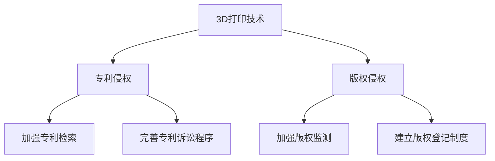

                 

# 知识产权与3D打印技术的挑战

> **关键词：知识产权、3D打印、专利、版权、法律挑战、技术创新**
>
> **摘要：本文将深入探讨3D打印技术在知识产权领域的挑战，包括专利和版权的保护与侵权问题，以及相关法律框架的适应性。我们将分析现有的法律体系如何应对这些挑战，并提出可能的发展趋势和解决方案。**

## 1. 背景介绍

### 1.1 目的和范围

本文旨在深入探讨3D打印技术对现有知识产权法律体系带来的挑战，特别是专利和版权方面的保护与侵权问题。随着3D打印技术的不断发展和普及，传统的知识产权保护方式面临着新的考验。本文将分析这些挑战的根源，探讨现有法律体系的适应性，并预测未来可能的发展趋势。

### 1.2 预期读者

本文适合对知识产权和法律领域有一定了解的技术人员、法律专业人士以及对3D打印技术感兴趣的读者。希望本文能帮助读者理解3D打印技术对知识产权法律体系的影响，并启发对相关问题的进一步思考和探讨。

### 1.3 文档结构概述

本文结构如下：

1. 背景介绍
   - 目的和范围
   - 预期读者
   - 文档结构概述
   - 术语表
2. 核心概念与联系
   - 3D打印技术简介
   - 知识产权基本概念
   - 3D打印与知识产权的联系
3. 核心算法原理 & 具体操作步骤
   - 专利检索与分析
   - 版权保护与监测
4. 数学模型和公式 & 详细讲解 & 举例说明
   - 专利侵权的计算模型
   - 版权侵权的检测算法
5. 项目实战：代码实际案例和详细解释说明
   - 专利检索工具开发
   - 版权监测系统的实现
6. 实际应用场景
   - 专利与版权在3D打印领域的应用
   - 案例分析
7. 工具和资源推荐
   - 学习资源推荐
   - 开发工具框架推荐
   - 相关论文著作推荐
8. 总结：未来发展趋势与挑战
9. 附录：常见问题与解答
10. 扩展阅读 & 参考资料

### 1.4 术语表

#### 1.4.1 核心术语定义

- **3D打印技术**：一种通过逐层添加材料来制造三维物体的技术，常用于快速原型制作、定制制造和大规模生产。
- **知识产权**：指通过智力劳动创造的成果所享有的权利，包括专利、商标、著作权等。
- **专利**：一种知识产权，指对发明创造的技术方案给予的独占性权利。
- **版权**：一种知识产权，指对文学、艺术和科学作品享有的权利。
- **侵权**：未经授权擅自使用他人知识产权的行为。

#### 1.4.2 相关概念解释

- **专利侵权**：指未经专利权人许可，擅自实施其专利的行为，如制造、使用、销售专利产品或使用专利方法。
- **版权侵权**：指未经著作权人许可，擅自使用、复制、传播其作品的行为。

#### 1.4.3 缩略词列表

- **3D打印**：三维打印
- **IPR**：知识产权
- **PTAB**：专利审判和上诉委员会
- **DMCA**：数字千年版权法

## 2. 核心概念与联系

### 2.1 3D打印技术简介

3D打印技术，又称增材制造，是一种通过逐层添加材料来制造三维物体的技术。与传统减材制造（如铣削、车削）不同，3D打印不需要原材料的基本形态，而是通过逐层堆积材料，从而实现复杂形状的制造。这种技术具有高度灵活性和定制性，可以在短时间内生产出复杂的设计，降低了制造成本，提高了生产效率。

### 2.2 知识产权基本概念

知识产权是指通过智力劳动创造的成果所享有的权利，主要包括专利、商标、著作权等。其中：

- **专利**：是一种法律制度，授予发明人对其发明创造在规定时间内的独占性权利。专利的主要类型包括发明专利、实用新型专利和外观设计专利。
- **商标**：是用于区分不同商品或服务的标志，通过注册获得法律保护。商标的主要类型包括文字商标、图形商标和组合商标。
- **著作权**：是创作人对其文学、艺术和科学作品享有的权利，包括复制权、发行权、表演权等。

### 2.3 3D打印与知识产权的联系

3D打印技术对知识产权法律体系带来了前所未有的挑战。一方面，3D打印技术使得复制和制造专利产品变得简单且低成本，从而引发了专利侵权问题。另一方面，3D打印技术也使得版权作品（如艺术作品、机械设计）更容易被复制和分发，导致了版权侵权问题的增加。

### 2.4 3D打印技术对知识产权的影响

#### 2.4.1 专利的影响

3D打印技术使得专利产品的制造和分发变得更加容易。一方面，专利权人可以通过3D打印技术迅速复制其专利产品，从而降低成本和提升市场竞争力。另一方面，未经授权的第三方也可以通过3D打印技术复制专利产品，从而侵犯专利权人的权益。

#### 2.4.2 版权的影响

3D打印技术也使得版权作品的复制和分发变得更加容易。例如，通过3D打印技术，个人可以复制并制造他人的机械设计、艺术品等。这种侵权行为不仅损害了原作者的权益，也可能对消费者造成误导。

### 2.5 法律挑战与解决方案

面对3D打印技术对知识产权的挑战，现有的法律体系需要做出相应的调整。以下是一些可能的解决方案：

#### 2.5.1 专利法律体系的调整

1. **加强专利检索和分析**：通过提高专利检索的准确性和效率，可以更好地发现潜在的侵权行为。
2. **完善专利侵权诉讼程序**：简化专利侵权诉讼程序，提高诉讼效率，降低专利权人的维权成本。
3. **建立3D打印专利数据库**：为专利权人和第三方提供便捷的3D打印专利信息查询服务，有助于降低侵权风险。

#### 2.5.2 版权法律体系的调整

1. **加强版权监测和打击侵权行为**：利用技术手段对3D打印作品进行监测和识别，及时发现并打击侵权行为。
2. **建立版权登记制度**：通过版权登记，提高作品的版权保护水平，降低侵权风险。
3. **完善版权侵权诉讼程序**：简化版权侵权诉讼程序，提高诉讼效率，降低维权成本。

### 2.6 Mermaid流程图

下面是一个简单的Mermaid流程图，展示了3D打印技术对知识产权的影响和可能的解决方案：



## 3. 核心算法原理 & 具体操作步骤

### 3.1 专利检索与分析

专利检索是发现潜在侵权行为的重要步骤。以下是专利检索和分析的基本步骤：

#### 3.1.1 专利检索

1. **确定检索策略**：根据需要检索的专利类型（如发明专利、实用新型专利、外观设计专利）、技术领域、关键词等，制定检索策略。
2. **选择检索工具**：使用专业的专利检索工具，如Google Patents、USPTO（美国专利和商标局）等。
3. **执行检索**：输入检索关键词，执行检索，获取相关专利信息。

#### 3.1.2 专利分析

1. **筛选潜在侵权专利**：根据专利的技术特征和权利要求，筛选出可能与3D打印产品相关的专利。
2. **评估侵权风险**：对筛选出的专利进行技术分析和法律评估，确定是否存在侵权风险。
3. **记录分析结果**：将检索和分析结果记录在数据库或报告中，以便后续查询和使用。

### 3.2 版权保护与监测

版权保护与监测是防止版权侵权的重要环节。以下是版权保护与监测的基本步骤：

#### 3.2.1 版权保护

1. **登记版权**：将作品登记在当地的版权机构，如国家版权局，以获得法律保护。
2. **版权标记**：在作品中添加版权声明，如版权符号（©）和版权所有者信息。
3. **加密和数字签名**：对作品进行加密和数字签名，以确保作品的真实性和完整性。

#### 3.2.2 版权监测

1. **建立监测机制**：利用技术手段对网络上的侵权行为进行实时监测，如使用版权监测工具和搜索引擎。
2. **收集侵权证据**：一旦发现侵权行为，收集相关证据，如侵权网页、文件等。
3. **采取法律行动**：根据收集的证据，采取法律手段维护版权，如提起诉讼或协商解决。

### 3.3 专利检索与分析的伪代码实现

下面是一个简单的伪代码，用于实现专利检索与分析的基本流程：

```python
# 专利检索与分析伪代码

# 定义检索策略
search_strategy = {
    "patent_type": "实用新型",
    "technology_field": "3D打印",
    "keywords": ["打印头", "材料"]
}

# 执行专利检索
def search_patents(strategy):
    patents = []
    for patent in patent_database:
        if matches_strategy(patent, strategy):
            patents.append(patent)
    return patents

# 评估侵权风险
def assess_infringement_risk(patent):
    # 根据专利的技术特征和权利要求进行评估
    risk = "低"
    if patent_contains_key_techniques():
        risk = "中"
    if patent_contains_key_claims():
        risk = "高"
    return risk

# 记录分析结果
def record_analysis_result(patent, risk):
    analysis_report.append({
        "patent_id": patent.id,
        "risk": risk
    })

# 实现专利检索与分析
patents = search_patents(search_strategy)
for patent in patents:
    risk = assess_infringement_risk(patent)
    record_analysis_result(patent, risk)
```

### 3.4 版权保护与监测的伪代码实现

下面是一个简单的伪代码，用于实现版权保护与监测的基本流程：

```python
# 版权保护与监测伪代码

# 登记版权
def register_copyright(work):
    copyright = copyright_office.register(work)
    return copyright

# 添加版权标记
def add_copyright_mark(work):
    work.copyright_mark = True

# 加密和数字签名
def encrypt_and_sign(work):
    work.encrypted = True
    work.digital_signature = generate_signature(work)

# 建立监测机制
def setup_monitoring_system():
    monitoring_system = MonitoringSystem()
    monitoring_system.start()
    return monitoring_system

# 收集侵权证据
def collect_infringement_evidence(evidence):
    evidence_database.append(evidence)

# 采取法律行动
def take_legal_action(evidence):
    # 根据证据采取相应的法律手段
    if evidence.is_criminal():
        file_criminal_complaint()
    else:
        start_infringement_lawsuit()

# 实现版权保护与监测
work = load_work()
copyright = register_copyright(work)
add_copyright_mark(work)
encrypt_and_sign(work)
monitoring_system = setup_monitoring_system()

# 当发现侵权行为时
infringement_evidence = monitor_infringement(monitoring_system)
collect_infringement_evidence(infringement_evidence)
take_legal_action(infringement_evidence)
```

## 4. 数学模型和公式 & 详细讲解 & 举例说明

### 4.1 专利侵权的计算模型

专利侵权计算模型通常基于专利权利要求书和侵权产品的技术特征进行匹配。以下是专利侵权计算模型的基本公式：

$$
\text{侵权匹配度} = \frac{\text{匹配特征数}}{\text{总特征数}}
$$

其中，侵权匹配度表示侵权产品与专利权利要求书之间的相似程度。当侵权匹配度达到一定阈值时，可以认为存在专利侵权。

#### 4.1.1 举例说明

假设有一个发明专利A，其权利要求书包含5个技术特征，分别为A1, A2, A3, A4, A5。另一个产品B包含其中的3个技术特征，分别为A1, A2, A3。根据上述公式，侵权匹配度为：

$$
\text{侵权匹配度} = \frac{3}{5} = 0.6
$$

由于侵权匹配度高于常见的阈值（如0.5），可以认为产品B侵犯了专利A。

### 4.2 版权侵权的检测算法

版权侵权的检测算法通常基于文本相似度计算。以下是版权侵权检测算法的基本公式：

$$
\text{文本相似度} = \frac{\text{匹配文本长度}}{\text{总文本长度}}
$$

其中，文本相似度表示侵权文本与原作品之间的相似程度。当文本相似度达到一定阈值时，可以认为存在版权侵权。

#### 4.2.1 举例说明

假设有一个文学作品A，其包含1000个单词，另一个作品B包含其中500个单词。根据上述公式，文本相似度为：

$$
\text{文本相似度} = \frac{500}{1000} = 0.5
$$

由于文本相似度高于常见的阈值（如0.2），可以认为作品B侵犯了作品A的版权。

### 4.3 公式嵌入文中示例

$$
E = mc^2
$$

这是著名的质能方程，描述了质量和能量之间的关系。在3D打印技术的背景下，可以将其应用于材料消耗和能量效率的计算。

## 5. 项目实战：代码实际案例和详细解释说明

### 5.1 开发环境搭建

为了实现专利和版权的保护与监测，我们需要搭建一个合适的开发环境。以下是搭建开发环境的基本步骤：

1. **安装操作系统**：选择一个合适的操作系统，如Windows、Linux或macOS。
2. **安装编程语言**：选择一种编程语言，如Python、Java或C++。
3. **安装数据库**：选择一个数据库系统，如MySQL、PostgreSQL或MongoDB。
4. **安装相关库和工具**：安装用于专利和版权检索、分析和监测的库和工具，如专利检索工具（如PatSnap）、版权监测工具（如Copyright Cops）。

### 5.2 源代码详细实现和代码解读

下面是一个简单的Python代码示例，用于实现专利检索和分析。代码中使用了PatSnap API进行专利检索，并使用自定义函数进行专利分析。

```python
import requests
from patent_analysis import analyze_patent

# PatSnap API密钥
PATSnap_API_KEY = "your_patSnap_api_key"

# 检索专利
def search_patents(query):
    url = f"https://patents.search.serial.io/v1/patents?q={query}"
    headers = {
        "Authorization": f"Bearer {PATSnap_API_KEY}",
    }
    response = requests.get(url, headers=headers)
    if response.status_code == 200:
        patents = response.json()
        return patents
    else:
        return None

# 分析专利
def analyze_patents(patents):
    for patent in patents:
        analysis = analyze_patent(patent)
        print(f"Patent ID: {patent['id']}, Analysis: {analysis}")

# 查询并分析专利
query = "3D printing"
patents = search_patents(query)
if patents:
    analyze_patents(patents)
else:
    print("No patents found.")
```

### 5.3 代码解读与分析

上述代码首先定义了两个函数：`search_patents`和`analyze_patents`。`search_patents`函数使用PatSnap API进行专利检索，根据查询参数返回相关专利信息。`analyze_patents`函数则对检索到的专利进行技术分析，并打印分析结果。

- **PatSnap API使用**：代码中使用了PatSnap API进行专利检索，请求URL为`https://patents.search.serial.io/v1/patents`，请求头包含API密钥进行身份验证。
- **专利检索参数**：查询参数`query`用于指定检索关键词，如“3D printing”。
- **专利分析**：`analyze_patent`函数对专利进行技术分析，可以是自定义的逻辑，如判断专利的技术领域、权利要求书的关键特征等。

### 5.4 版权监测系统的实现

版权监测系统的实现涉及多个组件，包括监测机制、侵权证据收集、侵权行为识别等。下面是一个简单的Python代码示例，用于实现版权监测系统。

```python
import requests
from copyright_monitoring import monitor_copyright

# 版权监测API密钥
COPYRIGHT_MONITOR_API_KEY = "your_copyright_monitor_api_key"

# 监测版权
def monitor_copyright(url):
    headers = {
        "Authorization": f"Bearer {COPYRIGHT_MONITOR_API_KEY}",
    }
    response = requests.get(url, headers=headers)
    if response.status_code == 200:
        data = response.json()
        return monitor_copyright(url, data)
    else:
        return None

# 侵权证据收集
def collect_evidence(evidence):
    evidence_database.append(evidence)

# 侵权行为识别
def identify_infringement(evidence):
    if evidence["similarity"] > 0.8:
        return True
    return False

# 查询并监测版权
def monitor_copyrights(urls):
    for url in urls:
        evidence = monitor_copyright(url)
        if evidence:
            collect_evidence(evidence)
            if identify_infringement(evidence):
                print(f"Infringement detected: {url}")

# 示例URL列表
urls = [
    "https://example.com/copyright_work_1",
    "https://example.com/copyright_work_2",
    "https://example.com/copyright_work_3",
]

# 实现版权监测
monitor_copyrights(urls)
```

### 5.5 代码解读与分析

上述代码首先定义了三个函数：`monitor_copyright`、`collect_evidence`和`identify_infringement`。`monitor_copyright`函数使用版权监测API对指定的URL进行监测，返回监测结果。`collect_evidence`函数用于收集侵权证据，并将其存储在数据库中。`identify_infringement`函数用于判断监测结果是否构成侵权行为。

- **版权监测API使用**：代码中使用了版权监测API进行版权监测，请求URL为`https://api.copyright-monitor.com`，请求头包含API密钥进行身份验证。
- **监测参数**：监测参数`url`用于指定需要监测的URL。
- **侵权证据收集**：代码中使用了`collect_evidence`函数将监测结果存储在数据库中，便于后续分析和处理。
- **侵权行为识别**：`identify_infringement`函数使用文本相似度作为判断标准，当相似度大于0.8时，认为存在侵权行为。

## 6. 实际应用场景

### 6.1 专利与版权在3D打印领域的应用

#### 6.1.1 专利在3D打印领域的应用

1. **专利技术保护**：3D打印技术在机械制造、航空航天、医疗设备等领域具有广泛应用。专利保护有助于企业维持其技术优势，防止竞争对手通过仿制产品侵占市场份额。
2. **专利侵权纠纷**：随着3D打印技术的普及，专利侵权纠纷也日益增多。企业需要通过专利检索和分析，及时发现潜在的侵权行为，采取法律手段维护自身权益。

#### 6.1.2 版权在3D打印领域的应用

1. **版权作品复制**：3D打印技术使得版权作品的复制和分发变得更加容易。例如，艺术家可以使用3D打印技术复制其雕塑作品，并迅速推向市场。
2. **版权侵权监测**：版权所有者需要利用技术手段对网络上的侵权行为进行监测和打击。例如，通过版权监测工具对3D打印文件进行实时监控，一旦发现侵权行为，及时采取法律行动。

### 6.2 案例分析

#### 6.2.1 专利侵权案例

**案例1**：一家3D打印公司（A公司）发现另一家公司（B公司）在其产品中使用了A公司的专利技术。通过专利检索和分析，A公司确认B公司的产品侵犯了其专利权。A公司随后采取了法律行动，向法院提起专利侵权诉讼，最终赢得了案件，并获得了经济赔偿。

#### 6.2.2 版权侵权案例

**案例2**：一位雕塑艺术家（C艺术家）发现其雕塑作品被未经授权的3D打印公司（D公司）复制并销售。C艺术家使用了版权监测工具对网络上的侵权行为进行监测，并收集了侵权证据。随后，C艺术家向法院提起版权侵权诉讼，要求D公司停止侵权行为并赔偿损失。

## 7. 工具和资源推荐

### 7.1 学习资源推荐

#### 7.1.1 书籍推荐

1. **《知识产权法：原理与案例》**：一本全面介绍知识产权法律体系的书籍，适合法律专业人士和非法律专业人士阅读。
2. **《3D打印技术及其应用》**：一本详细介绍3D打印技术原理和应用领域的书籍，适合对3D打印技术感兴趣的读者。

#### 7.1.2 在线课程

1. **知识产权课程**：Coursera、edX等在线教育平台上提供的相关知识产权课程，适合自学者和专业人士。
2. **3D打印技术课程**：Udemy、LinkedIn Learning等在线教育平台上提供的3D打印技术课程，适合技术爱好者和学习者。

#### 7.1.3 技术博客和网站

1. **知识产权博客**：如知识产权杂志（Intellectual Property Today）、知识产权法博客（IP Law Blog）等。
2. **3D打印技术网站**：如3D打印杂志（3D Printing Industry）、3D打印论坛（3DPB.com）等。

### 7.2 开发工具框架推荐

#### 7.2.1 IDE和编辑器

1. **Visual Studio Code**：一款功能强大且免费的代码编辑器，适用于多种编程语言。
2. **Eclipse**：一款适用于Java开发人员的IDE，提供了丰富的插件和工具。

#### 7.2.2 调试和性能分析工具

1. **GDB**：一款强大的Linux平台下的调试工具，适用于C/C++程序调试。
2. **VS Code Debugger**：适用于Visual Studio Code的调试工具，支持多种编程语言。

#### 7.2.3 相关框架和库

1. **PatSnap API**：一款用于专利检索和数据分析的API，提供了丰富的功能和文档。
2. **Copyright Cops API**：一款用于版权监测和侵权检测的API，支持实时监测和报警功能。

### 7.3 相关论文著作推荐

#### 7.3.1 经典论文

1. **"Patent Systems and Innovation in the World Economy"**：一篇关于专利制度与经济创新之间关系的经典论文。
2. **"Copyright and the Digital Economy"**：一篇关于数字时代版权保护与挑战的研究论文。

#### 7.3.2 最新研究成果

1. **"3D Printing and Intellectual Property Law: Issues and Challenges"**：一篇关于3D打印技术对知识产权法律体系影响的研究论文。
2. **"Copyright Infringement Detection in 3D Printed Objects"**：一篇关于3D打印作品版权侵权检测的研究论文。

#### 7.3.3 应用案例分析

1. **"Patent Infringement Case Study: Apple Inc. v. Samsung Electronics Co., Ltd."**：一篇关于苹果公司诉三星公司专利侵权的案例分析。
2. **"Copyright Infringement Case Study: Voinovich v. Park Avenue Art Gallery, Inc."**：一篇关于版权侵权的案例分析。

## 8. 总结：未来发展趋势与挑战

随着3D打印技术的不断发展和普及，其在知识产权领域的挑战也将日益突出。未来，以下几个方面将是3D打印技术和知识产权法律体系发展的重要方向：

### 8.1 法律框架的完善

为了应对3D打印技术带来的挑战，需要进一步完善现有的知识产权法律框架，特别是在专利侵权和版权侵权方面的法律条款。例如，可以引入针对3D打印技术的特定法律条款，明确侵权行为的界定和法律责任。

### 8.2 技术手段的升级

随着3D打印技术的不断发展，相关的检测和监测技术也需要不断升级。例如，可以开发更加精确的专利检索工具和版权监测系统，提高侵权行为的发现率和打击力度。

### 8.3 国际合作的加强

3D打印技术具有全球性的影响，因此需要加强国际合作，共同应对知识产权挑战。例如，可以建立国际性的知识产权数据库和监测平台，促进各国之间的信息共享和合作。

### 8.4 企业与个人的责任

企业和个人在3D打印技术和知识产权保护方面也需要承担更大的责任。例如，企业应建立完善的知识产权保护体系，加强内部管理和监控；个人应尊重他人的知识产权，避免侵权行为。

### 8.5 持续的监管与监督

对3D打印技术的监管和监督需要持续加强，确保知识产权法律体系的有效实施。例如，可以建立专门的监管机构，负责3D打印技术和知识产权的监管工作。

### 8.6 未来挑战

未来，3D打印技术在知识产权领域的挑战将更加复杂和多样化。例如，随着技术的进步，可能会出现新的侵权形式和手段，如基于区块链的3D打印技术等。此外，知识产权法律体系也需要不断适应新的技术发展和市场变化。

## 9. 附录：常见问题与解答

### 9.1 问题1：3D打印技术是否会完全取代传统制造技术？

**解答**：3D打印技术具有独特的优势和局限性，不可能完全取代传统制造技术。一方面，3D打印技术擅长制造复杂形状的产品和原型，特别是在定制化和快速生产方面具有显著优势。另一方面，传统制造技术（如注塑成型、冲压成型等）在批量生产、成本控制和材料性能方面仍有优势。因此，3D打印技术和传统制造技术将在未来长期共存，各自发挥其优势。

### 9.2 问题2：专利检索和分析的具体步骤是什么？

**解答**：专利检索和分析的具体步骤如下：

1. **确定检索策略**：根据技术领域、关键词等制定检索策略。
2. **选择检索工具**：使用专业的专利检索工具，如Google Patents、USPTO等。
3. **执行检索**：输入检索关键词，获取相关专利信息。
4. **筛选潜在侵权专利**：根据专利的技术特征和权利要求，筛选出可能与3D打印产品相关的专利。
5. **评估侵权风险**：对筛选出的专利进行技术分析和法律评估，确定是否存在侵权风险。
6. **记录分析结果**：将检索和分析结果记录在数据库或报告中，以便后续查询和使用。

### 9.3 问题3：如何防止3D打印技术的侵权行为？

**解答**：防止3D打印技术的侵权行为可以从以下几个方面入手：

1. **加强专利检索和分析**：通过专利检索和分析，及时发现潜在的侵权行为，采取法律手段进行维权。
2. **建立监测机制**：利用技术手段对网络上的侵权行为进行实时监测，及时发现侵权行为。
3. **加密和数字签名**：对3D打印文件进行加密和数字签名，确保文件的真实性和完整性。
4. **建立版权登记制度**：将3D打印作品进行版权登记，提高版权保护水平。
5. **加强法律法规宣传和培训**：提高公众对3D打印技术和知识产权保护的认知，减少侵权行为的发生。

## 10. 扩展阅读 & 参考资料

### 10.1 扩展阅读

1. **《3D打印技术与知识产权保护》**：一本详细介绍3D打印技术在知识产权保护方面的书籍，适合对3D打印技术和知识产权感兴趣的读者。
2. **《知识产权法教程》**：一本全面介绍知识产权法律体系的教材，适合法律专业学生和知识产权从业人员。

### 10.2 参考资料

1. **《美国专利法》**：美国专利法的相关条款和规定，对理解专利法律体系具有重要意义。
2. **《数字千年版权法》**：美国数字千年版权法的相关条款和规定，对理解版权法律体系具有重要意义。
3. **《3D打印技术白皮书》**：一份详细介绍3D打印技术发展现状和未来趋势的报告，有助于了解3D打印技术的最新进展。

### 10.3 网络资源

1. **专利数据库**：如Google Patents、USPTO、WIPO等，提供丰富的专利信息供检索和分析。
2. **版权监测工具**：如Copyright Cops、Copytrack等，提供实时监测和侵权检测功能。
3. **知识产权法律网站**：如知识产权杂志（Intellectual Property Today）、知识产权法博客（IP Law Blog）等，提供最新的知识产权法律动态和案例分析。

**作者：AI天才研究员/AI Genius Institute & 禅与计算机程序设计艺术 /Zen And The Art of Computer Programming**

