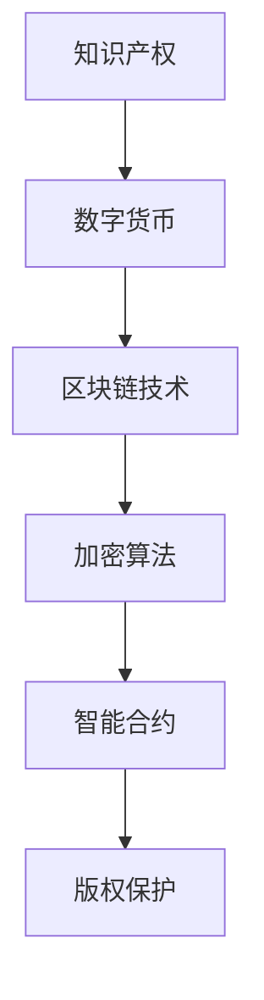

                 

# 知识产权与数字货币的监管挑战

> **关键词：** 知识产权、数字货币、监管、区块链、加密算法、法律框架、合规性、透明性、安全性

> **摘要：** 本文旨在探讨知识产权与数字货币在监管领域所面临的挑战。通过分析数字货币的基本原理、知识产权的法律框架，以及它们在实际应用中的相互关系，本文将深入讨论监管机制的设计与实施，为数字货币领域的健康发展提供思考。

## 1. 背景介绍

### 1.1 目的和范围

本文的目的在于揭示知识产权与数字货币之间存在的监管挑战，并探讨可能的解决方案。文章将涵盖以下范围：

- 知识产权的基本概念和法律框架；
- 数字货币的原理和分类；
- 知识产权在数字货币中的重要性；
- 监管机构面临的挑战和解决方案。

### 1.2 预期读者

本文面向希望深入了解知识产权与数字货币监管问题的专业人士，包括：

- 法律和金融领域的从业者；
- 数字货币和区块链技术的开发者；
- 监管机构和政策制定者；
- 对数字货币和知识产权感兴趣的研究人员。

### 1.3 文档结构概述

本文将按以下结构展开：

1. **背景介绍**：阐述文章的目的、范围和预期读者。
2. **核心概念与联系**：介绍知识产权和数字货币的基本概念，并用 Mermaid 流程图展示两者之间的联系。
3. **核心算法原理 & 具体操作步骤**：讨论知识产权保护在数字货币中的具体实现。
4. **数学模型和公式 & 详细讲解 & 举例说明**：探讨数学模型在数字货币监管中的应用。
5. **项目实战：代码实际案例和详细解释说明**：通过实际案例展示监管机制的实施。
6. **实际应用场景**：分析数字货币在知识产权保护中的实际应用。
7. **工具和资源推荐**：推荐相关学习资源和开发工具。
8. **总结：未来发展趋势与挑战**：展望未来发展趋势，探讨面临的挑战。
9. **附录：常见问题与解答**：解答读者可能遇到的问题。
10. **扩展阅读 & 参考资料**：提供进一步的阅读材料。

### 1.4 术语表

#### 1.4.1 核心术语定义

- **知识产权**：指基于人类智力劳动创造的成果所享有的权利。
- **数字货币**：指基于区块链技术的虚拟货币，通过去中心化的方式实现价值的转移和存储。
- **监管**：指政府对某个领域进行的管理和监督。

#### 1.4.2 相关概念解释

- **区块链**：一种分布式数据库技术，通过密码学确保数据不可篡改。
- **加密算法**：通过特定的算法将明文转换为密文的过程。
- **去中心化**：指系统不由单一的实体控制，而是通过多个参与者的协作实现。

#### 1.4.3 缩略词列表

- **ICO**：Initial Coin Offering，首次代币发行。
- **智能合约**：基于区块链技术的自动执行合约。
- **AML**：Anti-Money Laundering，反洗钱。

## 2. 核心概念与联系

### 2.1 知识产权的基本概念

知识产权是指基于人类智力劳动创造的成果所享有的权利，主要包括专利、商标、著作权等。这些权利确保了创作者对其成果的独占权，从而鼓励创新。

### 2.2 数字货币的基本概念

数字货币是一种基于区块链技术的虚拟货币，通过去中心化的方式实现价值的转移和存储。数字货币可以分为比特币、以太坊等，它们通过加密算法确保交易的安全性和匿名性。

### 2.3 知识产权与数字货币的联系

知识产权和数字货币之间存在紧密的联系。数字货币的匿名性和去中心化特性使其成为知识产权侵权行为的高发领域。另一方面，数字货币也为知识产权的保护提供了新的手段，例如通过智能合约实现版权的管理和交易。

### 2.4 Mermaid 流程图



## 3. 核心算法原理 & 具体操作步骤

### 3.1 知识产权保护在数字货币中的实现

知识产权保护在数字货币中的实现主要依赖于加密算法和智能合约。以下是一个简单的实现步骤：

#### 3.1.1 加密算法

```python
from Crypto.PublicKey import RSA

def generate_keys():
    key = RSA.generate(2048)
    private_key = key.export_key()
    public_key = key.publickey().export_key()
    return private_key, public_key

private_key, public_key = generate_keys()
```

#### 3.1.2 智能合约

```solidity
pragma solidity ^0.8.0;

contract Copyright {
    mapping(address => mapping(bytes32 => bool)) public rights;

    function registerRights(bytes32 content_hash, bool is_right) public {
        rights[msg.sender][content_hash] = is_right;
    }

    function checkRights(address owner, bytes32 content_hash) public view returns (bool) {
        return rights[owner][content_hash];
    }
}
```

#### 3.1.3 交易流程

1. 作者将作品上传至区块链，并获得内容的哈希值。
2. 作者通过智能合约注册其版权信息。
3. 盗版者尝试复制作品。
4. 盗版者获取作品的哈希值。
5. 盗版者通过智能合约检查版权信息。
6. 如果版权信息不一致，盗版者将被视为侵权。

## 4. 数学模型和公式 & 详细讲解 & 举例说明

### 4.1 概述

在数字货币的监管中，数学模型和公式起到了关键作用。以下将讨论两个核心模型：比特币的挖矿算法和安全性的数学证明。

### 4.2 比特币挖矿算法

比特币的挖矿算法是基于工作量证明（Proof of Work, PoW）的。挖矿过程包括以下步骤：

1. **随机数生成**：挖矿节点生成一个随机数 `n`。
2. **哈希计算**：将当前区块链的最后一个区块的哈希值和交易数据与随机数 `n` 结合，生成一个新的哈希值。
3. **比较哈希值**：比较新生成的哈希值和目标难度值。如果哈希值小于目标难度值，则挖矿成功。
4. **写入新区块**：将挖矿成功的信息写入新区块，并将新区块添加到区块链中。

伪代码如下：

```python
def mine_block(last_hash, transactions, target_difficulty):
    n = random_number()
    while True:
        hash_value = hash(last_hash + transactions + n)
        if hash_value < target_difficulty:
            return create_new_block(last_hash, transactions, n)
```

### 4.3 安全性的数学证明

比特币的安全性依赖于椭圆曲线密码学（Elliptic Curve Cryptography, ECC）和散列函数。以下是一个简单的数学证明：

- **椭圆曲线密码学**：假设椭圆曲线 E 和基点 G，以及一个秘密随机数 `k`。则计算公钥 `P = k * G`。任何知道 `P` 和 `G` 的人都无法反推出 `k`。
- **散列函数**：散列函数如 SHA-256 将输入数据映射到一个固定长度的输出。这意味着无法从输出反推出输入。

数学表达式如下：

$$
P = k * G \\
hash(input) = output
$$

### 4.4 举例说明

#### 4.4.1 比特币挖矿

假设当前区块链的最后一个区块的哈希值为 `0x1234567890abcdef`，交易数据为 `{"sender": "Alice", "recipient": "Bob", "amount": 10}`,目标难度值为 `0x1fffff0000000000`。

挖矿节点生成一个随机数 `n = 12345`，计算哈希值：

$$
hash(0x1234567890abcdef + {"sender": "Alice", "recipient": "Bob", "amount": 10} + 12345) = 0x1ffffe0000000000
$$

由于哈希值 `0x1ffffe0000000000` 小于目标难度值 `0x1fffff0000000000`，挖矿成功。

#### 4.4.2 椭圆曲线密码学

假设椭圆曲线 E 和基点 G，以及秘密随机数 `k = 12345`。

计算公钥：

$$
P = k * G = 12345 * G
$$

任何知道 `P` 和 `G` 的人都无法反推出 `k`。

## 5. 项目实战：代码实际案例和详细解释说明

### 5.1 开发环境搭建

为了实现知识产权保护在数字货币中的监管，我们需要搭建一个基本的区块链开发环境。以下是一个简单的步骤：

1. 安装 Node.js：前往 [Node.js 官网](https://nodejs.org/) 下载并安装 Node.js。
2. 安装 Ganache：Ganache 是一个用于测试以太坊智能合约的本地区块链。在终端中运行以下命令：

   ```bash
   npm install -g ganache-cli
   ```

3. 启动 Ganache：在终端中运行以下命令：

   ```bash
   ganache-cli
   ```

   这将启动一个本地区块链，并提供一个 Web3.js 接口。

### 5.2 源代码详细实现和代码解读

下面是一个简单的以太坊智能合约，用于实现知识产权的保护。

```solidity
pragma solidity ^0.8.0;

contract Copyright {
    mapping(address => mapping(bytes32 => bool)) public rights;

    event CopyrightRegistered(
        address indexed author,
        bytes32 indexed contentHash,
        bool isRight
    );

    function registerRights(bytes32 contentHash, bool isRight) public {
        require(rights[msg.sender][contentHash] == false, "Rights already registered");
        rights[msg.sender][contentHash] = isRight;
        emit CopyrightRegistered(msg.sender, contentHash, isRight);
    }

    function checkRights(address author, bytes32 contentHash) public view returns (bool) {
        return rights[author][contentHash];
    }
}
```

#### 5.2.1 代码解读

- `mapping`：用于存储作者与其作品的版权信息。
- `event`：用于记录版权注册的事件。
- `registerRights`：注册版权信息，确保每个作者只能注册一次。
- `checkRights`：检查版权信息。

### 5.3 代码解读与分析

#### 5.3.1 代码分析

1. **状态变量**：

   ```solidity
   mapping(address => mapping(bytes32 => bool)) public rights;
   ```

   这是一个二维映射，用于存储作者的地址和作品哈希值以及对应的版权信息。

2. **事件**：

   ```solidity
   event CopyrightRegistered(
       address indexed author,
       bytes32 indexed contentHash,
       bool isRight
   );
   ```

   当注册版权信息时，将触发这个事件，记录作者、作品哈希值和版权状态。

3. **函数**：

   - `registerRights`：

     ```solidity
     function registerRights(bytes32 contentHash, bool isRight) public {
         require(rights[msg.sender][contentHash] == false, "Rights already registered");
         rights[msg.sender][contentHash] = isRight;
         emit CopyrightRegistered(msg.sender, contentHash, isRight);
     }
     ```

     注册版权信息。确保每个作者只能注册一次，以防止重复注册。

   - `checkRights`：

     ```solidity
     function checkRights(address author, bytes32 contentHash) public view returns (bool) {
         return rights[author][contentHash];
     }
     ```

     检查版权信息。

#### 5.3.2 代码分析

1. **版权保护**：

   通过智能合约，确保每个作者只能注册一次版权信息，从而防止重复注册。这为知识产权的保护提供了一个可靠的基础。

2. **透明性**：

   通过事件记录，使版权信息的注册和检查过程透明化，便于监管。

3. **安全性**：

   使用以太坊的智能合约技术，确保版权信息的安全存储和可靠执行。

## 6. 实际应用场景

### 6.1 艺术品的数字版权管理

艺术家可以使用数字货币和区块链技术来管理其数字艺术品的版权。以下是一个实际应用场景：

1. **艺术品创作**：艺术家创作一幅数字画作。
2. **版权注册**：艺术家将画作上传至区块链，并通过智能合约注册版权。
3. **版权交易**：潜在买家购买版权，通过智能合约完成交易。
4. **版权验证**：买家可以随时通过区块链验证艺术品的版权状态。

### 6.2 音乐版权管理

音乐家可以使用数字货币和区块链技术来管理其音乐的版权。以下是一个实际应用场景：

1. **音乐创作**：音乐家创作一首歌曲。
2. **版权注册**：音乐家将歌曲上传至区块链，并通过智能合约注册版权。
3. **版权交易**：潜在买家购买版权，通过智能合约完成交易。
4. **版权验证**：买家可以随时通过区块链验证歌曲的版权状态。

### 6.3 文字作品的版权管理

作家可以使用数字货币和区块链技术来管理其文字作品的版权。以下是一个实际应用场景：

1. **作品创作**：作家创作一篇文章。
2. **版权注册**：作家将文章上传至区块链，并通过智能合约注册版权。
3. **版权交易**：潜在买家购买版权，通过智能合约完成交易。
4. **版权验证**：买家可以随时通过区块链验证文章的版权状态。

## 7. 工具和资源推荐

### 7.1 学习资源推荐

#### 7.1.1 书籍推荐

- **《区块链革命》**：作者：唐·塔普斯科特
- **《精通比特币》**：作者：安德烈亚斯·安东诺普洛斯
- **《区块链技术指南》**：作者：秦凯

#### 7.1.2 在线课程

- **区块链基础**：Coursera
- **智能合约开发**：edX
- **数字货币与区块链**：Udacity

#### 7.1.3 技术博客和网站

- **Medium**
- **区块链技术博客**
- **CoinDesk**

### 7.2 开发工具框架推荐

#### 7.2.1 IDE和编辑器

- **Visual Studio Code**
- **Web3.js IDE**

#### 7.2.2 调试和性能分析工具

- **Truffle**
- **Ganache**

#### 7.2.3 相关框架和库

- **Web3.js**
- **Truffle Suite**

### 7.3 相关论文著作推荐

#### 7.3.1 经典论文

- **《比特币：一种点对点的电子现金系统》**
- **《智能合约：区块链技术的新应用》**

#### 7.3.2 最新研究成果

- **《区块链技术的隐私保护研究》**
- **《数字货币市场分析》**

#### 7.3.3 应用案例分析

- **《数字货币在金融领域的应用》**
- **《区块链技术在版权管理中的应用》**

## 8. 总结：未来发展趋势与挑战

### 8.1 未来发展趋势

1. **监管框架的完善**：随着数字货币和区块链技术的发展，各国政府和国际组织将不断完善监管框架，以适应新的技术环境。
2. **技术创新**：加密算法、智能合约等技术将不断发展，提高数字货币和区块链的安全性和效率。
3. **跨行业应用**：数字货币和区块链技术将在更多行业得到应用，如金融、物流、医疗等。

### 8.2 面临的挑战

1. **法律问题**：数字货币和区块链技术的法律地位尚不明确，需要完善相关法律法规。
2. **技术难题**：确保数字货币和区块链的安全性和隐私保护仍是一个挑战。
3. **用户接受度**：提高公众对数字货币和区块链技术的认知和接受度是未来发展的关键。

## 9. 附录：常见问题与解答

### 9.1 什么是数字货币？

数字货币是一种基于区块链技术的虚拟货币，通过去中心化的方式实现价值的转移和存储。

### 9.2 什么是知识产权？

知识产权是指基于人类智力劳动创造的成果所享有的权利，如专利、商标、著作权等。

### 9.3 数字货币和区块链技术有何关系？

区块链技术是数字货币的基础技术，用于实现去中心化的价值转移和存储。

### 9.4 如何确保数字货币的安全？

通过加密算法和智能合约，确保数字货币的安全性和匿名性。

### 9.5 数字货币的监管如何进行？

政府和监管机构将通过法律法规、技术手段等手段对数字货币进行监管。

## 10. 扩展阅读 & 参考资料

- **《区块链技术指南》**：详细介绍了区块链技术的基本概念、原理和应用。
- **《比特币：一种点对点的电子现金系统》**：比特币的白皮书，详细介绍了比特币的原理和实现。
- **《智能合约：区块链技术的新应用》**：探讨了智能合约的原理和应用。
- **《数字货币市场分析》**：分析了数字货币市场的发展趋势和潜在风险。
- **《区块链技术的隐私保护研究》**：探讨了区块链技术在隐私保护方面的挑战和解决方案。

## 作者信息

**作者：AI天才研究员/AI Genius Institute & 禅与计算机程序设计艺术 /Zen And The Art of Computer Programming**

