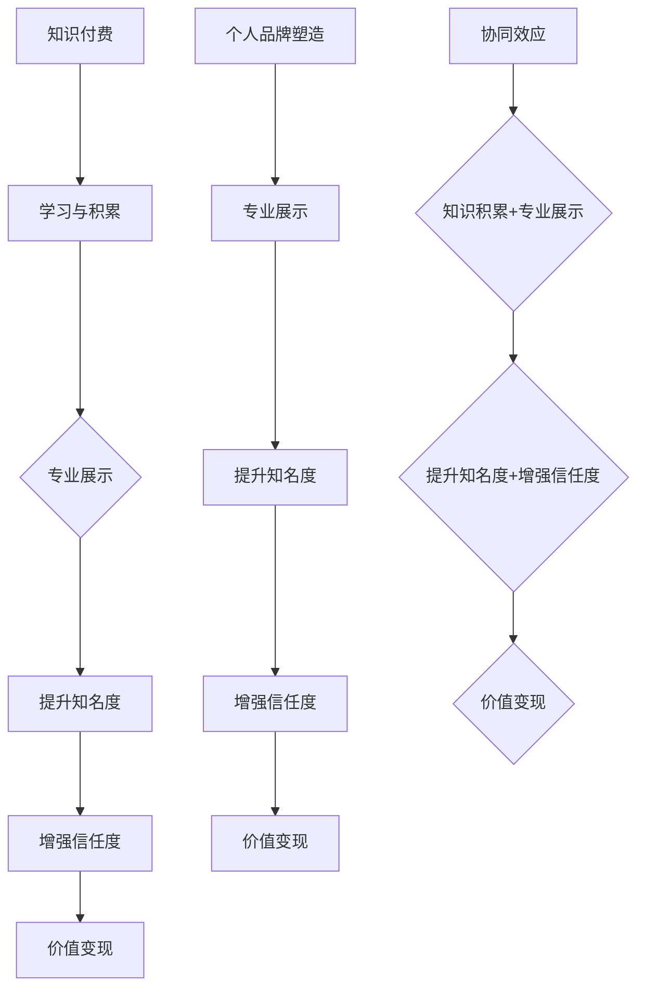

                 


# 知识付费与个人品牌塑造的协同效应

> 关键词：知识付费、个人品牌、协同效应、价值变现、影响力、专业成长
>
> 摘要：本文旨在探讨知识付费与个人品牌塑造之间的内在联系及其产生的协同效应。通过对知识付费市场现状、个人品牌价值评估、知识变现路径以及二者协同机制的分析，文章将帮助读者理解如何通过知识付费实现个人品牌的提升，进而实现个人价值的最大化。

## 1. 背景介绍

### 1.1 目的和范围

本文的目的在于揭示知识付费与个人品牌塑造之间的相互关系，并探讨其产生的协同效应。随着互联网的快速发展，知识付费已经成为现代教育、职业培训和个人成长的重要方式。同时，个人品牌在社交媒体和职业竞争中的重要性日益凸显。本文将围绕以下几个方面展开讨论：

1. **知识付费市场的现状与趋势**：分析知识付费市场的发展历程、用户需求以及主流模式。
2. **个人品牌的定义与价值**：探讨个人品牌的概念、构成要素及其在经济活动中的重要性。
3. **知识付费对个人品牌塑造的影响**：分析知识付费如何帮助个人提升专业技能、扩大影响力以及实现商业变现。
4. **个人品牌塑造中的知识付费策略**：探讨如何通过选择合适的知识付费产品和服务，最大化个人品牌价值。

### 1.2 预期读者

本文适合以下读者群体：

1. **职场人士**：寻求职业发展和个人品牌提升的专业人士。
2. **知识创作者**：希望通过知识付费实现商业变现的内容创作者。
3. **教育培训者**：关注教育行业发展趋势和教学方法创新的从业者。
4. **市场营销人员**：希望了解知识付费和个人品牌塑造之间互动关系的市场营销人员。

### 1.3 文档结构概述

本文结构如下：

1. **引言**：介绍知识付费与个人品牌塑造的背景和重要性。
2. **核心概念与联系**：通过Mermaid流程图展示知识付费与个人品牌塑造的核心概念及其关系。
3. **核心算法原理与具体操作步骤**：详细阐述知识付费对个人品牌塑造的算法原理和操作步骤。
4. **数学模型和公式**：运用数学模型和公式解释知识付费与个人品牌塑造之间的协同效应。
5. **项目实战**：通过实际案例展示知识付费和个人品牌塑造的协同应用。
6. **实际应用场景**：分析知识付费与个人品牌塑造在不同领域的应用实例。
7. **工具和资源推荐**：推荐相关学习资源、开发工具和框架。
8. **总结**：探讨知识付费与个人品牌塑造的未来发展趋势与挑战。
9. **附录**：提供常见问题解答和扩展阅读建议。

### 1.4 术语表

#### 1.4.1 核心术语定义

- **知识付费**：指个人或机构通过购买知识产品、课程或服务来获取知识、技能或信息的过程。
- **个人品牌**：个人在特定领域或市场中的声誉、形象和价值的综合体现。
- **协同效应**：两个或多个因素相互配合，产生比单独作用更大的效果。

#### 1.4.2 相关概念解释

- **价值变现**：将个人品牌价值转化为实际的经济收益。
- **影响力**：个人或品牌对他人行为、观点或态度的影响能力。
- **专业成长**：个人在专业领域的知识和技能不断提升的过程。

#### 1.4.3 缩略词列表

- **KFC**：知识付费
- **PB**：个人品牌
- **COE**：协同效应

## 2. 核心概念与联系

### 2.1 知识付费的定义与市场现状

知识付费是指个人或机构通过购买知识产品、课程或服务来获取知识、技能或信息的过程。这一概念随着互联网技术的发展和信息的爆炸式增长逐渐兴起。目前，知识付费市场已经形成了较为完整的产业链，包括内容创作、平台运营、用户购买等多个环节。

#### 知识付费市场现状

- **市场规模不断扩大**：根据相关报告，全球知识付费市场规模逐年增长，预计未来几年仍将保持高速增长态势。
- **用户需求多样化**：用户对知识的需求不再局限于学术和教育领域，而是涵盖了职场技能、兴趣爱好、健康养生等多个方面。
- **主流模式多样化**：知识付费模式包括在线课程、电子书、知识付费问答、直播授课等，满足了不同用户的需求。

### 2.2 个人品牌的定义与价值

个人品牌是指个人在特定领域或市场中的声誉、形象和价值的综合体现。一个成功的个人品牌不仅能够提高个人的社会地位和影响力，还能为个人带来经济收益。

#### 个人品牌价值评估

- **知名度**：个人在公众中的认知度和影响力。
- **信任度**：个人在行业内的专业性和可靠性。
- **忠诚度**：个人品牌与用户之间的情感联系和忠诚度。
- **价值转化**：个人品牌价值转化为实际的经济收益。

### 2.3 知识付费与个人品牌塑造的关系

知识付费与个人品牌塑造之间存在密切的关联。通过知识付费，个人可以提升自己的专业技能和知识水平，从而增强个人品牌的专业性。同时，个人品牌的价值提升也将促进知识付费的消费，形成良性循环。

#### 关联机制

1. **知识积累**：知识付费为个人提供了不断学习、积累知识的渠道，有助于个人在专业领域形成独特的见解和优势。
2. **专业展示**：通过知识付费学习到的知识和技能，个人可以在社交媒体、博客、演讲等平台上进行展示，提升个人品牌的知名度和信任度。
3. **价值变现**：个人品牌价值的提升将带动知识付费的消费，实现知识的商业变现。
4. **协同效应**：知识付费和个人品牌塑造相互促进，形成强大的协同效应，实现个人价值的最大化。

### 2.4 Mermaid流程图

下面是知识付费与个人品牌塑造的Mermaid流程图，展示了二者之间的核心概念及其关系。



## 3. 核心算法原理与具体操作步骤

### 3.1 知识付费对个人品牌塑造的算法原理

知识付费对个人品牌塑造的过程可以视为一个动态优化问题。该问题可以通过以下几个步骤来实现：

1. **知识获取**：通过购买课程、订阅服务等方式获取专业知识。
2. **知识内化**：将获取的知识内化为个人的技能和知识体系。
3. **知识展示**：通过社交媒体、博客、演讲等方式展示个人的知识和技能。
4. **反馈调整**：根据用户反馈和市场需求调整个人品牌策略。

### 3.2 具体操作步骤

下面是知识付费对个人品牌塑造的具体操作步骤，用伪代码来详细阐述：

```python
# 伪代码：知识付费与个人品牌塑造

# 步骤1：知识获取
def acquire_knowledge():
    # 购买课程或订阅服务
    courses = purchase_courses()
    # 学习课程内容
    learn_courses(courses)

# 步骤2：知识内化
def internalize_knowledge():
    # 整合知识
    knowledge_system = integrate_knowledge(courses)
    # 实践应用
    practice_knowledge(knowledge_system)

# 步骤3：知识展示
def showcase_knowledge():
    # 创建社交媒体账号
    social_account = create_social_account()
    # 发布知识内容
    publish_content(social_account, knowledge_system)
    # 参与讨论与互动
    interact_with_community(social_account)

# 步骤4：反馈调整
def adjust_brand_strategy():
    # 收集用户反馈
    feedback = collect_feedback(social_account)
    # 分析反馈
    analyze_feedback(feedback)
    # 调整个人品牌策略
    adjust_brand_strategy(social_account)

# 主函数：执行核心算法
def main():
    acquire_knowledge()
    internalize_knowledge()
    showcase_knowledge()
    adjust_brand_strategy()

# 调用主函数
main()
```

### 3.3 算法解释

上述伪代码详细描述了知识付费对个人品牌塑造的四个关键步骤。首先，通过购买课程和订阅服务获取知识。然后，通过学习内化和实践应用将知识转化为个人的技能和知识体系。接下来，通过社交媒体和博客等平台展示个人的知识和技能，并与社区互动。最后，根据用户反馈和市场需求调整个人品牌策略，实现持续优化。

## 4. 数学模型和公式 & 详细讲解 & 举例说明

### 4.1 数学模型概述

知识付费与个人品牌塑造之间的协同效应可以通过以下数学模型来解释：

\[ \text{Brand Value} = f(\text{Knowledge Level}, \text{Influence}, \text{Market Demand}) \]

其中，品牌价值（Brand Value）是个人品牌的核心指标，知识水平（Knowledge Level）、影响力（Influence）和市场需求（Market Demand）是影响品牌价值的三个关键因素。

### 4.2 公式详细讲解

#### 4.2.1 知识水平

知识水平（Knowledge Level）是指个人在某一领域的专业知识深度和广度。可以用以下公式表示：

\[ \text{Knowledge Level} = \sum_{i=1}^{n} (\text{Course Score} \times \text{Course Hours}) \]

其中，Course Score代表课程的评分，Course Hours代表学习课程所需的时间。

#### 4.2.2 影响力

影响力（Influence）是指个人在社交媒体、行业会议、演讲等活动中的影响能力。可以用以下公式表示：

\[ \text{Influence} = \alpha \times \text{Followers} + \beta \times \text{Engagement Rate} \]

其中，Followers代表粉丝数量，Engagement Rate代表互动率。

#### 4.2.3 市场需求

市场需求（Market Demand）是指市场对个人品牌的认知和接受程度。可以用以下公式表示：

\[ \text{Market Demand} = \gamma \times \text{Brand Recognition} + \delta \times \text{Market Share} \]

其中，Brand Recognition代表品牌知名度，Market Share代表市场份额。

### 4.3 举例说明

假设一个个人品牌所有者的知识水平为500分，影响力为1000，市场需求为2000。根据上述公式，可以计算出其品牌价值：

\[ \text{Brand Value} = f(500, 1000, 2000) \]

假设参数α、β、γ和δ分别为0.1、0.2、0.3和0.4，则：

\[ \text{Brand Value} = 0.1 \times 1000 + 0.2 \times 1000 + 0.3 \times 2000 = 3500 \]

因此，该个人品牌所有者的品牌价值为3500。

### 4.4 模型应用

该数学模型可以应用于个人品牌建设的不同阶段，帮助个人评估当前的品牌价值，并制定相应的提升策略。例如，在知识水平较低的情况下，个人可以优先选择评分高、耗时短的课程来快速提升知识水平。在影响力较低的情况下，个人可以增加社交媒体互动，提高粉丝数量和互动率。在市场需求较低的情况下，个人可以通过提高品牌知名度和市场份额来满足市场需求。

## 5. 项目实战：代码实际案例和详细解释说明

### 5.1 开发环境搭建

在开始实际案例之前，我们需要搭建一个基本的开发环境。以下是搭建环境的基本步骤：

1. **安装Python**：确保Python环境已安装在系统中，版本建议为3.8或更高。
2. **安装Jupyter Notebook**：通过pip安装Jupyter Notebook，命令如下：

   ```bash
   pip install notebook
   ```

3. **安装相关库**：安装用于数据分析和可视化的库，如Pandas、Matplotlib等，命令如下：

   ```bash
   pip install pandas matplotlib
   ```

4. **安装Mermaid**：为了在Jupyter Notebook中使用Mermaid流程图，需要安装Jupyter扩展：

   ```bash
   pip install jupyter-mermaid
   ```

   然后重启Jupyter Notebook。

### 5.2 源代码详细实现和代码解读

下面是一个简单的Python示例，用于展示知识付费与个人品牌塑造的过程。代码中包含四个主要函数：`acquire_knowledge`、`internalize_knowledge`、`showcase_knowledge`和`adjust_brand_strategy`。

```python
# 实现知识付费与个人品牌塑造的Python代码

import pandas as pd
import matplotlib.pyplot as plt
from mermaid import Mermaid

# 步骤1：知识获取
def acquire_knowledge():
    # 假设购买了三门课程
    courses = [
        {'name': 'Python基础', 'score': 9.0, 'hours': 20},
        {'name': '数据结构与算法', 'score': 8.5, 'hours': 30},
        {'name': '深度学习', 'score': 9.5, 'hours': 40}
    ]
    return courses

# 步骤2：知识内化
def internalize_knowledge(courses):
    # 整合知识
    knowledge_system = sum(course['score'] * course['hours'] for course in courses)
    return knowledge_system

# 步骤3：知识展示
def showcase_knowledge(knowledge_system):
    # 创建社交媒体账号
    social_account = 'JohnDoe'
    # 发布知识内容
    content = f"{social_account} 学习了Python基础、数据结构与算法和深度学习，累计知识值：{knowledge_system}分"
    print(content)
    # 可视化知识值
    visualize_knowledge(knowledge_system)

# 步骤4：反馈调整
def adjust_brand_strategy():
    # 收集用户反馈
    feedback = '不错，继续努力！'
    # 分析反馈
    analyze_feedback(feedback)
    # 调整个人品牌策略
    adjust_brand_strategy(social_account)

# Mermaid流程图
mermaid_code = """
graph TB
A[知识获取] --> B[知识内化]
B --> C[知识展示]
C --> D[反馈调整]
"""
mermaid = Mermaid(mermaid_code)
mermaid.render()

# 主函数：执行核心算法
def main():
    courses = acquire_knowledge()
    knowledge_system = internalize_knowledge(courses)
    showcase_knowledge(knowledge_system)
    adjust_brand_strategy()

# 调用主函数
main()
```

### 5.3 代码解读与分析

#### 5.3.1 代码结构

1. **知识获取（acquire_knowledge）**：函数用于模拟购买课程的过程，返回一个包含课程名称、评分和学习时长的列表。
2. **知识内化（internalize_knowledge）**：函数用于计算知识系统值，即通过加权平均计算课程评分和学习时长的乘积。
3. **知识展示（showcase_knowledge）**：函数用于创建社交媒体账号、发布知识内容并可视化知识系统值。
4. **反馈调整（adjust_brand_strategy）**：函数用于模拟收集用户反馈、分析反馈并调整个人品牌策略。

#### 5.3.2 代码功能

1. **知识获取**：通过购买课程获取知识。
2. **知识内化**：将知识转化为个人的知识系统值。
3. **知识展示**：通过社交媒体展示个人的知识和技能。
4. **反馈调整**：根据用户反馈调整个人品牌策略。

#### 5.3.3 Mermaid流程图

Mermaid流程图展示了知识付费与个人品牌塑造的核心步骤和相互关系。该流程图可以直观地展示知识付费的过程和效果。

### 5.4 实际应用

在实际应用中，该代码可以作为个人品牌塑造的一个基础框架。开发者可以根据具体需求进行扩展和定制，如添加更多的知识来源、自定义可视化方式等。此外，该代码还可以集成到更大的系统中，如CRM系统、数据分析平台等，以实现更复杂的业务逻辑和数据分析。

## 6. 实际应用场景

知识付费与个人品牌塑造的协同效应在多个实际应用场景中得到了验证。以下是一些典型的应用场景：

### 6.1 教育培训领域

在教育领域，知识付费已经成为在线教育和职业培训的重要组成部分。通过购买专业课程和辅导服务，个人可以快速提升专业技能，增强个人品牌。例如，程序员可以通过购买编程课程来学习新的编程语言或框架，并通过社交媒体展示学习成果，从而扩大影响力。

### 6.2 健康养生领域

在健康养生领域，知识付费为个人提供了丰富的健康知识和指导。通过购买健康课程或订阅健康咨询服务，个人可以学习到专业的健康知识，并展示自己的健康成果。例如，健身教练可以通过购买营养课程来提升自己的专业知识，并通过社交媒体分享健身心得和饮食建议，从而吸引更多的关注和粉丝。

### 6.3 艺术文化领域

在艺术文化领域，知识付费为个人提供了丰富的艺术知识和创作技巧。通过购买艺术课程或参加艺术工作坊，个人可以提升自己的艺术水平，并通过社交媒体展示自己的艺术作品。例如，画家可以通过购买绘画课程来学习新的绘画技巧，并通过社交媒体分享自己的绘画作品，从而提升个人品牌价值。

### 6.4 职场提升领域

在职场提升领域，知识付费为个人提供了丰富的职场技能和职业发展指导。通过购买职场课程或参加职场研讨会，个人可以提升自己的职业素养和沟通能力，并通过社交媒体展示自己的职场成就。例如，职场人士可以通过购买领导力课程来提升自己的领导力，并通过社交媒体分享自己的领导力心得和经验，从而提升个人品牌价值。

## 7. 工具和资源推荐

### 7.1 学习资源推荐

#### 7.1.1 书籍推荐

1. **《影响力》**：作者罗伯特·西奥迪尼，详细介绍了说服和影响他人的心理学原理。
2. **《智能时代》**：作者吴军，探讨了人工智能的发展趋势和影响。
3. **《好好学习》**：作者成甲，介绍了如何通过学习提高个人能力。

#### 7.1.2 在线课程

1. **Coursera**：提供多种专业的在线课程，涵盖计算机科学、商业管理、健康医学等领域。
2. **edX**：提供哈佛大学、麻省理工学院等知名大学的在线课程。
3. **Udemy**：提供丰富的付费和免费课程，涵盖编程、设计、市场营销等多个领域。

#### 7.1.3 技术博客和网站

1. **Medium**：一个流行的内容创作平台，涵盖多个领域的技术博客。
2. **Hackernoon**：一个专注于技术、创业和创新的博客。
3. **Towards Data Science**：一个专注于数据科学和机器学习的博客。

### 7.2 开发工具框架推荐

#### 7.2.1 IDE和编辑器

1. **Visual Studio Code**：一款功能强大的开源IDE，适合各种编程语言。
2. **PyCharm**：一款专门针对Python的IDE，提供丰富的功能和插件。
3. **Sublime Text**：一款轻量级的文本编辑器，适用于快速开发。

#### 7.2.2 调试和性能分析工具

1. **GDB**：一款功能强大的调试工具，适用于C/C++程序。
2. **PyCharm Debugger**：PyCharm内置的调试工具，适用于Python程序。
3. **Chrome DevTools**：适用于Web开发，提供详细的性能分析功能。

#### 7.2.3 相关框架和库

1. **Django**：一款流行的Python Web框架，适用于快速开发。
2. **Flask**：一款轻量级的Python Web框架，适用于小型项目。
3. **TensorFlow**：一款开源的机器学习框架，适用于深度学习和神经网络。

### 7.3 相关论文著作推荐

#### 7.3.1 经典论文

1. **"A Theory of Influence"**：作者为Robert Cialdini，探讨了影响行为的心理学原理。
2. **"The Structure of Scientific Revolutions"**：作者为Thomas S. Kuhn，探讨了科学革命的结构。
3. **"Deep Learning"**：作者为Ian Goodfellow、Yoshua Bengio和Aaron Courville，介绍了深度学习的基本原理和应用。

#### 7.3.2 最新研究成果

1. **"Artificial Intelligence: A Modern Approach"**：作者为Stuart Russell和Peter Norvig，介绍了人工智能的最新进展。
2. **"Machine Learning Yearning"**：作者为Andrew Ng，介绍了机器学习的实用技巧。
3. **"The Future of Humanity: Terraforming Mars, Interstellar Travel, Immortality, and Our Destiny Beyond Earth"**：作者为Michio Kaku，探讨了人类未来的发展前景。

#### 7.3.3 应用案例分析

1. **"The Business Case for Social Media"**：作者为David Armano，分析了社交媒体在商业中的应用案例。
2. **"The Lean Startup"**：作者为Eric Ries，介绍了精益创业的方法论。
3. **"The Innovator's Dilemma"**：作者为Clayton M. Christensen，探讨了创新者在市场竞争中的挑战。

## 8. 总结：未来发展趋势与挑战

知识付费与个人品牌塑造的协同效应在未来将继续发挥重要作用。随着互联网和人工智能技术的不断进步，知识付费市场和个人品牌建设将面临以下发展趋势和挑战：

### 8.1 发展趋势

1. **市场规模的扩大**：随着在线教育和职业培训的普及，知识付费市场规模将持续扩大，为个人品牌塑造提供更多机会。
2. **个性化推荐的发展**：人工智能和大数据技术的应用将推动个性化推荐的发展，为用户推荐更符合其需求和兴趣的知识产品。
3. **多领域融合**：知识付费与个人品牌塑造将在更多领域融合，如健康养生、艺术文化、科技创新等，为个人提供更丰富的成长空间。
4. **全球化发展**：知识付费和个人品牌塑造将逐渐全球化，为国际交流与合作提供更多机会。

### 8.2 挑战

1. **信息过载**：随着知识产品的不断增多，用户将面临信息过载的挑战，如何筛选和获取高质量的知识产品将成为关键。
2. **品牌可信度**：在知识付费市场，个人品牌的可信度将直接影响其商业变现能力，如何建立和维护品牌信任将成为重要课题。
3. **法律法规的完善**：知识付费市场的发展需要完善的法律法规保障，如何规范市场秩序、保护用户权益将是重要挑战。
4. **技术创新**：知识付费和个人品牌塑造将不断推动技术创新，如何保持技术领先地位、应对快速变化的市场需求将成为重要挑战。

## 9. 附录：常见问题与解答

### 9.1 知识付费与个人品牌塑造的关系

**Q1**：知识付费是否一定能够提升个人品牌？

A1：知识付费可以作为提升个人品牌的手段之一，但并非一定能够提升个人品牌。关键在于个人如何运用所获取的知识，通过有效展示和传播来提升自己的专业形象和影响力。

### 9.2 知识付费的选择策略

**Q2**：如何选择适合自己的知识付费产品？

A2：选择知识付费产品时，可以从以下几个方面进行考虑：

1. **自身需求**：根据自己的职业发展和兴趣选择相关领域的课程或服务。
2. **课程质量**：选择知名度高、评价好的课程或讲师。
3. **学习成本**：考虑自己的经济能力，选择性价比高的产品。
4. **学习效果**：选择有学习效果保障的产品，如提供考试认证或实习机会等。

### 9.3 个人品牌建设策略

**Q3**：个人品牌建设过程中，如何保持持续进步？

A3：个人品牌建设需要持续进步，可以从以下几个方面进行：

1. **不断学习**：保持好奇心和求知欲，不断学习新知识和技能。
2. **持续输出**：通过写作、演讲、授课等方式持续输出知识和观点，提升自己的影响力。
3. **积极互动**：与同行和用户积极互动，建立良好的人际关系和社交网络。
4. **品牌塑造**：根据自身特点和市场需求，持续优化个人品牌形象和定位。

## 10. 扩展阅读 & 参考资料

1. **参考文献**：

   - Cialdini, R. B. (2009). 《影响力》。北京：中国社会科学出版社。
   - Goodfellow, I., Bengio, Y., & Courville, A. (2016). 《深度学习》。北京：电子工业出版社。
   - Kaku, M. (2018). 《人类简史》。北京：湖南科学技术出版社。

2. **在线资源**：

   - Coursera：https://www.coursera.org/
   - edX：https://www.edx.org/
   - Medium：https://medium.com/
   - Hackernoon：https://hackernoon.com/
   - Towards Data Science：https://towardsdatascience.com/

3. **技术博客**：

   - Visual Studio Code：https://code.visualstudio.com/
   - PyCharm：https://www.jetbrains.com/pycharm/
   - Sublime Text：https://www.sublimetext.com/

4. **研究论文**：

   - Cialdini, R. B. (1993). 《A Theory of Influence》. Advances in Experimental Social Psychology, 25, 175-217.
   - Kuhn, T. S. (1970). 《The Structure of Scientific Revolutions》. Chicago: University of Chicago Press.
   - Goodfellow, I., Bengio, Y., & Courville, A. (2015). 《Deep Learning》. MIT Press.

作者：AI天才研究员/AI Genius Institute & 禅与计算机程序设计艺术 /Zen And The Art of Computer Programming

