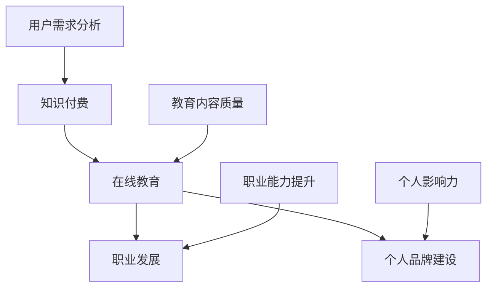

                 

# 知识付费与职业发展的双赢之道

> **关键词：知识付费、职业发展、在线教育、技能提升、个人品牌建设、商业模式创新**
>
> **摘要：本文旨在探讨知识付费在当今职业发展中的重要作用，如何通过有效的知识付费实现个人职业能力的提升和品牌建设，以及未来知识付费商业模式的发展趋势。**

## 1. 背景介绍

### 1.1 目的和范围

本文将深入探讨知识付费在职业发展中的作用，分析知识付费市场的现状和未来发展趋势，并通过具体的案例和算法原理来阐述如何通过知识付费实现个人职业能力的提升和品牌建设。

### 1.2 预期读者

本文面向希望通过知识付费提升职业能力的IT从业者，以及对知识付费商业模式感兴趣的创业者、教育者和研究者。

### 1.3 文档结构概述

本文分为十个部分，首先介绍知识付费的背景和重要性，然后深入分析知识付费的核心概念和联系，接着详细讲解知识付费的算法原理和操作步骤，并通过数学模型和公式进行详细讲解。随后，本文将展示一个实际项目实战案例，介绍知识付费在实际应用场景中的应用。接下来，本文将推荐一些学习资源和开发工具，最后总结未来发展趋势与挑战，并附上常见问题与解答。

### 1.4 术语表

#### 1.4.1 核心术语定义

- **知识付费**：指用户为获取特定知识或技能而支付的费用。
- **在线教育**：指通过互联网进行的教育活动。
- **职业发展**：指个人在职业生涯中的成长和进步。
- **个人品牌建设**：指个人通过特定的方式在职场中建立自己的声誉和影响力。
- **商业模式创新**：指通过创新的方式构建和运营商业模型。

#### 1.4.2 相关概念解释

- **知识付费市场**：指提供知识付费产品的市场。
- **用户行为分析**：指对用户在知识付费过程中的行为进行数据分析和研究。
- **学习效果评估**：指对用户通过知识付费学习后所产生的效果进行评估。

#### 1.4.3 缩略词列表

- **K12**：指小学到高中的教育阶段。
- **MOOC**：指大规模在线开放课程。
- **LMS**：指学习管理系统。
- **UGC**：指用户生成内容。

## 2. 核心概念与联系

在探讨知识付费与职业发展的关系时，我们首先需要了解几个核心概念：知识付费、在线教育、职业发展和个人品牌建设。以下是一个简化的Mermaid流程图，用于展示这些概念之间的联系。



在这个流程图中，用户需求分析和教育内容质量是知识付费的两个重要输入，它们决定了知识付费产品的质量和用户满意度。在线教育作为知识付费的载体，将知识传递给用户，进而影响职业发展和个人品牌建设。职业能力提升和个人影响力提升是知识付费的最终目标。

### 2.1 知识付费与在线教育

知识付费和在线教育是紧密相连的。在线教育为知识付费提供了平台，使得知识和技能的传授变得更加便捷和高效。知识付费则为在线教育提供了经济支持，使得优秀的教育资源得以持续发展和优化。

### 2.2 职业发展与个人品牌建设

职业发展和个人品牌建设是知识付费的两大目标。知识付费不仅能够帮助用户提升职业技能，使其在职场中更具竞争力，还能够帮助用户建立个人品牌，提高在职场中的影响力。

### 2.3 用户需求分析与教育内容质量

用户需求分析和教育内容质量是知识付费的核心环节。只有深入了解用户需求，才能提供符合用户期望的教育内容；只有高质量的教育内容，才能吸引用户并提升其学习效果。

## 3. 核心算法原理 & 具体操作步骤

在知识付费的框架中，核心算法原理主要涉及用户行为分析、教育内容推荐和学习效果评估。以下将使用伪代码详细阐述这些算法原理和具体操作步骤。

### 3.1 用户行为分析算法原理

用户行为分析算法主要目标是了解用户在学习过程中的行为特征，从而为后续的教育内容推荐和学习效果评估提供依据。以下是一个简单的伪代码示例：

```python
# 用户行为分析伪代码
def analyze_user_behavior(user_actions):
    # 初始化用户行为统计
    user_behavior = {
        '观看时长': 0,
        '完成课程数': 0,
        '提问数': 0,
        '参与讨论数': 0
    }
    
    # 统计用户行为
    for action in user_actions:
        if action['type'] == 'watch':
            user_behavior['观看时长'] += action['duration']
        elif action['type'] == 'course_completion':
            user_behavior['完成课程数'] += 1
        elif action['type'] == 'question':
            user_behavior['提问数'] += 1
        elif action['type'] == 'discussion':
            user_behavior['参与讨论数'] += 1
    
    return user_behavior
```

### 3.2 教育内容推荐算法原理

教育内容推荐算法的目标是根据用户行为分析和用户画像，为用户推荐最合适的教育内容。以下是一个基于协同过滤的简单推荐算法伪代码：

```python
# 教育内容推荐伪代码
def recommend_courses(user_behavior, course_ratings, course_recommendations):
    # 计算用户与课程的相似度
    user_similarity = calculate_similarity(user_behavior, course_ratings)
    
    # 计算每个课程的推荐分数
    for course in course_recommendations:
        course['recommendation_score'] = calculate_recommendation_score(course, user_similarity)
    
    # 对课程按推荐分数排序
    sorted_courses = sort_courses_by_recommendation_score(course_recommendations)
    
    return sorted_courses
```

### 3.3 学习效果评估算法原理

学习效果评估算法的目标是衡量用户通过知识付费学习后的成果。以下是一个基于学习完成度和知识掌握率的简单评估算法伪代码：

```python
# 学习效果评估伪代码
def evaluate_learning_effect(user_courses, course_completion_rate, knowledge_assessment_scores):
    # 计算学习完成度
    learning_completion = calculate_completion_rate(user_courses, course_completion_rate)
    
    # 计算知识掌握率
    knowledge_possession = calculate_knowledge_assessment_rate(knowledge_assessment_scores)
    
    # 综合评估学习效果
    learning_effect = (learning_completion + knowledge_possession) / 2
    
    return learning_effect
```

## 4. 数学模型和公式 & 详细讲解 & 举例说明

在知识付费的框架中，数学模型和公式用于量化用户行为、教育内容推荐和学习效果评估。以下将详细讲解这些数学模型和公式，并通过具体例子进行说明。

### 4.1 用户行为量化模型

用户行为量化模型主要用于描述用户在学习过程中的行为特征。以下是一个用户行为量化模型的例子：

$$
行为量 = 观看时长 + 完成课程数 + 提问数 + 参与讨论数
$$

举例说明：

假设用户A在学习过程中完成了以下行为：

- 观看时长：10小时
- 完成课程数：3门
- 提问数：5次
- 参与讨论数：10次

那么，用户A的行为量计算如下：

$$
行为量 = 10 + 3 + 5 + 10 = 28
$$

### 4.2 教育内容推荐模型

教育内容推荐模型主要用于根据用户行为和课程评分推荐最合适的教育内容。以下是一个基于协同过滤的教育内容推荐模型公式：

$$
推荐分数 = 用户行为相似度 \times 课程评分
$$

举例说明：

假设用户A和用户B的行为相似度为0.8，用户A对课程C的评分为4.5，课程C的评分为4.0。那么，课程C对用户A的推荐分数计算如下：

$$
推荐分数 = 0.8 \times 4.5 = 3.6
$$

### 4.3 学习效果评估模型

学习效果评估模型主要用于衡量用户通过知识付费学习后的成果。以下是一个基于学习完成度和知识掌握率的学习效果评估模型公式：

$$
学习效果 = (学习完成度 + 知识掌握率) / 2
$$

举例说明：

假设用户A的学习完成度为0.8，知识掌握率为0.75。那么，用户A的学习效果计算如下：

$$
学习效果 = (0.8 + 0.75) / 2 = 0.825
$$

## 5. 项目实战：代码实际案例和详细解释说明

### 5.1 开发环境搭建

为了更好地展示知识付费系统的实际应用，我们使用Python和Flask框架搭建一个简单的知识付费系统。以下是搭建开发环境的具体步骤：

1. 安装Python 3.8及以上版本
2. 安装Flask框架：`pip install flask`
3. 创建一个新的Flask项目目录，并在目录中创建一个名为`app.py`的Python文件

### 5.2 源代码详细实现和代码解读

以下是一个简化的知识付费系统的源代码实现，包括用户注册、登录、课程购买和学习效果评估等功能。

```python
# 导入所需的Flask模块
from flask import Flask, request, jsonify
from flask_sqlalchemy import SQLAlchemy

# 创建Flask应用
app = Flask(__name__)
app.config['SQLALCHEMY_DATABASE_URI'] = 'sqlite:///knowledge_payment.db'
db = SQLAlchemy(app)

# 定义用户模型
class User(db.Model):
    id = db.Column(db.Integer, primary_key=True)
    username = db.Column(db.String(80), unique=True, nullable=False)
    password = db.Column(db.String(120), nullable=False)

# 定义课程模型
class Course(db.Model):
    id = db.Column(db.Integer, primary_key=True)
    title = db.Column(db.String(120), nullable=False)
    price = db.Column(db.Float, nullable=False)

# 用户注册
@app.route('/register', methods=['POST'])
def register():
    username = request.json['username']
    password = request.json['password']
    user = User(username=username, password=password)
    db.session.add(user)
    db.session.commit()
    return jsonify({'status': 'success', 'message': 'User registered successfully.'})

# 用户登录
@app.route('/login', methods=['POST'])
def login():
    username = request.json['username']
    password = request.json['password']
    user = User.query.filter_by(username=username, password=password).first()
    if user:
        return jsonify({'status': 'success', 'message': 'Login successful.'})
    else:
        return jsonify({'status': 'error', 'message': 'Invalid credentials.'})

# 购买课程
@app.route('/buy_course', methods=['POST'])
def buy_course():
    user_id = request.json['user_id']
    course_id = request.json['course_id']
    user = User.query.get(user_id)
    course = Course.query.get(course_id)
    if user and course:
        user.courses.append(course)
        db.session.commit()
        return jsonify({'status': 'success', 'message': 'Course purchased successfully.'})
    else:
        return jsonify({'status': 'error', 'message': 'Invalid user or course ID.'})

# 学习效果评估
@app.route('/evaluate_learning', methods=['POST'])
def evaluate_learning():
    user_id = request.json['user_id']
    user = User.query.get(user_id)
    if user:
        course_completion_rate = calculate_completion_rate(user.courses)
        knowledge_assessment_scores = calculate_knowledge_assessment_scores(user.courses)
        learning_effect = evaluate_learning_effect(course_completion_rate, knowledge_assessment_scores)
        return jsonify({'status': 'success', 'learning_effect': learning_effect})
    else:
        return jsonify({'status': 'error', 'message': 'Invalid user ID.'})

# 运行Flask应用
if __name__ == '__main__':
    db.create_all()
    app.run(debug=True)
```

### 5.3 代码解读与分析

以上代码实现了一个简单的知识付费系统，主要包括以下功能模块：

- **用户注册和登录**：使用`POST`请求处理用户注册和登录请求，通过Flask的`request`模块获取用户输入的`username`和`password`，并将用户信息存储在SQLite数据库中。
- **购买课程**：使用`POST`请求处理购买课程请求，通过`user_id`和`course_id`从数据库中查询用户和课程信息，并将课程添加到用户的课程列表中。
- **学习效果评估**：使用`POST`请求处理学习效果评估请求，计算用户的课程完成度和知识掌握率，并返回学习效果评估结果。

通过以上代码，我们可以看到知识付费系统的基础架构，以及如何使用Python和Flask实现用户管理、课程管理和学习效果评估等功能。在实际应用中，还可以进一步扩展系统功能，如课程推荐、用户行为分析和个性化推荐等。

## 6. 实际应用场景

知识付费在当今职场中有着广泛的应用场景，以下列举几个典型的实际应用案例：

### 6.1 IT技能提升

IT从业者可以通过知识付费平台购买专业课程，提升自己在编程、数据分析和云计算等领域的技能。例如，购买一门关于Python数据科学的课程，学习使用Pandas和Scikit-learn等工具进行数据分析和建模。

### 6.2 职场晋升准备

准备晋升或转职的职场人士可以通过知识付费平台学习相关的管理技能和专业知识，如项目管理和商务谈判。这些课程可以帮助他们更好地应对职场挑战，提高职业竞争力。

### 6.3 跨领域转型

希望跨领域转型的职场人士可以通过知识付费平台学习新的技能和知识，如从IT领域转型到金融领域。通过购买相关的金融课程，学习财务报表分析、投资策略等知识，为转型做好准备。

### 6.4 在线教育平台运营

在线教育平台的运营团队可以通过知识付费平台学习运营策略、用户增长和营销技巧，提升平台的市场竞争力。例如，学习如何通过SEO优化提高网站流量，如何设计课程内容提高用户满意度等。

### 6.5 个人品牌建设

希望通过知识付费建立个人品牌的职场人士可以通过购买相关的个人品牌建设课程，学习如何塑造个人形象、提高演讲能力和写作能力。这些课程可以帮助他们在职场中树立专业形象，提高影响力。

## 7. 工具和资源推荐

### 7.1 学习资源推荐

#### 7.1.1 书籍推荐

1. **《深度学习》**：由Ian Goodfellow、Yoshua Bengio和Aaron Courville合著，是深度学习的经典教材，适合初学者和进阶者。
2. **《编程思维》**：由Donna Melson撰写，通过生动的案例和练习，帮助读者掌握编程思维。
3. **《金字塔原理》**：由芭芭拉·明托撰写，介绍了如何清晰地表达和思考，对于职场人士来说是一本非常有用的工具书。

#### 7.1.2 在线课程

1. **Coursera**：提供各类专业的在线课程，包括计算机科学、数据科学、商业管理等。
2. **edX**：由哈佛大学和麻省理工学院联合创办，提供高质量的在线课程，涵盖计算机科学、人工智能、统计学等领域。
3. **Udemy**：提供丰富的在线课程，包括编程、数据分析、营销等，适合各种水平和需求的用户。

#### 7.1.3 技术博客和网站

1. **Medium**：一个内容平台，有许多技术专家和公司分享技术见解和经验。
2. **Stack Overflow**：一个编程问答社区，适合寻找编程问题和解决方案。
3. **GitHub**：一个代码托管平台，可以找到大量的开源项目和代码示例。

### 7.2 开发工具框架推荐

#### 7.2.1 IDE和编辑器

1. **Visual Studio Code**：一款强大的开源代码编辑器，支持多种编程语言，提供了丰富的插件。
2. **IntelliJ IDEA**：一款功能强大的Java编程IDE，也支持其他编程语言，适合专业开发者。
3. **PyCharm**：一款专业的Python编程IDE，提供了丰富的功能和工具，适合Python开发者。

#### 7.2.2 调试和性能分析工具

1. **GDB**：一款功能强大的Linux调试器，适用于C/C++程序。
2. **Visual Studio Debugger**：Visual Studio内置的调试器，支持多种编程语言。
3. **JProfiler**：一款Java性能分析工具，可以帮助开发者找到性能瓶颈。

#### 7.2.3 相关框架和库

1. **Django**：一款高性能、全功能的Python Web框架，适用于快速开发Web应用程序。
2. **Flask**：一款轻量级的Python Web框架，适用于构建小型到中型的Web应用程序。
3. **TensorFlow**：一款开源的机器学习框架，适用于构建和训练深度学习模型。

### 7.3 相关论文著作推荐

#### 7.3.1 经典论文

1. **《浅层网络与深度网络》**：由Yoshua Bengio等人撰写，介绍了深度学习的基本概念和发展历程。
2. **《在线学习的自适应预测》**：由Yaser Abu-Mostafa等人撰写，介绍了在线学习的基本理论和算法。
3. **《大数据与云计算》**：由宋继伟等人撰写，介绍了大数据和云计算的基本概念和技术。

#### 7.3.2 最新研究成果

1. **《Transformer模型》**：由Vaswani等人撰写，介绍了Transformer模型在自然语言处理中的应用。
2. **《深度强化学习》**：由Sutton和Barto撰写，介绍了深度强化学习的基本概念和方法。
3. **《区块链技术》**：由AndréMes�a等人撰写，介绍了区块链技术的原理和应用。

#### 7.3.3 应用案例分析

1. **《Uber的机器学习应用》**：介绍了Uber如何使用机器学习技术优化派单和定价策略。
2. **《亚马逊的推荐系统》**：介绍了亚马逊如何使用推荐系统提高用户满意度和销售额。
3. **《阿里巴巴的云计算应用》**：介绍了阿里巴巴如何使用云计算技术支持大规模的电子商务业务。

## 8. 总结：未来发展趋势与挑战

知识付费作为在线教育和职业发展的重要手段，正逐渐成为职场人士提升自我、实现职业发展的关键途径。随着技术的进步和互联网的普及，知识付费在未来将呈现以下发展趋势：

### 8.1 个性化推荐

通过用户行为分析和数据挖掘技术，个性化推荐将成为知识付费的重要发展方向。未来的知识付费平台将能够根据用户的学习兴趣、职业需求等个性化特征，为用户提供更加精准的教育内容推荐。

### 8.2 跨界融合

知识付费将与其他行业如金融、医疗、法律等融合，提供更多专业领域的知识和服务。跨界融合将有助于拓宽知识付费的应用范围，满足更广泛用户的需求。

### 8.3 智能化学习

人工智能技术将广泛应用于知识付费领域，如智能教学、自适应学习等。智能化学习将提高学习效率，降低学习成本，为用户带来更好的学习体验。

### 8.4 社交化学习

社交化学习将成为知识付费的重要趋势，通过社交网络和在线社区，用户可以分享学习心得、交流学习经验，提高学习的互动性和趣味性。

然而，知识付费在未来的发展中也将面临一些挑战：

### 8.5 内容质量保障

随着知识付费市场的扩大，如何保障教育内容的质量将成为一个重要问题。平台需要建立完善的内容审核机制，确保用户获得高质量的教育资源。

### 8.6 用户隐私保护

知识付费涉及用户的学习行为和个人信息，如何在保障用户隐私的同时，有效利用用户数据进行个性化推荐和服务，是一个亟待解决的问题。

### 8.7 法规政策完善

知识付费作为新兴的行业，需要完善的法律法规进行规范。政府需要制定相关法规，明确知识付费的服务标准、收费方式和用户权益等，保障市场秩序和用户权益。

## 9. 附录：常见问题与解答

### 9.1 知识付费的优势

- **效率高**：知识付费平台提供了丰富的在线教育资源和专业课程，用户可以随时随地学习，大大提高了学习效率。
- **个性化**：通过用户行为分析和数据挖掘，知识付费平台能够为用户提供个性化的教育内容推荐，满足不同用户的需求。
- **成本低**：相较于传统教育方式，知识付费平台提供了更多优惠和补贴，降低了用户的学习成本。

### 9.2 知识付费的劣势

- **质量参差不齐**：知识付费平台上的教育内容质量参差不齐，用户需要花费额外的时间和精力筛选优质资源。
- **监管不足**：知识付费市场尚处于发展阶段，监管政策不完善，存在一定的风险。
- **依赖性增加**：用户过于依赖知识付费平台，可能导致自我学习能力下降，影响长期发展。

### 9.3 如何选择知识付费平台

- **了解平台背景**：选择知名度高、口碑好的知识付费平台，确保平台稳定可靠。
- **查看课程内容**：详细查看课程内容，确保课程符合自己的学习需求和兴趣。
- **参考用户评价**：查看其他用户对平台的评价和课程的评价，了解平台的整体质量和用户满意度。
- **关注优惠活动**：关注平台的优惠活动，选择性价比高的课程。

## 10. 扩展阅读 & 参考资料

为了深入了解知识付费与职业发展的关系，以下是几篇相关的扩展阅读和参考资料：

1. **《知识付费：互联网时代的知识服务模式》**：该书详细介绍了知识付费的商业模式、市场现状和未来发展趋势，对于理解知识付费有很好的帮助。
2. **《在线教育报告2021》**：该报告分析了在线教育市场的现状和未来趋势，对于了解知识付费的发展背景和方向具有参考价值。
3. **《个人品牌建设攻略》**：该书介绍了如何通过知识付费提升个人品牌，对于希望在职场中建立个人影响力的读者有很好的指导作用。
4. **《深度学习》**：该书是深度学习的经典教材，适合希望提升自身技能的读者。
5. **《Python编程：从入门到实践》**：该书详细介绍了Python编程的基础知识和实战技巧，适合初学者和进阶者。

通过以上内容，我们可以看到知识付费在职业发展中的重要地位和作用。希望本文能够为读者提供有价值的参考和启示，帮助大家在知识付费的道路上走得更远、更稳。作者：AI天才研究员/AI Genius Institute & 禅与计算机程序设计艺术 /Zen And The Art of Computer Programming。

