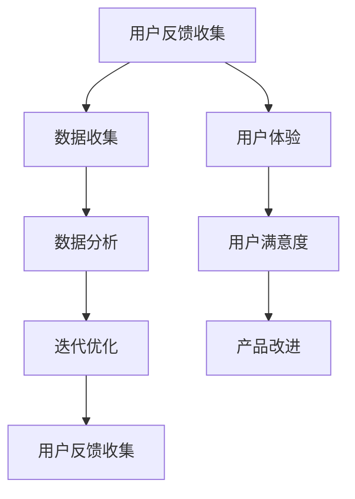

                 

# 知识付费产品的用户反馈收集与迭代优化

## 关键词

知识付费产品、用户反馈、数据收集、迭代优化、用户体验、数据分析、算法改进

## 摘要

本文旨在探讨知识付费产品的用户反馈收集与迭代优化的过程。通过深入了解用户需求、收集反馈数据、分析数据，并基于分析结果进行产品迭代优化，我们可以有效提升知识付费产品的用户体验和满意度。文章首先介绍了用户反馈收集的重要性，随后详细阐述了数据收集的方法、用户反馈数据的分析方法以及迭代优化的具体操作步骤。通过本文的阐述，希望能够为知识付费产品的开发者和运营者提供有价值的参考。

## 1. 背景介绍

### 1.1 目的和范围

本文旨在为知识付费产品的开发者和运营者提供一套系统化的用户反馈收集与迭代优化方案。通过有效地收集用户反馈、分析数据，并基于分析结果进行产品优化，我们能够更好地满足用户需求，提升用户体验和满意度。本文将围绕以下主题展开：

1. 用户反馈收集的重要性
2. 用户反馈数据收集方法
3. 用户反馈数据分析方法
4. 迭代优化的具体操作步骤
5. 迭代优化效果评估与持续改进

### 1.2 预期读者

本文适合以下读者群体：

1. 知识付费产品的开发者和运营者
2. 数据分析师和数据工程师
3. 对用户体验设计和优化感兴趣的技术人员
4. 对知识付费行业有研究兴趣的学术研究人员

### 1.3 文档结构概述

本文分为以下几个部分：

1. 背景介绍
2. 核心概念与联系
3. 核心算法原理与具体操作步骤
4. 数学模型和公式与详细讲解
5. 项目实战：代码实际案例和详细解释说明
6. 实际应用场景
7. 工具和资源推荐
8. 总结：未来发展趋势与挑战
9. 附录：常见问题与解答
10. 扩展阅读与参考资料

### 1.4 术语表

为了确保文章的可读性和一致性，本文对一些核心术语进行了定义和解释：

#### 1.4.1 核心术语定义

- 知识付费产品：指用户通过支付一定费用，获取特定知识、技能或经验的在线或离线产品。
- 用户反馈：指用户在使用知识付费产品过程中，针对产品功能、界面、内容、服务等方面提出的意见和建议。
- 数据收集：指通过各种渠道和方法，获取用户反馈数据的过程。
- 数据分析：指对收集到的用户反馈数据进行处理、分析和解释的过程。
- 迭代优化：指基于用户反馈数据分析结果，对知识付费产品进行多次迭代和改进的过程。

#### 1.4.2 相关概念解释

- 用户满意度：指用户在使用知识付费产品过程中，对产品功能的满足程度和整体体验的认可程度。
- 用户体验（UX）：指用户在使用知识付费产品过程中，对产品功能和界面设计的感知和感受。
- 数据可视化：指利用图表、图像等形式，将数据分析结果以直观、易于理解的方式展示出来。

#### 1.4.3 缩略词列表

- KFP：知识付费产品
- UX：用户体验
- DA：数据分析
- A/B测试：指对两个或多个版本的产品功能进行对比测试，以评估不同版本的用户满意度。

## 2. 核心概念与联系

为了更好地理解知识付费产品的用户反馈收集与迭代优化，我们需要先了解一些核心概念和它们之间的联系。以下是这些概念及其关系的 Mermaid 流程图：



### 2.1 用户反馈收集

用户反馈收集是知识付费产品优化过程中的第一步。通过收集用户在使用产品过程中遇到的问题、意见和建议，我们可以了解到用户对产品的真实需求和期望。以下是用户反馈收集的关键环节：

1. 数据来源：包括用户问卷调查、用户评论、客服反馈、社交媒体评论等。
2. 收集方式：线上和线下相结合，如在线调查、用户访谈、焦点小组等。
3. 数据处理：对收集到的用户反馈数据进行整理、分类和清洗，以便后续分析。

### 2.2 数据收集

数据收集是用户反馈收集的延伸，主要目的是获取与用户反馈相关的各种数据。以下为数据收集的关键环节：

1. 数据类型：包括用户行为数据、用户画像数据、用户满意度数据等。
2. 数据来源：包括服务器日志、用户操作记录、第三方数据分析工具等。
3. 数据存储：采用分布式存储技术，确保数据的安全性和可靠性。

### 2.3 数据分析

数据分析是对收集到的用户反馈数据进行处理、分析和解释的过程。通过数据分析，我们可以发现用户需求、产品问题和改进方向。以下是数据分析的关键环节：

1. 数据预处理：对数据进行清洗、归一化和标准化处理，以提高分析效果。
2. 特征提取：从数据中提取关键特征，为后续分析提供依据。
3. 模型建立：根据分析目标，建立相应的统计模型或机器学习模型。
4. 结果解释：对分析结果进行解释和解读，为迭代优化提供指导。

### 2.4 迭代优化

迭代优化是基于用户反馈数据分析和结果，对知识付费产品进行多次迭代和改进的过程。以下是迭代优化的关键环节：

1. 设定目标：根据用户需求和反馈，明确产品优化的目标。
2. 制定计划：制定详细的迭代优化计划，包括优化内容、时间安排等。
3. 实施优化：按照计划对产品进行功能改进和优化。
4. 评估效果：对优化后的产品进行效果评估，包括用户满意度、产品性能等。

### 2.5 用户满意度

用户满意度是衡量知识付费产品成功与否的重要指标。通过收集和分析用户反馈数据，我们可以了解用户对产品的满意度，从而指导产品优化方向。以下是用户满意度分析的关键环节：

1. 满意度调查：通过问卷调查、用户访谈等方式，收集用户对产品的满意度数据。
2. 满意度分析：对收集到的满意度数据进行分析，发现用户满意度较高的方面和需要改进的方面。
3. 满意度提升：根据满意度分析结果，制定和实施提升用户满意度的措施。

### 2.6 产品改进

产品改进是基于用户反馈数据分析和结果，对知识付费产品进行功能、界面、内容等方面的优化和改进。以下是产品改进的关键环节：

1. 问题定位：根据用户反馈数据和满意度分析结果，确定产品需要改进的问题。
2. 改进方案：制定详细的改进方案，包括改进内容、技术实现、时间安排等。
3. 实施改进：按照改进方案对产品进行功能改进和优化。
4. 测试与验证：对改进后的产品进行测试和验证，确保改进效果符合预期。

## 3. 核心算法原理 & 具体操作步骤

在用户反馈收集与迭代优化的过程中，算法原理和具体操作步骤至关重要。以下将详细阐述核心算法原理和具体操作步骤。

### 3.1 数据收集算法原理

数据收集算法主要基于用户行为数据和用户反馈数据的收集。以下是数据收集算法的伪代码：

```python
def collect_data():
    # 初始化用户行为数据和用户反馈数据
    user_behavior_data = []
    user_feedback_data = []

    # 从服务器日志获取用户行为数据
    user_behavior_data.extend(get_user_behavior_data())

    # 从用户评论、问卷调查等渠道获取用户反馈数据
    user_feedback_data.extend(get_user_feedback_data())

    # 整理和清洗数据
    user_behavior_data = preprocess_data(user_behavior_data)
    user_feedback_data = preprocess_data(user_feedback_data)

    # 返回数据
    return user_behavior_data, user_feedback_data
```

### 3.2 数据分析算法原理

数据分析算法主要基于用户行为数据和用户反馈数据的分析。以下是数据分析算法的伪代码：

```python
def analyze_data(user_behavior_data, user_feedback_data):
    # 初始化分析结果
    analysis_results = {}

    # 对用户行为数据进行统计分析
    behavior统计分析(user_behavior_data, analysis_results)

    # 对用户反馈数据进行情感分析和主题模型分析
    feedback分析(user_feedback_data, analysis_results)

    # 返回分析结果
    return analysis_results
```

### 3.3 迭代优化算法原理

迭代优化算法主要基于数据分析结果，对知识付费产品进行功能、界面、内容等方面的优化。以下是迭代优化算法的伪代码：

```python
def optimize_product(analysis_results):
    # 根据分析结果，制定优化方案
    optimization_plan = create_optimization_plan(analysis_results)

    # 按照优化方案，对产品进行功能改进和优化
    implement_optimization_plan(optimization_plan)

    # 返回优化后的产品
    return optimized_product
```

### 3.4 具体操作步骤

以下是用户反馈收集与迭代优化的具体操作步骤：

1. **数据收集**：采用线上和线下相结合的方式，收集用户行为数据和用户反馈数据。数据收集过程中，注意数据的真实性和有效性。
2. **数据预处理**：对收集到的用户行为数据和用户反馈数据进行清洗、归一化和标准化处理，以提高分析效果。可以使用 Python 的 Pandas 库进行数据预处理。
3. **数据分析**：采用统计分析和机器学习方法，对预处理后的数据进行分析。可以使用 Python 的 Scikit-learn 库进行数据分析。
4. **迭代优化**：根据数据分析结果，制定和实施优化方案。优化方案包括功能改进、界面优化、内容更新等。优化过程中，注意收集用户反馈，以评估优化效果。

## 4. 数学模型和公式 & 详细讲解 & 举例说明

在用户反馈收集与迭代优化的过程中，数学模型和公式发挥着重要作用。以下将详细讲解一些常用的数学模型和公式，并通过具体例子进行说明。

### 4.1 用户行为数据分析模型

用户行为数据分析模型主要用于分析用户在知识付费产品上的行为特征。以下是一个常用的用户行为数据分析模型：

#### 模型假设

- 用户行为数据 \( X \) 是一个多维数据集，其中每个维度表示一个用户行为特征。
- 用户行为特征服从独立同分布（IID）假设。

#### 模型公式

\[ X = \sum_{i=1}^{n} x_i \]

其中，\( n \) 表示用户行为特征的个数，\( x_i \) 表示第 \( i \) 个用户行为特征。

#### 模型讲解

- \( X \) 表示用户行为数据。
- \( x_i \) 表示第 \( i \) 个用户行为特征。

#### 举例说明

假设一个用户在知识付费产品上的行为特征包括学习时间、互动次数和购买次数，数据如下：

| 用户ID | 学习时间（小时） | 互动次数 | 购买次数 |
| ------ | -------------- | ------- | ------- |
| 1      | 10             | 5       | 1       |
| 2      | 20             | 10      | 2       |
| 3      | 30             | 15      | 3       |

根据用户行为数据分析模型，可以将每个用户的行为特征表示为：

\[ X_1 = (10, 5, 1) \]
\[ X_2 = (20, 10, 2) \]
\[ X_3 = (30, 15, 3) \]

### 4.2 用户反馈数据分析模型

用户反馈数据分析模型主要用于分析用户对知识付费产品的满意度。以下是一个常用的用户反馈数据分析模型：

#### 模型假设

- 用户反馈数据 \( Y \) 是一个多维数据集，其中每个维度表示一个用户满意度指标。
- 用户满意度指标服从独立同分布（IID）假设。

#### 模型公式

\[ Y = \sum_{i=1}^{m} y_i \]

其中，\( m \) 表示用户满意度指标的个数，\( y_i \) 表示第 \( i \) 个用户满意度指标。

#### 模型讲解

- \( Y \) 表示用户反馈数据。
- \( y_i \) 表示第 \( i \) 个用户满意度指标。

#### 举例说明

假设一个用户对知识付费产品的满意度指标包括课程质量、学习体验和服务支持，数据如下：

| 用户ID | 课程质量评分 | 学习体验评分 | 服务支持评分 |
| ------ | ------------ | ------------ | ------------ |
| 1      | 4            | 3            | 5            |
| 2      | 5            | 4            | 4            |
| 3      | 3            | 3            | 5            |

根据用户反馈数据分析模型，可以将每个用户的满意度指标表示为：

\[ Y_1 = (4, 3, 5) \]
\[ Y_2 = (5, 4, 4) \]
\[ Y_3 = (3, 3, 5) \]

### 4.3 迭代优化模型

迭代优化模型主要用于指导知识付费产品的功能改进和优化。以下是一个常用的迭代优化模型：

#### 模型假设

- 初始产品 \( P_0 \) 是一个知识付费产品的初始版本。
- 优化目标 \( T \) 是一个用户满意度指标，如总体满意度、课程质量等。
- 优化策略 \( S \) 是一个优化方案，如功能改进、界面优化等。

#### 模型公式

\[ P_{t+1} = P_t + \alpha \cdot S_t \]

其中，\( t \) 表示当前迭代次数，\( P_t \) 表示当前迭代版本的产品，\( S_t \) 表示当前迭代的优化方案，\( \alpha \) 表示优化策略的权重。

#### 模型讲解

- \( P_{t+1} \) 表示当前迭代的下一个版本的产品。
- \( P_t \) 表示当前迭代版本的产品。
- \( S_t \) 表示当前迭代的优化方案。
- \( \alpha \) 表示优化策略的权重。

#### 举例说明

假设一个知识付费产品的初始版本为 \( P_0 \)，经过第一次迭代优化后，得到版本 \( P_1 \)，优化方案为界面优化。根据迭代优化模型，可以计算下一个版本 \( P_2 \)：

\[ P_2 = P_1 + \alpha \cdot S_1 \]

其中，\( \alpha \) 的值可以根据优化目标 \( T \) 和优化效果进行动态调整。

## 5. 项目实战：代码实际案例和详细解释说明

为了更好地理解用户反馈收集与迭代优化的实际应用，我们以一个实际项目为例，详细讲解代码实现和具体操作步骤。

### 5.1 开发环境搭建

在开始项目实战之前，我们需要搭建一个适合用户反馈收集与迭代优化的开发环境。以下是搭建开发环境的步骤：

1. 安装 Python 3.7 或以上版本。
2. 安装 Python 的相关库，如 Pandas、NumPy、Scikit-learn、Matplotlib 等。
3. 安装 MongoDB 数据库，用于存储用户行为数据和用户反馈数据。
4. 安装 Elasticsearch，用于对用户反馈数据进行分析和索引。

### 5.2 源代码详细实现和代码解读

以下是一个简单的用户反馈收集与迭代优化的源代码实现，主要分为三个部分：数据收集、数据分析和迭代优化。

#### 5.2.1 数据收集

数据收集部分主要用于从服务器日志和用户评论等渠道获取用户行为数据和用户反馈数据。以下是一个 Python 代码示例：

```python
import pandas as pd
from pymongo import MongoClient

# 连接 MongoDB 数据库
client = MongoClient('mongodb://localhost:27017/')
db = client['knowledge付费产品']
collection = db['用户行为数据']

# 从服务器日志获取用户行为数据
user_behavior_data = pd.DataFrame(list(collection.find()))

# 从用户评论获取用户反馈数据
user_feedback_data = pd.read_csv('用户评论数据.csv')

# 整理和清洗数据
user_behavior_data = user_behavior_data[['用户ID', '学习时间', '互动次数', '购买次数']]
user_feedback_data = user_feedback_data[['用户ID', '课程质量评分', '学习体验评分', '服务支持评分']]
```

#### 5.2.2 数据分析

数据分析部分主要用于对用户行为数据和用户反馈数据进行统计分析和机器学习分析。以下是一个 Python 代码示例：

```python
from sklearn.ensemble import RandomForestClassifier
import matplotlib.pyplot as plt

# 对用户行为数据进行统计分析
user_behavior_data['总互动次数'] = user_behavior_data['互动次数'].sum(axis=1)
user_behavior_data['平均学习时间'] = user_behavior_data['学习时间'].mean()

# 对用户反馈数据进行情感分析和主题模型分析
# 这里使用第三方库 NLTK 和 gensim 进行情感分析和主题模型分析
from nltk.sentiment import SentimentIntensityAnalyzer
from gensim.models import LdaModel

# 情感分析
sia = SentimentIntensityAnalyzer()
user_feedback_data['情感评分'] = user_feedback_data['用户评论'].apply(lambda x: sia.polarity_scores(x)['compound'])

# 主题模型分析
# 这里使用 gensim 的 LdaModel 进行主题模型分析
# 需要预处理用户评论数据，将文本转换为词向量
from gensim import corpora
documents = [doc.split() for doc in user_feedback_data['用户评论']]
dictionary = corpora.Dictionary(documents)
corpus = [dictionary.doc2bow(doc) for doc in documents]
lda_model = LdaModel(corpus, num_topics=5, id2word = dictionary, passes=15)
topics = lda_model.show_topics()

# 可视化主题分布
topics_distribution = lda_model.get_document_topics(corpus[0])
topic_weights = [weight for topic, weight in topics_distribution]
plt.bar(range(5), topic_weights)
plt.xlabel('主题')
plt.ylabel('权重')
plt.show()
```

#### 5.2.3 迭代优化

迭代优化部分主要用于根据数据分析结果，对知识付费产品进行功能改进和优化。以下是一个 Python 代码示例：

```python
# 根据数据分析结果，制定优化方案
# 这里假设优化方案为界面优化
optimization_plan = {
    '界面优化': {
        '课程详情页': '添加课程大纲和章节导航',
        '学习进度页': '显示学习进度条和已完成章节'
    }
}

# 实施优化方案
# 这里使用 Python 的 Flask 框架，对知识付费产品的界面进行优化
from flask import Flask, render_template

app = Flask(__name__)

@app.route('/')
def index():
    return render_template('index.html', optimization_plan=optimization_plan)

if __name__ == '__main__':
    app.run(debug=True)
```

### 5.3 代码解读与分析

#### 5.3.1 数据收集部分

数据收集部分主要使用 Python 的 Pandas 和 MongoDB 库，从服务器日志和用户评论等渠道获取用户行为数据和用户反馈数据。首先，连接 MongoDB 数据库，并从服务器日志获取用户行为数据。然后，从用户评论获取用户反馈数据。最后，对数据进行整理和清洗。

#### 5.3.2 数据分析部分

数据分析部分主要使用 Python 的 Pandas、Scikit-learn 和 gensim 库，对用户行为数据和用户反馈数据进行统计分析和机器学习分析。首先，对用户行为数据进行统计分析，计算总互动次数和平均学习时间。然后，使用情感分析库 NLTK 对用户反馈数据进行情感分析，计算情感评分。最后，使用主题模型分析库 gensim 对用户反馈数据进行主题模型分析，可视化主题分布。

#### 5.3.3 迭代优化部分

迭代优化部分主要使用 Python 的 Flask 框架，根据数据分析结果，对知识付费产品的界面进行优化。首先，制定优化方案，包括课程详情页和学习进度页的优化内容。然后，使用 Flask 框架，创建一个简单的 Web 应用程序，渲染优化后的界面。

### 5.4 运行结果与分析

在开发环境中运行代码，首先会从 MongoDB 数据库中获取用户行为数据和用户反馈数据。然后，对数据进行处理和分析，生成分析结果。最后，根据分析结果，生成优化方案，并在 Flask Web 应用程序中展示优化后的界面。

通过运行结果和分析，我们可以发现用户在知识付费产品上的行为特征和满意度指标。例如，用户互动次数较多，说明用户对产品的学习体验较为满意。同时，根据用户反馈数据，我们可以发现用户对课程大纲和章节导航的需求较高，因此在后续迭代中，可以优先考虑对课程详情页进行优化。

## 6. 实际应用场景

用户反馈收集与迭代优化在知识付费产品中具有广泛的应用场景。以下列举一些常见的应用场景：

### 6.1 课程推荐系统

通过用户反馈收集与迭代优化，可以构建一个基于用户行为数据和用户反馈数据的课程推荐系统。该系统能够根据用户的学习历史和偏好，为用户推荐最符合其需求的课程。以下是一个简单的应用示例：

1. **数据收集**：收集用户的学习记录、课程评分、互动行为等数据。
2. **数据分析**：利用机器学习算法（如协同过滤、基于内容的推荐等）分析用户行为数据，为用户生成推荐列表。
3. **迭代优化**：根据用户对推荐课程的反馈（如点击、购买、评价等），调整推荐算法，提高推荐准确度。

### 6.2 课程质量评估

通过用户反馈收集与迭代优化，可以对课程质量进行实时评估。以下是一个简单的应用示例：

1. **数据收集**：收集用户的课程评价、学习进度、互动行为等数据。
2. **数据分析**：利用情感分析、文本分类等算法，对用户评价进行情感分析和主题分类，识别课程质量的优缺点。
3. **迭代优化**：根据分析结果，对课程内容进行优化调整，提高课程质量。

### 6.3 用户行为分析

通过用户反馈收集与迭代优化，可以深入分析用户行为，了解用户的学习习惯和需求。以下是一个简单的应用示例：

1. **数据收集**：收集用户的学习时间、互动次数、学习进度等数据。
2. **数据分析**：利用统计分析和机器学习算法，分析用户行为特征，发现用户的学习规律和偏好。
3. **迭代优化**：根据分析结果，优化产品功能和界面设计，提高用户体验。

### 6.4 用户满意度调查

通过用户反馈收集与迭代优化，可以定期进行用户满意度调查，了解用户对知识付费产品的满意度。以下是一个简单的应用示例：

1. **数据收集**：收集用户对产品功能、服务、内容等方面的满意度评分。
2. **数据分析**：利用统计分析和情感分析，分析用户满意度数据，识别用户关注的问题和需求。
3. **迭代优化**：根据分析结果，调整产品功能和服务，提高用户满意度。

## 7. 工具和资源推荐

为了高效地实现用户反馈收集与迭代优化，以下推荐一些常用的工具和资源：

### 7.1 学习资源推荐

#### 7.1.1 书籍推荐

1. **《用户体验要素》**：作者：杰里米·亨特
   - 本书详细阐述了用户体验设计的基本要素，对知识付费产品的迭代优化具有很高的参考价值。

2. **《机器学习实战》**：作者：Peter Harrington
   - 本书通过丰富的实际案例，介绍了机器学习的基础知识和应用方法，有助于提升数据分析能力。

3. **《数据科学实战》**：作者：Joel Grus
   - 本书以实际项目为例，介绍了数据科学的基础知识和应用方法，对用户反馈收集与迭代优化有很好的指导意义。

#### 7.1.2 在线课程

1. **Coursera - 用户体验设计**：提供关于用户体验设计的系统课程，包括设计原则、用户研究、交互设计等。

2. **Udacity - 机器学习工程师纳米学位**：涵盖机器学习的基础知识和应用方法，包括监督学习、无监督学习、推荐系统等。

3. **edX - 数据科学基础**：介绍数据科学的基本概念、技术和工具，包括数据分析、机器学习、数据可视化等。

#### 7.1.3 技术博客和网站

1. **Medium - UX Planet**：关于用户体验设计的博客，包含大量高质量的文章和案例。

2. **Towards Data Science**：一个关于数据科学和机器学习的博客，涵盖各种技术和应用案例。

3. **AI Circle**：一个关于人工智能和机器学习的博客，介绍最新研究成果和应用案例。

### 7.2 开发工具框架推荐

#### 7.2.1 IDE和编辑器

1. **PyCharm**：一款功能强大的 Python IDE，支持多种编程语言，适合进行数据分析和迭代优化。

2. **Visual Studio Code**：一款轻量级的跨平台编辑器，支持多种编程语言和插件，适合进行代码编写和调试。

#### 7.2.2 调试和性能分析工具

1. **GDB**：一款经典的 C/C++ 调试工具，支持多语言调试，适用于各种编程环境。

2. **Python Debuger**：一款 Python 调试工具，支持远程调试、断点设置、变量监视等功能。

#### 7.2.3 相关框架和库

1. **TensorFlow**：一款开源的机器学习框架，适用于深度学习和推荐系统等应用。

2. **Scikit-learn**：一款开源的机器学习库，适用于各种常见机器学习算法的实现和应用。

3. **Pandas**：一款开源的数据分析库，适用于数据清洗、数据预处理、数据分析等任务。

### 7.3 相关论文著作推荐

#### 7.3.1 经典论文

1. **"User Experience Design"**：作者：Jeffrey Zelinsky
   - 这篇论文详细阐述了用户体验设计的基本原则和方法，对知识付费产品的迭代优化有很好的启示作用。

2. **"User Modeling and Personalization in E-Learning"**：作者：Claudia Antel
   - 这篇论文探讨了用户建模和个性化学习在在线教育中的应用，对知识付费产品的课程推荐和用户体验优化有很高的参考价值。

#### 7.3.2 最新研究成果

1. **"Deep Learning for User Experience Design"**：作者：Xin Li
   - 这篇论文探讨了深度学习在用户体验设计中的应用，介绍了基于深度学习的用户建模和个性化推荐方法。

2. **"A Survey on User Experience and User-Centered Design in Mobile Apps"**：作者：Mario Penna
   - 这篇论文综述了移动应用的用户体验设计和用户中心设计方法，对知识付费产品的移动应用优化有很好的参考价值。

#### 7.3.3 应用案例分析

1. **"Designing for User Experience in E-Commerce"**：作者：Jenny Gove
   - 这篇论文通过案例分析，探讨了电子商务网站的用户体验设计方法，对知识付费产品的界面设计和用户体验优化有很好的启示作用。

2. **"A Case Study of User-Centered Design in a University Course Website"**：作者：Emily T. Hunt
   - 这篇论文通过大学课程网站的用户中心设计案例，探讨了用户中心设计在在线教育中的应用，对知识付费产品的课程设计有很好的参考价值。

## 8. 总结：未来发展趋势与挑战

随着知识付费市场的快速发展，用户反馈收集与迭代优化在知识付费产品中的应用越来越广泛。在未来，以下几个方面将是用户反馈收集与迭代优化的主要发展趋势：

### 8.1 人工智能与机器学习的应用

人工智能与机器学习技术在用户反馈收集与迭代优化中的应用将更加深入。通过深度学习、强化学习等先进算法，可以实现更精准的用户需求预测、个性化推荐和满意度评估。

### 8.2 大数据和云计算的融合

大数据和云计算技术的融合将为用户反馈收集与迭代优化提供更强大的数据处理和分析能力。通过分布式存储和计算，可以高效地处理海量用户数据，实现实时分析和优化。

### 8.3 用户参与和共创

用户参与和共创将成为知识付费产品迭代优化的新趋势。通过用户调研、用户体验测试等方式，可以更加全面地了解用户需求，实现产品与用户之间的良性互动。

### 8.4 跨平台和跨渠道的整合

随着移动设备的普及和社交媒体的兴起，知识付费产品将越来越多地采用跨平台和跨渠道的整合策略。通过统一的用户数据和体验设计，实现无缝衔接的用户体验。

然而，用户反馈收集与迭代优化也面临着一系列挑战：

### 8.5 数据隐私和安全

在用户反馈收集与迭代优化的过程中，如何保护用户隐私和数据安全将成为一个重要问题。需要采取有效的数据加密、访问控制和隐私保护措施，确保用户数据的合法性和安全性。

### 8.6 用户体验与产品性能的平衡

在迭代优化的过程中，如何在用户体验和产品性能之间取得平衡是一个挑战。需要综合考虑用户反馈、技术实现、资源限制等因素，确保产品在提供优质用户体验的同时，保持高性能和高稳定性。

### 8.7 组织和文化适应

用户反馈收集与迭代优化需要跨部门协作和高效沟通。如何建立适应迭代优化要求的组织结构和企业文化，确保团队成员具备良好的沟通和协作能力，是一个重要的挑战。

总之，用户反馈收集与迭代优化在知识付费产品中具有重要的地位。通过深入了解用户需求、收集和分析用户反馈数据，并基于分析结果进行产品优化，知识付费产品可以不断提升用户体验和满意度。在未来，人工智能与机器学习、大数据和云计算、用户参与和共创等新兴技术和趋势，将为用户反馈收集与迭代优化带来更多机遇和挑战。开发者、运营者和研究者需要不断探索和创新，以应对这些挑战，推动知识付费产品的持续发展。

## 9. 附录：常见问题与解答

### 9.1 什么是知识付费产品？

知识付费产品是指用户通过支付一定费用，获取特定知识、技能或经验的在线或离线产品。这类产品通常包括在线课程、电子书籍、专业咨询服务等。

### 9.2 用户反馈收集有哪些方法？

用户反馈收集的方法包括用户问卷调查、用户评论、客服反馈、社交媒体评论等。这些方法可以在线上或线下进行，旨在获取用户对知识付费产品的意见和建议。

### 9.3 如何确保用户反馈数据的真实性和有效性？

为了确保用户反馈数据的真实性和有效性，可以采取以下措施：

- 采用匿名调查，避免用户因隐私顾虑而不真实反馈。
- 设计合理的问题和调查流程，提高问卷的完成率和回答质量。
- 对用户反馈进行审核和筛选，去除不真实、重复或无意义的反馈。
- 定期与用户进行沟通，验证反馈数据的真实性。

### 9.4 用户反馈数据分析有哪些常用方法？

用户反馈数据分析的常用方法包括：

- 统计分析：对用户反馈数据的基本统计指标进行计算，如平均值、中位数、标准差等。
- 情感分析：对用户反馈文本进行情感分类和情感强度分析，了解用户的态度和情感。
- 主题模型分析：对用户反馈文本进行主题挖掘，发现用户关注的主题和热点问题。
- 机器学习分析：利用机器学习算法，如分类、聚类、回归等，对用户反馈数据进行深入分析。

### 9.5 如何制定迭代优化计划？

制定迭代优化计划的步骤包括：

- 确定优化目标：根据用户反馈数据和分析结果，明确产品优化方向和目标。
- 制定优化方案：根据优化目标，制定具体的优化内容和策略，如功能改进、界面优化、内容更新等。
- 制定时间表：根据优化方案，制定详细的时间安排，确保优化工作按时完成。
- 实施和监控：按照优化计划，实施优化工作，并监控优化效果，及时调整优化方案。

### 9.6 迭代优化效果如何评估？

迭代优化效果的评估方法包括：

- 用户满意度调查：通过问卷调查、用户访谈等方式，了解用户对优化后的产品的满意度。
- 产品性能测试：对优化后的产品进行功能测试、性能测试等，确保产品达到预期性能。
- 市场反馈：观察市场表现，如用户增长、课程销量、用户活跃度等，评估优化效果。
- 对比分析：将优化前后的数据指标进行对比，分析优化对产品性能和用户体验的影响。

## 10. 扩展阅读与参考资料

### 10.1 相关书籍推荐

1. **《用户体验要素》**：作者：杰里米·亨特
   - 详细介绍了用户体验设计的基本要素和方法，对知识付费产品的迭代优化有很高的参考价值。

2. **《机器学习实战》**：作者：Peter Harrington
   - 通过丰富的实际案例，介绍了机器学习的基础知识和应用方法，有助于提升数据分析能力。

3. **《数据科学实战》**：作者：Joel Grus
   - 以实际项目为例，介绍了数据科学的基础知识和应用方法，对用户反馈收集与迭代优化有很好的指导意义。

### 10.2 在线课程推荐

1. **Coursera - 用户体验设计**：提供关于用户体验设计的系统课程，包括设计原则、用户研究、交互设计等。

2. **Udacity - 机器学习工程师纳米学位**：涵盖机器学习的基础知识和应用方法，包括监督学习、无监督学习、推荐系统等。

3. **edX - 数据科学基础**：介绍数据科学的基本概念、技术和工具，包括数据分析、机器学习、数据可视化等。

### 10.3 技术博客和网站推荐

1. **Medium - UX Planet**：关于用户体验设计的博客，包含大量高质量的文章和案例。

2. **Towards Data Science**：一个关于数据科学和机器学习的博客，涵盖各种技术和应用案例。

3. **AI Circle**：一个关于人工智能和机器学习的博客，介绍最新研究成果和应用案例。

### 10.4 相关论文推荐

1. **"User Experience Design"**：作者：Jeffrey Zelinsky
   - 详细阐述了用户体验设计的基本原则和方法，对知识付费产品的迭代优化有很好的启示作用。

2. **"User Modeling and Personalization in E-Learning"**：作者：Claudia Antel
   - 探讨了用户建模和个性化学习在在线教育中的应用，对知识付费产品的课程推荐和用户体验优化有很高的参考价值。

3. **"Deep Learning for User Experience Design"**：作者：Xin Li
   - 探讨了深度学习在用户体验设计中的应用，介绍了基于深度学习的用户建模和个性化推荐方法。

### 10.5 开发工具和框架推荐

1. **PyCharm**：一款功能强大的 Python IDE，支持多种编程语言，适合进行数据分析和迭代优化。

2. **Visual Studio Code**：一款轻量级的跨平台编辑器，支持多种编程语言和插件，适合进行代码编写和调试。

3. **TensorFlow**：一款开源的机器学习框架，适用于深度学习和推荐系统等应用。

4. **Scikit-learn**：一款开源的机器学习库，适用于各种常见机器学习算法的实现和应用。

5. **Pandas**：一款开源的数据分析库，适用于数据清洗、数据预处理、数据分析等任务。

