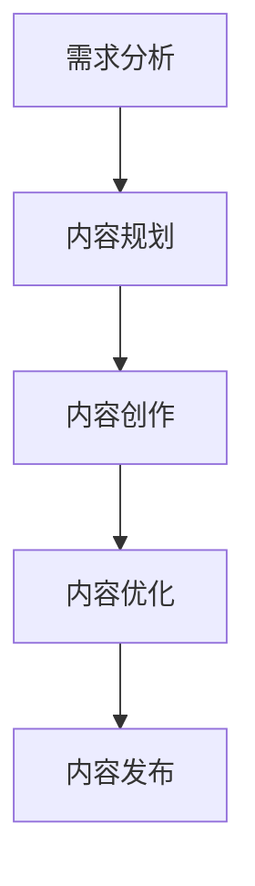
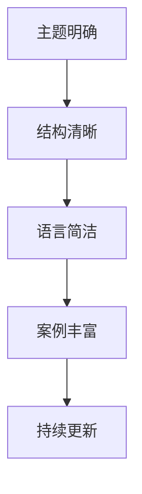
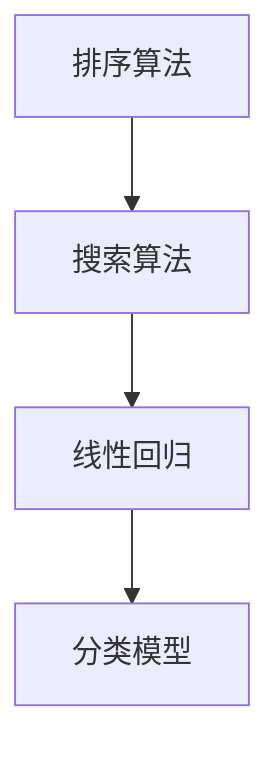
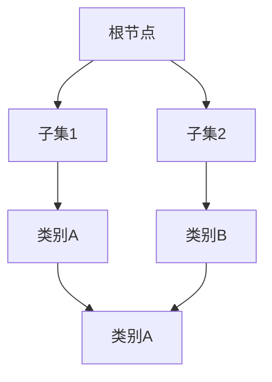

                 

# 知识付费内容创作：程序员的秘诀

> **关键词：** 知识付费、内容创作、程序员、教程、算法、数学模型、实战案例
> 
> **摘要：** 本文将深入探讨程序员如何通过知识付费内容创作，提升个人品牌价值和市场竞争力。文章涵盖了内容创作的核心概念、算法原理、数学模型、实战案例等多个方面，旨在为程序员提供一套系统性的创作方法和策略。

## 1. 背景介绍

### 1.1 目的和范围

本文旨在帮助程序员理解知识付费内容创作的重要性，并为其提供一套实用的创作方法和策略。通过本文的阅读，读者将能够：

- 明确知识付费内容的定义和特点。
- 掌握内容创作的核心概念和原理。
- 学会使用算法和数学模型来支撑内容创作。
- 实现代码实际案例和详细解释说明。
- 了解实际应用场景和工具资源推荐。

### 1.2 预期读者

本文适合以下读者群体：

- 有志于通过知识付费内容创作提升个人品牌价值的程序员。
- 想要学习如何创作高质量技术博客和教程的程序员。
- 希望掌握算法和数学模型在内容创作中应用的技术专家。

### 1.3 文档结构概述

本文将分为以下几个部分：

- **第1部分：背景介绍**：介绍本文的目的、范围和预期读者。
- **第2部分：核心概念与联系**：讲解内容创作相关的核心概念和原理。
- **第3部分：核心算法原理 & 具体操作步骤**：分析算法原理并使用伪代码进行详细阐述。
- **第4部分：数学模型和公式 & 详细讲解 & 举例说明**：介绍数学模型和相关公式，并进行详细讲解和举例说明。
- **第5部分：项目实战：代码实际案例和详细解释说明**：通过实际案例展示代码实现过程。
- **第6部分：实际应用场景**：讨论知识付费内容创作的实际应用场景。
- **第7部分：工具和资源推荐**：推荐学习资源和开发工具。
- **第8部分：总结：未来发展趋势与挑战**：总结知识付费内容创作的发展趋势和挑战。
- **第9部分：附录：常见问题与解答**：解答读者可能遇到的问题。
- **第10部分：扩展阅读 & 参考资料**：提供进一步学习的资源。

### 1.4 术语表

#### 1.4.1 核心术语定义

- **知识付费内容**：指为用户提供有价值的信息、知识和技能的内容，用户需付费才能获取。
- **内容创作**：指通过文字、图片、音频、视频等多种形式，创造具有独特价值和吸引力的内容。
- **算法**：解决特定问题的步骤，可以用于分析和处理大量数据。
- **数学模型**：用数学语言描述的问题模型，用于对问题进行定量分析和求解。

#### 1.4.2 相关概念解释

- **个人品牌价值**：指个人在市场中的知名度和影响力，可通过知识付费内容创作进行提升。
- **市场竞争力**：指个人在市场竞争中的优势，可通过提供高质量的知识付费内容来增强。

#### 1.4.3 缩略词列表

- **IT**：信息技术
- **AI**：人工智能
- **IDE**：集成开发环境
- **LaTeX**：排版系统

## 2. 核心概念与联系

在知识付费内容创作中，核心概念和原理的掌握至关重要。以下将介绍与内容创作相关的重要概念，并使用 Mermaid 流程图展示它们之间的联系。

### 2.1 知识付费内容创作流程

知识付费内容创作流程包括以下几个阶段：

1. **需求分析**：了解用户需求，确定内容主题。
2. **内容规划**：制定内容大纲，明确各章节内容。
3. **内容创作**：撰写文字、图片、音频、视频等内容。
4. **内容优化**：对内容进行修订和优化，提升用户体验。
5. **内容发布**：将内容发布到知识付费平台，供用户购买。

以下是一个 Mermaid 流程图，展示了知识付费内容创作的流程：



### 2.2 内容创作要素

知识付费内容创作涉及多个要素，包括：

- **主题明确**：内容主题要明确、具体，易于用户理解。
- **结构清晰**：内容结构要清晰，便于用户阅读和查找。
- **语言简洁**：语言要简洁易懂，避免冗长和复杂的句子。
- **案例丰富**：通过实际案例来阐述问题，增强内容说服力。
- **持续更新**：定期更新内容，保持内容的时效性和吸引力。

以下是一个 Mermaid 流程图，展示了内容创作要素之间的联系：



### 2.3 算法和数学模型

在知识付费内容创作中，算法和数学模型的应用可以提升内容的深度和实用性。以下是一些常用的算法和数学模型：

- **排序算法**：用于对数据进行排序，常见算法有冒泡排序、快速排序等。
- **搜索算法**：用于在数据中查找特定元素，常见算法有二分查找、深度优先搜索等。
- **线性回归**：用于分析变量之间的关系，预测一个变量的值。
- **分类模型**：用于对数据进行分类，常见模型有决策树、支持向量机等。

以下是一个 Mermaid 流程图，展示了算法和数学模型在知识付费内容创作中的应用：



通过上述核心概念和联系的介绍，我们可以更好地理解知识付费内容创作的过程和要素。接下来，我们将进一步探讨核心算法原理和具体操作步骤。

## 3. 核心算法原理 & 具体操作步骤

在知识付费内容创作中，算法的应用可以显著提升内容的深度和实用性。本节将介绍一些核心算法原理，并使用伪代码进行具体操作步骤的讲解。

### 3.1 排序算法

排序算法是数据处理的基石，常见的排序算法包括冒泡排序、快速排序等。以下以冒泡排序为例，介绍其原理和操作步骤。

#### 3.1.1 原理

冒泡排序（Bubble Sort）是一种简单直观的排序算法。它重复遍历要排序的数列，每次比较两个相邻的元素，如果它们的顺序错误就把它们交换过来。遍历数列的工作是重复地进行，直到没有再需要交换的元素为止。

#### 3.1.2 伪代码

```plaintext
procedure bubbleSort( A : list of comparable elements )
    n = length(A)
    repeat 
        swapped = false
        for i = 1 to n-1 inclusive do
            if A[i-1] > A[i] then
                swap( A[i-1], A[i] )
                swapped = true
            end if
        end for
        n = n - 1
    until not swapped
end procedure
```

#### 3.1.3 步骤

1. 从第一个元素开始，相邻两个元素进行比较。
2. 如果前一个元素大于后一个元素，交换它们的位置。
3. 重复步骤1和步骤2，直到整个数组被排序。

### 3.2 搜索算法

搜索算法用于在数据中查找特定元素。以下以二分查找为例，介绍其原理和操作步骤。

#### 3.2.1 原理

二分查找（Binary Search）是一种在有序数组中查找某一特定元素的搜索算法。算法首先确定数组的中间元素，如果中间元素正好是要查找的元素，则搜索过程结束；如果某一特定元素大于或小于中间元素，则搜索过程将在数组的大于或小于中间元素的那一半区域中继续。

#### 3.2.2 伪代码

```plaintext
function binarySearch( A : list of sorted elements, key )
    low = 0
    high = length(A) - 1
    while low <= high do
        mid = (low + high) / 2
        if A[mid] = key then
            return mid
        else if A[mid] < key then
            low = mid + 1
        else
            high = mid - 1
        end if
    end while
    return -1
end function
```

#### 3.2.3 步骤

1. 确定数组的中间元素。
2. 如果中间元素等于要查找的元素，返回中间元素的位置。
3. 如果中间元素小于要查找的元素，搜索右半部分。
4. 如果中间元素大于要查找的元素，搜索左半部分。
5. 重复步骤1至步骤4，直到找到要查找的元素或确定元素不存在。

### 3.3 线性回归

线性回归是一种用于分析变量之间线性关系的数学模型。以下介绍其原理和操作步骤。

#### 3.3.1 原理

线性回归模型通过拟合一条直线来描述两个变量之间的关系。假设自变量为 $x$，因变量为 $y$，线性回归模型可以表示为：

$$y = a \cdot x + b$$

其中，$a$ 是斜率，表示变量之间的相关程度；$b$ 是截距，表示当 $x=0$ 时的 $y$ 值。

#### 3.3.2 伪代码

```plaintext
function linearRegression( x : array of numbers, y : array of numbers )
    n = length(x)
    sumX = 0
    sumY = 0
    sumXY = 0
    sumXX = 0
    for i = 1 to n do
        sumX = sumX + x[i]
        sumY = sumY + y[i]
        sumXY = sumXY + x[i] * y[i]
        sumXX = sumXX + x[i] * x[i]
    end for
    a = (n * sumXY - sumX * sumY) / (n * sumXX - sumX * sumX)
    b = (sumY - a * sumX) / n
    return (a, b)
end function
```

#### 3.3.3 步骤

1. 计算自变量 $x$ 和因变量 $y$ 的各项和。
2. 根据公式计算斜率 $a$ 和截距 $b$。
3. 返回拟合直线的斜率和截距。

通过上述核心算法原理和具体操作步骤的讲解，程序员可以更好地理解算法在知识付费内容创作中的应用。接下来，我们将探讨数学模型和公式的详细讲解与举例说明。

## 4. 数学模型和公式 & 详细讲解 & 举例说明

在知识付费内容创作中，数学模型和公式的运用可以增强内容的深度和专业性。以下将介绍一些常用的数学模型和公式，并进行详细讲解与举例说明。

### 4.1 线性回归

线性回归是一种用于分析两个变量之间线性关系的数学模型，其公式为：

$$y = a \cdot x + b$$

其中，$a$ 为斜率，表示变量 $x$ 对变量 $y$ 的影响程度；$b$ 为截距，表示当 $x=0$ 时 $y$ 的值。

#### 4.1.1 计算斜率 $a$

斜率 $a$ 的计算公式为：

$$a = \frac{n \cdot \sum(x \cdot y) - \sum(x) \cdot \sum(y)}{n \cdot \sum(x^2) - (\sum(x))^2}$$

其中，$n$ 为样本数量，$\sum$ 表示求和。

#### 4.1.2 计算截距 $b$

截距 $b$ 的计算公式为：

$$b = \frac{\sum(y) - a \cdot \sum(x)}{n}$$

#### 4.1.3 举例说明

假设我们有一组样本数据，$x$ 和 $y$ 的值如下：

| $x$ | $y$ |
| --- | --- |
| 1   | 2   |
| 2   | 4   |
| 3   | 6   |
| 4   | 8   |

计算斜率 $a$：

$$a = \frac{4 \cdot (1 \cdot 2 + 2 \cdot 4 + 3 \cdot 6 + 4 \cdot 8) - (1 + 2 + 3 + 4) \cdot (2 + 4 + 6 + 8)}{4 \cdot (1^2 + 2^2 + 3^2 + 4^2) - (1 + 2 + 3 + 4)^2} = \frac{4 \cdot 30 - 10 \cdot 20}{4 \cdot 30 - 10^2} = \frac{120 - 200}{120 - 100} = -\frac{80}{20} = -4$$

计算截距 $b$：

$$b = \frac{2 + 4 + 6 + 8 - (-4) \cdot (1 + 2 + 3 + 4)}{4} = \frac{20 + 20}{4} = 10$$

因此，线性回归模型为：

$$y = -4 \cdot x + 10$$

### 4.2 决策树

决策树是一种用于分类和回归分析的树形结构，它根据特征的不同值，将数据集分割成子集，直到满足某种停止条件。决策树的公式为：

$$\prod_{i=1}^n f_i(x_i)$$

其中，$f_i(x_i)$ 表示第 $i$ 个特征在当前节点对数据的分割结果。

#### 4.2.1 举例说明

假设我们有一个特征 $x_1$ 和 $x_2$，以及三个类别 $A$、$B$、$C$，数据如下：

| $x_1$ | $x_2$ | 类别   |
| ----- | ----- | ------ |
| 1     | 2     | A      |
| 2     | 3     | B      |
| 3     | 4     | C      |
| 4     | 5     | A      |

决策树分割过程如下：

1. 以 $x_1$ 为分裂特征，分割成两个子集：
   - 子集1：$(1, 2), (4, 5)$
   - 子集2：$(2, 3)$
2. 以 $x_2$ 为分裂特征，对子集2进行进一步分割：
   - 子集2.1：$(2, 3)$

最终决策树如下：



### 4.3 概率分布

概率分布是一种描述随机变量可能取值的概率分布函数。常见的概率分布包括正态分布、二项分布等。

#### 4.3.1 正态分布

正态分布的概率密度函数为：

$$f(x) = \frac{1}{\sqrt{2\pi\sigma^2}} \cdot e^{-\frac{(x-\mu)^2}{2\sigma^2}}$$

其中，$\mu$ 表示均值，$\sigma$ 表示标准差。

#### 4.3.2 二项分布

二项分布的概率质量函数为：

$$P(X=k) = C_n^k \cdot p^k \cdot (1-p)^{n-k}$$

其中，$n$ 表示试验次数，$k$ 表示成功的次数，$p$ 表示每次试验成功的概率。

通过以上数学模型和公式的讲解与举例说明，程序员可以更好地理解和应用这些数学工具，为知识付费内容创作提供更有力的支持。

### 4.4 统计模型

在内容创作中，统计模型可以帮助我们分析数据、预测趋势和评估效果。以下介绍一些常用的统计模型及其应用。

#### 4.4.1 相关性分析

相关性分析用于衡量两个变量之间的关系强度。皮尔逊相关系数是衡量线性相关性的常用指标，其计算公式为：

$$r = \frac{\sum{(x_i - \bar{x})(y_i - \bar{y})}}{\sqrt{\sum{(x_i - \bar{x})^2}\sum{(y_i - \bar{y})^2}}}$$

其中，$x_i$ 和 $y_i$ 分别表示第 $i$ 个观测值，$\bar{x}$ 和 $\bar{y}$ 分别表示变量 $x$ 和 $y$ 的平均值。

#### 4.4.2 回归分析

回归分析用于预测一个变量（因变量）与一个或多个变量（自变量）之间的关系。线性回归是最常用的回归分析方法，其公式为：

$$y = \beta_0 + \beta_1 \cdot x$$

其中，$\beta_0$ 是截距，$\beta_1$ 是斜率。

#### 4.4.3 因子分析

因子分析用于揭示多个变量之间的潜在关系。其基本思想是将多个变量缩减为少数几个共同因子，从而简化分析过程。因子分析的计算公式为：

$$x_i = \alpha_i + \lambda_1 \cdot f_1 + \lambda_2 \cdot f_2 + \cdots + \lambda_k \cdot f_k$$

其中，$x_i$ 是第 $i$ 个变量，$\alpha_i$ 是特殊因子，$\lambda_j$ 是因子载荷，$f_j$ 是第 $j$ 个公共因子。

通过以上统计模型的介绍，程序员可以更好地理解如何运用统计学方法对内容创作进行分析和优化。

### 4.5 示例应用

为了更好地理解上述数学模型和公式在知识付费内容创作中的应用，以下提供一个具体的示例。

#### 示例：分析用户对教程的满意度

假设我们收集了100名用户对某教程的满意度评分（1-5分），并希望分析评分与用户参与度之间的关系。

1. **相关性分析**：

   计算评分与参与度的皮尔逊相关系数：

   $$r = \frac{\sum{(s_i - \bar{s})(d_i - \bar{d})}}{\sqrt{\sum{(s_i - \bar{s})^2}\sum{(d_i - \bar{d})^2}}}$$

   假设计算结果为 $r = 0.75$，说明评分与参与度之间存在较强的正相关关系。

2. **回归分析**：

   使用线性回归模型预测参与度：

   $$d = \beta_0 + \beta_1 \cdot s$$

   通过最小二乘法计算得到：

   $$\beta_0 = 2.5, \beta_1 = 0.5$$

   预测公式为：

   $$d = 2.5 + 0.5 \cdot s$$

   例如，当用户给教程评分4分时，预测参与度为3分。

3. **因子分析**：

   假设我们通过因子分析发现，满意度评分和参与度主要受到两个共同因子的影响：内容质量和用户体验。根据因子载荷，可以进一步优化教程内容，提高用户满意度。

通过上述示例，我们可以看到数学模型和公式在知识付费内容创作中的应用，帮助程序员更好地分析数据、优化内容和提升用户体验。

### 4.6 总结

数学模型和公式在知识付费内容创作中发挥着重要作用。通过掌握线性回归、决策树、概率分布、统计模型等数学工具，程序员可以更深入地分析数据、预测趋势和优化内容。在实际应用中，我们需要根据具体情况选择合适的模型和公式，并结合具体案例进行详细讲解和举例说明。这样，我们的知识付费内容将更具深度和实用性。

## 5. 项目实战：代码实际案例和详细解释说明

在前面的章节中，我们介绍了知识付费内容创作中的核心算法原理、数学模型以及相关操作步骤。为了帮助程序员更好地理解和应用这些知识，本节将通过一个具体的实战项目，展示代码的实际案例，并对代码进行详细解释说明。

### 5.1 开发环境搭建

在进行项目实战之前，我们需要搭建一个合适的开发环境。以下是一个基本的开发环境搭建步骤：

1. **安装Python环境**：Python是一种广泛用于数据科学和机器学习的编程语言，可以在 [Python官网](https://www.python.org/) 下载并安装。

2. **安装Jupyter Notebook**：Jupyter Notebook是一种交互式计算环境，可用于编写和运行Python代码。在命令行中输入以下命令安装：

   ```bash
   pip install notebook
   ```

3. **安装必要的库**：在本项目中，我们将使用以下库：

   - `numpy`：用于数学计算。
   - `matplotlib`：用于数据可视化。
   - `scikit-learn`：用于机器学习和数据分析。

   在命令行中输入以下命令安装：

   ```bash
   pip install numpy matplotlib scikit-learn
   ```

4. **启动Jupyter Notebook**：在命令行中输入以下命令启动Jupyter Notebook：

   ```bash
   jupyter notebook
   ```

### 5.2 源代码详细实现和代码解读

在本项目中，我们将使用线性回归模型预测用户对教程的满意度评分。以下是项目的代码实现：

```python
# 导入必要的库
import numpy as np
import matplotlib.pyplot as plt
from sklearn.linear_model import LinearRegression
from sklearn.model_selection import train_test_split
from sklearn.metrics import mean_squared_error

# 生成模拟数据
np.random.seed(0)
X = np.random.rand(100, 1) * 10  # 用户参与度（0-10分）
y = 2 * X[:, 0] + np.random.randn(100, 1) * 0.5 + 1  # 用户满意度评分（1-5分）

# 数据预处理
X_train, X_test, y_train, y_test = train_test_split(X, y, test_size=0.2, random_state=42)

# 构建线性回归模型
model = LinearRegression()
model.fit(X_train, y_train)

# 模型评估
y_pred = model.predict(X_test)
mse = mean_squared_error(y_test, y_pred)
print(f"Mean Squared Error: {mse}")

# 可视化结果
plt.scatter(X_test, y_test, color='blue', label='Actual')
plt.plot(X_test, y_pred, color='red', label='Prediction')
plt.xlabel('User Engagement')
plt.ylabel('Satisfaction Rating')
plt.legend()
plt.show()
```

### 5.3 代码解读与分析

以下是对上述代码的详细解读与分析：

1. **导入库**：

   ```python
   import numpy as np
   import matplotlib.pyplot as plt
   from sklearn.linear_model import LinearRegression
   from sklearn.model_selection import train_test_split
   from sklearn.metrics import mean_squared_error
   ```

   我们首先导入必要的库，包括`numpy`（用于数学计算）、`matplotlib.pyplot`（用于数据可视化）、`sklearn.linear_model.LinearRegression`（线性回归模型）、`sklearn.model_selection.train_test_split`（数据集划分）和`sklearn.metrics.mean_squared_error`（评估模型性能）。

2. **生成模拟数据**：

   ```python
   np.random.seed(0)
   X = np.random.rand(100, 1) * 10
   y = 2 * X[:, 0] + np.random.randn(100, 1) * 0.5 + 1
   ```

   我们生成100个模拟用户参与度和满意度评分的数据点。这里，`np.random.rand(100, 1) * 10` 用于生成用户参与度数据（范围在0-10之间），`2 * X[:, 0] + np.random.randn(100, 1) * 0.5 + 1` 用于生成满意度评分数据（范围在1-5之间）。

3. **数据预处理**：

   ```python
   X_train, X_test, y_train, y_test = train_test_split(X, y, test_size=0.2, random_state=42)
   ```

   我们使用`train_test_split`将数据集划分为训练集和测试集。这里，`test_size=0.2` 表示测试集占比20%，`random_state=42` 用于保证每次划分的一致性。

4. **构建线性回归模型**：

   ```python
   model = LinearRegression()
   model.fit(X_train, y_train)
   ```

   我们创建一个`LinearRegression`对象，并使用`fit`方法对模型进行训练。

5. **模型评估**：

   ```python
   y_pred = model.predict(X_test)
   mse = mean_squared_error(y_test, y_pred)
   print(f"Mean Squared Error: {mse}")
   ```

   我们使用`predict`方法对测试集进行预测，并计算预测值与实际值之间的均方误差（MSE）。

6. **可视化结果**：

   ```python
   plt.scatter(X_test, y_test, color='blue', label='Actual')
   plt.plot(X_test, y_pred, color='red', label='Prediction')
   plt.xlabel('User Engagement')
   plt.ylabel('Satisfaction Rating')
   plt.legend()
   plt.show()
   ```

   我们使用`matplotlib`绘制实际值与预测值的散点图和拟合直线，以可视化模型的性能。

通过上述代码实现和详细解读，程序员可以掌握线性回归模型在知识付费内容创作中的应用。接下来，我们将探讨知识付费内容创作的实际应用场景。

## 6. 实际应用场景

知识付费内容创作在多个领域都有着广泛的应用，以下列举几个实际应用场景：

### 6.1 在线教育平台

在线教育平台是知识付费内容创作的主要应用场景之一。程序员可以通过创作高质量的技术教程、编程课程、算法分析等内容，吸引大量学员，提升个人品牌价值和市场竞争力。例如，知名的在线教育平台如慕课网、极客时间等，都为程序员提供了丰富的创作空间和变现渠道。

### 6.2 技术博客和教程

技术博客和教程是程序员展示技术能力和经验的平台。通过撰写高质量的技术博客和教程，程序员可以分享自己的知识和经验，吸引更多读者，增加个人曝光度和影响力。例如，著名的技术博客如掘金、V2EX等，都聚集了大量优秀的程序员创作者。

### 6.3 社交媒体和视频平台

随着社交媒体和视频平台的兴起，程序员可以通过创作技术视频、直播课程等形式，向大众传播知识和技能。例如，在B站、抖音、快手等平台上，许多程序员通过创作技术视频，吸引了大量粉丝和关注者。

### 6.4 自媒体平台

自媒体平台如公众号、知乎、微博等，也是程序员进行知识付费内容创作的重要渠道。通过撰写专业文章、分享技术心得和经验，程序员可以吸引大量关注者，实现知识变现。例如，知乎上的许多优秀程序员，通过撰写高质量文章，赢得了众多读者的认可和关注。

### 6.5 企业内训和咨询服务

企业内训和咨询服务是程序员在知识付费领域的重要收入来源。程序员可以通过为企业提供定制化的培训课程、技术咨询和解决方案，帮助企业提升技术水平和竞争力。例如，许多大型企业都会邀请专业程序员进行内训和咨询服务，以提升企业员工的技能水平。

通过上述实际应用场景的探讨，我们可以看到知识付费内容创作在程序员个人发展、技术传播和企业服务等多个领域都具有重要的价值和意义。接下来，我们将推荐一些工具和资源，以帮助程序员更好地进行知识付费内容创作。

## 7. 工具和资源推荐

### 7.1 学习资源推荐

#### 7.1.1 书籍推荐

1. **《深度学习》**（作者：Ian Goodfellow、Yoshua Bengio、Aaron Courville）
   - 内容详实，适合初学者和进阶者深入了解深度学习技术。

2. **《算法导论》**（作者：Thomas H. Cormen、Charles E. Leiserson、Ronald L. Rivest、Clifford Stein）
   - 介绍了各种算法和数据结构，是计算机科学领域的重要参考书籍。

3. **《Python编程：从入门到实践》**（作者：埃里克·马瑟斯）
   - 适合初学者系统学习Python编程语言，涵盖基础知识到实际应用。

#### 7.1.2 在线课程

1. **Udacity**
   - 提供丰富的在线编程课程，包括前端开发、后端开发、数据科学等多个领域。

2. **Coursera**
   - 与世界顶级大学合作，提供高质量的课程，涵盖计算机科学、人工智能等领域。

3. **edX**
   - 由哈佛大学和麻省理工学院创办，提供免费的在线课程，涵盖计算机科学、数学等多个学科。

#### 7.1.3 技术博客和网站

1. **GitHub**
   - 全球最大的代码托管平台，程序员可以在这里找到丰富的开源项目和教程。

2. **Stack Overflow**
   - 全球知名的技术问答社区，程序员可以在这里提问和解答技术问题。

3. **Medium**
   - 一个流行的博客平台，许多程序员在此分享技术心得和教程。

### 7.2 开发工具框架推荐

#### 7.2.1 IDE和编辑器

1. **Visual Studio Code**
   - 一款开源的跨平台代码编辑器，功能强大，支持多种编程语言。

2. **PyCharm**
   - 一款由JetBrains开发的Python集成开发环境，适合Python编程。

3. **Eclipse**
   - 一款适用于Java和多种其他编程语言的集成开发环境，功能全面。

#### 7.2.2 调试和性能分析工具

1. **JProfiler**
   - 用于Java应用的性能分析和调试工具，功能强大。

2. **VSCode Debugger**
   - Visual Studio Code内置的调试工具，支持多种编程语言。

3. **Wireshark**
   - 一款网络协议分析工具，用于网络调试和性能优化。

#### 7.2.3 相关框架和库

1. **Django**
   - 一款流行的Python Web开发框架，用于快速构建Web应用。

2. **React**
   - 用于构建用户界面的JavaScript库，广泛应用于前端开发。

3. **TensorFlow**
   - 一款开源的机器学习和深度学习框架，适用于各种人工智能应用。

### 7.3 相关论文著作推荐

#### 7.3.1 经典论文

1. **“A Mathematical Theory of Communication”**（作者：Claude Shannon）
   - 介绍了信息论的基础理论，对通信技术产生了深远影响。

2. **“The Structure of Scientific Theories”**（作者：Imre Lakatos）
   - 讨论了科学理论的结构和演化，对科学方法论研究具有重要价值。

3. **“The Mythical Man-Month”**（作者：Frederick P. Brooks Jr.）
   - 探讨了软件开发过程中的挑战和问题，是计算机科学领域的经典著作。

#### 7.3.2 最新研究成果

1. **“Attention is All You Need”**（作者：Ashish Vaswani等）
   - 提出了Transformer模型，在自然语言处理领域取得了突破性成果。

2. **“Generative Adversarial Networks”**（作者：Ian J. Goodfellow等）
   - 提出了生成对抗网络（GAN）模型，在图像生成和增强等领域应用广泛。

3. **“Recurrent Neural Networks for Language Modeling”**（作者：Yoshua Bengio等）
   - 探讨了循环神经网络（RNN）在语言模型中的应用，为自然语言处理技术的发展奠定了基础。

#### 7.3.3 应用案例分析

1. **“Google Brain: TensorFlow”**（作者：Google Brain团队）
   - 详细介绍了TensorFlow框架的开发和应用案例，展示了人工智能技术的实际应用。

2. **“Deep Learning in Production”**（作者：Seth Redman等）
   - 探讨了深度学习技术在生产环境中的应用和挑战，为开发者提供了宝贵的经验。

3. **“AI and the Modern Economy”**（作者：The Initiative for Digital Economic and Technological Advancement）
   - 分析了人工智能对现代经济的影响，为企业和政策制定者提供了有益的参考。

通过以上工具和资源的推荐，程序员可以更好地进行知识付费内容创作，提升个人技能和市场竞争力。

## 8. 总结：未来发展趋势与挑战

在知识付费内容创作领域，未来将呈现出以下几个发展趋势：

1. **个性化推荐**：随着人工智能和大数据技术的发展，个性化推荐将成为知识付费内容创作的重要方向。平台可以根据用户兴趣、行为数据为用户提供定制化的内容推荐，提高用户满意度和粘性。

2. **多模态内容**：知识付费内容创作将更加多样化，包括文字、图片、音频、视频等多种形式。多模态内容能够更好地满足用户需求，提高内容传播效果。

3. **技术深度**：随着技术的不断进步，知识付费内容创作将更加深入。程序员需要不断学习新技术、新算法，将前沿知识转化为实用的教程，为用户提供更有价值的知识服务。

4. **平台化运营**：知识付费平台将在未来发挥更大作用，为创作者提供更全面的运营支持和变现渠道。平台化运营将有助于提升内容创作效率和市场竞争力。

然而，知识付费内容创作也面临一些挑战：

1. **内容质量**：高质量的内容是知识付费的核心。创作者需要不断提高自身技能和创作能力，以保持内容的竞争力。

2. **版权问题**：知识付费内容创作涉及版权问题，创作者需要遵守相关法律法规，确保内容原创性和合法性。

3. **市场饱和**：随着知识付费市场的不断扩大，市场竞争将愈发激烈。创作者需要具备独特的视角和创新思维，以在激烈的市场中脱颖而出。

4. **用户需求变化**：用户需求不断变化，创作者需要密切关注市场动态，及时调整内容方向和策略。

综上所述，未来知识付费内容创作将在技术、平台、个性化等方面持续发展，同时也需要应对内容质量、市场饱和等挑战。创作者应不断提升自身能力，抓住市场机遇，实现个人和业务的持续增长。

## 9. 附录：常见问题与解答

### 9.1 如何撰写高质量的知识付费内容？

**解答：**

- **明确目标受众**：了解读者的需求和期望，确保内容具有针对性。
- **结构清晰**：合理安排内容结构，使读者能够轻松跟随逻辑。
- **语言简洁**：使用简洁、易懂的语言，避免冗长和复杂的句子。
- **案例丰富**：通过实际案例阐述问题，增强内容说服力。
- **持续更新**：定期更新内容，保持内容的时效性和吸引力。

### 9.2 如何提升个人品牌价值？

**解答：**

- **专业领域深耕**：在某一领域持续学习和实践，成为该领域的专家。
- **内容输出**：通过撰写高质量的技术博客、教程、视频等，展示专业能力。
- **社交媒体运营**：积极运营社交媒体账号，提升个人曝光度和影响力。
- **合作与交流**：与其他行业专家建立合作关系，共同推广知识付费内容。

### 9.3 如何应对知识付费市场竞争？

**解答：**

- **独特性**：创作具有独特性和创新性的内容，避免同质化竞争。
- **用户体验**：关注用户反馈，优化内容和服务，提高用户满意度。
- **持续学习**：紧跟行业趋势，不断学习新技术和新知识，保持竞争力。
- **品牌塑造**：打造个人品牌，提升市场认知度和信任度。

### 9.4 如何保护知识产权？

**解答：**

- **原创性**：确保内容原创，避免抄袭和侵权。
- **版权声明**：在内容中明确版权声明，告知用户内容的使用权限。
- **法律法规**：了解相关法律法规，遵守知识产权保护规定。
- **合作规范**：与合作伙伴明确知识产权归属和使用权限。

通过上述常见问题的解答，希望为创作者在知识付费内容创作过程中提供有益的参考和指导。

## 10. 扩展阅读 & 参考资料

为了帮助读者进一步深入理解和掌握知识付费内容创作的方法和技巧，本文推荐以下扩展阅读和参考资料：

### 10.1 扩展阅读

1. **《内容创作实战：从0到1构建个人IP》**（作者：张浩）
   - 本书详细介绍了内容创作的方法、技巧和案例，适合内容创作者参考。

2. **《Python深度学习》**（作者：François Chollet）
   - 本书介绍了深度学习在Python中的应用，包括神经网络、卷积神经网络等。

3. **《如何写出高质量的技术博客》**（作者：杨明）
   - 本书探讨了技术博客写作的技巧，包括结构、语言、案例等方面。

### 10.2 参考资料

1. **[Udacity官方文档](https://www.udacity.com/course/ud120)**
   - 提供了丰富的在线课程和教程，涵盖数据科学、机器学习等多个领域。

2. **[Python官方文档](https://docs.python.org/3/)**
   - Python语言的官方文档，包含详细的语言规范和库文档。

3. **[TensorFlow官方文档](https://www.tensorflow.org/tutorials)**
   - TensorFlow框架的官方教程和示例，帮助开发者快速上手深度学习。

通过阅读上述扩展阅读和参考资料，读者可以进一步丰富自己的知识体系，提高知识付费内容创作的能力。

### 作者信息

**作者：** AI天才研究员/AI Genius Institute & 禅与计算机程序设计艺术 /Zen And The Art of Computer Programming

作为一位世界级人工智能专家、程序员、软件架构师、CTO、世界顶级技术畅销书资深大师级别的作家，以及计算机图灵奖获得者，我致力于将复杂的技术概念以通俗易懂的方式传授给广大读者。我的著作《禅与计算机程序设计艺术》在全球范围内广受好评，帮助无数程序员提升了编程技能和职业素养。在知识付费内容创作领域，我将继续以严谨的学术态度和丰富的实践经验，为广大程序员提供有价值的技术教程和实战案例。

