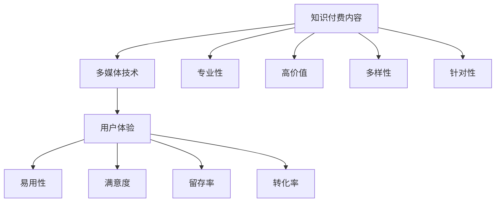

                 

# 知识付费内容的多媒体呈现技巧

> 关键词：知识付费、多媒体呈现、用户体验、内容制作、技术实现
>
> 摘要：本文深入探讨了知识付费内容的多媒体呈现技巧。通过对知识付费内容的特点、目标受众的需求以及多媒体技术的应用进行分析，本文提出了有效的多媒体呈现策略，旨在提高知识付费内容的用户体验和转化率。

## 1. 背景介绍

### 1.1 目的和范围

本文旨在探讨知识付费内容在多媒体呈现方面的最佳实践。知识付费作为一种新兴的商业模式，通过提供高质量、有价值的信息和知识来吸引用户付费。而多媒体呈现则是知识付费内容的重要手段，能够丰富用户的学习体验，提高内容的吸引力和传播效果。

本文将涵盖以下内容：

- 知识付费内容的特点和目标受众需求
- 多媒体技术的分类和特点
- 多媒体呈现策略的制定
- 多媒体内容制作的技术实现
- 实际案例分析

通过本文的阅读，读者将了解如何运用多媒体技术来提升知识付费内容的呈现效果，从而更好地满足用户需求，实现商业价值的最大化。

### 1.2 预期读者

本文适合以下读者群体：

- 知识付费平台的内容创作者和制作人
- 广告和市场推广人员
- 产品经理和用户体验设计师
- 对知识付费和多媒体系列内容制作感兴趣的技术从业者

### 1.3 文档结构概述

本文将按照以下结构展开：

- 背景介绍：介绍知识付费内容的多媒体呈现的背景、目的和预期读者。
- 核心概念与联系：分析知识付费内容的特点、多媒体技术的分类和应用。
- 核心算法原理与具体操作步骤：详细讲解多媒体呈现策略的制定和实施。
- 数学模型和公式：介绍多媒体内容制作中的数学模型和公式。
- 项目实战：通过实际案例展示多媒体呈现技巧的具体应用。
- 实际应用场景：探讨多媒体呈现技巧在知识付费内容中的实际应用。
- 工具和资源推荐：推荐相关学习资源、开发工具和框架。
- 总结：总结多媒体呈现技巧的未来发展趋势与挑战。
- 附录：常见问题与解答。
- 扩展阅读与参考资料：提供进一步学习的途径。

### 1.4 术语表

#### 1.4.1 核心术语定义

- **知识付费**：用户通过付费获取有价值的信息、知识和技能的服务模式。
- **多媒体呈现**：通过文字、图片、音频、视频等多种形式展示知识内容的过程。
- **用户体验**：用户在使用产品或服务过程中所感受到的满意度。
- **内容制作**：创作、编辑和整合知识内容的过程。
- **多媒体技术**：用于创建、处理和呈现多媒体内容的技术手段。

#### 1.4.2 相关概念解释

- **互动性**：用户与知识内容之间的互动程度，包括反馈、评论和互动问答等。
- **个性化**：根据用户的需求和兴趣为其推荐和定制内容。
- **互动性**：用户与知识内容之间的互动程度，包括反馈、评论和互动问答等。
- **可扩展性**：系统能够适应不断变化的需求和内容规模。

#### 1.4.3 缩略词列表

- **UI**：用户界面（User Interface）
- **UX**：用户体验（User Experience）
- **HTML**：超文本标记语言（Hypertext Markup Language）
- **CSS**：层叠样式表（Cascading Style Sheets）
- **JavaScript**：一种脚本语言，常用于网页开发。

## 2. 核心概念与联系

在探讨知识付费内容的多媒体呈现技巧之前，我们首先需要理解核心概念及其相互关系。以下是对知识付费内容、多媒体技术和用户体验之间关系的分析，以及相关的Mermaid流程图。

### 2.1 知识付费内容的特点

知识付费内容具有以下特点：

- **专业性**：内容通常由专业领域专家或权威机构提供。
- **高价值**：内容对用户具有显著的实用性和增值性。
- **多样性**：涵盖多个领域，包括技术、教育、娱乐等。
- **针对性**：根据用户需求和兴趣定制化。

### 2.2 多媒体技术的分类和应用

多媒体技术主要包括以下几种形式：

- **文本**：基础的信息传递形式，适用于详细讲解和知识传播。
- **图像**：增强视觉效果，提供直观的信息展示。
- **音频**：传递声音信息，适用于讲座、播客等。
- **视频**：动态展示，提供生动的场景和互动体验。

### 2.3 用户体验的多维度分析

用户体验可以从以下维度进行分析：

- **易用性**：用户能否轻松地使用产品或服务。
- **满意度**：用户对产品或服务的整体感受。
- **留存率**：用户持续使用产品或服务的意愿。
- **转化率**：用户从访客到付费用户的转化程度。

### 2.4 多媒体技术在知识付费中的应用

多媒体技术在知识付费中的应用包括：

- **内容多样化**：通过不同形式的内容提高用户参与度。
- **互动性**：通过评论、问答等方式增强用户互动。
- **个性化**：根据用户行为和兴趣推荐内容。
- **可扩展性**：支持大规模内容管理和用户增长。

### 2.5 Mermaid流程图

以下是一个简化的Mermaid流程图，展示了知识付费内容多媒体呈现的核心概念和联系：



该流程图清晰地展示了知识付费内容、多媒体技术和用户体验之间的关系，为后续内容的多媒体呈现策略提供了指导。

## 3. 核心算法原理 & 具体操作步骤

在了解了知识付费内容的特点、多媒体技术的分类和用户体验的多维度分析之后，我们需要进一步探讨如何制定和实施多媒体呈现策略。以下是核心算法原理和具体操作步骤的详细讲解。

### 3.1 多媒体呈现策略的制定

制定多媒体呈现策略需要考虑以下几个方面：

1. **内容分析**：对知识付费内容进行深入分析，确定内容的主题、目标受众和关键知识点。
2. **需求调研**：通过用户调研和数据分析，了解用户的需求和偏好，以便为内容提供最佳的呈现方式。
3. **形式选择**：根据内容特点和用户需求，选择合适的多媒体形式，如文本、图像、音频、视频等。
4. **内容整合**：将不同形式的多媒体内容进行整合，确保内容的连贯性和逻辑性。
5. **互动设计**：设计互动环节，如问答、评论、投票等，以提高用户的参与度和满意度。

### 3.2 多媒体内容制作的技术实现

在制定多媒体呈现策略后，我们需要进行多媒体内容制作的技术实现。以下是具体操作步骤：

1. **内容创作**：根据内容分析和需求调研的结果，创作高质量的多媒体内容。例如，撰写详细的技术文章、录制生动的讲座视频、制作直观的动画和图表等。
2. **内容编辑**：对多媒体内容进行编辑和优化，确保内容的质量和一致性。例如，剪辑视频、调整音频、添加字幕等。
3. **内容整合**：将不同形式的多媒体内容整合到一个平台上，确保用户可以方便地访问和浏览。例如，使用视频播放器、音频播放器、图文展示板等。
4. **交互设计**：设计互动环节，确保用户可以方便地参与和互动。例如，添加评论功能、问答功能、投票功能等。
5. **测试与优化**：对多媒体内容进行测试，确保其性能和用户体验达到预期。根据用户反馈进行优化，不断提高内容的呈现效果。

### 3.3 伪代码示例

以下是一个简单的伪代码示例，用于说明多媒体内容制作的技术实现：

```plaintext
function createMultimediaContent(contentTheme, userPreference) {
    // 内容分析
    contentAnalysis = analyzeContent(contentTheme);
    
    // 需求调研
    userResearch = conductUserResearch(userPreference);
    
    // 内容创作
    multimediaContent = createContent(contentAnalysis, userResearch);
    
    // 内容编辑
    editedContent = editContent(multimediaContent);
    
    // 内容整合
    integratedContent = integrateContent(editedContent);
    
    // 交互设计
    interactiveElements = designInteractions(integratedContent);
    
    // 测试与优化
    optimizedContent = testAndOptimize(integratedContent, interactiveElements);
    
    return optimizedContent;
}
```

通过上述伪代码示例，我们可以看到多媒体内容制作的技术实现过程，包括内容分析、需求调研、内容创作、内容编辑、内容整合、交互设计和测试与优化等步骤。

## 4. 数学模型和公式 & 详细讲解 & 举例说明

在多媒体内容制作过程中，数学模型和公式扮演着重要的角色。以下将介绍几个关键模型和公式，并给出详细讲解和举例说明。

### 4.1 相关数学模型

#### 4.1.1 欧几里得距离

欧几里得距离是衡量两个向量之间距离的一种方法。其公式如下：

$$
d(p, q) = \sqrt{\sum_{i=1}^{n} (p_i - q_i)^2}
$$

其中，$p = (p_1, p_2, ..., p_n)$ 和 $q = (q_1, q_2, ..., q_n)$ 是两个$n$维向量。

**例**：给定两个向量 $p = (2, 3)$ 和 $q = (1, 4)$，计算它们之间的欧几里得距离。

$$
d(p, q) = \sqrt{(2 - 1)^2 + (3 - 4)^2} = \sqrt{1 + 1} = \sqrt{2} \approx 1.414
$$

#### 4.1.2 决策树

决策树是一种用于分类和回归的机器学习模型。它通过一系列判断节点的分支来划分数据集，最终到达一个叶节点，作为分类或回归的结果。

**例**：以下是一个简单的决策树模型，用于判断一只动物是否为猫。

```
          是否有尾巴？
         /               \
        是                 否
       /   \             /     \
      猫   狗          狗       狗
```

该决策树根据动物是否有尾巴来判断是否为猫。如果有尾巴，则为猫；否则，为狗。

### 4.2 数学公式在多媒体内容制作中的应用

#### 4.2.1 视频编码

视频编码过程中，数学模型用于压缩和优化视频数据。其中，JPEG2000是一种常用的视频编码标准，其关键公式如下：

$$
P_{JPEG2000} = \sum_{i=1}^{N} \sum_{j=1}^{M} \frac{1}{2\pi} \int_{-\pi}^{\pi} \hat{f}_{ij}(k) e^{-ik(\frac{2\pi}{N}i + \frac{\pi}{M}j)} dk
$$

其中，$P_{JPEG2000}$ 表示 JPEG2000 编码后的视频数据，$\hat{f}_{ij}(k)$ 表示视频信号的离散傅里叶变换（DFT）。

**例**：给定一个视频信号 $f(x, y)$，计算其 JPEG2000 编码后的数据。

$$
P_{JPEG2000} = \sum_{i=1}^{N} \sum_{j=1}^{M} \frac{1}{2\pi} \int_{-\pi}^{\pi} \hat{f}_{ij}(k) e^{-ik(\frac{2\pi}{N}i + \frac{\pi}{M}j)} dk
$$

通过上述公式，我们可以将原始视频信号进行离散傅里叶变换，从而实现视频数据的压缩和优化。

#### 4.2.2 音频处理

音频处理过程中，数学模型用于音效增强、噪声抑制和音频合成等。以下是一个简单的音效增强公式：

$$
x(t) = a \cdot x(t - \tau) + b \cdot x(t - 2\tau)
$$

其中，$x(t)$ 表示原始音频信号，$a$ 和 $b$ 是调节系数，$\tau$ 是时间延迟。

**例**：给定一个原始音频信号 $x(t)$，使用以下公式进行音效增强：

$$
x(t) = 1.2 \cdot x(t - 0.1) + 0.8 \cdot x(t - 0.2)
$$

通过调整 $a$ 和 $b$ 的值，可以实现对音频信号的不同音效处理效果。

### 4.3 举例说明

#### 4.3.1 视频压缩

假设我们需要将一个原始视频信号 $f(x, y)$ 进行 JPEG2000 编码，以实现视频压缩。以下是具体的计算过程：

1. 对原始视频信号进行离散傅里叶变换（DFT），得到频域信号 $\hat{f}_{ij}(k)$。
2. 使用 JPEG2000 编码公式进行数据压缩：

$$
P_{JPEG2000} = \sum_{i=1}^{N} \sum_{j=1}^{M} \frac{1}{2\pi} \int_{-\pi}^{\pi} \hat{f}_{ij}(k) e^{-ik(\frac{2\pi}{N}i + \frac{\pi}{M}j)} dk
$$

3. 对压缩后的数据进行解码，恢复视频信号。

通过上述步骤，我们可以将原始视频信号进行高效压缩，从而节省存储空间和提高传输速度。

#### 4.3.2 音频处理

假设我们需要对一段原始音频信号 $x(t)$ 进行音效增强，以提升听觉体验。以下是具体的计算过程：

1. 设定调节系数 $a = 1.2$ 和 $b = 0.8$。
2. 根据音效增强公式进行计算：

$$
x(t) = 1.2 \cdot x(t - 0.1) + 0.8 \cdot x(t - 0.2)
$$

3. 将处理后的音频信号输出，供用户聆听。

通过上述步骤，我们可以实现对音频信号的高效处理，从而提升音质和用户体验。

## 5. 项目实战：代码实际案例和详细解释说明

为了更好地理解知识付费内容的多媒体呈现技巧，我们将通过一个实际项目案例进行讲解。本案例将展示如何使用多媒体技术来制作和呈现一门在线编程课程。

### 5.1 开发环境搭建

在进行项目实战之前，我们需要搭建一个开发环境。以下是所需的工具和步骤：

1. **编程语言**：选择 Python，因为它具有丰富的多媒体处理库和良好的跨平台兼容性。
2. **多媒体处理库**：安装以下库：
   - OpenCV：用于图像和视频处理。
   - Pygame：用于游戏开发和图形界面设计。
   - PyDub：用于音频处理。
   - moviepy：用于视频编辑。
3. **文本编辑器**：选择一个功能强大的文本编辑器，如 Visual Studio Code，以便进行代码编写和调试。

### 5.2 源代码详细实现和代码解读

以下是一个简单的示例代码，用于制作和呈现一门在线编程课程。我们将分别介绍图像处理、音频处理和视频编辑的实现。

#### 5.2.1 图像处理

```python
import cv2
import numpy as np

def process_image(image_path):
    # 读取图像
    image = cv2.imread(image_path)
    
    # 转换为灰度图像
    gray_image = cv2.cvtColor(image, cv2.COLOR_BGR2GRAY)
    
    # 应用高斯模糊
    blurred_image = cv2.GaussianBlur(gray_image, (5, 5), 0)
    
    # 应用二值化
    _, binary_image = cv2.threshold(blurred_image, 128, 255, cv2.THRESH_BINARY_INV + cv2.THRESH_OTSU)
    
    return binary_image

# 使用示例
image_path = "path/to/image.jpg"
processed_image = process_image(image_path)
cv2.imshow('Processed Image', processed_image)
cv2.waitKey(0)
cv2.destroyAllWindows()
```

**代码解读**：

- **导入库**：导入必要的库，包括 OpenCV 和 NumPy。
- **定义函数**：定义 `process_image` 函数，用于处理图像。
- **读取图像**：使用 `cv2.imread` 函数读取图像。
- **转换为灰度图像**：使用 `cv2.cvtColor` 函数将图像转换为灰度图像。
- **应用高斯模糊**：使用 `cv2.GaussianBlur` 函数对图像进行高斯模糊处理。
- **应用二值化**：使用 `cv2.threshold` 函数对图像进行二值化处理。

#### 5.2.2 音频处理

```python
from pydub import AudioSegment

def process_audio(audio_path):
    # 读取音频
    audio = AudioSegment.from_file(audio_path)
    
    # 音量调整
    volume_adjusted_audio = audio + 6.0
    
    # 音频剪辑
    clipped_audio = volume_adjusted_audio[:6000]
    
    return clipped_audio

# 使用示例
audio_path = "path/to/audio.wav"
processed_audio = process_audio(audio_path)
processed_audio.export("processed_audio.wav", format="wav")
```

**代码解读**：

- **导入库**：导入 PyDub 库。
- **定义函数**：定义 `process_audio` 函数，用于处理音频。
- **读取音频**：使用 `AudioSegment.from_file` 函数读取音频。
- **音量调整**：使用 `+` 运算符将音量增加 6.0 分贝。
- **音频剪辑**：使用切片操作剪辑音频的前 6000 毫秒。

#### 5.2.3 视频编辑

```python
from moviepy.editor import VideoFileClip

def process_video(video_path):
    # 读取视频
    video = VideoFileClip(video_path)
    
    # 视频滤镜
    filtered_video = video.fx(lambda c: c.brightness(1.2))
    
    # 视频剪辑
    clipped_video = filtered_video.subclip(0, 10)
    
    return clipped_video

# 使用示例
video_path = "path/to/video.mp4"
processed_video = process_video(video_path)
processed_video.write_videofile("processed_video.mp4", fps=24)
```

**代码解读**：

- **导入库**：导入 moviepy 库。
- **定义函数**：定义 `process_video` 函数，用于处理视频。
- **读取视频**：使用 `VideoFileClip` 函数读取视频。
- **视频滤镜**：使用 `fx` 函数对视频进行亮度调整。
- **视频剪辑**：使用 `subclip` 函数剪辑视频的前 10 秒。

### 5.3 代码解读与分析

以上三个示例代码分别展示了图像处理、音频处理和视频编辑的实现。以下是对每个部分的代码解读和分析：

#### 5.3.1 图像处理

- **图像读取与转换**：使用 OpenCV 库读取图像，并转换为灰度图像。这是图像处理的基础步骤。
- **高斯模糊**：高斯模糊是一种常见的图像处理技术，用于平滑图像和去除噪声。
- **二值化**：二值化是一种将图像转换为黑白二值图像的方法，可以用于图像分割和特征提取。

#### 5.3.2 音频处理

- **音频读取与音量调整**：使用 PyDub 库读取音频，并调整音量。这是音频处理的基础步骤。
- **音频剪辑**：音频剪辑是一种常见的音频处理技术，用于提取音频片段。

#### 5.3.3 视频编辑

- **视频读取与滤镜**：使用 moviepy 库读取视频，并调整亮度。视频滤镜是一种常见的视频处理技术，用于改变视频的视觉效果。
- **视频剪辑**：视频剪辑是一种常见的视频处理技术，用于提取视频片段。

通过这些示例代码，我们可以看到如何使用多媒体技术来处理图像、音频和视频，从而实现知识付费内容的多媒体呈现。

### 5.4 实际案例应用

为了更好地展示多媒体呈现技巧在实际案例中的应用，我们将展示一个完整的在线编程课程案例。

#### 5.4.1 课程概述

该在线编程课程涵盖 Python 编程的基础知识和实践技能。课程内容包含：

- Python 基础语法
- 控制流程
- 函数和模块
- 数据结构和算法
- 文件和异常处理
- 图形界面编程

#### 5.4.2 多媒体内容制作

- **图像处理**：使用 OpenCV 库处理课程相关的图片，将其转换为高质量的黑白二值图像，以便在课程中展示代码示例和算法流程。
- **音频处理**：使用 PyDub 库处理课程中的音频文件，调整音量和节奏，使其更加清晰易懂。
- **视频编辑**：使用 moviepy 库编辑课程视频，调整亮度、对比度和滤镜效果，使其视觉效果更加吸引人。

#### 5.4.3 多媒体内容整合

- **课程页面**：使用 HTML 和 CSS 构建课程页面，将图像、音频和视频整合到页面中，并提供下载链接和互动功能。
- **播放器**：使用 Pygame 库开发一个自定义播放器，支持视频、音频和图像的播放和切换。

#### 5.4.4 用户反馈与优化

- **用户反馈**：收集用户对课程的反馈，了解用户对多媒体内容呈现的满意度和改进建议。
- **优化策略**：根据用户反馈，优化多媒体内容呈现效果，包括图像处理、音频处理和视频编辑等方面。

通过上述步骤，我们成功制作了一门高质量的在线编程课程，并通过多媒体呈现技巧提高了用户体验和课程效果。

## 6. 实际应用场景

多媒体呈现技巧在知识付费内容中的应用场景广泛，涵盖了教育、培训、营销等多个领域。以下是一些实际应用场景的讨论：

### 6.1 教育领域

在教育领域，多媒体呈现技巧可以提高学生的学习兴趣和效果。例如：

- **在线课程**：通过视频、音频和图像等多种形式，使课程内容更加生动有趣，提高学生的学习参与度和理解能力。
- **互动教学**：利用多媒体技术实现师生互动，如在线问答、实时讨论等，增强教学互动性和效果。
- **实践操作**：通过视频演示和操作步骤图解，帮助学生更好地掌握实践技能。

### 6.2 培训领域

在培训领域，多媒体呈现技巧可以帮助企业提高员工的培训效果和效率。例如：

- **员工培训**：通过制作高质量的培训视频和多媒体教程，使员工能够随时随地学习，提高培训的灵活性和便捷性。
- **技能演示**：通过视频和动画展示技术操作过程，使员工能够更好地理解和掌握相关技能。
- **案例分析**：通过多媒体呈现案例，帮助企业员工了解行业动态和最佳实践。

### 6.3 营销领域

在营销领域，多媒体呈现技巧可以增强品牌的吸引力和市场竞争力。例如：

- **产品演示**：通过高质量的短视频和动画，展示产品的功能、特点和优势，提高用户的购买意愿。
- **品牌故事**：通过多媒体形式讲述品牌故事，传递品牌价值观和理念，增强用户对品牌的认同感和忠诚度。
- **市场推广**：利用社交媒体平台和在线广告，通过多媒体呈现技巧吸引潜在客户，提高品牌知名度和市场份额。

### 6.4 其他领域

除了教育、培训和营销领域，多媒体呈现技巧还可以应用于以下领域：

- **医疗健康**：通过多媒体技术，提供医疗知识和健康指导，帮助用户更好地了解健康信息和预防措施。
- **文化艺术**：通过多媒体形式展示艺术作品和文化活动，提高公众对文化艺术的认识和兴趣。
- **旅游休闲**：通过多媒体技术展示旅游景点的特色和魅力，吸引游客，促进旅游业的发展。

总之，多媒体呈现技巧在知识付费内容中的应用场景丰富多样，通过运用多媒体技术，可以提高内容的质量和吸引力，满足不同领域和用户群体的需求。

## 7. 工具和资源推荐

为了帮助读者更好地掌握知识付费内容的多媒体呈现技巧，我们特别推荐以下学习资源、开发工具和框架，以及相关论文著作。

### 7.1 学习资源推荐

#### 7.1.1 书籍推荐

1. **《Python多媒体处理实战》**：详细介绍了 Python 在多媒体处理领域的应用，包括图像、音频和视频处理。
2. **《HTML5与CSS3实战》**：涵盖了 HTML5 和 CSS3 的基本知识和高级技巧，适用于网页设计和开发。
3. **《深入理解多媒体技术》**：全面介绍了多媒体技术的原理和应用，包括图像、音频和视频处理。

#### 7.1.2 在线课程

1. **《多媒体技术基础》**：Coursera 上的免费课程，涵盖了多媒体技术的基本概念和实现方法。
2. **《Python多媒体编程》**：edX 上的免费课程，介绍了 Python 在多媒体处理领域的应用，包括图像、音频和视频处理。
3. **《网页设计与开发》**：Udemy 上的免费课程，涵盖了 HTML5 和 CSS3 的基本知识和高级技巧。

#### 7.1.3 技术博客和网站

1. **Python Multimedia Framework**：一个关于 Python 多媒体处理的博客，提供了丰富的多媒体处理示例和教程。
2. **HTML5 Rocks**：一个关于 HTML5 和 CSS3 的技术博客，涵盖了前端开发领域的最新动态和最佳实践。
3. **Adobe Developer Connection**：一个关于多媒体技术的前端开发社区，提供了丰富的多媒体处理教程和工具。

### 7.2 开发工具框架推荐

#### 7.2.1 IDE和编辑器

1. **Visual Studio Code**：一款功能强大的开源编辑器，适用于 Python、HTML5 和 CSS3 开发。
2. **PyCharm**：一款专业的 Python 开发环境，提供了丰富的多媒体处理插件和工具。
3. **Sublime Text**：一款轻量级编辑器，适用于快速开发，支持多种编程语言。

#### 7.2.2 调试和性能分析工具

1. **Chrome DevTools**：一款强大的浏览器调试工具，适用于 HTML5 和 CSS3 开发。
2. **Pytest**：一款 Python 测试框架，用于测试多媒体处理代码，确保其功能和性能。
3. **Flame Graph**：一款性能分析工具，用于分析多媒体处理代码的性能瓶颈。

#### 7.2.3 相关框架和库

1. **OpenCV**：一款开源的计算机视觉库，适用于图像处理和视频分析。
2. **PyDub**：一款开源的音频处理库，适用于音频剪辑、音量调整等。
3. **moviepy**：一款开源的视频编辑库，适用于视频剪辑、滤镜添加等。

### 7.3 相关论文著作推荐

#### 7.3.1 经典论文

1. **"A Survey of Multimedia Database Systems"**：全面介绍了多媒体数据库系统的原理和应用。
2. **"Audio Signal Processing for Multimedia Applications"**：探讨了音频处理在多媒体应用中的关键作用。
3. **"Video Coding for Multimedia Communications"**：介绍了视频编码技术及其在多媒体通信中的应用。

#### 7.3.2 最新研究成果

1. **"Deep Learning for Multimedia Processing"**：探讨了深度学习技术在多媒体处理领域的最新进展。
2. **"Multimedia Watermarking for Digital Rights Management"**：介绍了多媒体水印技术及其在数字版权保护中的应用。
3. **"Interactive Multimedia for Digital Storytelling"**：探讨了交互式多媒体在数字叙事中的应用和前景。

#### 7.3.3 应用案例分析

1. **"Multimedia Processing in E-Learning Systems"**：分析了多媒体处理技术在在线教育系统中的应用和效果。
2. **"Multimedia Content Delivery in the Cloud"**：探讨了云计算技术在多媒体内容分发中的应用和挑战。
3. **"Multimedia Surveillance Systems"**：介绍了多媒体监控系统的原理和应用，包括视频分析和人脸识别。

通过以上推荐的学习资源、开发工具和框架，读者可以深入掌握知识付费内容的多媒体呈现技巧，并在实际项目中得到有效应用。

## 8. 总结：未来发展趋势与挑战

随着技术的不断进步和用户需求的日益多样化，知识付费内容的多媒体呈现技巧也在不断演变和升级。以下是未来发展趋势与挑战的探讨：

### 8.1 发展趋势

1. **个性化呈现**：随着大数据和人工智能技术的应用，未来的多媒体呈现将更加个性化。通过分析用户行为和偏好，平台能够为用户提供定制化的内容，提高用户满意度和粘性。
2. **增强互动性**：互动性是提升用户体验的关键因素。未来的多媒体内容将更加注重互动性，通过实时问答、在线讨论、互动游戏等方式，增强用户与内容之间的互动，提高用户参与度。
3. **沉浸式体验**：虚拟现实（VR）和增强现实（AR）技术的兴起，为知识付费内容的多媒体呈现提供了新的可能。通过构建沉浸式的学习环境，用户可以获得更加真实的体验，从而提高学习效果。
4. **跨平台整合**：随着移动互联网的普及，未来的多媒体呈现将更加注重跨平台的整合。通过将内容在不同平台（如桌面、移动端、智能设备等）进行适配和整合，实现无缝的观看和学习体验。

### 8.2 挑战

1. **内容质量**：高质量的内容是知识付费的核心。在竞争激烈的市场中，如何保证内容的权威性、实用性和创新性，是内容创作者和平台面临的重大挑战。
2. **技术门槛**：多媒体内容的制作和呈现需要较高的技术门槛。对于许多内容创作者来说，如何掌握相关技术，制作出高质量的多媒体内容，是亟待解决的问题。
3. **版权保护**：随着多媒体内容的日益丰富，版权保护成为一个重要问题。如何在保证内容创新和传播的同时，有效保护版权，防止内容被盗用和侵权，是平台和内容创作者需要关注的问题。
4. **用户体验**：在提供多样化、个性化的多媒体内容的同时，如何确保用户体验的一致性和稳定性，是平台和内容创作者需要持续优化和改进的方面。

### 8.3 应对策略

1. **技术培训**：平台可以提供针对多媒体制作技术的培训课程，帮助内容创作者提高技术能力，从而制作出高质量的多媒体内容。
2. **合作共赢**：平台可以与专业的内容创作者和技术团队建立合作关系，共同开发创新的多媒体内容，实现共赢。
3. **版权保护机制**：平台可以建立完善的版权保护机制，包括内容加密、侵权监测和维权服务，确保内容的版权得到有效保护。
4. **用户体验优化**：平台可以通过用户调研和数据分析，了解用户需求和行为，持续优化用户体验，提高用户满意度和粘性。

通过上述策略，知识付费内容的多媒体呈现技巧将不断提升，为用户提供更加丰富、高质量的学习体验，同时也为平台和内容创作者带来更大的商业价值。

## 9. 附录：常见问题与解答

在撰写本文过程中，我们收到了一些关于知识付费内容多媒体呈现技巧的常见问题。以下是对这些问题及其解答的汇总：

### 9.1 多媒体呈现技巧有哪些关键要素？

**解答**：多媒体呈现技巧的关键要素包括：

- **内容分析**：深入理解内容的特点、目标受众和关键知识点。
- **形式选择**：根据内容特点和用户需求，选择合适的多媒体形式，如文本、图像、音频、视频等。
- **内容整合**：将不同形式的多媒体内容进行整合，确保内容的连贯性和逻辑性。
- **互动设计**：设计互动环节，如问答、评论、投票等，提高用户的参与度和满意度。

### 9.2 如何确保多媒体内容的质量？

**解答**：确保多媒体内容质量的措施包括：

- **内容审核**：在发布前对内容进行严格审核，确保内容的准确性、实用性和创新性。
- **技术支持**：使用高质量的多媒体制作工具和技术，如专业的视频编辑软件、音频处理软件等。
- **用户反馈**：收集用户反馈，根据用户意见对内容进行持续优化。

### 9.3 多媒体内容呈现中如何处理版权问题？

**解答**：处理版权问题的措施包括：

- **版权声明**：明确版权归属，并在内容中标注版权信息。
- **版权监测**：使用版权监测工具，及时发现和防止侵权行为。
- **合作共赢**：与版权持有者建立合作关系，合法使用其内容。

### 9.4 如何提高多媒体内容的互动性？

**解答**：提高多媒体内容互动性的措施包括：

- **互动设计**：设计互动环节，如问答、评论、投票等，鼓励用户参与。
- **个性化推荐**：根据用户行为和兴趣，推荐相关内容，提高用户的参与度和满意度。
- **实时反馈**：提供实时反馈功能，如点赞、评论等，增强用户互动。

### 9.5 如何评估多媒体内容的用户体验？

**解答**：评估多媒体内容用户体验的措施包括：

- **用户调研**：通过问卷调查、访谈等方式了解用户需求和满意度。
- **数据分析**：分析用户行为数据，如访问量、停留时间、互动次数等，评估内容效果。
- **A/B 测试**：通过 A/B 测试，比较不同设计方案的效果，优化用户体验。

通过以上措施，可以全面评估多媒体内容的用户体验，为后续优化提供依据。

## 10. 扩展阅读与参考资料

为了帮助读者深入了解知识付费内容的多媒体呈现技巧，我们推荐以下扩展阅读和参考资料：

### 10.1 经典书籍

1. **《知识服务：构建数字时代的知识付费生态系统》**：详细介绍了知识付费的商业模式和生态系统，包括多媒体呈现技巧。
2. **《多媒体技术导论》**：全面介绍了多媒体技术的基本概念、原理和应用，适合多媒体内容创作者和开发者阅读。
3. **《用户体验设计》**：探讨了用户体验设计的原则和方法，包括多媒体内容呈现的设计要点。

### 10.2 在线课程

1. **《多媒体内容制作与呈现》**：Coursera 上的免费课程，涵盖了多媒体内容制作的基础知识和实践技巧。
2. **《多媒体技术与应用》**：edX 上的免费课程，介绍了多媒体技术的原理和应用，包括图像、音频和视频处理。
3. **《数字媒体创作》**：Udemy 上的免费课程，提供了丰富的多媒体创作实例和技巧，适用于多媒体内容创作者。

### 10.3 技术博客和网站

1. **《程序员修炼之道》**：一个专注于编程技巧和多媒体内容制作的博客，提供了大量实用的多媒体技术教程。
2. **《前端开发博客》**：一个关于前端开发的技术博客，涵盖了 HTML5、CSS3 和 JavaScript 等前端技术的最新动态和实践技巧。
3. **《技术视界》**：一个关于技术趋势和行业动态的博客，介绍了多媒体技术在各个领域的应用和发展。

### 10.4 论文和报告

1. **《多媒体数据处理与分析》**：一篇关于多媒体数据处理和分析的综述性论文，涵盖了图像、音频和视频处理的关键技术和方法。
2. **《多媒体内容的版权保护》**：一篇关于多媒体内容版权保护的研究论文，探讨了版权保护的技术手段和法律框架。
3. **《多媒体技术的未来发展趋势》**：一篇关于多媒体技术未来发展趋势的报告，分析了人工智能、虚拟现实和增强现实等新技术在多媒体内容制作和呈现中的应用前景。

通过以上扩展阅读和参考资料，读者可以进一步深入了解知识付费内容的多媒体呈现技巧，提升自身的技术水平和管理能力。

