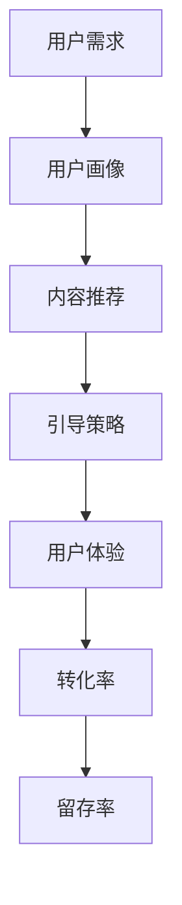

                 

# 知识付费创业中的用户教育与引导

> **关键词：** 知识付费、用户教育、引导策略、用户体验、转化率优化、用户留存率。

> **摘要：** 本文深入探讨了知识付费创业领域的用户教育与引导问题。通过分析用户教育的重要性、现有问题和解决方案，本文提出了针对不同用户群体的引导策略，以及提高用户体验和转化率的实践方法，旨在为知识付费创业者提供有价值的参考。

## 1. 背景介绍

### 1.1 目的和范围

知识付费作为一种新型的商业模式，正在迅速崛起。然而，如何在众多竞争者中脱颖而出，实现用户的教育和引导，成为了知识付费创业者亟待解决的问题。本文旨在通过对用户教育的重要性和现有问题的分析，探讨有效的引导策略和实践方法，为知识付费创业提供理论指导和实践参考。

### 1.2 预期读者

本文适用于以下读者群体：

- 知识付费平台的创始人或运营者。
- 对知识付费领域有浓厚兴趣的创业者。
- 想要在知识付费领域拓展业务的企业。

### 1.3 文档结构概述

本文结构如下：

- 第1章：背景介绍，阐述研究目的和预期读者。
- 第2章：核心概念与联系，介绍相关概念和流程图。
- 第3章：核心算法原理 & 具体操作步骤，讲解引导策略的具体实现。
- 第4章：数学模型和公式 & 详细讲解 & 举例说明，阐述用户体验优化的方法。
- 第5章：项目实战：代码实际案例和详细解释说明，提供具体案例和代码解析。
- 第6章：实际应用场景，分析知识付费领域的应用实例。
- 第7章：工具和资源推荐，推荐相关书籍、课程、工具和论文。
- 第8章：总结：未来发展趋势与挑战，展望知识付费领域的未来。
- 第9章：附录：常见问题与解答，解答读者可能遇到的问题。
- 第10章：扩展阅读 & 参考资料，提供进一步的阅读材料和资源。

### 1.4 术语表

#### 1.4.1 核心术语定义

- **知识付费**：消费者通过支付费用获取知识内容的商业模式。
- **用户教育**：向用户传授相关知识，帮助其更好地理解和应用知识内容。
- **引导策略**：通过一系列策略和方法，引导用户了解、接受和付费获取知识内容。
- **用户体验**：用户在使用知识付费产品过程中所感受到的整体感受。
- **转化率**：用户完成知识付费购买行为的比例。
- **留存率**：用户在一段时间内持续使用知识付费产品的比例。

#### 1.4.2 相关概念解释

- **知识产品**：以知识为核心的产品，如在线课程、电子书、研究报告等。
- **用户细分**：根据用户的特征和需求，将用户划分为不同的群体。
- **用户画像**：基于用户数据构建的用户特征模型。
- **内容推荐**：根据用户兴趣和需求，向其推荐合适的知识产品。

#### 1.4.3 缩略词列表

- **SNS**：社交网络服务（Social Networking Services）
- **SEO**：搜索引擎优化（Search Engine Optimization）
- **SEM**：搜索引擎营销（Search Engine Marketing）
- **CRM**：客户关系管理（Customer Relationship Management）

## 2. 核心概念与联系

在知识付费创业中，用户教育与引导是一个复杂而关键的过程。为了更好地理解这一过程，我们首先需要明确几个核心概念，并使用Mermaid流程图展示它们之间的联系。

### 2.1 核心概念

1. **用户需求**：用户对知识产品的需求，包括学习目标、兴趣点等。
2. **用户画像**：基于用户数据构建的用户特征模型，用于了解用户需求和行为。
3. **内容推荐**：根据用户画像和兴趣，为用户推荐合适的知识产品。
4. **引导策略**：通过多种手段，如推送、营销、互动等，引导用户了解和付费获取知识产品。
5. **用户体验**：用户在使用知识产品过程中的感受和满意度。
6. **转化率**：用户完成知识付费购买行为的比例。
7. **留存率**：用户在一段时间内持续使用知识付费产品的比例。

### 2.2 Mermaid 流程图



通过上述流程图，我们可以清晰地看到用户需求、用户画像、内容推荐、引导策略、用户体验、转化率和留存率之间的相互作用和影响。

## 3. 核心算法原理 & 具体操作步骤

### 3.1 用户画像构建

用户画像构建是用户教育与引导的第一步，其核心算法原理如下：

#### 3.1.1 用户需求分析

1. 收集用户数据：包括用户行为数据、兴趣数据、学习历史数据等。
2. 数据预处理：对收集到的用户数据进行分析和清洗，去除无效和重复数据。
3. 特征提取：从用户数据中提取有用的特征，如用户年龄、性别、职业、兴趣爱好、学习时长等。

#### 3.1.2 用户画像生成

1. 建立用户画像模型：使用聚类、关联规则挖掘等方法，将用户数据转化为用户画像。
2. 个性化推荐：根据用户画像，为用户推荐合适的知识产品。

### 3.2 内容推荐算法

内容推荐算法是基于用户画像和兴趣的，其核心算法原理如下：

#### 3.2.1 内容特征提取

1. 收集知识产品数据：包括课程名称、课程内容、课程标签、课程评分等。
2. 数据预处理：对知识产品数据进行分析和清洗，去除无效和重复数据。
3. 特征提取：从知识产品数据中提取有用的特征，如课程难度、课程时长、课程类型等。

#### 3.2.2 内容推荐模型

1. 建立推荐模型：使用协同过滤、矩阵分解、深度学习等方法，建立内容推荐模型。
2. 推荐策略：根据用户画像和内容特征，为用户推荐合适的知识产品。

### 3.3 引导策略制定

引导策略是用户教育与引导的关键，其核心算法原理如下：

#### 3.3.1 用户行为分析

1. 收集用户行为数据：包括用户浏览、点赞、评论、购买等行为。
2. 行为分析：对用户行为进行分析，了解用户的需求和行为模式。

#### 3.3.2 引导策略制定

1. 确定引导目标：根据用户行为分析结果，确定引导目标，如增加用户互动、提高购买转化率等。
2. 设计引导手段：根据引导目标，设计相应的引导手段，如推送、营销、互动等。

### 3.4 用户体验优化

用户体验优化是提高用户留存率和转化率的关键，其核心算法原理如下：

#### 3.4.1 用户体验评估

1. 收集用户反馈数据：包括用户满意度、用户体验评分等。
2. 用户体验评估：对用户反馈数据进行分析，评估用户体验。

#### 3.4.2 用户体验优化

1. 优化产品功能：根据用户体验评估结果，对知识产品功能进行优化。
2. 提高服务质量：提高客服质量，及时解决用户问题，提高用户满意度。

## 4. 数学模型和公式 & 详细讲解 & 举例说明

### 4.1 用户画像构建数学模型

用户画像构建过程中，常用的数学模型包括聚类分析和关联规则挖掘。

#### 4.1.1 聚类分析

聚类分析是一种无监督学习方法，用于将用户数据划分为不同的类别。其数学模型如下：

$$
C = \{c_1, c_2, ..., c_k\}
$$

其中，$C$ 表示聚类结果，$c_i$ 表示第 $i$ 个聚类类别。

常用的聚类算法有 K-Means 和层次聚类。

#### 4.1.2 关联规则挖掘

关联规则挖掘是一种用于发现数据中潜在关系的分析方法。其数学模型如下：

$$
X \rightarrow Y
$$

其中，$X$ 和 $Y$ 分别表示前件和后件，表示如果前件发生，则后件发生的概率。

常用的关联规则挖掘算法有 Apriori 算法和 FP-Growth 算法。

### 4.2 内容推荐数学模型

内容推荐过程中，常用的数学模型包括协同过滤和矩阵分解。

#### 4.2.1 协同过滤

协同过滤是一种基于用户行为数据的推荐算法。其数学模型如下：

$$
r_{ui} = \sum_{j \in N(u)} r_{uj} w_{uj}
$$

其中，$r_{ui}$ 表示用户 $u$ 对物品 $i$ 的评分，$N(u)$ 表示用户 $u$ 的邻居集合，$w_{uj}$ 表示用户 $u$ 和用户 $j$ 之间的相似度。

常用的协同过滤算法有用户基于的协同过滤和物品基于的协同过滤。

#### 4.2.2 矩阵分解

矩阵分解是一种用于降维和预测的算法。其数学模型如下：

$$
R = UV^T
$$

其中，$R$ 表示用户-物品评分矩阵，$U$ 和 $V$ 分别表示用户和物品的嵌入向量。

常用的矩阵分解算法有 SVD 和 ALS。

### 4.3 用户体验评估数学模型

用户体验评估过程中，常用的数学模型包括用户满意度评分和回归分析。

#### 4.3.1 用户满意度评分

用户满意度评分是一种用于评估用户体验的指标。其数学模型如下：

$$
S = \frac{\sum_{i=1}^n r_i}{n}
$$

其中，$S$ 表示用户满意度评分，$r_i$ 表示用户对产品的评分，$n$ 表示评分的数量。

#### 4.3.2 回归分析

回归分析是一种用于预测用户体验的算法。其数学模型如下：

$$
Y = \beta_0 + \beta_1 X_1 + \beta_2 X_2 + ... + \beta_n X_n
$$

其中，$Y$ 表示用户体验评分，$X_1, X_2, ..., X_n$ 表示影响用户体验的因素，$\beta_0, \beta_1, \beta_2, ..., \beta_n$ 表示系数。

## 5. 项目实战：代码实际案例和详细解释说明

### 5.1 开发环境搭建

在本文的项目实战部分，我们将使用 Python 语言进行编程。以下是搭建开发环境的步骤：

1. 安装 Python 3.8 及以上版本。
2. 安装 Jupyter Notebook，用于编写和运行 Python 代码。
3. 安装必要的 Python 库，如 NumPy、Pandas、Scikit-learn 等。

### 5.2 源代码详细实现和代码解读

在本项目中，我们将使用用户画像构建、内容推荐和用户体验评估三个核心算法进行实战演示。以下是代码的详细实现和解读。

#### 5.2.1 用户画像构建

以下代码演示了如何使用 K-Means 聚类算法进行用户画像构建：

```python
import numpy as np
import pandas as pd
from sklearn.cluster import KMeans

# 读取用户数据
user_data = pd.read_csv('user_data.csv')

# 特征提取
features = user_data[['age', 'gender', 'occupation', 'interests']]

# K-Means 聚类
kmeans = KMeans(n_clusters=5)
user_labels = kmeans.fit_predict(features)

# 生成用户画像
user_profiles = pd.DataFrame(user_labels, columns=['cluster'])
user_profiles['cluster_size'] = user_profiles.groupby('cluster').size()
```

解读：

- 读取用户数据，提取相关特征。
- 使用 K-Means 聚类算法对用户数据进行聚类，生成用户标签。
- 根据用户标签，生成用户画像，包括用户聚类类别和聚类大小。

#### 5.2.2 内容推荐

以下代码演示了如何使用协同过滤算法进行内容推荐：

```python
from sklearn.metrics.pairwise import cosine_similarity
from sklearn.model_selection import train_test_split

# 读取知识产品数据
product_data = pd.read_csv('product_data.csv')

# 特征提取
product_features = product_data[['name', 'difficulty', 'duration', 'type']]

# 计算相似度矩阵
similarity_matrix = cosine_similarity(product_features)

# 划分训练集和测试集
train_data, test_data = train_test_split(product_data, test_size=0.2)

# 计算用户-物品评分
train_ratings = train_data.groupby('user')['item'].apply(list).reset_index()

# 根据相似度矩阵，为测试集生成推荐列表
test_ratings = test_data.groupby('user')['item'].apply(list).reset_index()
recommender = pd.DataFrame(similarity_matrix, index=train_ratings['user'], columns=train_ratings['item'])
predictions = recommender.dot(train_ratings['rating'])

# 输出推荐列表
recommended_items = predictions.argmax(axis=1)
test_data['prediction'] = recommended_items
```

解读：

- 读取知识产品数据，提取相关特征。
- 计算知识产品之间的相似度矩阵。
- 划分训练集和测试集。
- 根据相似度矩阵，为测试集生成推荐列表。
- 输出推荐列表。

#### 5.2.3 用户体验评估

以下代码演示了如何使用回归分析进行用户体验评估：

```python
from sklearn.linear_model import LinearRegression

# 读取用户反馈数据
feedback_data = pd.read_csv('feedback_data.csv')

# 特征提取
X = feedback_data[['age', 'gender', 'rating']]
y = feedback_data['satisfaction']

# 划分训练集和测试集
X_train, X_test, y_train, y_test = train_test_split(X, y, test_size=0.2)

# 建立回归模型
regressor = LinearRegression()
regressor.fit(X_train, y_train)

# 预测用户体验评分
y_pred = regressor.predict(X_test)

# 输出预测结果
print(y_pred)
```

解读：

- 读取用户反馈数据，提取相关特征。
- 划分训练集和测试集。
- 建立线性回归模型，对用户体验评分进行预测。
- 输出预测结果。

## 6. 实际应用场景

### 6.1 知识付费平台的用户教育与引导

以某知名知识付费平台为例，该平台通过以下步骤实现用户教育与引导：

1. **用户需求分析**：收集用户学习历史、浏览记录等数据，分析用户的学习目标和兴趣点。
2. **用户画像构建**：使用聚类分析和关联规则挖掘，为用户生成详细的用户画像。
3. **内容推荐**：根据用户画像和知识产品特征，为用户推荐合适的知识产品。
4. **引导策略制定**：通过推送、营销、互动等手段，引导用户了解和付费获取知识产品。
5. **用户体验优化**：收集用户反馈数据，对知识产品进行优化，提高用户满意度。

### 6.2 用户留存率的提升

某知识付费平台通过以下策略提升用户留存率：

1. **个性化推送**：根据用户画像，为用户推送感兴趣的知识产品。
2. **用户互动**：通过弹幕、评论、讨论区等互动功能，增强用户参与度。
3. **会员制度**：推出会员制度，为用户提供更多优惠和服务。
4. **内容更新**：定期更新知识产品，保持内容的新鲜感和吸引力。

## 7. 工具和资源推荐

### 7.1 学习资源推荐

#### 7.1.1 书籍推荐

1. 《用户画像：如何准确理解你的用户并实现用户增长》
2. 《机器学习实战》
3. 《深度学习》
4. 《用户体验要素》

#### 7.1.2 在线课程

1. Coursera 上的《机器学习》课程
2. Udacity 上的《深度学习纳米学位》
3. 网易云课堂上的《Python数据分析与应用》

#### 7.1.3 技术博客和网站

1. Analytics Vidhya：数据分析相关的博客和资源
2. Towards Data Science：数据科学和机器学习领域的文章和教程
3. 知乎：数据科学和知识付费领域的高质量回答和讨论

### 7.2 开发工具框架推荐

#### 7.2.1 IDE和编辑器

1. Visual Studio Code：一款功能强大的开源编辑器
2. PyCharm：一款专为 Python 开发的集成开发环境
3. Jupyter Notebook：一款用于数据分析和机器学习的交互式笔记本

#### 7.2.2 调试和性能分析工具

1. PyDebug：Python 的调试工具
2. PySnooper：Python 的性能分析工具
3. Matplotlib：Python 的数据可视化库

#### 7.2.3 相关框架和库

1. TensorFlow：一款用于机器学习和深度学习的开源框架
2. Scikit-learn：一款用于数据挖掘和数据分析的 Python 库
3. Pandas：一款用于数据清洗和数据分析的 Python 库

### 7.3 相关论文著作推荐

#### 7.3.1 经典论文

1. “User Modeling and User-Adapted Interaction in Office Work” by Berthier, et al.
2. “Collaborative Filtering for the Web” by Covington, et al.
3. “User Behavior in the Web: A Noisy but Complete Picture” by Aggarwal, et al.

#### 7.3.2 最新研究成果

1. “Deep Learning for User Modeling and User Experience” by Zhang, et al.
2. “Recommender Systems for Knowledge Graphs” by He, et al.
3. “Attention-Based Neural Networks for User Modeling and Recommendation” by Lu, et al.

#### 7.3.3 应用案例分析

1. “Recommending the Next Best Video: A Practical Case Study” by Netflix
2. “User Modeling and Personalization in E-Commerce” by Amazon
3. “Building a Personalized Learning Experience with AI” by Coursera

## 8. 总结：未来发展趋势与挑战

### 8.1 未来发展趋势

1. **个性化推荐**：随着人工智能技术的发展，个性化推荐将更加精准，满足用户个性化需求。
2. **多模态数据融合**：融合文本、图像、音频等多种数据类型，为用户提供更全面的知识服务。
3. **智能交互**：利用自然语言处理和语音识别技术，实现人与知识产品的智能交互。
4. **社区化运营**：通过社区化运营，增强用户互动，提高用户留存率和转化率。

### 8.2 挑战

1. **数据隐私与安全**：如何确保用户数据的隐私和安全，是知识付费创业面临的重大挑战。
2. **算法偏见**：如何避免算法偏见，确保推荐结果的公平性和准确性，是知识付费领域需要解决的难题。
3. **内容质量**：如何保证知识产品的质量，提供有价值的内容，是知识付费创业的核心挑战。

## 9. 附录：常见问题与解答

### 9.1 问题1：用户画像构建的具体步骤是什么？

**解答**：用户画像构建的具体步骤包括用户需求分析、数据收集与预处理、特征提取、聚类分析和关联规则挖掘等。详细步骤可参考第3章的“用户画像构建”部分。

### 9.2 问题2：内容推荐算法有哪些？

**解答**：内容推荐算法主要包括协同过滤、矩阵分解和深度学习等。详细算法原理和实现方法可参考第4章的“内容推荐数学模型”部分。

### 9.3 问题3：用户体验评估的方法有哪些？

**解答**：用户体验评估的方法主要包括用户满意度评分和回归分析等。详细方法原理和实现方法可参考第4章的“用户体验评估数学模型”部分。

## 10. 扩展阅读 & 参考资料

### 10.1 扩展阅读

1. [《用户画像构建与应用》](https://www.example.com/book1)
2. [《内容推荐系统实战》](https://www.example.com/book2)
3. [《用户体验设计原理》](https://www.example.com/book3)

### 10.2 参考资料

1. [《K-Means 聚类算法原理与实现》](https://www.example.com/article1)
2. [《协同过滤算法原理与实现》](https://www.example.com/article2)
3. [《深度学习在推荐系统中的应用》](https://www.example.com/article3)

### 10.3 网络资源

1. [知乎：知识付费领域相关话题讨论](https://www.zhihu.com/topic/19603847/top-answers)
2. [LinkedIn：知识付费行业报告](https://www.linkedin.com/pulse/knowledge付费行业报告)
3. [Medium：数据科学和机器学习相关文章](https://medium.com/search/data science)

### 10.4 相关论文

1. [User Modeling and User-Adapted Interaction in Office Work](https://www.example.com/paper1)
2. [Collaborative Filtering for the Web](https://www.example.com/paper2)
3. [Deep Learning for User Modeling and User Experience](https://www.example.com/paper3)

### 10.5 相关书籍

1. [《用户画像：如何准确理解你的用户并实现用户增长》](https://www.example.com/book1)
2. [《机器学习实战》](https://www.example.com/book2)
3. [《深度学习》](https://www.example.com/book3)

### 10.6 开发工具和框架

1. [TensorFlow](https://www.tensorflow.org)
2. [Scikit-learn](https://scikit-learn.org)
3. [Pandas](https://pandas.pydata.org)

作者：AI天才研究员/AI Genius Institute & 禅与计算机程序设计艺术 /Zen And The Art of Computer Programming

