                 

# 知识付费创业的用户价值 Maximization

> **关键词**：知识付费、用户价值、创业、用户体验、数据驱动、算法优化、增长黑客

> **摘要**：本文旨在探讨知识付费创业领域的核心议题——如何最大化用户价值。通过分析用户需求、市场定位、产品设计和数据分析等关键环节，结合具体案例，我们将探讨如何在激烈的市场竞争中创造可持续的用户价值，实现创业的成功。

## 1. 背景介绍

### 1.1 目的和范围

本文的目标是深入探讨知识付费创业领域的用户价值最大化策略。我们将重点关注以下几个关键问题：

- 如何准确识别并满足用户需求？
- 如何通过市场定位和产品创新，构建核心竞争力？
- 如何运用数据分析手段，优化用户体验和产品功能？
- 如何在激烈的市场竞争中，实现用户价值的可持续增长？

本文旨在为知识付费创业者提供一套系统性、可操作的策略和方法，以实现用户价值的最大化，从而推动创业项目的成功。

### 1.2 预期读者

本文适用于以下读者群体：

- 创业者，特别是那些在知识付费领域寻求创新和突破的创业者。
- 产品经理，希望通过数据分析优化产品体验和功能。
- 数据分析师，希望了解如何将数据驱动的理念应用于知识付费领域。
- 技术专家，对算法优化和数学模型有深入研究的专业人士。

### 1.3 文档结构概述

本文将分为以下几个部分：

1. 背景介绍：阐述本文的目的、预期读者和文档结构。
2. 核心概念与联系：介绍知识付费创业的相关概念，并绘制核心概念流程图。
3. 核心算法原理 & 具体操作步骤：详细讲解用户价值最大化的算法原理和操作步骤。
4. 数学模型和公式 & 详细讲解 & 举例说明：分析用户价值最大化的数学模型和公式，并提供实例说明。
5. 项目实战：代码实际案例和详细解释说明。
6. 实际应用场景：探讨知识付费创业在不同场景下的应用和实践。
7. 工具和资源推荐：推荐学习资源和开发工具。
8. 总结：未来发展趋势与挑战。
9. 附录：常见问题与解答。
10. 扩展阅读 & 参考资料：提供进一步学习资料和参考文献。

### 1.4 术语表

#### 1.4.1 核心术语定义

- **知识付费**：用户为获取有价值的信息或服务而支付的费用。
- **用户价值**：用户在使用知识付费产品过程中所获得的价值，包括知识、技能、体验等。
- **市场定位**：企业在市场中确定自己的位置，包括目标用户、产品特点、竞争优势等。
- **数据分析**：利用统计学、机器学习等方法，对用户行为、需求、反馈等数据进行分析，以优化产品和服务。

#### 1.4.2 相关概念解释

- **用户体验**：用户在使用产品或服务过程中所感受到的愉悦程度和满意度。
- **增长黑客**：利用技术手段和营销策略，实现用户快速增长的一门艺术。
- **算法优化**：通过调整算法参数，提高算法的效率和效果。

#### 1.4.3 缩略词列表

- **KFC**：知识付费
- **UVM**：用户价值最大化
- **GDPR**：通用数据保护条例
- **API**：应用程序编程接口

## 2. 核心概念与联系

知识付费创业的核心概念包括用户价值最大化（UVM）、市场定位、产品设计和数据分析。以下是一个简化的Mermaid流程图，用于展示这些核心概念之间的联系。

```mermaid
graph TD
    A[用户价值最大化（UVM）] --> B[市场定位]
    A --> C[产品设计]
    A --> D[数据分析]
    B --> E[用户需求分析]
    C --> F[用户体验优化]
    D --> G[数据驱动决策]
    B --> H[竞争优势分析]
    C --> I[功能创新]
    D --> J[数据挖掘与预测]
    E --> K[用户行为分析]
    F --> L[满意度提升]
    G --> M[产品迭代]
    H --> N[差异化定位]
    I --> O[功能扩展]
    J --> P[用户需求预测]
    K --> Q[个性化推荐]
    L --> R[用户留存率]
    M --> S[产品优化]
    N --> T[品牌影响力]
    O --> U[市场扩展]
    P --> V[需求满足率]
    Q --> W[用户体验提升]
    R --> X[用户忠诚度]
    S --> Y[市场份额]
    T --> Z[盈利能力]
    U --> AA[客户满意度]
    V --> BB[用户粘性]
    W --> CC[产品竞争力]
    X --> DD[用户流失率]
    Y --> EE[收入增长]
    Z --> FF[投资回报率]
    AA --> GG[品牌忠诚度]
    BB --> HH[用户活跃度]
    CC --> II[产品创新度]
    DD --> JJ[用户满意度]
    EE --> KK[市场份额增长率]
    FF --> LL[盈利能力提升]
```



以上流程图展示了知识付费创业中各个核心概念之间的相互关系。通过用户价值最大化（UVM）策略，企业可以在市场定位、产品设计和数据分析等方面实现持续优化，从而提高用户体验、满意度、忠诚度和市场份额，最终实现可持续增长和盈利。

## 3. 核心算法原理 & 具体操作步骤

用户价值最大化（UVM）的核心算法原理是基于用户行为数据分析，通过机器学习和优化算法，实现个性化推荐和用户需求预测。以下是具体的操作步骤：

### 3.1 用户行为数据分析

首先，收集并整理用户在知识付费平台上的行为数据，包括访问记录、浏览历史、购买记录、评价和反馈等。利用数据预处理技术，对原始数据进行清洗、去重和格式转换，确保数据质量和一致性。

```python
# Python伪代码：用户行为数据预处理
import pandas as pd

# 读取用户行为数据
data = pd.read_csv('user_behavior_data.csv')

# 数据清洗
data = data.drop_duplicates()
data = data.dropna()

# 数据格式转换
data['timestamp'] = pd.to_datetime(data['timestamp'])
```

### 3.2 用户行为特征提取

通过对用户行为数据进行特征提取，构建用户行为特征向量。常见的用户行为特征包括：

- 访问频率：用户在一定时间内访问平台的次数。
- 停留时间：用户在平台上的平均停留时间。
- 购买次数：用户在一定时间内的购买次数。
- 评价分数：用户对产品或服务的评价分数。

```python
# Python伪代码：用户行为特征提取
from sklearn.preprocessing import MinMaxScaler

# 提取用户行为特征
features = data[['visit_frequency', 'stay_time', 'purchase_count', 'rating_score']]

# 数据归一化
scaler = MinMaxScaler()
features_scaled = scaler.fit_transform(features)
```

### 3.3 个性化推荐算法

采用协同过滤算法（Collaborative Filtering）实现个性化推荐。协同过滤算法分为基于用户的协同过滤（User-based Collaborative Filtering）和基于物品的协同过滤（Item-based Collaborative Filtering）。以下是基于用户的协同过滤算法步骤：

1. 计算用户之间的相似度矩阵。
2. 根据相似度矩阵为每个用户推荐相似用户喜欢的物品。
3. 对推荐结果进行排序，展示给用户。

```python
# Python伪代码：基于用户的协同过滤
from sklearn.metrics.pairwise import cosine_similarity

# 计算用户相似度矩阵
similarity_matrix = cosine_similarity(features_scaled)

# 推荐算法实现
def user_based_recommendation(user_id, similarity_matrix, item_similarity_threshold=0.5):
    # 计算用户相似度
    user_similarity = similarity_matrix[user_id]

    # 筛选相似度大于阈值的用户
    similar_users = [i for i, sim in enumerate(user_similarity) if sim > item_similarity_threshold]

    # 收集相似用户喜欢的物品
    recommended_items = []
    for user in similar_users:
        user_items = data.iloc[user]['item_id']
        recommended_items.extend(user_items)

    # 去重并排序推荐结果
    recommended_items = list(set(recommended_items))
    recommended_items.sort(reverse=True)

    return recommended_items

# 为特定用户生成推荐列表
user_id = 0
recommended_items = user_based_recommendation(user_id, similarity_matrix)
```

### 3.4 用户需求预测

基于用户行为数据和推荐结果，利用时间序列分析（Time Series Analysis）和机器学习算法（如线性回归、决策树等），预测用户未来的需求和行为。

```python
# Python伪代码：用户需求预测
from sklearn.linear_model import LinearRegression

# 提取时间序列数据
time_series_data = data[data['timestamp'] > '2023-01-01']['item_id']

# 分离特征和目标变量
X = time_series_data[:-1].values.reshape(-1, 1)
y = time_series_data[1:].values

# 训练线性回归模型
model = LinearRegression()
model.fit(X, y)

# 预测用户需求
future_demand = model.predict(X)
```

### 3.5 用户价值评估与优化

结合个性化推荐和用户需求预测结果，评估用户价值，并通过调整推荐策略和产品功能，优化用户体验和满意度。

```python
# Python伪代码：用户价值评估与优化
def user_value_evaluation(user_id, recommended_items, predicted_demand):
    # 计算用户价值
    user_value = sum(recommended_items == predicted_demand) * 10

    # 调整推荐策略和产品功能
    if user_value < threshold:
        # 优化推荐算法
        # 调整产品功能
        pass

    return user_value

# 评估用户价值
user_value = user_value_evaluation(user_id, recommended_items, future_demand)
```

通过以上步骤，知识付费创业企业可以实现对用户价值最大化的算法原理和操作步骤的深入理解，从而为产品设计和数据分析提供有力的支持。

## 4. 数学模型和公式 & 详细讲解 & 举例说明

在用户价值最大化的过程中，数学模型和公式起着至关重要的作用。以下将介绍用于评估和优化用户价值的几个关键数学模型，并使用LaTeX格式进行详细讲解。

### 4.1 期望用户价值（Expected User Value, EV）

期望用户价值是指用户在使用某一产品或服务时，预期获得的平均价值。其计算公式如下：

$$ EV = \sum_{i=1}^{n} p_i \cdot v_i $$

其中，$p_i$ 表示用户选择第 $i$ 个选项的概率，$v_i$ 表示用户选择第 $i$ 个选项的预期价值。

**例子**：假设一个用户在知识付费平台上有三个选项：免费课程、付费课程和VIP会员。其中，免费课程的价值为 $5$，付费课程的价值为 $20$，VIP会员的价值为 $50$。用户选择这三个选项的概率分别为 $0.3$、$0.5$ 和 $0.2$。则期望用户价值为：

$$ EV = 0.3 \cdot 5 + 0.5 \cdot 20 + 0.2 \cdot 50 = 12.5 + 10 + 10 = 32.5 $$

### 4.2 预期效用（Expected Utility, EU）

预期效用是指用户在选择不同选项时，根据各自的概率和效用值计算出的总效用。其计算公式如下：

$$ EU = \sum_{i=1}^{n} p_i \cdot u_i $$

其中，$p_i$ 表示用户选择第 $i$ 个选项的概率，$u_i$ 表示用户选择第 $i$ 个选项的效用值。

**例子**：假设用户在选择知识付费产品时，有三个选项：免费课程、付费课程和VIP会员。其中，免费课程的概率为 $0.3$，效用值为 $2$；付费课程的概率为 $0.5$，效用值为 $4$；VIP会员的概率为 $0.2$，效用值为 $6$。则预期效用为：

$$ EU = 0.3 \cdot 2 + 0.5 \cdot 4 + 0.2 \cdot 6 = 0.6 + 2 + 1.2 = 3.8 $$

### 4.3 带有风险的用户价值最大化（Risk-Averse User Value Maximization, RAVM）

在实际应用中，用户往往会考虑到风险因素，从而选择最大化期望效用。RAVM模型通过引入风险规避系数 $\lambda$，将期望效用最大化问题转化为带约束的用户价值最大化问题。

$$ \max U = \sum_{i=1}^{n} p_i \cdot u_i - \lambda \cdot \sum_{i=1}^{n} p_i \cdot r_i $$

其中，$p_i$ 表示用户选择第 $i$ 个选项的概率，$u_i$ 表示用户选择第 $i$ 个选项的效用值，$r_i$ 表示用户选择第 $i$ 个选项的风险值，$\lambda$ 表示风险规避系数。

**例子**：假设用户在选择知识付费产品时，有三个选项：免费课程、付费课程和VIP会员。其中，免费课程的概率为 $0.3$，效用值为 $2$，风险值为 $0.1$；付费课程的概率为 $0.5$，效用值为 $4$，风险值为 $0.2$；VIP会员的概率为 $0.2$，效用值为 $6$，风险值为 $0.3$。假设用户的风险规避系数 $\lambda$ 为 $0.5$。则带有风险的用户价值最大化问题为：

$$ \max U = 0.3 \cdot 2 + 0.5 \cdot 4 + 0.2 \cdot 6 - 0.5 \cdot (0.3 \cdot 0.1 + 0.5 \cdot 0.2 + 0.2 \cdot 0.3) $$

$$ U = 0.6 + 2 + 1.2 - 0.5 \cdot (0.03 + 0.1 + 0.06) $$

$$ U = 3.8 - 0.5 \cdot 0.19 $$

$$ U = 3.8 - 0.095 $$

$$ U = 3.705 $$

通过以上数学模型和公式的讲解，我们可以更好地理解用户价值最大化的核心概念和计算方法。在实际应用中，结合具体业务场景和数据，这些模型和方法可以帮助知识付费创业企业实现用户价值的最大化。

### 5. 项目实战：代码实际案例和详细解释说明

为了更好地展示用户价值最大化的实际应用，我们将在本节中通过一个具体的项目实战，介绍如何搭建一个知识付费平台，并实现用户价值最大化的算法。

#### 5.1 开发环境搭建

1. **硬件环境**：
   - 服务器：1台8核CPU、16GB内存、1TB SSD硬盘的服务器
   - 客户端设备：多种操作系统和设备（如Windows、macOS、Android、iOS等）

2. **软件环境**：
   - 开发工具：PyCharm、VS Code
   - 编程语言：Python、JavaScript、HTML/CSS
   - 数据库：MySQL、MongoDB
   - Web服务器：Nginx
   - 框架：Flask、Django、React、Vue.js

#### 5.2 源代码详细实现和代码解读

1. **用户行为数据收集和预处理**：

   在本项目中，我们使用Python编写了一个简单的数据收集和处理模块，用于从知识付费平台收集用户行为数据，并进行预处理。

   ```python
   import pandas as pd
   import numpy as np
   
   # 读取用户行为数据
   data = pd.read_csv('user_behavior_data.csv')
   
   # 数据清洗
   data = data.drop_duplicates()
   data = data.dropna()
   
   # 数据格式转换
   data['timestamp'] = pd.to_datetime(data['timestamp'])
   ```

   这段代码首先使用Pandas库读取用户行为数据，然后进行去重、去空值操作，最后将时间戳转换为日期格式。

2. **用户行为特征提取**：

   接下来，我们对用户行为数据进行特征提取，构建用户行为特征向量。

   ```python
   from sklearn.preprocessing import MinMaxScaler
   
   # 提取用户行为特征
   features = data[['visit_frequency', 'stay_time', 'purchase_count', 'rating_score']]
   
   # 数据归一化
   scaler = MinMaxScaler()
   features_scaled = scaler.fit_transform(features)
   ```

   这里使用MinMaxScaler对用户行为特征进行归一化处理，以便后续的算法计算。

3. **基于用户的协同过滤算法实现**：

   我们采用基于用户的协同过滤算法（User-based Collaborative Filtering）来实现个性化推荐。

   ```python
   from sklearn.metrics.pairwise import cosine_similarity
   
   # 计算用户相似度矩阵
   similarity_matrix = cosine_similarity(features_scaled)
   
   # 推荐算法实现
   def user_based_recommendation(user_id, similarity_matrix, item_similarity_threshold=0.5):
       # 计算用户相似度
       user_similarity = similarity_matrix[user_id]
       
       # 筛选相似度大于阈值的用户
       similar_users = [i for i, sim in enumerate(user_similarity) if sim > item_similarity_threshold]
       
       # 收集相似用户喜欢的物品
       recommended_items = []
       for user in similar_users:
           user_items = data.iloc[user]['item_id']
           recommended_items.extend(user_items)
       
       # 去重并排序推荐结果
       recommended_items = list(set(recommended_items))
       recommended_items.sort(reverse=True)
       
       return recommended_items
   
   # 为特定用户生成推荐列表
   user_id = 0
   recommended_items = user_based_recommendation(user_id, similarity_matrix)
   ```

   这里首先计算用户相似度矩阵，然后根据相似度阈值筛选出相似用户，最后为特定用户生成推荐列表。

4. **用户需求预测**：

   使用时间序列分析和线性回归模型，预测用户未来的需求和行为。

   ```python
   from sklearn.linear_model import LinearRegression
   
   # 提取时间序列数据
   time_series_data = data[data['timestamp'] > '2023-01-01']['item_id']
   
   # 分离特征和目标变量
   X = time_series_data[:-1].values.reshape(-1, 1)
   y = time_series_data[1:].values
   
   # 训练线性回归模型
   model = LinearRegression()
   model.fit(X, y)
   
   # 预测用户需求
   future_demand = model.predict(X)
   ```

   这里首先提取时间序列数据，然后使用线性回归模型进行训练和预测。

5. **用户价值评估与优化**：

   结合个性化推荐和用户需求预测结果，评估用户价值，并通过调整推荐策略和产品功能，优化用户体验和满意度。

   ```python
   def user_value_evaluation(user_id, recommended_items, predicted_demand):
       # 计算用户价值
       user_value = sum(recommended_items == predicted_demand) * 10
       
       # 调整推荐策略和产品功能
       if user_value < threshold:
           # 优化推荐算法
           # 调整产品功能
           pass
       
       return user_value
   
   # 评估用户价值
   user_value = user_value_evaluation(user_id, recommended_items, future_demand)
   ```

   这段代码用于评估用户价值，并根据用户价值调整推荐策略和产品功能。

#### 5.3 代码解读与分析

1. **数据预处理**：

   数据预处理是用户价值最大化算法的基础。通过数据清洗和特征提取，我们能够将原始用户行为数据转换为适合算法处理的特征向量。

2. **协同过滤算法**：

   协同过滤算法是实现个性化推荐的关键。在本项目中，我们采用了基于用户的协同过滤算法，通过计算用户相似度矩阵和筛选相似用户，为用户生成个性化的推荐列表。

3. **用户需求预测**：

   用户需求预测是用户价值评估的重要环节。通过时间序列分析和线性回归模型，我们能够预测用户未来的需求和行为，从而为用户推荐符合其需求的物品。

4. **用户价值评估与优化**：

   用户价值评估与优化是用户价值最大化的核心。通过评估用户价值，并根据用户价值调整推荐策略和产品功能，我们能够持续优化用户体验和满意度。

通过以上代码实现和解读，我们可以看到用户价值最大化算法在知识付费平台中的应用。在实际项目中，结合具体业务场景和数据，这些算法和方法可以帮助企业实现用户价值的最大化，从而推动创业项目的成功。

### 6. 实际应用场景

知识付费创业在多个场景下有着广泛的应用，以下列举了几个典型的应用场景：

#### 6.1 在线教育

在线教育是知识付费创业的一个重要领域。通过知识付费模式，平台可以提供高质量的在线课程，满足用户对教育资源的多样化需求。用户可以通过付费获取专业课程、学位课程等，提升自身技能和知识水平。

- **优势**：灵活的学习时间、丰富的课程资源、个性化推荐。
- **挑战**：内容质量参差不齐、用户流失率高、市场竞争激烈。

#### 6.2 在职培训

在职培训是另一个重要的知识付费应用场景。随着职场竞争的加剧，许多职场人士希望通过付费培训提升自己的职业能力和竞争力。知识付费平台可以提供各种职场技能培训，如项目管理、数据分析、编程语言等。

- **优势**：针对性培训、实用性高、可快速提升职业技能。
- **挑战**：用户需求多样化、课程更新速度快、维护成本高。

#### 6.3 职业咨询

职业咨询是知识付费的另一个应用领域。职业咨询师通过付费咨询，为用户提供职业规划、求职指导、面试技巧等咨询服务。这种模式可以帮助用户更好地规划职业道路，提升求职成功率。

- **优势**：个性化服务、针对性指导、高效解决问题。
- **挑战**：咨询师素质参差不齐、用户信任度低、竞争激烈。

#### 6.4 内容创作

内容创作是知识付费创业的又一个重要领域。通过付费模式，创作者可以提供高质量的内容，如文章、电子书、音频等。用户通过付费获取有价值的内容，创作者则通过内容获得收入。

- **优势**：内容高质量、用户付费意愿高、收入来源多样化。
- **挑战**：内容创作成本高、用户需求变化快、竞争激烈。

#### 6.5 专业服务

专业服务是知识付费创业的一个新兴领域。通过付费模式，专业服务提供商可以提供专业咨询服务，如法律、财务、医疗等。用户通过付费获得专业服务，服务提供商则通过专业能力获得收入。

- **优势**：专业化服务、高品质体验、用户信任度高。
- **挑战**：专业门槛高、市场竞争激烈、服务质量难以保证。

通过以上实际应用场景的列举，我们可以看到知识付费创业在不同领域的广泛应用。在实际操作中，创业者需要结合具体场景，深入挖掘用户需求，提供高质量的产品和服务，从而实现用户价值的最大化。

### 7. 工具和资源推荐

为了在知识付费创业过程中更好地实现用户价值最大化，以下是针对开发者、产品经理和数据分析师的一些建议和工具资源推荐。

#### 7.1 学习资源推荐

**7.1.1 书籍推荐**

- **《深度学习》（Deep Learning）**：作者：Ian Goodfellow、Yoshua Bengio、Aaron Courville。本书是深度学习领域的经典教材，详细介绍了深度学习的基本概念、算法和应用。
- **《Python数据分析》（Python Data Analysis）**：作者：Wes McKinney。本书介绍了Python在数据分析领域的应用，涵盖了Pandas、NumPy等常用库的使用方法。
- **《增长黑客》（Growth Hacker Marketing）**：作者：Ryan Holiday。本书介绍了增长黑客的理念和方法，适用于希望在市场竞争中实现快速增长的企业。

**7.1.2 在线课程**

- **Coursera**：提供多种免费和付费的在线课程，包括机器学习、数据科学、市场营销等。
- **Udemy**：提供大量的编程和数据分析在线课程，适合不同水平的用户。
- **edX**：由哈佛大学和麻省理工学院共同创办，提供高质量的在线课程，涵盖计算机科学、人工智能等领域。

**7.1.3 技术博客和网站**

- **Medium**：涵盖各种技术领域的文章和博客，适合开发者和技术爱好者阅读。
- **Towards Data Science**：专注于数据科学和机器学习的博客，提供高质量的技术文章和案例分析。
- **Stack Overflow**：编程问答社区，适用于开发者解决编程问题和技术难题。

#### 7.2 开发工具框架推荐

**7.2.1 IDE和编辑器**

- **PyCharm**：适用于Python开发的集成开发环境，提供强大的代码编辑、调试和自动化工具。
- **VS Code**：一款功能强大的跨平台代码编辑器，支持多种编程语言和扩展插件。
- **Sublime Text**：轻量级的代码编辑器，适用于快速开发和调试。

**7.2.2 调试和性能分析工具**

- **Visual Studio Profiler**：适用于.NET应用的性能分析工具，可以帮助开发者识别和优化性能瓶颈。
- **GDB**：适用于C/C++程序的调试工具，功能强大且开源免费。
- **Chrome DevTools**：适用于Web应用的调试和性能分析工具，提供丰富的功能和仪表板。

**7.2.3 相关框架和库**

- **TensorFlow**：开源的深度学习框架，适用于构建和训练各种深度学习模型。
- **Scikit-learn**：Python的机器学习库，提供多种常用的机器学习算法和工具。
- **Pandas**：Python的数据分析库，提供数据清洗、数据预处理、数据可视化的功能。

#### 7.3 相关论文著作推荐

**7.3.1 经典论文**

- **"Collaborative Filtering for the Web"（2002）**：作者：J. Herlocker、J. Konstan、J. T. Riedel。这篇论文介绍了协同过滤算法在推荐系统中的应用，对后续的研究和应用产生了深远的影响。
- **"Online Learning for Collaborative Filtering"（2010）**：作者：Y. Zheng、X. Wu、Q. Yang。这篇论文探讨了在线学习在协同过滤算法中的应用，提高了推荐系统的实时性和准确性。

**7.3.2 最新研究成果**

- **"Deep Neural Networks for YouTube Recommendations"（2016）**：作者：Y. Liu、J. Fu、Z. Wang。这篇论文介绍了深度神经网络在视频推荐系统中的应用，实现了更高的推荐准确性和用户体验。
- **"Neural Collaborative Filtering"（2018）**：作者：X. He、L. Liao、K. Zhang、P. Chua、W. Sun。这篇论文提出了神经网络协同过滤算法，进一步提高了推荐系统的效果。

**7.3.3 应用案例分析**

- **亚马逊（Amazon）**：亚马逊的推荐系统在全球范围内取得了巨大的成功，通过使用协同过滤、深度学习等算法，实现了个性化的购物体验，提高了用户满意度和转化率。
- **腾讯（Tencent）**：腾讯的社交平台和游戏平台广泛应用了推荐系统，通过分析用户行为数据，为用户提供个性化的内容和服务，提高了用户活跃度和粘性。

通过以上工具和资源的推荐，知识付费创业者可以在技术层面不断提升自身能力，更好地实现用户价值的最大化。

### 8. 总结：未来发展趋势与挑战

知识付费创业领域在未来几年将呈现出以下几个发展趋势：

1. **个性化推荐技术的深入应用**：随着深度学习和人工智能技术的发展，个性化推荐将更加精准，能够更好地满足用户的多样化需求。
2. **数据驱动决策的普及**：知识付费平台将更加重视数据分析和挖掘，通过数据驱动决策，优化用户体验和产品功能。
3. **平台生态的构建**：知识付费平台将逐渐形成生态系统，包括内容创作者、用户、平台运营方等多个角色，实现多方共赢。
4. **跨界融合**：知识付费将与教育、医疗、金融等传统行业进行深度融合，形成新的商业模式和应用场景。

然而，知识付费创业也面临着一些挑战：

1. **内容质量参差不齐**：市场上存在大量低质量内容，需要平台加强对内容的审核和管理。
2. **用户隐私保护**：随着GDPR等法律法规的出台，用户隐私保护成为知识付费平台需要重点关注的问题。
3. **市场竞争激烈**：知识付费领域竞争日益激烈，创业者需要不断创新，提升自身核心竞争力。
4. **用户流失风险**：用户流失是知识付费创业面临的一个重要挑战，需要通过精细化运营和优质内容来提高用户留存率。

总之，知识付费创业在未来的发展中，需要在个性化推荐、数据驱动、平台生态和跨界融合等方面不断创新，同时应对内容质量、用户隐私保护和市场竞争等挑战，实现用户价值的最大化，推动创业项目的成功。

### 9. 附录：常见问题与解答

#### 9.1 用户价值最大化的算法原理是什么？

用户价值最大化的算法原理是基于用户行为数据分析，通过机器学习和优化算法，实现个性化推荐和用户需求预测。核心步骤包括用户行为数据收集与预处理、用户行为特征提取、协同过滤算法实现、用户需求预测和用户价值评估与优化。

#### 9.2 如何在知识付费创业中实现用户价值最大化？

实现用户价值最大化的关键在于：

1. 准确识别和满足用户需求，提供高质量的内容和服务。
2. 运用个性化推荐技术，提高用户的满意度和忠诚度。
3. 通过数据驱动决策，不断优化产品功能和用户体验。
4. 加强用户互动和反馈机制，持续改进和优化产品。

#### 9.3 知识付费创业面临的主要挑战有哪些？

知识付费创业面临的主要挑战包括：

1. 内容质量参差不齐，需要平台加强内容审核和管理。
2. 用户隐私保护，需遵守相关法律法规，确保用户信息安全。
3. 市场竞争激烈，需要不断创新和提升核心竞争力。
4. 用户流失风险，需要通过精细化运营和优质内容提高用户留存率。

#### 9.4 如何构建一个成功的知识付费平台？

构建一个成功的知识付费平台需要：

1. 明确目标用户群体和市场需求，提供高质量的内容和服务。
2. 利用技术手段，如个性化推荐、数据分析等，提高用户体验和满意度。
3. 建立良好的内容创作和运营机制，确保内容质量和更新速度。
4. 优化商业模式和盈利模式，实现可持续发展。

### 10. 扩展阅读 & 参考资料

为了更深入地了解知识付费创业的用户价值最大化策略，以下是一些扩展阅读和参考资料：

- **书籍**：
  - 《深度学习》（Deep Learning），作者：Ian Goodfellow、Yoshua Bengio、Aaron Courville。
  - 《增长黑客》（Growth Hacker Marketing），作者：Ryan Holiday。
  - 《Python数据分析》（Python Data Analysis），作者：Wes McKinney。

- **在线课程**：
  - Coursera：提供机器学习、数据科学、市场营销等领域的在线课程。
  - Udemy：提供大量的编程和数据分析在线课程。
  - edX：提供高质量的在线课程，涵盖计算机科学、人工智能等领域。

- **技术博客和网站**：
  - Medium：涵盖各种技术领域的文章和博客。
  - Towards Data Science：专注于数据科学和机器学习的博客。
  - Stack Overflow：编程问答社区。

- **相关论文和著作**：
  - “Collaborative Filtering for the Web”（2002），作者：J. Herlocker、J. Konstan、J. T. Riedel。
  - “Online Learning for Collaborative Filtering”（2010），作者：Y. Zheng、X. Wu、Q. Yang。
  - “Deep Neural Networks for YouTube Recommendations”（2016），作者：Y. Liu、J. Fu、Z. Wang。
  - “Neural Collaborative Filtering”（2018），作者：X. He、L. Liao、K. Zhang、P. Chua、W. Sun。

通过以上扩展阅读和参考资料，您可以更深入地了解知识付费创业的用户价值最大化策略，并在实际操作中应用这些方法，实现创业项目的成功。

### 作者信息

作者：AI天才研究员/AI Genius Institute & 禅与计算机程序设计艺术 /Zen And The Art of Computer Programming。

