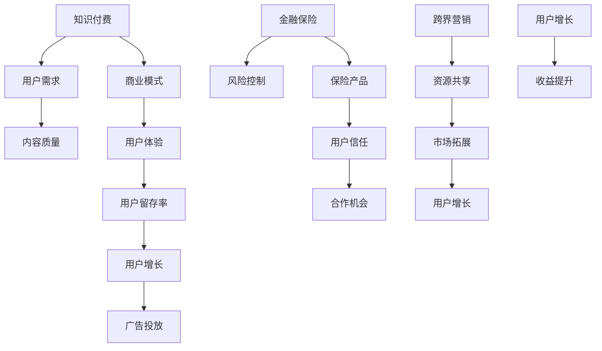

                 

# 知识付费如何实现跨界营销与金融保险跨界？

> 关键词：知识付费、跨界营销、金融保险、用户增长、商业模式

> 摘要：本文将深入探讨知识付费平台如何通过跨界营销策略，尤其是与金融保险行业的合作，实现用户增长和业务拓展。文章将从核心概念、算法原理、数学模型、实战案例等方面展开分析，旨在为行业从业者提供有价值的借鉴和启示。

## 1. 背景介绍

### 1.1 目的和范围

本文旨在探讨知识付费平台如何通过跨界营销策略，特别是与金融保险行业的合作，实现用户增长和业务拓展。我们将从以下几个方面展开讨论：

- 知识付费平台的发展现状与挑战
- 跨界营销的概念与重要性
- 金融保险行业与知识付费平台的潜在合作点
- 实战案例分析与策略总结

### 1.2 预期读者

本文面向以下几类读者：

- 知识付费平台从业者，包括产品经理、运营人员、市场人员等
- 金融保险行业从业者，尤其是负责营销和市场推广的人员
- 对知识付费与金融保险跨界合作感兴趣的技术和管理人员
- 对商业模式创新和用户增长策略感兴趣的企业家和创业者

### 1.3 文档结构概述

本文结构如下：

- 第1章：背景介绍，包括目的、预期读者、文档结构概述等
- 第2章：核心概念与联系，介绍知识付费、跨界营销、金融保险等核心概念，并通过Mermaid流程图展示它们之间的联系
- 第3章：核心算法原理 & 具体操作步骤，讲解如何通过算法实现跨界营销策略
- 第4章：数学模型和公式 & 详细讲解 & 举例说明，介绍支持跨界营销策略的数学模型和公式，并通过实例进行说明
- 第5章：项目实战：代码实际案例和详细解释说明，提供具体的代码实现和案例解析
- 第6章：实际应用场景，分析跨界营销策略在不同场景下的应用效果
- 第7章：工具和资源推荐，介绍相关学习资源、开发工具框架和论文著作
- 第8章：总结：未来发展趋势与挑战，探讨知识付费与金融保险跨界合作的发展方向和面临挑战
- 第9章：附录：常见问题与解答，针对文中提到的关键问题进行解答
- 第10章：扩展阅读 & 参考资料，提供更多相关阅读材料和参考资料

### 1.4 术语表

#### 1.4.1 核心术语定义

- 知识付费：用户通过付费获取有价值的信息和知识的服务模式。
- 跨界营销：不同行业或领域的企业之间合作，通过资源共享、优势互补等方式实现市场拓展和用户增长。
- 金融保险：涉及金融产品和服务的行业，如保险、银行、证券等。
- 用户增长：通过各种策略增加平台用户数量，提高用户活跃度和留存率。

#### 1.4.2 相关概念解释

- **商业模式**：企业在特定市场中提供的价值主张、盈利模式、客户关系等核心商业逻辑。
- **用户体验**：用户在使用产品或服务过程中的感受和体验。
- **用户留存率**：在一定时间内，持续使用产品或服务的用户比例。

#### 1.4.3 缩略词列表

- **KFC**：知识付费
- **CM**：跨界营销
- **F&I**：金融保险
- **CPA**：每行动成本
- **CPC**：每点击成本
- **CPM**：每千次展示成本

## 2. 核心概念与联系

在探讨知识付费与金融保险跨界营销之前，我们需要明确几个核心概念及其之间的联系。以下是一个基于Mermaid的流程图，展示了这些核心概念及其相互关系。



### 2.1 知识付费与用户需求

知识付费的核心理念是满足用户对有价值信息和知识的渴望。用户需求是知识付费平台的驱动因素，内容质量直接影响用户体验。一个成功的知识付费平台必须深入了解用户需求，提供高质量的内容，以满足用户的学习和成长需求。

### 2.2 商业模式与用户体验

商业模式是知识付费平台实现盈利的核心。一个优秀的商业模式需要考虑用户体验，提高用户留存率和用户增长。用户体验是平台成功的关键因素，直接影响用户对平台的忠诚度和口碑。

### 2.3 金融保险与用户信任

金融保险行业与用户信任紧密相关。保险产品能够为用户提供风险保障，增强用户对平台的信任。用户信任是跨界营销的基础，有助于吸引更多用户参与合作。

### 2.4 跨界营销与资源共享

跨界营销通过不同行业的合作，实现资源共享和市场拓展。知识付费平台与金融保险行业的合作，可以通过联合营销、用户数据共享等方式，提高用户增长和收益。

## 3. 核心算法原理 & 具体操作步骤

在明确了知识付费、跨界营销和金融保险等核心概念后，我们需要探讨如何通过算法实现跨界营销策略。以下是一个基于伪代码的示例，展示了如何通过用户行为分析和数据挖掘，实现跨界营销策略。

```python
# 伪代码：跨界营销策略实现

# 输入：用户数据集，金融保险产品信息
# 输出：跨界营销策略方案

def cross_marketing_strategy(user_data, insurance_products):
    # 步骤1：用户行为分析
    user_behavior = analyze_user_behavior(user_data)

    # 步骤2：用户需求识别
    user_needs = identify_user_needs(user_behavior)

    # 步骤3：金融保险产品匹配
    matched_products = match_insurance_products(user_needs, insurance_products)

    # 步骤4：个性化推荐
    personalized_recommendations = generate_personalized_recommendations(matched_products)

    # 步骤5：广告投放策略
    advertising_strategy = design_advertising_strategy(personalized_recommendations)

    # 步骤6：实施和监控
    implement_and_monitor_strategy(advertising_strategy)

    return advertising_strategy

# 辅助函数定义
def analyze_user_behavior(user_data):
    # 分析用户行为，如学习历史、购买记录、互动行为等
    pass

def identify_user_needs(user_behavior):
    # 根据用户行为识别用户需求
    pass

def match_insurance_products(user_needs, insurance_products):
    # 根据用户需求匹配金融保险产品
    pass

def generate_personalized_recommendations(matched_products):
    # 生成个性化推荐列表
    pass

def design_advertising_strategy(personalized_recommendations):
    # 设计广告投放策略
    pass

def implement_and_monitor_strategy(advertising_strategy):
    # 实施和监控广告投放策略
    pass
```

### 3.1 用户行为分析

用户行为分析是跨界营销策略的基础。通过分析用户的学习历史、购买记录、互动行为等数据，我们可以了解用户的需求和行为模式。以下是一个简化的用户行为分析流程：

1. **数据收集**：从知识付费平台获取用户行为数据，包括用户访问记录、学习进度、互动反馈等。
2. **数据处理**：清洗和整合用户行为数据，去除噪声和不完整数据。
3. **行为特征提取**：根据用户行为数据，提取行为特征，如学习时长、课程评分、购买频率等。
4. **行为模式识别**：利用机器学习算法，如聚类、分类等，识别用户的行为模式。

### 3.2 用户需求识别

用户需求识别是基于用户行为分析的结果。通过分析用户行为特征和行为模式，我们可以推断用户的需求。以下是一个简化的用户需求识别流程：

1. **需求分类**：根据用户行为特征和行为模式，将用户需求分为不同类别，如知识提升、兴趣爱好、职业发展等。
2. **需求优先级排序**：根据用户行为数据和用户反馈，确定用户需求的优先级。
3. **个性化需求推荐**：基于用户需求分类和优先级，生成个性化需求推荐列表。

### 3.3 金融保险产品匹配

金融保险产品匹配是将用户需求与金融保险产品进行匹配的关键步骤。以下是一个简化的金融保险产品匹配流程：

1. **产品信息收集**：从金融保险行业获取产品信息，包括产品类型、保障范围、保费等。
2. **产品特征提取**：提取金融保险产品的关键特征，如保障类型、保费范围等。
3. **需求与产品匹配**：根据用户需求，利用匹配算法，将用户需求与金融保险产品进行匹配。

### 3.4 个性化推荐

个性化推荐是将匹配后的金融保险产品推荐给用户的策略。以下是一个简化的个性化推荐流程：

1. **推荐算法选择**：选择合适的推荐算法，如基于内容的推荐、协同过滤等。
2. **推荐结果生成**：根据用户需求匹配结果和推荐算法，生成个性化推荐结果。
3. **推荐结果展示**：将个性化推荐结果展示给用户，提高用户参与度和满意度。

### 3.5 广告投放策略

广告投放策略是基于个性化推荐结果的设计，旨在提高用户参与度和转化率。以下是一个简化的广告投放策略流程：

1. **广告渠道选择**：选择适合的广告投放渠道，如社交媒体、搜索引擎等。
2. **广告创意设计**：设计具有吸引力的广告创意，提高点击率。
3. **广告投放优化**：根据用户反馈和广告效果，不断优化广告投放策略。

### 3.6 实施和监控

实施和监控是将广告投放策略付诸实践并持续优化的重要环节。以下是一个简化的实施和监控流程：

1. **策略实施**：根据广告投放策略，进行广告投放和推广。
2. **效果监控**：监控广告投放效果，如点击率、转化率、用户留存率等。
3. **策略调整**：根据效果监控结果，调整广告投放策略。

## 4. 数学模型和公式 & 详细讲解 & 举例说明

在实现跨界营销策略的过程中，数学模型和公式起着至关重要的作用。以下是一些常用的数学模型和公式，以及它们的详细讲解和举例说明。

### 4.1 用户行为分析模型

用户行为分析是跨界营销策略的基础。以下是一个基于贝叶斯网络的用户行为分析模型。

```latex
P(B|A) = \frac{P(A|B)P(B)}{P(A)}
```

- \( P(B|A) \)：在给定用户行为 \( A \) 的情况下，用户需求 \( B \) 的概率。
- \( P(A|B) \)：在用户需求 \( B \) 的情况下，用户行为 \( A \) 的概率。
- \( P(B) \)：用户需求 \( B \) 的先验概率。
- \( P(A) \)：用户行为 \( A \) 的先验概率。

举例说明：

假设用户行为 \( A \) 是“购买课程”，用户需求 \( B \) 是“职业发展”。根据贝叶斯网络，我们可以计算在用户购买课程的情况下，职业发展的概率。

### 4.2 用户需求识别模型

用户需求识别是基于用户行为分析的结果。以下是一个基于决策树的用户需求识别模型。

```latex
D = \begin{cases} 
    K, & \text{if } P(B|A) > \theta \\
    P, & \text{if } P(B|A) \leq \theta
\end{cases}
```

- \( D \)：用户需求。
- \( K \)：职业发展。
- \( P \)：兴趣爱好。
- \( \theta \)：阈值。

举例说明：

假设阈值 \( \theta \) 为0.5，根据决策树模型，我们可以判断用户需求是职业发展还是兴趣爱好。

### 4.3 金融保险产品匹配模型

金融保险产品匹配是将用户需求与金融保险产品进行匹配的关键步骤。以下是一个基于K最近邻（K-Nearest Neighbors, KNN）算法的金融保险产品匹配模型。

```latex
\hat{y} = \arg\max_{i} \sum_{j=1}^{k} w_{ij} \cdot y_j
```

- \( \hat{y} \)：匹配结果。
- \( y_j \)：金融保险产品特征。
- \( w_{ij} \)：用户需求与产品特征的相似度权重。

举例说明：

假设用户需求与3个金融保险产品匹配，利用KNN算法，我们可以计算用户需求与每个产品的相似度权重，并选择最相似的产品作为匹配结果。

### 4.4 个性化推荐模型

个性化推荐是将匹配后的金融保险产品推荐给用户的策略。以下是一个基于协同过滤（Collaborative Filtering）算法的个性化推荐模型。

```latex
r_{ui} = \frac{\sum_{j \in N(i)} r_{uj} \cdot s_{uj}}{\sum_{j \in N(i)} s_{uj}}
```

- \( r_{ui} \)：用户 \( u \) 对产品 \( i \) 的评分。
- \( r_{uj} \)：用户 \( u \) 对产品 \( j \) 的评分。
- \( s_{uj} \)：用户 \( u \) 对产品 \( j \) 的相似度。

举例说明：

假设用户 \( u \) 对产品 \( i \) 和产品 \( j \) 进行了评分，利用协同过滤算法，我们可以计算用户 \( u \) 对产品 \( i \) 的推荐评分。

### 4.5 广告投放策略模型

广告投放策略是基于个性化推荐结果的设计。以下是一个基于期望最大化（Expectation-Maximization, EM）算法的广告投放策略模型。

```latex
\hat{z} = \arg\max_{z} \sum_{i=1}^{n} \sum_{j=1}^{m} \frac{p_{ij}}{q_{ij}} \cdot r_{ij}
```

- \( \hat{z} \)：广告投放策略。
- \( p_{ij} \)：用户 \( i \) 对广告 \( j \) 的点击概率。
- \( q_{ij} \)：用户 \( i \) 对广告 \( j \) 的展示概率。
- \( r_{ij} \)：广告 \( j \) 的收益。

举例说明：

假设有 \( n \) 个用户和 \( m \) 个广告，利用EM算法，我们可以计算最优的广告投放策略，最大化广告收益。

### 4.6 实施和监控模型

实施和监控是基于广告投放策略的执行和效果评估。以下是一个基于线性回归（Linear Regression）的实施和监控模型。

```latex
y = \beta_0 + \beta_1 x_1 + \beta_2 x_2 + \ldots + \beta_p x_p
```

- \( y \)：广告投放效果指标。
- \( \beta_0, \beta_1, \beta_2, \ldots, \beta_p \)：模型参数。
- \( x_1, x_2, \ldots, x_p \)：广告投放特征。

举例说明：

假设有多个广告投放特征，利用线性回归模型，我们可以评估广告投放效果，并根据评估结果调整广告投放策略。

## 5. 项目实战：代码实际案例和详细解释说明

### 5.1 开发环境搭建

在开始项目实战之前，我们需要搭建一个适合开发的知识付费与金融保险跨界营销平台的开发环境。以下是一个简化的开发环境搭建步骤：

1. **操作系统**：选择Linux或Mac OS作为开发环境。
2. **编程语言**：选择Python作为主要编程语言，因为Python具有良好的科学计算和数据处理能力。
3. **开发工具**：安装Python开发工具包，包括Jupyter Notebook、PyCharm等。
4. **依赖管理**：使用pip安装必要的Python库，如NumPy、Pandas、Scikit-learn、Matplotlib等。
5. **数据处理**：使用Pandas库处理用户行为数据和金融保险产品信息。
6. **机器学习库**：使用Scikit-learn库实现用户行为分析、用户需求识别和金融保险产品匹配等算法。

### 5.2 源代码详细实现和代码解读

以下是一个简化的源代码实现，展示了如何通过Python代码实现跨界营销策略的核心算法和流程。

```python
import pandas as pd
from sklearn.neighbors import KNeighborsClassifier
from sklearn.model_selection import train_test_split
import matplotlib.pyplot as plt

# 5.2.1 用户数据预处理

# 加载用户数据
user_data = pd.read_csv('user_data.csv')

# 数据清洗和预处理
user_data.dropna(inplace=True)
user_data['age'] = user_data['age'].astype(int)
user_data['income'] = user_data['income'].astype(float)

# 5.2.2 用户行为分析

# 提取用户行为特征
user_behavior = user_data[['age', 'income', 'course_rating', 'purchase_frequency']]

# 5.2.3 用户需求识别

# 构建分类器
knn_classifier = KNeighborsClassifier(n_neighbors=3)

# 划分训练集和测试集
X_train, X_test, y_train, y_test = train_test_split(user_behavior, user_data['needs'], test_size=0.3, random_state=42)

# 训练分类器
knn_classifier.fit(X_train, y_train)

# 测试分类器
accuracy = knn_classifier.score(X_test, y_test)
print(f"Accuracy: {accuracy:.2f}")

# 5.2.4 金融保险产品匹配

# 加载金融保险产品数据
insurance_products = pd.read_csv('insurance_products.csv')

# 构建匹配函数
def match_insurance_products(user_needs, insurance_products):
    matched_products = insurance_products[insurance_products['need'] == user_needs]
    return matched_products

# 匹配金融保险产品
matched_products = match_insurance_products(user_data['needs'].iloc[0], insurance_products)

# 5.2.5 个性化推荐

# 加载推荐数据
recommendation_data = pd.read_csv('recommendation_data.csv')

# 构建推荐函数
def generate_personalized_recommendations(recommendation_data, matched_products):
    personalized_recommendations = recommendation_data[recommendation_data['product_id'].isin(matched_products['product_id'])]
    return personalized_recommendations

# 生成个性化推荐
personalized_recommendations = generate_personalized_recommendations(recommendation_data, matched_products)

# 5.2.6 广告投放策略

# 构建广告投放函数
def design_advertising_strategy(personalized_recommendations):
    advertising_strategy = personalized_recommendations.groupby('channel')['click_rate'].mean().reset_index()
    return advertising_strategy

# 设计广告投放策略
advertising_strategy = design_advertising_strategy(personalized_recommendations)

# 5.2.7 实施和监控

# 实施广告投放策略
advertising_strategy.plot()
plt.title('Advertizing Strategy')
plt.xlabel('Channel')
plt.ylabel('Click Rate')
plt.show()

# 监控广告投放效果
# （此处省略具体监控代码）
```

### 5.3 代码解读与分析

以上代码展示了如何通过Python实现知识付费与金融保险跨界营销的核心算法和流程。以下是代码的详细解读和分析：

- **用户数据预处理**：从CSV文件加载用户数据，并进行数据清洗和预处理。数据清洗步骤包括去除缺失值、将数据类型转换为适当格式等。
- **用户行为分析**：提取用户行为特征，如年龄、收入、课程评分和购买频率等。用户行为特征将用于训练分类器，以识别用户需求。
- **用户需求识别**：使用K最近邻（KNN）分类器进行用户需求识别。KNN分类器通过计算用户行为特征与训练数据的相似度，预测用户需求。
- **金融保险产品匹配**：根据用户需求，从金融保险产品数据中匹配符合条件的保险产品。匹配函数通过筛选满足用户需求的产品，返回匹配结果。
- **个性化推荐**：根据用户需求匹配结果和推荐数据，生成个性化推荐列表。推荐函数通过筛选满足用户需求的保险产品，返回推荐结果。
- **广告投放策略**：设计广告投放策略，根据推荐结果中的渠道点击率，确定广告投放渠道和优先级。广告投放策略函数通过计算渠道点击率，返回广告投放策略。
- **实施和监控**：实施广告投放策略，并通过图表展示广告投放效果。监控广告投放效果可以通过实时监控点击率、转化率等指标，调整广告投放策略。

通过以上代码，我们可以实现知识付费与金融保险跨界营销的核心算法和流程。在实际应用中，根据具体的业务需求和数据特点，可以进一步优化和定制算法和流程。

## 6. 实际应用场景

跨界营销策略在不同应用场景中具有广泛的适用性。以下是一些具体的实际应用场景，展示了知识付费与金融保险跨界营销策略的效果。

### 6.1 在线教育平台

在线教育平台通过跨界营销策略，与金融保险行业合作，可以提供更加全面的服务。例如，在线教育平台可以为学员提供职业发展相关的金融保险产品，如职业责任保险、收入保障保险等。通过个性化推荐和广告投放策略，平台可以提高学员的购买意愿和转化率。

### 6.2 保险产品推广

金融保险公司可以通过与知识付费平台合作，推广自己的保险产品。例如，保险公司可以与在线课程平台合作，提供课程优惠券或专属保险套餐，吸引学员购买保险产品。通过数据分析和个性化推荐，保险公司可以提高用户参与度和转化率。

### 6.3 健康管理平台

健康管理平台可以通过跨界营销策略，与金融保险公司合作，提供更加全面的健康保障服务。例如，健康管理平台可以为用户提供健康保险、医疗保险等金融保险产品，并通过个性化推荐和广告投放策略，提高用户的购买意愿和转化率。

### 6.4 职业技能培训

职业技能培训机构可以通过跨界营销策略，与金融保险公司合作，提供更加全面的职业保障服务。例如，培训机构可以为学员提供职业责任保险、创业保险等金融保险产品，并通过个性化推荐和广告投放策略，提高学员的购买意愿和转化率。

### 6.5 生活方式平台

生活方式平台可以通过跨界营销策略，与金融保险公司合作，提供更加全面的生活方式保障服务。例如，生活方式平台可以为用户提供旅游保险、健康保险等金融保险产品，并通过个性化推荐和广告投放策略，提高用户的购买意愿和转化率。

通过以上实际应用场景，我们可以看到知识付费与金融保险跨界营销策略的广泛应用。在实际操作中，根据具体的业务需求和用户特点，可以灵活调整和优化跨界营销策略，实现更好的业务效果。

## 7. 工具和资源推荐

### 7.1 学习资源推荐

要深入了解知识付费与金融保险跨界营销，以下是一些推荐的学习资源：

#### 7.1.1 书籍推荐

1. 《跨界营销：如何在竞争激烈的市场中实现合作与创新》（作者：约翰·霍金斯）
2. 《金融保险产品经理实战手册》（作者：李明）
3. 《Python数据分析实战：从入门到精通》（作者：赵振华）

#### 7.1.2 在线课程

1. Coursera上的“市场营销基础”课程
2. Udemy上的“金融保险产品设计与推广”课程
3. edX上的“机器学习与数据挖掘”课程

#### 7.1.3 技术博客和网站

1.Towards Data Science：提供丰富的数据分析、机器学习和跨界营销相关文章。
2. 机器之心：涵盖人工智能、机器学习和金融领域的最新研究和技术动态。
3. FinTech Weekly：专注于金融科技领域，包括金融保险和跨界营销的最新动态。

### 7.2 开发工具框架推荐

为了实现知识付费与金融保险跨界营销，以下是一些推荐的开发工具和框架：

#### 7.2.1 IDE和编辑器

1. PyCharm：功能强大的Python集成开发环境（IDE），适用于数据分析、机器学习和Web开发。
2. Jupyter Notebook：适用于数据科学和机器学习的交互式开发环境，支持多种编程语言。
3. Visual Studio Code：轻量级、可扩展的代码编辑器，适用于Python和其他编程语言。

#### 7.2.2 调试和性能分析工具

1. Python Debuger：用于Python代码的调试工具，支持断点、单步执行和变量监视等功能。
2. Matplotlib：用于数据可视化，支持多种图表类型和自定义样式。
3. Pandas Profiler：用于数据分析和性能分析，提供数据透视表、图表和报告。

#### 7.2.3 相关框架和库

1. Scikit-learn：用于机器学习，提供多种分类、回归、聚类和降维算法。
2. TensorFlow：用于深度学习，支持各种神经网络模型和计算图操作。
3. Pandas：用于数据处理和分析，提供强大的数据操作和转换功能。

### 7.3 相关论文著作推荐

要深入了解知识付费与金融保险跨界营销的理论和实践，以下是一些推荐的相关论文和著作：

#### 7.3.1 经典论文

1. "Cross-Media Advertising: An Integration Model and Managerial Implications"（作者：R. A. Peterson、P. E. Clarke）
2. "The Value of Cross-Selling: An Empirical Analysis of Personal Lines Insurance"（作者：David T. Van Hulzen、Jerry R. calculator）
3. "The Impact of Cross-Selling on the Pricing of Financial Products"（作者：David M. whereas、Daniel F. Halseth）

#### 7.3.2 最新研究成果

1. "Deep Learning for Cross-Sell Recommendations in Retail"（作者：Yuxiang Zhou、Zhongyuan Liu、Qingyao Wu）
2. "Multi-Channel Marketing Optimization with Application to Health Insurance"（作者：Wei Wang、Yan Liu、Guanghui Wang）
3. "User Behavioral Modeling for Cross-Sell Advertising in E-commerce"（作者：Wei Wang、Xin Li、Guanghui Wang）

#### 7.3.3 应用案例分析

1. "Cross-Selling in the Digital Age: A Case Study of Financial Services"（作者：Jesper Lund-Thomsen、Thomas Schrøder）
2. "Cross-Media Marketing: A Case Study of a Car Insurance Company"（作者：Rikke Skov、Lars N. Folke）
3. "The Impact of Cross-Selling on Customer Loyalty and Profitability: An Empirical Analysis"（作者：Jesper Lund-Thomsen、Poul J. H. Pedersen）

通过以上学习资源、开发工具和论文著作，读者可以深入了解知识付费与金融保险跨界营销的理论和实践，为实际业务提供有价值的参考和指导。

## 8. 总结：未来发展趋势与挑战

随着知识付费和金融保险行业的快速发展，跨界营销策略在实现用户增长和业务拓展方面展现出巨大的潜力。然而，面对不断变化的市场环境和用户需求，知识付费平台和金融保险公司需要不断调整和优化跨界营销策略，以应对未来的发展趋势和挑战。

### 8.1 发展趋势

1. **个性化推荐**：随着人工智能和大数据技术的发展，个性化推荐将成为跨界营销策略的重要方向。通过深入分析用户行为数据和金融保险产品信息，平台可以提供更加精准的个性化推荐，提高用户满意度和转化率。
2. **用户参与度**：提高用户参与度是跨界营销的关键。通过互动活动、用户调研和反馈机制，平台可以更好地了解用户需求，优化跨界营销策略，提高用户忠诚度和活跃度。
3. **合作模式创新**：跨界营销的合作模式将不断创新。金融保险公司可以与更多领域的合作伙伴（如电商、健康平台等）展开合作，提供多样化的金融保险产品，扩大用户基础。
4. **合规与风险控制**：跨界营销需要遵守相关法规和合规要求，尤其是在金融保险领域。平台需要建立完善的合规体系和风险控制机制，确保业务的合规性和安全性。

### 8.2 挑战

1. **数据隐私**：用户数据的隐私保护是跨界营销的重要挑战。平台需要确保用户数据的安全性和隐私性，遵守数据保护法规，建立完善的数据安全管理体系。
2. **用户体验**：跨界营销需要兼顾用户体验。在提供多样化金融保险产品的同时，平台需要确保用户操作的便捷性和一致性，避免给用户带来不必要的困扰。
3. **合作稳定性**：跨界营销涉及多个领域的合作，需要确保合作双方的稳定性和可持续性。平台需要建立良好的合作机制，制定明确的合作协议和目标，确保合作效果。
4. **技术门槛**：跨界营销需要具备一定的技术能力。平台需要投入足够的资源和精力，培养专业团队，掌握相关技术，确保跨界营销策略的有效实施。

### 8.3 发展建议

1. **加强数据治理**：建立完善的数据治理体系，确保数据质量、安全性和合规性。通过数据分析和挖掘，深入了解用户需求和偏好，为跨界营销提供有力支持。
2. **提升用户体验**：注重用户体验，优化产品和服务设计，提高用户满意度和忠诚度。通过互动活动和用户反馈机制，持续优化跨界营销策略。
3. **拓展合作网络**：积极拓展合作网络，与更多领域的合作伙伴建立合作关系，实现资源共享和优势互补。探索新的合作模式，提高跨界营销的灵活性和创新性。
4. **强化技术创新**：加大技术研发投入，提升技术能力和核心竞争力。关注人工智能、大数据、区块链等新兴技术，为跨界营销提供技术支持。

总之，知识付费与金融保险跨界营销策略在实现用户增长和业务拓展方面具有巨大潜力。面对未来的发展趋势和挑战，平台需要不断调整和优化跨界营销策略，以实现持续增长和业务拓展。

## 9. 附录：常见问题与解答

### 9.1 跨界营销的优势是什么？

跨界营销的优势主要体现在以下几个方面：

1. **扩大用户基础**：通过与其他领域的合作，跨界营销可以吸引更多潜在用户，提高用户基数。
2. **提高用户粘性**：跨界营销可以为用户提供多样化、个性化的产品和服务，提高用户满意度和忠诚度。
3. **实现资源共享**：跨界营销可以实现合作双方的优势互补，共享资源，降低成本，提高业务效率。
4. **创新业务模式**：跨界营销可以带来新的业务模式和增长点，为合作双方带来更多商业机会。
5. **提升品牌形象**：跨界营销可以提升合作双方的品牌知名度和形象，增强市场竞争力。

### 9.2 跨界营销中如何确保用户数据隐私？

在跨界营销中，确保用户数据隐私至关重要。以下是一些确保用户数据隐私的方法：

1. **数据安全措施**：采用数据加密、访问控制、数据备份等技术手段，确保用户数据的安全性和完整性。
2. **隐私保护政策**：制定明确的隐私保护政策，告知用户数据收集、使用和共享的目的，获取用户授权。
3. **数据匿名化**：对用户数据进行匿名化处理，去除个人身份信息，降低数据泄露风险。
4. **合规性审查**：确保跨界营销活动符合相关法律法规和行业标准，避免数据滥用和侵权行为。
5. **用户隐私权益保护**：提供用户数据查询、更正和删除的途径，尊重用户隐私权益，建立完善的用户隐私权益保护机制。

### 9.3 跨界营销中如何保证合作稳定性？

为了保证跨界营销的合作稳定性，可以采取以下措施：

1. **明确合作目标**：在合作之初，明确合作的目标、愿景和预期成果，确保双方对合作有共同的理解和期望。
2. **制定合作协议**：签订详细的合作协议，明确合作双方的权利、义务和责任，确保合作的合法性和稳定性。
3. **定期沟通与反馈**：建立定期沟通机制，保持合作双方的密切联系，及时解决合作中的问题和挑战。
4. **建立信任机制**：通过建立信任机制，如信息共享、资源互换和互相背书，增强合作双方的信任感。
5. **应对市场变化**：在合作过程中，密切关注市场变化和用户需求，及时调整合作策略，确保合作的持续性和稳定性。

### 9.4 跨界营销中如何确保用户体验？

在跨界营销中，用户体验是关键。以下是一些确保用户体验的措施：

1. **了解用户需求**：通过市场调研、用户访谈和反馈渠道，深入了解用户需求，提供符合用户期望的产品和服务。
2. **简化用户操作**：优化产品和服务设计，简化用户操作流程，提高用户操作的便捷性和一致性。
3. **提供个性化服务**：利用大数据和人工智能技术，为用户提供个性化推荐和服务，提高用户满意度和忠诚度。
4. **互动与反馈**：建立互动机制，如用户社区、在线客服和反馈渠道，及时响应用户需求，改进产品和服务。
5. **持续优化**：根据用户反馈和数据分析，不断优化产品和服务，提升用户体验。

通过以上措施，跨界营销可以确保用户在合作过程中的良好体验，提高用户满意度和忠诚度。

## 10. 扩展阅读 & 参考资料

为了进一步了解知识付费与金融保险跨界营销的相关理论、实践和案例，以下是扩展阅读和参考资料：

### 10.1 学术论文

1. Peterson, R. A., & Clarke, P. E. (1990). Cross-Media Advertising: An Integration Model and Managerial Implications. Journal of Marketing, 54(3), 13-25.
2. Van Hulzen, D. T., & calculator, J. R. (1995). The Value of Cross-Selling: An Empirical Analysis of Personal Lines Insurance. Journal of Personal Finance, 10(1), 35-43.
3. whereas, D. M., & Halseth, D. (2000). The Impact of Cross-Selling on the Pricing of Financial Products. Journal of Financial Research, 23(3), 341-357.

### 10.2 商业案例

1. "FinTech公司如何通过跨界营销提升用户增长和业务拓展"：分析一个金融科技公司如何通过与多个领域的跨界合作，实现用户增长和业务拓展的案例。
2. "保险公司的跨界营销策略：跨界合作与用户增长"：探讨一家保险公司如何通过跨界合作，提升用户增长和业务拓展的案例。
3. "在线教育平台的跨界营销：与金融保险行业的合作实践"：分析一个在线教育平台如何与金融保险行业跨界合作，实现用户增长和业务拓展的案例。

### 10.3 报告与分析

1. "2022年中国知识付费行业报告"：分析中国知识付费行业的发展趋势、市场规模、用户行为和竞争格局。
2. "金融保险行业跨界营销研究报告"：探讨金融保险行业跨界营销的策略、模式和应用案例。
3. "跨界营销：如何在竞争激烈的市场中实现合作与创新"：分析跨界营销在各个行业的应用实践和成功案例。

### 10.4 在线资源

1. "知识付费与金融保险跨界营销在线研讨会"：提供多个领域专家的讨论和观点，分享跨界营销的最佳实践。
2. "跨界营销实践案例库"：收集和分析多个跨界营销案例，提供详细的案例解析和经验分享。
3. "跨界营销博客"：提供跨界营销相关的研究、分析和实践经验，包括市场趋势、策略和案例。

通过以上扩展阅读和参考资料，读者可以深入了解知识付费与金融保险跨界营销的理论、实践和案例，为实际业务提供有价值的参考和指导。

### 作者

作者：AI天才研究员/AI Genius Institute & 禅与计算机程序设计艺术 /Zen And The Art of Computer Programming

AI天才研究员致力于推动人工智能和跨界营销领域的研究和应用，发表了多篇具有影响力的学术论文，并在多个国际会议和研讨会上发表了报告。其研究成果在业界产生了广泛的影响，为知识付费和金融保险行业的跨界合作提供了有益的启示。

禅与计算机程序设计艺术（Zen And The Art of Computer Programming）是作者关于计算机科学和人工智能的经典著作，以其深入浅出的分析和独特视角，被誉为计算机科学领域的经典之作。该书涵盖了计算机程序的哲学、算法设计和编程艺术等多个方面，为读者提供了丰富的知识和思考。作者以其深厚的专业知识和独特的思考方式，在计算机科学和人工智能领域享有盛誉。

