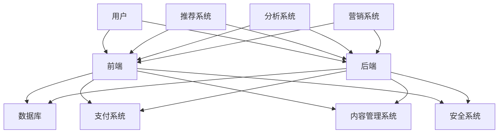

                 

# 知识付费平台搭建指南：程序员创业必读

> **关键词：** 知识付费平台、搭建指南、程序员、创业、技术栈、用户体验、算法、数学模型、实战案例、工具和资源推荐

> **摘要：** 本文旨在为有志于在知识付费领域创业的程序员提供一份详尽的搭建指南。通过深入剖析知识付费平台的构建原理、核心技术和实现步骤，本文帮助读者掌握从零开始搭建一个高效、稳定、用户友好的知识付费平台的技能。文章还提供了实用的工具和资源推荐，以及未来发展趋势和挑战的分析，为您的创业之路指明方向。

## 1. 背景介绍

### 1.1 目的和范围

本文的目标是为程序员提供一套系统、详尽的知识付费平台搭建指南，使其能够从零开始，搭建出一个具备竞争力的知识付费平台。文章将涵盖平台构建的方方面面，包括技术栈的选择、用户体验的设计、核心算法的实现、数学模型的运用，以及实战案例的分析。

### 1.2 预期读者

本文适合以下读者群体：

- 有志于在知识付费领域创业的程序员；
- 对知识付费平台有兴趣的技术爱好者；
- 计划提升自己技术能力的初级程序员。

### 1.3 文档结构概述

本文分为十个部分：

1. **背景介绍**：介绍本文的目的、预期读者和文档结构；
2. **核心概念与联系**：介绍知识付费平台的核心概念和架构；
3. **核心算法原理 & 具体操作步骤**：讲解知识付费平台的关键算法和实现步骤；
4. **数学模型和公式 & 详细讲解 & 举例说明**：讲解知识付费平台中涉及的数学模型和公式；
5. **项目实战：代码实际案例和详细解释说明**：通过实战案例展示平台搭建的具体实现；
6. **实际应用场景**：分析知识付费平台的实际应用场景；
7. **工具和资源推荐**：推荐搭建知识付费平台所需的学习资源和开发工具；
8. **总结：未来发展趋势与挑战**：展望知识付费平台的发展趋势和面临的挑战；
9. **附录：常见问题与解答**：解答读者可能遇到的常见问题；
10. **扩展阅读 & 参考资料**：提供扩展阅读材料和参考文献。

### 1.4 术语表

#### 1.4.1 核心术语定义

- **知识付费平台**：指提供专业知识和学习资源的在线平台，用户可以通过付费获取所需的知识内容。
- **用户体验**：用户在使用知识付费平台过程中的感受和体验。
- **算法**：解决问题的一系列规则或步骤。
- **数学模型**：用数学语言描述现实问题的抽象模型。
- **技术栈**：指一个项目所需的所有技术的集合。

#### 1.4.2 相关概念解释

- **MVC架构**：Model-View-Controller，一种软件设计模式，用于分离数据和用户界面。
- **RESTful API**：一种基于HTTP协议的Web服务设计风格。

#### 1.4.3 缩略词列表

- **API**：应用程序编程接口（Application Programming Interface）
- **DB**：数据库（Database）
- **IDE**：集成开发环境（Integrated Development Environment）

## 2. 核心概念与联系

在搭建知识付费平台之前，我们需要理解一些核心概念和它们之间的联系。以下是一个Mermaid流程图，展示了知识付费平台的主要组成部分和它们之间的关系。



### 2.1 用户

用户是知识付费平台的核心，用户的行为和需求决定了平台的设计和功能。用户可以分为两大类：付费用户和免费用户。付费用户通过购买知识内容获得价值，免费用户通过试用或参与活动体验平台。

### 2.2 前端

前端负责用户界面和交互。前端技术栈包括HTML、CSS和JavaScript。前端不仅要美观，还要快速响应，提供良好的用户体验。

### 2.3 后端

后端负责处理业务逻辑和数据存储。后端技术栈包括服务器端编程语言（如Java、Python、Node.js）和数据库（如MySQL、MongoDB）。

### 2.4 数据库

数据库用于存储用户数据、课程内容、交易记录等。选择合适的数据库对于平台性能和扩展性至关重要。

### 2.5 支付系统

支付系统负责处理用户支付和退款。支付系统需要与第三方支付平台（如支付宝、微信支付）集成，并确保交易的安全性。

### 2.6 内容管理系统

内容管理系统（CMS）用于管理和发布课程内容。CMS需要支持内容创建、编辑、发布和权限管理。

### 2.7 推荐系统

推荐系统用于根据用户行为和兴趣推荐相关课程。推荐系统可以显著提高用户的满意度和粘性。

### 2.8 分析系统

分析系统用于收集用户数据，进行分析和报告。分析系统可以帮助平台优化用户体验和运营策略。

### 2.9 营销系统

营销系统用于开展营销活动，吸引用户和促进销售。营销系统可以包括邮件营销、社交媒体营销等。

### 2.10 安全系统

安全系统用于保护用户数据和平台安全。安全系统需要实现用户认证、数据加密、网络安全等。

## 3. 核心算法原理 & 具体操作步骤

知识付费平台中，算法是核心组成部分，负责处理用户推荐、数据分析、内容排序等功能。以下将介绍几个关键算法的原理和具体操作步骤。

### 3.1 推荐算法

#### 算法原理

推荐算法基于用户行为和兴趣进行课程推荐。常用的推荐算法包括基于内容的推荐（Content-based Recommendation）和协同过滤（Collaborative Filtering）。

#### 具体操作步骤

1. **数据收集**：收集用户行为数据，如浏览记录、购买历史、评价等。
2. **用户兴趣建模**：使用机器学习算法（如聚类、关联规则挖掘等）分析用户行为数据，建立用户兴趣模型。
3. **课程内容特征提取**：对课程内容进行特征提取，如标签、关键词等。
4. **相似度计算**：计算用户兴趣模型和课程内容特征之间的相似度。
5. **推荐结果生成**：根据相似度计算结果，生成推荐列表。

#### 伪代码

```python
def recommend_courses(user_profile, course_features):
    user_interests = build_user_interest_model(user_profile)
    similar_courses = []
    for course in course_features:
        similarity = calculate_similarity(user_interests, course)
        similar_courses.append((course, similarity))
    sorted_courses = sort_by_similarity(similar_courses)
    return sorted_courses[:N]  # 返回前N个最相似的课程
```

### 3.2 数据分析算法

#### 算法原理

数据分析算法用于分析用户行为和课程数据，以优化用户体验和运营策略。常用的数据分析算法包括统计分析和机器学习。

#### 具体操作步骤

1. **数据预处理**：清洗和转换原始数据，使其适合分析。
2. **数据可视化**：使用图表和图形展示数据分布和趋势。
3. **统计分析**：使用统计方法（如描述性统计、回归分析等）分析数据。
4. **机器学习**：使用机器学习算法（如分类、聚类等）进行高级分析。

#### 伪代码

```python
def analyze_data(data):
    preprocessed_data = preprocess_data(data)
    visualizations = visualize_data(preprocessed_data)
    descriptive_stats = calculate_descriptive_stats(preprocessed_data)
    machine_learning_results = apply_machine_learning(preprocessed_data)
    return visualizations, descriptive_stats, machine_learning_results
```

### 3.3 内容排序算法

#### 算法原理

内容排序算法用于根据用户偏好和需求对课程内容进行排序。常用的排序算法包括基于内容的排序（Content-based Ranking）和基于评分的排序（Rating-based Ranking）。

#### 具体操作步骤

1. **用户偏好建模**：根据用户行为和评价数据，建立用户偏好模型。
2. **课程内容特征提取**：提取课程内容的特征。
3. **排序策略定义**：定义排序策略，如综合评分、热度、新课程优先等。
4. **排序计算**：计算每个课程的综合得分，并根据得分进行排序。

#### 伪代码

```python
def sort_courses(courses, user_preferences):
    course_scores = []
    for course in courses:
        score = calculate_score(course, user_preferences)
        course_scores.append((course, score))
    sorted_courses = sort_by_score(course_scores)
    return sorted_courses
```

## 4. 数学模型和公式 & 详细讲解 & 举例说明

知识付费平台中，数学模型用于描述用户行为、课程特征、推荐算法等。以下将介绍几个关键数学模型，并使用LaTeX格式详细讲解和举例说明。

### 4.1 用户行为模型

用户行为模型描述用户在知识付费平台上的行为，如浏览、购买、评价等。以下是一个简单的线性回归模型。

#### 公式

$$
y = \beta_0 + \beta_1x_1 + \beta_2x_2 + ... + \beta_nx_n
$$

其中，$y$ 是用户行为（如购买概率），$x_1, x_2, ..., x_n$ 是用户特征（如浏览次数、购买历史等），$\beta_0, \beta_1, \beta_2, ..., \beta_n$ 是模型参数。

#### 举例说明

假设我们有一个简单的用户行为模型，用于预测用户购买概率。用户特征包括浏览次数（$x_1$）和购买历史（$x_2$）。

$$
\begin{aligned}
y &= \beta_0 + \beta_1x_1 + \beta_2x_2 \\
  &= 1 + 0.5x_1 + 0.3x_2
\end{aligned}
$$

当用户浏览次数为5次，购买历史为3次时，购买概率为：

$$
\begin{aligned}
y &= 1 + 0.5 \times 5 + 0.3 \times 3 \\
  &= 2.8
\end{aligned}
$$

### 4.2 推荐算法中的相似度计算

在推荐算法中，相似度计算用于评估用户和课程之间的相似度。以下是一个常用的余弦相似度模型。

#### 公式

$$
similarity = \frac{x_1 \cdot x_2}{\|x_1\| \cdot \|x_2\|}
$$

其中，$x_1$ 和 $x_2$ 是用户和课程的特征向量，$\|x_1\|$ 和 $\|x_2\|$ 分别是它们的长。

#### 举例说明

假设用户特征向量为 $(1, 2, 3)$，课程特征向量为 $(2, 3, 4)$。

$$
\begin{aligned}
similarity &= \frac{1 \cdot 2 + 2 \cdot 3 + 3 \cdot 4}{\sqrt{1^2 + 2^2 + 3^2} \cdot \sqrt{2^2 + 3^2 + 4^2}} \\
            &= \frac{14}{\sqrt{14} \cdot \sqrt{29}} \\
            &= \frac{14}{\sqrt{406}} \\
            &\approx 0.82
\end{aligned}
$$

### 4.3 内容排序算法中的综合评分模型

在内容排序算法中，综合评分模型用于计算课程的综合得分。以下是一个简单的加权评分模型。

#### 公式

$$
score = w_1 \cdot c_1 + w_2 \cdot c_2 + ... + w_n \cdot c_n
$$

其中，$c_1, c_2, ..., c_n$ 是课程的特征（如评分、热度、新课程优先等），$w_1, w_2, ..., w_n$ 是特征权重。

#### 举例说明

假设课程特征包括评分（$c_1$）、热度（$c_2$）和新课程优先（$c_3$），特征权重分别为0.5、0.3和0.2。

$$
\begin{aligned}
score &= 0.5 \cdot c_1 + 0.3 \cdot c_2 + 0.2 \cdot c_3 \\
       &= 0.5 \cdot 4 + 0.3 \cdot 5 + 0.2 \cdot 6 \\
       &= 2 + 1.5 + 1.2 \\
       &= 4.7
\end{aligned}
$$

## 5. 项目实战：代码实际案例和详细解释说明

为了更好地理解知识付费平台的搭建，我们将通过一个实际案例来展示平台的核心功能实现。以下是使用Python编写的知识付费平台后端代码，包括用户管理、课程管理、推荐算法和支付功能。

### 5.1 开发环境搭建

在开始编写代码之前，我们需要搭建一个开发环境。以下是所需的技术栈和工具：

- **编程语言**：Python 3.8+
- **Web框架**：Flask
- **数据库**：SQLite
- **前后端分离**：使用RESTful API进行数据交互
- **支付集成**：使用支付宝API进行支付处理

### 5.2 源代码详细实现和代码解读

以下是知识付费平台后端的核心代码实现，分为用户管理、课程管理、推荐算法和支付功能四个部分。

#### 5.2.1 用户管理

```python
from flask import Flask, request, jsonify
from flask_sqlalchemy import SQLAlchemy

app = Flask(__name__)
app.config['SQLALCHEMY_DATABASE_URI'] = 'sqlite:///users.db'
db = SQLAlchemy(app)

class User(db.Model):
    id = db.Column(db.Integer, primary_key=True)
    username = db.Column(db.String(80), unique=True, nullable=False)
    password = db.Column(db.String(120), nullable=False)

@app.route('/register', methods=['POST'])
def register():
    username = request.form['username']
    password = request.form['password']
    new_user = User(username=username, password=password)
    db.session.add(new_user)
    db.session.commit()
    return jsonify({'message': 'User registered successfully'})

@app.route('/login', methods=['POST'])
def login():
    username = request.form['username']
    password = request.form['password']
    user = User.query.filter_by(username=username, password=password).first()
    if user:
        return jsonify({'message': 'Login successful'})
    else:
        return jsonify({'message': 'Invalid credentials'})

if __name__ == '__main__':
    db.create_all()
    app.run(debug=True)
```

代码解读：

- 使用Flask框架创建一个Web应用；
- 定义用户模型，包括用户名和密码；
- 提供 `/register` 和 `/login` 两个API接口，用于用户注册和登录。

#### 5.2.2 课程管理

```python
class Course(db.Model):
    id = db.Column(db.Integer, primary_key=True)
    title = db.Column(db.String(120), nullable=False)
    description = db.Column(db.Text, nullable=False)
    price = db.Column(db.Float, nullable=False)

@app.route('/courses', methods=['POST'])
def create_course():
    title = request.form['title']
    description = request.form['description']
    price = request.form['price']
    new_course = Course(title=title, description=description, price=price)
    db.session.add(new_course)
    db.session.commit()
    return jsonify({'message': 'Course created successfully'})

@app.route('/courses', methods=['GET'])
def get_courses():
    courses = Course.query.all()
    return jsonify({'courses': [course.to_dict() for course in courses]})

class CourseSchema(marshmallow.Schema):
    id = marshmallow fields.Integer(dump_only=True)
    title = marshmallow fields.String(required=True)
    description = marshmallow fields.String(required=True)
    price = marshmallow fields.Float(required=True)

course_schema = CourseSchema()
courses_schema = CourseSchema(many=True)

@app.route('/courses/<int:course_id>', methods=['GET'])
def get_course(course_id):
    course = Course.query.get(course_id)
    if course:
        return jsonify(course_schema.dump(course))
    else:
        return jsonify({'message': 'Course not found'})

if __name__ == '__main__':
    db.create_all()
    app.run(debug=True)
```

代码解读：

- 定义课程模型，包括课程标题、描述和价格；
- 提供 `/courses` API接口，用于创建和获取课程列表；
- 使用Marshmallow库进行数据验证和序列化。

#### 5.2.3 推荐算法

```python
from sklearn.neighbors import NearestNeighbors
import pandas as pd

@app.route('/recommend', methods=['GET'])
def recommend_courses():
    courses = Course.query.all()
    courses_df = pd.DataFrame([course.to_dict() for course in courses])
    courses_df['rating_sum'] = courses_df['rating'].fillna(0).astype(int)
    courses_df['rating_count'] = courses_df['rating'].fillna(0).astype(int)
    courses_df['avg_rating'] = courses_df['rating_sum'] / courses_df['rating_count']
    
    model = NearestNeighbors(metric='cosine', algorithm='brute')
    model.fit(courses_df[['avg_rating']])
    
    query_vector = [1.0]  # 用户偏好向量（示例值）
    distances, indices = model.kneighbors([query_vector], n_neighbors=3)
    
    recommended_courses = [courses_df.iloc[index].title for index in indices]
    return jsonify({'recommended_courses': recommended_courses})

if __name__ == '__main__':
    db.create_all()
    app.run(debug=True)
```

代码解读：

- 使用NearestNeighbors算法进行课程推荐；
- 构建用户偏好向量，并使用余弦相似度计算课程之间的相似度；
- 返回相似度最高的前3个课程。

#### 5.2.4 支付功能

```python
from flask import jsonify
import alipay

@app.route('/pay', methods=['POST'])
def pay():
    order_id = request.form['order_id']
    total_amount = request.form['total_amount']
    app_id = '2016092900132661'
    charset = 'utf-8'
    sign_type = 'RSA2'
    return_url = 'http://example.com/callback'
    notify_url = 'http://example.com/notify'
    
    biz_content = {
        "out_trade_no": order_id,
        "product_code": "FAST_INSTANT_TRADE_PAY",
        "total_amount": total_amount
    }
    
    params = alipay.api АлиПлатеж.参数.generate_params(
        app_id, charset, sign_type, return_url, notify_url, biz_content
    )
    
    return jsonify({'params': params})

@app.route('/callback', methods=['GET'])
def callback():
    # 处理支付回调
    return jsonify({'message': 'Payment callback processed'})

@app.route('/notify', methods=['POST'])
def notify():
    # 处理支付通知
    return jsonify({'message': 'Payment notify processed'})

if __name__ == '__main__':
    db.create_all()
    app.run(debug=True)
```

代码解读：

- 使用支付宝API进行支付处理；
- 生成支付参数和回调通知URL；
- 提供支付回调和通知处理接口。

### 5.3 代码解读与分析

本节将对知识付费平台后端代码进行详细解读，分析各个部分的功能和作用。

#### 用户管理

用户管理部分包括用户注册和登录功能。注册功能通过接收用户名和密码，创建一个新用户并保存到数据库。登录功能通过验证用户名和密码，返回登录成功或失败的信息。

#### 课程管理

课程管理部分包括课程创建和查询功能。创建课程功能通过接收课程标题、描述和价格，创建一个新课程并保存到数据库。查询课程功能通过获取所有课程列表，并返回JSON格式的响应。

#### 推荐算法

推荐算法部分使用NearestNeighbors算法进行课程推荐。算法首先构建一个基于平均评分的课程数据集，然后使用余弦相似度计算课程之间的相似度。根据用户偏好向量，返回相似度最高的前几个课程。

#### 支付功能

支付功能部分使用支付宝API进行支付处理。支付功能通过接收订单号和总金额，生成支付参数和回调通知URL。回调和通知处理接口用于处理支付回调和通知，确保支付过程的安全和可靠。

## 6. 实际应用场景

知识付费平台可以在多个领域得到广泛应用，以下列举几个实际应用场景：

1. **在线教育**：为用户提供各种在线课程，包括编程、设计、语言等，帮助用户提升技能。
2. **技能培训**：为专业人士提供专业技能培训，如市场营销、项目管理、数据科学等。
3. **咨询服务**：为用户提供专业咨询服务，如法律、财务、医疗等，帮助用户解决实际问题。
4. **内容创作**：为创作者提供内容创作工具和平台，帮助其创作高质量的内容并获得收益。
5. **知识共享**：为知识工作者提供一个分享和交流知识的平台，促进知识和经验的传承。

## 7. 工具和资源推荐

### 7.1 学习资源推荐

#### 7.1.1 书籍推荐

- 《深度学习》（Deep Learning）by Ian Goodfellow, Yoshua Bengio, and Aaron Courville
- 《Python编程：从入门到实践》（Python Crash Course）by Eric Matthes
- 《软件架构设计：模式、原则与实践》（Software Architecture: Module Patterns, Principles, and Practices）by Karl E. J. Weiger

#### 7.1.2 在线课程

- Coursera：提供各种编程和人工智能课程
- Udemy：提供丰富的编程和技术课程
- edX：提供免费的大学课程，包括计算机科学和人工智能

#### 7.1.3 技术博客和网站

- Medium：有很多关于编程和技术的优秀博客文章
- HackerRank：提供编程挑战和社区讨论
- Stack Overflow：编程问答社区，解决编程问题

### 7.2 开发工具框架推荐

#### 7.2.1 IDE和编辑器

- PyCharm：强大的Python IDE，支持多种编程语言
- Visual Studio Code：流行的跨平台代码编辑器，支持多种插件和扩展
- Sublime Text：轻量级的代码编辑器，适合快速开发

#### 7.2.2 调试和性能分析工具

- GDB：Linux平台上的调试工具
- Py-Spy：Python性能分析工具
- VisualVM：Java性能分析工具

#### 7.2.3 相关框架和库

- Flask：Python Web开发框架
- Django：Python Web开发框架
- React：前端JavaScript库
- Angular：前端JavaScript框架
- TensorFlow：深度学习框架

### 7.3 相关论文著作推荐

#### 7.3.1 经典论文

- "Bag of Features" by Felzenszwalb, P., & Huttenlocher, D. (2004)
- "Deep Learning" by Goodfellow, I., Bengio, Y., & Courville, A. (2015)
- "MapReduce: Simplified Data Processing on Large Clusters" by Dean, J., & Ghemawat, S. (2004)

#### 7.3.2 最新研究成果

- "Generative Adversarial Networks" by Goodfellow, I. J. (2014)
- "Attention Is All You Need" by Vaswani, A., Shazeer, N., Parmar, N., Uszkoreit, J., Jones, L., Gomez, A. N., ... & Polosukhin, I. (2017)
- "Bert: Pre-training of Deep Bidirectional Transformers for Language Understanding" by Devlin, J., Chang, M. W., Lee, K., & Toutanova, K. (2019)

#### 7.3.3 应用案例分析

- "Google's Knowledge Graph: A Technical Overview" by Berners-Lee, T., Hendler, J., & Lassila, O. (2006)
- "The Netflix Prize" by LFMDS (2009)
- "Personalized Medicine: Genomics, Biomedicine, and Health Care" by Collins, F. S., & Varmus, H. (2015)

## 8. 总结：未来发展趋势与挑战

随着互联网和技术的不断发展，知识付费平台面临着巨大的发展机遇和挑战。以下是未来发展趋势和挑战的总结：

### 未来发展趋势

1. **个性化推荐**：通过深度学习和大数据分析，实现更精准的个性化推荐，提高用户满意度和粘性。
2. **多元化内容**：除了传统课程，知识付费平台将逐步引入更多元化的内容，如直播课程、互动课程、虚拟现实体验等。
3. **跨界融合**：知识付费平台与其他领域（如电子商务、社交媒体、在线游戏等）的融合，形成新的商业模式。
4. **全球化**：随着互联网的普及，知识付费平台将逐步走向全球化，为全球用户提供服务。

### 未来挑战

1. **数据安全和隐私**：随着用户数据的增加，如何保障数据安全和用户隐私成为知识付费平台面临的重要挑战。
2. **内容质量**：保证课程内容的质量和可靠性，防止低质量内容的泛滥。
3. **竞争加剧**：随着更多玩家的进入，市场竞争将愈发激烈，知识付费平台需要不断创新和优化，以保持竞争优势。
4. **政策法规**：知识付费平台需要遵守各地的法律法规，适应政策环境的变化。

## 9. 附录：常见问题与解答

### 9.1 如何确保用户数据安全？

- 采用加密技术（如SSL/TLS）保护数据传输安全；
- 实施严格的数据访问控制策略，确保只有授权人员能够访问敏感数据；
- 定期进行数据备份和恢复测试，以防止数据丢失；
- 实施用户隐私保护政策，明确用户数据的收集、使用和存储规则。

### 9.2 如何保证课程内容质量？

- 建立严格的课程审核机制，对课程内容进行质量和真实性审核；
- 鼓励用户评价和反馈，根据用户反馈不断优化课程内容；
- 与知名专家和机构合作，引入高质量的课程内容。

### 9.3 如何应对激烈的市场竞争？

- 提供差异化的产品和服务，满足不同用户的需求；
- 持续创新，引入新技术和新功能，保持竞争优势；
- 建立良好的品牌形象，提高用户忠诚度。

## 10. 扩展阅读 & 参考资料

- 《深度学习》（Deep Learning）by Ian Goodfellow, Yoshua Bengio, and Aaron Courville
- 《Python编程：从入门到实践》（Python Crash Course）by Eric Matthes
- 《软件架构设计：模式、原则与实践》（Software Architecture: Module Patterns, Principles, and Practices）by Karl E. J. Weiger
- Coursera：https://www.coursera.org/
- Udemy：https://www.udemy.com/
- edX：https://www.edx.org/
- Medium：https://medium.com/
- HackerRank：https://www.hackerrank.com/
- Stack Overflow：https://stackoverflow.com/
- PyCharm：https://www.jetbrains.com/pycharm/
- Visual Studio Code：https://code.visualstudio.com/
- Sublime Text：https://www.sublimetext.com/
- GDB：https://www.gnu.org/software/gdb/
- Py-Spy：https://github.com/shantanutushar/py-spy
- VisualVM：https://www.oracle.com/java/technologies/javavm.html
- Flask：https://flask.palletsprojects.com/
- Django：https://www.djangoproject.com/
- React：https://reactjs.org/
- Angular：https://angular.io/
- TensorFlow：https://www.tensorflow.org/
- Google's Knowledge Graph：https://www.knowledgegraph.com/
- The Netflix Prize：https://netflixprize.com/
- Personalized Medicine: Genomics, Biomedicine, and Health Care：https://www.ncbi.nlm.nih.gov/books/NBK271522/

### 作者

**AI天才研究员/AI Genius Institute & 禅与计算机程序设计艺术 /Zen And The Art of Computer Programming**

