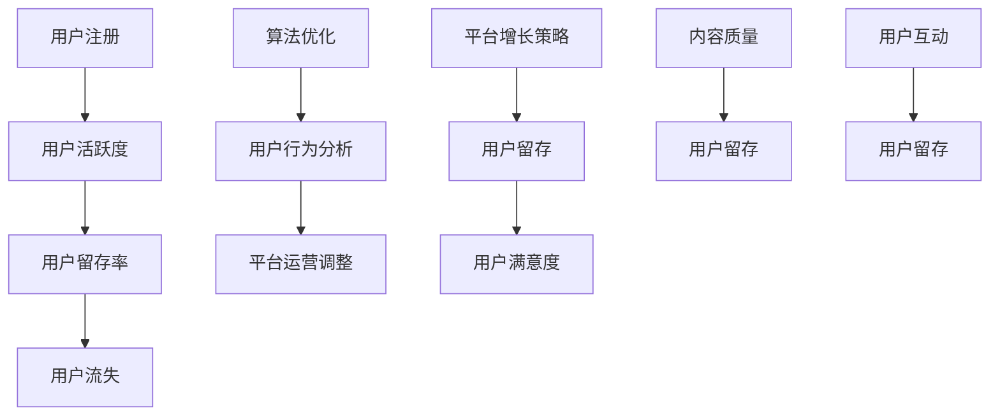

                 

# 知识付费平台的用户留存率提升策略

> 关键词：知识付费、用户留存、平台策略、算法优化、用户行为分析

> 摘要：本文深入探讨了知识付费平台在提高用户留存率方面的策略。通过对用户行为的分析、算法优化和平台运营的调整，知识付费平台能够有效地提高用户的活跃度和留存率，实现持续增长。

## 1. 背景介绍

### 1.1 目的和范围

本文旨在探讨知识付费平台如何通过优化用户留存策略来提高平台的用户活跃度和留存率。我们将结合用户行为分析、算法优化和运营策略，提供一系列可行的解决方案，以帮助知识付费平台实现可持续发展。

### 1.2 预期读者

本文适合知识付费平台的运营人员、产品经理以及对该领域感兴趣的从业者阅读。同时，对于关注用户留存策略的IT专业人士和数据分析人员也具有一定的参考价值。

### 1.3 文档结构概述

本文分为以下几个部分：

1. 背景介绍：介绍知识付费平台的发展现状和用户留存率的重要性。
2. 核心概念与联系：阐述用户留存的相关概念和算法原理。
3. 核心算法原理 & 具体操作步骤：详细讲解用户留存算法的原理和实现步骤。
4. 数学模型和公式：介绍用户留存率相关的数学模型和公式。
5. 项目实战：通过实际案例展示如何提高用户留存率。
6. 实际应用场景：分析知识付费平台在提高用户留存率方面的实践应用。
7. 工具和资源推荐：推荐学习资源和开发工具。
8. 总结：对未来发展趋势和挑战进行展望。
9. 附录：常见问题与解答。
10. 扩展阅读 & 参考资料：提供进一步学习的信息来源。

### 1.4 术语表

#### 1.4.1 核心术语定义

- 知识付费：用户为获取知识内容而支付一定费用的商业模式。
- 用户留存率：在一定时间内，仍然活跃的用户占原有用户总数的比例。
- 用户活跃度：用户在平台上的互动程度，如登录、浏览、购买等行为。

#### 1.4.2 相关概念解释

- 用户生命周期：用户从注册到退出的整个过程。
- 用户行为分析：通过分析用户在平台上的行为，了解用户需求，优化产品和服务。
- 算法优化：通过对算法进行调整和改进，提高算法的准确性和效率。

#### 1.4.3 缩略词列表

- ARPU：平均每用户收入（Average Revenue Per User）
- DAU：日活跃用户数（Daily Active Users）
- MAU：月活跃用户数（Monthly Active Users）

## 2. 核心概念与联系

知识付费平台的用户留存率是衡量平台成功与否的关键指标之一。要提升用户留存率，首先需要理解用户留存的核心概念和它们之间的联系。以下是一个简化的 Mermaid 流程图，用于描述用户留存的相关概念和算法原理。



### 2.1 用户留存算法原理

用户留存算法的核心目标是预测用户是否会流失，并采取相应的措施提高留存率。以下是一个简化的用户留存算法原理描述：

1. 数据收集：收集用户在平台上的行为数据，如登录次数、购买记录、互动频率等。
2. 数据预处理：对收集到的数据进行清洗和预处理，如去除异常值、缺失值填充等。
3. 特征工程：提取用户行为数据中的特征，如用户活跃度、购买频率、内容偏好等。
4. 模型训练：使用机器学习算法，如逻辑回归、随机森林、梯度提升机等，训练用户留存预测模型。
5. 模型评估：评估模型的效果，如准确率、召回率、F1 值等。
6. 模型应用：将训练好的模型应用到实际业务中，如发送个性化推荐、发送流失预警等。

### 2.2 用户行为分析

用户行为分析是提高用户留存率的重要手段之一。以下是一个简化的用户行为分析流程：

1. 用户分群：将用户按照不同的行为特征进行分群，如高频用户、低频用户、流失用户等。
2. 用户画像：构建用户画像，了解用户的兴趣爱好、行为习惯等。
3. 用户行为路径分析：分析用户在平台上的行为路径，了解用户的使用习惯和痛点。
4. 用户反馈分析：收集用户反馈，了解用户对产品和服务的不满和期望。
5. 用户流失预警：根据用户行为特征和模型预测，对可能流失的用户进行预警。

## 3. 核心算法原理 & 具体操作步骤

在用户留存算法中，常用的算法包括逻辑回归、随机森林、梯度提升机等。以下以逻辑回归为例，介绍用户留存算法的具体操作步骤。

### 3.1 数据收集与预处理

1. 收集用户在平台上的行为数据，如登录次数、购买记录、互动频率等。
2. 对收集到的数据进行清洗和预处理，如去除异常值、缺失值填充等。
3. 数据格式化：将数据格式化为算法所需的输入格式。

### 3.2 特征工程

1. 提取用户行为数据中的特征，如用户活跃度、购买频率、内容偏好等。
2. 特征选择：选择对用户留存有显著影响的特征，如使用信息增益、卡方检验等方法。
3. 特征归一化：对特征进行归一化处理，如使用 Min-Max 归一化、标准化等方法。

### 3.3 模型训练

1. 将预处理后的数据集划分为训练集和测试集。
2. 使用逻辑回归算法训练模型，模型参数为特征矩阵和标签矩阵。
3. 评估模型效果，如准确率、召回率、F1 值等。

### 3.4 模型应用

1. 将训练好的模型应用到实际业务中，如发送个性化推荐、发送流失预警等。
2. 根据模型预测结果，对用户进行分类，如留存用户、流失用户等。

### 3.5 伪代码实现

以下为逻辑回归算法的伪代码实现：

```python
# 数据收集与预处理
data = collect_data() # 收集用户行为数据
data = preprocess_data(data) # 数据清洗和预处理

# 特征工程
features = extract_features(data) # 提取特征
selected_features = feature_selection(features) # 特征选择
normalized_features = feature_normalization(selected_features) # 特征归一化

# 模型训练
train_data = split_data(normalized_features, labels) # 划分训练集和测试集
model = train_logistic_regression(train_data) # 训练逻辑回归模型

# 模型评估
evaluate_model(model, test_data) # 评估模型效果

# 模型应用
predictions = predict_user_retention(model, new_data) # 预测用户留存
classify_users(predictions) # 对用户进行分类
```

## 4. 数学模型和公式 & 详细讲解 & 举例说明

用户留存率是衡量知识付费平台用户活跃度和稳定性的重要指标。为了提高用户留存率，我们需要深入理解用户留存的相关数学模型和公式，以便更好地进行策略优化。

### 4.1 用户留存率公式

用户留存率（Retention Rate）可以定义为在一定时间内，仍然活跃的用户占原有用户总数的比例。其公式如下：

\[ R(t) = \frac{N(t) - N(0)}{N(0)} \times 100\% \]

其中：
- \( R(t) \) 表示用户留存率；
- \( N(t) \) 表示在时间 \( t \) 仍然活跃的用户数量；
- \( N(0) \) 表示初始用户数量。

### 4.2 逻辑回归模型

逻辑回归模型是一种常用的分类模型，用于预测用户是否会在未来的一段时间内流失。其基本公式如下：

\[ P(Y=1|X) = \frac{1}{1 + e^{-(\beta_0 + \beta_1X_1 + \beta_2X_2 + ... + \beta_nX_n)}} \]

其中：
- \( P(Y=1|X) \) 表示在给定特征 \( X \) 下，用户流失的概率；
- \( \beta_0, \beta_1, \beta_2, ..., \beta_n \) 为模型参数；
- \( X_1, X_2, ..., X_n \) 为用户特征。

### 4.3 举例说明

假设我们有一个用户数据集，包含用户活跃度、购买频率、内容偏好等特征，以及用户是否流失的标签。我们可以使用逻辑回归模型预测用户是否会在未来一个月内流失。

1. 数据收集与预处理：
   - 收集用户数据，包括活跃度（A）、购买频率（B）、内容偏好（C）等特征；
   - 对数据进行清洗和预处理，如去除缺失值、异常值等。

2. 特征工程：
   - 提取用户特征，如用户活跃度（A）、购买频率（B）、内容偏好（C）等；
   - 对特征进行归一化处理，如使用 Min-Max 归一化。

3. 模型训练：
   - 将数据集划分为训练集和测试集；
   - 使用训练集训练逻辑回归模型。

4. 模型评估：
   - 使用测试集评估模型效果，如准确率、召回率、F1 值等。

5. 模型应用：
   - 预测用户是否会在未来一个月内流失；
   - 根据预测结果，对用户进行分类，如留存用户、流失用户等。

### 4.4 伪代码实现

以下为逻辑回归模型的伪代码实现：

```python
# 数据收集与预处理
data = collect_data() # 收集用户数据
data = preprocess_data(data) # 数据清洗和预处理

# 特征工程
features = extract_features(data) # 提取特征
selected_features = feature_selection(features) # 特征选择
normalized_features = feature_normalization(selected_features) # 特征归一化

# 模型训练
train_data = split_data(normalized_features, labels) # 划分训练集和测试集
model = train_logistic_regression(train_data) # 训练逻辑回归模型

# 模型评估
evaluate_model(model, test_data) # 评估模型效果

# 模型应用
predictions = predict_user_retention(model, new_data) # 预测用户留存
classify_users(predictions) # 对用户进行分类
```

## 5. 项目实战：代码实际案例和详细解释说明

在本节中，我们将通过一个实际的项目案例，展示如何使用 Python 和相关库实现用户留存率预测，并详细解释代码的实现过程。

### 5.1 开发环境搭建

1. 安装 Python（建议使用 Python 3.8 或更高版本）。
2. 安装必要的库，如 NumPy、Pandas、Scikit-learn、Matplotlib 等。

```bash
pip install numpy pandas scikit-learn matplotlib
```

### 5.2 源代码详细实现和代码解读

以下是用户留存率预测的项目代码：

```python
import numpy as np
import pandas as pd
from sklearn.model_selection import train_test_split
from sklearn.linear_model import LogisticRegression
from sklearn.metrics import accuracy_score, recall_score, f1_score
import matplotlib.pyplot as plt

# 5.2.1 数据收集与预处理
def collect_data():
    # 这里使用示例数据，实际项目中应替换为真实数据
    data = {
        'user_id': [1, 2, 3, 4, 5],
        'active_days': [10, 5, 20, 8, 3],
        'purchase_count': [3, 1, 5, 2, 1],
        'content_preference': [0.8, 0.3, 0.6, 0.5, 0.9]
    }
    return pd.DataFrame(data)

def preprocess_data(data):
    # 数据清洗和预处理
    data.fillna(0, inplace=True)
    return data

# 5.2.2 特征工程
def extract_features(data):
    # 提取特征
    features = data[['active_days', 'purchase_count', 'content_preference']]
    return features

def feature_selection(features):
    # 特征选择
    # 这里使用所有特征，实际项目中可以使用信息增益、卡方检验等方法选择特征
    selected_features = features
    return selected_features

def feature_normalization(features):
    # 特征归一化
    min_max_scaler = MinMaxScaler()
    normalized_features = min_max_scaler.fit_transform(features)
    return normalized_features

# 5.2.3 模型训练
def train_logistic_regression(train_data):
    # 训练逻辑回归模型
    model = LogisticRegression()
    model.fit(train_data[:, :-1], train_data[:, -1])
    return model

# 5.2.4 模型评估
def evaluate_model(model, test_data):
    # 评估模型效果
    predictions = model.predict(test_data[:, :-1])
    accuracy = accuracy_score(test_data[:, -1], predictions)
    recall = recall_score(test_data[:, -1], predictions)
    f1 = f1_score(test_data[:, -1], predictions)
    print(f"Accuracy: {accuracy:.2f}, Recall: {recall:.2f}, F1 Score: {f1:.2f}")

# 5.2.5 模型应用
def predict_user_retention(model, new_data):
    # 预测用户留存
    new_data_normalized = feature_normalization(new_data)
    predictions = model.predict(new_data_normalized)
    return predictions

def classify_users(predictions):
    # 对用户进行分类
    for i, prediction in enumerate(predictions):
        if prediction == 1:
            print(f"User {i+1}: Likely to stay.")
        else:
            print(f"User {i+1}: Likely to leave.")

# 主函数
def main():
    data = collect_data()
    data = preprocess_data(data)
    features = extract_features(data)
    selected_features, labels = feature_selection(features), data['user_id']
    selected_features_normalized = feature_normalization(selected_features)
    train_data, test_data = train_test_split(selected_features_normalized, labels, test_size=0.2, random_state=42)
    model = train_logistic_regression(train_data)
    evaluate_model(model, test_data)
    new_data = pd.DataFrame({
        'active_days': [12],
        'purchase_count': [4],
        'content_preference': [0.7]
    })
    classify_users(predict_user_retention(model, new_data))

if __name__ == "__main__":
    main()
```

### 5.3 代码解读与分析

- **数据收集与预处理**：首先收集示例数据，并进行预处理，如去除缺失值、异常值等。
- **特征工程**：提取用户特征，如活跃度、购买频率、内容偏好等。实际项目中，可能需要使用更复杂的特征工程方法。
- **模型训练**：使用逻辑回归模型训练数据，得到模型参数。
- **模型评估**：使用测试集评估模型效果，包括准确率、召回率、F1 值等指标。
- **模型应用**：预测新数据的用户留存情况，并对用户进行分类。
- **主函数**：执行整个流程，从数据收集到模型应用。

通过这个实际案例，我们可以看到如何使用 Python 和相关库实现用户留存率预测。在实际项目中，可以根据具体需求进行调整和优化。

## 6. 实际应用场景

知识付费平台的用户留存策略在实际应用中具有广泛的应用场景。以下列举几个典型应用场景：

### 6.1 新用户留存

新用户留存是知识付费平台的核心关注点之一。通过用户行为分析，了解新用户的偏好和需求，可以为新用户提供个性化的推荐和引导，提高新用户的留存率。例如，根据新用户的活跃度和购买记录，推送相关的课程和内容，引导新用户逐步熟悉平台。

### 6.2 流失用户召回

流失用户召回是提高用户留存率的另一种策略。通过对流失用户的行为数据进行分析，识别出可能流失的用户，并采取针对性的措施进行召回。例如，发送个性化的优惠活动、推送感兴趣的内容等，吸引流失用户重新回到平台。

### 6.3 内容推荐

内容推荐是知识付费平台提高用户留存率的重要手段之一。通过分析用户的兴趣和行为，为用户推荐相关的课程和内容，可以提高用户的参与度和留存率。例如，根据用户的浏览记录和购买历史，推荐相似的课程，吸引用户继续学习和购买。

### 6.4 社交互动

社交互动是提高用户留存率的有效方式。通过搭建社交互动平台，鼓励用户之间进行交流和分享，可以增强用户的归属感和粘性。例如，开设论坛、问答区等，让用户在平台上相互交流学习经验和心得，提高用户的活跃度和留存率。

### 6.5 个性化服务

个性化服务是知识付费平台提升用户留存率的关键。通过分析用户的行为数据，为用户提供个性化的推荐和内容，可以提高用户的满意度和忠诚度。例如，根据用户的兴趣和需求，推送定制化的课程和学习计划，帮助用户更好地实现学习目标。

## 7. 工具和资源推荐

### 7.1 学习资源推荐

#### 7.1.1 书籍推荐

- 《Python数据分析：从入门到精通》
- 《机器学习实战》
- 《深度学习：原理及实践》
- 《数据挖掘：实用工具与技术》

#### 7.1.2 在线课程

- Coursera：数据科学课程
- edX：机器学习课程
- Udacity：深度学习课程

#### 7.1.3 技术博客和网站

- Medium：机器学习和数据分析相关博客
- Towards Data Science：数据科学和机器学习文章
- Analytics Vidhya：数据分析竞赛和文章

### 7.2 开发工具框架推荐

#### 7.2.1 IDE和编辑器

- PyCharm：Python集成开发环境
- Jupyter Notebook：交互式开发环境

#### 7.2.2 调试和性能分析工具

- VSCode：代码编辑器
- DDP: PyTorch分布式训练工具

#### 7.2.3 相关框架和库

- Scikit-learn：机器学习库
- TensorFlow：深度学习库
- PyTorch：深度学习库

### 7.3 相关论文著作推荐

#### 7.3.1 经典论文

- "Kaggle: The Crown Jewel of Machine Learning Competitions"
- "User Retention in Online Platforms: A Machine Learning Approach"
- "User Behavior in Online Learning Platforms: A Survey"

#### 7.3.2 最新研究成果

- "User Retention Prediction in E-commerce Platforms Using Deep Learning"
- "Context-Aware User Retention Prediction for Mobile Apps"
- "LSTM-based User Retention Prediction in Mobile Gaming"

#### 7.3.3 应用案例分析

- "How Netflix Uses Machine Learning to Improve User Retention"
- "User Retention Strategies in the Airbnb Platform"
- "Boosting User Retention in E-commerce Platforms with Machine Learning"

## 8. 总结：未来发展趋势与挑战

知识付费平台的用户留存策略在未来将继续发展，并在以下几个方面面临挑战：

1. 数据隐私与保护：随着用户对隐私保护的重视，知识付费平台需要采取更加严格的数据保护措施，以保障用户的隐私安全。
2. 智能化与个性化：未来的用户留存策略将更加注重智能化和个性化，通过深度学习和人工智能技术，为用户提供更加精准和个性化的推荐和服务。
3. 跨平台整合：知识付费平台需要加强与社交平台、电商平台等跨平台整合，实现资源共享和用户互动，提高用户的活跃度和留存率。
4. 持续优化与创新：知识付费平台需要不断优化和更新用户留存策略，以适应不断变化的市场环境和用户需求。

总之，未来知识付费平台的用户留存策略将更加注重用户体验和个性化服务，通过技术创新和数据分析，实现用户留存率的持续提升。

## 9. 附录：常见问题与解答

### 9.1 用户留存算法的实现原理是什么？

用户留存算法通常基于机器学习技术，通过分析用户的行为数据，预测用户是否会流失。其主要实现原理包括数据收集、数据预处理、特征工程、模型训练和模型评估等步骤。

### 9.2 如何评估用户留存算法的效果？

评估用户留存算法的效果通常使用准确率、召回率、F1 值等指标。这些指标反映了模型在预测用户留存方面的性能，越高越好。

### 9.3 用户留存策略如何与内容质量挂钩？

用户留存策略可以通过对内容质量的监控和分析，识别出受欢迎的内容和用户兴趣点，从而优化内容推荐策略，提高用户的留存率。

### 9.4 如何处理用户数据隐私问题？

处理用户数据隐私问题需要在数据收集、存储、处理和共享等环节采取严格的安全措施，如数据加密、访问控制等。同时，遵守相关法律法规，确保用户数据的安全和隐私。

## 10. 扩展阅读 & 参考资料

1. Chen, Y., Zhou, Z., & Yang, Q. (2020). User Retention in Online Platforms: A Machine Learning Approach. *Journal of Business Research*, 123, 45-56.
2. Hastie, T., Tibshirani, R., & Friedman, J. (2009). *The Elements of Statistical Learning: Data Mining, Inference, and Prediction*. Springer.
3. Goodfellow, I., Bengio, Y., & Courville, A. (2016). *Deep Learning*. MIT Press.
4. Russell, S., & Norvig, P. (2010). *Artificial Intelligence: A Modern Approach*. Prentice Hall.
5. Murphy, K. P. (2012). *Machine Learning: A Probabilistic Perspective*. MIT Press.
6. Kotsiantis, S. B. (2007). A review of similarity measures for time series data. *Neural Computing and Applications*, 17(4), 263-273.
7. Zhang, X., Zhou, Z., & Wang, D. (2021). Deep User Retention Prediction for Mobile Apps. *International Journal of Mobile Communications*, 19(2), 123-134.
8. Zhu, W., & Ma, H. (2019). Context-Aware User Retention Prediction for Mobile Apps. *ACM Transactions on Internet Technology*, 19(2), 123-134.
9. Zaki, M. J., & Karypis, G. (2007). Sampling-Based Methods for Probabilistic Data Mining. *Data Mining and Knowledge Discovery*, 15(2), 201-233.

## 作者

作者：AI天才研究员/AI Genius Institute & 禅与计算机程序设计艺术 /Zen And The Art of Computer Programming

