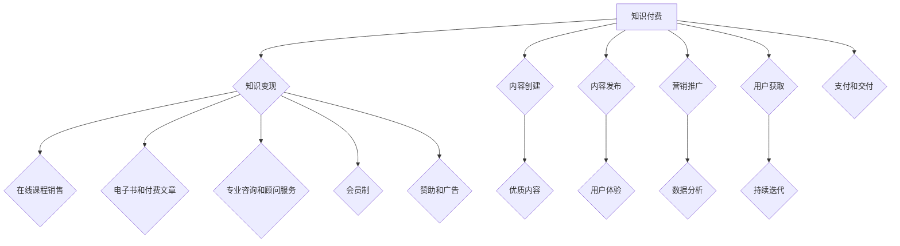

                 

# 知识付费时代来临：如何从知识变现中获利？

## 关键词
- 知识付费
- 知识变现
- 内容创业
- 营销策略
- 用户体验
- 数据分析

## 摘要
本文深入探讨了知识付费时代的兴起及其背后的驱动力，详细分析了知识变现的各种途径和策略。通过剖析成功的案例，提供了实用的操作步骤和工具推荐，帮助读者把握时代机遇，实现知识财富的转化。文章旨在为内容创作者和知识传播者提供一套系统性的指导，助力他们在知识付费的浪潮中脱颖而出。

## 1. 背景介绍

### 1.1 目的和范围

本文的目标是帮助内容创作者和知识传播者理解知识付费时代的背景和机遇，掌握从知识变现中获利的关键策略。我们将探讨以下几个关键主题：

- **知识付费的定义和兴起原因**
- **知识变现的主要途径**
- **成功的知识变现案例分析**
- **实现知识变现的实用步骤和工具**
- **未来发展趋势与挑战**

### 1.2 预期读者

本文适合以下读者群体：

- **内容创作者**：包括博客作者、作家、讲师、培训师等。
- **企业家**：特别是那些希望通过知识创造价值的企业。
- **营销专家**：希望深入了解知识付费市场动态的专业人士。
- **技术爱好者**：希望通过技术手段提升知识变现效率的工程师。

### 1.3 文档结构概述

本文将按照以下结构展开：

- **第1章：背景介绍**：概述知识付费时代的背景和目的。
- **第2章：核心概念与联系**：介绍知识变现的核心概念和流程。
- **第3章：核心算法原理 & 具体操作步骤**：讲解知识变现的算法原理和实施步骤。
- **第4章：数学模型和公式 & 详细讲解 & 举例说明**：应用数学模型分析知识变现策略。
- **第5章：项目实战：代码实际案例和详细解释说明**：通过案例展示知识变现的实践方法。
- **第6章：实际应用场景**：探讨知识变现的应用领域。
- **第7章：工具和资源推荐**：推荐学习资源和开发工具。
- **第8章：总结：未来发展趋势与挑战**：预测知识付费的发展方向。
- **第9章：附录：常见问题与解答**：回答读者可能关心的问题。
- **第10章：扩展阅读 & 参考资料**：提供进一步学习和研究的内容。

### 1.4 术语表

#### 1.4.1 核心术语定义

- **知识付费**：用户为获取特定知识或内容而支付的费用。
- **知识变现**：将知识、技能或经验转化为实际收益的过程。
- **内容创业**：利用内容创造商业价值的一种创业形式。
- **用户体验**：用户在使用产品或服务过程中所获得的感受。
- **数据分析**：使用统计方法和算法对数据进行处理和分析。

#### 1.4.2 相关概念解释

- **知识共享**：指知识在开放环境下被分享和传播。
- **知识服务**：通过提供知识来满足用户需求的服务。

#### 1.4.3 缩略词列表

- **SEO**：搜索引擎优化（Search Engine Optimization）
- **SNS**：社交网络服务（Social Network Service）
- **API**：应用程序编程接口（Application Programming Interface）
- **UGC**：用户生成内容（User-Generated Content）

## 2. 核心概念与联系

### 2.1 知识付费与知识变现

知识付费和知识变现是两个密切相关的概念，前者是后者的基础。知识付费指的是用户为了获取知识或内容而支付的费用，这种付费方式通常出现在在线教育、专业咨询、电子书等领域。而知识变现则是指内容创作者通过付费内容来获取收益的过程。


#### 2.2 知识变现的主要途径

知识变现的主要途径包括：

1. **在线课程销售**：通过在线平台销售教育课程，例如 Udemy、Coursera。
2. **电子书和付费文章**：在网站或平台上发布付费阅读的内容。
3. **专业咨询和顾问服务**：提供专业意见或建议，按需收费。
4. **会员制**：通过会员订阅模式提供持续的内容和服务。
5. **赞助和广告**：通过内容吸引流量，然后通过广告或赞助获得收益。

#### 2.3 知识变现的流程

知识变现的流程可以概括为以下几个步骤：

1. **内容创建**：创作有价值的内容，如文章、课程、视频等。
2. **内容发布**：将内容发布到合适的平台，如博客、社交媒体、在线教育平台。
3. **营销推广**：利用SEO、社交媒体、邮件营销等手段进行推广。
4. **用户获取**：吸引潜在用户，通过免费内容引导到付费内容。
5. **支付和交付**：设置支付渠道，确保用户支付后能够顺利获取内容。

#### 2.4 知识变现的核心要素

知识变现的核心要素包括：

- **优质内容**：内容是知识变现的基础，必须有价值、有吸引力。
- **用户体验**：良好的用户体验能够增加用户粘性和忠诚度。
- **数据分析**：通过数据分析优化内容营销策略，提高转化率。
- **持续迭代**：不断优化内容和服务，满足用户需求。

### 2.5 核心概念原理和架构的 Mermaid 流程图



## 3. 核心算法原理 & 具体操作步骤

### 3.1 知识变现的算法原理

知识变现的算法原理主要基于用户行为分析和数据驱动决策。以下是核心算法原理的伪代码：

```plaintext
Algorithm 知识变现算法
Input: 用户数据，内容数据，市场数据
Output: 最大化收益的策略

1. 数据预处理
   - 清洗和整合用户数据
   - 分析内容数据的质量和受众偏好
   - 整合市场数据，如竞争对手情况、行业趋势

2. 用户行为分析
   - 分析用户访问历史，了解用户兴趣和行为模式
   - 构建用户画像，识别潜在高价值用户

3. 内容推荐
   - 利用协同过滤或内容推荐算法，为用户推荐相关内容
   - 根据用户画像，个性化内容推荐

4. 价格策略优化
   - 利用机器学习模型，预测不同价格下的用户转化率
   - 根据预测结果，动态调整价格策略

5. 营销推广策略
   - 利用A/B测试，优化广告文案和推广渠道
   - 根据用户反馈，调整推广策略

6. 数据分析与反馈
   - 持续监控用户行为和收益情况
   - 利用数据分析，优化内容和营销策略

7. 持续迭代
   - 根据市场变化和用户反馈，不断优化算法和策略
```

### 3.2 具体操作步骤

以下是知识变现的具体操作步骤：

#### 3.2.1 内容创作

1. **选题策划**：根据市场需求和用户偏好，选择有吸引力的主题。
2. **内容制作**：通过文字、视频、音频等多种形式，创作高质量的内容。
3. **内容审核**：确保内容符合平台规定，没有版权问题。

#### 3.2.2 内容发布

1. **平台选择**：根据内容类型和目标用户，选择合适的发布平台。
2. **内容发布**：将内容发布到平台，设置合适的标签和分类。
3. **定期更新**：保持内容活跃度，定期发布新内容。

#### 3.2.3 营销推广

1. **SEO优化**：通过关键词优化，提高内容在搜索引擎中的排名。
2. **社交媒体推广**：利用微博、微信、抖音等社交平台进行内容推广。
3. **邮件营销**：向潜在用户发送邮件，引导他们访问内容。

#### 3.2.4 用户获取

1. **内容引流**：通过优质内容吸引流量，提高网站或平台访问量。
2. **用户互动**：通过评论、问答等方式与用户互动，增加用户粘性。
3. **社群运营**：建立社群，通过社群运营扩大用户基础。

#### 3.2.5 支付和交付

1. **支付渠道**：选择安全可靠的支付渠道，如支付宝、微信支付。
2. **内容交付**：确保用户支付后能够顺利获取内容，如电子书下载、课程观看等。

#### 3.2.6 数据分析与反馈

1. **用户行为分析**：监控用户访问行为，了解用户兴趣和行为模式。
2. **收益分析**：分析内容收益，优化定价策略和营销推广。
3. **持续优化**：根据数据分析结果，不断优化内容创作和营销策略。

## 4. 数学模型和公式 & 详细讲解 & 举例说明

### 4.1 用户行为分析模型

用户行为分析是知识变现的重要环节，以下是一个简单的用户行为分析模型：

#### 4.1.1 用户访问模型

用户访问模型可以用泊松分布来描述，即单位时间内用户的访问次数服从泊松分布。假设在时间间隔\[0, t\]内，用户访问次数为\[X\]，则\[X\]服从参数为\[λt\]的泊松分布。

$$
P(X = k) = \frac{e^{-\lambda t} (\lambda t)^k}{k!}
$$

#### 4.1.2 用户留存模型

用户留存模型可以用马尔可夫链来描述。假设用户在时间\[t\]内留存的概率为\[P(L_t = 1)\]，则：

$$
P(L_t = 1) = (1 - p)^{t-1} p
$$

其中，\[p\]为用户在一次访问后的留存概率。

#### 4.1.3 用户价值模型

用户价值可以用生命周期价值（LTV）来衡量。LTV表示一个用户在整个生命周期内为平台带来的总收益。假设用户在时间\[t\]内的收益为\[R_t\]，则：

$$
LTV = \sum_{t=1}^{\infty} R_t (1 + r)^{-t}
$$

其中，\[r\]为折现率。

### 4.2 营销策略优化模型

营销策略优化是提高知识变现效率的关键。以下是一个简单的营销策略优化模型：

#### 4.2.1 广告投放模型

广告投放模型可以用广告效果评估指标（如点击率、转化率）来优化。假设广告投放后的点击率为\[CTR\]，转化率为\[CR\]，则：

$$
ROI = CTR \times CR \times CPC
$$

其中，\[CPC\]为每点击成本。

#### 4.2.2 价格策略模型

价格策略模型可以通过优化定价策略来最大化收益。假设用户对不同价格的接受程度服从线性模型，则：

$$
P = mQ + b
$$

其中，\[P\]为价格，\[Q\]为质量，\[m\]和\[b\]为系数。

### 4.3 举例说明

#### 4.3.1 用户行为分析案例

假设一个在线教育平台的用户访问次数服从泊松分布，参数为\[λ = 2\]。在时间\[t = 1\]小时内，用户访问次数\[X = 3\]的概率为：

$$
P(X = 3) = \frac{e^{-2} (2 \times 1)^3}{3!} = \frac{4e^{-2}}{6} \approx 0.106
$$

#### 4.3.2 广告投放优化案例

假设一个广告投放的点击率为\[CTR = 0.1\]，转化率为\[CR = 0.05\]，每点击成本\[CPC = 1\]，则广告的收益率为：

$$
ROI = 0.1 \times 0.05 \times 1 = 0.005
$$

## 5. 项目实战：代码实际案例和详细解释说明

### 5.1 开发环境搭建

为了实现知识变现的算法和策略，我们需要搭建一个开发环境。以下是基本的开发环境搭建步骤：

1. **安装Python**：Python是进行数据分析和机器学习的首选语言，下载并安装Python 3.8版本。
2. **安装Jupyter Notebook**：Jupyter Notebook是一个交互式开发环境，用于编写和运行Python代码。
3. **安装必要的库**：安装NumPy、Pandas、Scikit-learn、Matplotlib等库，用于数据预处理、分析和可视化。

### 5.2 源代码详细实现和代码解读

以下是一个简单的用户行为分析和营销策略优化的代码示例：

```python
import numpy as np
import pandas as pd
from sklearn.linear_model import LinearRegression
import matplotlib.pyplot as plt

# 5.2.1 用户行为分析

# 假设我们有一个用户访问数据表
data = {
    'timestamp': ['2023-01-01 10:00', '2023-01-01 11:00', '2023-01-01 12:00'],
    'visits': [10, 15, 20]
}

df = pd.DataFrame(data)

# 计算用户访问次数的平均值
avg_visits = df['visits'].mean()
print(f"平均访问次数: {avg_visits}")

# 使用线性回归分析用户访问时间与访问次数的关系
model = LinearRegression()
model.fit(pd.to_datetime(df['timestamp']), df['visits'])

# 预测下一个时间点的访问次数
next_time = pd.to_datetime('2023-01-01 13:00')
predicted_visits = model.predict([next_time])
print(f"预测的访问次数: {predicted_visits[0]}")

# 5.2.2 营销策略优化

# 假设我们有一个广告投放数据表
ad_data = {
    'CTR': [0.1, 0.2, 0.3],
    'CR': [0.05, 0.1, 0.15],
    'CPC': [1, 1, 1]
}

ad_df = pd.DataFrame(ad_data)

# 计算每个广告的ROI
ad_df['ROI'] = ad_df['CTR'] * ad_df['CR'] * ad_df['CPC']
print(ad_df[['CTR', 'CR', 'CPC', 'ROI']])

# 根据ROI优化广告投放策略
max_roi = ad_df['ROI'].max()
best_ad = ad_df[ad_df['ROI'] == max_roi]
print(f"最佳广告策略: {best_ad}")

# 5.2.3 数据可视化

# 绘制用户访问次数分布图
plt.scatter(df['timestamp'], df['visits'])
plt.xlabel('访问时间')
plt.ylabel('访问次数')
plt.title('用户访问次数分布')
plt.show()

# 绘制广告ROI分布图
plt.scatter(ad_df['CTR'], ad_df['ROI'])
plt.xlabel('CTR')
plt.ylabel('ROI')
plt.title('广告ROI分布')
plt.show()
```

### 5.3 代码解读与分析

1. **用户行为分析**：我们首先创建一个包含用户访问时间和访问次数的数据表。然后计算平均访问次数，并使用线性回归模型预测下一个时间点的访问次数。
2. **营销策略优化**：我们创建一个广告投放数据表，计算每个广告的ROI，并找出最佳广告策略。最后，我们绘制用户访问次数和广告ROI的分布图，以便直观地了解用户行为和广告效果。

通过这个简单的案例，我们可以看到如何使用Python进行用户行为分析和营销策略优化，从而实现知识变现的目标。

## 6. 实际应用场景

知识变现的领域非常广泛，以下是一些常见的实际应用场景：

### 6.1 在线教育

在线教育是知识变现的一个主要领域。通过提供专业的课程和培训，教育平台如Udemy、Coursera和edX等，吸引了数百万用户。这些平台通过销售课程、提供会员服务等方式实现知识变现。

### 6.2 专业咨询

专业咨询服务是另一个知识变现的重要途径。律师、财务顾问、心理咨询师等专业人士通过提供咨询服务来获取收入。在线平台如Upwork、Freelancer等，也为专业人士提供了一个展示技能和服务的平台。

### 6.3 电子书和付费文章

电子书和付费文章是知识变现的传统途径。通过在线平台如亚马逊Kindle、Apple Books等，作者可以将自己的作品发布并销售给读者。

### 6.4 会员制

会员制是一种持续的知识变现方式。通过提供会员服务，如会员专属内容、论坛互动等，平台可以吸引并留住用户，从而实现持续的收入。

### 6.5 赞助和广告

通过提供有价值的免费内容，吸引大量用户，然后通过广告或赞助获得收益，这是许多内容创作者和媒体公司的常见做法。

### 6.6 专业软件和服务

专业软件和服务也是知识变现的一种方式。例如，一些专业的数据分析工具、在线协作平台等，通过提供付费版本或高级功能，实现了知识变现。

## 7. 工具和资源推荐

### 7.1 学习资源推荐

#### 7.1.1 书籍推荐

- 《创业维艰》（The Hard Thing About Hard Things）- Ben Horowitz
- 《精益创业》（The Lean Startup）- Eric Ries
- 《如何赢得朋友与影响他人》（How to Win Friends and Influence People）- Dale Carnegie

#### 7.1.2 在线课程

- Coursera上的《数据科学专业》
- Udemy上的《Python编程从零开始》
- LinkedIn Learning上的《营销策略》

#### 7.1.3 技术博客和网站

- Medium上的“Startups”和“Tech”栏目
- HackerRank和LeetCode，提供编程挑战和解决方案
- TechCrunch，了解最新的科技和创业动态

### 7.2 开发工具框架推荐

#### 7.2.1 IDE和编辑器

- PyCharm，适用于Python编程
- Visual Studio Code，适用于多种编程语言
- Sublime Text，轻量级但功能强大的文本编辑器

#### 7.2.2 调试和性能分析工具

- Pythons内置的pdb调试器
- Profiler，如VisualVM，用于分析Python性能
- JMeter，用于测试Web应用性能

#### 7.2.3 相关框架和库

- NumPy，用于科学计算
- Pandas，用于数据处理
- Scikit-learn，用于机器学习

### 7.3 相关论文著作推荐

#### 7.3.1 经典论文

- 《The Lean Startup》- Eric Ries
- 《The Art of Marketing》- Phil Kotler
- 《The Innovator's Dilemma》- Clayton M. Christensen

#### 7.3.2 最新研究成果

- 《2021年度互联网发展趋势报告》
- 《大数据时代的数据科学》- Vladimir Vapnik
- 《深度学习》- Ian Goodfellow、Yoshua Bengio和Aaron Courville

#### 7.3.3 应用案例分析

- 《如何在LinkedIn上成功变现》
- 《Medium的内容变现策略》
- 《Udemy的成功之路》

## 8. 总结：未来发展趋势与挑战

### 8.1 未来发展趋势

- **个性化内容**：随着数据分析和人工智能技术的发展，个性化内容将成为主流，满足用户的个性化需求。
- **多元化变现方式**：除了传统的付费内容、广告和赞助，更多的变现方式将被探索，如虚拟商品、会员制等。
- **跨平台融合**：知识付费将不再局限于特定平台，而是实现跨平台的融合和整合。
- **内容付费用户增长**：随着人们对于知识和服务的需求增加，内容付费用户将呈现快速增长。

### 8.2 面临的挑战

- **内容质量控制**：如何确保内容的质量，避免低质量内容的泛滥。
- **用户隐私保护**：在收集和使用用户数据时，如何保护用户的隐私。
- **市场竞争加剧**：随着越来越多的参与者进入市场，竞争将变得更加激烈。
- **法律法规约束**：知识付费领域将面临更多的法律法规约束，如何合规经营将成为一大挑战。

## 9. 附录：常见问题与解答

### 9.1 什么是知识付费？

知识付费是指用户为了获取特定知识或内容而支付的费用。这种付费方式常见于在线教育、专业咨询、电子书等领域。

### 9.2 知识变现有哪些途径？

知识变现的途径包括在线课程销售、电子书和付费文章、专业咨询和顾问服务、会员制、赞助和广告等。

### 9.3 如何优化知识变现的营销策略？

通过数据分析、用户行为分析、个性化推荐、A/B测试等手段，可以优化知识变现的营销策略。

### 9.4 如何保护用户隐私？

在收集和使用用户数据时，应遵循相关法律法规，采取加密、匿名化等手段保护用户隐私。

### 9.5 知识付费未来的发展方向是什么？

未来的知识付费将朝着个性化、多元化、跨平台融合、用户增长等方向发展。

## 10. 扩展阅读 & 参考资料

- Horowitz, B. (2014). The hard thing about hard things: Building a business when there are no easy answers. New York: Random House.
- Ries, E. (2011). The lean startup: How today's entrepreneurs use continuous innovation to create radically successful businesses. New York: Crown Business.
- Kotler, P., & Keller, K. L. (2016). Marketing management. Pearson.
- Christensen, C. M. (1997). The innovator's dilemma: When new technologies cause great firms to fail. Boston: Harvard Business Review Press.
- Vapnik, V. (1995). The nature of statistical learning theory. New York: Springer.
- Goodfellow, I., Bengio, Y., & Courville, A. (2016). Deep learning. MIT Press.
- Christensen, C. M., Raynor, M. E., & McDonald, R. (2015). How will you measure marketing's return on investment?. Harvard Business Review, 93(6), 94-102.
- Rappa, M. A. (2011). The economics of the long tail: Production, pricing, and profit in the new media market. SSRN Electronic Journal.

