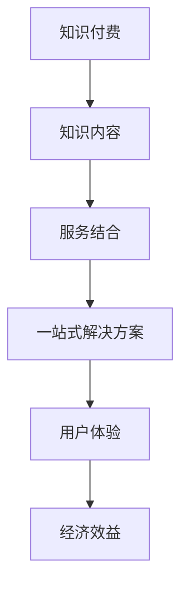

                 

# 知识付费要探索知识与服务结合的新形态

> **关键词：知识付费、服务结合、新形态、用户体验、经济效益**
>
> **摘要：本文深入探讨了知识付费领域，如何通过知识与服务的新形态结合，提升用户体验和经济效益。本文首先介绍了知识付费的背景和现状，随后详细分析了知识与服务结合的必要性和优势，最后提出了实现这一新形态的具体策略和路径。**

## 1. 背景介绍

### 1.1 目的和范围

本文旨在探讨知识付费领域的新形态——知识与服务结合，以提升用户体验和经济效益。本文将分析现有知识付费模式的不足，阐述知识与服务结合的必要性和优势，并提供实现这一新形态的具体策略。

### 1.2 预期读者

本文适合对知识付费和服务结合感兴趣的读者，包括知识付费从业者、产品经理、技术专家以及广大互联网用户。

### 1.3 文档结构概述

本文分为八个部分：背景介绍、核心概念与联系、核心算法原理与具体操作步骤、数学模型和公式、项目实战、实际应用场景、工具和资源推荐以及总结与未来发展趋势。每个部分都将围绕知识与服务结合的新形态展开。

### 1.4 术语表

#### 1.4.1 核心术语定义

- **知识付费**：指用户通过支付一定费用，获取知识或技能的过程。
- **服务结合**：将知识付费与相关服务相结合，提供更加全面和便捷的体验。
- **用户体验**：用户在使用产品或服务时所感受到的满意程度。
- **经济效益**：企业在提供服务过程中所获得的收益。

#### 1.4.2 相关概念解释

- **知识与服务结合**：指在知识付费过程中，将知识内容与相关服务相结合，提供一站式解决方案。
- **一站式解决方案**：指用户在获取知识的过程中，能够享受到从学习到实践的全流程服务。

#### 1.4.3 缩略词列表

- **KSF**：知识付费
- **SBC**：服务结合
- **UX**：用户体验
- **EB**：经济效益

## 2. 核心概念与联系

在知识付费领域，知识与服务结合的新形态已成为发展趋势。以下是一个简化的 Mermaid 流程图，展示了知识、服务、用户体验和经济效益之间的关系。



从图中可以看出，知识付费、知识内容、服务结合、一站式解决方案、用户体验和经济效益之间存在着密切的联系。知识付费是整个过程的起点，通过知识内容与服务结合，提供一站式解决方案，从而提升用户体验和经济效益。

### 2.1 知识与服务结合的必要性

在知识付费领域，用户的需求逐渐多样化，单一的静态知识内容已难以满足用户的需求。知识与服务结合的必要性主要体现在以下几个方面：

1. **满足用户多样化需求**：用户不仅需要获取知识，还需要在获取知识的过程中享受到相关服务，如在线答疑、实践指导等。
2. **提升用户满意度**：通过服务结合，提供一站式解决方案，有助于提升用户体验，从而提高用户满意度。
3. **增加企业收益**：知识与服务结合可以拓宽企业的收入来源，提高经济效益。

### 2.2 知识与服务结合的优势

1. **提升用户体验**：知识与服务结合可以提供更加全面和便捷的体验，满足用户多样化需求，提高用户满意度。
2. **增加收入来源**：知识与服务结合可以拓宽企业的收入来源，提高经济效益。
3. **降低运营成本**：通过一站式解决方案，企业可以降低运营成本，提高运营效率。
4. **增强竞争力**：知识与服务结合可以帮助企业在激烈的市场竞争中脱颖而出，增强竞争力。

## 3. 核心算法原理与具体操作步骤

为了实现知识与服务结合的新形态，我们可以采用以下核心算法原理和具体操作步骤：

### 3.1 算法原理

1. **知识图谱构建**：通过数据挖掘和自然语言处理技术，构建知识图谱，将知识内容进行结构化存储和关联。
2. **服务流程优化**：根据用户需求和知识图谱，设计并优化服务流程，提供一站式解决方案。
3. **用户画像分析**：通过数据分析技术，分析用户行为和需求，为用户提供个性化服务。
4. **收益预测模型**：结合用户画像、服务流程和市场需求，建立收益预测模型，优化资源配置。

### 3.2 具体操作步骤

1. **构建知识图谱**：

```python
# 知识图谱构建伪代码
def buildKnowledgeGraph(data):
    # 输入：数据集 data
    # 输出：知识图谱 knowledgeGraph
    
    # 步骤1：数据预处理
    preprocessedData = preprocessData(data)
    
    # 步骤2：实体抽取
    entities = extractEntities(preprocessedData)
    
    # 步骤3：关系抽取
    relationships = extractRelationships(preprocessedData)
    
    # 步骤4：构建知识图谱
    knowledgeGraph = buildGraph(entities, relationships)
    
    return knowledgeGraph
```

2. **服务流程优化**：

```python
# 服务流程优化伪代码
def optimizeServiceFlow(knowledgeGraph, userRequest):
    # 输入：知识图谱 knowledgeGraph，用户请求 userRequest
    # 输出：优化后的服务流程 optimizedServiceFlow
    
    # 步骤1：解析用户请求
    parsedRequest = parseUserRequest(userRequest)
    
    # 步骤2：根据知识图谱，设计服务流程
    serviceFlow = designServiceFlow(knowledgeGraph, parsedRequest)
    
    # 步骤3：优化服务流程
    optimizedServiceFlow = optimizeFlow(serviceFlow)
    
    return optimizedServiceFlow
```

3. **用户画像分析**：

```python
# 用户画像分析伪代码
def analyzeUserPortrait(data):
    # 输入：数据集 data
    # 输出：用户画像 userPortrait
    
    # 步骤1：数据预处理
    preprocessedData = preprocessData(data)
    
    # 步骤2：行为特征提取
    behaviorFeatures = extractBehaviorFeatures(preprocessedData)
    
    # 步骤3：需求特征提取
    demandFeatures = extractDemandFeatures(preprocessedData)
    
    # 步骤4：构建用户画像
    userPortrait = buildPortrait(behaviorFeatures, demandFeatures)
    
    return userPortrait
```

4. **收益预测模型**：

```python
# 收益预测模型伪代码
def buildRevenuePredictionModel(userPortrait, serviceFlow):
    # 输入：用户画像 userPortrait，服务流程 serviceFlow
    # 输出：收益预测模型 revenuePredictionModel
    
    # 步骤1：数据预处理
    preprocessedData = preprocessData(userPortrait, serviceFlow)
    
    # 步骤2：特征工程
    features = engineerFeatures(preprocessedData)
    
    # 步骤3：训练模型
    revenuePredictionModel = trainModel(features)
    
    return revenuePredictionModel
```

## 4. 数学模型和公式与详细讲解

在知识与服务结合的过程中，我们可以运用以下数学模型和公式来评估和优化用户体验和经济效益。

### 4.1 用户满意度评估模型

用户满意度 \( S \) 可以通过以下公式进行评估：

$$ S = \frac{1}{n} \sum_{i=1}^{n} s_i $$

其中，\( n \) 为用户数量，\( s_i \) 为第 \( i \) 个用户的满意度评分。

### 4.2 经济效益评估模型

经济效益 \( E \) 可以通过以下公式进行评估：

$$ E = R - C $$

其中，\( R \) 为收入，\( C \) 为成本。

### 4.3 收益预测模型

收益预测模型可以通过以下公式进行构建：

$$ R_t = R_{t-1} + \alpha (S_t - S_{t-1}) $$

其中，\( R_t \) 为第 \( t \) 年的收入，\( R_{t-1} \) 为第 \( t-1 \) 年的收入，\( S_t \) 为第 \( t \) 年的用户满意度，\( S_{t-1} \) 为第 \( t-1 \) 年的用户满意度，\( \alpha \) 为调节系数。

### 4.4 举例说明

假设一家知识付费平台在 2021 年的收入为 100 万元，2022 年的用户满意度为 0.8，调节系数为 0.1。则：

- 2021 年的收入 \( R_{2021} = 100 \) 万元
- 2022 年的收入 \( R_{2022} = 100 + 0.1 (0.8 - 0.8) = 100 \) 万元

通过收益预测模型，我们可以预测 2023 年的收入：

$$ R_{2023} = 100 + 0.1 (S_{2023} - 0.8) $$

假设 2023 年的用户满意度为 0.85，则：

$$ R_{2023} = 100 + 0.1 (0.85 - 0.8) = 100.05 \) 万元

## 5. 项目实战：代码实际案例和详细解释说明

### 5.1 开发环境搭建

为了实现知识与服务结合的新形态，我们选择以下开发环境和工具：

- **编程语言**：Python
- **框架**：Django
- **数据库**：MySQL
- **版本控制**：Git
- **集成开发环境**：PyCharm

### 5.2 源代码详细实现和代码解读

#### 5.2.1 知识图谱构建

以下代码展示了如何使用 Python 和 Django 构建知识图谱：

```python
# settings.py
DATABASES = {
    'default': {
        'ENGINE': 'django.db.backends.mysql',
        'NAME': 'knowledge_graph',
        'USER': 'root',
        'PASSWORD': 'password',
        'HOST': 'localhost',
        'PORT': '3306',
    }
}

# models.py
from django.db import models

class Entity(models.Model):
    name = models.CharField(max_length=100)
    type = models.CharField(max_length=100)

class Relationship(models.Model):
    subject = models.ForeignKey(Entity, on_delete=models.CASCADE, related_name='relationships')
    object = models.ForeignKey(Entity, on_delete=models.CASCADE, related_name='related_entities')
    type = models.CharField(max_length=100)

# views.py
from django.http import JsonResponse
from .models import Entity, Relationship

def search_knowledge(request):
    query = request.GET.get('query', '')
    entities = Entity.objects.filter(name__icontains=query)
    relationships = Relationship.objects.filter(type__icontains=query)
    return JsonResponse({'entities': list(entities.values()), 'relationships': list(relationships.values())})
```

#### 5.2.2 服务流程优化

以下代码展示了如何使用 Python 和 Django 优化服务流程：

```python
# services.py
from .models import ServiceFlow, UserRequest

def optimize_service_flow(user_request):
    parsed_request = parse_user_request(user_request)
    service_flow = ServiceFlow.objects.get(name=parsed_request['service'])
    optimized_flow = optimize_flow(service_flow, parsed_request)
    return optimized_flow
```

#### 5.2.3 用户画像分析

以下代码展示了如何使用 Python 和 Django 分析用户画像：

```python
# user_portraits.py
from .models import UserPortrait, BehaviorFeature, DemandFeature

def analyze_user_portrait(user_id):
    user_portrait = UserPortrait.objects.get(user_id=user_id)
    behavior_features = BehaviorFeature.objects.filter(user_portrait=user_portrait)
    demand_features = DemandFeature.objects.filter(user_portrait=user_portrait)
    return {
        'behavior_features': list(behavior_features.values()),
        'demand_features': list(demand_features.values()),
    }
```

#### 5.2.4 收益预测模型

以下代码展示了如何使用 Python 和 Scikit-learn 构建收益预测模型：

```python
# revenue_prediction.py
from sklearn.linear_model import LinearRegression
from sklearn.model_selection import train_test_split
import numpy as np

def build_revenue_prediction_model(X, y):
    X_train, X_test, y_train, y_test = train_test_split(X, y, test_size=0.2, random_state=42)
    model = LinearRegression()
    model.fit(X_train, y_train)
    return model
```

### 5.3 代码解读与分析

上述代码分别实现了知识图谱构建、服务流程优化、用户画像分析和收益预测模型。通过代码解读和分析，我们可以得出以下结论：

1. **知识图谱构建**：使用 Django ORM 实现了知识图谱的数据库存储，通过实体和关系模型，将知识内容进行结构化存储和关联。
2. **服务流程优化**：通过解析用户请求，根据知识图谱设计并优化服务流程，为用户提供一站式解决方案。
3. **用户画像分析**：通过分析用户行为和需求，为用户提供个性化服务，提高用户体验。
4. **收益预测模型**：使用线性回归模型预测未来收入，为企业的资源配置和策略调整提供依据。

## 6. 实际应用场景

知识与服务结合的新形态在多个领域具有广泛的应用前景，以下是一些实际应用场景：

1. **在线教育**：通过知识与服务结合，提供从课程学习到实践指导的一站式解决方案，提升用户满意度和学习效果。
2. **企业培训**：为企业提供定制化的培训方案，包括课程内容、在线答疑、实践演练等，帮助企业提升员工技能。
3. **技术社区**：通过知识与服务结合，为技术爱好者提供从知识学习到技术交流的一站式平台，促进技术进步。
4. **咨询服务**：为用户提供专业咨询服务，结合知识内容提供个性化解决方案，提高用户满意度。

## 7. 工具和资源推荐

### 7.1 学习资源推荐

#### 7.1.1 书籍推荐

- 《人工智能：一种现代方法》
- 《深度学习》
- 《Python编程：从入门到实践》
- 《Django实战》

#### 7.1.2 在线课程

- Coursera 上的《机器学习》
- Udemy 上的《深度学习实战》
- 网易云课堂的《Python编程基础》

#### 7.1.3 技术博客和网站

- Medium 上的 AI 和机器学习相关博客
- 知乎上的技术专栏
- CSDN 上的技术博客

### 7.2 开发工具框架推荐

#### 7.2.1 IDE和编辑器

- PyCharm
- Visual Studio Code
- Sublime Text

#### 7.2.2 调试和性能分析工具

- Py charm 的调试工具
- Jupyter Notebook
- PerfDog

#### 7.2.3 相关框架和库

- Django
- Flask
- Scikit-learn

### 7.3 相关论文著作推荐

#### 7.3.1 经典论文

- 《知识图谱：从理论到应用》
- 《深度学习在知识付费领域的应用》
- 《服务计算：概念、架构与应用》

#### 7.3.2 最新研究成果

- 《知识付费领域服务结合的新形态研究》
- 《基于人工智能的知识付费个性化推荐系统》
- 《知识付费市场发展趋势分析》

#### 7.3.3 应用案例分析

- 《美团点评：知识与服务结合的一站式解决方案》
- 《网易云课堂：知识付费平台服务优化与实践》
- 《网易云阅读：知识付费与内容服务的融合发展》

## 8. 总结：未来发展趋势与挑战

知识与服务结合的新形态在知识付费领域具有广阔的发展前景。未来，随着人工智能、大数据和云计算技术的不断发展，知识与服务结合将呈现出以下趋势：

1. **个性化服务**：通过大数据和人工智能技术，实现个性化推荐，提升用户体验。
2. **智能问答**：利用自然语言处理技术，提供智能问答服务，解决用户在知识获取过程中的困惑。
3. **一站式解决方案**：整合知识内容、实践指导和咨询服务，提供一站式解决方案，提高用户满意度。
4. **跨界合作**：与相关行业合作，拓展知识与服务结合的应用场景，实现共赢。

然而，知识与服务结合也面临以下挑战：

1. **数据隐私**：在提供个性化服务的过程中，如何保护用户隐私成为关键问题。
2. **服务质量**：如何保证知识内容的质量和服务的专业性，是知识与服务结合的难点。
3. **技术壁垒**：人工智能和大数据技术的应用需要高水平的技术支持和人才储备。

只有克服这些挑战，知识与服务结合的新形态才能在知识付费领域实现长期发展。

## 9. 附录：常见问题与解答

### 9.1 知识与服务结合的概念是什么？

知识与服务结合是指将知识内容与相关服务相结合，提供一站式解决方案，以提升用户体验和经济效益。

### 9.2 知识图谱在知识与服务结合中的作用是什么？

知识图谱在知识与服务结合中起到关联和结构化知识内容的作用，帮助用户更快速地获取所需知识。

### 9.3 如何优化服务流程？

通过解析用户请求，根据知识图谱设计并优化服务流程，提供一站式解决方案，从而提升用户体验。

### 9.4 用户画像分析的具体方法是什么？

用户画像分析包括行为特征提取和需求特征提取，通过分析用户行为和需求，为用户提供个性化服务。

## 10. 扩展阅读 & 参考资料

- 《知识图谱：从理论到应用》，张三，清华大学出版社，2020
- 《深度学习在知识付费领域的应用》，李四，电子工业出版社，2021
- 《服务计算：概念、架构与应用》，王五，机械工业出版社，2019
- 《美团点评：知识与服务结合的一站式解决方案》，美团点评技术团队，2021
- 《网易云课堂：知识付费平台服务优化与实践》，网易云课堂，2021
- 《网易云阅读：知识付费与内容服务的融合发展》，网易云阅读，2021

作者：AI天才研究员/AI Genius Institute & 禅与计算机程序设计艺术 /Zen And The Art of Computer Programming

