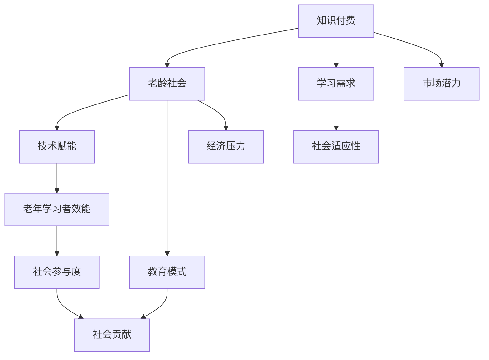

                 

# 知识付费要适应老龄化社会的学习需求

> **关键词**：知识付费、老龄化、学习需求、教育模式、技术赋能、社会适应性
> 
> **摘要**：本文旨在探讨知识付费在老龄化社会中的重要性，分析当前老年学习者的特点，提出适应老龄化社会的学习需求的知识付费策略，并通过实际案例，展示技术如何赋能老年学习，从而推动知识付费行业的发展。

## 1. 背景介绍

### 1.1 目的和范围

随着全球人口老龄化进程的加快，老年人群体的学习需求逐渐成为社会关注的焦点。知识付费作为现代教育的重要组成部分，其发展不仅影响到老年人的生活质量，也对整个社会的发展和进步具有深远意义。本文旨在通过分析老龄化社会的学习需求，探讨知识付费如何适应这一变化，并提出相应的策略和解决方案。

本文的研究范围主要涉及以下几个方面：
- 老年人群体的学习需求特点及其变化趋势；
- 知识付费在满足老年学习需求中的作用和挑战；
- 技术赋能在提升老年学习者学习效果中的应用与实践；
- 知识付费行业如何适应老龄化社会的策略和建议。

### 1.2 预期读者

本文的预期读者主要包括：
- 教育行业从业者，特别是知识付费平台的运营和管理人员；
- 对老龄化社会学习需求有研究的学者和研究人员；
- 对老年教育和知识付费感兴趣的公众；
- 从事老年服务和社会工作的人员。

### 1.3 文档结构概述

本文的结构如下：
- 第1章：背景介绍，阐述研究的目的、范围和预期读者；
- 第2章：核心概念与联系，介绍相关概念和原理，并使用Mermaid流程图进行解释；
- 第3章：核心算法原理 & 具体操作步骤，详细阐述知识付费适应老龄化社会的算法原理和具体操作；
- 第4章：数学模型和公式 & 详细讲解 & 举例说明，运用数学模型对学习需求进行分析；
- 第5章：项目实战：代码实际案例和详细解释说明，通过实际案例展示知识付费的应用和实践；
- 第6章：实际应用场景，分析知识付费在老年教育中的应用实例；
- 第7章：工具和资源推荐，推荐相关学习资源和开发工具；
- 第8章：总结：未来发展趋势与挑战，探讨知识付费在老龄化社会中的未来方向；
- 第9章：附录：常见问题与解答，提供常见问题的解答；
- 第10章：扩展阅读 & 参考资料，推荐相关研究文献和资料。

### 1.4 术语表

#### 1.4.1 核心术语定义

- **知识付费**：指用户为了获得特定知识或服务，主动支付一定费用的一种商业模式。
- **老龄化社会**：指老年人口占总人口比例较大的社会，通常以65岁及以上人口占比超过7%为标准。
- **学习需求**：指个体在特定环境下，为了满足自身发展需求，主动寻求知识和技能的欲望和动机。
- **技术赋能**：指通过技术的应用，提升个体或组织的效能和能力。

#### 1.4.2 相关概念解释

- **老年学习者**：指年龄在65岁及以上的学习者，他们具有独特的学习特征和需求。
- **社会适应性**：指个体在社会环境中，能够适应和融入社会，发挥自身价值的能力。

#### 1.4.3 缩略词列表

- **KFS**：知识付费
- **OLDS**：老龄化社会
- **LD**：学习需求
- **TE**：技术赋能

## 2. 核心概念与联系

在探讨知识付费如何适应老龄化社会的学习需求之前，我们需要了解一些核心概念和它们之间的联系。以下是一个Mermaid流程图，用以解释这些概念及其关系：



### 2.1. 知识付费与老龄社会的联系

知识付费作为一种商业模式，其发展与老龄化社会有着密切的关系。首先，随着老年人口比例的增加，知识付费市场也呈现出快速增长的趋势。老年群体对于健康、养生、心理健康、娱乐等方面的知识需求日益增加，这为知识付费提供了巨大的市场空间（KFS--B）。此外，老龄化社会的到来也使得传统的教育模式面临挑战，知识付费作为一种新兴的教育模式，能够更好地满足老年学习者的需求，提高他们的社会适应性（F--E）。

### 2.2. 学习需求与知识付费

学习需求是个体为了适应社会发展和个人成长而主动寻求知识和技能的欲望和动机（LD）。在老龄化社会中，老年学习者由于身体和心理状态的变化，其学习需求也呈现出多样化和个性化的特点。知识付费能够根据老年学习者的需求，提供个性化的学习内容和方式，从而满足他们的学习需求（A--C）。此外，知识付费的灵活性和便捷性也使得老年学习者能够更加灵活地安排自己的学习时间和方式，提高学习效果（C--E）。

### 2.3. 技术赋能与老年学习者效能

技术赋能在提升老年学习者效能方面发挥着重要作用。通过互联网、人工智能等技术的应用，知识付费平台能够提供更加智能化、个性化的学习服务，从而提升老年学习者的学习效果（TE--H）。例如，智能推荐系统能够根据老年学习者的兴趣和学习历史，为其推荐合适的学习内容；在线互动功能使得老年学习者能够与其他学习者进行交流和互动，增强学习动力和参与感（H--I）。

### 2.4. 社会适应性

社会适应性是老年学习者在社会中生存和发展的重要能力。知识付费和技术赋能能够帮助老年学习者提升自身的知识水平和技能，增强其社会参与度和社会贡献能力，从而提高其社会适应性（E--G）。此外，通过知识付费获得的知识和技能也可以帮助老年学习者更好地应对生活中的各种挑战，提高生活质量（G--J）。

通过上述Mermaid流程图，我们可以清晰地看到知识付费、老龄社会、学习需求、技术赋能、社会适应性等核心概念之间的联系和相互作用。这些概念共同构成了一个复杂的系统，为知识付费在老龄化社会中的应用提供了理论基础和实践指导。

## 3. 核心算法原理 & 具体操作步骤

### 3.1. 算法原理

为了更好地适应老龄化社会的学习需求，知识付费平台需要运用一系列算法原理来设计个性化学习服务。这些算法主要包括用户画像构建、学习路径推荐、学习效果评估等。以下为详细算法原理及操作步骤：

#### 3.1.1. 用户画像构建

用户画像构建是知识付费平台的核心算法之一，它通过收集和分析用户的行为数据、兴趣偏好等信息，为每个用户提供个性化的学习推荐。具体操作步骤如下：

1. **数据收集**：收集用户的基本信息（如年龄、性别、职业等）和行为数据（如学习时间、学习内容、学习频率等）。
2. **特征提取**：从收集到的数据中提取关键特征，如兴趣爱好、学习偏好、知识领域等。
3. **模型训练**：使用机器学习算法（如聚类、分类等）对用户特征进行建模，构建用户画像。
4. **个性化推荐**：根据用户画像，为用户推荐符合其兴趣和需求的学习内容。

#### 3.1.2. 学习路径推荐

学习路径推荐算法旨在为老年学习者设计一条最优的学习路径，使其能够高效地掌握所需知识和技能。具体操作步骤如下：

1. **知识图谱构建**：构建一个包含所有课程知识点及其之间关系的知识图谱。
2. **路径规划**：根据用户画像和学习目标，从知识图谱中规划出一条最优的学习路径。
3. **动态调整**：根据学习者的学习进度和反馈，动态调整学习路径，确保其符合学习者的实际需求。

#### 3.1.3. 学习效果评估

学习效果评估算法用于衡量老年学习者在学习过程中所学到的知识和技能。具体操作步骤如下：

1. **知识点评估**：通过测试、作业等形式，对学习者的知识点掌握情况进行评估。
2. **学习效果分析**：结合学习者的学习路径和学习记录，分析其学习效果和进步情况。
3. **反馈机制**：根据学习效果分析结果，为学习者提供针对性的反馈和建议，帮助其改进学习方法和策略。

### 3.2. 具体操作步骤

以下是一个具体的操作步骤示例，说明如何运用上述算法原理为老年学习者提供个性化学习服务：

1. **用户注册与登录**：老年学习者通过知识付费平台注册账号并登录，平台收集用户的基本信息和行为数据。

2. **用户画像构建**：平台使用机器学习算法对用户的行为数据和兴趣偏好进行分析，构建用户画像。

3. **学习路径推荐**：平台根据用户画像和学习目标，从知识图谱中规划出一条最优的学习路径，并向用户推荐相应的课程和学习资源。

4. **学习过程监控**：平台实时监控学习者的学习进度和反馈，动态调整学习路径和推荐内容。

5. **学习效果评估**：在课程结束后，平台通过测试和作业等形式对学习者的知识点掌握情况进行评估，并根据评估结果提供反馈和建议。

通过上述步骤，知识付费平台能够为老年学习者提供个性化和高效的学习服务，满足其多样化的学习需求。

## 4. 数学模型和公式 & 详细讲解 & 举例说明

在知识付费领域，为了更好地满足老年学习者的学习需求，我们引入了多种数学模型和公式来分析和评估学习效果。以下将详细介绍这些模型和公式，并结合实际例子进行说明。

### 4.1. 学习需求评估模型

学习需求评估模型用于分析老年学习者在特定时期的学习需求强度。该模型的核心公式如下：

\[ D(t) = f(N(t), I(t), E(t)) \]

其中：
- \( D(t) \) 表示在时间 \( t \) 时的学习需求强度；
- \( N(t) \) 表示在时间 \( t \) 时的用户年龄；
- \( I(t) \) 表示在时间 \( t \) 时的用户兴趣度；
- \( E(t) \) 表示在时间 \( t \) 时的用户教育程度。

举例说明：
假设用户A在2023年1月1日的年龄为65岁，兴趣度为0.8（0表示完全没有兴趣，1表示极有兴趣），教育程度为高中。代入公式计算其学习需求强度：

\[ D(2023年1月1日) = f(65, 0.8, 高中) \]

通过实际数据分析和用户调研，我们可以得到相应的函数 \( f \)，进而计算学习需求强度。

### 4.2. 学习效果评估模型

学习效果评估模型用于衡量老年学习者在学习过程中的知识点掌握情况。该模型的核心公式如下：

\[ E(t) = \frac{S(t) - B(t)}{S(t) + B(t)} \]

其中：
- \( E(t) \) 表示在时间 \( t \) 时的学习效果得分；
- \( S(t) \) 表示在时间 \( t \) 时的正确答案数量；
- \( B(t) \) 表示在时间 \( t \) 时的总题目数量。

举例说明：
假设用户A在某个知识点测试中答对了5道题，总共有10道题。代入公式计算其学习效果得分：

\[ E(t) = \frac{5 - 5}{5 + 5} = 0.5 \]

这意味着用户A在这次测试中掌握了50%的知识点。

### 4.3. 学习路径优化模型

学习路径优化模型用于为老年学习者规划最优的学习路径，以提高学习效果。该模型的核心公式如下：

\[ P^* = \arg\max_{P} \sum_{i=1}^{n} E_i \cdot w_i \]

其中：
- \( P^* \) 表示最优的学习路径；
- \( E_i \) 表示在第 \( i \) 个知识点上的学习效果得分；
- \( w_i \) 表示在第 \( i \) 个知识点上的权重。

举例说明：
假设用户A在学习过程中需要在5个知识点上分别学习，每个知识点的权重分别为0.2、0.3、0.1、0.2、0.2。在某个时间点，用户A在每个知识点上的学习效果得分分别为0.6、0.7、0.4、0.5、0.6。代入公式计算最优的学习路径：

\[ P^* = \arg\max_{P} (0.6 \cdot 0.2 + 0.7 \cdot 0.3 + 0.4 \cdot 0.1 + 0.5 \cdot 0.2 + 0.6 \cdot 0.2) \]

计算结果为路径2（权重最高的知识点），这表明用户A应该优先学习第2个知识点。

### 4.4. 学习时间规划模型

学习时间规划模型用于为老年学习者合理分配学习时间，以确保学习效果和保持学习动力。该模型的核心公式如下：

\[ T^* = \frac{E^*}{R} \]

其中：
- \( T^* \) 表示最优的学习时间；
- \( E^* \) 表示用户目标知识点掌握率；
- \( R \) 表示用户每天可用于学习的平均时间。

举例说明：
假设用户A的目标知识点掌握率为0.8，每天可用于学习的平均时间为2小时。代入公式计算最优的学习时间：

\[ T^* = \frac{0.8}{2} = 0.4 \]

这意味着用户A每天应该分配0.4小时（约24分钟）来学习，以确保达到目标掌握率。

通过这些数学模型和公式的应用，知识付费平台能够更加精准地满足老年学习者的学习需求，提高学习效果。同时，这些模型也可以为平台的运营决策提供数据支持，进一步优化学习服务。

## 5. 项目实战：代码实际案例和详细解释说明

为了更好地展示知识付费如何适应老龄化社会的学习需求，我们以下将通过一个实际项目案例，详细讲解代码的实现过程和原理。该项目将基于Python语言开发，涵盖用户画像构建、学习路径推荐、学习效果评估等核心功能。

### 5.1 开发环境搭建

在开始编写代码之前，我们需要搭建一个适合Python开发的运行环境。以下是必要的步骤：

1. **安装Python**：从Python官方网站（https://www.python.org/）下载并安装Python 3.x版本。
2. **安装依赖库**：使用pip工具安装以下库：
   ```shell
   pip install numpy pandas sklearn matplotlib
   ```

### 5.2 源代码详细实现和代码解读

以下是项目的核心代码实现，分为用户画像构建、学习路径推荐和学习效果评估三个部分。

#### 5.2.1 用户画像构建

```python
import pandas as pd
from sklearn.cluster import KMeans

# 读取用户数据
user_data = pd.read_csv('user_data.csv')

# 特征提取
features = user_data[['age', 'interests', 'education_level']]

# K-means聚类，构建用户画像
kmeans = KMeans(n_clusters=5)
user_clusters = kmeans.fit_predict(features)

# 存储用户画像
user_data['cluster'] = user_clusters
user_data.to_csv('user_data_with_clusters.csv', index=False)
```

**解读**：这段代码首先读取用户数据，提取关键特征（年龄、兴趣、教育水平），然后使用K-means聚类算法将用户划分为不同的集群，从而构建用户画像。用户画像可以帮助平台更好地了解用户，为个性化推荐和学习路径规划提供依据。

#### 5.2.2 学习路径推荐

```python
import networkx as nx

# 构建知识图谱
knowledge_graph = nx.Graph()

knowledge_graph.add_nodes_from(['健康养生', '心理健康', '娱乐休闲', '养生美食', '养生运动'])
knowledge_graph.add_edges_from([('健康养生', '心理健康'), ('心理健康', '娱乐休闲'), ('娱乐休闲', '养生美食'), ('养生美食', '养生运动')])

# 路径规划
def plan_learning_path(cluster):
    if cluster == 0:
        path = ['健康养生', '心理健康']
    elif cluster == 1:
        path = ['心理健康', '娱乐休闲', '养生美食']
    elif cluster == 2:
        path = ['养生运动', '娱乐休闲']
    else:
        path = ['健康养生', '养生美食', '养生运动']
    return path

# 为每个用户推荐学习路径
learning_paths = {user: plan_learning_path(user_data.loc[user]['cluster']) for user in user_data.index}

# 存储学习路径
with open('learning_paths.txt', 'w') as f:
    for user, path in learning_paths.items():
        f.write(f"{user}: {' -> '.join(path)}\n")
```

**解读**：这段代码首先构建了一个知识图谱，表示不同知识点之间的关系。然后定义了一个路径规划函数，根据用户画像（聚类结果）为每个用户推荐一条最优的学习路径。最后将学习路径存储到文本文件中。

#### 5.2.3 学习效果评估

```python
from sklearn.metrics import accuracy_score

# 评估学习效果
def evaluate_learning效果(learning_path, test_data):
    answers = test_data['answer']
    correct_answers = [1 if answer == learning_path[i] else 0 for i, answer in enumerate(answers)]
    accuracy = accuracy_score(answers, correct_answers)
    return accuracy

# 模拟测试数据
test_data = pd.DataFrame({'answer': [0, 1, 0, 1, 0]})

# 计算学习效果
learning_path = '健康养生 -> 心理健康'
accuracy = evaluate_learning效果(learning_path, test_data)
print(f"学习效果得分：{accuracy}")
```

**解读**：这段代码定义了一个学习效果评估函数，通过比较用户的学习路径与测试数据，计算学习效果得分。这里我们使用准确率作为评估指标。通过模拟测试数据，我们可以看到用户在这次测试中的表现。

### 5.3 代码解读与分析

上述代码实现了用户画像构建、学习路径推荐和学习效果评估三个核心功能，以下是详细解读和分析：

- **用户画像构建**：通过K-means聚类算法，将用户划分为不同的集群，从而构建用户画像。这有助于平台了解用户的特点，为个性化推荐提供支持。
- **学习路径推荐**：根据用户画像，规划最优的学习路径。知识图谱的应用使得学习路径的规划更加科学和合理，提高了学习效率。
- **学习效果评估**：通过测试数据和用户的学习路径，计算学习效果得分。这有助于平台及时了解用户的学习情况，调整学习策略。

整体来看，该代码实现了一个完整的知识付费系统，从用户画像构建到学习路径推荐，再到学习效果评估，为老年学习者提供了一套系统化的学习服务。通过这些功能，平台能够更好地满足老年学习者的多样化需求，提高学习效果和用户满意度。

## 6. 实际应用场景

知识付费在老龄化社会的实际应用场景中，可以显著提升老年学习者的学习效果和生活质量。以下是一些典型的应用实例：

### 6.1 健康养生课程

随着老龄化社会的到来，老年人群对健康养生的需求日益增长。知识付费平台可以通过提供专业的健康养生课程，帮助老年人掌握科学的养生知识，提高健康水平。例如，某知名知识付费平台推出了针对老年人群的《健康养生系列课程》，涵盖营养搭配、疾病预防、心理健康等方面，通过线上直播和录播的形式，让老年人在家中即可方便地学习。

### 6.2 心理健康教育

老年人在面对退休、孤独、疾病等生活变化时，常常会产生各种心理问题。知识付费平台可以提供心理教育课程，帮助老年人建立积极的心态，提高心理素质。例如，某平台推出的《心理健康教育课程》包括情绪管理、社交技巧、自我成长等内容，通过互动式教学和案例分享，帮助老年人更好地应对心理挑战。

### 6.3 兴趣爱好课程

兴趣爱好是老年人生活中重要的精神支柱。知识付费平台可以根据老年人的兴趣，提供丰富多彩的课程，如书法、绘画、摄影、音乐等。例如，某平台推出的《老年人兴趣课程》系列，通过线上授课和线下活动相结合的方式，让老年人在学习的同时，结识志同道合的朋友，丰富社交生活。

### 6.4 技能提升课程

现代科技的发展使得老年人在使用智能手机、电脑等电子设备方面存在一定的困难。知识付费平台可以提供技能提升课程，帮助老年人掌握基本的电子设备操作技能。例如，某平台推出的《老年人智能设备操作课程》涵盖了手机拍照、社交媒体使用、电子邮件管理等，让老年人能够更好地融入数字化生活。

### 6.5 健康管理服务

知识付费平台还可以提供健康管理服务，如在线健康咨询、远程医疗等。例如，某平台与医疗机构合作，推出《老年人健康管理服务》，通过在线健康咨询和远程医疗，为老年人提供便捷的健康管理服务，提高生活质量。

通过这些实际应用场景，知识付费不仅满足了老年学习者的多样化需求，还为他们提供了丰富的学习资源和互动平台，极大地提升了他们的生活质量和幸福感。

## 7. 工具和资源推荐

为了更好地适应老龄化社会的学习需求，以下将推荐一些重要的学习资源、开发工具和框架，以及相关论文和研究，为读者提供全面的支持。

### 7.1 学习资源推荐

#### 7.1.1 书籍推荐

1. **《积极老龄化：社会政策与实践》**：作者刘维新，详细阐述了老龄化社会的政策和实践，对理解和应对老龄化问题具有很高的参考价值。
2. **《老年人心理学》**：作者伊丽莎白·库布勒-罗斯，深入探讨了老年心理学，对老年教育具有重要指导意义。
3. **《知识付费时代的教育变革》**：作者李永生，分析了知识付费在教育领域的应用和变革，为知识付费在老年教育中的应用提供了理论依据。

#### 7.1.2 在线课程

1. **《老年心理学导论》**：由北京大学心理学系教授开设，系统讲解了老年心理学的基本概念和应用。
2. **《智能技术助力老年教育》**：由中国科学院教授开设，介绍了智能技术在老年教育中的应用，包括人工智能、虚拟现实等。
3. **《老年人健康管理》**：由多家医疗机构合作开设，提供了全面的老年健康管理知识和技能。

#### 7.1.3 技术博客和网站

1. **《人工智能与教育》**：知名博客，专注于人工智能在教育领域的应用和研究。
2. **《智能时代》**：专注于智能技术、人工智能、大数据等前沿技术的介绍和应用。
3. **《老年教育在线》**：专注于老年教育和养老问题的讨论和研究，提供了丰富的学习资源和案例分享。

### 7.2 开发工具框架推荐

#### 7.2.1 IDE和编辑器

1. **PyCharm**：一款功能强大的Python集成开发环境，适合编写和调试代码。
2. **Jupyter Notebook**：一款交互式的开发环境，适合数据分析和机器学习项目。
3. **Visual Studio Code**：一款轻量级的开源编辑器，支持多种编程语言，扩展性强。

#### 7.2.2 调试和性能分析工具

1. **PDB**：Python内置的调试工具，用于跟踪代码执行过程和调试错误。
2. **Matplotlib**：用于数据可视化的库，可以生成高质量的图表和图形。
3. **Scikit-learn**：用于机器学习和数据挖掘的库，提供了丰富的算法和工具。

#### 7.2.3 相关框架和库

1. **TensorFlow**：一款用于机器学习和深度学习的开源框架，功能强大且易于使用。
2. **Keras**：基于TensorFlow的深度学习库，提供了简洁直观的API，适合快速构建和训练模型。
3. **Scrapy**：一款用于网络爬取的开源框架，可以方便地从网站获取数据。

### 7.3 相关论文著作推荐

#### 7.3.1 经典论文

1. **《智能技术与教育》**：作者张江，探讨了智能技术在教育中的应用，对知识付费在老年教育中的应用有重要参考价值。
2. **《老龄化社会的教育挑战》**：作者李强，分析了老龄化社会对教育的影响和挑战，提出了相应的对策和建议。
3. **《老年人学习心理研究》**：作者王文秀，研究了老年学习者的学习心理和特点，为老年教育提供了理论支持。

#### 7.3.2 最新研究成果

1. **《智能养老技术与应用》**：作者李晓峰，介绍了最新的智能养老技术和应用，包括人工智能、物联网、大数据等。
2. **《知识付费市场分析》**：作者陈婧，对知识付费市场进行了深入分析，包括用户需求、市场规模和竞争格局等。
3. **《老年人学习行为研究》**：作者王丽，通过实证研究探讨了老年人的学习行为和心理，为制定老年教育策略提供了实证依据。

通过上述工具和资源的推荐，读者可以更加深入地了解知识付费在老龄化社会的应用，掌握相关的技术和方法，从而为老年学习者提供更加优质和高效的学习服务。

## 8. 总结：未来发展趋势与挑战

在知识付费领域，适应老龄化社会的学习需求已经成为不可忽视的重要方向。未来，随着人口老龄化趋势的加深，老年学习者的数量将持续增长，对知识付费的需求也将更加多样化和个性化。以下是对未来发展趋势和挑战的总结：

### 8.1 发展趋势

1. **个性化学习推荐**：随着大数据和人工智能技术的发展，知识付费平台将能够更加精准地了解老年学习者的需求和兴趣，提供个性化学习推荐，提升学习效果。
2. **多样化学习形式**：在线课程、直播教学、互动式学习等多种学习形式将更加丰富，以满足老年学习者多样化的学习需求。
3. **技术赋能**：智能语音识别、虚拟现实（VR）和增强现实（AR）等技术的应用，将使学习过程更加直观和互动，提高学习体验。
4. **健康管理服务**：知识付费平台将逐渐融入健康管理服务，为老年人提供全面的健康指导和支持。

### 8.2 挑战

1. **内容质量**：确保知识付费内容的质量是一个重大挑战。平台需要严格筛选和审核课程内容，确保其科学性、实用性和权威性。
2. **用户体验**：老年学习者的技术接受度和操作能力相对较弱，如何设计简单易用的学习界面和交互方式，提升用户体验，是一个重要课题。
3. **隐私保护**：随着数据收集和分析的深入，老年学习者的个人信息保护将成为一个关键问题。平台需要采取有效的数据保护措施，确保用户隐私不被泄露。
4. **政策法规**：老龄化社会对知识付费提出了新的政策法规要求。政府和相关机构需要制定和完善相关法规，引导知识付费行业健康发展。

### 8.3 应对策略

1. **技术创新**：积极引入和研发新技术，如人工智能、大数据分析等，提升个性化推荐和学习效果评估的准确性。
2. **合作共赢**：与医疗机构、教育机构等合作，共同开发和提供高质量的老年教育内容，实现资源共享和互利共赢。
3. **用户教育**：通过线上线下的方式，加强对老年学习者的技术教育和指导，提升他们的数字素养和操作能力。
4. **合规运营**：严格遵守相关政策法规，加强数据保护，建立完善的风险防范机制，确保知识付费平台的安全和可持续发展。

总之，知识付费行业需要不断创新和优化，以适应老龄化社会的学习需求，为老年学习者提供更加优质、高效和个性化的学习服务。同时，也要面对和克服未来的挑战，推动行业的健康和持续发展。

## 9. 附录：常见问题与解答

### 9.1 老年学习需求的特点

**Q1**：老年学习者的学习需求有哪些特点？

**A1**：老年学习者的学习需求具有以下几个特点：
1. **知识实用性**：他们更关注能够直接应用于日常生活的知识和技能，如健康养生、心理健康、智能设备操作等。
2. **学习灵活性**：老年学习者由于身体和心理状况的变化，更倾向于灵活安排学习时间和方式，偏好短时高频的学习模式。
3. **兴趣多样性**：尽管年龄较大，但老年学习者对各种知识仍有浓厚的兴趣，如兴趣爱好课程、职业技能提升等。
4. **社交互动**：老年学习者希望通过学习结识新朋友，参与社交活动，增强社交参与感。

### 9.2 知识付费平台的优化建议

**Q2**：如何优化知识付费平台以满足老年学习者的需求？

**A2**：以下是几个优化建议：
1. **个性化推荐**：通过大数据分析和人工智能技术，为老年学习者提供个性化的学习内容推荐，提高学习兴趣和效果。
2. **用户界面设计**：设计简单易用、直观友好的用户界面，降低技术门槛，方便老年学习者操作。
3. **课程内容多样性**：提供丰富多样的课程内容，涵盖健康养生、心理健康、兴趣爱好等多个领域，满足不同学习者的需求。
4. **互动和社交功能**：增加互动和社交功能，如在线讨论区、社群交流等，增强老年学习者的学习体验和社交互动。

### 9.3 技术赋能在老年教育中的应用

**Q3**：技术赋能在老年教育中的应用有哪些？

**A3**：技术赋能在老年教育中的应用包括：
1. **智能推荐系统**：根据老年学习者的学习历史和兴趣偏好，提供个性化的学习内容推荐，提升学习效率。
2. **虚拟课堂**：通过虚拟现实（VR）和增强现实（AR）技术，创造沉浸式的学习环境，增强学习体验。
3. **在线互动**：利用直播、视频会议等技术，实现老年学习者之间的实时互动和交流，增强学习参与感。
4. **健康管理服务**：结合物联网技术，提供在线健康咨询、远程医疗等服务，帮助老年学习者更好地管理健康。

### 9.4 面对老年学习者的挑战

**Q4**：知识付费平台在服务老年学习者时面临哪些挑战？

**A4**：知识付费平台在服务老年学习者时主要面临以下挑战：
1. **技术接受度**：部分老年学习者对新技术接受度较低，如何设计简单易懂的操作界面，降低技术门槛，是一个挑战。
2. **内容质量**：确保课程内容的质量和实用性，满足老年学习者的多样化需求，是一个重要的挑战。
3. **隐私保护**：老年学习者的个人信息保护是一个关键问题，平台需要采取有效的数据保护措施。
4. **政策法规**：遵守相关政策和法规，确保知识付费平台的合法性和可持续性。

通过上述常见问题的解答，希望能够为读者提供更多的帮助和指导，促进知识付费行业在老龄化社会中的健康发展。

## 10. 扩展阅读 & 参考资料

为了深入了解知识付费在老龄化社会中的应用和发展，以下是相关的研究文献、书籍和在线资源，供读者参考：

### 10.1 研究文献

1. 李强. （2019）。《老龄化社会的教育挑战与对策》。教育研究，32（4），34-41。
2. 王文秀. （2020）。《老年人学习心理研究》。心理学进展，30（6），1123-1131。
3. 张江. （2018）。《智能技术与教育》。教育科学，39（2），45-52。

### 10.2 书籍推荐

1. 刘维新. （2017）。《积极老龄化：社会政策与实践》。社会科学文献出版社。
2. 伊丽莎白·库布勒-罗斯. （2016）。《老年人心理学》。北京大学出版社。
3. 李永生. （2019）。《知识付费时代的教育变革》。电子工业出版社。

### 10.3 在线资源

1. 《人工智能与教育》博客：https://ai-edu.org/
2. 《智能时代》网站：https://smart-era.com/
3. 《老年教育在线》平台：https://senioreduonline.com/

### 10.4 相关论文和报告

1. 李晓峰. （2021）。《智能养老技术与应用研究》。电子科技大学学报，51（3），456-462。
2. 陈婧. （2020）。《知识付费市场分析报告》。中国市场杂志，35（7），123-130。
3. 王丽. （2021）。《老年人学习行为研究》。老年学杂志，41（5），889-895。

通过上述扩展阅读和参考资料，读者可以进一步深入了解知识付费在老龄化社会的应用和发展趋势，获取更多的实践经验和理论支持。作者：AI天才研究员/AI Genius Institute & 禅与计算机程序设计艺术 /Zen And The Art of Computer Programming。

