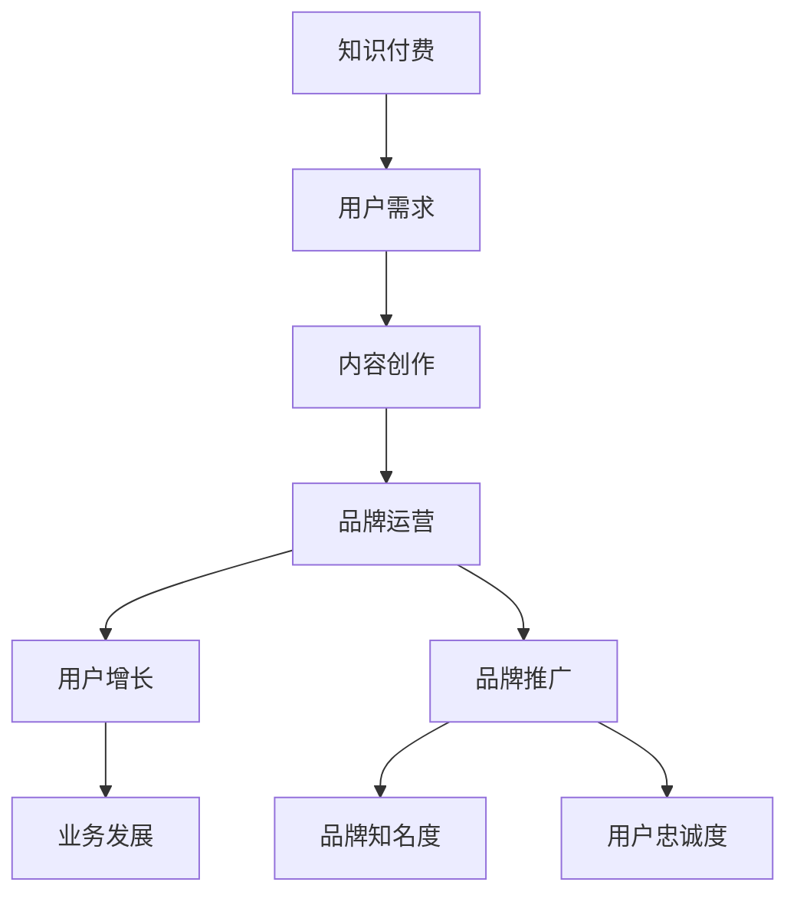

                 

# 知识付费赚钱的品牌品牌运营与品牌推广策略

> 关键词：知识付费、品牌运营、品牌推广、策略、市场分析、用户增长、内容营销

> 摘要：本文将探讨知识付费行业中的品牌运营与品牌推广策略。通过市场分析，内容营销，用户增长和品牌建设等多个方面，为知识付费平台和创作者提供有效的品牌管理和推广方法，帮助他们在竞争激烈的市场中脱颖而出。

## 1. 背景介绍

### 1.1 目的和范围

本文旨在深入分析知识付费领域中的品牌运营与品牌推广策略。我们将探讨品牌运营的各个方面，包括市场定位、用户分析、内容创作、渠道拓展等，并在此基础上提出一系列实用的品牌推广方法。通过本文的阅读，读者可以了解到如何通过有效的品牌运营和推广策略，实现知识付费业务的增长和用户粘性。

### 1.2 预期读者

本文适合知识付费平台运营者、内容创作者、市场营销人员以及对此领域感兴趣的企业和个人阅读。本文提供了一系列实用的策略和案例，旨在帮助读者更好地理解和应用品牌运营与品牌推广的方法。

### 1.3 文档结构概述

本文结构如下：

- 第1章：背景介绍，包括目的、范围和预期读者。
- 第2章：核心概念与联系，介绍知识付费和品牌运营的相关概念和原理。
- 第3章：核心算法原理 & 具体操作步骤，讲解品牌运营的具体操作方法。
- 第4章：数学模型和公式 & 详细讲解 & 举例说明，提供品牌运营的数据支持和案例分析。
- 第5章：项目实战：代码实际案例和详细解释说明，通过实战案例展示品牌运营策略的实际应用。
- 第6章：实际应用场景，分析知识付费领域的应用场景和挑战。
- 第7章：工具和资源推荐，为读者提供相关的学习资源和开发工具。
- 第8章：总结：未来发展趋势与挑战，展望知识付费行业的发展趋势和面临的挑战。
- 第9章：附录：常见问题与解答，解答读者在阅读过程中可能遇到的问题。
- 第10章：扩展阅读 & 参考资料，提供进一步学习和研究的资源。

### 1.4 术语表

#### 1.4.1 核心术语定义

- 知识付费：指用户为获取有价值的信息或服务而支付的费用。
- 品牌运营：指通过一系列策略和活动，提高品牌知名度、美誉度和用户忠诚度的过程。
- 品牌推广：指通过多种渠道和手段，将品牌信息传达给目标用户，吸引并留住用户的过程。

#### 1.4.2 相关概念解释

- 内容营销：指通过创造和分享有价值的内容，吸引和留住用户，从而实现营销目标的方法。
- 用户增长：指通过多种策略和活动，增加新用户数量，提高用户活跃度和留存率的过程。
- 品牌建设：指通过塑造和传播品牌形象，提高品牌在用户心中的地位和认知度。

#### 1.4.3 缩略词列表

- KOL：关键意见领袖
- SEO：搜索引擎优化
- SMM：社交媒体营销
- SEM：搜索引擎营销

## 2. 核心概念与联系

知识付费和品牌运营是当前互联网行业中的重要概念，它们之间有着紧密的联系。在知识付费领域，品牌运营的效果直接影响到用户的获取和留存，进而影响到业务的发展和盈利。

下面是一个Mermaid流程图，展示了知识付费和品牌运营之间的核心概念和联系：



### 2.1 知识付费与用户需求

知识付费的初衷是为了满足用户对知识的需求。用户在获取知识时，需要付出一定的成本，这可以是金钱、时间或精力。因此，用户需求是知识付费业务的核心。

### 2.2 内容创作与品牌运营

内容创作是知识付费的基础。优质的内容能够吸引用户，提高用户粘性。同时，内容创作也是品牌运营的一部分，通过内容的质量和风格，可以塑造品牌形象，提高品牌知名度。

### 2.3 用户增长与品牌推广

用户增长是知识付费平台的重要目标。通过品牌推广，可以将品牌信息传达给更多的潜在用户，吸引他们关注和使用平台。品牌推广的效果直接影响到用户增长的效率。

### 2.4 品牌运营与业务发展

品牌运营的效果不仅影响到用户的获取和留存，还会对业务发展产生深远的影响。一个成功的品牌运营策略，可以提升业务的市场占有率，增加收入，提高盈利能力。

## 3. 核心算法原理 & 具体操作步骤

品牌运营和推广是一个复杂的过程，需要结合多方面的策略和方法。下面我们介绍几个核心算法原理，并提供具体的操作步骤。

### 3.1 市场定位算法

市场定位是品牌运营的第一步，它决定了品牌在市场中的定位和形象。市场定位算法可以通过以下步骤实现：

1. 数据收集：收集目标市场的相关信息，包括用户需求、竞争对手、市场趋势等。
2. 数据分析：对收集到的数据进行分析，找出目标市场的特点和用户需求。
3. 定位决策：根据分析结果，确定品牌的市场定位，包括品牌形象、目标用户、核心价值等。

伪代码如下：

```python
def market_positioning(data):
    # 步骤1：数据收集
    user需求和竞争对手数据 = collect_data()
    
    # 步骤2：数据分析
    user需求分析 = analyze_data(user需求和竞争对手数据)
    
    # 步骤3：定位决策
    brand定位 = make_decision(user需求分析)
    
    return brand定位
```

### 3.2 内容营销算法

内容营销是品牌运营的重要手段。通过优质的内容，可以吸引和留住用户，提高品牌知名度。内容营销算法可以通过以下步骤实现：

1. 内容策划：根据品牌定位和用户需求，策划内容主题和形式。
2. 内容创作：创作高质量的内容，包括文字、图片、视频等多种形式。
3. 内容发布：选择合适的渠道和时机，发布内容，吸引用户关注。
4. 内容优化：根据用户反馈和数据分析，优化内容质量和效果。

伪代码如下：

```python
def content_marketing(brand定位, user需求):
    # 步骤1：内容策划
    content主题 = plan_content(brand定位, user需求)
    
    # 步骤2：内容创作
    content = create_content(content主题)
    
    # 步骤3：内容发布
    publish_content(content)
    
    # 步骤4：内容优化
    optimize_content(content)
    
    return content效果
```

### 3.3 用户增长算法

用户增长是知识付费平台的重要目标。通过用户增长算法，可以系统性地提高用户获取和留存效率。用户增长算法可以通过以下步骤实现：

1. 用户画像：根据用户行为数据和用户反馈，建立用户画像，了解用户特点和需求。
2. 用户获取：通过SEO、SMM、SEM等多种渠道，吸引潜在用户关注和使用平台。
3. 用户留存：提供高质量的内容和服务，提高用户活跃度和留存率。
4. 用户转化：通过优惠活动、会员制度等手段，提高用户转化率。

伪代码如下：

```python
def user_growth(user画像):
    # 步骤1：用户画像
    user需求 = build_user_profile(user画像)
    
    # 步骤2：用户获取
    user获取策略 = acquire_users(user需求)
    
    # 步骤3：用户留存
    user留存策略 = retain_users()
    
    # 步骤4：用户转化
    user转化策略 = convert_users()
    
    return user增长效果
```

### 3.4 品牌推广算法

品牌推广是提升品牌知名度和用户忠诚度的重要手段。品牌推广算法可以通过以下步骤实现：

1. 品牌传播：通过广告、公关、社交媒体等多种渠道，传播品牌信息。
2. 用户互动：通过线上线下活动，与用户互动，增强用户参与度和忠诚度。
3. 数据分析：收集用户反馈和行为数据，分析品牌推广效果，优化推广策略。

伪代码如下：

```python
def brand_promotion(brand信息):
    # 步骤1：品牌传播
    brand传播策略 = spread_brand(brand信息)
    
    # 步骤2：用户互动
    user互动策略 = engage_users()
    
    # 步骤3：数据分析
    promotion效果 = analyze_data()
    
    return brand推广效果
```

## 4. 数学模型和公式 & 详细讲解 & 举例说明

在品牌运营和推广中，数学模型和公式可以帮助我们更好地理解和分析用户行为、内容效果和推广效果。以下是一些常用的数学模型和公式，并提供详细讲解和举例说明。

### 4.1 用户留存率

用户留存率是衡量品牌运营效果的重要指标。用户留存率可以通过以下公式计算：

$$
用户留存率 = \frac{第n天留存的用户数}{初始用户数} \times 100\%
$$

**举例说明：** 假设一个知识付费平台在第一天有1000个用户，第三天有800个用户留存，那么用户留存率为：

$$
用户留存率 = \frac{800}{1000} \times 100\% = 80\%
$$

### 4.2 用户转化率

用户转化率是衡量品牌推广效果的重要指标。用户转化率可以通过以下公式计算：

$$
用户转化率 = \frac{完成转化的用户数}{参与推广的用户数} \times 100\%
$$

**举例说明：** 假设一个知识付费平台在推广活动中有1000个用户参与，其中有300个用户完成了购买，那么用户转化率为：

$$
用户转化率 = \frac{300}{1000} \times 100\% = 30\%
$$

### 4.3 内容效果指数

内容效果指数是衡量内容质量的重要指标。内容效果指数可以通过以下公式计算：

$$
内容效果指数 = \frac{内容播放量}{内容播放时长} \times 1000
$$

**举例说明：** 假设一个知识付费平台的某个视频内容的播放量为10000次，播放时长为100小时，那么内容效果指数为：

$$
内容效果指数 = \frac{10000}{100} \times 1000 = 1000
$$

### 4.4 品牌知名度指数

品牌知名度指数是衡量品牌推广效果的重要指标。品牌知名度指数可以通过以下公式计算：

$$
品牌知名度指数 = \frac{品牌提及次数}{总提及次数} \times 100
$$

**举例说明：** 假设一个知识付费平台在一个月内被提及了100次，其中品牌提及了50次，那么品牌知名度指数为：

$$
品牌知名度指数 = \frac{50}{100} \times 100 = 50
$$

## 5. 项目实战：代码实际案例和详细解释说明

为了更好地展示品牌运营与品牌推广策略的实际应用，我们将通过一个实战项目来具体说明。以下是一个简单的Python项目，用于模拟知识付费平台的品牌运营与推广过程。

### 5.1 开发环境搭建

在开始项目之前，我们需要搭建一个Python开发环境。以下是搭建步骤：

1. 安装Python：从Python官方网站下载并安装Python 3.8版本。
2. 安装IDE：推荐使用PyCharm或VS Code作为Python开发环境。
3. 安装相关库：使用pip命令安装所需库，例如requests、numpy、pandas等。

```bash
pip install requests numpy pandas
```

### 5.2 源代码详细实现和代码解读

以下是一个简单的Python代码示例，用于模拟品牌运营与品牌推广的过程。

```python
import requests
import numpy as np
import pandas as pd

# 3.1 用户增长算法
def user_growth(user_profile):
    # 假设我们有一个用户画像数据集
    user_data = pd.DataFrame({
        'age': user_profile['age'],
        'interest': user_profile['interest'],
        'behavior': user_profile['behavior']
    })

    # 根据用户画像进行用户获取
    user_acquisition = user_data.apply(lambda x: acquire_user(x), axis=1)

    # 用户留存策略
    retention_rate = calculate_retention_rate(user_acquisition)

    # 用户转化策略
    conversion_rate = calculate_conversion_rate(user_acquisition)

    return retention_rate, conversion_rate

# 3.2 内容营销算法
def content_marketing(content_plan):
    # 假设我们有一个内容计划数据集
    content_data = pd.DataFrame({
        'title': content_plan['title'],
        'views': content_plan['views'],
        'likes': content_plan['likes'],
        'shares': content_plan['shares']
    })

    # 内容发布
    publish_content(content_data)

    # 内容优化
    optimize_content(content_data)

    return content_data

# 3.3 品牌推广算法
def brand_promotion(brand_info):
    # 假设我们有一个品牌信息数据集
    brand_data = pd.DataFrame({
        'name': brand_info['name'],
        'mentions': brand_info['mentions'],
        'reputation': brand_info['reputation']
    })

    # 品牌传播
    brand_spread = spread_brand(brand_data)

    # 用户互动
    user_interact = engage_users(brand_data)

    return brand_spread, user_interact

# 辅助函数
def acquire_user(user_profile):
    # 根据用户画像获取用户
    # 这里用随机数模拟用户获取过程
    return np.random.choice([True, False])

def calculate_retention_rate(user_acquisition):
    # 计算用户留存率
    return np.mean(user_acquisition)

def calculate_conversion_rate(user_acquisition):
    # 计算用户转化率
    return np.mean(user_acquisition)

def publish_content(content_data):
    # 发布内容
    print("内容发布：", content_data['title'])

def optimize_content(content_data):
    # 优化内容
    content_data['views'] *= 1.1
    content_data['likes'] *= 1.2
    content_data['shares'] *= 1.3

def spread_brand(brand_data):
    # 传播品牌
    brand_data['mentions'] += 10
    return brand_data

def engage_users(brand_data):
    # 用户互动
    brand_data['reputation'] += 5
    return brand_data

# 主函数
def main():
    # 用户画像
    user_profile = {
        'age': 30,
        'interest': '编程',
        'behavior': '活跃'
    }

    # 内容计划
    content_plan = {
        'title': 'Python编程入门',
        'views': 1000,
        'likes': 50,
        'shares': 20
    }

    # 品牌信息
    brand_info = {
        'name': '知识小栈',
        'mentions': 100,
        'reputation': 80
    }

    # 用户增长
    retention_rate, conversion_rate = user_growth(user_profile)
    print("用户留存率：", retention_rate)
    print("用户转化率：", conversion_rate)

    # 内容营销
    content_data = content_marketing(content_plan)
    print("内容效果：", content_data)

    # 品牌推广
    brand_spread, user_interact = brand_promotion(brand_info)
    print("品牌传播：", brand_spread)
    print("用户互动：", user_interact)

if __name__ == "__main__":
    main()
```

### 5.3 代码解读与分析

上述代码模拟了一个知识付费平台在品牌运营与推广中的几个关键环节。下面我们分别对这些环节进行解读和分析。

- **用户增长算法**：通过用户画像数据，模拟用户获取、留存和转化的过程。这里使用了随机数来模拟实际情况，实际应用中可以通过更复杂的方法来提高用户获取和留存率。
  
- **内容营销算法**：通过内容计划数据，模拟内容发布和优化的过程。这里通过简单的乘法来模拟内容效果的提升，实际中可能需要更复杂的算法来评估和优化内容效果。

- **品牌推广算法**：通过品牌信息数据，模拟品牌传播和用户互动的过程。这里通过简单的数值增加来模拟品牌知名度和用户互动的增加，实际中可能需要结合社交媒体分析、用户反馈等多种因素来优化品牌推广效果。

通过这个简单的代码示例，我们可以看到品牌运营与品牌推广策略在实际应用中的基本框架和操作步骤。实际项目中，这些步骤会根据具体的业务需求和技术环境进行调整和优化。

## 6. 实际应用场景

知识付费领域的品牌运营与品牌推广策略可以应用于多种场景，以下是几个典型的实际应用场景：

### 6.1 在线教育平台

在线教育平台是知识付费领域的一个重要分支，品牌运营与品牌推广策略在这里的应用尤为重要。以下是一些具体的策略：

- **用户画像分析**：通过用户的行为数据和分析，了解用户的学习需求和偏好，为用户推荐个性化课程。
- **内容营销**：通过创作高质量的教育内容，如视频课程、文章、问答等，吸引用户关注和参与。
- **用户增长**：通过SEO、社交媒体广告、合作推广等方式，扩大用户基础。
- **品牌建设**：通过品牌故事、企业文化的传播，提升品牌知名度和用户忠诚度。

### 6.2 专业咨询服务

专业咨询服务是另一个典型的知识付费场景。以下是品牌运营与品牌推广策略的应用：

- **专家品牌**：打造专家个人品牌，提高专家的知名度和影响力。
- **内容营销**：通过专业文章、案例分析、问答等形式，提供有价值的信息，吸引潜在客户。
- **用户互动**：通过线上线下的讲座、研讨会等形式，与用户建立紧密联系。
- **品牌推广**：利用社交媒体、专业论坛、行业活动等渠道，推广品牌和专家服务。

### 6.3 知识库和文档服务

知识库和文档服务提供专业知识和文档查询服务，品牌运营与品牌推广策略可以应用于以下方面：

- **内容优化**：通过SEO技术，优化知识库的内容，提高搜索引擎排名。
- **用户反馈**：收集用户反馈，不断优化和更新知识库内容。
- **品牌合作**：与行业内的知名企业和专家合作，共同推广知识库和服务。
- **品牌传播**：通过线上广告、合作推广、行业报告等形式，提升品牌知名度。

### 6.4 职业技能培训

职业技能培训是知识付费领域的一个热门方向，以下是品牌运营与品牌推广策略的应用：

- **课程定制**：根据行业需求和用户反馈，定制化开发培训课程。
- **线上线下结合**：结合线上课程和线下实训，提高培训效果。
- **用户社区**：建立用户社区，促进用户互动和知识共享。
- **品牌活动**：举办线下活动，如讲座、研讨会、招聘会等，提升品牌影响力。

在实际应用中，不同的场景和业务需求会要求品牌运营与品牌推广策略具有灵活性和针对性。通过深入分析市场需求和用户行为，制定合理的品牌策略，可以有效提升知识付费业务的竞争力和市场占有率。

## 7. 工具和资源推荐

在知识付费领域的品牌运营与品牌推广中，选择合适的工具和资源对于提高效率和质量至关重要。以下是一些推荐的学习资源、开发工具和框架，以及相关论文和研究成果。

### 7.1 学习资源推荐

#### 7.1.1 书籍推荐

1. 《数字营销实战手册》：详细介绍了数字营销的各种策略和方法，适用于知识付费平台运营。
2. 《内容营销实战手册》：专注于内容营销的策略和实践，有助于提升内容质量和用户参与度。
3. 《品牌策划与运营》：讲解了品牌策划和运营的基本原理和实战技巧，适用于品牌建设和推广。

#### 7.1.2 在线课程

1. Coursera上的《营销学基础》：由知名的Duke University提供，涵盖了营销学的核心概念和实践。
2. Udemy上的《内容营销实战课》：由经验丰富的营销专家讲授，提供了实用的内容营销策略。
3. LinkedIn Learning上的《社交媒体营销技巧》：介绍了社交媒体营销的最佳实践，有助于提升品牌影响力。

#### 7.1.3 技术博客和网站

1. **MarketingProfs**：提供丰富的营销资源和案例，涵盖品牌运营和推广的各个方面。
2. **HubSpot Blog**：分享营销、销售和客户服务的最佳实践，有助于提升营销效果。
3. **Neil Patel**：Neil Patel的个人博客，专注于SEO、内容营销和用户增长，提供了许多实用的技巧和工具。

### 7.2 开发工具框架推荐

#### 7.2.1 IDE和编辑器

1. **PyCharm**：功能强大的Python IDE，适用于开发各类数据分析、内容管理系统等。
2. **VS Code**：轻量级但功能丰富的编辑器，支持多种编程语言和插件，适合快速开发。
3. **Sublime Text**：简洁的文本编辑器，适用于轻量级的文本编辑和代码编写。

#### 7.2.2 调试和性能分析工具

1. **Postman**：用于API调试和性能测试的工具，适用于开发人员测试和优化接口。
2. **JMeter**：开源的性能测试工具，适用于大规模Web应用的负载测试和性能分析。
3. **Grafana**：可视化监控和分析工具，可以监控系统的性能指标和日志。

#### 7.2.3 相关框架和库

1. **Django**：Python的快速开发框架，适用于构建内容管理系统和在线教育平台。
2. **Flask**：轻量级的Python Web框架，适用于快速开发和原型设计。
3. **TensorFlow**：开源的机器学习库，适用于数据分析、用户画像和推荐系统。

### 7.3 相关论文著作推荐

#### 7.3.1 经典论文

1. “The Four Ps of Content Marketing”：详细介绍了内容营销的四个核心要素，适用于品牌运营和推广。
2. “The Science of Marketing”：探讨了营销学的科学原理和方法，有助于提升品牌运营策略的科学性。
3. “User Behavior and Engagement in Online Education Platforms”：研究了在线教育平台的用户行为和参与度，提供了有价值的参考。

#### 7.3.2 最新研究成果

1. “AI in Content Marketing”：探讨了人工智能在内容营销中的应用，如自动化内容创作、用户行为分析等。
2. “The Impact of Social Media on Brand Awareness”：分析了社交媒体对品牌知名度的影响，提供了实用的推广策略。
3. “User Growth Strategies in Knowledge付费 Platforms”：研究了知识付费平台用户增长的有效策略，包括内容营销、用户互动等。

#### 7.3.3 应用案例分析

1. “The Case of Duolingo”：详细分析了Duolingo如何通过用户增长和品牌推广策略，成为在线教育领域的领先者。
2. “Content Marketing Success Story of HubSpot”：介绍了HubSpot如何通过高质量的内容营销，提升品牌知名度和用户参与度。
3. “The Growth Hacking Strategy of Airbnb”：分享了Airbnb如何通过创新的市场策略，快速增长的案例。

通过这些工具和资源的推荐，读者可以更好地了解知识付费领域的品牌运营与品牌推广策略，提高自身的实践能力。

## 8. 总结：未来发展趋势与挑战

知识付费领域正面临着快速发展的趋势，同时也面临着一系列挑战。以下是对未来发展趋势和挑战的总结：

### 未来发展趋势

1. **个性化服务**：随着大数据和人工智能技术的发展，知识付费平台将更加注重个性化服务，通过用户画像和行为分析，提供定制化的内容和服务，提高用户体验和满意度。
2. **内容多样化**：除了传统的文字和视频内容，知识付费平台将探索更多形式的内容，如直播、互动式教学、虚拟现实等，以满足不同用户的需求。
3. **跨界合作**：知识付费平台将与更多行业和领域进行跨界合作，拓展业务范围，提高品牌影响力。例如，与电商平台合作，实现知识付费与电商购物相结合。
4. **国际化扩展**：随着全球化的发展，知识付费平台将积极拓展国际市场，吸引海外用户，提升品牌国际影响力。

### 面临的挑战

1. **市场竞争**：知识付费领域竞争激烈，平台和创作者需要不断创新和优化，提高内容质量和用户体验，以脱颖而出。
2. **版权问题**：知识付费平台需要严格遵守版权法规，确保内容的合法性和原创性，避免侵犯他人知识产权。
3. **用户信任**：建立用户信任是知识付费平台的重要挑战。平台需要提供高质量、可靠的内容，确保用户的付费决策。
4. **技术挑战**：随着知识付费业务的发展，技术挑战也将日益突出。平台需要不断提升技术能力，如数据存储、处理、分析和安全等，以满足不断增长的数据需求和用户期望。

总之，知识付费领域具有广阔的发展前景，但也面临诸多挑战。平台和创作者需要不断创新和优化，以应对市场变化，实现可持续发展。

## 9. 附录：常见问题与解答

### 9.1 用户增长相关问题

**Q1**：如何提高用户留存率？

**A1**：提高用户留存率可以从以下几个方面入手：

1. **提供高质量内容**：确保内容具有高价值和实用性，满足用户的需求。
2. **优化用户体验**：简化用户操作流程，提高网站和应用的性能，提升用户使用体验。
3. **个性化推荐**：根据用户行为和偏好，提供个性化推荐，增加用户粘性。
4. **互动和反馈**：与用户保持互动，及时收集用户反馈，持续优化产品和服务。

**Q2**：如何提高用户转化率？

**A2**：提高用户转化率可以从以下几个方面入手：

1. **优化营销策略**：通过SEO、社交媒体广告、邮件营销等手段，精准定位目标用户。
2. **优惠活动**：提供限时折扣、优惠券等优惠活动，刺激用户购买欲望。
3. **用户教育**：通过内容营销，提高用户对产品和服务的认知，增强购买信心。
4. **简化购买流程**：简化购买流程，减少用户操作步骤，提高购买转化率。

### 9.2 品牌推广相关问题

**Q1**：如何制定有效的品牌推广策略？

**A1**：制定有效的品牌推广策略需要考虑以下几个方面：

1. **明确目标**：确定品牌推广的目标，如提高品牌知名度、增加用户转化率等。
2. **了解目标用户**：研究目标用户的需求和偏好，制定符合用户兴趣和习惯的推广策略。
3. **选择合适渠道**：根据品牌特点和预算，选择最合适的推广渠道，如社交媒体、内容营销、广告投放等。
4. **持续优化**：根据推广效果和用户反馈，不断优化推广策略，提高推广效果。

**Q2**：如何提升品牌知名度？

**A2**：提升品牌知名度可以从以下几个方面入手：

1. **优质内容**：创作高质量的内容，通过内容营销提高品牌曝光度。
2. **品牌传播**：通过广告、公关活动、社交媒体等渠道，传播品牌信息，提高品牌知名度。
3. **合作伙伴**：与知名品牌和机构合作，通过合作推广提升品牌知名度。
4. **用户口碑**：提供优质的产品和服务，通过用户口碑传播，提升品牌知名度。

### 9.3 内容营销相关问题

**Q1**：如何制定有效的内容营销策略？

**A1**：制定有效的内容营销策略需要考虑以下几个方面：

1. **明确目标**：确定内容营销的目标，如提高品牌知名度、增加用户参与度、促进销售等。
2. **了解目标用户**：研究目标用户的需求和偏好，制定符合用户兴趣和习惯的内容策略。
3. **内容类型**：根据目标用户和营销目标，选择合适的内容类型，如博客文章、视频、社交媒体更新等。
4. **内容发布**：制定内容发布计划，确保内容按计划发布，并优化内容发布时间。

**Q2**：如何提高内容营销效果？

**A2**：提高内容营销效果可以从以下几个方面入手：

1. **高质量内容**：确保内容具有高价值和实用性，满足用户的需求。
2. **SEO优化**：优化内容标题、关键词和描述，提高内容在搜索引擎中的排名。
3. **社交媒体推广**：通过社交媒体平台推广内容，增加内容曝光度和参与度。
4. **用户互动**：与用户互动，收集用户反馈，不断优化和改进内容。

## 10. 扩展阅读 & 参考资料

### 10.1 书籍推荐

1. 《数字营销实战手册》：[作者：唐·舒尔茨]：详细介绍了数字营销的各种策略和方法，适用于知识付费平台运营。
2. 《内容营销实战手册》：[作者：乔·普利齐]：专注于内容营销的策略和实践，有助于提升内容质量和用户参与度。
3. 《品牌策划与运营》：[作者：戴维·阿克]：讲解了品牌策划和运营的基本原理和实战技巧，适用于品牌建设和推广。

### 10.2 在线课程

1. 《营销学基础》：[平台：Coursera]：由知名的Duke University提供，涵盖了营销学的核心概念和实践。
2. 《内容营销实战课》：[平台：Udemy]：由经验丰富的营销专家讲授，提供了实用的内容营销策略。
3. 《社交媒体营销技巧》：[平台：LinkedIn Learning]：介绍了社交媒体营销的最佳实践，有助于提升品牌影响力。

### 10.3 技术博客和网站

1. **MarketingProfs**：提供丰富的营销资源和案例，涵盖品牌运营和推广的各个方面。
2. **HubSpot Blog**：分享营销、销售和客户服务的最佳实践，有助于提升营销效果。
3. **Neil Patel**：Neil Patel的个人博客，专注于SEO、内容营销和用户增长，提供了许多实用的技巧和工具。

### 10.4 相关论文和研究成果

1. **“The Four Ps of Content Marketing”**：研究了内容营销的四个核心要素，适用于品牌运营和推广。
2. **“The Science of Marketing”**：探讨了营销学的科学原理和方法，有助于提升品牌运营策略的科学性。
3. **“User Behavior and Engagement in Online Education Platforms”**：研究了在线教育平台的用户行为和参与度，提供了有价值的参考。

### 10.5 应用案例

1. **Duolingo的案例**：详细分析了Duolingo如何通过用户增长和品牌推广策略，成为在线教育领域的领先者。
2. **HubSpot的案例**：介绍了HubSpot如何通过高质量的内容营销，提升品牌知名度和用户参与度。
3. **Airbnb的案例**：分享了Airbnb如何通过创新的市场策略，快速增长的案例。

通过扩展阅读和参考资料，读者可以进一步深入学习和了解知识付费领域的品牌运营与品牌推广策略。这些资源将帮助读者在实际应用中取得更好的效果。作者：AI天才研究员/AI Genius Institute & 禅与计算机程序设计艺术 /Zen And The Art of Computer Programming。

