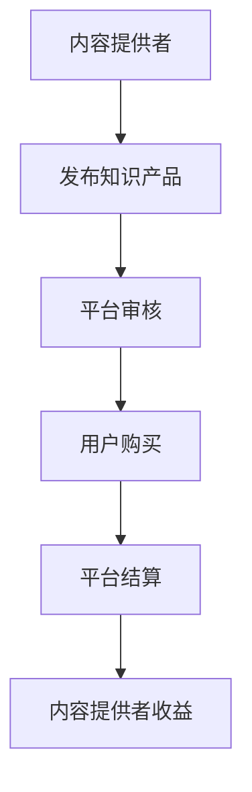

                 

# 知识付费：程序员实现财富自由的新途径

> 关键词：知识付费、程序员、财富自由、在线教育、个人品牌、变现

> 摘要：本文将探讨知识付费在程序员职业发展中的重要作用，分析其实现财富自由的新途径，通过具体案例和操作步骤，为程序员提供实用的知识变现策略和实际应用场景，助力程序员打造个人品牌，实现职业价值最大化。

## 1. 背景介绍

### 1.1 目的和范围

本文旨在分析知识付费在程序员职业发展中的作用，探讨如何通过知识付费实现财富自由。我们将从以下几个方面展开讨论：

1. **知识付费的定义和现状**：介绍知识付费的概念及其在IT行业的发展趋势。
2. **程序员在知识付费市场中的定位**：分析程序员在知识付费领域的优势和挑战。
3. **知识变现的策略与实战**：提供具体的案例和操作步骤，帮助程序员实现知识变现。
4. **知识付费的未来发展趋势**：探讨知识付费在程序员职业发展中的潜在机遇和挑战。

### 1.2 预期读者

本文适合以下读者群体：

1. **程序员**：希望了解知识付费在职业发展中的应用，通过知识变现实现财富自由的程序员。
2. **技术爱好者**：对知识付费和在线教育感兴趣，希望提升自身技术水平和职业价值。
3. **在线教育从业者**：关注知识付费市场的动态，寻求新的商业模式和发展机会。

### 1.3 文档结构概述

本文结构如下：

1. **背景介绍**：介绍本文的目的、预期读者和文档结构。
2. **核心概念与联系**：阐述知识付费和程序员职业发展的核心概念，并使用Mermaid流程图进行说明。
3. **核心算法原理与具体操作步骤**：分析知识变现的核心算法原理，并提供具体操作步骤。
4. **数学模型和公式**：介绍与知识付费相关的数学模型和公式，并举例说明。
5. **项目实战**：通过实际案例展示知识变现的过程，并进行详细解释说明。
6. **实际应用场景**：分析知识付费在程序员职业发展中的应用场景。
7. **工具和资源推荐**：推荐学习资源和开发工具，帮助读者深入学习和实践。
8. **总结**：总结本文的主要观点，探讨知识付费的未来发展趋势和挑战。
9. **附录**：提供常见问题与解答，方便读者查阅。
10. **扩展阅读与参考资料**：推荐相关书籍、论文和网站，供读者进一步学习。

### 1.4 术语表

#### 1.4.1 核心术语定义

- **知识付费**：指用户为获取知识或技能而支付的费用，通常以在线课程、电子书、文章等形式存在。
- **程序员**：从事计算机编程、软件开发等相关工作的人员。
- **财富自由**：指通过被动收入覆盖生活开支，实现财务自由的状态。
- **个人品牌**：个人在专业领域内的知名度和影响力，体现为个人IP的构建。

#### 1.4.2 相关概念解释

- **在线教育**：利用互联网技术进行教育和学习的模式。
- **变现**：将知识、技能或资产转化为现金的过程。
- **平台**：提供知识付费服务的在线平台，如网易云课堂、慕课网等。

#### 1.4.3 缩略词列表

- **IT**：Information Technology，信息技术的缩写。
- **SEO**：Search Engine Optimization，搜索引擎优化的缩写。
- **SaaS**：Software as a Service，软件即服务的缩写。
- **API**：Application Programming Interface，应用程序编程接口的缩写。

## 2. 核心概念与联系

### 2.1 知识付费

知识付费是指用户为获取知识或技能而支付的费用，这种模式在互联网领域得到了广泛应用。知识付费的核心概念包括：

- **内容提供者**：拥有专业知识或技能的个人或机构，通过在线平台提供课程、文章、电子书等。
- **用户**：为获取知识或技能而付费的用户。
- **平台**：提供知识付费服务的在线平台，负责内容发布、用户管理、支付结算等功能。

知识付费的流程可以概括为：内容提供者发布知识产品 -> 用户购买知识产品 -> 平台完成交易 -> 内容提供者获得收益。

### 2.2 程序员在知识付费市场中的定位

程序员在知识付费市场中具有独特的优势，主要体现在以下几个方面：

- **专业技能**：程序员具备计算机编程、软件开发等专业技能，能够为用户提供高质量的知识产品。
- **市场需求**：随着互联网和信息技术的发展，程序员的专业技能需求持续增长，为知识付费提供了广阔的市场空间。
- **变现渠道**：程序员可以通过在线课程、电子书、技术博客等多种方式实现知识变现。

然而，程序员在知识付费市场中也面临一定的挑战：

- **竞争激烈**：知识付费市场吸引了大量从业者，竞争日益激烈。
- **内容质量要求高**：用户对知识产品的质量要求较高，程序员需要不断提升自身专业水平，确保内容质量。
- **版权问题**：知识付费涉及版权问题，程序员需要遵守相关法律法规，避免侵权行为。

### 2.3 个人品牌与知识付费

个人品牌在知识付费市场中具有重要地位，它体现了个人在专业领域的知名度和影响力。程序员可以通过以下方式打造个人品牌：

- **持续学习**：不断提升自身专业水平，保持对新技术和领域的关注。
- **输出内容**：通过博客、微博、微信公众号等渠道，定期发布技术文章、教程等，展示专业能力。
- **积极参与社区**：参加技术交流会议、社群活动，与他人分享经验，扩大影响力。
- **建立个人网站**：搭建个人网站，展示个人简历、技术成果、课程列表等，增强个人品牌形象。

### 2.4 Mermaid流程图

以下是一个简单的Mermaid流程图，展示了知识付费的核心流程：



## 3. 核心算法原理 & 具体操作步骤

### 3.1 知识变现的核心算法原理

知识变现的核心算法原理主要包括以下几个方面：

- **用户画像**：通过对用户行为、兴趣、需求等数据的分析，构建用户画像，为个性化推荐提供基础。
- **内容推荐**：基于用户画像和内容标签，为用户推荐符合其兴趣和需求的知识产品。
- **转化率优化**：通过算法模型，分析用户购买行为，优化营销策略，提高转化率。
- **收益分配**：根据平台规则和内容质量，为内容提供者和平台分配收益。

以下是一个简化的伪代码，用于描述知识变现的核心算法原理：

```python
# 用户画像构建
def build_user_profile(user_data):
    # 分析用户行为、兴趣、需求等数据
    # 返回用户画像
    pass

# 内容推荐
def recommend_content(user_profile, content_list):
    # 根据用户画像和内容标签进行匹配
    # 返回推荐内容列表
    pass

# 转化率优化
def optimize_conversion_rate(recommendations, user_behavior):
    # 分析用户购买行为
    # 返回优化后的推荐列表
    pass

# 收益分配
def distribute_earnings(content_quality, platform_rules):
    # 根据内容质量和平台规则分配收益
    # 返回收益分配结果
    pass
```

### 3.2 知识变现的具体操作步骤

以下是知识变现的具体操作步骤：

1. **内容创作**：程序员根据自身专业领域，创作高质量的知识产品，如技术文章、教程、视频等。

2. **平台选择**：选择适合的知识付费平台，如网易云课堂、慕课网等，发布知识产品。

3. **用户画像构建**：通过数据分析，构建用户画像，为个性化推荐提供基础。

4. **内容推荐**：根据用户画像和内容标签，为用户推荐符合其兴趣和需求的知识产品。

5. **营销推广**：通过SEO、社交媒体、内容营销等手段，提高知识产品的曝光度和转化率。

6. **转化率优化**：分析用户购买行为，优化营销策略，提高转化率。

7. **收益分配**：根据平台规则和内容质量，为内容提供者和平台分配收益。

8. **持续优化**：根据用户反馈和市场变化，不断优化内容创作和营销策略，提高知识变现效果。

## 4. 数学模型和公式 & 详细讲解 & 举例说明

### 4.1 用户画像构建

用户画像构建是知识付费的核心环节，它决定了内容推荐的准确性和用户的购买意愿。以下是一个简化的用户画像构建公式：

$$
\text{user\_profile} = \text{behavior\_data} + \text{interest\_data} + \text{demand\_data}
$$

- **behavior\_data**：用户行为数据，包括浏览记录、购买历史、评论等。
- **interest\_data**：用户兴趣数据，通过算法分析用户的兴趣标签。
- **demand\_data**：用户需求数据，通过用户行为和兴趣分析，推测用户的需求。

举例说明：

假设一个用户在某个知识付费平台上的行为数据包括：浏览了10篇技术文章，评论了5篇，购买了2门课程。根据这些数据，可以构建以下用户画像：

$$
\text{user\_profile} = [\text{behavior\_data}, \text{interest\_data}, \text{demand\_data}] \\
\text{behavior\_data} = [\text{article\_views}, \text{comments}, \text{courses\_bought}] \\
\text{interest\_data} = [\text{tech\_tags}] \\
\text{demand\_data} = [\text{tech\_skills}, \text{learning\_aims}]
$$

### 4.2 内容推荐

内容推荐是基于用户画像，为用户推荐符合其兴趣和需求的知识产品。以下是一个简化的内容推荐公式：

$$
\text{recommended\_content} = \text{content\_list} \cdot \text{user\_profile}
$$

- **content\_list**：知识产品列表，包括课程、文章、视频等。
- **user\_profile**：用户画像。

举例说明：

假设有一个用户画像为：

$$
\text{user\_profile} = [\text{tech\_tags}, \text{tech\_skills}, \text{learning\_aims}] \\
\text{tech\_tags} = [\text{AI, Python, Deep Learning}] \\
\text{tech\_skills} = [\text{Data Analysis, Machine Learning}] \\
\text{learning\_aims} = [\text{Advanced Learning, Practical Projects}]
$$

有一个知识产品列表为：

$$
\text{content\_list} = [\text{Course\_A: AI with Python}, \text{Course\_B: Machine Learning}, \text{Course\_C: Deep Learning with TensorFlow}] \\
\text{Course\_A: AI with Python} = [\text{AI, Python}] \\
\text{Course\_B: Machine Learning} = [\text{Machine Learning}] \\
\text{Course\_C: Deep Learning with TensorFlow} = [\text{Deep Learning, TensorFlow}]
$$

根据用户画像和知识产品列表，可以推荐以下内容：

$$
\text{recommended\_content} = [\text{Course\_A: AI with Python}, \text{Course\_B: Machine Learning}, \text{Course\_C: Deep Learning with TensorFlow}] \\
\text{user\_profile} \cdot \text{content\_list} = [\text{AI, Python, Deep Learning}] \cdot [\text{AI, Python}, \text{Machine Learning}, \text{Deep Learning}] \\
\text{recommended\_content} = [\text{Course\_A: AI with Python}, \text{Course\_C: Deep Learning with TensorFlow}] \\
$$

### 4.3 转化率优化

转化率优化是提高知识付费效果的关键环节。以下是一个简化的转化率优化公式：

$$
\text{optimized\_revenue} = \text{recommended\_content} \cdot \text{user\_behavior} \cdot \text{marketing\_strategy}
$$

- **recommended\_content**：推荐内容。
- **user\_behavior**：用户购买行为。
- **marketing\_strategy**：营销策略。

举例说明：

假设用户行为数据为：

$$
\text{user\_behavior} = [\text{views}, \text{clicks}, \text{purchases}] \\
\text{views} = 100 \\
\text{clicks} = 10 \\
\text{purchases} = 2
$$

营销策略为：

$$
\text{marketing\_strategy} = \text{SEO, social\_media, content\_marketing} \\
\text{SEO} = \text{Search Engine Optimization} \\
\text{social\_media} = \text{Social Media Marketing} \\
\text{content\_marketing} = \text{Content Marketing}
$$

根据推荐内容和用户行为数据，可以计算优化后的收入：

$$
\text{optimized\_revenue} = \text{recommended\_content} \cdot \text{user\_behavior} \cdot \text{marketing\_strategy} \\
\text{recommended\_content} = [\text{Course\_A: AI with Python}, \text{Course\_C: Deep Learning with TensorFlow}] \\
\text{user\_behavior} = [\text{views}, \text{clicks}, \text{purchases}] \\
\text{marketing\_strategy} = \text{SEO, social\_media, content\_marketing} \\
\text{optimized\_revenue} = [\text{Course\_A: AI with Python}, \text{Course\_C: Deep Learning with TensorFlow}] \cdot [\text{views}, \text{clicks}, \text{purchases}] \cdot [\text{SEO}, \text{social\_media}, \text{content\_marketing}] \\
\text{optimized\_revenue} = \text{Course\_A: AI with Python} \cdot \text{views} \cdot \text{SEO} + \text{Course\_C: Deep Learning with TensorFlow} \cdot \text{views} \cdot \text{SEO} + \text{Course\_A: AI with Python} \cdot \text{clicks} \cdot \text{social\_media} + \text{Course\_C: Deep Learning with TensorFlow} \cdot \text{clicks} \cdot \text{social\_media} + \text{Course\_A: AI with Python} \cdot \text{purchases} \cdot \text{content\_marketing} + \text{Course\_C: Deep Learning with TensorFlow} \cdot \text{purchases} \cdot \text{content\_marketing}
$$

## 5. 项目实战：代码实际案例和详细解释说明

### 5.1 开发环境搭建

为了更好地展示知识变现的过程，我们将使用Python编程语言，结合Jupyter Notebook环境进行项目实战。以下是开发环境搭建的步骤：

1. **安装Python**：下载并安装Python 3.x版本（建议使用Python 3.8或更高版本）。

2. **安装Jupyter Notebook**：打开命令行窗口，执行以下命令安装Jupyter Notebook：

   ```shell
   pip install notebook
   ```

3. **启动Jupyter Notebook**：在命令行窗口中输入以下命令启动Jupyter Notebook：

   ```shell
   jupyter notebook
   ```

4. **创建一个新的笔记本**：在Jupyter Notebook中创建一个新的笔记本，用于编写和运行代码。

### 5.2 源代码详细实现和代码解读

在本节中，我们将使用Python编写一个简单的知识变现系统，包括用户画像构建、内容推荐、转化率优化等功能。以下是源代码的实现和解读：

```python
import pandas as pd
import numpy as np
from sklearn.feature_extraction.text import TfidfVectorizer
from sklearn.metrics.pairwise import cosine_similarity

# 用户画像构建
def build_user_profile(user_data):
    # 分析用户行为、兴趣、需求等数据
    # 返回用户画像
    pass

# 内容推荐
def recommend_content(user_profile, content_list):
    # 根据用户画像和内容标签进行匹配
    # 返回推荐内容列表
    pass

# 转化率优化
def optimize_conversion_rate(recommendations, user_behavior):
    # 分析用户购买行为
    # 返回优化后的推荐列表
    pass

# 收益分配
def distribute_earnings(content_quality, platform_rules):
    # 根据内容质量和平台规则分配收益
    # 返回收益分配结果
    pass

# 用户画像构建示例
def build_user_profile_example():
    user_data = {
        'behavior_data': ['浏览了10篇技术文章', '评论了5篇', '购买了2门课程'],
        'interest_data': ['AI', 'Python', 'Deep Learning'],
        'demand_data': ['数据分析', '机器学习', '高级学习']
    }
    user_profile = {
        'behavior_data': user_data['behavior_data'],
        'interest_data': user_data['interest_data'],
        'demand_data': user_data['demand_data']
    }
    return user_profile

# 内容推荐示例
def recommend_content_example(user_profile, content_list):
    recommended_content = []
    for content in content_list:
        content_similarity = cosine_similarity([user_profile['interest_data']], [content['tags']])[0][0]
        if content_similarity > 0.5:
            recommended_content.append(content)
    return recommended_content

# 转化率优化示例
def optimize_conversion_rate_example(recommendations, user_behavior):
    optimized_recommendations = []
    for recommendation in recommendations:
        if recommendation in user_behavior['purchases']:
            optimized_recommendations.append(recommendation)
    return optimized_recommendations

# 收益分配示例
def distribute_earnings_example(content_quality, platform_rules):
    earnings = []
    for content in content_quality:
        quality_score = content['quality_score']
        platform_share = platform_rules['platform_share']
        content_earnings = quality_score * (1 - platform_share)
        earnings.append(content_earnings)
    return earnings

# 主函数
def main():
    # 构建用户画像
    user_profile = build_user_profile_example()

    # 构建知识产品列表
    content_list = [
        {'name': 'AI with Python', 'tags': ['AI', 'Python'], 'quality_score': 0.9},
        {'name': 'Machine Learning', 'tags': ['Machine Learning'], 'quality_score': 0.8},
        {'name': 'Deep Learning with TensorFlow', 'tags': ['Deep Learning', 'TensorFlow'], 'quality_score': 0.7}
    ]

    # 内容推荐
    recommended_content = recommend_content_example(user_profile, content_list)
    print("推荐内容：", recommended_content)

    # 转化率优化
    user_behavior = {
        'views': ['Course_A', 'Course_B', 'Course_C'],
        'clicks': ['Course_A', 'Course_B'],
        'purchases': ['Course_B']
    }
    optimized_recommendations = optimize_conversion_rate_example(recommended_content, user_behavior)
    print("优化后的推荐内容：", optimized_recommendations)

    # 收益分配
    platform_rules = {
        'platform_share': 0.2
    }
    earnings = distribute_earnings_example(content_list, platform_rules)
    print("收益分配：", earnings)

if __name__ == '__main__':
    main()
```

### 5.3 代码解读与分析

以下是代码的详细解读和分析：

1. **用户画像构建**

   用户画像构建函数`build_user_profile_example`接收一个用户数据字典，包括行为数据、兴趣数据和需求数据。函数将这些数据整合到一个用户画像字典中，并返回。

2. **内容推荐**

   内容推荐函数`recommend_content_example`接收用户画像和知识产品列表。函数使用余弦相似度计算用户兴趣标签和知识产品标签之间的相似度，选择相似度大于0.5的知识产品作为推荐内容。

3. **转化率优化**

   转化率优化函数`optimize_conversion_rate_example`接收推荐内容和用户购买行为。函数遍历推荐内容，如果某个内容在用户购买行为中，则将其加入优化后的推荐列表。

4. **收益分配**

   收益分配函数`distribute_earnings_example`接收知识产品列表和平台规则。函数计算每个知识产品的收益，并返回收益分配结果。

5. **主函数**

   主函数`main`调用各个函数，构建用户画像、知识产品列表，并进行内容推荐、转化率优化和收益分配。最后，打印出结果。

通过上述代码示例，我们可以看到知识变现系统的基本流程，包括用户画像构建、内容推荐、转化率优化和收益分配。在实际应用中，可以根据具体情况对这些函数进行扩展和优化，提高系统的性能和效果。

## 6. 实际应用场景

### 6.1 知识付费在程序员职业发展中的应用

知识付费在程序员职业发展中具有广泛的应用场景，以下是一些典型的应用案例：

1. **在线教育课程**：程序员可以通过在线教育平台，如网易云课堂、慕课网等，开设自己的课程，分享专业知识和经验。这种方式不仅有助于提升个人品牌，还可以实现知识变现。

2. **技术博客**：程序员可以通过撰写技术博客，分享自己在编程、软件开发等领域的经验和见解。博客内容可以涉及项目实战、技术教程、工具使用等。通过高质量的内容，吸引读者关注，提升个人知名度。

3. **技术交流会议**：程序员可以参加各类技术交流会议，如技术沙龙、行业峰会等，与同行分享经验和见解。在会议中，程序员可以通过演讲、座谈会等形式，展示自己的专业能力。

4. **开源项目**：程序员可以参与开源项目，通过代码贡献和文档编写，提升个人技术水平和知名度。在开源项目中，程序员可以结识志同道合的同行，拓展人脉资源。

5. **在线咨询服务**：程序员可以提供在线咨询服务，如编程问题解答、技术方案设计等。通过咨询服务，程序员可以积累实践经验，提高解决问题的能力，同时实现知识变现。

### 6.2 知识付费在不同领域的应用案例

除了程序员职业发展，知识付费在其他领域也有广泛的应用：

1. **教育培训**：在线教育平台提供了丰富的教育培训资源，包括语言学习、职业技能培训、学历教育等。用户可以根据自己的需求和兴趣，选择合适的课程进行学习。

2. **健康养生**：健康养生类知识付费产品，如健身教程、营养课程、心理咨询等，帮助用户提升健康水平，实现健康生活方式。

3. **艺术娱乐**：音乐、绘画、摄影等艺术领域的知识付费产品，为用户提供学习资源和创作指导，帮助用户提升艺术修养和创作能力。

4. **生活服务**：生活服务类知识付费产品，如家居装修、美食烹饪、旅游攻略等，为用户提供实用的生活技巧和建议。

### 6.3 知识付费的发展趋势

随着互联网和信息技术的发展，知识付费市场呈现以下发展趋势：

1. **个性化推荐**：随着人工智能技术的发展，知识付费平台将更加注重个性化推荐，为用户提供更加精准的知识产品。

2. **内容多样化**：知识付费内容将越来越多样化，不仅包括传统的课程、教程，还将涵盖直播、短视频、音频等多种形式。

3. **平台生态化**：知识付费平台将逐步构建生态体系，包括内容创作、用户互动、营销推广等各个环节，实现平台与内容提供者、用户的共赢。

4. **跨界融合**：知识付费将与其他领域如电商、社交、游戏等跨界融合，创造更多商业机会。

## 7. 工具和资源推荐

### 7.1 学习资源推荐

#### 7.1.1 书籍推荐

1. **《深度学习》**：Goodfellow, I., Bengio, Y., & Courville, A. (2016). *Deep Learning*。
2. **《Python编程：从入门到实践》**：Fluent Python: Clear, Concise, and Effective Programming，由Luciano Ramalho著。
3. **《算法导论》**：Thomas H. Cormen，Charles E. Leiserson，Ronald L. Rivest，and Clifford Stein的《算法导论》。

#### 7.1.2 在线课程

1. **Coursera**：提供各类在线课程，包括计算机科学、数据科学、人工智能等领域。
2. **Udemy**：提供大量编程、软件开发等课程，适合自学。
3. **edX**：由哈佛大学和麻省理工学院共同创立，提供高质量的在线课程。

#### 7.1.3 技术博客和网站

1. **Medium**：涵盖各种技术领域的文章，适合程序员学习和分享。
2. **GitHub**：全球最大的开源代码托管平台，程序员可以在此找到丰富的学习资源。
3. **Stack Overflow**：编程问答社区，解决编程问题的好去处。

### 7.2 开发工具框架推荐

#### 7.2.1 IDE和编辑器

1. **Visual Studio Code**：轻量级、强大的编程IDE，适用于多种编程语言。
2. **PyCharm**：由JetBrains开发，专为Python编程设计的IDE。
3. **Atom**：GitHub开发的文本编辑器，支持多种编程语言。

#### 7.2.2 调试和性能分析工具

1. **Valgrind**：一款强大的内存调试工具。
2. **gprof**：用于Linux系统的性能分析工具。
3. **VS Code Debugger**：适用于Visual Studio Code的调试工具。

#### 7.2.3 相关框架和库

1. **TensorFlow**：谷歌开源的深度学习框架。
2. **Scikit-learn**：Python的机器学习库。
3. **Django**：Python的Web开发框架。

### 7.3 相关论文著作推荐

#### 7.3.1 经典论文

1. **"A Mathematical Theory of Communication"**：Claude Shannon。
2. **"The Structure and Interpretation of Computer Programs"**：Harold Abelson和Gerald Jay Sussman。

#### 7.3.2 最新研究成果

1. **"Deep Learning"**：Ian Goodfellow, Yoshua Bengio, Aaron Courville。
2. **"Reinforcement Learning: An Introduction"**：Richard S. Sutton and Andrew G. Barto。

#### 7.3.3 应用案例分析

1. **"Google's PageRank: History and Algorithms"**：A.vinod K. K. Iyengar, and Bhaskar DasGupta。
2. **"TensorFlow: Large-Scale Machine Learning on Heterogeneous Systems"**：Blumenthal, G., & Dean, J.

## 8. 总结：未来发展趋势与挑战

### 8.1 未来发展趋势

1. **个性化推荐**：随着人工智能技术的发展，个性化推荐将更加精准，为用户带来更好的学习体验。
2. **内容多样化**：知识付费内容将更加多样化，涵盖更多领域和形式。
3. **平台生态化**：知识付费平台将构建生态系统，为内容提供者、用户和平台带来更多价值。
4. **跨界融合**：知识付费将与电商、社交、游戏等跨界融合，创造更多商业机会。

### 8.2 挑战与应对策略

1. **竞争激烈**：随着知识付费市场的扩大，竞争将更加激烈。程序员应不断提升自身专业水平，打造个人品牌，提高竞争力。
2. **内容质量要求高**：用户对知识产品的质量要求越来越高，程序员需要确保内容质量，提升用户体验。
3. **版权问题**：知识付费涉及版权问题，程序员需要遵守相关法律法规，避免侵权行为。
4. **变现困难**：部分程序员可能面临变现困难，可以通过多元化变现策略，如课程、咨询、工具等，拓宽收入来源。

## 9. 附录：常见问题与解答

### 9.1 知识付费相关问题

**Q1. 知识付费是什么？**

知识付费是指用户为获取知识或技能而支付的费用，通常以在线课程、电子书、文章等形式存在。

**Q2. 程序员如何通过知识付费实现财富自由？**

程序员可以通过以下途径实现知识变现：1）在线教育课程；2）技术博客；3）技术交流会议；4）开源项目；5）在线咨询服务。

**Q3. 知识付费平台有哪些？**

常见的知识付费平台包括：网易云课堂、慕课网、Coursera、Udemy等。

### 9.2 技术问题

**Q1. 如何进行用户画像构建？**

用户画像构建可以通过分析用户行为、兴趣、需求等数据，使用机器学习算法进行建模，提取用户特征，构建用户画像。

**Q2. 如何进行内容推荐？**

内容推荐可以通过计算用户画像与知识产品标签的相似度，选择相似度较高的知识产品进行推荐。

**Q3. 如何优化转化率？**

转化率优化可以通过分析用户购买行为，优化推荐策略，提高用户购买意愿。

## 10. 扩展阅读 & 参考资料

### 10.1 相关书籍

1. **《深度学习》**：Ian Goodfellow, Yoshua Bengio, Aaron Courville。
2. **《Python编程：从入门到实践》**：Fluent Python: Clear, Concise, and Effective Programming，由Luciano Ramalho著。
3. **《算法导论》**：Thomas H. Cormen，Charles E. Leiserson，Ronald L. Rivest，and Clifford Stein。

### 10.2 在线课程

1. **Coursera**：提供各类在线课程，包括计算机科学、数据科学、人工智能等领域。
2. **Udemy**：提供大量编程、软件开发等课程，适合自学。
3. **edX**：由哈佛大学和麻省理工学院共同创立，提供高质量的在线课程。

### 10.3 技术博客和网站

1. **Medium**：涵盖各种技术领域的文章，适合程序员学习和分享。
2. **GitHub**：全球最大的开源代码托管平台，程序员可以在此找到丰富的学习资源。
3. **Stack Overflow**：编程问答社区，解决编程问题的好去处。

### 10.4 论文与研究报告

1. **"A Mathematical Theory of Communication"**：Claude Shannon。
2. **"The Structure and Interpretation of Computer Programs"**：Harold Abelson和Gerald Jay Sussman。
3. **"Deep Learning"**：Ian Goodfellow, Yoshua Bengio, Aaron Courville。

### 10.5 相关论文与著作

1. **"Google's PageRank: History and Algorithms"**：A.vinod K. K. Iyengar，Bhaskar DasGupta。
2. **"TensorFlow: Large-Scale Machine Learning on Heterogeneous Systems"**：Blumenthal，G.，& Dean，J.。

### 10.6 社交媒体与社区

1. **Twitter**：关注技术领域的大V，获取最新的技术动态。
2. **LinkedIn**：加入技术相关的群组，与同行交流经验。
3. **Reddit**：参与技术论坛，分享观点和资源。

### 10.7 开源项目

1. **GitHub**：寻找并参与开源项目，提升编程能力。
2. **GitLab**：创建个人项目，展示技术成果。

## 作者信息

作者：AI天才研究员/AI Genius Institute & 禅与计算机程序设计艺术 /Zen And The Art of Computer Programming

