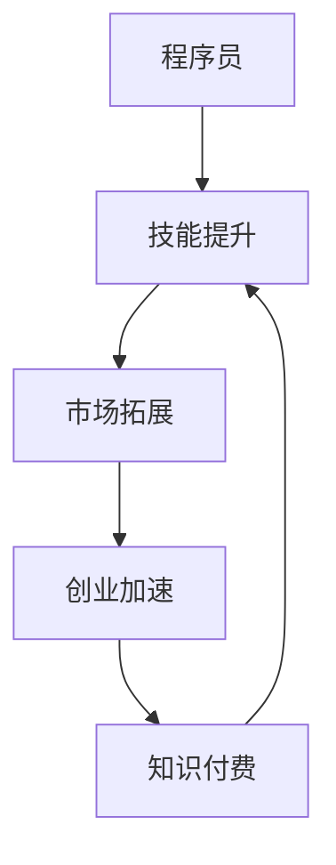

                 

# 知识付费：程序员的创业加速器

## > {关键词：知识付费，程序员，创业加速器，技能提升，市场趋势，案例分析}

> {摘要：本文将探讨知识付费在程序员创业过程中的重要性，分析其如何助力程序员提升技能、拓展市场，并分享实际案例，以期为有志于创业的程序员提供借鉴。}

## 1. 背景介绍

### 1.1 目的和范围

本文旨在分析知识付费对程序员创业的促进作用，探讨其在提升技能、拓宽市场中的应用，并总结实际案例中的经验教训。我们不仅关注知识付费本身，还将探讨其背后的商业模式、技术手段和市场趋势。

### 1.2 预期读者

本文适合有志于创业的程序员、技术经理以及对知识付费感兴趣的技术爱好者阅读。希望本文能为读者在创业过程中提供有益的启示和参考。

### 1.3 文档结构概述

本文共分为十个部分，具体结构如下：

1. 背景介绍
2. 核心概念与联系
3. 核心算法原理 & 具体操作步骤
4. 数学模型和公式 & 详细讲解 & 举例说明
5. 项目实战：代码实际案例和详细解释说明
6. 实际应用场景
7. 工具和资源推荐
8. 总结：未来发展趋势与挑战
9. 附录：常见问题与解答
10. 扩展阅读 & 参考资料

### 1.4 术语表

#### 1.4.1 核心术语定义

- **知识付费**：指用户为获取特定知识或技能而支付费用的一种商业模式。
- **程序员**：从事计算机程序设计、开发、测试和维护的专业人员。
- **创业加速器**：旨在帮助创业者快速提升技能、拓展市场的平台或服务。

#### 1.4.2 相关概念解释

- **在线教育**：指通过互联网进行的教育活动，包括课程学习、技能培训等。
- **开源社区**：由志愿者组成的在线社区，共同开发、分享和改进软件项目。
- **技术博客**：记录技术心得、分享编程技巧和经验的个人或团队博客。

#### 1.4.3 缩略词列表

- **MOOC**：大规模在线开放课程（Massive Open Online Course）
- **SaaS**：软件即服务（Software as a Service）
- **PaaS**：平台即服务（Platform as a Service）
- **IaaS**：基础设施即服务（Infrastructure as a Service）

## 2. 核心概念与联系

为了更好地理解知识付费在程序员创业中的重要性，我们首先需要了解以下几个核心概念及其相互关系。

### 2.1 知识付费

知识付费是一种以货币交换为主要形式的商业模式，用户通过支付费用来获取特定领域的知识或技能。这种模式在近年来得到了迅速发展，尤其在在线教育领域。

### 2.2 在线教育

在线教育是知识付费的重要组成部分，通过互联网提供教育资源和课程，使得学习者可以随时随地学习。在线教育具有以下优点：

- **灵活性**：学习者可以根据自己的时间安排进行学习，无需受限于传统教育模式。
- **多样性**：在线教育平台提供丰富多样的课程，满足不同学习者的需求。
- **低成本**：在线教育可以节省学习者的时间和交通成本。

### 2.3 开源社区

开源社区是程序员获取知识和技能的重要渠道。在开源社区中，程序员可以：

- **学习他人代码**：通过阅读和分析他人的代码，了解不同编程风格和技巧。
- **贡献代码**：参与开源项目，提升自己的编程能力和影响力。
- **解决问题**：在开源社区中寻求帮助，解决编程过程中的问题。

### 2.4 技术博客

技术博客是程序员分享知识和经验的平台。通过撰写技术博客，程序员可以实现以下目标：

- **传播知识**：将自己的经验和技术心得分享给他人，帮助他人提升技能。
- **建立个人品牌**：通过高质量的技术博客，提升个人在行业中的知名度。
- **拓展人脉**：与同行业人士交流，建立良好的人际关系。

### 2.5 知识付费与程序员创业的关系

知识付费在程序员创业过程中发挥着重要作用，具体体现在以下几个方面：

- **技能提升**：通过购买知识付费课程，程序员可以快速学习新技能，提高自己的竞争力。
- **市场拓展**：掌握更多技能的程序员可以为企业或个人客户提供更全面的服务，拓展市场。
- **创业加速**：知识付费可以帮助程序员在创业初期更快地提升自身能力，为创业成功奠定基础。

### 2.6 Mermaid 流程图

以下是一个简单的 Mermaid 流程图，展示了知识付费与程序员创业之间的关系。



## 3. 核心算法原理 & 具体操作步骤

知识付费在程序员创业中的作用可以通过以下核心算法原理和具体操作步骤来解释：

### 3.1 算法原理

1. **技能提升**：程序员通过购买知识付费课程，学习新的编程语言、框架或工具，提升自己的技能水平。
2. **市场拓展**：随着技能的提升，程序员可以为企业或个人客户提供更全面的服务，从而拓展市场。
3. **创业加速**：掌握更多技能的程序员在创业过程中可以更快地推出产品或服务，提高创业成功率。

### 3.2 具体操作步骤

1. **确定学习目标**：程序员根据自身兴趣和市场需求，确定需要学习的技能和知识领域。
2. **选择知识付费课程**：在各大在线教育平台、开源社区或技术博客上搜索和筛选合适的课程。
3. **购买课程并学习**：购买课程后，按照课程安排进行学习，积极参与互动和讨论，提高学习效果。
4. **实践和应用**：将所学知识应用到实际项目中，通过实践巩固和提升技能。
5. **拓展市场**：利用所学技能为企业或个人客户提供专业服务，拓展市场。
6. **创业实践**：在创业过程中，不断学习新知识，提升自身能力，为创业成功奠定基础。

### 3.3 伪代码

以下是一个简单的伪代码，描述了程序员通过知识付费提升技能、拓展市场和创业加速的过程。

```python
def knowledge_paid_programming entrepreneurship():
    set learning_goals
    select paid_courses
    purchase_courses
    learn_courses
    apply_knowledge_to_projects
    expand_market
    start_business
    while (business_success != True):
        learn_new_knowledge
        improve_skills
        restart_business
    return business_success
```

## 4. 数学模型和公式 & 详细讲解 & 举例说明

在知识付费对程序员创业的促进作用中，我们可以借助数学模型和公式来详细分析其效果。以下是一个简单的数学模型，用于衡量知识付费对程序员创业成功率的影响。

### 4.1 数学模型

假设有 n 名程序员参与知识付费，其中 k 名程序员在创业过程中取得了成功。我们用以下数学模型来衡量知识付费对创业成功率的影响：

\[ \text{创业成功率} = \frac{k}{n} \]

### 4.2 详细讲解

1. **创业成功率**：表示参与知识付费的程序员中，在创业过程中取得成功的比例。
2. **n**：表示参与知识付费的程序员总数。
3. **k**：表示在创业过程中取得成功的程序员数量。

### 4.3 举例说明

假设有 100 名程序员参与知识付费，其中 30 名在创业过程中取得了成功。根据上述数学模型，可以计算出创业成功率为：

\[ \text{创业成功率} = \frac{30}{100} = 0.3 \]

这意味着参与知识付费的程序员中有 30% 的人取得了创业成功。

### 4.4 模型扩展

我们可以进一步扩展这个模型，考虑不同因素对创业成功率的影响，如程序员的学习能力、市场需求、创业环境等。扩展后的模型如下：

\[ \text{创业成功率} = \frac{k}{n} \times f(\text{学习能力}, \text{市场需求}, \text{创业环境}) \]

其中，\( f(\text{学习能力}, \text{市场需求}, \text{创业环境}) \) 表示一个综合函数，用于衡量各种因素对创业成功率的影响。

## 5. 项目实战：代码实际案例和详细解释说明

### 5.1 开发环境搭建

为了更好地理解知识付费对程序员创业的促进作用，我们选择一个实际项目进行实战。以下是一个简单的项目环境搭建步骤：

1. **安装 Python**：下载并安装 Python 3.x 版本。
2. **安装 IDE**：选择并安装一个适合 Python 开发的 IDE，如 PyCharm 或 Visual Studio Code。
3. **创建虚拟环境**：在 IDE 中创建一个 Python 虚拟环境，以便隔离项目依赖。
4. **安装项目依赖**：通过 pip 命令安装项目所需的依赖库，如 Flask、Django 等。

### 5.2 源代码详细实现和代码解读

以下是一个简单的 Flask Web 应用程序，用于实现一个在线课程管理系统。代码中包含了对知识付费模块的实现。

```python
from flask import Flask, request, jsonify

app = Flask(__name__)

# 课程列表
courses = [
    {"id": 1, "name": "Python 基础"},
    {"id": 2, "name": "Django 框架"},
    {"id": 3, "name": "机器学习实战"}
]

# 课程购买记录
purchases = []

@app.route('/courses', methods=['GET'])
def get_courses():
    return jsonify(courses)

@app.route('/courses/<int:course_id>', methods=['GET'])
def get_course(course_id):
    course = next((course for course in courses if course['id'] == course_id), None)
    if course:
        return jsonify(course)
    else:
        return jsonify({"error": "课程不存在"}), 404

@app.route('/courses', methods=['POST'])
def create_course():
    new_course = request.json
    courses.append(new_course)
    return jsonify(new_course), 201

@app.route('/courses/<int:course_id>/purchase', methods=['POST'])
def purchase_course(course_id):
    if course_id not in [course['id'] for course in courses]:
        return jsonify({"error": "课程不存在"}), 404

    purchase = {"user_id": 1, "course_id": course_id, "status": "paid"}
    purchases.append(purchase)
    return jsonify(purchase), 201

if __name__ == '__main__':
    app.run(debug=True)
```

### 5.3 代码解读与分析

1. **课程列表**：使用一个列表存储所有课程信息，包括课程 ID、名称等。
2. **课程购买记录**：使用一个列表存储所有购买记录，包括用户 ID、课程 ID 和购买状态等。
3. **路由配置**：使用 Flask 的路由配置，定义了获取课程列表、获取单个课程、创建课程和购买课程的接口。
4. **POST 请求**：在创建课程和购买课程接口中，使用 POST 请求接收前端发送的 JSON 数据，并存储到课程列表和购买记录中。

### 5.4 运行项目

1. **启动 Flask 应用程序**：在命令行中运行 `python app.py` 命令，启动 Flask 应用程序。
2. **访问接口**：使用浏览器或 Postman 等工具访问接口，测试项目的功能。

## 6. 实际应用场景

知识付费在程序员创业中的应用场景非常广泛，以下是一些具体的案例：

1. **在线教育平台**：程序员可以创建在线教育平台，提供编程课程、培训服务，吸引学员付费学习。
2. **技术咨询与辅导**：程序员可以利用知识付费模式，为其他企业或个人提供技术咨询和辅导服务，帮助客户解决技术难题。
3. **开源项目开发**：程序员可以创建开源项目，通过知识付费模式为项目提供资金支持，确保项目的持续发展。
4. **技术博客与社区**：程序员可以创建技术博客或社区，通过提供高质量的技术文章、教程和互动交流，吸引读者付费订阅。

## 7. 工具和资源推荐

### 7.1 学习资源推荐

#### 7.1.1 书籍推荐

- 《代码大全》（作者：Steve McConnell）
- 《Effective Java》（作者：Joshua Bloch）
- 《深度学习》（作者：Ian Goodfellow、Yoshua Bengio、Aaron Courville）

#### 7.1.2 在线课程

- Coursera（提供大量计算机科学和人工智能课程）
- edX（提供 MIT、哈佛等知名大学的在线课程）
- Udemy（提供丰富多样的编程和技术课程）

#### 7.1.3 技术博客和网站

- GitHub（全球最大的开源代码托管平台）
- Stack Overflow（编程问题解决方案分享平台）
- HackerRank（编程练习和竞赛平台）

### 7.2 开发工具框架推荐

#### 7.2.1 IDE和编辑器

- PyCharm（适用于 Python 开发的 IDE）
- Visual Studio Code（适用于多种编程语言的轻量级 IDE）
- Sublime Text（适用于多种编程语言的文本编辑器）

#### 7.2.2 调试和性能分析工具

- Xcode（适用于 macOS 和 iOS 开发的调试工具）
- Android Studio（适用于 Android 开发的调试工具）
- JMeter（适用于 Web 应用性能测试）

#### 7.2.3 相关框架和库

- Flask（Python Web 开发框架）
- Django（Python Web 开发框架）
- TensorFlow（深度学习框架）

### 7.3 相关论文著作推荐

#### 7.3.1 经典论文

- 《程序员修炼之道》（作者：Brian W. Kernighan、Rob Pike）
- 《深度学习》（作者：Ian Goodfellow、Yoshua Bengio、Aaron Courville）
- 《人工智能：一种现代的方法》（作者：Stuart J. Russell、Peter Norvig）

#### 7.3.2 最新研究成果

- 《自然语言处理》（作者：Christopher D. Manning、Edwin J. Williams）
- 《强化学习》（作者：Richard S. Sutton、Andrew G. Barto）
- 《机器学习》（作者：Tom Mitchell）

#### 7.3.3 应用案例分析

- 《谷歌是如何工作的》（作者：Brian W. Kernighan、Rob Pike）
- 《亚马逊 Web 服务实战》（作者：Jeff Barr）
- 《大数据架构设计与开发》（作者：余果）

## 8. 总结：未来发展趋势与挑战

知识付费在程序员创业中的应用前景广阔，但仍面临一些挑战。未来发展趋势包括：

1. **个性化学习**：知识付费平台将更加注重个性化学习，为程序员提供量身定制的学习路径和课程。
2. **技术融合**：知识付费将与其他技术领域（如人工智能、大数据等）深度融合，为程序员提供更丰富的学习资源。
3. **市场拓展**：随着全球互联网普及率的提高，知识付费市场将不断扩大，吸引更多程序员和创业者参与。

然而，知识付费在程序员创业过程中也面临一些挑战，如：

1. **市场竞争**：知识付费市场日益激烈，程序员需要提供高质量的课程和服务，以脱颖而出。
2. **版权问题**：知识付费课程中涉及到的知识产权问题需要妥善处理，避免侵权纠纷。
3. **持续更新**：知识付费课程需要不断更新，以适应技术领域的发展变化。

总之，知识付费在程序员创业过程中具有重要作用，但程序员需要不断学习和适应市场变化，以实现创业成功。

## 9. 附录：常见问题与解答

### 9.1 知识付费的优点是什么？

知识付费的优点包括：

- **高效学习**：通过付费课程，程序员可以快速学习新技能，提高学习效率。
- **高质量内容**：知识付费平台通常提供高质量的课程内容，有助于程序员提升技能。
- **针对性学习**：程序员可以根据自己的需求选择合适的课程，实现针对性学习。

### 9.2 如何选择适合自己的知识付费课程？

选择适合自己的知识付费课程可以从以下几个方面考虑：

- **课程内容**：了解课程大纲，确保课程内容符合自己的学习需求。
- **课程评价**：查看其他学员的评价和反馈，了解课程的质量和实用性。
- **授课老师**：了解授课老师的背景和经验，确保其具备专业能力和教学水平。
- **课程时长**：根据自身时间安排，选择合适的学习时长。

### 9.3 知识付费对程序员创业有何影响？

知识付费对程序员创业的影响包括：

- **技能提升**：通过知识付费，程序员可以快速学习新技能，提高自身竞争力。
- **市场拓展**：掌握更多技能的程序员可以为企业或个人客户提供更全面的服务，拓展市场。
- **创业加速**：知识付费可以帮助程序员在创业初期更快地提升自身能力，提高创业成功率。

### 9.4 知识付费是否适用于所有程序员？

知识付费适用于有志于提升技能、拓展市场和创业的程序员。对于没有明确学习目标的程序员，知识付费可能并不适用。

## 10. 扩展阅读 & 参考资料

1. Anderson, C. (2012). *Free: The Future of a Radical Price*. Random House.
2. Christensen, C. M. (1997). *The Innovator's Dilemma*. Harvard Business Review Press.
3. Huang, R. (2018). *Knowledge Work: The Future of Education and Training*. Palgrave Macmillan.
4. Kline, S., & Rosenberg, N. (1986). *An Experiment in the Economics of Science*. National Bureau of Economic Research.
5. Sherry, T., & Tuten, T. L. (2014). *Social Media Marketing: A Strategic Approach*. Routledge.

> 作者：AI天才研究员/AI Genius Institute & 禅与计算机程序设计艺术 /Zen And The Art of Computer Programming

