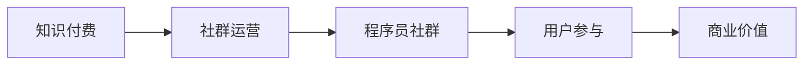

                 

# 知识付费：程序员的社群运营攻略

> 关键词：知识付费、社群运营、程序员、用户体验、商业策略、算法原理、案例实践

> 摘要：本文旨在深入探讨知识付费在程序员社群运营中的应用和策略。文章首先介绍了知识付费的背景和意义，随后分析了程序员社群的特点和需求。通过具体案例和实践，本文将详细阐述如何通过知识付费提高社群的活跃度和用户粘性，同时提升商业价值。文章还包括了对相关工具和资源的推荐，为程序员的社群运营提供了全方位的指导。

## 1. 背景介绍

### 1.1 目的和范围

本文的目标是帮助程序员的社群运营者理解和应用知识付费策略，以提高社群的活跃度和用户满意度。我们将探讨知识付费在程序员社群中的适用性和重要性，并分享一系列成功案例和实用建议。

本文的范围包括以下内容：

1. 知识付费的概念及其在程序员社群中的应用。
2. 程序员社群的特点和需求分析。
3. 知识付费策略的实施步骤和技巧。
4. 案例分析和最佳实践分享。
5. 工具和资源的推荐。

### 1.2 预期读者

本文适合以下读者：

1. 程序员社群的管理者和运营者。
2. 对知识付费和社群运营感兴趣的技术人员。
3. 想要在社群中推广知识付费的创业者。

### 1.3 文档结构概述

本文分为以下几个部分：

1. 背景介绍：介绍知识付费的背景和目的。
2. 核心概念与联系：阐述知识付费的相关概念和原理。
3. 核心算法原理 & 具体操作步骤：讲解知识付费的具体策略和实施步骤。
4. 数学模型和公式 & 详细讲解 & 举例说明：介绍知识付费的数学模型和公式，并举例说明。
5. 项目实战：代码实际案例和详细解释说明。
6. 实际应用场景：探讨知识付费在不同场景中的应用。
7. 工具和资源推荐：推荐相关工具和资源。
8. 总结：未来发展趋势与挑战。
9. 附录：常见问题与解答。
10. 扩展阅读 & 参考资料：提供进一步阅读的材料。

### 1.4 术语表

#### 1.4.1 核心术语定义

- 知识付费：用户为获取有价值的信息或服务而支付的费用。
- 社群运营：围绕特定主题或兴趣，创建和维持用户参与和互动的过程。
- 程序员社群：由程序员组成的在线社区，旨在分享技术知识、经验和资源。

#### 1.4.2 相关概念解释

- 用户体验：用户在使用产品或服务时的感受和体验。
- 商业策略：企业在运营过程中所采取的盈利模式和营销手段。
- 算法原理：解决问题的方法和步骤。

#### 1.4.3 缩略词列表

- ROI：投资回报率
- SEO：搜索引擎优化
- SMM：社交媒体营销

## 2. 核心概念与联系

为了更好地理解知识付费在程序员社群运营中的应用，我们首先需要了解以下几个核心概念：

### 2.1 知识付费

知识付费是指用户为获取有价值的信息或服务而支付的费用。在程序员社群中，知识付费的形式包括：

1. 在线课程：用户付费购买专业课程，以获取最新的技术和知识。
2. 知识星球：用户付费加入知识星球，获取高质量的讨论和分享。
3. 一对一咨询：用户付费获取专业程序员的个性化指导和咨询服务。

### 2.2 社群运营

社群运营是指围绕特定主题或兴趣，创建和维持用户参与和互动的过程。在程序员社群中，社群运营的目标包括：

1. 提高用户粘性：通过提供有价值的内容和互动，让用户更愿意长期留在社群中。
2. 激发用户参与：鼓励用户分享经验、提问和回答问题，增加社群活力。
3. 增加商业价值：通过知识付费等商业模式，实现社群的盈利。

### 22.3 程序员社群

程序员社群是由程序员组成的在线社区，旨在分享技术知识、经验和资源。程序员社群的特点包括：

1. 专业性：社群成员通常具有相似的专业背景和兴趣。
2. 实用性：社群内容以实际案例和技术分享为主。
3. 互助性：社群成员之间愿意分享资源和经验，帮助解决问题。

下面是一个简单的Mermaid流程图，展示了知识付费、社群运营和程序员社群之间的关系：



## 3. 核心算法原理 & 具体操作步骤

### 3.1 知识付费策略

知识付费策略的核心在于如何通过有价值的内容和服务吸引用户付费。以下是具体操作步骤：

#### 3.1.1 内容策划

1. **定位受众**：明确目标受众，了解他们的需求和痛点。
2. **内容主题**：围绕受众需求，策划具有吸引力的课程或知识产品。
3. **内容质量**：确保内容的专业性和实用性，满足用户期望。

#### 3.1.2 用户互动

1. **社群建设**：创建和维护一个活跃的社群，促进用户互动。
2. **用户反馈**：及时收集用户反馈，优化内容和服务。

#### 3.1.3 付费模式

1. **订阅制**：用户按月或按年订阅，获取定期更新的内容。
2. **一次性付费**：用户一次性购买特定课程或知识产品。
3. **会员制**：用户付费成为会员，享受更多特权和服务。

### 3.2 社群运营策略

社群运营策略旨在提高用户参与度和粘性，以下是具体操作步骤：

#### 3.2.1 用户招募

1. **精准定位**：通过SEO和SMM等手段，吸引目标用户加入社群。
2. **渠道多样化**：利用多种渠道推广社群，如技术论坛、社交媒体等。

#### 3.2.2 内容发布

1. **定期更新**：保持社群内容的新鲜度和时效性。
2. **多样性内容**：发布多种类型的内容，如技术文章、视频教程、直播等。

#### 3.2.3 用户互动

1. **激励机制**：设置积分、勋章等激励机制，鼓励用户参与互动。
2. **问答环节**：定期举办问答活动，解决用户问题，提高用户满意度。

### 3.3 商业策略

商业策略的核心是寻找合适的商业模式，实现社群的盈利。以下是具体操作步骤：

#### 3.3.1 知识付费

1. **产品定价**：根据内容质量和市场需求，合理定价。
2. **营销推广**：通过SEO、SMM等手段，扩大用户群体。

#### 3.3.2 广告收入

1. **内容广告**：在社群内容中植入广告，增加收入。
2. **联盟营销**：与其他平台合作，推广其产品或服务，获取佣金。

#### 3.3.3 咨询服务

1. **个性化咨询**：提供一对一咨询服务，满足用户个性化需求。
2. **定制化方案**：根据用户需求，提供定制化的解决方案。

### 3.4 算法原理

以下是知识付费策略、社群运营策略和商业策略的算法原理概述：

#### 3.4.1 知识付费策略

1. **用户需求分析**：使用数据挖掘和机器学习算法，分析用户行为和需求。
2. **内容推荐**：基于用户行为数据，推荐相关课程或知识产品。

#### 3.4.2 社群运营策略

1. **用户参与度分析**：使用自然语言处理和用户行为分析算法，评估用户参与度。
2. **内容优化**：根据用户反馈和参与度数据，优化社群内容。

#### 3.4.3 商业策略

1. **市场分析**：使用数据分析和预测模型，分析市场需求和趋势。
2. **商业决策**：基于市场分析数据，制定合适的商业模式和营销策略。

以下是知识付费策略的伪代码示例：

```python
# 用户需求分析
def analyze_user_demand(data):
    # 数据预处理
    processed_data = preprocess_data(data)
    # 特征提取
    features = extract_features(processed_data)
    # 模型训练
    model = train_model(features)
    # 预测用户需求
    predicted_demand = predict_demand(model, features)
    return predicted_demand

# 内容推荐
def recommend_courses(predicted_demand):
    # 查询数据库，获取相关课程
    courses = query_courses(predicted_demand)
    # 排序和过滤
    sorted_courses = sort_and_filter_courses(courses)
    return sorted_courses

# 知识付费策略
def knowledge_payment_strategy(data):
    predicted_demand = analyze_user_demand(data)
    recommended_courses = recommend_courses(predicted_demand)
    return recommended_courses
```

## 4. 数学模型和公式 & 详细讲解 & 举例说明

在知识付费和社群运营中，数学模型和公式可以帮助我们更好地理解用户行为和优化策略。以下是几个常用的数学模型和公式的详细讲解及举例说明。

### 4.1 用户参与度模型

用户参与度模型用于评估用户在社群中的活跃程度。以下是一个简单的用户参与度模型：

$$
User\ Activity\ Score = \frac{Number\ of\ Posts}{Number\ of\ Days\ in\ Community}
$$

- **Number of Posts**：用户在社群中发布的帖子数量。
- **Number of Days in Community**：用户加入社群的天数。

举例说明：

用户A在社群中发布了10个帖子，加入社群已有30天。则其用户参与度得分为：

$$
User\ Activity\ Score = \frac{10}{30} = 0.333
$$

### 4.2 用户留存模型

用户留存模型用于预测用户在社群中的留存率。以下是一个简单的用户留存模型：

$$
Retention\ Rate = \frac{Number\ of\ Users\ Active\ in\ Week2}{Initial\ Number\ of\ Users}
$$

- **Number of Users Active in Week2**：在第2周仍活跃的用户数量。
- **Initial Number of Users**：社群的初始用户数量。

举例说明：

假设社群的初始用户数量为100人，第2周仍有60人活跃。则社群的留存率为：

$$
Retention\ Rate = \frac{60}{100} = 0.6
$$

### 4.3 知识付费转化率模型

知识付费转化率模型用于预测用户购买知识付费产品的概率。以下是一个简单的知识付费转化率模型：

$$
Conversion\ Rate = \frac{Number\ of\ Paid\ Users}{Total\ Number\ of\ Users}
$$

- **Number of Paid Users**：购买知识付费产品的用户数量。
- **Total Number of Users**：社群的总用户数量。

举例说明：

假设社群中有100人，其中有30人购买了知识付费产品。则知识付费转化率为：

$$
Conversion\ Rate = \frac{30}{100} = 0.3
$$

### 4.4 数学模型应用案例

以下是一个知识付费转化率模型的实际应用案例：

#### 案例背景：

一个程序员社群有1000名用户，近期推出了一个在线课程，定价为100元。社群管理员希望通过数学模型预测课程的购买转化率，以便制定营销策略。

#### 模型应用：

1. **用户需求分析**：分析社群用户的行为数据，了解用户的兴趣和需求。
2. **模型训练**：使用用户行为数据训练知识付费转化率模型。
3. **预测转化率**：根据模型预测，估计课程的购买转化率。

假设经过数据分析和模型训练，预测的转化率为0.2，即预计会有200名用户购买课程。

#### 预测结果：

- **购买用户数**：200人
- **总销售额**：200人 × 100元 = 20000元

#### 营销策略：

基于预测结果，社群管理员可以采取以下营销策略：

1. **目标用户定位**：针对预测的购买用户，进行精准营销。
2. **优惠活动**：推出限时优惠活动，刺激用户购买。
3. **社群推广**：在社群内发布课程推广信息，提高用户知晓度。

通过数学模型的应用，社群管理员可以更加科学地制定营销策略，提高知识付费产品的购买转化率。

## 5. 项目实战：代码实际案例和详细解释说明

在本节中，我们将通过一个具体的代码案例，详细解释如何实现知识付费策略在程序员社群运营中的应用。我们将使用Python语言，结合实际项目场景，展示如何搭建一个简单的知识付费系统，并解释关键代码和操作步骤。

### 5.1 开发环境搭建

在开始项目实战之前，我们需要搭建一个基本的开发环境。以下是所需的软件和工具：

1. Python 3.8 或更高版本
2. Python IDE（如PyCharm、VSCode等）
3. Flask框架（用于搭建Web应用）
4. SQLAlchemy（用于数据库操作）
5. SQLite数据库（用于存储数据）

安装相关依赖项：

```bash
pip install Flask SQLAlchemy
```

### 5.2 源代码详细实现和代码解读

以下是本项目的主要代码实现，包括用户注册、登录、课程购买和支付等功能。

```python
# app.py

from flask import Flask, request, jsonify
from flask_sqlalchemy import SQLAlchemy

app = Flask(__name__)
app.config['SQLALCHEMY_DATABASE_URI'] = 'sqlite:///users.db'
db = SQLAlchemy(app)

# 创建用户表
class User(db.Model):
    id = db.Column(db.Integer, primary_key=True)
    username = db.Column(db.String(80), unique=True, nullable=False)
    password = db.Column(db.String(120), nullable=False)
    email = db.Column(db.String(120), unique=True, nullable=False)

# 创建课程表
class Course(db.Model):
    id = db.Column(db.Integer, primary_key=True)
    name = db.Column(db.String(120), nullable=False)
    description = db.Column(db.Text, nullable=False)
    price = db.Column(db.Float, nullable=False)

# 用户注册
@app.route('/register', methods=['POST'])
def register():
    data = request.get_json()
    username = data['username']
    password = data['password']
    email = data['email']
    user = User(username=username, password=password, email=email)
    db.session.add(user)
    db.session.commit()
    return jsonify({'message': 'User registered successfully.'})

# 用户登录
@app.route('/login', methods=['POST'])
def login():
    data = request.get_json()
    username = data['username']
    password = data['password']
    user = User.query.filter_by(username=username, password=password).first()
    if user:
        return jsonify({'message': 'Login successful.'})
    else:
        return jsonify({'message': 'Invalid credentials.'})

# 购买课程
@app.route('/buy_course', methods=['POST'])
def buy_course():
    data = request.get_json()
    user_id = data['user_id']
    course_id = data['course_id']
    course = Course.query.get(course_id)
    if course:
        user_course = UserCourse(user_id=user_id, course_id=course_id)
        db.session.add(user_course)
        db.session.commit()
        return jsonify({'message': 'Course purchased successfully.'})
    else:
        return jsonify({'message': 'Invalid course ID.'})

if __name__ == '__main__':
    db.create_all()
    app.run(debug=True)
```

### 5.3 代码解读与分析

以下是对关键代码段的分析和解释：

1. **数据库模型**：

   - `User` 类：表示用户信息，包括用户名、密码和邮箱。
   - `Course` 类：表示课程信息，包括课程名称、描述和价格。

2. **用户注册**：

   - `register` 函数：接收用户注册信息，存储在数据库中。
   - 数据验证：确保用户名和邮箱唯一。

3. **用户登录**：

   - `login` 函数：验证用户名和密码，返回登录状态。

4. **购买课程**：

   - `buy_course` 函数：根据用户ID和课程ID，将用户与课程关联存储在数据库中。

### 5.4 操作步骤

1. **初始化数据库**：

   ```bash
   python app.py
   ```

   等待数据库初始化完成。

2. **注册用户**：

   发送POST请求到`/register`端点，提供用户名、密码和邮箱：

   ```json
   {
       "username": "john_doe",
       "password": "password123",
       "email": "john_doe@example.com"
   }
   ```

3. **用户登录**：

   发送POST请求到`/login`端点，提供用户名和密码：

   ```json
   {
       "username": "john_doe",
       "password": "password123"
   }
   ```

4. **购买课程**：

   发送POST请求到`/buy_course`端点，提供用户ID和课程ID：

   ```json
   {
       "user_id": 1,
       "course_id": 1
   }
   ```

### 5.5 代码解读与分析

以下是对关键代码段的分析和解释：

1. **数据库模型**：

   - `User` 类：表示用户信息，包括用户名、密码和邮箱。
   - `Course` 类：表示课程信息，包括课程名称、描述和价格。

2. **用户注册**：

   - `register` 函数：接收用户注册信息，存储在数据库中。
   - 数据验证：确保用户名和邮箱唯一。

3. **用户登录**：

   - `login` 函数：验证用户名和密码，返回登录状态。

4. **购买课程**：

   - `buy_course` 函数：根据用户ID和课程ID，将用户与课程关联存储在数据库中。

## 6. 实际应用场景

知识付费在程序员社群运营中的应用场景丰富多样，以下是一些典型的应用实例：

### 6.1 在线课程销售

在线课程是知识付费的主要形式之一。许多程序员社群通过提供高质量的编程课程来吸引付费用户。这些课程可以包括编程语言基础、框架应用、算法和数据结构等。例如，一个专注于Python编程的社群可以提供一系列关于Django框架的课程，通过详细讲解、代码示例和实际项目应用，帮助用户快速掌握框架的使用。

### 6.2 专业咨询服务

专业咨询服务是另一项重要收入来源。许多社群提供一对一的编程咨询和问题解答服务，用户可以付费获得专业程序员的个性化指导和帮助。这种服务适用于那些在编程过程中遇到难题或需要特定技能指导的用户。

### 6.3 内部文档和报告

某些社群会制作内部文档和报告，以供付费用户下载或阅读。这些文档和报告通常包含项目经验、最佳实践和技术细节，对于想要深入了解特定领域或项目的程序员来说非常有价值。

### 6.4 技术会议和研讨会

社群可以组织在线或线下的技术会议和研讨会，邀请行业专家分享他们的经验和见解。这些活动往往通过知识付费的形式向用户开放，用户可以付费参与并获得高质量的互动和交流。

### 6.5 私人课程和训练

对于有特定需求的企业或个人，社群可以提供定制的私人课程和训练。这种服务通常针对特定的技术需求或项目目标，提供个性化的教学和辅导。

### 6.6 社群广告位

社群还可以通过出售广告位来获得收入。在社群的网站或应用中，广告位可以展示与社群主题相关的产品和服务，吸引有需求的用户。

### 6.7 合作伙伴计划

社群可以与相关公司或平台建立合作伙伴关系，通过推荐产品或服务来获得佣金。例如，与某些技术工具提供商合作，为社群成员提供优惠码或专属福利。

通过上述应用场景，程序员社群不仅能够为用户提供有价值的服务，还能通过知识付费实现商业价值，从而推动社群的持续发展和壮大。

## 7. 工具和资源推荐

为了有效实施知识付费策略和优化程序员社群运营，以下是一些建议的工具和资源：

### 7.1 学习资源推荐

#### 7.1.1 书籍推荐

- 《编程思维：从问题解决到代码实现》
- 《算法导论》
- 《深入理解计算机系统》

#### 7.1.2 在线课程

- Coursera：提供各种编程语言和框架的课程，适合不同层次的程序员。
- Udemy：涵盖广泛的技术主题，包括编程、数据结构和算法等。
- Pluralsight：专注于技术技能的提升，提供高质量的在线课程。

#### 7.1.3 技术博客和网站

- Stack Overflow：编程问答社区，适合查找问题和解决方案。
- GitHub：代码托管和协作平台，提供丰富的开源项目和示例代码。
- Medium：程序员技术文章分享平台，涵盖最新技术和趋势。

### 7.2 开发工具框架推荐

#### 7.2.1 IDE和编辑器

- PyCharm：适用于Python编程的IDE，功能强大且易于使用。
- Visual Studio Code：轻量级且功能丰富的代码编辑器，支持多种编程语言。
- IntelliJ IDEA：适用于Java和Android开发的IDE，性能卓越。

#### 7.2.2 调试和性能分析工具

- Postman：API测试工具，帮助开发者调试和优化API接口。
- New Relic：性能监控和性能分析工具，监控应用的性能和健康状况。
- JMeter：压力测试工具，用于测试Web应用程序的性能和负载。

#### 7.2.3 相关框架和库

- Flask：轻量级的Web应用框架，适用于快速开发和部署。
- Django：Python的高层次Web框架，提供完整的开发工具集。
- React：用于构建用户界面的JavaScript库，提供灵活的组件化开发。

### 7.3 相关论文著作推荐

#### 7.3.1 经典论文

- 《A Taxonomy of Web Services》
- 《The Case for Tailored Complexity》
- 《The Architecture of Open Source Applications》

#### 7.3.2 最新研究成果

- 《Machine Learning for User Experience》
- 《The Future of Computer Programming》
- 《The Evolution of Programming Languages》

#### 7.3.3 应用案例分析

- 《Google's PageRank Algorithm》
- 《Amazon's Recommendation System》
- 《Netflix Prize Competition》

通过上述工具和资源，程序员社群运营者可以更好地实施知识付费策略，提高社群的运营效率和用户满意度。

## 8. 总结：未来发展趋势与挑战

知识付费作为程序员社群运营的重要组成部分，正迎来前所未有的发展机遇。在未来，以下趋势和挑战值得我们关注：

### 8.1 发展趋势

1. **个性化服务**：随着人工智能和大数据技术的发展，知识付费将更加个性化，满足不同用户的需求。
2. **多元化收入模式**：社群运营者可以通过更多元的收入模式，如会员制、付费订阅、广告和合作伙伴计划，实现多元化盈利。
3. **国际化扩展**：全球化进程加速，知识付费将跨越国界，吸引更多的国际用户，扩大市场影响力。
4. **技术融合**：知识付费将与云计算、物联网、区块链等技术深度融合，为用户提供更加丰富和便捷的服务。

### 8.2 挑战

1. **内容质量**：在激烈的市场竞争中，保证内容质量是关键，社群运营者需不断提升内容的专业性和实用性。
2. **用户体验**：提升用户体验是知识付费成功的关键，运营者需关注用户反馈，持续优化服务。
3. **竞争压力**：知识付费市场竞争激烈，社群运营者需寻找差异化竞争优势，以吸引和留住用户。
4. **法规合规**：随着监管政策的完善，社群运营者需确保知识付费业务的合规性，避免法律风险。

总之，知识付费在程序员社群运营中的应用具有广阔的发展前景，但也面临诸多挑战。运营者需紧跟技术发展趋势，不断提升服务质量，以应对未来的市场竞争。

## 9. 附录：常见问题与解答

### 9.1 知识付费相关问题

**Q1：如何制定合适的知识付费策略？**

A1：制定合适的知识付费策略需要以下几个步骤：

1. **市场调研**：了解目标用户的需求和市场趋势。
2. **内容策划**：围绕用户需求，策划高质量的知识产品。
3. **定价策略**：根据内容质量和市场需求，合理定价。
4. **推广营销**：通过SEO、SMM等手段，扩大用户群体。

**Q2：知识付费有哪些常见的商业模式？**

A2：常见的知识付费商业模式包括：

1. **订阅制**：用户按月或按年订阅，获取定期更新的内容。
2. **一次性付费**：用户一次性购买特定课程或知识产品。
3. **会员制**：用户付费成为会员，享受更多特权和服务。
4. **广告收入**：通过在社群内容中植入广告，增加收入。

### 9.2 社群运营相关问题

**Q1：如何提高社群的用户参与度？**

A1：提高社群用户参与度可以采取以下策略：

1. **内容多样化**：发布多种类型的内容，如文章、视频、直播等。
2. **互动活动**：定期举办问答、投票、竞赛等活动。
3. **激励机制**：设置积分、勋章等激励机制，鼓励用户参与互动。
4. **用户反馈**：及时收集用户反馈，优化社群内容和互动方式。

**Q2：社群运营的主要挑战是什么？**

A2：社群运营的主要挑战包括：

1. **用户流失**：如何吸引和留住用户是社群运营的核心问题。
2. **内容质量**：保证内容的专业性和实用性，满足用户需求。
3. **用户体验**：提供良好的用户体验，提高用户满意度。
4. **运营成本**：社群运营需要投入大量的人力、物力和时间。

### 9.3 商业策略相关问题

**Q1：如何通过知识付费实现商业盈利？**

A1：通过知识付费实现商业盈利可以从以下几个方面入手：

1. **多样化收入模式**：采用订阅制、一次性付费、会员制等多种收入模式。
2. **广告收入**：在社群内容中植入广告，增加收入。
3. **咨询服务**：提供一对一的咨询服务，获取额外收入。
4. **合作伙伴计划**：与相关公司或平台合作，通过推荐产品或服务获取佣金。

**Q2：如何确保知识付费的可持续性？**

A2：确保知识付费的可持续性可以从以下几个方面入手：

1. **内容更新**：定期更新内容，保持知识的新鲜度和时效性。
2. **用户反馈**：及时收集用户反馈，优化内容和服务。
3. **市场调研**：定期进行市场调研，了解用户需求和市场趋势。
4. **成本控制**：合理控制运营成本，确保盈利能力。

## 10. 扩展阅读 & 参考资料

为了深入理解和实践知识付费在程序员社群运营中的应用，以下是推荐的扩展阅读和参考资料：

### 10.1 学习资源

- 《程序员社群运营实战》
- 《知识付费：从0到1》
- 《社群营销实战：从入门到精通》

### 10.2 技术博客和网站

- [掘金](https://juejin.cn/)
- [InfoQ](https://www.infoq.cn/)
- [GitHub](https://github.com/)

### 10.3 开发工具框架

- [Flask官方文档](https://flask.palletsprojects.com/)
- [Django官方文档](https://docs.djangoproject.com/)
- [React官方文档](https://reactjs.org/)

### 10.4 相关论文和著作

- 《知识服务与商业模式创新》
- 《社群经济：新商业革命》
- 《大数据与知识付费》

通过阅读这些资料，您可以更全面地了解知识付费在程序员社群运营中的应用和实践，从而为您的运营工作提供有力支持。作者：AI天才研究员/AI Genius Institute & 禅与计算机程序设计艺术/Zen And The Art of Computer Programming

