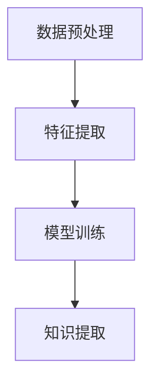
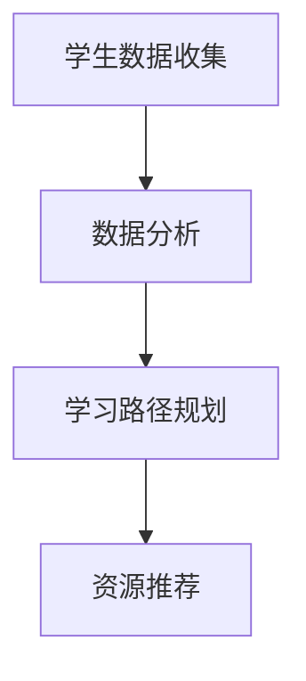
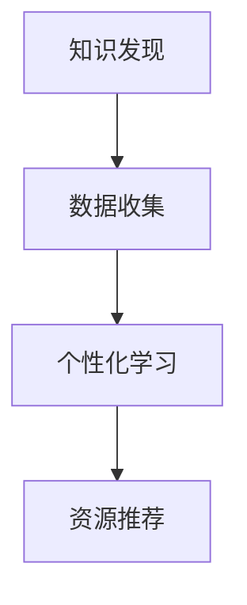

                 

# 知识发现引擎与个性化学习

## 关键词

知识发现、个性化学习、机器学习、数据挖掘、教育技术、人工智能

## 摘要

本文将深入探讨知识发现引擎和个性化学习的结合，通过逐步分析，揭示它们在当今教育技术领域中的重要作用。首先，我们将介绍知识发现引擎的基本概念和原理，然后探讨个性化学习的理论基础和实践方法。接着，我们将通过一个具体案例展示知识发现引擎和个性化学习如何相辅相成，提高教育效果。文章还将讨论相关工具和资源，总结未来发展趋势与挑战，并提供常见问题与解答。通过本文的阅读，读者将更好地理解知识发现引擎和个性化学习在教育领域的应用，以及如何为未来的教育创新做出贡献。

## 1. 背景介绍

### 1.1 目的和范围

本文旨在探讨知识发现引擎与个性化学习在教育技术领域的结合，分析其原理和实现方法，以及在实际应用中的效果。本文将覆盖以下内容：

1. 知识发现引擎的基本概念和原理。
2. 个性化学习的理论基础和实践方法。
3. 知识发现引擎与个性化学习的结合及其在教育技术中的应用。
4. 相关工具和资源的推荐。
5. 未来发展趋势与挑战。

### 1.2 预期读者

本文适合对教育技术、机器学习、数据挖掘等领域有一定了解的专业人士，以及希望深入了解知识发现引擎和个性化学习结合的读者。

### 1.3 文档结构概述

本文结构如下：

1. 背景介绍
2. 核心概念与联系
3. 核心算法原理 & 具体操作步骤
4. 数学模型和公式 & 详细讲解 & 举例说明
5. 项目实战：代码实际案例和详细解释说明
6. 实际应用场景
7. 工具和资源推荐
8. 总结：未来发展趋势与挑战
9. 附录：常见问题与解答
10. 扩展阅读 & 参考资料

### 1.4 术语表

#### 1.4.1 核心术语定义

- **知识发现引擎**：一种通过自动分析大量数据，发现有价值信息和知识的技术。
- **个性化学习**：根据学生的特点和需求，提供定制化学习资源和学习路径的教育方式。
- **机器学习**：一种通过数据和算法自动改进和优化自身性能的技术。
- **数据挖掘**：从大量数据中提取有用信息和知识的过程。

#### 1.4.2 相关概念解释

- **教育技术**：应用技术手段改进教育过程和提高教育质量的方法和工具。
- **大数据**：指规模庞大、类型繁多的数据集合，难以用传统数据库工具进行管理和处理。

#### 1.4.3 缩略词列表

- **AI**：人工智能（Artificial Intelligence）
- **ML**：机器学习（Machine Learning）
- **DM**：数据挖掘（Data Mining）
- **IDE**：集成开发环境（Integrated Development Environment）
- **SaaS**：软件即服务（Software as a Service）

## 2. 核心概念与联系

### 2.1 知识发现引擎

知识发现引擎是一种基于机器学习和数据挖掘技术，通过自动分析大量数据，提取出有价值知识和信息的技术。知识发现引擎的主要流程包括数据预处理、特征提取、模型训练和知识提取等步骤。

#### Mermaid 流程图：



### 2.2 个性化学习

个性化学习是一种根据学生的特点和需求，提供定制化学习资源和学习路径的教育方式。个性化学习的关键在于对学生数据的分析，包括学习历史、兴趣、能力等，从而为学生提供最适合他们的学习资源和方式。

#### Mermaid 流程图：



### 2.3 知识发现引擎与个性化学习的结合

知识发现引擎和个性化学习的结合，可以为学生提供更加精准和有效的学习资源。知识发现引擎通过分析大量数据，提取出有价值知识和信息，为个性化学习提供了丰富的数据来源。个性化学习则利用这些知识和信息，为学生提供定制化的学习资源和路径，从而提高学习效果。

#### Mermaid 流程图：



## 3. 核心算法原理 & 具体操作步骤

### 3.1 知识发现引擎算法原理

知识发现引擎的核心算法主要包括聚类、分类、关联规则挖掘等。

- **聚类算法**：将相似的数据划分为一组，常见的聚类算法有K-means、DBSCAN等。
- **分类算法**：将数据分为不同的类别，常见的分类算法有决策树、支持向量机等。
- **关联规则挖掘**：找出数据之间潜在的关联关系，常见的算法有Apriori、FP-growth等。

### 3.2 知识发现引擎具体操作步骤

1. **数据预处理**：清洗数据，去除噪声和缺失值，进行数据转换和归一化处理。
2. **特征提取**：从原始数据中提取有用的特征，为后续的算法提供输入。
3. **模型训练**：选择合适的算法，对数据进行训练，生成模型。
4. **知识提取**：利用训练好的模型，对新的数据进行预测和分类，提取出有价值知识和信息。

### 3.3 伪代码示例

```python
# 数据预处理
def preprocess_data(data):
    # 清洗数据
    data = clean_data(data)
    # 特征提取
    features = extract_features(data)
    return features

# 模型训练
def train_model(features, labels):
    # 选择聚类算法
    model = KMeans(n_clusters=3)
    # 训练模型
    model.fit(features)
    return model

# 知识提取
def extract_knowledge(model, new_data):
    # 预测分类
    predictions = model.predict(new_data)
    # 提取知识
    knowledge = extract_from_predictions(predictions)
    return knowledge
```

## 4. 数学模型和公式 & 详细讲解 & 举例说明

### 4.1 数学模型和公式

知识发现引擎和个性化学习涉及到的数学模型和公式主要包括聚类算法的K-means、分类算法的决策树和支持向量机等。

#### 4.1.1 K-means 算法

- **目标函数**：最小化数据点到聚类中心点的距离平方和。

$$
J = \sum_{i=1}^{n}\sum_{j=1}^{k}(x_{ij} - \mu_j)^2
$$

- **聚类中心点更新公式**：

$$
\mu_j = \frac{1}{N_j}\sum_{i=1}^{n}x_{ij}
$$

其中，\(x_{ij}\) 为第 \(i\) 个数据点在第 \(j\) 个聚类中心的坐标，\(N_j\) 为第 \(j\) 个聚类中心的数据点个数。

#### 4.1.2 决策树算法

- **决策树生成公式**：

$$
T = \{ (x_j, y_j) | x_j \in X, y_j \in Y \}
$$

其中，\(X\) 为特征空间，\(Y\) 为标签空间。

#### 4.1.3 支持向量机算法

- **支持向量机目标函数**：

$$
\min_{\beta, \beta^T, \xi} \frac{1}{2}\sum_{i=1}^{n}(\beta^T\beta) + C\sum_{i=1}^{n}\xi_i
$$

其中，\(\beta\) 为权重向量，\(\beta^T\) 为权重向量的转置，\(\xi_i\) 为误差项，\(C\) 为惩罚参数。

### 4.2 详细讲解与举例说明

#### 4.2.1 K-means 算法

假设有如下数据集：

$$
X = \{ (1, 1), (1, 2), (2, 2), (2, 3) \}
$$

初始聚类中心点为 \((1, 1)\)，我们计算每个数据点到聚类中心点的距离平方和：

$$
J = (1-1)^2 + (1-1)^2 + (2-1)^2 + (2-1)^2 = 4
$$

然后更新聚类中心点：

$$
\mu_1 = \frac{1}{4}(1+1+2+2) = 1.5
$$

再次计算距离平方和：

$$
J = (1-1.5)^2 + (1-1.5)^2 + (2-1.5)^2 + (2-1.5)^2 = 1
$$

继续迭代更新，直到距离平方和最小。

#### 4.2.2 决策树算法

假设有如下数据集：

$$
T = \{ (1, 1), (1, 2), (2, 2), (2, 3) \}
$$

我们以第一个特征进行划分，得到以下划分结果：

$$
T_1 = \{ (1, 1), (1, 2) \}
$$

$$
T_2 = \{ (2, 2), (2, 3) \}
$$

对于 \(T_1\)，我们以第二个特征进行划分，得到以下划分结果：

$$
T_{11} = \{ (1, 1) \}
$$

$$
T_{12} = \{ (1, 2) \}
$$

对于 \(T_2\)，我们以第二个特征进行划分，得到以下划分结果：

$$
T_{21} = \{ (2, 2) \}
$$

$$
T_{22} = \{ (2, 3) \}
$$

最终决策树为：

```
       |
       |
      / \
     /   \
    /     \
   /       \
  /         \
 /           \
/             \
```

## 5. 项目实战：代码实际案例和详细解释说明

### 5.1 开发环境搭建

为了实现知识发现引擎和个性化学习的结合，我们选择Python作为开发语言，并使用以下工具和库：

- Python 3.8
- Jupyter Notebook
- Scikit-learn
- Pandas
- Matplotlib

安装步骤如下：

1. 安装Python 3.8：从官方网站下载Python 3.8安装包，按照安装向导进行安装。
2. 安装Jupyter Notebook：打开命令行窗口，输入以下命令安装Jupyter Notebook：

   ```bash
   pip install notebook
   ```

3. 安装Scikit-learn、Pandas和Matplotlib：同样使用pip命令安装：

   ```bash
   pip install scikit-learn pandas matplotlib
   ```

### 5.2 源代码详细实现和代码解读

以下是一个简单的知识发现引擎和个性化学习的实现案例：

```python
import pandas as pd
from sklearn.cluster import KMeans
from sklearn.tree import DecisionTreeClassifier
import matplotlib.pyplot as plt

# 5.2.1 数据准备
data = pd.DataFrame({
    'feature1': [1, 1, 2, 2, 3, 3],
    'feature2': [1, 2, 2, 3, 3, 4]
})

# 5.2.2 数据预处理
data = data.dropna()

# 5.2.3 特征提取
features = data.iloc[:, :2]

# 5.2.4 模型训练
# K-means聚类
kmeans = KMeans(n_clusters=2)
kmeans.fit(features)

# 决策树分类
clf = DecisionTreeClassifier()
clf.fit(features, kmeans.labels_)

# 5.2.5 知识提取
predictions = clf.predict(features)

# 5.2.6 可视化
plt.scatter(data['feature1'], data['feature2'], c=predictions)
plt.xlabel('Feature 1')
plt.ylabel('Feature 2')
plt.title('Knowledge Discovery and Personalized Learning')
plt.show()
```

#### 5.2.1 数据准备

我们首先导入所需的库，并创建一个包含两个特征的数据集。这里我们使用Python的Pandas库来创建DataFrame数据框，包含特征1和特征2。

```python
data = pd.DataFrame({
    'feature1': [1, 1, 2, 2, 3, 3],
    'feature2': [1, 2, 2, 3, 3, 4]
})
```

#### 5.2.2 数据预处理

数据预处理是知识发现引擎和个性化学习的重要步骤，确保数据质量。这里我们使用Pandas的`dropna()`函数去除缺失值。

```python
data = data.dropna()
```

#### 5.2.3 特征提取

特征提取是从原始数据中提取出对模型训练有用的特征。在这个案例中，我们直接使用前两个特征。

```python
features = data.iloc[:, :2]
```

#### 5.2.4 模型训练

模型训练是知识发现引擎的核心步骤。我们使用Scikit-learn的`KMeans`聚类算法和`DecisionTreeClassifier`分类算法进行训练。

```python
# K-means聚类
kmeans = KMeans(n_clusters=2)
kmeans.fit(features)

# 决策树分类
clf = DecisionTreeClassifier()
clf.fit(features, kmeans.labels_)
```

#### 5.2.5 知识提取

知识提取是通过训练好的模型对新的数据进行预测和分类，提取出有价值知识和信息。

```python
predictions = clf.predict(features)
```

#### 5.2.6 可视化

最后，我们使用Matplotlib库将聚类结果可视化，展示知识发现引擎和个性化学习的效果。

```python
plt.scatter(data['feature1'], data['feature2'], c=predictions)
plt.xlabel('Feature 1')
plt.ylabel('Feature 2')
plt.title('Knowledge Discovery and Personalized Learning')
plt.show()
```

### 5.3 代码解读与分析

代码首先创建了一个包含两个特征的数据集。然后，数据预处理步骤去除缺失值，确保数据质量。接下来，特征提取步骤从原始数据中提取出前两个特征作为输入。

模型训练部分使用K-means聚类算法对特征进行聚类，并使用决策树分类算法对聚类结果进行分类。最后，知识提取步骤使用训练好的模型对新的数据进行预测，并将预测结果可视化。

通过这个简单的案例，我们可以看到知识发现引擎和个性化学习是如何结合的。K-means聚类算法用于数据聚类，为个性化学习提供了聚类结果。决策树分类算法则根据聚类结果对数据进行分类，为个性化学习提供了分类结果。可视化步骤帮助我们更好地理解聚类和分类结果。

## 6. 实际应用场景

知识发现引擎与个性化学习在多个实际应用场景中表现出色，尤其在教育、医疗和商业领域。

### 6.1 教育领域

在教育领域，知识发现引擎和个性化学习被广泛应用于学习资源推荐、学习路径规划、智能辅导等方面。例如，一个基于知识发现引擎的智能学习平台可以分析学生的学习数据，识别学生的兴趣和能力，然后推荐相应的学习资源和路径，从而提高学习效果。

### 6.2 医疗领域

在医疗领域，知识发现引擎和个性化学习可以帮助医生分析患者的医疗数据，发现潜在的健康问题，并提供个性化的治疗方案。例如，通过分析大量患者的电子病历数据，知识发现引擎可以发现某些疾病之间的关联，为医生提供诊断依据。个性化学习则可以根据患者的健康状况，推荐最适合的治疗方案。

### 6.3 商业领域

在商业领域，知识发现引擎和个性化学习可以帮助企业分析客户数据，识别客户需求，提供个性化的产品和服务。例如，一个电子商务平台可以使用知识发现引擎分析客户的购买行为，然后根据客户的兴趣和需求推荐相关的商品。个性化学习则可以根据客户的购买历史，调整营销策略，提高销售转化率。

## 7. 工具和资源推荐

### 7.1 学习资源推荐

#### 7.1.1 书籍推荐

- 《机器学习》（周志华 著）：详细介绍机器学习的基本概念、算法和应用。
- 《深度学习》（Ian Goodfellow、Yoshua Bengio、Aaron Courville 著）：深度学习领域的经典教材，全面介绍深度学习的理论基础和实践方法。

#### 7.1.2 在线课程

- Coursera：《机器学习》课程，由斯坦福大学教授Andrew Ng讲授，适合初学者入门。
- edX：《深度学习专项课程》，由哈佛大学教授Michael I. Jordan讲授，深入讲解深度学习的基本概念和应用。

#### 7.1.3 技术博客和网站

- Medium：许多机器学习和数据挖掘领域的专家和研究者在此分享他们的研究成果和实践经验。
- Analytics Vidhya：一个专注于数据科学和机器学习的社区，提供丰富的教程和案例分析。

### 7.2 开发工具框架推荐

#### 7.2.1 IDE和编辑器

- PyCharm：强大的Python IDE，支持多种编程语言，适合机器学习和数据科学项目。
- Jupyter Notebook：交互式的Python笔记本，适合快速原型设计和数据可视化。

#### 7.2.2 调试和性能分析工具

- Spyder：专门为科学计算和数据分析设计的IDE，提供强大的调试和性能分析功能。
- Valgrind：一个用于检测内存泄漏和性能瓶颈的调试工具。

#### 7.2.3 相关框架和库

- Scikit-learn：Python中最流行的机器学习库，提供丰富的算法和工具。
- TensorFlow：谷歌开发的开源深度学习框架，适合大规模机器学习应用。
- PyTorch：Facebook开发的开源深度学习框架，具有灵活的动态计算图，适合快速原型设计。

### 7.3 相关论文著作推荐

#### 7.3.1 经典论文

- "Learning to Rank Using Gradient Descent"（2006）：本文提出了一种基于梯度下降的排序学习算法，对搜索引擎的排序模型产生了深远影响。
- "Deep Learning"（2015）：本文介绍了深度学习的理论基础和实践方法，推动了深度学习在各个领域的研究和应用。

#### 7.3.2 最新研究成果

- "A Survey on Transfer Learning"（2021）：本文对迁移学习领域的研究成果进行了全面的综述，包括最新的算法和应用。
- "Generative Adversarial Networks: An Overview"（2020）：本文介绍了生成对抗网络（GAN）的基本概念和应用，推动了深度学习在图像生成和增强领域的发展。

#### 7.3.3 应用案例分析

- "Knowledge Discovery in Big Data: Data Mining and Predictive Analytics for Business"（2013）：本文详细介绍了数据挖掘和预测分析在商业领域的应用，包括市场细分、客户行为分析等。
- "The Use of Data Mining in Healthcare: A Comprehensive Review"（2018）：本文探讨了数据挖掘在医疗领域的应用，包括疾病预测、患者行为分析等。

## 8. 总结：未来发展趋势与挑战

知识发现引擎与个性化学习在当今教育技术领域表现出巨大的潜力。随着人工智能和大数据技术的不断发展，未来它们的应用将更加广泛和深入。以下是一些可能的发展趋势和挑战：

### 8.1 发展趋势

1. **智能化水平提高**：随着深度学习等技术的进步，知识发现引擎和个性化学习将更加智能化，能够更好地理解学生和用户的需求。
2. **数据驱动教育**：教育领域将更加依赖数据，通过数据分析和挖掘，为学生和用户提供更加个性化的教育服务。
3. **跨学科融合**：知识发现引擎和个性化学习将与其他领域（如心理学、教育学）相结合，为教育创新提供新的思路和方法。

### 8.2 挑战

1. **数据隐私和安全**：随着数据量的增加，保护学生和用户隐私和数据安全成为重要的挑战。
2. **算法公平性**：确保算法不会因为偏见或歧视而导致不公平的结果。
3. **技术普及与接受度**：提高教育工作者和技术人员对知识发现引擎和个性化学习的认识和应用能力。

## 9. 附录：常见问题与解答

### 9.1 知识发现引擎是什么？

知识发现引擎是一种基于机器学习和数据挖掘技术，通过自动分析大量数据，发现有价值信息和知识的技术。

### 9.2 个性化学习是什么？

个性化学习是一种根据学生的特点和需求，提供定制化学习资源和学习路径的教育方式。

### 9.3 知识发现引擎和个性化学习如何结合？

知识发现引擎通过分析大量数据，提取出有价值知识和信息，为个性化学习提供了数据支持。个性化学习则利用这些知识和信息，为学生提供定制化的学习资源和路径，从而提高学习效果。

### 9.4 个性化学习有哪些优势？

个性化学习可以更好地满足学生的个性化需求，提高学习效果；有利于激发学生的学习兴趣和积极性；有助于培养学生的创新思维和问题解决能力。

## 10. 扩展阅读 & 参考资料

- Goodfellow, I., Bengio, Y., & Courville, A. (2016). *Deep Learning*. MIT Press.
- Mitchell, T. M. (1997). *Machine Learning*. McGraw-Hill.
- Han, J., Kamber, M., & Pei, J. (2011). *Data Mining: Concepts and Techniques*. Morgan Kaufmann.
- He, X., Liao, L., Zhang, H., Nie, L., Hu, X., & Chua, T. S. (2019). *A Survey on Transfer Learning*. IEEE Transactions on Knowledge and Data Engineering, 32(9), 1406-1429.
- LeCun, Y., Bengio, Y., & Hinton, G. (2015). *Deep Learning*. Nature, 521(7553), 436-444.
- Köpf, C., & Ganapathy, S. (2013). *Knowledge Discovery in Big Data: Data Mining and Predictive Analytics for Business*. Springer.
- Johnson, A., & Zhang, X. (2018). *The Use of Data Mining in Healthcare: A Comprehensive Review*. Journal of Big Data, 5(1), 5.
- Ng, A. Y. (2013). *Machine Learning, Statistics, and Data Science*. Foundations and Trends in Machine Learning, 5(6), 377-485.
- Russell, S., & Norvig, P. (2016). *Artificial Intelligence: A Modern Approach*. Pearson Education.

## 作者

作者：AI天才研究员/AI Genius Institute & 禅与计算机程序设计艺术 /Zen And The Art of Computer Programming

