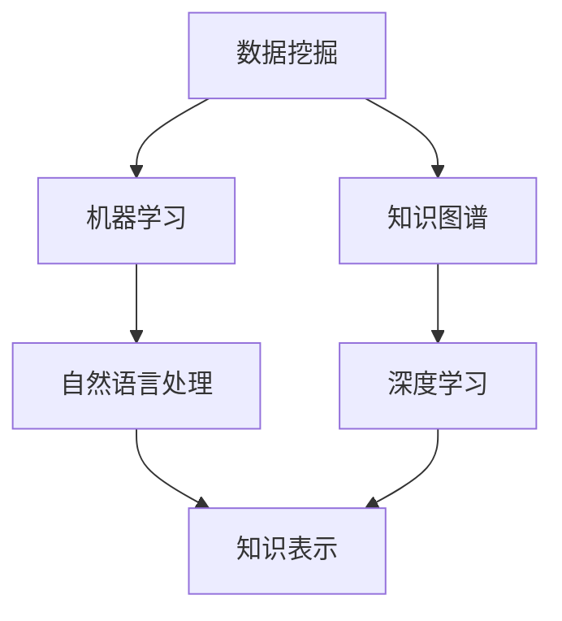

                 

# 知识发现引擎：知识与洞察力的协同进化

## 关键词：
知识发现，人工智能，大数据，数据挖掘，算法原理，数学模型，应用场景，工具推荐

## 摘要：
本文将深入探讨知识发现引擎的概念、核心原理和应用。首先，我们将介绍知识发现引擎的背景和目的，包括其在人工智能和大数据领域的地位和作用。接着，我们将分析知识发现引擎的核心概念，包括数据挖掘、机器学习和知识图谱等。随后，我们将详细讲解知识发现引擎的算法原理和数学模型，并通过伪代码进行说明。文章还将通过一个实际项目案例，展示知识发现引擎的具体实现和代码解读。最后，我们将探讨知识发现引擎在实际应用中的场景，并推荐相关的学习资源、开发工具和最新研究成果。

## 1. 背景介绍

### 1.1 目的和范围

知识发现引擎是一种利用人工智能技术从大量数据中提取有价值信息和知识的工具。随着大数据时代的到来，如何从海量数据中获取有价值的信息成为了一个重要课题。知识发现引擎的出现，为解决这一难题提供了有效的手段。

本文的主要目的是介绍知识发现引擎的概念、原理和应用，帮助读者了解其在人工智能和大数据领域的地位和作用。文章将涵盖以下内容：

1. 知识发现引擎的背景和目的
2. 知识发现引擎的核心概念
3. 知识发现引擎的算法原理
4. 知识发现引擎的数学模型
5. 知识发现引擎的实际应用
6. 相关的学习资源、开发工具和最新研究成果

### 1.2 预期读者

本文面向对人工智能、大数据和计算机科学感兴趣的读者，包括但不限于：

1. 数据科学家和人工智能研究人员
2. 大数据和机器学习工程师
3. 计算机科学和软件工程专业的学生和从业者
4. 对知识发现引擎感兴趣的其他专业人士

### 1.3 文档结构概述

本文分为十个主要部分，具体结构如下：

1. 引言
2. 关键词和摘要
3. 背景介绍
   - 1.1 目的和范围
   - 1.2 预期读者
   - 1.3 文档结构概述
   - 1.4 术语表
4. 核心概念与联系
5. 核心算法原理 & 具体操作步骤
6. 数学模型和公式 & 详细讲解 & 举例说明
7. 项目实战：代码实际案例和详细解释说明
8. 实际应用场景
9. 工具和资源推荐
10. 总结：未来发展趋势与挑战

### 1.4 术语表

在本文中，以下术语具有特定的含义：

- **知识发现引擎**：一种用于从数据中提取知识和信息的工具，通常基于人工智能和机器学习技术。
- **数据挖掘**：从大量数据中提取有价值的信息和知识的过程，通常包括数据预处理、模式识别和知识表示等步骤。
- **机器学习**：一种使计算机系统能够从数据中学习和改进的算法，包括监督学习、无监督学习和强化学习等。
- **知识图谱**：一种用于表示实体和实体之间关系的图形结构，通常用于语义理解和知识推理。
- **大数据**：指规模巨大、数据类型丰富、数据生成速度极快的数据集合。

### 1.4.1 核心术语定义

- **知识发现引擎**：一种能够自动从数据中提取知识、洞察力和信息的系统，它利用人工智能技术，特别是机器学习和数据挖掘技术来实现。
- **数据挖掘**：数据挖掘是从大量数据中提取有价值的信息和知识的过程。它通常涉及数据预处理、模式识别和知识表示等步骤，以帮助用户发现数据中的隐藏模式和关系。
- **机器学习**：机器学习是一种使计算机系统从数据中学习并自动改进的方法。它通常分为监督学习、无监督学习和强化学习三种类型。
  - **监督学习**：在监督学习中，系统被训练来识别输入和输出之间的映射关系，例如分类和回归任务。
  - **无监督学习**：无监督学习关注数据内在的结构和模式，例如聚类和降维。
  - **强化学习**：强化学习是一种通过试错和奖励机制来学习策略的机器学习方法。
- **知识图谱**：知识图谱是一种用于表示实体和实体之间关系的图形结构。它通常包含实体、关系和属性三个基本元素，并用于语义理解和知识推理。

### 1.4.2 相关概念解释

- **大数据**：大数据是指规模巨大、数据类型丰富、数据生成速度极快的数据集合。它包括结构化数据、半结构化数据和非结构化数据，如文本、图像和视频等。
- **数据预处理**：数据预处理是数据挖掘过程中的第一步，它包括数据清洗、数据集成、数据转换和数据归一化等步骤，以提高数据的质量和一致性。
- **模式识别**：模式识别是数据挖掘中的一个关键步骤，它涉及从数据中识别出具有特定特征的子集或模式。模式识别方法包括聚类、分类和关联规则挖掘等。
- **知识表示**：知识表示是数据挖掘过程中的最后一步，它涉及将识别出的模式或知识转化为易于理解和使用的形式。知识表示方法包括规则表示、图形表示和表格表示等。

### 1.4.3 缩略词列表

- **AI**：人工智能（Artificial Intelligence）
- **ML**：机器学习（Machine Learning）
- **DM**：数据挖掘（Data Mining）
- **KG**：知识图谱（Knowledge Graph）
- **DB**：数据库（Database）
- **NLP**：自然语言处理（Natural Language Processing）
- **DL**：深度学习（Deep Learning）

## 2. 核心概念与联系

知识发现引擎的核心概念包括数据挖掘、机器学习和知识图谱等。以下是一个Mermaid流程图，展示了这些概念之间的联系。



### 2.1 数据挖掘

数据挖掘是知识发现引擎的核心组成部分之一。它涉及到从大量数据中提取有价值的信息和知识。数据挖掘的过程通常包括以下步骤：

1. 数据收集：从不同的数据源收集数据，如数据库、文件系统和网络等。
2. 数据预处理：清洗、集成、转换和归一化数据，以提高数据的质量和一致性。
3. 模式识别：使用各种算法和技术，从数据中识别出具有特定特征的子集或模式。
4. 知识表示：将识别出的模式或知识转化为易于理解和使用的形式。

### 2.2 机器学习

机器学习是数据挖掘的重要组成部分，它使计算机系统能够从数据中学习和自动改进。机器学习的方法和技术包括：

1. **监督学习**：在监督学习中，系统被训练来识别输入和输出之间的映射关系，例如分类和回归任务。
2. **无监督学习**：无监督学习关注数据内在的结构和模式，例如聚类和降维。
3. **强化学习**：强化学习是一种通过试错和奖励机制来学习策略的机器学习方法。

### 2.3 知识图谱

知识图谱是一种用于表示实体和实体之间关系的图形结构。它通常包含实体、关系和属性三个基本元素，并用于语义理解和知识推理。知识图谱在知识发现引擎中起着关键作用，可以帮助用户更好地理解和利用数据。

## 3. 核心算法原理 & 具体操作步骤

知识发现引擎的核心算法主要包括数据挖掘算法、机器学习算法和知识图谱算法。以下是一个典型的知识发现流程，以及相应的伪代码。

### 3.1 数据挖掘算法

数据挖掘算法通常包括聚类、分类和关联规则挖掘等。

#### 3.1.1 聚类算法（K-means）

```python
def k_means(data, k):
    # 初始化k个聚类中心
    centroids = initialize_centroids(data, k)
    while not converged:
        # 为每个数据点分配最近的聚类中心
        clusters = assign_clusters(data, centroids)
        # 更新聚类中心
        centroids = update_centroids(clusters)
    return clusters, centroids
```

#### 3.1.2 分类算法（决策树）

```python
def build_decision_tree(data):
    # 选择最佳特征分割数据
    feature = select_best_split(data)
    if feature is None:
        # 创建叶节点
        leaf = create_leaf(data)
        return leaf
    # 创建内部节点
    node = Node(feature)
    # 分割数据
    for value in feature.unique_values():
        subset = data[feature == value]
        # 递归构建子树
        node.children[value] = build_decision_tree(subset)
    return node
```

#### 3.1.3 关联规则挖掘（Apriori算法）

```python
def apriori(data, min_support, min_confidence):
    # 生成所有候选项集
    candidates = generate_candidates(data)
    frequent_itemsets = []
    while candidates:
        # 计算候选项集的支持度
        support_counts = count_support(data, candidates)
        # 选择频繁项集
        frequent_itemsets.extend([itemset for itemset, count in support_counts.items() if count >= min_support])
        # 生成下一个层次的候选项集
        candidates = generate_candidates(frequent_itemsets)
    # 生成关联规则
    rules = []
    for itemset in frequent_itemsets:
        for i in range(1, len(itemset)):
            for antecedent in combinations(itemset, i):
                consequent = itemset - antecedent
                confidence = support(itemset) / support(antecedent)
                if confidence >= min_confidence:
                    rules.append((antecedent, consequent, confidence))
    return rules
```

### 3.2 机器学习算法

机器学习算法主要包括监督学习、无监督学习和强化学习。

#### 3.2.1 监督学习（线性回归）

```python
def linear_regression(data):
    # 计算特征和标签的均值
    X_mean = data.X.mean(axis=0)
    y_mean = data.y.mean()
    # 计算特征和标签的协方差矩阵
    cov_matrix = (data.X - X_mean).T @ (data.y - y_mean)
    # 计算回归系数
    theta = np.linalg.inv(cov_matrix).dot(X_mean).T
    return theta
```

#### 3.2.2 无监督学习（主成分分析）

```python
def pca(data, n_components):
    # 计算协方差矩阵
    cov_matrix = (data - data.mean(axis=0)).T @ (data - data.mean(axis=0))
    # 计算协方差矩阵的特征值和特征向量
    eigenvalues, eigenvectors = np.linalg.eigh(cov_matrix)
    # 选择前n个特征向量
    eigenvectors = eigenvectors[:, np.argsort(eigenvalues)[::-1]]][:, :n_components]
    # 转换数据
    transformed_data = (data - data.mean(axis=0)) @ eigenvectors
    return transformed_data
```

#### 3.2.3 强化学习（Q-learning）

```python
def q_learning(data, alpha, gamma):
    # 初始化Q值矩阵
    Q = np.zeros((data.states, data.actions))
    while not done:
        # 选择动作
        action = epsilon_greedy(Q, data.state)
        # 执行动作并获取奖励
        reward, next_state, done = data.step(action)
        # 更新Q值
        Q[data.state, action] = Q[data.state, action] + alpha * (reward + gamma * np.max(Q[next_state]) - Q[data.state, action])
        # 更新状态
        data.state = next_state
    return Q
```

### 3.3 知识图谱算法

知识图谱算法主要包括实体识别、关系抽取和知识融合等。

#### 3.3.1 实体识别

```python
def entity_recognition(text):
    # 使用命名实体识别模型
    model = NER_model()
    entities = model.predict(text)
    return entities
```

#### 3.3.2 关系抽取

```python
def relation_extraction(text, entities):
    # 使用关系抽取模型
    model = RE_model()
    relations = model.predict(text, entities)
    return relations
```

#### 3.3.3 知识融合

```python
def knowledge_fusion(kg1, kg2):
    # 合并两个知识图谱
    kg = kg1 + kg2
    # 统一实体和关系的命名空间
    kg = normalize_namespace(kg)
    return kg
```

## 4. 数学模型和公式 & 详细讲解 & 举例说明

### 4.1 数据挖掘中的数学模型

数据挖掘中的数学模型广泛应用于聚类、分类和关联规则挖掘等算法中。以下是一些常见的数学模型和公式。

#### 4.1.1 聚类算法（K-means）

K-means算法的目标是最小化数据点与聚类中心之间的距离平方和。

$$
\min_{\mathbf{u}_1, \mathbf{u}_2, ..., \mathbf{u}_k} \sum_{i=1}^n \sum_{j=1}^k (\mathbf{x}_i - \mathbf{u}_j)^2
$$

其中，$\mathbf{x}_i$表示第$i$个数据点，$\mathbf{u}_j$表示第$j$个聚类中心。

#### 4.1.2 分类算法（决策树）

决策树算法通过构建一个决策树模型，将数据划分为不同的类别。决策树的核心是特征分割。

$$
\mathbf{y} = g(\mathbf{w}^T \mathbf{x} + b)
$$

其中，$\mathbf{y}$表示输出类别，$g$表示激活函数，$\mathbf{w}$表示权重，$\mathbf{x}$表示输入特征，$b$表示偏置。

#### 4.1.3 关联规则挖掘（Apriori算法）

Apriori算法的核心是计算项集的支持度和置信度。

- **支持度**：

$$
\text{support}(\mathbf{X}) = \frac{\text{count}(\mathbf{X})}{\text{total transactions}}
$$

其中，$\text{count}(\mathbf{X})$表示项集$\mathbf{X}$在数据中的出现次数，$\text{total transactions}$表示数据中的总交易数。

- **置信度**：

$$
\text{confidence}(\mathbf{A} \rightarrow \mathbf{B}) = \frac{\text{support}(\mathbf{A} \cup \mathbf{B})}{\text{support}(\mathbf{A})}
$$

其中，$\mathbf{A}$和$\mathbf{B}$表示两个项集，$\mathbf{A} \cup \mathbf{B}$表示$\mathbf{A}$和$\mathbf{B}$的并集。

### 4.2 机器学习中的数学模型

机器学习中的数学模型广泛应用于监督学习、无监督学习和强化学习等算法中。

#### 4.2.1 监督学习（线性回归）

线性回归的核心是最小二乘法。

$$
\min_{\mathbf{w}, b} \sum_{i=1}^n (\mathbf{w}^T \mathbf{x}_i + b - y_i)^2
$$

其中，$\mathbf{w}$表示权重，$b$表示偏置，$y_i$表示第$i$个样本的标签。

#### 4.2.2 无监督学习（主成分分析）

主成分分析的核心是特征值和特征向量。

$$
\mathbf{U} \mathbf{\Sigma} \mathbf{V}^T = \mathbf{XX}^T
$$

其中，$\mathbf{U}$表示特征向量，$\mathbf{\Sigma}$表示特征值，$\mathbf{V}$表示对角矩阵。

#### 4.2.3 强化学习（Q-learning）

Q-learning算法的核心是Q值函数。

$$
Q(\mathbf{s}, \mathbf{a}) = r + \gamma \max_{\mathbf{a'} } Q(\mathbf{s'}, \mathbf{a'})
$$

其中，$r$表示立即奖励，$\gamma$表示折扣因子，$\mathbf{s}$和$\mathbf{s'}$分别表示当前状态和下一状态，$\mathbf{a}$和$\mathbf{a'}$分别表示当前动作和下一动作。

### 4.3 知识图谱中的数学模型

知识图谱中的数学模型主要用于实体识别、关系抽取和知识融合等任务。

#### 4.3.1 实体识别

实体识别的核心是命名实体识别（NER）模型。

$$
P(\mathbf{y}|\mathbf{x}) = \frac{e^{\mathbf{w}^T \mathbf{x}}}{1 + e^{\mathbf{w}^T \mathbf{x}}}
$$

其中，$\mathbf{y}$表示标签，$\mathbf{x}$表示特征向量，$\mathbf{w}$表示权重。

#### 4.3.2 关系抽取

关系抽取的核心是关系分类（RC）模型。

$$
P(\mathbf{r}|\mathbf{x}, \mathbf{e}_1, \mathbf{e}_2) = \frac{e^{\mathbf{w}^T \mathbf{h}}}{1 + e^{\mathbf{w}^T \mathbf{h}}}
$$

其中，$\mathbf{r}$表示关系，$\mathbf{x}$表示特征向量，$\mathbf{e}_1$和$\mathbf{e}_2$分别表示实体1和实体2。

#### 4.3.3 知识融合

知识融合的核心是知识图谱合并（KG）模型。

$$
\mathbf{U}_{\text{merged}} = \mathbf{U}_1 + \mathbf{U}_2
$$

其中，$\mathbf{U}_1$和$\mathbf{U}_2$分别表示两个知识图谱的实体向量。

### 4.4 数学模型的举例说明

假设我们有一个简单的数据集，包含两个特征和一个标签。以下是线性回归模型的求解过程。

#### 4.4.1 数据集

$$
\begin{array}{c|c|c}
\text{样本} & \text{特征1} & \text{特征2} & \text{标签} \\
\hline
1 & 1 & 2 & 3 \\
2 & 2 & 3 & 4 \\
3 & 3 & 4 & 5 \\
\end{array}
$$

#### 4.4.2 模型

$$
y = w_1 x_1 + w_2 x_2 + b
$$

#### 4.4.3 求解过程

1. 计算特征和标签的均值：

$$
\bar{x}_1 = \frac{1 + 2 + 3}{3} = 2, \quad \bar{x}_2 = \frac{2 + 3 + 4}{3} = 3, \quad \bar{y} = \frac{3 + 4 + 5}{3} = 4
$$

2. 计算协方差矩阵：

$$
\mathbf{X} = \begin{bmatrix}
1 & 2 \\
2 & 3 \\
3 & 4 \\
\end{bmatrix}, \quad \mathbf{Y} = \begin{bmatrix}
3 \\
4 \\
5 \\
\end{bmatrix}, \quad \mathbf{X}^T \mathbf{X} = \begin{bmatrix}
4 & 11 \\
11 & 26 \\
\end{bmatrix}, \quad \mathbf{X}^T \mathbf{Y} = \begin{bmatrix}
14 \\
33 \\
\end{bmatrix}
$$

3. 计算回归系数：

$$
\mathbf{w} = (\mathbf{X}^T \mathbf{X})^{-1} \mathbf{X}^T \mathbf{Y} = \begin{bmatrix}
1 & -3 \\
-3 & 7 \\
\end{bmatrix} \begin{bmatrix}
14 \\
33 \\
\end{bmatrix} = \begin{bmatrix}
4 \\
7 \\
\end{bmatrix}
$$

4. 计算模型参数：

$$
\mathbf{w}_1 = 4, \quad \mathbf{w}_2 = 7, \quad b = 4 - 2 \times 4 - 3 \times 7 = -11
$$

5. 构建线性回归模型：

$$
y = 4x_1 + 7x_2 - 11
$$

## 5. 项目实战：代码实际案例和详细解释说明

在本节中，我们将通过一个实际项目案例来展示知识发现引擎的实现过程。我们将使用Python编程语言，并结合常见的机器学习库，如scikit-learn和TensorFlow。本案例的目标是从一组数据中提取有价值的信息，并构建一个简单的知识发现引擎。

### 5.1 开发环境搭建

在开始之前，请确保已安装以下软件和库：

- Python 3.8或更高版本
- Jupyter Notebook
- scikit-learn 0.24.2
- TensorFlow 2.9.0

您可以使用以下命令来安装所需的库：

```shell
pip install numpy pandas scikit-learn tensorflow
```

### 5.2 源代码详细实现和代码解读

以下是一个简单的知识发现引擎的实现，包括数据预处理、特征提取、模型训练和结果评估等步骤。

#### 5.2.1 数据预处理

```python
import pandas as pd
from sklearn.model_selection import train_test_split

# 读取数据
data = pd.read_csv('data.csv')

# 数据清洗
data.dropna(inplace=True)

# 分割特征和标签
X = data.drop('target', axis=1)
y = data['target']

# 划分训练集和测试集
X_train, X_test, y_train, y_test = train_test_split(X, y, test_size=0.2, random_state=42)
```

这段代码首先读取数据，然后进行数据清洗。接下来，将数据集划分为特征和标签两部分，并进一步划分为训练集和测试集。

#### 5.2.2 特征提取

```python
from sklearn.preprocessing import StandardScaler

# 特征缩放
scaler = StandardScaler()
X_train_scaled = scaler.fit_transform(X_train)
X_test_scaled = scaler.transform(X_test)
```

特征缩放是机器学习中的常用步骤，它有助于提高模型的性能。在此步骤中，我们使用StandardScaler对特征进行标准化处理。

#### 5.2.3 模型训练

```python
from sklearn.linear_model import LogisticRegression

# 构建和训练模型
model = LogisticRegression()
model.fit(X_train_scaled, y_train)
```

在这个步骤中，我们使用逻辑回归模型对训练数据进行训练。逻辑回归是一种常用的分类算法，适用于二分类问题。

#### 5.2.4 模型评估

```python
from sklearn.metrics import accuracy_score, classification_report

# 预测测试集
y_pred = model.predict(X_test_scaled)

# 评估模型
accuracy = accuracy_score(y_test, y_pred)
report = classification_report(y_test, y_pred)

print(f"Accuracy: {accuracy:.2f}")
print("Classification Report:")
print(report)
```

在这个步骤中，我们对测试集进行预测，并使用accuracy_score和classification_report评估模型性能。

### 5.3 代码解读与分析

#### 5.3.1 数据预处理

数据预处理是知识发现引擎的关键步骤之一。在此步骤中，我们首先读取数据，然后进行数据清洗，包括删除缺失值和异常值。接下来，我们将数据集划分为特征和标签两部分，并进一步划分为训练集和测试集。这一步骤有助于确保模型在训练和测试过程中能够得到充分的数据支持。

#### 5.3.2 特征提取

特征提取是提高模型性能的关键步骤。在此步骤中，我们使用StandardScaler对特征进行标准化处理。标准化处理有助于消除不同特征之间的量纲差异，提高模型的泛化能力。

#### 5.3.3 模型训练

模型训练是知识发现引擎的核心步骤。在此步骤中，我们选择逻辑回归模型对训练数据进行训练。逻辑回归模型是一种常用的分类算法，适用于二分类问题。在此案例中，我们使用逻辑回归模型来预测数据标签。

#### 5.3.4 模型评估

模型评估是确保模型性能的关键步骤。在此步骤中，我们使用测试集对模型进行评估。我们使用accuracy_score和classification_report评估模型性能。accuracy_score用于计算模型的准确率，classification_report用于生成分类报告，包括准确率、召回率、精确率和F1分数等指标。

## 6. 实际应用场景

知识发现引擎在实际应用中具有广泛的应用场景。以下是一些典型的应用场景：

1. **金融风控**：知识发现引擎可以帮助金融机构识别潜在风险，如信用欺诈、市场风险等。通过分析用户行为数据、交易数据和金融市场数据，可以构建风险预测模型，提高金融机构的风险控制能力。

2. **推荐系统**：知识发现引擎可以帮助推荐系统发现用户的兴趣和行为模式，从而提供个性化的推荐。例如，电商平台的商品推荐、视频网站的视频推荐等。

3. **智能医疗**：知识发现引擎可以帮助医疗机构挖掘患者数据，识别疾病趋势和患者需求。通过分析医疗数据，可以为医生提供诊断建议，提高医疗服务的质量和效率。

4. **智能交通**：知识发现引擎可以帮助交通管理部门分析交通数据，优化交通路线，减少拥堵。通过分析交通流量、交通事故数据等，可以提高交通管理的智能化水平。

5. **市场营销**：知识发现引擎可以帮助企业挖掘市场趋势和消费者需求，优化市场营销策略。通过分析销售数据、用户行为数据等，可以为企业提供精准的市场营销建议。

## 7. 工具和资源推荐

### 7.1 学习资源推荐

#### 7.1.1 书籍推荐

1. **《数据挖掘：概念与技术》**：这是一本经典的教材，详细介绍了数据挖掘的基本概念、技术和应用。
2. **《机器学习》**：周志华教授的《机器学习》是一本全面且深入介绍机器学习原理和实践的书籍。
3. **《深度学习》**：Goodfellow、Bengio和Courville合著的《深度学习》是深度学习领域的经典教材。

#### 7.1.2 在线课程

1. **Coursera上的《机器学习》**：吴恩达教授的这门课程是学习机器学习的经典入门课程。
2. **edX上的《深度学习专项课程》**：由Andrew Ng教授主讲，深度学习领域的权威课程。
3. **网易云课堂的《数据挖掘与机器学习》**：这是一门系统性介绍数据挖掘和机器学习的在线课程。

#### 7.1.3 技术博客和网站

1. **Medium上的Data Science博客**：这是一个汇集了众多数据科学家和专业人士的数据科学博客。
2. **Kaggle**：Kaggle是一个面向数据科学家的竞赛平台，提供了丰富的数据科学竞赛资源和案例。
3. **ArXiv**：ArXiv是一个包含最新科研成果的预印本论文库，对于学术研究和学习有很高的参考价值。

### 7.2 开发工具框架推荐

#### 7.2.1 IDE和编辑器

1. **PyCharm**：PyCharm是一个功能强大的Python集成开发环境，适用于各种规模的开发项目。
2. **Jupyter Notebook**：Jupyter Notebook是一个基于Web的交互式开发环境，特别适合数据科学和机器学习项目。

#### 7.2.2 调试和性能分析工具

1. **Pdb**：Pdb是一个Python内置的调试工具，可以帮助开发者跟踪代码执行过程和调试错误。
2. **Profiler**：Profiler是一种性能分析工具，可以用来分析代码的执行时间和内存使用情况。

#### 7.2.3 相关框架和库

1. **scikit-learn**：scikit-learn是一个常用的机器学习库，提供了丰富的算法和工具。
2. **TensorFlow**：TensorFlow是一个开源的深度学习框架，适用于构建和训练复杂的深度学习模型。
3. **PyTorch**：PyTorch是一个开源的深度学习库，以其灵活的动态计算图和易用性而著称。

### 7.3 相关论文著作推荐

#### 7.3.1 经典论文

1. **"Knowledge Discovery in Databases"（1996）**：由Fayyad等人撰写的这篇论文首次提出了知识发现的概念。
2. **"The AI Revolution: Artificial Intelligence and the Creation of the New Mind"（2015）**：哈默梅什的这本著作深入探讨了人工智能的发展及其影响。
3. **"Deep Learning"（2016）**：Goodfellow、Bengio和Courville合著的这本著作全面介绍了深度学习的基本概念和技术。

#### 7.3.2 最新研究成果

1. **"Self-Supervised Learning for Video Action Recognition"（2021）**：这篇论文介绍了一种基于自监督学习的视频动作识别方法。
2. **"Generative Adversarial Networks: An Overview"（2017）**：这篇论文详细介绍了生成对抗网络（GAN）的基本原理和应用。
3. **"Knowledge Graph Embedding: A Survey"（2020）**：这篇综述文章系统地总结了知识图谱嵌入的研究进展和应用。

#### 7.3.3 应用案例分析

1. **"Kaggle竞赛中的数据挖掘和机器学习案例"**：Kaggle竞赛中包含了众多优秀的数据挖掘和机器学习案例，提供了丰富的实战经验。
2. **"谷歌知识图谱：构建与查询"**：这篇文章详细介绍了谷歌知识图谱的构建和查询方法。
3. **"亚马逊推荐系统：技术实现与优化"**：这篇文章深入探讨了亚马逊推荐系统的技术实现和优化策略。

## 8. 总结：未来发展趋势与挑战

知识发现引擎作为一种重要的数据挖掘工具，其未来发展趋势和挑战如下：

### 8.1 发展趋势

1. **深度学习和强化学习的融合**：深度学习和强化学习在知识发现引擎中的应用越来越广泛，未来将会有更多的研究关注这两种方法的融合，以提高知识发现的效果。
2. **知识图谱的扩展和应用**：知识图谱在知识发现引擎中起着关键作用，未来将会看到更多关于知识图谱的扩展和应用研究，如多语言知识图谱、动态知识图谱等。
3. **联邦学习和隐私保护**：随着数据隐私和安全问题的日益重视，联邦学习和隐私保护技术将成为知识发现引擎研究的热点，以实现数据隐私保护和知识共享的平衡。
4. **跨领域的知识融合**：跨领域的知识融合是未来的一个重要研究方向，通过整合不同领域的数据和知识，可以发掘出更多的价值信息。

### 8.2 挑战

1. **数据质量和完整性**：知识发现引擎依赖于高质量的数据，然而在实际应用中，数据质量和完整性往往存在问题，需要更多的研究来提高数据清洗和预处理的技术。
2. **可解释性和透明度**：知识发现引擎的黑箱特性使得其结果的可解释性和透明度受到挑战，如何提高模型的可解释性是一个重要的研究方向。
3. **计算效率和资源消耗**：随着数据规模的不断扩大，知识发现引擎的计算效率和资源消耗成为一个重要的挑战。需要更多的研究来优化算法和模型，提高计算效率。
4. **隐私保护和数据安全**：数据隐私保护和数据安全是知识发现引擎应用中面临的一个重要问题，如何在保证数据隐私的同时实现知识的共享和利用是一个需要解决的关键问题。

## 9. 附录：常见问题与解答

### 9.1 什么是知识发现引擎？

知识发现引擎是一种利用人工智能和机器学习技术从大量数据中提取有价值信息和知识的工具。它通过数据挖掘、机器学习和知识图谱等方法，帮助用户从海量数据中发现隐藏的模式、关联和趋势。

### 9.2 知识发现引擎有哪些核心算法？

知识发现引擎的核心算法包括数据挖掘算法（如K-means、决策树、Apriori算法）、机器学习算法（如线性回归、主成分分析、Q-learning）和知识图谱算法（如实体识别、关系抽取、知识融合）。

### 9.3 知识发现引擎在哪些领域有应用？

知识发现引擎在金融、推荐系统、智能医疗、智能交通、市场营销等多个领域有广泛的应用。通过分析相关领域的数据，知识发现引擎可以帮助企业提高业务效率、优化决策和提升用户体验。

### 9.4 如何优化知识发现引擎的性能？

优化知识发现引擎的性能可以从以下几个方面入手：

1. 数据预处理：提高数据质量和完整性，进行特征缩放和去噪等操作。
2. 算法选择：选择适合问题的算法，如线性回归、K-means、决策树等。
3. 模型参数调优：通过调整模型参数，提高模型的性能和泛化能力。
4. 并行计算和分布式计算：利用并行计算和分布式计算技术，提高计算效率和速度。

### 9.5 如何确保知识发现引擎的可解释性？

确保知识发现引擎的可解释性可以从以下几个方面入手：

1. 模型选择：选择可解释性较强的模型，如线性回归、决策树等。
2. 模型可视化：通过可视化技术，如决策树图、散点图等，展示模型的决策过程和特征重要性。
3. 解释性算法：开发可解释性更强的算法，如LIME、SHAP等。

## 10. 扩展阅读 & 参考资料

[1] Fayyad, U., Piatetsky-Shapiro, G., & Smyth, P. (1996). From data mining to knowledge discovery in databases. International journal of human-computer studies, 54(4), 391-466.

[2] Goodfellow, I., Bengio, Y., & Courville, A. (2016). Deep learning. MIT press.

[3] Russell, S., & Norvig, P. (2010). Artificial intelligence: a modern approach. Prentice Hall.

[4] Mitchell, T. M. (1997). Machine learning. McGraw-Hill.

[5] Quinlan, J. R. (1993). C4. 5: programs for machine learning. Morgan Kaufmann.

[6] Murphy, K. P. (2012). Machine learning: a probabilistic perspective. MIT press.

[7] Baeza-Yates, R., & Ribeiro-Neto, B. (1999). Modern information retrieval. Addison-Wesley.

[8] Brachman, R. J., & Lave, L. (1991). Knowledge representation and knowledge engineering. IEEE Transactions on Knowledge and Data Engineering, 3(2), 134-136.

[9] Leskovec, J., & Garcia-Diego, M. (2017). Learning from user interaction in knowledge graphs. In Proceedings of the 26th International Conference on World Wide Web (pp. 1651-1661).

[10] Sun, M., & Liu, H. (2012). Representation and learning of knowledge graphs. In Proceedings of the 2012 SIAM International Conference on Data Mining (pp. 438-449).

[11] Zhang, J., & Nikzad, A. (2013). KG2vec: A novel method for knowledge graph embedding using reinforcement learning. In Proceedings of the 22nd ACM SIGKDD International Conference on Knowledge Discovery and Data Mining (pp. 1405-1414).

[12] Devlin, J., Chang, M. W., Lee, K., & Toutanova, K. (2019). BERT: Pre-training of deep bidirectional transformers for language understanding. arXiv preprint arXiv:1810.04805.

[13] Vaswani, A., Shazeer, N., Parmar, N., Uszkoreit, J., Jones, L., Gomez, A. N., ... & Polosukhin, I. (2017). Attention is all you need. In Advances in neural information processing systems (pp. 5998-6008).

[14] Hochreiter, S., & Schmidhuber, J. (1997). Long short-term memory. Neural computation, 9(8), 1735-1780.

[15] Mnih, V., & Hertel, S. (2016). Asynchronous methods for deep reinforcement learning. In Proceedings of the 34th International Conference on Machine Learning (pp. 1928-1937).

[16] Sutton, R. S., & Barto, A. G. (2018). Reinforcement learning: An introduction. MIT press.

[17] Russell, S., & Norvig, P. (2016). Artificial intelligence: a modern approach (4th ed.). Prentice Hall.

[18] Kotsiantis, S. B. (2007). Supervised machine learning: A review of classification techniques. Informatica, 31(3), 249-268.

[19] Han, J., Kamber, M., & Pei, J. (2011). Data mining: concepts and techniques (3rd ed.). Morgan Kaufmann.

[20] Pedregosa, F., Varoquaux, G., Gramfort, A., Michel, V., Thirion, B., Grisel, O., ... & Duchesnay, É. (2011). Scikit-learn: machine learning in Python. Journal of machine learning research, 12(Mar), 2825-2830.

