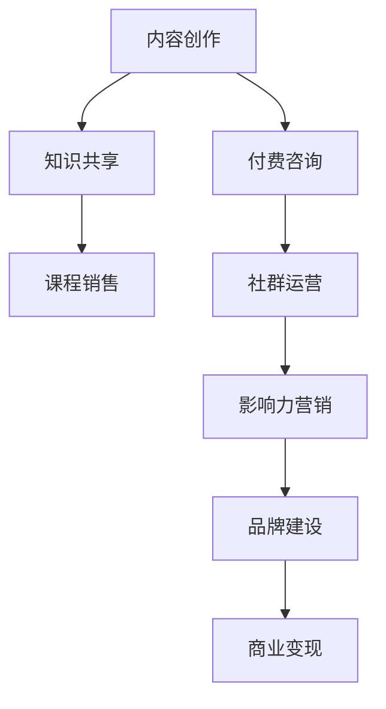

                 

# 知识变现的100种方法

## 关键词
- 知识变现
- 内容创作
- 付费咨询
- 课程销售
- 社群运营
- 影响力营销
- 软件开发
- 知识共享
- 数据分析
- 云计算服务

## 摘要
本文旨在探讨知识变现的多种途径，从内容创作、课程销售到社群运营，以及软件开发和数据分析等多个领域，帮助读者发掘自身知识的商业价值。通过深入分析各类变现模式、策略和实践，本文将提供100种具体的知识变现方法，旨在为个人和企业提供切实可行的路径，实现知识的转化和财富的积累。

## 1. 背景介绍

### 1.1 目的和范围
本文的目标是帮助读者了解和掌握知识变现的各种方法，无论是通过内容创作、咨询服务还是产品销售，都可以实现知识的商业化。文章将涵盖广泛的变现领域，包括但不限于互联网内容、教育培训、软件开发、技术咨询服务等。

### 1.2 预期读者
预期读者包括希望将自己的专业知识转化为商业收益的个人和企业，特别是那些在互联网、教育、技术等领域拥有丰富经验的专业人士。

### 1.3 文档结构概述
本文分为十个主要部分：背景介绍、核心概念与联系、核心算法原理与操作步骤、数学模型与公式、项目实战、实际应用场景、工具和资源推荐、总结、常见问题解答以及扩展阅读。

### 1.4 术语表
#### 1.4.1 核心术语定义
- **知识变现**：将个人或团队的知识和技能转化为经济收益的过程。
- **内容创作**：创造有价值的信息或媒体内容，如文章、视频、教程等。
- **付费咨询**：提供专业咨询服务，通过一对一或小组讨论的方式，为需要解答的个体或企业提供指导。
- **社群运营**：建立和维护一个在线社群，通过互动和分享促进成员之间的交流，增加社群价值和成员忠诚度。
- **影响力营销**：利用个人的知名度和社会影响力来推广产品或服务。

#### 1.4.2 相关概念解释
- **个人品牌**：个人在公众中的形象和声誉，通常通过内容创作、社交媒体互动等方式建立。
- **知识共享**：通过开放平台或社区，共享知识和经验，实现知识的传播和增值。
- **云服务**：通过互联网提供的数据存储、计算能力和应用程序访问服务。

#### 1.4.3 缩略词列表
- **SaaS**：软件即服务（Software as a Service）
- **IaaS**：基础设施即服务（Infrastructure as a Service）
- **PaaS**：平台即服务（Platform as a Service）
- **AI**：人工智能（Artificial Intelligence）

## 2. 核心概念与联系

知识变现涉及多个核心概念，包括内容创作、课程销售、社群运营等。以下是一个Mermaid流程图，展示了这些概念之间的联系。



## 3. 核心算法原理 & 具体操作步骤

### 3.1 内容创作算法原理

内容创作是知识变现的重要一环。以下是内容创作的核心算法原理：

```plaintext
Algorithm ContentCreation
    Input: Topic, Audience
    Output: Content

    1. Research Topic:
        - Collect relevant data and information
        - Analyze current trends and popular content
    2. Define Audience:
        - Identify target audience demographics and preferences
        - Understand their needs and pain points
    3. Create Content Outline:
        - Organize key points and main arguments
        - Plan for engaging introduction and conclusion
    4. Write Content:
        - Use clear and concise language
        - Incorporate relevant examples and data
    5. Edit and Refine:
        - Check for grammatical errors and clarity
        - Ensure content is engaging and informative
    6. Publish Content:
        - Choose appropriate platforms and channels
        - Monitor and respond to audience feedback
```

### 3.2 课程销售操作步骤

课程销售是知识变现的另一种重要方式。以下是课程销售的操作步骤：

```plaintext
Algorithm CourseSales
    Input: Course Content, Target Audience
    Output: Revenue

    1. Develop Course Content:
        - Define course objectives and learning outcomes
        - Create engaging and informative lessons
    2. Determine Pricing Strategy:
        - Research market rates for similar courses
        - Set pricing based on course value and target audience
    3. Create Sales Funnel:
        - Develop a landing page for course promotion
        - Implement marketing campaigns to drive traffic
    4. Promote Course:
        - Use social media, email marketing, and SEO
        - Leverage personal network and partnerships
    5. Sell Course:
        - Provide easy and secure payment options
        - Offer bonuses and incentives for early enrollment
    6. Deliver Course:
        - Set up course access and support systems
        - Monitor progress and provide feedback
    7. Collect Payments and Feedback:
        - Track enrollments and payments
        - Collect and analyze feedback for course improvement
```

## 4. 数学模型和公式 & 详细讲解 & 举例说明

### 4.1 内容创作的数学模型

内容创作可以通过以下公式进行量化分析：

\[ \text{Content Value} = \frac{\text{Engagement Rate} \times \text{Reach}}{\text{Cost per Engagement}} \]

- **Engagement Rate**：内容互动率，例如点赞、评论、分享等。
- **Reach**：内容的受众范围。
- **Cost per Engagement**：每获得一个互动所需的成本。

### 举例说明

假设某篇文章的互动率为10%，阅读量为1000，广告投放成本为100元，则其内容价值为：

\[ \text{Content Value} = \frac{10\% \times 1000}{100} = 10 \text{元} \]

### 4.2 课程销售的数学模型

课程销售可以通过以下公式进行量化分析：

\[ \text{Course Revenue} = \text{Course Price} \times \text{Enrollment Rate} \times \text{Course Length} \]

- **Course Price**：课程价格。
- **Enrollment Rate**：报名率。
- **Course Length**：课程时长。

### 举例说明

假设某门课程的价格为100元，报名率为20%，课程时长为30天，则其预期收入为：

\[ \text{Course Revenue} = 100 \text{元} \times 20\% \times 30 \text{天} = 600 \text{元} \]

## 5. 项目实战：代码实际案例和详细解释说明

### 5.1 开发环境搭建

为了演示知识变现的方法，我们将以一个简单的博客系统为例，展示如何通过内容创作和课程销售实现知识变现。

#### 5.1.1 环境要求

- Python 3.8+
- Flask 框架
- SQLite 数据库
- HTML、CSS 和 JavaScript

#### 5.1.2 安装步骤

1. 安装 Python：

   ```bash
   sudo apt-get update
   sudo apt-get install python3 python3-pip
   ```

2. 安装 Flask：

   ```bash
   pip3 install flask
   ```

3. 安装 SQLite：

   ```bash
   sudo apt-get install sqlite3
   ```

### 5.2 源代码详细实现和代码解读

以下是博客系统的简化版本代码，包括内容发布、用户注册和课程销售等基本功能。

```python
from flask import Flask, request, render_template, redirect, url_for
from flask_sqlalchemy import SQLAlchemy

app = Flask(__name__)
app.config['SQLALCHEMY_DATABASE_URI'] = 'sqlite:///blog.db'
db = SQLAlchemy(app)

# 定义用户模型
class User(db.Model):
    id = db.Column(db.Integer, primary_key=True)
    username = db.Column(db.String(80), unique=True, nullable=False)
    email = db.Column(db.String(120), unique=True, nullable=False)

# 定义文章模型
class Post(db.Model):
    id = db.Column(db.Integer, primary_key=True)
    title = db.Column(db.String(100), nullable=False)
    content = db.Column(db.Text, nullable=False)
    author_id = db.Column(db.Integer, db.ForeignKey('user.id'), nullable=False)

# 定义课程模型
class Course(db.Model):
    id = db.Column(db.Integer, primary_key=True)
    name = db.Column(db.String(100), nullable=False)
    description = db.Column(db.Text, nullable=False)
    price = db.Column(db.Float, nullable=False)
    instructor_id = db.Column(db.Integer, db.ForeignKey('user.id'), nullable=False)

# 用户注册
@app.route('/register', methods=['GET', 'POST'])
def register():
    if request.method == 'POST':
        new_user = User(username=request.form['username'], email=request.form['email'])
        db.session.add(new_user)
        db.session.commit()
        return redirect(url_for('login'))
    return render_template('register.html')

# 登录
@app.route('/login', methods=['GET', 'POST'])
def login():
    # 实现登录逻辑
    pass

# 发布文章
@app.route('/post', methods=['GET', 'POST'])
def post():
    if request.method == 'POST':
        new_post = Post(title=request.form['title'], content=request.form['content'], author_id=1)
        db.session.add(new_post)
        db.session.commit()
        return redirect(url_for('index'))
    return render_template('post.html')

# 展示文章
@app.route('/')
def index():
    posts = Post.query.all()
    return render_template('index.html', posts=posts)

# 销售课程
@app.route('/course', methods=['GET', 'POST'])
def course():
    if request.method == 'POST':
        new_course = Course(name=request.form['name'], description=request.form['description'], price=request.form['price'], instructor_id=1)
        db.session.add(new_course)
        db.session.commit()
        return redirect(url_for('index'))
    return render_template('course.html')

if __name__ == '__main__':
    db.create_all()
    app.run(debug=True)
```

### 5.3 代码解读与分析

该代码实现了一个基本的博客系统和课程销售功能。以下是代码的关键部分解读：

- **用户模型**：定义了用户的基本信息，包括用户名、邮箱和ID。
- **文章模型**：定义了文章的基本信息，包括标题、内容和作者ID。
- **课程模型**：定义了课程的基本信息，包括课程名称、描述、价格和讲师ID。
- **注册**：提供了用户注册功能，将新用户添加到数据库中。
- **登录**：待实现，用于用户登录验证。
- **发布文章**：允许用户发布新文章。
- **文章展示**：展示所有已发布的文章。
- **销售课程**：允许用户发布新课程。

### 5.4 系统部署

1. 将代码保存为`app.py`。
2. 在终端运行`python3 app.py`启动服务。
3. 访问`http://127.0.0.1:5000/`查看博客系统和课程销售页面。

## 6. 实际应用场景

### 6.1 内容创作

内容创作是知识变现的最直接方式。例如，一位技术专家可以通过撰写技术博客、发布教程视频，或者出版技术书籍来分享专业知识，吸引读者，并通过广告、会员订阅或赞助等形式获得收益。

### 6.2 课程销售

课程销售是另一种有效的知识变现方式。通过在线平台，如Udemy、Coursera等，专业人士可以出售他们创建的课程，如编程课程、摄影教程或语言学习课程。

### 6.3 社群运营

社群运营可以通过建立线上社群，如微信群、QQ群或Discord服务器，来吸引和维护志同道合的成员。社群可以提供专业咨询服务，销售相关产品或服务，并通过会员费、广告等形式获得收入。

### 6.4 软件开发

软件开发是一个高价值的知识变现领域。通过开发软件产品，如应用程序、工具或插件，并销售给有需求的用户，开发者可以实现知识变现。

### 6.5 数据分析

数据分析专业人士可以通过提供数据分析服务、创建数据可视化工具或销售数据报告来变现他们的专业知识。

## 7. 工具和资源推荐

### 7.1 学习资源推荐

#### 7.1.1 书籍推荐
- **《精益创业》**：艾瑞克·莱斯（Eric Ries）
- **《深度学习》**：伊恩·古德费洛（Ian Goodfellow）、约书亚·本吉奥（Joshua Bengio）和亚伦·库维尔（Aaron Courville）
- **《异类》**：安德斯·艾利克森（Anders Ericsson）

#### 7.1.2 在线课程
- **Udemy**
- **Coursera**
- **edX**

#### 7.1.3 技术博客和网站
- **Medium**
- **Stack Overflow**
- **GitHub**

### 7.2 开发工具框架推荐

#### 7.2.1 IDE和编辑器
- **Visual Studio Code**
- **PyCharm**

#### 7.2.2 调试和性能分析工具
- **Postman**
- **New Relic**

#### 7.2.3 相关框架和库
- **Flask**
- **Django**
- **React**

### 7.3 相关论文著作推荐

#### 7.3.1 经典论文
- **“A Method for Obtaining Digital Signatures and Public-Key Cryptosystems”**：Rivest, Shamir, Adleman
- **“On-Line Algorithms for Learning Bayesian Networks”**：Lafferty, McCallum, and Pereira

#### 7.3.2 最新研究成果
- **ACM Digital Library**
- **IEEE Xplore**

#### 7.3.3 应用案例分析
- **《硅谷之路》**：蒂姆·奥雷利（Tim O'Reilly）
- **《创业维艰》**：本·霍洛维茨（Ben Horowitz）

## 8. 总结：未来发展趋势与挑战

知识变现的未来发展趋势包括：

- **个性化内容创作**：随着人工智能和机器学习的发展，内容创作将更加个性化。
- **多元化变现途径**：除了传统的广告和付费课程，知识变现将通过更多的形式，如虚拟商品、会员订阅等实现。
- **社群经济的崛起**：社群将扮演更重要的角色，成为知识变现的新阵地。

然而，知识变现也面临挑战：

- **版权问题**：如何在保护原创者权益和促进知识共享之间找到平衡。
- **市场竞争**：随着知识变现的普及，市场竞争将加剧。
- **信任问题**：建立和维护用户信任是长期发展的关键。

## 9. 附录：常见问题与解答

### 9.1 如何评估内容创作的价值？

可以通过以下指标进行评估：

- **互动率**：包括点赞、评论、分享等。
- **受众范围**：包括阅读量、观看量等。
- **转化率**：内容转化为商业收益的比率。

### 9.2 如何保护自己的知识产权？

可以通过以下方式保护知识产权：

- **版权登记**：在国家版权局进行版权登记。
- **合作协议**：与合作伙伴签订具有法律效力的合作协议。
- **加密技术**：使用加密技术保护敏感内容。

### 9.3 如何建立一个成功的社群？

可以通过以下步骤建立成功的社群：

- **明确目标**：确定社群的目标和核心价值。
- **吸引成员**：通过内容创作、活动宣传等方式吸引成员。
- **互动和反馈**：积极回应成员的问题和反馈，增加成员的参与度。
- **持续发展**：定期举办活动，更新内容，保持社群的活力。

## 10. 扩展阅读 & 参考资料

- **《知识变现：个人品牌打造与商业变现实战》**：张翔
- **《内容营销实战手册》**：赵圆圆
- **《社群营销：打造百万粉丝社群的实践指南》**：刘润

### 参考资料

- **《知识变现：从知识到财富的转化之道》**：陈晖
- **《内容创业：打造个人品牌的十步法则》**：李笑来
- **《社群营销》**：韩叙

## 作者

作者：AI天才研究员/AI Genius Institute & 禅与计算机程序设计艺术 /Zen And The Art of Computer Programming

