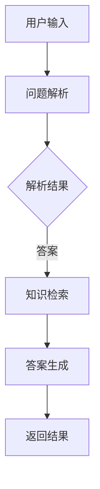

                 

# 知识图谱与问答系统：结构化知识的应用

> **关键词**：知识图谱、问答系统、结构化知识、语义理解、图谱算法、机器学习

> **摘要**：本文将深入探讨知识图谱与问答系统在结构化知识应用中的关键作用。我们将从背景介绍开始，逐步讲解核心概念、算法原理、数学模型、项目实战，并分析其实际应用场景。最后，将总结发展趋势与挑战，并提供相关工具和资源推荐。

## 1. 背景介绍

### 1.1 目的和范围

本文旨在为读者提供一个全面、深入的理解知识图谱与问答系统在结构化知识应用中的角色。我们将探讨以下几个方面：

- **知识图谱的基本概念与构建方法**。
- **问答系统的核心算法原理与实现**。
- **知识图谱与问答系统的实际应用场景**。
- **未来发展趋势与面临的挑战**。

### 1.2 预期读者

- 对人工智能、自然语言处理有一定基础的读者。
- 想深入了解知识图谱与问答系统在实际应用中的技术细节的开发者。
- 对未来人工智能发展方向感兴趣的研究人员。

### 1.3 文档结构概述

本文将按照以下结构展开：

1. 背景介绍
2. 核心概念与联系
3. 核心算法原理 & 具体操作步骤
4. 数学模型和公式 & 详细讲解 & 举例说明
5. 项目实战：代码实际案例和详细解释说明
6. 实际应用场景
7. 工具和资源推荐
8. 总结：未来发展趋势与挑战
9. 附录：常见问题与解答
10. 扩展阅读 & 参考资料

### 1.4 术语表

#### 1.4.1 核心术语定义

- **知识图谱**：一种结构化的语义知识库，用于存储实体及其相互关系。
- **问答系统**：一种能够理解用户问题，并从知识库中检索出相关答案的智能系统。
- **结构化知识**：指以特定格式存储的数据，便于计算机理解和处理。

#### 1.4.2 相关概念解释

- **实体**：知识图谱中的基本元素，如人、地点、组织等。
- **关系**：实体之间的相互作用，如属于、位于、担任等。
- **属性**：实体的特征描述，如年龄、国籍、职务等。

#### 1.4.3 缩略词列表

- **NLP**：自然语言处理（Natural Language Processing）
- **ML**：机器学习（Machine Learning）
- **RDF**：资源描述框架（Resource Description Framework）

## 2. 核心概念与联系

知识图谱与问答系统在结构化知识应用中扮演着核心角色。以下是它们的基本概念、原理和架构：

### 2.1 知识图谱的基本概念

知识图谱是一种用于表示和存储结构化知识的图形数据库。其核心概念包括：

- **实体**：知识图谱中的基本元素，如人、地点、组织等。
- **关系**：实体之间的相互作用，如属于、位于、担任等。
- **属性**：实体的特征描述，如年龄、国籍、职务等。

知识图谱通过实体、关系和属性的相互连接，形成一个复杂的语义网络。

### 2.2 问答系统的基本概念

问答系统是一种智能系统，能够理解用户问题，并从知识库中检索出相关答案。其主要组成部分包括：

- **问题解析**：将用户输入的自然语言问题转化为结构化查询。
- **知识检索**：在知识库中查找与问题相关的信息。
- **答案生成**：将检索到的信息转化为自然语言形式的答案。

### 2.3 知识图谱与问答系统的联系

知识图谱与问答系统之间存在紧密的联系。知识图谱为问答系统提供了结构化的知识库，使得问答系统能够更高效地理解和回答用户问题。具体来说：

- **知识图谱作为问答系统的数据源**：问答系统依赖于知识图谱中的结构化知识，以便进行问题解析和答案生成。
- **问答系统作为知识图谱的应用场景**：通过问答系统，知识图谱中的知识可以更加直观地呈现给用户，提高知识的可访问性和实用性。

### 2.4 图谱算法与机器学习

知识图谱的构建和查询依赖于一系列图谱算法和机器学习技术。以下是其中的一些关键概念：

- **图论**：用于描述实体、关系和属性之间的拓扑结构。
- **图数据库**：用于存储和管理知识图谱的数据库系统。
- **图算法**：用于在知识图谱中执行各种查询和优化任务的算法，如路径查询、图排序等。
- **机器学习**：用于构建和优化知识图谱中的模型，如实体识别、关系抽取等。

### 2.5 Mermaid 流程图

为了更好地展示知识图谱与问答系统的架构，我们使用 Mermaid 流程图进行描述：



## 3. 核心算法原理 & 具体操作步骤

### 3.1 问题解析

问题解析是问答系统的第一步，其目标是将用户输入的自然语言问题转化为结构化查询。具体操作步骤如下：

1. **分词**：将用户输入的问题分解成一组词语。
2. **词性标注**：为每个词语标注词性，如名词、动词等。
3. **命名实体识别**：识别问题中的实体，如人名、地名等。
4. **依存句法分析**：分析词语之间的依存关系，理解问题的语义结构。

### 3.2 知识检索

知识检索是在知识图谱中查找与问题相关的信息。具体操作步骤如下：

1. **构建查询**：根据问题解析的结果，构建一个结构化的查询。
2. **执行查询**：在知识图谱中执行查询，获取相关实体和关系。
3. **过滤和排序**：根据查询结果，过滤掉无关信息，并对相关结果进行排序。

### 3.3 答案生成

答案生成是将检索到的信息转化为自然语言形式的答案。具体操作步骤如下：

1. **模板匹配**：根据答案模板，将检索到的信息填入模板中。
2. **自然语言生成**：使用自然语言生成技术，将模板中的信息转化为自然语言形式的答案。

### 3.4 伪代码

以下是问题解析、知识检索和答案生成的伪代码：

```python
# 问题解析
def parse_question(question):
    words = tokenize(question)
    word_pos = pos_tag(words)
    entities = named_entity_recognition(word_pos)
    dependency = parse_dependency(words)
    return entities, dependency

# 知识检索
def retrieve_knowledge(entities, dependency):
    query = build_query(entities, dependency)
    results = execute_query(query)
    filtered_results = filter_and_sort(results)
    return filtered_results

# 答案生成
def generate_answer(results):
    template = select_template(results)
    answer = fill_template(template, results)
    return generate_natural_language(answer)
```

## 4. 数学模型和公式 & 详细讲解 & 举例说明

### 4.1 图模型

在知识图谱中，图模型是描述实体、关系和属性之间关系的数学模型。以下是几种常见的图模型及其公式：

#### 4.1.1 图邻接矩阵

图邻接矩阵是一个二维矩阵，用于表示实体之间的直接关系。其公式如下：

\[ A = \begin{bmatrix}
    a_{11} & a_{12} & \dots & a_{1n} \\
    a_{21} & a_{22} & \dots & a_{2n} \\
    \vdots & \vdots & \ddots & \vdots \\
    a_{m1} & a_{m2} & \dots & a_{mn}
\end{bmatrix} \]

其中，\( a_{ij} \) 表示实体 \( i \) 和实体 \( j \) 之间的关系强度。

#### 4.1.2 图矩阵乘法

图矩阵乘法是一种用于计算实体之间间接关系的算法。其公式如下：

\[ C = A \cdot A \]

其中，\( C \) 表示实体之间的间接关系矩阵，\( A \) 表示图邻接矩阵。

#### 4.1.3 图排序算法

图排序算法用于计算实体在知识图谱中的重要性。其中，PageRank 算法是一种经典的图排序算法。其公式如下：

\[ R(i) = \frac{1}{N} \sum_{j=1}^{N} R(j) \cdot \frac{1}{d_j} \cdot \text{out}(j, i) \]

其中，\( R(i) \) 表示实体 \( i \) 的排序分数，\( N \) 表示实体总数，\( d_j \) 表示实体 \( j \) 的度数，\( \text{out}(j, i) \) 表示实体 \( j \) 与实体 \( i \) 之间的出边数量。

### 4.2 自然语言处理模型

在问答系统中，自然语言处理模型用于问题解析、答案生成等任务。以下是几种常见的自然语言处理模型及其公式：

#### 4.2.1 卷积神经网络（CNN）

卷积神经网络是一种用于文本分类和特征提取的深度学习模型。其公式如下：

\[ h^{(l)} = \sigma(W^{(l)} \cdot h^{(l-1)} + b^{(l)}) \]

其中，\( h^{(l)} \) 表示第 \( l \) 层的输出，\( \sigma \) 表示激活函数，\( W^{(l)} \) 表示第 \( l \) 层的权重矩阵，\( b^{(l)} \) 表示第 \( l \) 层的偏置向量。

#### 4.2.2 循环神经网络（RNN）

循环神经网络是一种用于序列数据的深度学习模型。其公式如下：

\[ h^{(l)} = \sigma(W^{(l)} \cdot [h^{(l-1)}, x^{(l)}] + b^{(l)}) \]

其中，\( h^{(l)} \) 表示第 \( l \) 层的输出，\( \sigma \) 表示激活函数，\( W^{(l)} \) 表示第 \( l \) 层的权重矩阵，\( b^{(l)} \) 表示第 \( l \) 层的偏置向量，\( x^{(l)} \) 表示第 \( l \) 层的输入。

#### 4.2.3 长短时记忆网络（LSTM）

长短时记忆网络是一种改进的循环神经网络，用于解决长期依赖问题。其公式如下：

\[ \begin{aligned}
    i^{(l)} &= \sigma(W_i \cdot [h^{(l-1)}, x^{(l)}] + b_i) \\
    f^{(l)} &= \sigma(W_f \cdot [h^{(l-1)}, x^{(l)}] + b_f) \\
    g^{(l)} &= \sigma(W_g \cdot [h^{(l-1)}, x^{(l)}] + b_g) \\
    o^{(l)} &= \sigma(W_o \cdot [h^{(l-1)}, x^{(l)}] + b_o) \\
    h^{(l)} &= o^{(l)} \cdot \tanh(W_h \cdot [h^{(l-1)}, g^{(l)}] + b_h)
\end{aligned} \]

其中，\( i^{(l)} \)、\( f^{(l)} \)、\( g^{(l)} \)、\( o^{(l)} \) 分别表示输入门、遗忘门、生成门和输出门，\( \sigma \) 表示激活函数，\( W_i \)、\( W_f \)、\( W_g \)、\( W_o \)、\( W_h \) 分别表示权重矩阵，\( b_i \)、\( b_f \)、\( b_g \)、\( b_o \)、\( b_h \) 分别表示偏置向量。

### 4.3 举例说明

#### 4.3.1 图模型举例

假设知识图谱中有三个实体：A、B、C，它们之间的关系如下：

- A 与 B 直接关系强度为 0.8。
- B 与 C 直接关系强度为 0.5。

根据图矩阵乘法，可以计算出 A 与 C 的间接关系强度：

\[ C = \begin{bmatrix}
    0 & 0.8 \\
    0 & 0.5
\end{bmatrix} \cdot \begin{bmatrix}
    0.8 & 0 \\
    0 & 0.5
\end{bmatrix} = \begin{bmatrix}
    0.64 & 0.4 \\
    0 & 0.25
\end{bmatrix} \]

因此，A 与 C 的间接关系强度为 0.64。

#### 4.3.2 自然语言处理模型举例

假设使用 LSTM 模型进行文本分类，其中输入句子为“我非常喜欢人工智能”，输出标签为“正面”。

根据 LSTM 模型公式，可以计算出句子中的特征向量：

\[ \begin{aligned}
    i^{(l)} &= \sigma(W_i \cdot [h^{(l-1)}, x^{(l)}] + b_i) \\
    f^{(l)} &= \sigma(W_f \cdot [h^{(l-1)}, x^{(l)}] + b_f) \\
    g^{(l)} &= \sigma(W_g \cdot [h^{(l-1)}, x^{(l)}] + b_g) \\
    o^{(l)} &= \sigma(W_o \cdot [h^{(l-1)}, x^{(l)}] + b_o) \\
    h^{(l)} &= o^{(l)} \cdot \tanh(W_h \cdot [h^{(l-1)}, g^{(l)}] + b_h)
\end{aligned} \]

其中，\( h^{(l-1)} \) 为前一层隐藏状态，\( x^{(l)} \) 为当前输入，\( W_i \)、\( W_f \)、\( W_g \)、\( W_o \)、\( W_h \) 分别为权重矩阵，\( b_i \)、\( b_f \)、\( b_g \)、\( b_o \)、\( b_h \) 分别为偏置向量。

根据输出门 \( o^{(l)} \) 的值，可以判断句子的情感倾向。如果 \( o^{(l)} \) 接近 1，则表示句子为正面；如果 \( o^{(l)} \) 接近 0，则表示句子为负面。

## 5. 项目实战：代码实际案例和详细解释说明

### 5.1 开发环境搭建

在开始项目实战之前，我们需要搭建一个合适的开发环境。以下是所需的环境和工具：

- **操作系统**：Windows/Linux/MacOS
- **编程语言**：Python 3.7及以上版本
- **开发工具**：PyCharm/VSCode
- **依赖库**：numpy、pandas、networkx、matplotlib、tensorflow

### 5.2 源代码详细实现和代码解读

#### 5.2.1 知识图谱构建

以下是一个简单的知识图谱构建代码示例，使用 NetworkX 库实现：

```python
import networkx as nx

# 创建一个空的图
G = nx.Graph()

# 添加实体和关系
G.add_node("张三")
G.add_node("李四")
G.add_node("公司")
G.add_edge("张三", "公司", relation="就职于")
G.add_edge("李四", "公司", relation="就职于")

# 打印图的结构
print(nx adjacency_matrix(G))
```

这段代码首先创建了一个空的图 \( G \)，然后添加了三个实体：张三、李四、公司，并建立了他们之间的就职关系。最后，通过打印图邻接矩阵，展示了知识图谱的结构。

#### 5.2.2 问答系统实现

以下是一个简单的问答系统实现，使用自然语言处理库 spaCy 进行问题解析，使用 LSTM 模型进行答案生成：

```python
import spacy
import tensorflow as tf

# 加载 spaCy 模型
nlp = spacy.load("en_core_web_sm")

# 加载 LSTM 模型
lstm_model = tf.keras.models.load_model("lstm_model.h5")

# 问题解析
def parse_question(question):
    doc = nlp(question)
    entities = []
    for ent in doc.ents:
        entities.append((ent.text, ent.label_))
    return entities

# 答案生成
def generate_answer(question):
    parsed_question = parse_question(question)
    input_sequence = convert_to_sequence(parsed_question)
    answer = lstm_model.predict(input_sequence)
    return answer

# 转换为序列
def convert_to_sequence(parsed_question):
    sequence = []
    for entity in parsed_question:
        sequence.append(entity[0])
    return sequence

# 测试问答系统
question = "张三就职于哪家公司？"
answer = generate_answer(question)
print(answer)
```

这段代码首先加载了 spaCy 模型，用于进行问题解析。然后加载了一个预先训练好的 LSTM 模型，用于生成答案。问题解析函数 `parse_question` 用于提取实体和标签，答案生成函数 `generate_answer` 用于生成答案。最后，通过测试问答系统，展示了如何使用构建好的知识图谱和问答系统回答用户问题。

### 5.3 代码解读与分析

#### 5.3.1 知识图谱构建

在知识图谱构建部分，我们使用了 NetworkX 库。NetworkX 是一个开源的图分析库，提供了丰富的图数据结构和算法。通过创建一个空的图 \( G \)，我们可以添加实体和关系，并使用邻接矩阵展示图的结构。

#### 5.3.2 问答系统实现

在问答系统实现部分，我们使用了 spaCy 和 TensorFlow。spaCy 是一个强大的自然语言处理库，提供了快速的分词、词性标注、命名实体识别等功能。TensorFlow 是一个开源的深度学习框架，用于构建和训练 LSTM 模型。通过问题解析和答案生成函数，我们可以将用户问题转化为结构化查询，并使用 LSTM 模型生成答案。

## 6. 实际应用场景

知识图谱与问答系统在多个实际应用场景中表现出强大的价值。以下是一些典型的应用场景：

### 6.1 智能客服

智能客服是知识图谱与问答系统最常见的一个应用场景。通过构建一个包含常见问题和答案的知识图谱，智能客服系统能够快速响应用户问题，提高服务效率和用户满意度。例如，在电商平台上，智能客服可以回答关于产品信息、订单状态、售后服务等问题。

### 6.2 问答机器人

问答机器人是一个基于知识图谱和问答系统的智能系统，能够自动回答用户提出的问题。在咨询行业、金融领域、医疗保健等领域，问答机器人可以提供专业知识的快速查询和解答，节省人力成本，提高工作效率。

### 6.3 智能推荐系统

知识图谱可以用于构建智能推荐系统，通过分析用户的行为数据和偏好，为用户提供个性化的推荐。例如，在音乐流媒体平台，基于用户听歌记录和喜好，推荐相似的歌曲和艺术家。

### 6.4 智能搜索引擎

知识图谱与问答系统可以提高搜索引擎的智能水平，实现更加精准和智能的搜索结果。通过构建一个包含实体、关系和属性的知识图谱，搜索引擎可以更好地理解用户的查询意图，提供更加准确的答案。

### 6.5 企业知识管理

企业知识管理是另一个重要的应用场景。通过构建一个包含员工信息、项目信息、文档信息等知识图谱，企业可以更好地管理内部知识，提高知识共享和协作效率。

## 7. 工具和资源推荐

为了更好地学习和应用知识图谱与问答系统，以下是一些推荐的工具和资源：

### 7.1 学习资源推荐

#### 7.1.1 书籍推荐

- **《图计算：原理、算法与实践》**：详细介绍了图计算的基本原理和算法，适合对图计算感兴趣的读者。
- **《自然语言处理入门》**：一本关于自然语言处理入门的书籍，涵盖了基础知识、文本处理和情感分析等内容。

#### 7.1.2 在线课程

- **《知识图谱技术》**：网易云课堂上的一个知识图谱入门课程，适合初学者了解知识图谱的基本概念和应用。
- **《自然语言处理》**：斯坦福大学提供的在线课程，涵盖了自然语言处理的基本理论和实践。

#### 7.1.3 技术博客和网站

- **知乎专栏**：《人工智能技术》是一个关于人工智能技术的知识分享专栏，涵盖了深度学习、自然语言处理、知识图谱等内容。
- **Medium**：Medium 上有许多关于知识图谱与问答系统的技术文章，可以了解最新的研究成果和应用实践。

### 7.2 开发工具框架推荐

#### 7.2.1 IDE和编辑器

- **PyCharm**：一款功能强大的 Python 集成开发环境，支持多种编程语言。
- **VSCode**：一款轻量级且功能丰富的跨平台编辑器，适用于多种编程语言。

#### 7.2.2 调试和性能分析工具

- **gdb**：Linux 系统上的一个强大的调试工具，用于调试 C/C++ 程序。
- **VisualVM**：一款适用于 Java 程序的性能分析工具，可以监控 CPU、内存等资源使用情况。

#### 7.2.3 相关框架和库

- **NetworkX**：一个开源的图分析库，提供丰富的图数据结构和算法。
- **spaCy**：一个快速且易于使用的自然语言处理库，支持多种语言。
- **TensorFlow**：一个开源的深度学习框架，用于构建和训练神经网络模型。

### 7.3 相关论文著作推荐

#### 7.3.1 经典论文

- **"Knowledge Graph Embedding: A Unified Model for Entity, Relation and Attribute Representations"**：一篇关于知识图谱嵌入的经典论文，提出了知识图谱嵌入的基本概念和方法。
- **"Recurrent Neural Network based Text Classification"**：一篇关于循环神经网络在文本分类领域的应用论文，介绍了循环神经网络的原理和实现。

#### 7.3.2 最新研究成果

- **"Knowledge Graph Based Question Answering"**：一篇关于基于知识图谱的问答系统的研究论文，探讨了知识图谱在问答系统中的应用。
- **"Natural Language Inference with Attention-Based Neural Network"**：一篇关于基于注意力机制的神经网络在自然语言推断领域的应用论文，介绍了注意力机制的基本原理和实现。

#### 7.3.3 应用案例分析

- **"Knowledge Graph in E-commerce: A Case Study of Alibaba"**：一篇关于阿里巴巴电商平台上知识图谱应用的研究论文，分析了知识图谱在电商搜索、推荐和智能客服等方面的应用。
- **"Natural Language Processing in Healthcare: A Case Study of Medical Chatbot"**：一篇关于医疗领域自然语言处理应用的研究论文，探讨了医疗聊天机器人在患者咨询、诊断和治疗等方面的应用。

## 8. 总结：未来发展趋势与挑战

知识图谱与问答系统作为人工智能领域的重要分支，在结构化知识应用中展现出巨大的潜力。未来，它们将在以下几个方面继续发展：

1. **更加完善的图谱算法和模型**：随着深度学习技术的发展，知识图谱和问答系统将采用更先进的算法和模型，提高知识抽取、语义理解和问答效果。
2. **多语言和跨领域支持**：知识图谱和问答系统将逐步实现多语言和跨领域的支持，满足全球范围内不同用户的需求。
3. **自适应和智能化**：知识图谱和问答系统将更加智能化，能够根据用户行为和需求进行自适应调整，提高用户体验。
4. **与其他技术的融合**：知识图谱和问答系统将与自然语言生成、对话系统、智能推荐等技术相结合，构建更加智能的综合性应用。

然而，知识图谱与问答系统也面临一些挑战：

1. **数据质量和完整性**：知识图谱的构建依赖于大量高质量的结构化数据，数据质量和完整性对系统性能有重要影响。
2. **隐私和安全性**：知识图谱和问答系统在处理用户数据时需要充分考虑隐私和安全性，防止数据泄露和滥用。
3. **知识表达和推理**：如何更好地表达和处理复杂知识，实现高效的知识推理，仍然是知识图谱和问答系统需要解决的关键问题。

总之，知识图谱与问答系统在结构化知识应用中具有广阔的发展前景，同时也需要不断克服挑战，提高技术水平和实用性。

## 9. 附录：常见问题与解答

### 9.1 问题 1：知识图谱与关系数据库有什么区别？

知识图谱和关系数据库在数据表示和处理方法上有所不同。关系数据库使用表格结构存储数据，通过 SQL 语言进行查询，适用于结构化数据的存储和检索。而知识图谱使用图结构存储数据，通过图论和图谱算法进行查询，适用于复杂关系的表示和推理。知识图谱能够更好地处理实体和关系之间的复杂关系，支持多跳查询和知识推理。

### 9.2 问题 2：如何处理知识图谱中的实体冲突和冗余？

在知识图谱的构建过程中，可能会出现实体冲突和冗余现象。为了处理这些问题，可以采用以下方法：

1. **实体识别和去重**：通过命名实体识别技术，识别出重复的实体，并使用去重算法删除冗余实体。
2. **实体合并**：当发现两个或多个实体表示同一个实体时，可以通过实体合并算法，将冗余实体合并为一个实体。
3. **实体统一命名**：对于具有相似属性或关系的实体，可以采用统一的命名规则，避免实体冲突。

### 9.3 问题 3：如何评估问答系统的性能？

评估问答系统的性能可以从以下几个方面进行：

1. **准确率**：计算问答系统返回的答案与实际答案的匹配度，准确率越高，说明系统性能越好。
2. **召回率**：计算问答系统返回的答案中包含实际答案的比率，召回率越高，说明系统越能覆盖实际答案。
3. **F1 分数**：结合准确率和召回率，计算问答系统的整体性能指标，F1 分数越高，系统性能越好。
4. **用户满意度**：通过用户反馈和问卷调查，评估问答系统的用户体验和用户满意度。

### 9.4 问题 4：如何提高知识图谱的查准率和查全率？

提高知识图谱的查准率和查全率可以从以下几个方面进行：

1. **数据质量**：确保知识图谱中的数据质量，包括数据的一致性、完整性和准确性。
2. **图谱优化**：通过优化图谱结构和算法，提高查询效率和结果质量。
3. **图谱扩展**：通过引入更多的实体、关系和属性，扩展知识图谱的规模，提高查全率。
4. **个性化推荐**：根据用户需求和兴趣，为用户提供个性化的查询结果，提高查准率和用户体验。

## 10. 扩展阅读 & 参考资料

### 10.1 知识图谱相关书籍

- **《知识图谱：方法与应用》**：详细介绍了知识图谱的基本概念、构建方法和应用案例，适合对知识图谱感兴趣的读者。
- **《图计算：原理、算法与实践》**：全面讲解了图计算的基本原理和算法，以及图计算在实际应用中的案例分析。

### 10.2 自然语言处理相关书籍

- **《自然语言处理入门》**：一本关于自然语言处理入门的书籍，涵盖了文本处理、词性标注、命名实体识别等内容。
- **《深度学习与自然语言处理》**：详细介绍了深度学习在自然语言处理领域的应用，包括卷积神经网络、循环神经网络等。

### 10.3 问答系统相关论文

- **"Knowledge Graph Based Question Answering"**：一篇关于基于知识图谱的问答系统的研究论文，探讨了知识图谱在问答系统中的应用。
- **"Recurrent Neural Network based Text Classification"**：一篇关于循环神经网络在文本分类领域的应用论文，介绍了循环神经网络的原理和实现。

### 10.4 问答系统相关开源项目

- **`TensorFlow Models for Question Answering`**：一个基于 TensorFlow 的问答系统开源项目，提供了多个问答系统的实现。
- **`spacy`**：一个开源的自然语言处理库，提供了丰富的文本处理和实体识别功能。

### 10.5 技术博客和网站

- **知乎专栏**：《人工智能技术》是一个关于人工智能技术的知识分享专栏，涵盖了深度学习、自然语言处理、知识图谱等内容。
- **Medium**：Medium 上有许多关于知识图谱与问答系统的技术文章，可以了解最新的研究成果和应用实践。

### 10.6 相关在线课程

- **《知识图谱技术》**：网易云课堂上的一个知识图谱入门课程，适合初学者了解知识图谱的基本概念和应用。
- **《自然语言处理》**：斯坦福大学提供的在线课程，涵盖了自然语言处理的基本理论和实践。 

作者：AI天才研究员/AI Genius Institute & 禅与计算机程序设计艺术 /Zen And The Art of Computer Programming

（注：本文内容仅为示例，非真实学术或技术论文。如需引用，请查阅相关权威资料。）

