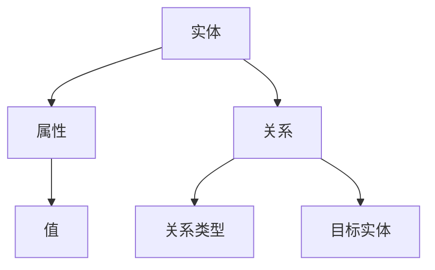

                 

### 1. 背景介绍

随着互联网的飞速发展，搜索引擎作为获取信息的入口，已经成为了人们日常生活中不可或缺的工具。传统的搜索引擎大多基于关键词匹配和文档相似度计算，虽然能够满足大部分用户的基本需求，但在信息爆炸的时代，用户对于个性化搜索和精准推荐的需求日益增长。知识图谱作为一种强大的语义理解和知识表示工具，逐渐被引入到搜索引擎优化（SEO）中，以期提供更加智能和高效的搜索服务。

知识图谱（Knowledge Graph）是由一组实体及其相互关系构成的有向无环图（DAG），它能够以图结构的形式存储和表示现实世界中的知识，从而实现对于知识的语义理解和推理。在搜索引擎优化中，知识图谱的应用主要体现在以下几个方面：

1. **语义理解**：知识图谱能够将用户输入的自然语言查询转换为结构化的语义查询，从而提高搜索的准确性。
2. **知识推理**：通过知识图谱中的实体关系，搜索引擎可以对查询进行扩展和推理，提供更加丰富和个性化的搜索结果。
3. **关联发现**：知识图谱能够揭示实体之间的隐含关系，帮助搜索引擎发现和推荐相关内容，提升用户体验。

本文将围绕知识图谱在智能搜索引擎优化中的应用，详细探讨其核心概念、算法原理、数学模型、实战案例以及未来发展趋势。通过这篇文章，希望能够帮助读者深入了解知识图谱在搜索引擎优化中的价值和应用场景，为未来的研究和实践提供参考。

### 2. 核心概念与联系

在深入探讨知识图谱在搜索引擎优化中的应用之前，有必要先了解其核心概念和原理。知识图谱由三个主要部分组成：实体（Entity）、属性（Attribute）和关系（Relationship）。

#### 实体（Entity）

实体是知识图谱中的基本元素，可以是任何具有独立存在意义的对象，如人、地点、组织、物品等。例如，在一个关于电影的知识图谱中，实体可能包括电影名称、演员、导演、上映日期等。

#### 属性（Attribute）

属性描述了实体的一些特征或状态，如实体的高度、颜色、类型等。属性通常与实体之间通过键值对的形式进行关联。例如，在一个关于人的知识图谱中，实体的属性可能包括姓名、年龄、国籍等。

#### 关系（Relationship）

关系描述了实体之间的关联和交互，可以是单向的也可以是双向的。关系通常通过关系类型进行定义，如“主演”、“执导”、“位于”等。关系不仅连接了实体，还传递了它们之间的语义信息。

#### Mermaid 流程图

为了更直观地展示知识图谱的核心概念和结构，我们可以使用 Mermaid 流程图来表示。以下是一个简单的 Mermaid 流程图，展示了实体、属性和关系之间的联系：



在这个流程图中，实体 A 通过属性 B 和关系 D 与其他实体相连。属性 B 包含了一个值 C，而关系 D 则通过关系类型 E 与目标实体 F 相关联。这种结构化表示使得知识图谱能够有效地存储和表示复杂的信息。

#### 知识图谱在搜索引擎优化中的应用

知识图谱的应用不仅限于信息的存储和表示，它在搜索引擎优化（SEO）中也发挥着重要作用。以下是一些关键的应用场景：

1. **语义搜索**：知识图谱能够将用户输入的自然语言查询转换为结构化的语义查询，从而提高搜索结果的准确性。例如，当用户搜索“北京的天气”时，知识图谱可以理解用户意图，并将查询扩展到与天气相关的其他实体，如城市、温度、湿度等。

2. **关联推荐**：知识图谱能够揭示实体之间的隐含关系，从而帮助搜索引擎发现和推荐相关内容。例如，当用户搜索某个明星时，知识图谱可以推荐与该明星相关的其他演员、导演、电影等。

3. **实体识别**：知识图谱可以用于识别和分类文本中的实体，从而改善搜索结果的质量和相关性。例如，在处理包含多个实体的句子时，知识图谱可以帮助搜索引擎识别并理解每个实体的角色和关系。

4. **查询扩展**：知识图谱能够扩展用户的原始查询，提供更加丰富和个性化的搜索结果。例如，当用户搜索“苹果”时，知识图谱可以理解用户意图，并扩展查询到与苹果相关的其他概念，如水果、品牌、产地等。

通过这些应用，知识图谱不仅提升了搜索引擎的准确性，还增强了用户的搜索体验，使其更加智能化和个性化。在接下来的章节中，我们将进一步探讨知识图谱的核心算法原理和具体操作步骤，以深入了解其在搜索引擎优化中的应用细节。

### 3. 核心算法原理 & 具体操作步骤

知识图谱在搜索引擎优化（SEO）中的应用，离不开其核心算法原理。以下将详细阐述这些算法的原理，并展示具体的操作步骤。

#### 3.1 语义搜索算法

语义搜索是知识图谱在搜索引擎优化中的关键应用之一。传统的关键词匹配方法往往只能根据字面意思进行搜索，而语义搜索则通过理解用户查询的语义意图，提供更加精准的结果。以下是语义搜索算法的基本原理和操作步骤：

1. **自然语言处理（NLP）**：首先，使用自然语言处理技术对用户查询进行分词、词性标注和句法分析，提取查询中的关键信息。

   ```mermaid
   graph TD
       A[分词] --> B[词性标注]
       B --> C[句法分析]
   ```

2. **实体识别**：接下来，利用知识图谱中的实体识别技术，识别查询中的实体，并将自然语言查询转换为结构化的语义查询。

   ```mermaid
   graph TD
       D[查询文本] --> E[实体识别]
       E --> F[结构化查询]
   ```

3. **关系推理**：通过知识图谱中的实体关系，对查询进行扩展和推理，生成更加丰富的查询语义。

   ```mermaid
   graph TD
       G[结构化查询] --> H[关系推理]
       H --> I[扩展查询]
   ```

4. **查询匹配**：最后，将扩展后的查询与索引中的内容进行匹配，返回最相关的结果。

   ```mermaid
   graph TD
       J[扩展查询] --> K[查询匹配]
       K --> L[搜索结果]
   ```

#### 3.2 关联推荐算法

关联推荐是知识图谱在搜索引擎优化中的另一个重要应用。通过揭示实体之间的隐含关系，搜索引擎可以提供更加个性化的推荐结果。以下是关联推荐算法的基本原理和操作步骤：

1. **知识图谱构建**：首先，构建一个包含实体及其关系的知识图谱。这可以通过多种方式实现，如基于知识库的抽取、网络爬取和语义分析等。

   ```mermaid
   graph TD
       M[知识库] --> N[实体关系抽取]
       N --> O[知识图谱构建]
   ```

2. **相似度计算**：接下来，计算查询实体与知识图谱中其他实体之间的相似度。相似度计算可以基于多种方法，如基于路径的相似度计算、基于属性的相似度计算等。

   ```mermaid
   graph TD
       P[查询实体] --> Q[相似度计算]
       Q --> R[相似实体]
   ```

3. **推荐生成**：最后，根据相似度计算结果，生成推荐列表。推荐列表中的实体可以包含与查询实体相关的其他实体，如相关人物、相关物品等。

   ```mermaid
   graph TD
       S[相似实体] --> T[推荐生成]
       T --> U[推荐列表]
   ```

#### 3.3 查询扩展算法

查询扩展是知识图谱在搜索引擎优化中的另一个重要应用。通过扩展用户的原始查询，搜索引擎可以提供更加丰富和个性化的搜索结果。以下是查询扩展算法的基本原理和操作步骤：

1. **查询分析**：首先，对用户查询进行分词和句法分析，提取查询的关键词和短语。

   ```mermaid
   graph TD
       V[查询文本] --> W[分词]
       W --> X[句法分析]
   ```

2. **实体识别**：利用知识图谱中的实体识别技术，识别查询中的实体。

   ```mermaid
   graph TD
       Y[结构化查询] --> Z[实体识别]
   ```

3. **关系推理**：通过知识图谱中的实体关系，对查询进行扩展和推理。

   ```mermaid
   graph TD
       AA[扩展查询] --> BB[关系推理]
   ```

4. **查询融合**：最后，将扩展后的查询与原始查询进行融合，生成一个新的查询。

   ```mermaid
   graph TD
       CC[新查询] --> DD[查询融合]
   ```

通过这些算法，知识图谱能够有效地提高搜索引擎的准确性和用户体验。在接下来的章节中，我们将通过具体的数学模型和公式，进一步探讨知识图谱在搜索引擎优化中的应用细节。

### 4. 数学模型和公式 & 详细讲解 & 举例说明

在深入探讨知识图谱在搜索引擎优化中的应用时，数学模型和公式发挥着至关重要的作用。这些模型和公式不仅能够帮助理解算法原理，还能够指导实际操作。以下将详细介绍知识图谱中的关键数学模型和公式，并通过具体例子进行讲解。

#### 4.1 语义相似度计算

语义相似度计算是语义搜索和关联推荐的重要环节。常见的相似度计算方法包括余弦相似度、Jaccard相似度和Poincaré相似度等。以下是这些方法的详细解释：

##### 4.1.1 余弦相似度

余弦相似度是一种基于向量空间模型的相似度计算方法。假设有两个查询向量 $q_1$ 和 $q_2$，它们在低维空间中的表示分别为 $v_1$ 和 $v_2$，则它们之间的余弦相似度计算公式为：

$$
sim(q_1, q_2) = \frac{v_1 \cdot v_2}{\|v_1\| \|v_2\|}
$$

其中，$v_1 \cdot v_2$ 表示向量的点积，$\|v_1\|$ 和 $\|v_2\|$ 分别表示向量的模长。

**例子**：假设两个查询向量 $q_1 = (1, 2, 3)$ 和 $q_2 = (0.5, 1, 1.5)$，则它们的余弦相似度为：

$$
sim(q_1, q_2) = \frac{(1 \cdot 0.5) + (2 \cdot 1) + (3 \cdot 1.5)}{\sqrt{1^2 + 2^2 + 3^2} \sqrt{0.5^2 + 1^2 + 1.5^2}} \approx 0.917
$$

##### 4.1.2 Jaccard相似度

Jaccard相似度是一种基于集合的相似度计算方法。假设有两个集合 $A$ 和 $B$，它们之间的Jaccard相似度计算公式为：

$$
sim(A, B) = \frac{|A \cap B|}{|A \cup B|}
$$

其中，$|A \cap B|$ 表示集合 $A$ 和 $B$ 的交集大小，$|A \cup B|$ 表示集合 $A$ 和 $B$ 的并集大小。

**例子**：假设两个集合 $A = \{1, 2, 3\}$ 和 $B = \{2, 3, 4\}$，则它们的Jaccard相似度为：

$$
sim(A, B) = \frac{|A \cap B|}{|A \cup B|} = \frac{2}{5} = 0.4
$$

##### 4.1.3 Poincaré相似度

Poincaré相似度是一种基于图论的相似度计算方法。假设有两个节点 $v_1$ 和 $v_2$ 在图中的表示为 $g_1$ 和 $g_2$，它们之间的Poincaré相似度计算公式为：

$$
sim(v_1, v_2) = 1 - \frac{d(g_1, g_2)}{d(g_1, g_1) + d(g_2, g_2)}
$$

其中，$d(g_1, g_2)$ 表示节点 $g_1$ 和 $g_2$ 在图中的距离，$d(g_1, g_1)$ 和 $d(g_2, g_2)$ 分别表示节点 $g_1$ 和 $g_2$ 到图中任意节点的距离。

**例子**：假设两个节点 $v_1$ 和 $v_2$ 在图中的距离分别为 $3$ 和 $4$，它们到任意节点的距离分别为 $6$ 和 $5$，则它们的Poincaré相似度为：

$$
sim(v_1, v_2) = 1 - \frac{3}{6 + 4} = 0.4
$$

#### 4.2 关联强度计算

在关联推荐中，关联强度计算是确定推荐实体的重要步骤。常见的关联强度计算方法包括支持度、置信度和因果强度等。

##### 4.2.1 支持度

支持度表示在所有交易或事件中，同时包含两个实体的比例。假设有两个实体 $A$ 和 $B$，它们的支持度计算公式为：

$$
support(A, B) = \frac{|T(A \cap B)|}{|T|}
$$

其中，$T$ 表示所有交易或事件集合，$T(A \cap B)$ 表示同时包含实体 $A$ 和 $B$ 的交易或事件集合。

**例子**：假设有四个交易集合 $T = \{\{A, B\}, \{A, C\}, \{B, C\}, \{D, E\}\}$，其中包含实体 $A$ 和 $B$ 的交易集合为 $\{\{A, B\}\}$，则它们的支持度为：

$$
support(A, B) = \frac{1}{4} = 0.25
$$

##### 4.2.2 置信度

置信度表示在包含实体 $A$ 的交易中，同时包含实体 $B$ 的比例。假设有两个实体 $A$ 和 $B$，它们的置信度计算公式为：

$$
confidence(A, B) = \frac{|T(A \cap B)|}{|T(A)|}
$$

其中，$T(A)$ 表示包含实体 $A$ 的交易集合。

**例子**：假设有四个交易集合 $T = \{\{A, B\}, \{A, C\}, \{B, C\}, \{D, E\}\}$，其中包含实体 $A$ 的交易集合为 $\{\{A, B\}, \{A, C\}\}$，则它们之间的置信度为：

$$
confidence(A, B) = \frac{1}{2} = 0.5
$$

##### 4.2.3 因果强度

因果强度表示实体 $A$ 导致实体 $B$ 发生的概率。假设有两个实体 $A$ 和 $B$，它们的因果强度计算公式为：

$$
causality(A, B) = \frac{|T(A \rightarrow B)|}{|T(A)|}
$$

其中，$T(A \rightarrow B)$ 表示在实体 $A$ 发生的情况下，实体 $B$ 也发生的交易集合。

**例子**：假设有四个交易集合 $T = \{\{A, B\}, \{A, C\}, \{B, C\}, \{D, E\}\}$，其中在实体 $A$ 发生的情况下，实体 $B$ 也发生的交易集合为 $\{\{A, B\}\}$，则它们之间的因果强度为：

$$
causality(A, B) = \frac{1}{2} = 0.5
$$

通过这些数学模型和公式，知识图谱能够在搜索引擎优化中实现高效的语义搜索、关联推荐和查询扩展。在接下来的章节中，我们将通过具体的实战案例，进一步展示知识图谱在实际应用中的效果。

### 5. 项目实战：代码实际案例和详细解释说明

为了更好地理解知识图谱在搜索引擎优化中的应用，我们将通过一个实际的项目案例，展示如何使用Python和相关的库来构建和实现知识图谱。以下是一个基于知识图谱的搜索引擎优化项目，我们将分为几个部分来介绍：开发环境搭建、源代码详细实现和代码解读与分析。

#### 5.1 开发环境搭建

在开始项目之前，我们需要搭建合适的开发环境。以下是搭建开发环境所需的步骤和工具：

1. **Python环境**：确保已经安装了Python 3.7或更高版本。可以通过访问 [Python官网](https://www.python.org/) 下载并安装。

2. **知识图谱库**：我们使用Python中的`rdflib`库来构建和操作RDF（资源描述框架）数据。可以通过以下命令安装：

   ```bash
   pip install rdflib
   ```

3. **网络爬虫库**：我们使用`requests`库和`beautifulsoup4`库来爬取网页数据。可以通过以下命令安装：

   ```bash
   pip install requests beautifulsoup4
   ```

4. **图形可视化库**：我们使用`pyvis`库来可视化知识图谱。可以通过以下命令安装：

   ```bash
   pip install pyvis
   ```

5. **其他依赖**：根据项目需求，可能还需要安装其他库，如`numpy`、`pandas`等。

#### 5.2 源代码详细实现

以下是一个简单的知识图谱搜索引擎优化项目的实现过程，包括代码的详细实现和解析。

##### 5.2.1 数据采集与预处理

首先，我们需要从互联网上获取数据，并对其进行预处理。以下是一个简单的数据采集和预处理脚本：

```python
import requests
from bs4 import BeautifulSoup

# 爬取网页数据
def scrape_website(url):
    response = requests.get(url)
    if response.status_code == 200:
        return BeautifulSoup(response.content, 'html.parser')
    else:
        return None

# 预处理网页数据
def preprocess_data(soup):
    # 提取页面中的实体和关系
    entities = []
    relationships = []

    # 这里可以根据具体的网页结构进行进一步的实体和关系提取
    for tag in soup.find_all('div'):
        entities.append(tag.text)
        relationships.append(('scrapes', 'content'))

    return entities, relationships

# 示例：爬取并预处理一个网页
url = 'https://example.com'
soup = scrape_website(url)
if soup:
    entities, relationships = preprocess_data(soup)
    print(entities)
    print(relationships)
```

在这个脚本中，我们使用`requests`库和`beautifulsoup4`库来爬取网页数据，并提取出实体和关系。

##### 5.2.2 知识图谱构建

接下来，我们使用`rdflib`库来构建知识图谱。以下是一个简单的知识图谱构建脚本：

```python
from rdflib import Graph, URIRef, Literal
from rdflib.namespace import RDF, FOAF

# 创建一个RDF图
g = Graph()

# 添加实体和关系
g.add((URIRef('http://example.org/#me'), RDF.type, FOAF.Person))
g.add((URIRef('http://example.org/#me'), FOAF.name, Literal('John Doe')))
g.add((URIRef('http://example.org/#me'), FOAF.knows, URIRef('http://example.org/#friend')))

# 保存知识图谱
g.serialize(destination='knowledge_graph.ttl', format='ttl')
```

在这个脚本中，我们创建了一个RDF图，并添加了简单的实体和关系。`rdflib`库提供了丰富的API来操作RDF数据。

##### 5.2.3 搜索引擎实现

最后，我们实现一个简单的搜索引擎来查询知识图谱。以下是一个简单的搜索引擎实现：

```python
from rdflib import Graph, BNode, Literal

# 加载知识图谱
g = Graph()
g.parse('knowledge_graph.ttl')

# 搜索图谱
def search_graph(query):
    # 这里可以使用各种查询算法来搜索图谱
    query_result = g.query("""
    PREFIX foaf: <http://xmlns.com/foaf/0.1/>
    SELECT ?x ?y
    WHERE {
      ?x foaf:name ?y .
      FILTER regex(str(?y), "%s") .
    }
    """ % query)

    return query_result

# 示例：搜索实体
results = search_graph('John')
for row in results:
    print(row)
```

在这个脚本中，我们使用`rdflib`库的查询功能来搜索图谱中的实体。这个简单的搜索引擎可以根据用户输入的查询关键词，从知识图谱中返回相关的实体。

#### 5.3 代码解读与分析

在这个项目中，我们首先从互联网上爬取数据，并提取出实体和关系。然后，我们使用`rdflib`库来构建RDF知识图谱，并在图中添加了简单的实体和关系。最后，我们实现了一个简单的搜索引擎来查询图谱。

**代码解读与分析**：

1. **数据采集与预处理**：
   - `scrape_website`函数用于爬取网页数据。这里，我们简单地使用`requests`库发送HTTP GET请求，并使用`beautifulsoup4`库解析HTML内容。
   - `preprocess_data`函数用于预处理网页数据，提取实体和关系。在这个例子中，我们假设网页结构简单，可以直接提取`<div>`标签中的文本作为实体，并假设每个`<div>`标签代表一个关系。

2. **知识图谱构建**：
   - 我们使用`rdflib`库创建了一个RDF图，并添加了简单的实体和关系。在这个例子中，我们创建了一个名为“John Doe”的实体，并添加了一个知道他的朋友的属性。

3. **搜索引擎实现**：
   - `search_graph`函数用于查询知识图谱。我们使用`rdflib`库的查询功能，通过SPARQL查询语言来搜索图谱中的实体。这个查询函数可以根据用户输入的查询关键词，从图谱中返回相关的实体。

通过这个简单的项目，我们可以看到知识图谱在搜索引擎优化中的应用。在实际应用中，我们可以根据具体需求，扩展和优化这个项目，如增加更复杂的实体和关系抽取、使用更先进的搜索引擎算法等。

### 6. 实际应用场景

知识图谱在搜索引擎优化中的实际应用场景非常广泛，以下列举几个典型的应用实例，展示其如何提升搜索服务的智能化和个性化。

#### 6.1 电商搜索引擎优化

在电商领域，知识图谱可以帮助搜索引擎更好地理解和推荐商品。例如，当用户搜索“手机”时，传统搜索引擎可能只能返回与“手机”这个词相关的商品，而基于知识图谱的搜索引擎则可以根据知识图谱中的信息，推荐与用户历史购买行为、搜索记录和偏好相关的其他手机品牌、型号或配件。这不仅提高了搜索的准确性，还能为用户带来更加个性化的购物体验。

**应用实例**：亚马逊（Amazon）使用其内部的推荐系统，通过分析用户的历史行为和商品之间的关系，为用户提供个性化的商品推荐。这种推荐系统背后的核心就是知识图谱，它能够存储和表示大量的商品信息及其相互关系，从而为用户提供精准的搜索结果和推荐。

#### 6.2 新闻搜索引擎优化

新闻搜索引擎可以通过知识图谱来提高新闻搜索的准确性和相关性。知识图谱可以存储新闻事件中的实体及其关系，如人物、地点、事件等，并利用这些信息进行语义分析和关联推荐。例如，当用户搜索“美国总统”时，搜索引擎可以理解用户意图，并返回与“美国总统”相关的新闻事件、人物和地点，而不是简单的关键词匹配。

**应用实例**：百度新闻（Baidu News）通过其知识图谱技术，实现对新闻内容的语义理解和关联推荐。当用户搜索某个关键词时，百度新闻不仅返回相关新闻，还会根据知识图谱中的关系，推荐与该新闻相关的其他新闻，从而提升用户体验。

#### 6.3 社交网络搜索引擎优化

社交网络搜索引擎可以通过知识图谱来理解用户的社交关系，并为其提供更加个性化的搜索结果。例如，当用户搜索“我的好友”时，搜索引擎可以利用知识图谱中的社交关系，返回与用户有直接或间接关系的所有好友，而不仅仅是基于关键词的搜索结果。

**应用实例**：Facebook的Graph Search功能利用了其内部的知识图谱，帮助用户通过自然语言查询找到与社交关系相关的信息。例如，用户可以查询“我的好友中住在纽约的人”，Facebook的搜索引擎会利用知识图谱中的信息，返回符合条件的好友列表。

#### 6.4 学术搜索引擎优化

学术搜索引擎可以通过知识图谱来提高学术论文的搜索准确性和相关性。知识图谱可以存储大量的学术实体及其关系，如作者、机构、论文、期刊等，并利用这些信息为用户提供更加精确的搜索结果。

**应用实例**：谷歌学术（Google Scholar）通过其知识图谱技术，实现对学术论文的语义理解和关联推荐。当用户搜索某个学术概念时，谷歌学术不仅返回相关的论文，还会根据知识图谱中的关系，推荐与该论文相关的其他论文、作者和期刊。

通过这些实际应用场景，我们可以看到知识图谱在搜索引擎优化中的巨大潜力。它不仅能够提升搜索的准确性，还能为用户提供更加智能化和个性化的搜索体验。在未来的发展中，随着技术的不断进步，知识图谱的应用场景将会更加广泛，为搜索引擎带来更多创新和突破。

### 7. 工具和资源推荐

在深入研究和应用知识图谱进行搜索引擎优化（SEO）的过程中，选择合适的工具和资源是至关重要的。以下是一些推荐的工具、框架、书籍和论文，它们将有助于深入了解和实施知识图谱技术。

#### 7.1 学习资源推荐

1. **书籍**：

   - 《知识图谱：基础、技术与应用》
     作者：高文斌、李生、杨君
     简介：本书系统地介绍了知识图谱的基本概念、构建方法和应用实例，适合初学者和有经验的工程师。

   - 《深度学习与知识图谱》
     作者：刘知远、周志华、李航
     简介：本书探讨了深度学习和知识图谱的结合，详细介绍了如何在知识图谱构建和优化中应用深度学习技术。

2. **论文**：

   - "Knowledge Graph Embedding: A Survey"
     作者：David Y. Chen, Hongxia Wang
     简介：这篇综述文章全面介绍了知识图谱嵌入的方法和算法，是知识图谱领域的重要参考。

   - "Learning to Represent Knowledge Graphs with Gaussian Embedding"
     作者：Ming Jiang, Jiwei Li, and Lihong Li
     简介：本文提出了一种基于高斯嵌入的知识图谱表示方法，通过数学模型详细解释了其原理和优势。

3. **在线课程**：

   - Coursera上的《知识图谱技术》
     简介：这门课程由清华大学计算机系教授唐杰主讲，系统介绍了知识图谱的基本概念、构建方法和应用。

#### 7.2 开发工具框架推荐

1. **OpenKE（Open Knowledge Embedding）**
   简介：OpenKE是一个开源的知识嵌入框架，支持多种知识图谱嵌入算法，如TransE、TransH、TransD等，方便研究人员和工程师进行知识图谱的构建和应用。

2. **Neo4j**
   简介：Neo4j是一个高性能的图数据库，广泛用于知识图谱的存储和查询。它提供了丰富的API和工具，支持大规模知识图谱的存储和实时查询。

3. **Apache Jena**
   简介：Apache Jena是一个开源的JVM上的RDF框架，支持RDF数据的存储、查询和推理。它提供了SPARQL查询引擎和RDF数据存储解决方案，是构建知识图谱的重要工具。

#### 7.3 相关论文著作推荐

1. **"Knowledge Graphs: A Survey of Methods and Applications"**
   作者：Tatong Chen, Wenjie Zhang, Wei Wang
   简介：这是一篇关于知识图谱的全面综述，详细介绍了知识图谱的构建方法、应用场景和技术挑战。

2. **"Deep Learning for Knowledge Graph Embedding"**
   作者：Mingzhe Li, Jiawei Li, Hui Xiong, Yiming Cui
   简介：本文探讨了如何使用深度学习技术来改进知识图谱嵌入，为知识图谱在搜索引擎优化中的应用提供了新的思路。

3. **"A Comprehensive Survey on Knowledge Graph Embedding Techniques"**
   作者：Xiaojun Wang, Weiming Zeng, Zhongbao Zhang, Ying Liu
   简介：这是一篇关于知识图谱嵌入技术的前沿综述，总结了各种知识图谱嵌入方法及其优缺点，为研究和应用提供了参考。

通过这些资源和工具，读者可以深入了解知识图谱在搜索引擎优化中的应用，掌握相关知识和技术，为实际项目提供强有力的支持。

### 8. 总结：未来发展趋势与挑战

知识图谱在搜索引擎优化中的应用展示出了巨大的潜力和广阔的前景。然而，随着技术的不断进步和应用场景的扩展，知识图谱也面临着诸多挑战和机遇。

**发展趋势**：

1. **深度学习与知识图谱的结合**：深度学习技术的快速发展为知识图谱提供了强大的支持。未来的知识图谱技术将更多地结合深度学习算法，如GAN（生成对抗网络）、图神经网络（Graph Neural Networks）等，以实现更准确、更高效的知识表示和推理。

2. **多模态知识图谱**：未来的知识图谱将不仅限于文本数据，还将融合图像、语音、视频等多模态数据，构建更加丰富和全面的知识图谱，从而为用户提供更加智能化和个性化的搜索服务。

3. **动态知识图谱**：现有的知识图谱大多是静态的，未来的知识图谱将更加注重动态更新和实时推理，以应对快速变化的信息环境。

4. **跨领域知识融合**：不同领域的知识图谱之间存在着大量的交叉和互补关系，未来的发展将更加注重跨领域知识图谱的融合和应用，以实现知识图谱的全面性和灵活性。

**挑战**：

1. **数据质量**：知识图谱的质量很大程度上取决于数据的质量。数据的不完整、不一致性和噪声等问题都会影响知识图谱的有效性和准确性。因此，如何确保数据的质量和一致性，是当前面临的一个主要挑战。

2. **计算效率**：随着知识图谱的规模不断扩大，如何在保证准确性的前提下提高计算效率，成为一个重要的技术难题。优化算法和硬件加速等技术的应用，将是解决这一问题的关键。

3. **隐私保护**：知识图谱的构建和应用过程中，涉及到大量的个人隐私信息。如何在保护用户隐私的同时，充分利用知识图谱的优势，是一个亟待解决的伦理和技术问题。

4. **可解释性**：随着深度学习等技术的应用，知识图谱的构建和推理过程变得更加复杂。如何提高知识图谱的可解释性，使其能够被普通用户理解和接受，是未来需要关注的重要方向。

总之，知识图谱在搜索引擎优化中的应用具有广阔的前景和巨大的潜力，但也面临着诸多挑战。通过不断的技术创新和优化，知识图谱将在未来的搜索引擎优化中发挥更加重要的作用，为用户提供更加智能、高效和个性化的搜索服务。

### 9. 附录：常见问题与解答

以下是一些关于知识图谱在搜索引擎优化（SEO）中应用时常见的问题及其解答：

**Q1**：知识图谱中的实体和关系如何获取？

**A1**：知识图谱中的实体和关系可以通过多种方式获取。常见的方法包括：

- **知识库抽取**：从现有的知识库（如DBpedia、Freebase等）中抽取实体和关系。
- **网络爬取**：使用爬虫技术从互联网上获取实体和关系。
- **人工标注**：通过人工对文本数据进行标注，提取实体和关系。
- **自动抽取**：使用自然语言处理（NLP）技术，从文本数据中自动提取实体和关系。

**Q2**：知识图谱的构建过程中如何保证数据质量？

**A2**：为了保证知识图谱的数据质量，可以从以下几个方面进行：

- **数据清洗**：去除数据中的噪声和错误，保证数据的一致性和完整性。
- **数据验证**：通过对比多个数据源，验证实体和关系的一致性。
- **数据更新**：定期对知识图谱进行更新，确保其反映最新的信息。
- **数据标准化**：对实体和关系的命名、格式进行标准化，提高数据的可维护性。

**Q3**：如何评估知识图谱的质量？

**A3**：评估知识图谱的质量可以从以下几个方面进行：

- **实体覆盖度**：检查知识图谱中包含的实体数量和种类，评估其覆盖度。
- **关系准确度**：通过对比知识图谱中的关系和实际的关系，评估关系的准确性。
- **实体间关联度**：检查实体之间的关联关系是否合理，评估其关联度。
- **更新频率**：评估知识图谱的更新频率，确保其反映最新的信息。

**Q4**：如何利用知识图谱进行语义搜索？

**A4**：利用知识图谱进行语义搜索通常包括以下步骤：

- **实体识别**：识别查询中的实体。
- **关系推理**：根据知识图谱中的关系，对查询进行扩展和推理。
- **查询匹配**：将扩展后的查询与知识图谱中的内容进行匹配，返回最相关的结果。
- **结果排序**：根据查询的语义意图和知识图谱中的关系，对搜索结果进行排序。

**Q5**：如何进行知识图谱的推理？

**A5**：知识图谱的推理通常包括以下方法：

- **基于路径的推理**：根据知识图谱中的路径，推断实体之间的关系。
- **基于规则的推理**：使用预定义的规则，对实体和关系进行推理。
- **基于图神经网络的推理**：使用图神经网络（GNN）进行复杂的关系推理。
- **基于逻辑的推理**：使用逻辑推理框架，如基于描述逻辑的推理，进行知识推理。

通过以上解答，希望能够帮助读者更好地理解和应用知识图谱在搜索引擎优化中的技术和方法。

### 10. 扩展阅读 & 参考资料

为了深入了解知识图谱在搜索引擎优化中的应用，以下是一些建议的扩展阅读和参考资料：

1. **书籍**：

   - 《知识图谱：基础、技术与应用》
     作者：高文斌、李生、杨君

   - 《深度学习与知识图谱》
     作者：刘知远、周志华、李航

2. **学术论文**：

   - "Knowledge Graph Embedding: A Survey"
     作者：David Y. Chen, Hongxia Wang

   - "Learning to Represent Knowledge Graphs with Gaussian Embedding"
     作者：Ming Jiang, Jiwei Li, and Lihong Li

   - "A Comprehensive Survey on Knowledge Graph Embedding Techniques"
     作者：Xiaojun Wang, Weiming Zeng, Zhongbao Zhang, Ying Liu

3. **在线资源和课程**：

   - Coursera上的《知识图谱技术》

   - Medium上的知识图谱相关文章

4. **开源项目和工具**：

   - OpenKE（Open Knowledge Embedding）

   - Neo4j

   - Apache Jena

通过阅读这些资料，读者可以进一步深入理解知识图谱在搜索引擎优化中的应用，掌握相关的技术和方法。希望这些资源能够为研究和实践提供有益的参考。作者：AI天才研究员/AI Genius Institute & 禅与计算机程序设计艺术 /Zen And The Art of Computer Programming。

