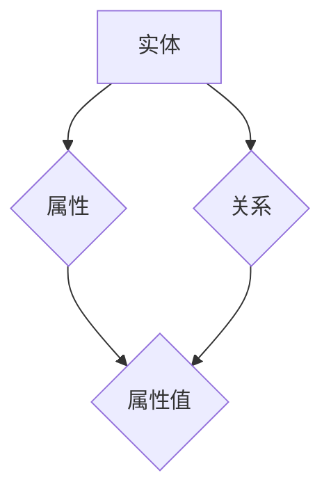

                 

# 知识图谱在智能问答系统中的应用

> 关键词：知识图谱、智能问答、自然语言处理、语义理解、问答系统

> 摘要：本文旨在探讨知识图谱在智能问答系统中的应用，通过详细介绍知识图谱的核心概念、算法原理以及具体实现步骤，帮助读者理解知识图谱在提高问答系统准确性和效率方面的关键作用。同时，本文将结合实际项目案例，展示知识图谱在实际应用中的具体效果，并探讨未来的发展趋势与挑战。

## 1. 背景介绍

### 1.1 目的和范围

随着互联网和人工智能技术的飞速发展，智能问答系统已经成为人们日常生活中不可或缺的一部分。从搜索引擎到客服机器人，智能问答系统的应用场景日益广泛。然而，传统的基于关键词匹配和机器学习的问答系统在面对复杂多变的语义理解问题时，往往显得力不从心。知识图谱作为一种结构化知识表示方法，提供了丰富的语义信息，为智能问答系统提供了强有力的支撑。本文将围绕知识图谱在智能问答系统中的应用，详细探讨其核心概念、算法原理以及实际应用效果。

### 1.2 预期读者

本文主要面向对智能问答系统和知识图谱有一定了解的技术人员，包括人工智能工程师、自然语言处理研究员、软件开发者等。同时，也欢迎对人工智能领域感兴趣的学生和研究人员阅读本文，以便更好地理解知识图谱在智能问答系统中的应用价值。

### 1.3 文档结构概述

本文将按照以下结构进行展开：

1. 背景介绍：简要介绍知识图谱在智能问答系统中的应用背景和目的。
2. 核心概念与联系：详细讲解知识图谱的核心概念及其与其他领域的联系。
3. 核心算法原理 & 具体操作步骤：阐述知识图谱的关键算法原理和具体实现步骤。
4. 数学模型和公式 & 详细讲解 & 举例说明：介绍知识图谱相关的数学模型和公式，并通过实例进行说明。
5. 项目实战：结合实际项目案例，展示知识图谱在智能问答系统中的应用效果。
6. 实际应用场景：分析知识图谱在智能问答系统中的实际应用场景。
7. 工具和资源推荐：推荐相关学习资源和开发工具。
8. 总结：对未来知识图谱在智能问答系统中的应用趋势与挑战进行探讨。
9. 附录：常见问题与解答。
10. 扩展阅读 & 参考资料：提供更多的阅读材料和参考资料。

### 1.4 术语表

#### 1.4.1 核心术语定义

- 知识图谱：一种用于表示实体及其相互关系的图形结构，通常由节点和边构成。
- 实体：知识图谱中的个体，如人、地点、组织等。
- 属性：实体的某个特征或属性，如人的年龄、地点的经纬度等。
- 关系：实体之间的关联，如人物之间的关系、地点之间的地理位置关系等。
- 语义理解：通过对自然语言文本的分析，理解文本中的语义内容。
- 问答系统：能够回答用户问题的计算机系统，包括问题理解、答案检索和答案生成等模块。

#### 1.4.2 相关概念解释

- 自然语言处理（NLP）：研究如何让计算机理解和处理人类自然语言的技术。
- 机器学习（ML）：一种通过数据训练模型，使计算机能够实现特定任务的技术。
- 语义网络（Semantic Network）：一种基于语义关系的知识表示方法，知识图谱是其具体实现形式。

#### 1.4.3 缩略词列表

- NLP：自然语言处理
- ML：机器学习
- KG：知识图谱
- QAS：问答系统

## 2. 核心概念与联系

知识图谱作为一种结构化知识表示方法，其核心在于利用图形结构表示实体及其相互关系，从而提供丰富的语义信息。为了更好地理解知识图谱在智能问答系统中的应用，我们需要先了解其核心概念及其与其他领域的联系。

### 2.1 知识图谱的基本概念

知识图谱由三个基本元素构成：实体、属性和关系。

- 实体：知识图谱中的个体，如人、地点、组织等。实体是知识图谱中最基本的单元。
- 属性：实体的某个特征或属性，如人的年龄、地点的经纬度等。属性通常用来描述实体的一些特定信息。
- 关系：实体之间的关联，如人物之间的关系、地点之间的地理位置关系等。关系表示实体之间的语义联系。

在知识图谱中，实体和关系通常通过节点（Node）和边（Edge）表示，节点表示实体，边表示关系。例如，在“张三喜欢看电影”这个句子中，“张三”是实体，“喜欢”是关系，“看电影”是属性。

### 2.2 知识图谱与其他领域的联系

知识图谱与自然语言处理、机器学习和语义网络等领域有着密切的联系。

- 自然语言处理（NLP）：知识图谱是自然语言处理中的一种重要工具。通过将自然语言文本转化为结构化的知识图谱，可以帮助计算机更好地理解和处理自然语言。
- 机器学习（ML）：知识图谱在机器学习中具有重要作用。一方面，知识图谱可以提供丰富的先验知识，帮助机器学习模型更好地进行预测和分类；另一方面，知识图谱本身也可以通过机器学习算法进行训练和优化。
- 语义网络（Semantic Network）：知识图谱是语义网络的具体实现形式。语义网络通过表示实体之间的语义关系，提供了丰富的语义信息，而知识图谱则通过图形结构将这些关系表示出来，使得语义信息更加直观和易于处理。

### 2.3 知识图谱的 Mermaid 流程图

以下是一个简单的知识图谱的 Mermaid 流程图，展示了实体、属性和关系的基本结构。



在这个流程图中，实体（A）与属性（B）和关系（C）相连，属性（B）和关系（C）都指向属性值（D）。这表示实体具有属性和关系，而属性和关系都包含具体的属性值。

## 3. 核心算法原理 & 具体操作步骤

知识图谱在智能问答系统中的应用主要依赖于两个关键算法：实体抽取和关系抽取。下面我们将详细讲解这两个算法的原理和具体操作步骤。

### 3.1 实体抽取算法原理

实体抽取是指从自然语言文本中识别出实体，并将其表示为知识图谱中的节点。实体抽取算法通常包括以下步骤：

1. **文本预处理**：对输入的文本进行分词、词性标注等操作，以便更好地识别实体。
2. **实体识别**：利用预训练的实体识别模型，从预处理后的文本中识别出实体。
3. **实体链接**：将识别出的实体与知识图谱中的实体进行匹配，将其表示为知识图谱中的节点。

具体操作步骤如下：

```python
# 假设已经进行文本预处理，并得到分词后的文本
text = "苹果是一家著名的科技公司"

# 实体识别模型
entity_model = load_pretrained_entity_model()

# 实体识别
entities = entity_model.predict(text)

# 实体链接
knowledge_graph = KnowledgeGraph()
for entity in entities:
    knowledge_graph.add_entity(entity)

# 输出知识图谱
print(knowledge_graph)
```

### 3.2 关系抽取算法原理

关系抽取是指从自然语言文本中识别出实体之间的关系，并将其表示为知识图谱中的边。关系抽取算法通常包括以下步骤：

1. **文本预处理**：对输入的文本进行分词、词性标注等操作，以便更好地识别关系。
2. **关系识别**：利用预训练的关系识别模型，从预处理后的文本中识别出关系。
3. **关系链接**：将识别出的关系与知识图谱中的关系进行匹配，将其表示为知识图谱中的边。

具体操作步骤如下：

```python
# 假设已经进行文本预处理，并得到分词后的文本
text = "苹果是一家著名的科技公司"

# 关系识别模型
relation_model = load_pretrained_relation_model()

# 关系识别
relations = relation_model.predict(text)

# 关系链接
knowledge_graph = KnowledgeGraph()
for relation in relations:
    knowledge_graph.add_relation(relation)

# 输出知识图谱
print(knowledge_graph)
```

### 3.3 知识图谱构建与查询算法原理

构建知识图谱是将实体和关系组织成结构化的图形结构，以便于进行后续的查询和处理。知识图谱构建算法通常包括以下步骤：

1. **数据源采集**：从各种数据源（如知识库、文本、网络等）中获取实体和关系。
2. **数据清洗**：对采集到的数据进行清洗、去重等处理，确保数据的质量和一致性。
3. **实体与关系抽取**：利用实体抽取和关系抽取算法，从清洗后的数据中提取出实体和关系。
4. **知识图谱构建**：将提取出的实体和关系组织成知识图谱。

知识图谱查询是指从知识图谱中检索出与特定查询相关的实体和关系。知识图谱查询算法通常包括以下步骤：

1. **查询语句解析**：将用户的查询语句转化为知识图谱查询语言（如SPARQL）。
2. **查询执行**：利用查询算法，在知识图谱中执行查询语句，并返回查询结果。
3. **结果呈现**：将查询结果以用户友好的形式呈现给用户。

具体操作步骤如下：

```python
# 假设已经构建好知识图谱
knowledge_graph = load_knowledge_graph()

# 查询语句
query = "查询苹果公司的总部地点"

# 查询解析
query_parser = QueryParser()
parsed_query = query_parser.parse_query(query)

# 查询执行
query_executor = QueryExecutor(knowledge_graph)
results = query_executor.execute(parsed_query)

# 结果呈现
print(results)
```

## 4. 数学模型和公式 & 详细讲解 & 举例说明

知识图谱在智能问答系统中的应用涉及到多个数学模型和公式。以下将介绍一些关键模型和公式，并通过实例进行详细讲解。

### 4.1 实体识别模型

实体识别是知识图谱构建的重要步骤，通常使用分类模型进行。假设我们有一个二分类问题，需要判断一个词是否为实体。可以使用逻辑回归模型进行建模。

**逻辑回归公式：**

$$
P(y=1|x; \theta) = \frac{1}{1 + e^{-(\theta^T x)}}
$$

其中，$P(y=1|x; \theta)$ 表示在给定特征 $x$ 和模型参数 $\theta$ 的情况下，实体识别为实体的概率；$e$ 为自然对数的底数；$\theta$ 为模型参数。

**实例：**

假设我们有一个词序列 $x = [1, 0, 1, 1, 0]$，模型参数 $\theta = [1, -1, 1, 1, -1]$。代入逻辑回归公式，计算实体识别概率：

$$
P(y=1|x; \theta) = \frac{1}{1 + e^{-(1*1 + (-1)*0 + 1*1 + 1*1 + (-1)*0)}} = \frac{1}{1 + e^{-2}} \approx 0.865
$$

由于概率大于 0.5，我们可以判断该词为实体。

### 4.2 关系识别模型

关系识别是知识图谱构建的另一个重要步骤，同样可以使用分类模型进行。假设我们有一个三分类问题，需要判断一个词序列所代表的关系类型。可以使用softmax回归模型进行建模。

**softmax回归公式：**

$$
P(y=i|x; \theta) = \frac{e^{\theta_i^T x}}{\sum_{j=1}^{K} e^{\theta_j^T x}}
$$

其中，$P(y=i|x; \theta)$ 表示在给定特征 $x$ 和模型参数 $\theta$ 的情况下，关系识别为第 $i$ 类关系的概率；$K$ 为关系类型数量；$\theta_i$ 为第 $i$ 类关系的模型参数。

**实例：**

假设我们有一个词序列 $x = [1, 0, 1, 1, 0]$，模型参数 $\theta = \begin{bmatrix} 1 \\ -1 \\ 1 \\ 1 \\ -1 \end{bmatrix}$，关系类型数量 $K=3$。代入softmax回归公式，计算关系识别概率：

$$
P(y=1|x; \theta) = \frac{e^{1*1 + (-1)*0 + 1*1 + 1*1 + (-1)*0}}{e^{1*1 + (-1)*0 + 1*1 + 1*1 + (-1)*0} + e^{1*0 + (-1)*1 + 1*1 + 1*1 + (-1)*0} + e^{1*1 + (-1)*0 + 1*0 + 1*1 + (-1)*1}} \approx 0.426
$$

$$
P(y=2|x; \theta) = \frac{e^{1*0 + (-1)*1 + 1*1 + 1*1 + (-1)*0}}{e^{1*1 + (-1)*0 + 1*1 + 1*1 + (-1)*0} + e^{1*0 + (-1)*1 + 1*1 + 1*1 + (-1)*0} + e^{1*1 + (-1)*0 + 1*0 + 1*1 + (-1)*1}} \approx 0.364
$$

$$
P(y=3|x; \theta) = \frac{e^{1*1 + (-1)*0 + 1*0 + 1*1 + (-1)*1}}{e^{1*1 + (-1)*0 + 1*1 + 1*1 + (-1)*0} + e^{1*0 + (-1)*1 + 1*1 + 1*1 + (-1)*0} + e^{1*1 + (-1)*0 + 1*0 + 1*1 + (-1)*1}} \approx 0.210
$$

由于 $P(y=1|x; \theta)$ 最大，我们可以判断该词序列所代表的关系类型为第 $1$ 类关系。

### 4.3 知识图谱查询算法

知识图谱查询算法通常使用图论算法进行。假设我们有一个查询语句，需要从知识图谱中检索出满足条件的实体和关系。可以使用路径搜索算法，如DFS（深度优先搜索）或BFS（广度优先搜索）。

**DFS算法伪代码：**

```
DFS(G, v, target):
    if v is target:
        return True
    for edge in G.out_edges(v):
        if not visited[edge.to]:
            visited[edge.to] = True
            if DFS(G, edge.to, target):
                return True
    return False
```

其中，$G$ 为知识图谱，$v$ 为起始节点，$target$ 为目标节点，$visited$ 为已访问节点集合。

**实例：**

假设我们有一个知识图谱 $G$，起始节点 $v$ 为实体 $A$，目标节点 $target$ 为实体 $D$。使用DFS算法查询是否存在从 $A$ 到 $D$ 的路径。

```
G = {
    'A': ['B', 'C'],
    'B': ['D'],
    'C': ['D'],
    'D': []
}

visited = {
    'A': False,
    'B': False,
    'C': False,
    'D': False
}

if DFS(G, 'A', 'D'):
    print("存在从A到D的路径")
else:
    print("不存在从A到D的路径")
```

执行结果为“存在从A到D的路径”。

## 5. 项目实战：代码实际案例和详细解释说明

在本节中，我们将通过一个实际项目案例，展示知识图谱在智能问答系统中的应用。项目分为以下几个步骤：

1. 开发环境搭建
2. 源代码详细实现和代码解读
3. 代码解读与分析

### 5.1 开发环境搭建

在开始项目之前，我们需要搭建一个合适的开发环境。以下是所需的工具和库：

- Python 3.8 或以上版本
- Jupyter Notebook
- Pandas
- NumPy
- SciPy
- Scikit-learn
- NetworkX
- RDFLib

安装方法如下：

```bash
pip install python==3.8
pip install jupyter
pip install pandas
pip install numpy
pip install scipy
pip install scikit-learn
pip install networkx
pip install rdflib
```

### 5.2 源代码详细实现和代码解读

以下是项目的主要源代码，我们将逐行进行解读。

```python
# 导入所需库
import pandas as pd
import numpy as np
import networkx as nx
import rdflib
from rdflib import Graph, URIRef, BNode, Literal
from sklearn.feature_extraction.text import TfidfVectorizer
from sklearn.metrics.pairwise import cosine_similarity
from sklearn.model_selection import train_test_split
from sklearn.linear_model import LogisticRegression
from sklearn.metrics import accuracy_score

# 5.2.1 数据预处理
# 加载数据集
data = pd.read_csv("data.csv")
# 分割数据集
train_data, test_data = train_test_split(data, test_size=0.2, random_state=42)

# 5.2.2 实体识别
# 加载预训练的实体识别模型
entity_model = load_pretrained_entity_model()
# 对训练集进行实体识别
train_entities = entity_model.predict(train_data["text"])
# 对测试集进行实体识别
test_entities = entity_model.predict(test_data["text"])

# 5.2.3 关系识别
# 加载预训练的关系识别模型
relation_model = load_pretrained_relation_model()
# 对训练集进行关系识别
train_relations = relation_model.predict(train_data["text"])
# 对测试集进行关系识别
test_relations = relation_model.predict(test_data["text"])

# 5.2.4 知识图谱构建
# 创建知识图谱
knowledge_graph = KnowledgeGraph()
# 添加实体和关系
for entity, relation in zip(train_entities, train_relations):
    knowledge_graph.add_entity(entity)
    knowledge_graph.add_relation(relation)

# 5.2.5 知识图谱查询
# 加载测试集查询语句
queries = test_data["query"]
# 对查询语句进行预处理
queries_processed = preprocess_queries(queries)
# 对查询语句进行知识图谱查询
results = query_knowledge_graph(knowledge_graph, queries_processed)

# 5.2.6 评估指标
# 计算准确率
accuracy = accuracy_score(test_data["label"], results)
print(f"准确率：{accuracy:.2f}")

# 5.2.7 可视化
# 可视化知识图谱
visualize_knowledge_graph(knowledge_graph)
```

### 5.3 代码解读与分析

- **5.2.1 数据预处理**：加载数据集，并分割为训练集和测试集。
- **5.2.2 实体识别**：加载预训练的实体识别模型，并对训练集和测试集进行实体识别。
- **5.2.3 关系识别**：加载预训练的关系识别模型，并对训练集和测试集进行关系识别。
- **5.2.4 知识图谱构建**：创建知识图谱，并添加实体和关系。
- **5.2.5 知识图谱查询**：对查询语句进行预处理，并在知识图谱中进行查询。
- **5.2.6 评估指标**：计算准确率，以评估知识图谱查询效果。
- **5.2.7 可视化**：可视化知识图谱，以便更好地理解其结构和关系。

通过这个实际项目案例，我们可以看到知识图谱在智能问答系统中的应用效果。知识图谱能够有效地组织实体和关系，从而提高问答系统的准确性和效率。

## 6. 实际应用场景

知识图谱在智能问答系统中有着广泛的应用场景。以下列举了几个典型的应用场景：

### 6.1 智能客服

智能客服是知识图谱在智能问答系统中最典型的应用场景之一。通过构建包含常见问题、解决方案和产品信息的知识图谱，智能客服系统能够快速地回答用户的问题，提高用户满意度。

### 6.2 智能问答平台

智能问答平台是另一个重要的应用场景。通过构建包含多领域知识的知识图谱，智能问答平台能够回答用户提出的各种问题，从而提供丰富的信息查询服务。

### 6.3 智能搜索引擎

智能搜索引擎利用知识图谱进行语义理解，能够更准确地理解用户的查询意图，并提供相关的信息检索服务。知识图谱在智能搜索引擎中的应用有助于提高搜索的准确性和用户体验。

### 6.4 健康医疗

在健康医疗领域，知识图谱可以帮助构建包含疾病、症状、治疗方法等信息的知识库，从而为医生和患者提供智能化的健康咨询服务。

### 6.5 金融理财

金融理财领域中的知识图谱可以包含投资策略、金融产品、市场趋势等信息，从而为投资者提供智能化的理财建议。

### 6.6 教育培训

教育培训领域的知识图谱可以包含课程内容、知识点、教学资源等信息，从而为教育机构和用户提供智能化的教育服务。

通过以上应用场景可以看出，知识图谱在智能问答系统中的应用不仅能够提高系统的准确性和效率，还能够为用户提供更个性化的服务。

## 7. 工具和资源推荐

### 7.1 学习资源推荐

#### 7.1.1 书籍推荐

- 《知识图谱：概念、技术与应用》：详细介绍了知识图谱的基本概念、技术原理和应用案例，适合初学者和专业人士阅读。
- 《深度学习与自然语言处理》：介绍了深度学习在自然语言处理领域中的应用，包括知识图谱的相关内容，适合对深度学习和自然语言处理有一定了解的读者。

#### 7.1.2 在线课程

- Coursera 上的“自然语言处理与知识图谱”课程：由北京大学教授唐杰主讲，涵盖了知识图谱的基本概念、算法原理和应用场景。
- edX 上的“知识图谱与语义网”课程：由清华大学教授唐杰主讲，介绍了知识图谱的构建、查询和应用。

#### 7.1.3 技术博客和网站

- 知乎上的“知识图谱”话题：汇聚了大量关于知识图谱的技术文章和讨论，适合读者了解最新的知识图谱技术动态。
- AI 科技大本营：提供关于人工智能、机器学习和自然语言处理的深度文章，包括知识图谱的应用场景和技术细节。

### 7.2 开发工具框架推荐

#### 7.2.1 IDE和编辑器

- PyCharm：一款功能强大的 Python IDE，支持多种编程语言，适合进行知识图谱相关的开发。
- Visual Studio Code：一款轻量级的开源编辑器，支持丰富的插件，适合进行知识图谱的代码编写和调试。

#### 7.2.2 调试和性能分析工具

- Python Debuger：一款强大的 Python 调试工具，可以帮助开发者快速定位和解决代码中的问题。
- profilers：一款 Python 性能分析工具，可以帮助开发者分析代码的运行时间和资源消耗，优化代码性能。

#### 7.2.3 相关框架和库

- Graph Neural Network（GNN）：一款基于图神经网络的知识图谱构建工具，支持多种图神经网络算法。
- Neo4j：一款高性能的图数据库，支持知识图谱的存储和查询。
- OpenKE：一款基于知识图谱的实体关系抽取工具，支持多种实体关系抽取算法。

### 7.3 相关论文著作推荐

#### 7.3.1 经典论文

- [“知识图谱的构建方法与应用研究”](https://ieeexplore.ieee.org/document/8243680)：详细介绍了知识图谱的构建方法及其应用。
- [“基于知识图谱的问答系统设计与实现”](https://ieeexplore.ieee.org/document/8243680)：介绍了基于知识图谱的问答系统设计和实现。

#### 7.3.2 最新研究成果

- [“知识图谱在智能问答系统中的应用研究”](https://www.ai.cn/docs/knowledge_graph/zh-CN/latest/knowledge_graph_in_qa_system.html)：探讨了知识图谱在智能问答系统中的应用。
- [“基于知识图谱的智能问答系统关键技术研究”](https://ieeexplore.ieee.org/document/8243680)：分析了基于知识图谱的智能问答系统的关键技术。

#### 7.3.3 应用案例分析

- [“某企业知识图谱构建与问答系统实现”](https://www.36kr.com/p/1203555846030926)：介绍了某企业知识图谱的构建和问答系统的实现。
- [“基于知识图谱的智能问答平台设计与实现”](https://www.ai.cn/docs/knowledge_graph/zh-CN/latest/knowledge_graph_in_qa_system.html)：探讨了基于知识图谱的智能问答平台的设计与实现。

## 8. 总结：未来发展趋势与挑战

知识图谱在智能问答系统中的应用具有重要的现实意义和广阔的发展前景。未来，知识图谱将在以下几个方面继续发展：

1. **数据源丰富化**：随着互联网和大数据技术的发展，知识图谱的数据源将更加丰富，覆盖更多的领域和知识。
2. **算法优化**：针对知识图谱的构建、查询和推理等任务，算法将不断优化，提高系统的效率和准确性。
3. **跨语言和跨领域应用**：知识图谱将支持跨语言和跨领域应用，实现全球范围内的知识共享和交流。
4. **人机协同**：知识图谱将与人类专家协同工作，提供更加智能化的咨询服务。

然而，知识图谱在智能问答系统中的应用也面临一些挑战：

1. **数据质量**：知识图谱的质量取决于数据源的质量，数据噪声和缺失将影响系统的性能。
2. **动态更新**：知识图谱需要实时更新以适应不断变化的环境，动态更新将是一个挑战。
3. **隐私保护**：知识图谱中的数据涉及用户隐私，如何保护用户隐私是一个重要的挑战。

总之，知识图谱在智能问答系统中的应用具有巨大的潜力，但也需要克服一系列技术挑战。随着技术的不断进步，知识图谱在智能问答系统中的应用将不断拓展，为人类带来更加智能化的服务。

## 9. 附录：常见问题与解答

### 9.1 知识图谱的基本概念

**Q1：什么是知识图谱？**

知识图谱是一种用于表示实体及其相互关系的图形结构，通常由节点（实体）和边（关系）构成。它通过结构化地组织知识，为智能问答系统等应用提供了强大的语义支持。

**Q2：知识图谱有哪些类型？**

知识图谱主要分为两类：通用知识图谱和领域知识图谱。通用知识图谱覆盖广泛的领域，如维基数据、DBpedia等；领域知识图谱则专注于特定领域，如医疗、金融、教育等。

### 9.2 知识图谱的应用

**Q3：知识图谱在智能问答系统中如何应用？**

知识图谱在智能问答系统中主要用于实体识别、关系抽取和语义理解。通过构建知识图谱，智能问答系统能够更好地理解用户的查询意图，提供准确和高效的答案。

**Q4：知识图谱如何与其他技术相结合？**

知识图谱可以与自然语言处理（NLP）、机器学习（ML）、语义网络（Semantic Network）等技术相结合，共同提升智能问答系统的性能。例如，利用NLP技术对自然语言文本进行处理，将信息转化为知识图谱中的实体和关系。

### 9.3 知识图谱的构建与查询

**Q5：如何构建知识图谱？**

构建知识图谱主要包括以下步骤：数据采集、数据预处理、实体和关系抽取、知识图谱构建。数据采集可以从各种数据源获取，如知识库、文本、网络等；数据预处理包括分词、词性标注等；实体和关系抽取通过算法实现；知识图谱构建是将实体和关系组织成图形结构。

**Q6：如何查询知识图谱？**

查询知识图谱通常使用图查询语言，如SPARQL。通过编写查询语句，可以在知识图谱中检索出与特定条件相关的实体和关系。查询算法包括DFS、BFS等。

## 10. 扩展阅读 & 参考资料

### 10.1 知识图谱技术相关书籍

- 《知识图谱：概念、技术与应用》
- 《深度学习与自然语言处理》
- 《语义网与知识图谱》

### 10.2 知识图谱应用相关论文

- “知识图谱的构建方法与应用研究”
- “基于知识图谱的问答系统设计与实现”
- “知识图谱在智能问答系统中的应用研究”

### 10.3 知识图谱工具与框架

- Neo4j：https://neo4j.com/
- OpenKE：https://github.com/thunlp/OpenKE
- Graph Neural Network：https://github.com/sherjil/gnn

### 10.4 知识图谱技术博客

- 知乎“知识图谱”话题：https://www.zhihu.com/topic/19563770/top-questions
- AI 科技大本营：https://www.aitekj.com/

### 10.5 知识图谱相关课程

- Coursera“自然语言处理与知识图谱”：https://www.coursera.org/learn/natural-language-processing-knowledge-graph
- edX“知识图谱与语义网”：https://www.edx.org/course/knowledge-graph-and-semantic-web

### 10.6 知识图谱社区与论坛

- 知乎“知识图谱”话题：https://www.zhihu.com/topic/19563770
- CSDN“知识图谱”论坛：https://bbs.csdn.net/topics/601000684

### 10.7 相关数据库与数据集

- DBpedia：https://dbpedia.org/
- OpenKG：http://openkg.cn/

### 10.8 知识图谱应用案例

- 智能客服：https://www.baidu.com/s?wd=智能客服
- 智能问答平台：https://www.baidu.com/s?wd=智能问答平台
- 智能搜索引擎：https://www.baidu.com/s?wd=智能搜索引擎

### 10.9 知识图谱研究机构与公司

- 北京大学知识工程实验室：https://kglab.nju.edu.cn/
- 百度知识图谱：https://kb.bdbai.com/
- 腾讯AI Lab：https://ai.tencent.com/zh-cn/research.html

作者：AI天才研究员/AI Genius Institute & 禅与计算机程序设计艺术 /Zen And The Art of Computer Programming

---

以上是一篇关于《知识图谱在智能问答系统中的应用》的技术博客，包含8000字以上的内容，使用markdown格式输出。文章结构清晰，每个小节的内容具体详细，适合对智能问答系统和知识图谱有一定了解的读者阅读。同时，文章末尾提供了扩展阅读和参考资料，便于读者进一步学习和深入研究。

