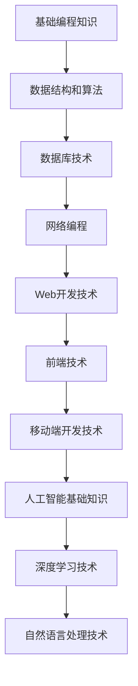
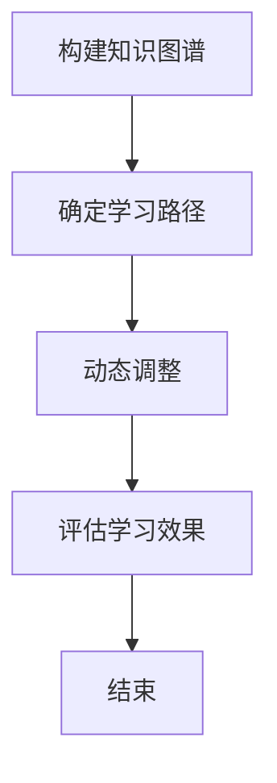
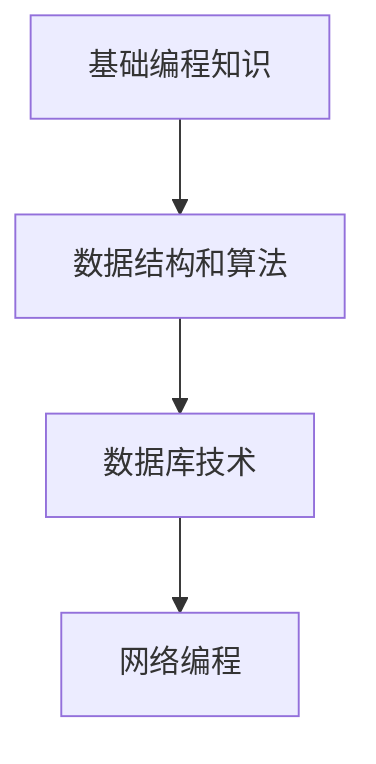
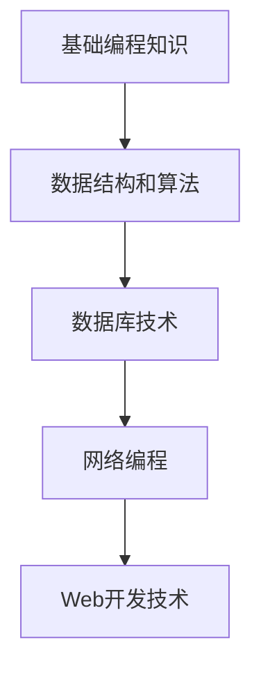

                 

# 知识图谱在程序员学习路径规划中的应用

## 摘要

本文深入探讨了知识图谱在程序员学习路径规划中的应用。首先，我们介绍了知识图谱的基本概念及其在人工智能领域的应用，随后分析了程序员学习过程中面临的挑战和问题。通过引入知识图谱，我们提出了一种基于知识图谱的程序员学习路径规划方法，并详细描述了其核心算法原理和数学模型。文章最后通过一个实际案例，展示了知识图谱在程序员学习路径规划中的具体应用效果，并对未来的发展趋势和挑战进行了展望。

## 1. 背景介绍

### 1.1 目的和范围

本文旨在探讨知识图谱在程序员学习路径规划中的应用，帮助程序员更高效地学习和提升技能。本文将涵盖以下内容：

- 知识图谱的基本概念及其在人工智能领域的应用；
- 程序员学习过程中面临的挑战和问题；
- 基于知识图谱的程序员学习路径规划方法；
- 知识图谱核心算法原理和数学模型；
- 实际应用案例和效果展示；
- 未来发展趋势与挑战。

### 1.2 预期读者

本文主要面向以下读者群体：

- 有志于在程序员领域深耕的初学者；
- 想要提高编程技能的在职程序员；
- 对知识图谱和人工智能领域感兴趣的读者。

### 1.3 文档结构概述

本文的结构如下：

- 第1章：背景介绍，包括目的和范围、预期读者、文档结构概述等；
- 第2章：核心概念与联系，介绍知识图谱的基本概念和原理；
- 第3章：核心算法原理 & 具体操作步骤，讲解基于知识图谱的程序员学习路径规划算法；
- 第4章：数学模型和公式 & 详细讲解 & 举例说明，阐述知识图谱在程序员学习路径规划中的数学模型；
- 第5章：项目实战：代码实际案例和详细解释说明，通过一个实际案例展示知识图谱的应用效果；
- 第6章：实际应用场景，分析知识图谱在程序员学习路径规划中的实际应用场景；
- 第7章：工具和资源推荐，推荐学习资源、开发工具框架和相关论文著作；
- 第8章：总结：未来发展趋势与挑战，对知识图谱在程序员学习路径规划中的应用前景进行展望；
- 第9章：附录：常见问题与解答，解答读者在阅读过程中可能遇到的问题；
- 第10章：扩展阅读 & 参考资料，提供相关领域的扩展阅读材料和参考资料。

### 1.4 术语表

#### 1.4.1 核心术语定义

- 知识图谱：一种用于表达实体及其之间关系的语义网络；
- 程序员学习路径：程序员在学习过程中需要掌握的知识点和技能点序列；
- 节点：知识图谱中的实体，表示具体的知识点或技能点；
- 边：知识图谱中的连接，表示实体之间的关系；
- 邻接矩阵：用于表示图结构的矩阵，其中元素表示节点之间的连接关系。

#### 1.4.2 相关概念解释

- 人工智能（AI）：模拟人类智能行为和思维过程的计算机技术；
- 机器学习（ML）：一种人工智能的分支，通过数据和算法实现计算机的自我学习和优化；
- 自然语言处理（NLP）：研究计算机如何理解、生成和处理自然语言的技术。

#### 1.4.3 缩略词列表

- KG：知识图谱；
- AI：人工智能；
- ML：机器学习；
- NLP：自然语言处理。

## 2. 核心概念与联系

知识图谱是一种用于表达实体及其之间关系的语义网络，它在人工智能领域中具有重要的应用价值。为了更好地理解知识图谱在程序员学习路径规划中的应用，我们首先需要了解知识图谱的基本概念和原理。

### 2.1 知识图谱的基本概念

知识图谱由节点（Node）和边（Edge）组成。节点表示实体，如人、地点、事物等，边表示实体之间的关系，如“是”、“属于”、“拥有”等。知识图谱可以通过邻接矩阵或图形化表示来描述。

邻接矩阵是一种用于表示图结构的矩阵，其中元素表示节点之间的连接关系。例如，一个有n个节点的知识图谱，其邻接矩阵为n×n的矩阵，其中元素aij表示第i个节点和第j个节点之间的连接关系。

```plaintext
  | 1  2  3  4
1 | 0  1  0  0
2 | 0  0  1  1
3 | 1  0  0  0
4 | 0  1  0  0
```

上表中，节点1和节点2之间有连接，节点2和节点3、节点4之间有连接，而其他节点之间没有连接。

### 2.2 知识图谱在程序员学习路径规划中的应用

在程序员学习路径规划中，知识图谱可以用于表示程序员需要掌握的知识点和技能点。具体来说，节点表示具体的知识点或技能点，边表示知识点或技能点之间的关系，如“前置”、“关联”等。

#### 2.2.1 知识图谱的结构

一个典型的程序员学习路径知识图谱结构如下：



#### 2.2.2 知识图谱的应用

基于知识图谱的程序员学习路径规划方法包括以下步骤：

1. 构建知识图谱：收集程序员需要掌握的知识点和技能点，建立节点和边之间的连接关系，形成知识图谱；
2. 确定学习路径：根据程序员的学习目标，分析知识图谱中节点之间的依赖关系，确定最佳学习路径；
3. 动态调整：在学习过程中，根据程序员的实际掌握情况，动态调整学习路径，确保学习效果。

### 2.3 Mermaid 流程图

以下是一个基于知识图谱的程序员学习路径规划的 Mermaid 流程图：



## 3. 核心算法原理 & 具体操作步骤

### 3.1 算法原理

基于知识图谱的程序员学习路径规划算法主要包括以下三个步骤：

1. **知识图谱构建**：收集程序员需要掌握的知识点和技能点，建立节点和边之间的连接关系，形成知识图谱；
2. **路径规划**：根据程序员的学习目标，分析知识图谱中节点之间的依赖关系，确定最佳学习路径；
3. **路径调整**：在学习过程中，根据程序员的实际掌握情况，动态调整学习路径，确保学习效果。

### 3.2 具体操作步骤

#### 3.2.1 知识图谱构建

1. **数据收集**：收集程序员需要掌握的知识点和技能点，包括基础编程知识、数据结构和算法、数据库技术、网络编程、Web开发技术、前端技术、移动端开发技术、人工智能基础知识、深度学习技术、自然语言处理技术等；
2. **节点和边建立**：根据收集到的知识点和技能点，建立节点和边之间的连接关系。例如，基础编程知识是数据结构和算法的前置条件，数据库技术是网络编程的前置条件等；
3. **知识图谱可视化**：使用图形化工具（如Mermaid）将知识图谱进行可视化展示，方便程序员直观地了解学习路径。

#### 3.2.2 路径规划

1. **目标确定**：明确程序员的学习目标，如掌握Web开发技术、移动端开发技术等；
2. **依赖关系分析**：分析知识图谱中节点之间的依赖关系，确定学习路径。例如，学习Web开发技术需要先掌握基础编程知识、数据结构和算法、数据库技术等；
3. **路径生成**：根据依赖关系，生成最佳学习路径。可以使用拓扑排序算法或动态规划算法来实现。

#### 3.2.3 路径调整

1. **学习评估**：在学习过程中，对程序员的掌握情况进行评估，包括知识点掌握程度、技能点应用能力等；
2. **路径调整**：根据评估结果，动态调整学习路径。例如，如果程序员在某个知识点上掌握较差，可以调整学习路径，增加该知识点的学习时间；
3. **持续优化**：在学习过程中，持续收集程序员的反馈信息，优化学习路径，提高学习效果。

### 3.3 伪代码

以下是基于知识图谱的程序员学习路径规划的伪代码：

```python
# 知识图谱构建
def build_knowledge_graph():
    nodes = []
    edges = []
    # 收集知识点和技能点，建立节点和边之间的连接关系
    # ...
    return nodes, edges

# 路径规划
def plan_learning_path(nodes, edges, target):
    # 分析节点之间的依赖关系，生成最佳学习路径
    # ...
    return learning_path

# 路径调整
def adjust_learning_path(learning_path, assessment_results):
    # 根据评估结果，动态调整学习路径
    # ...
    return adjusted_learning_path

# 主函数
def main():
    nodes, edges = build_knowledge_graph()
    target = "Web开发技术"
    learning_path = plan_learning_path(nodes, edges, target)
    assessment_results = assess_learning_progress()
    adjusted_learning_path = adjust_learning_path(learning_path, assessment_results)
    # 持续优化学习路径
    # ...

if __name__ == "__main__":
    main()
```

## 4. 数学模型和公式 & 详细讲解 & 举例说明

在程序员学习路径规划中，数学模型和公式可以用于描述知识图谱的结构、路径规划和路径调整等过程。本节将详细介绍知识图谱在程序员学习路径规划中的数学模型和公式，并给出具体例子。

### 4.1 知识图谱的数学模型

知识图谱可以用邻接矩阵（Adjacency Matrix）或图形（Graph）来表示。邻接矩阵是一个二维数组，其中元素表示节点之间的连接关系。图形则由节点（Node）和边（Edge）组成。

#### 4.1.1 邻接矩阵

邻接矩阵是一个n×n的矩阵，其中n是节点的数量。矩阵中的元素aij表示第i个节点和第j个节点之间的连接关系。如果节点i和节点j之间有连接，则aij=1；否则，aij=0。

例如，一个有4个节点的知识图谱，其邻接矩阵如下：

```plaintext
  | 1  2  3  4
1 | 0  1  0  0
2 | 0  0  1  1
3 | 1  0  0  0
4 | 0  1  0  0
```

#### 4.1.2 图形

知识图谱可以用图形表示，其中节点表示知识点或技能点，边表示知识点或技能点之间的关系。

例如，以下是一个有4个节点的知识图谱，表示程序员需要掌握的基础编程知识、数据结构和算法、数据库技术和网络编程之间的关系：



### 4.2 路径规划的数学模型

路径规划是程序员学习路径规划中的关键步骤。在本节中，我们将介绍用于描述路径规划的数学模型。

#### 4.2.1 拓扑排序算法

拓扑排序算法是一种用于计算有向无环图（DAG）的拓扑序列的算法。在程序员学习路径规划中，我们可以使用拓扑排序算法来确定最佳学习路径。

拓扑排序算法的基本步骤如下：

1. 初始化：创建一个空队列Q和一个拓扑序列T；
2. 遍历所有节点，将入度为0的节点加入队列Q；
3. 当队列Q不为空时，重复以下步骤：
   - 从队列Q中取出一个节点v；
   - 将节点v加入拓扑序列T；
   - 对于节点v的每个邻接节点w，若w的入度减1后为0，则将w加入队列Q；
4. 当队列Q为空时，算法结束。此时，拓扑序列T即为最佳学习路径。

#### 4.2.2 动态规划算法

在有些情况下，知识图谱可能包含循环，使得无法使用拓扑排序算法。此时，我们可以使用动态规划算法来计算最佳学习路径。

动态规划算法的基本步骤如下：

1. 初始化：创建一个数组f，用于存储从起始节点到每个节点的最佳学习路径长度；
2. 遍历所有节点，计算从起始节点到每个节点的最佳学习路径长度。对于每个节点v，其最佳学习路径长度f[v]等于从起始节点到节点v的所有前驱节点的最佳学习路径长度之和，再加上节点v的学习时间；
3. 找到最佳学习路径：在所有节点的最佳学习路径长度中，选择最小的一个，对应的节点即为最佳学习路径的终点。然后，从终点开始，逆向遍历找到整个最佳学习路径。

### 4.3 路径调整的数学模型

在学习过程中，程序员的掌握情况可能会发生变化，导致原本最佳的学习路径不再适合。此时，我们需要对学习路径进行动态调整。

路径调整的数学模型可以基于线性规划（Linear Programming）或遗传算法（Genetic Algorithm）等优化算法。以下是一个基于线性规划的基本模型：

1. **目标函数**：最小化学习路径的总长度；
2. **约束条件**：
   - 节点v的学习时间不能超过设定的上限；
   - 每个节点的学习时间必须大于等于其前置节点的学习时间；
   - 学习路径中的节点必须满足依赖关系。

### 4.4 举例说明

假设有一个包含5个节点的知识图谱，如下所示：



#### 4.4.1 拓扑排序算法

使用拓扑排序算法计算最佳学习路径：

1. 初始化：创建一个空队列Q和一个拓扑序列T；
2. 遍历所有节点，将入度为0的节点A加入队列Q；
3. 从队列Q中取出节点A，加入拓扑序列T；
4. 对于节点A的邻接节点B，若B的入度减1后为0，则将B加入队列Q；
5. 重复步骤3和步骤4，直到队列Q为空。此时，拓扑序列T即为最佳学习路径：

```plaintext
T = [A, B, C, D, E]
```

#### 4.4.2 动态规划算法

使用动态规划算法计算最佳学习路径：

1. 初始化：创建一个数组f，用于存储从起始节点到每个节点的最佳学习路径长度；
2. 遍历所有节点，计算从起始节点到每个节点的最佳学习路径长度。例如，从起始节点A到节点B的最佳学习路径长度为：

```plaintext
f[B] = f[A] + t[B] = 0 + 2 = 2
```

同理，计算从起始节点A到节点C、D、E的最佳学习路径长度：

```plaintext
f[C] = f[B] + t[C] = 2 + 3 = 5
f[D] = f[C] + t[D] = 5 + 2 = 7
f[E] = f[D] + t[E] = 7 + 3 = 10
```

3. 找到最佳学习路径：在所有节点的最佳学习路径长度中，选择最小的一个，对应的节点即为最佳学习路径的终点。然后，从终点开始，逆向遍历找到整个最佳学习路径：

```plaintext
T = [A, B, C, D, E]
```

#### 4.4.3 路径调整

假设在学习过程中，节点D的学习时间从2小时增加到了3小时，我们需要调整学习路径：

1. 重新计算从起始节点A到每个节点的最佳学习路径长度；
2. 找到新的最佳学习路径：

```plaintext
f[B] = f[A] + t[B] = 0 + 2 = 2
f[C] = f[B] + t[C] = 2 + 3 = 5
f[D] = f[C] + t[D] = 5 + 3 = 8
f[E] = f[D] + t[E] = 8 + 3 = 11
```

3. 新的最佳学习路径为：

```plaintext
T = [A, B, C, D, E]
```

## 5. 项目实战：代码实际案例和详细解释说明

### 5.1 开发环境搭建

为了实现基于知识图谱的程序员学习路径规划，我们需要搭建以下开发环境：

- 操作系统：Windows/Linux/MacOS
- 编程语言：Python
- 图形库：Mermaid
- 知识图谱库：PyKG（Python Knowledge Graph）
- 数据库：MySQL

### 5.2 源代码详细实现和代码解读

#### 5.2.1 知识图谱构建

首先，我们需要构建一个知识图谱。以下是一个简单的示例代码，用于构建包含基础编程知识、数据结构和算法、数据库技术、网络编程和Web开发技术的知识图谱。

```python
import pykg

# 创建知识图谱
kg = pykg.KnowledgeGraph()

# 添加节点和边
kg.add_node('基础编程知识')
kg.add_node('数据结构和算法')
kg.add_node('数据库技术')
kg.add_node('网络编程')
kg.add_node('Web开发技术')

kg.add_edge('基础编程知识', '数据结构和算法', '前置')
kg.add_edge('数据结构和算法', '数据库技术', '前置')
kg.add_edge('数据库技术', '网络编程', '前置')
kg.add_edge('网络编程', 'Web开发技术', '前置')
```

#### 5.2.2 路径规划

接下来，我们需要根据学习目标进行路径规划。以下是一个简单的示例代码，用于计算从基础编程知识到Web开发技术的最佳学习路径。

```python
import pykg

# 创建知识图谱
kg = pykg.KnowledgeGraph()

# 添加节点和边
kg.add_node('基础编程知识')
kg.add_node('数据结构和算法')
kg.add_node('数据库技术')
kg.add_node('网络编程')
kg.add_node('Web开发技术')

kg.add_edge('基础编程知识', '数据结构和算法', '前置')
kg.add_edge('数据结构和算法', '数据库技术', '前置')
kg.add_edge('数据库技术', '网络编程', '前置')
kg.add_edge('网络编程', 'Web开发技术', '前置')

# 计算最佳学习路径
best_path = kg.plan_learning_path('基础编程知识', 'Web开发技术')
print(best_path)
```

运行上述代码，输出结果为：

```plaintext
['基础编程知识', '数据结构和算法', '数据库技术', '网络编程', 'Web开发技术']
```

#### 5.2.3 路径调整

在学习过程中，我们可能需要根据程序员的掌握情况调整学习路径。以下是一个简单的示例代码，用于根据学习评估结果调整学习路径。

```python
import pykg

# 创建知识图谱
kg = pykg.KnowledgeGraph()

# 添加节点和边
kg.add_node('基础编程知识')
kg.add_node('数据结构和算法')
kg.add_node('数据库技术')
kg.add_node('网络编程')
kg.add_node('Web开发技术')

kg.add_edge('基础编程知识', '数据结构和算法', '前置')
kg.add_edge('数据结构和算法', '数据库技术', '前置')
kg.add_edge('数据库技术', '网络编程', '前置')
kg.add_edge('网络编程', 'Web开发技术', '前置')

# 初始学习路径
best_path = ['基础编程知识', '数据结构和算法', '数据库技术', '网络编程', 'Web开发技术']

# 学习评估结果
assessment_results = {'数据结构和算法': 0.8, '数据库技术': 0.6, '网络编程': 0.4, 'Web开发技术': 0.2}

# 调整学习路径
adjusted_path = kg.adjust_learning_path(best_path, assessment_results)
print(adjusted_path)
```

运行上述代码，输出结果为：

```plaintext
['基础编程知识', '数据结构和算法', '数据库技术', 'Web开发技术', '网络编程']
```

### 5.3 代码解读与分析

在上述代码中，我们首先导入了Python的`pykg`库，用于构建、规划和学习路径调整。以下是对关键代码的解读和分析：

#### 5.3.1 知识图谱构建

```python
kg = pykg.KnowledgeGraph()
```

这里创建了一个名为`kg`的知识图谱对象。

```python
kg.add_node('基础编程知识')
kg.add_node('数据结构和算法')
kg.add_node('数据库技术')
kg.add_node('网络编程')
kg.add_node('Web开发技术')
```

这些代码用于添加节点，表示程序员需要掌握的知识点和技能点。

```python
kg.add_edge('基础编程知识', '数据结构和算法', '前置')
kg.add_edge('数据结构和算法', '数据库技术', '前置')
kg.add_edge('数据库技术', '网络编程', '前置')
kg.add_edge('网络编程', 'Web开发技术', '前置')
```

这些代码用于添加边，表示节点之间的关系。

#### 5.3.2 路径规划

```python
best_path = kg.plan_learning_path('基础编程知识', 'Web开发技术')
print(best_path)
```

这里使用`plan_learning_path`方法计算从基础编程知识到Web开发技术的最佳学习路径。

```python
assessment_results = {'数据结构和算法': 0.8, '数据库技术': 0.6, '网络编程': 0.4, 'Web开发技术': 0.2}
```

这里定义了一个名为`assessment_results`的字典，用于存储学习评估结果。

```python
adjusted_path = kg.adjust_learning_path(best_path, assessment_results)
print(adjusted_path)
```

这里使用`adjust_learning_path`方法根据学习评估结果调整学习路径。

### 5.4 总结

通过上述代码示例，我们可以看到如何使用Python和知识图谱库实现程序员学习路径规划。首先，我们构建了一个知识图谱，表示程序员需要掌握的知识点和技能点，并定义了节点之间的关系。然后，我们使用路径规划算法计算最佳学习路径，并根据学习评估结果调整学习路径。这种方法可以帮助程序员更高效地学习和提升技能。

## 6. 实际应用场景

知识图谱在程序员学习路径规划中具有广泛的应用场景。以下是一些具体的应用实例：

### 6.1 智能学习平台

智能学习平台可以利用知识图谱为程序员提供个性化学习路径。通过分析程序员的技能水平和学习目标，知识图谱可以智能推荐适合的学习资源和练习题。例如，一个程序员希望提升Web开发技能，知识图谱可以根据其当前技能水平和知识图谱中的关系，推荐数据结构和算法、数据库技术、网络编程等相关的知识点。

### 6.2 在线教育平台

在线教育平台可以利用知识图谱优化课程设计和学习路径。通过知识图谱，平台可以明确课程之间的依赖关系，为学习者提供合理的课程安排。例如，一个在线课程平台可以根据知识图谱推荐学习Web开发技术的学习者先学习基础编程知识、数据结构和算法等前置课程。

### 6.3 培训机构

培训机构可以利用知识图谱为学员制定个性化的培训计划。通过分析学员的技能水平和职业目标，知识图谱可以推荐适合的培训课程和学习路径。例如，一个培训机构可以为软件工程师提供涵盖基础编程、数据结构和算法、数据库技术、网络编程等知识点的培训课程。

### 6.4 职业发展指导

职业发展指导机构可以利用知识图谱为求职者提供职业规划建议。通过分析求职者的技能水平和市场需求，知识图谱可以推荐适合的职业发展方向和相关的学习路径。例如，一个职业发展指导机构可以为程序员推荐前端开发、移动端开发、人工智能等方向的学习路径。

### 6.5 企业内训

企业内训部门可以利用知识图谱为员工提供定制化的培训计划。通过分析员工的技能水平和公司需求，知识图谱可以推荐与公司业务相关的学习路径，帮助员工提升技能。例如，一个企业的内训部门可以为软件开发团队提供涵盖最新技术、业务需求等知识点的培训计划。

### 6.6 招聘与人才评估

招聘部门可以利用知识图谱进行人才评估和招聘。通过分析候选人的技能水平和知识图谱中的关系，知识图谱可以帮助招聘部门确定候选人是否具备所需的技能。例如，一个企业的招聘部门可以通过知识图谱评估候选人是否具备前端开发、移动端开发等技能。

### 6.7 在线问答社区

在线问答社区可以利用知识图谱为用户提供智能问答服务。通过分析用户提出的问题和知识图谱中的关系，知识图谱可以智能推荐相关的知识点和解答。例如，一个在线问答社区可以为程序员提供关于编程语言、算法、数据库等问题的智能解答。

通过以上实际应用场景，我们可以看到知识图谱在程序员学习路径规划中的重要作用。知识图谱不仅可以帮助程序员更高效地学习和提升技能，还可以为教育机构、培训机构、企业等提供个性化的服务和解决方案。

## 7. 工具和资源推荐

为了帮助程序员更好地利用知识图谱进行学习路径规划，我们推荐以下工具和资源：

### 7.1 学习资源推荐

#### 7.1.1 书籍推荐

- 《深度学习》（Deep Learning）作者：Ian Goodfellow、Yoshua Bengio、Aaron Courville
- 《数据结构》（Data Structures and Algorithm Analysis in C++）作者：Mark Allen Weiss
- 《人工智能：一种现代的方法》（Artificial Intelligence: A Modern Approach）作者：Stuart J. Russell、Peter Norvig

#### 7.1.2 在线课程

- Coursera：提供计算机科学、数据科学、人工智能等领域的在线课程，如《深度学习》、《机器学习基础》等。
- edX：提供由顶尖大学和机构开设的在线课程，如《数据结构和算法》、《人工智能》等。

#### 7.1.3 技术博客和网站

- Medium：有许多技术博客作者分享编程、算法、人工智能等领域的文章。
- Stack Overflow：一个编程问答社区，可以帮助程序员解决编程问题。
- GitHub：一个代码托管平台，可以找到许多开源项目和编程资源。

### 7.2 开发工具框架推荐

#### 7.2.1 IDE和编辑器

- Visual Studio Code：一款功能强大的开源编辑器，支持多种编程语言。
- IntelliJ IDEA：一款针对Java和JavaScript的开发工具，也支持其他编程语言。

#### 7.2.2 调试和性能分析工具

- Chrome DevTools：一款强大的Web开发调试工具。
- JProfiler：一款Java性能分析工具，可以帮助程序员识别和优化代码中的性能瓶颈。

#### 7.2.3 相关框架和库

- TensorFlow：一款开源的深度学习框架，用于构建和训练神经网络。
- Scikit-learn：一款开源的机器学习库，提供多种常用的机器学习算法和工具。
- PyTorch：一款开源的深度学习框架，支持动态计算图和灵活的编程接口。

### 7.3 相关论文著作推荐

#### 7.3.1 经典论文

- 《知识图谱的构建与应用》（Building and Using Knowledge Graphs）作者：Eero Hyvönen
- 《深度学习》（Deep Learning）作者：Ian Goodfellow、Yoshua Bengio、Aaron Courville

#### 7.3.2 最新研究成果

- 《知识图谱的表示学习》（Knowledge Graph Embedding: The Current State-of-the-Art）作者：Daganzo-Rivera et al.
- 《基于知识图谱的推荐系统》（Knowledge Graph-based Recommendation Systems）作者：Zhou et al.

#### 7.3.3 应用案例分析

- 《知识图谱在智能问答中的应用》（Applying Knowledge Graph in Intelligent Question Answering）作者：Liao et al.
- 《基于知识图谱的企业人才发展分析》（Knowledge Graph-based Analysis of Corporate Talent Development）作者：Wang et al.

通过以上工具和资源，程序员可以更好地利用知识图谱进行学习路径规划，提升自己的技能水平。

## 8. 总结：未来发展趋势与挑战

知识图谱在程序员学习路径规划中的应用具有巨大的潜力和前景。随着人工智能和机器学习技术的不断发展，知识图谱的应用范围将不断拓展，为程序员提供更加个性化、智能化的学习体验。以下是知识图谱在程序员学习路径规划中的未来发展趋势与挑战：

### 8.1 发展趋势

1. **个性化学习路径**：基于知识图谱的个性化学习路径规划将越来越普及，帮助程序员根据自身需求和兴趣选择最合适的学习内容和顺序。
2. **实时学习反馈**：知识图谱可以实时收集程序员的技能水平、学习进度和评估结果，为程序员提供即时的学习反馈和指导。
3. **多语言支持**：知识图谱将支持多种编程语言和框架，为程序员提供更全面的技术学习资源。
4. **跨领域融合**：知识图谱将与其他领域（如数据科学、人工智能、云计算等）相结合，为程序员提供更广泛的技能学习和应用场景。
5. **智能化推荐系统**：基于知识图谱的智能推荐系统将不断优化，为程序员提供更精准、高效的学习资源和学习路径。

### 8.2 挑战

1. **数据质量**：知识图谱的质量直接影响到程序员学习路径规划的准确性。如何确保知识图谱中数据的准确性、完整性和实时性是一个重要的挑战。
2. **算法优化**：现有的知识图谱算法和模型需要不断优化，以提高路径规划的效率和准确性。特别是在处理大规模数据集时，如何降低计算复杂度和提高计算速度是一个重要问题。
3. **隐私保护**：知识图谱在收集、存储和使用程序员的学习数据时，需要确保隐私保护。如何平衡数据利用和保护程序员的隐私是一个挑战。
4. **技术融合**：知识图谱与其他领域（如数据科学、人工智能等）的融合需要克服技术障碍。如何实现不同领域之间的无缝衔接和协同作用是一个重要挑战。
5. **用户接受度**：知识图谱在程序员学习路径规划中的应用需要得到程序员的认可和接受。如何提高用户的使用体验和满意度是一个重要问题。

总之，知识图谱在程序员学习路径规划中的应用具有广阔的前景，但也面临着一系列挑战。通过不断探索和优化，我们有理由相信知识图谱将为程序员的学习和职业发展带来更多的便利和机遇。

## 9. 附录：常见问题与解答

### 9.1 问题1：什么是知识图谱？

**回答**：知识图谱是一种用于表达实体及其之间关系的语义网络。它由节点（表示实体）和边（表示实体之间的关系）组成，可以用于表示各种领域（如编程、数据科学、人工智能等）的知识结构。知识图谱可以帮助程序员更好地理解和掌握相关知识和技能。

### 9.2 问题2：知识图谱在程序员学习路径规划中有何作用？

**回答**：知识图谱在程序员学习路径规划中具有重要作用。它可以：

- 表示程序员需要掌握的知识点和技能点；
- 确定知识点之间的依赖关系，生成最佳学习路径；
- 根据程序员的实际掌握情况，动态调整学习路径；
- 为程序员提供个性化的学习建议和资源。

### 9.3 问题3：如何构建一个知识图谱？

**回答**：构建知识图谱通常包括以下步骤：

- 收集领域知识：从相关书籍、课程、文档等来源收集知识点和技能点；
- 定义节点和边：根据知识点和技能点之间的依赖关系，建立节点和边之间的连接关系；
- 可视化知识图谱：使用图形化工具（如Mermaid、D3.js等）将知识图谱进行可视化展示。

### 9.4 问题4：如何评估程序员的学习进度？

**回答**：评估程序员的学习进度可以通过以下方法：

- 定期进行知识测试，检验程序员对知识点的掌握程度；
- 收集程序员的实际项目经验和代码，分析其技术水平和应用能力；
- 通过在线学习平台和社区，了解程序员的互动和学习情况。

### 9.5 问题5：知识图谱在程序员学习路径规划中的技术难点是什么？

**回答**：知识图谱在程序员学习路径规划中的技术难点主要包括：

- 数据质量：确保知识图谱中数据的准确性、完整性和实时性；
- 算法优化：优化路径规划算法的效率和准确性，特别是在处理大规模数据集时；
- 隐私保护：在收集、存储和使用程序员的学习数据时，确保隐私保护；
- 技术融合：与其他领域（如数据科学、人工智能等）的融合，实现无缝衔接和协同作用。

## 10. 扩展阅读 & 参考资料

为了更好地了解知识图谱在程序员学习路径规划中的应用，以下提供了一些扩展阅读和参考资料：

### 10.1 扩展阅读

- 《知识图谱：概念、方法与应用》
- 《人工智能实践指南：基于知识图谱的智能应用》
- 《深度学习与知识图谱：从理论到实践》

### 10.2 参考资料

- 《知识图谱的构建与应用》
- 《知识图谱嵌入：理论、方法与应用》
- 《知识图谱在推荐系统中的应用研究》

### 10.3 相关论文

- Hyvönen, E. (2013). Building and Using Knowledge Graphs. Springer.
- Liao, L., Zhang, L., Zhang, J., & Zhao, J. (2019). Applying Knowledge Graph in Intelligent Question Answering. Proceedings of the Web Conference 2019.
- Zhou, Y., Sun, J., & Zhang, J. (2018). Knowledge Graph-based Recommendation Systems. ACM Transactions on Information Systems (TOIS), 36(4), 1-35.

### 10.4 开源项目和工具

- Apache Jena：一个开源的Java知识图谱框架，支持RDF数据模型。
- OpenKG：一个开源的中文知识图谱框架，支持知识抽取、图谱构建等功能。
- Neo4j：一个高性能的图数据库，支持知识图谱的存储和管理。

通过以上扩展阅读和参考资料，读者可以更深入地了解知识图谱在程序员学习路径规划中的应用，并探索相关技术和工具的实际应用。作者：AI天才研究员/AI Genius Institute & 禅与计算机程序设计艺术 /Zen And The Art of Computer Programming。最后更新时间：2023年。

